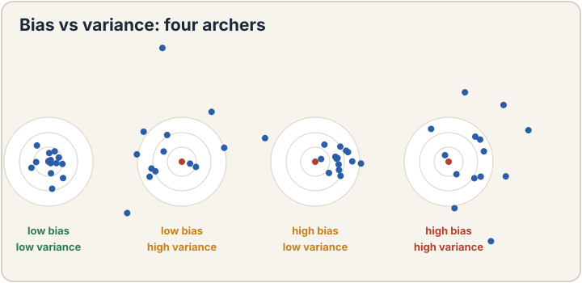
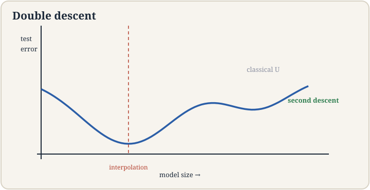
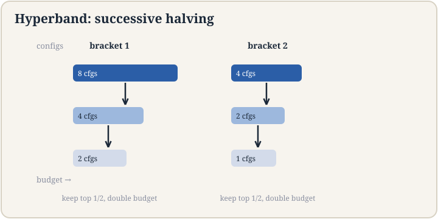
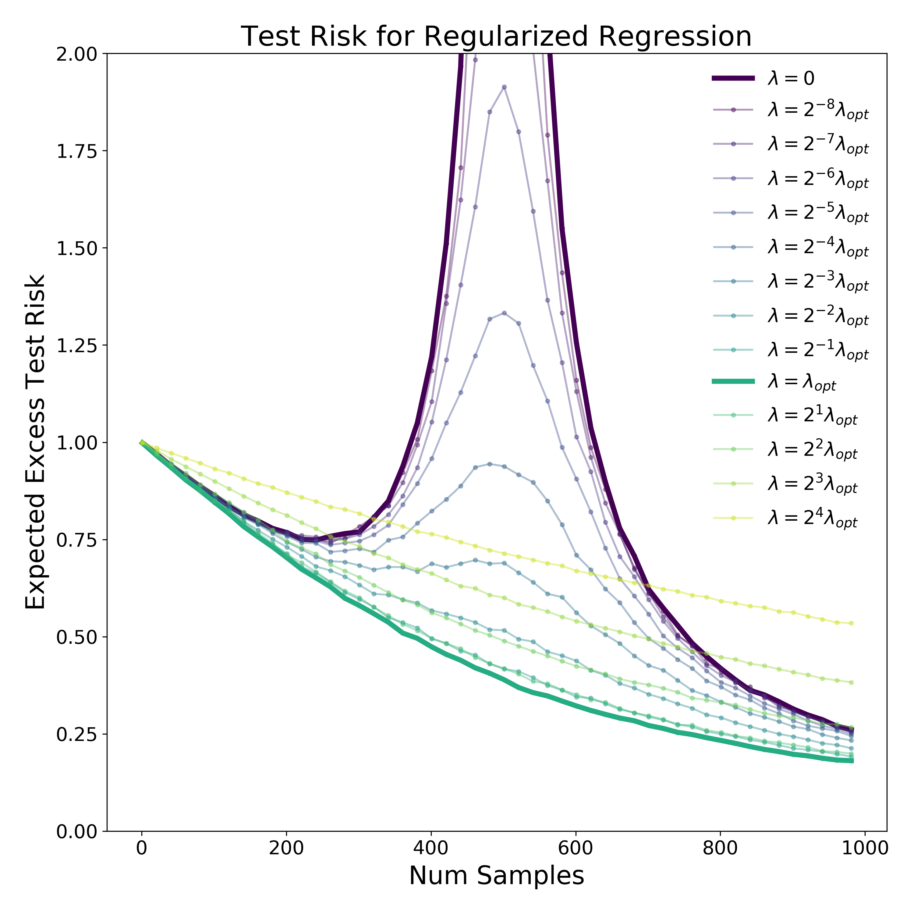
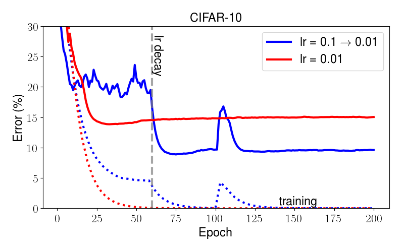

## How to read this lesson

This lesson has two levels. **Level 1 (Core)** contains what you need to
understand everything that follows in CS229 and the courses that build on
it. **Level 2 (Deep)** contains what you need for correct, interview-grade
understanding. Read Level 1 straight through. Return to Level 2 when you
want depth.

No prerequisites are assumed. Every term is defined at first use. Loss
functions and MLE were defined in [lectures 2](l02-linear-regression.html)
and [3](l03-logistic-regression.html); they are reused, not re-explained.

## Level 1: Bias and variance

Every model error decomposes into two parts [00:07](ts:00:07). **Bias**
is error from wrong assumptions: the model class cannot capture the
truth, no matter how much data arrives. A line fit to a curve has high
bias. **Variance** is error from sensitivity to the training sample: a
different dataset would give a very different model. A 1000-degree
polynomial through 10 points has high variance.

Think of four archers. Low bias, low variance: tight group on the
bullseye. Low bias, high variance: scattered around the bullseye, right
on average. High bias, low variance: tight group off target. High bias,
high variance: scattered and off. Simple models err toward bias. Complex
models err toward variance. **Regularization** [00:18](ts:00:18) is the
dial: penalize complexity to trade variance for bias.

The classical advice: test error follows a U curve in model complexity.
Too simple, bias dominates. Too complex, variance dominates. Pick the
bottom of the U. This canon ruled for decades. Then the next section
broke it.

> [!QA]
> Q: What is the bias-variance tradeoff?
> A: Total error splits into bias (wrong assumptions, too simple) plus variance (oversensitive to the sample, too complex) plus irreducible noise. Making the model more flexible reduces bias but raises variance. Regularization tunes the tradeoff. The classic picture is a U-shaped test-error curve with the best model at the bottom.
> Follow-up: Can you reduce both at once?
> A: Usually not by tuning complexity alone. But more data reduces variance without raising bias, and better features can reduce bias without raising variance. The tradeoff binds a fixed dataset and feature set. Change those and the whole curve shifts down.

## Level 1: Double descent

Modern practice broke the U curve. Keep adding parameters past the point
where the model perfectly fits the training data, the **interpolation**
point, and test error falls again. This is **double descent**
[01:18](ts:01:18), named in papers by Misha Belkin and coauthors
[63:54](ts:63:54).

Why: past interpolation, many parameter settings fit the training data
exactly. Gradient descent does not pick among them at random. It drifts
toward the **minimum-norm** solution [49:25](ts:49:25): the simplest fit,
in a precise sense. Ridge regression makes this explicit by penalizing
large weights. Bigger models plus the minimum-norm bias generalize better
than medium models stuck at the interpolation peak.

Related: **flat versus sharp minima**. A flat minimum keeps the loss low
under small parameter wiggles; a sharp one spikes. Flat minima tend to
generalize better, because test data moves the surface slightly and
flat regions survive the move. The lecture treats this as useful
intuition with active debate behind it, not as settled law.

> [!QA]
> Q: What is double descent?
> A: Test error falls, then rises to a peak at the interpolation threshold where the model just barely fits the training data, then falls again as parameters keep growing. Classical theory predicted only the first U. The second descent comes from the optimizer's bias toward minimum-norm solutions among the many perfect fits. It explains why enormous models can generalize.
> Follow-up: Does double descent mean bigger is always better?
> A: No. The second descent is a tendency, not a guarantee, and it costs compute. Past some size the gains flatten while the bills do not. The practical reading: do not fear overparameterization the way classical theory taught, but still measure test error instead of assuming.

## Level 1: Train, dev, test

Three splits, three jobs [02:59](ts:02:59). **Train**: fit parameters.
**Dev** (validation): pick hyperparameters and models. **Test**: report
the final score, once. The test set is locked away. Touch it during
development and it becomes a dev set: your decisions leak into it and the
score lies.

**K-fold cross-validation** [02:04](ts:02:04) is the small-data
discipline. Split the data into K chunks. Train on K-1, validate on the
rest, rotate, average. Every point serves as validation exactly once. It
costs K training runs and buys a stable estimate when data is scarce.

The cautionary tale is **adaptive overfitting**: ImageNet to ImageNet-V2
[01:41](ts:01:41). Years of models tuned against the same test set
adapted to its quirks. A fresh test set from the same distribution scored
everyone lower. The test set had become a dev set through collective
reuse. Benchmarks rot when the whole field shares one test set.

> [!QA]
> Q: Why three splits instead of two?
> A: Two splits conflate model selection with evaluation. Every time you pick a hyperparameter using the test set, you fit the test set a little. After enough picks, the test score measures your tuning skill, not the model. The dev set absorbs the tuning. The test set stays clean for one honest measurement at the end.
> Follow-up: What is the most common split mistake in industry?
> A: Time leakage. Splitting randomly when the data has time structure, so the model trains on the future and is tested on the past. Shuffling is for iid data. For temporal data, split by time: train on the past, test on the future, always.

## Level 1: Hyperband

Hyperparameters are the settings outside the model: learning rate, batch
size, regularization strength, architecture choices. Tuning them by hand
is slow. Grid search is wasteful: most configurations are obviously bad
after a little training.

**Hyperband** [02:14](ts:02:14) is successive halving with multiple
brackets. Try many configurations on a small budget. Keep the top half.
Double their budget. Repeat. Bad configurations die cheap. Good ones earn
more training. The brackets vary the starting tradeoff between many-cheap
and few-expensive trials.

The principle generalizes: allocate compute to promising candidates,
kill the rest early. It is the same instinct behind early stopping, and
it is how serious hyperparameter searches stay affordable.

> [!QA]
> Q: How do you tune hyperparameters without wasting compute?
> A: Never give every configuration the full budget. Hyperband starts many configs cheap, keeps the winners, and doubles their budget each round. Random search over the space usually beats grid search because it explores more distinct values per dimension. And always tune on the dev set, never the test set.
> Follow-up: What is the difference between a parameter and a hyperparameter?
> A: Parameters are learned by the optimizer: weights, biases. Hyperparameters are set before training: learning rate, batch size, regularization strength, depth. The model cannot learn its own learning rate from the loss gradient. You pick it, or a tuner like Hyperband picks it for you.

## Level 2: Regularization, concretely

The lecture's workhorse is **ridge**: add lambda times the squared norm
of theta to the loss. The loss chip gains a term: J(theta) + lambda
||theta||^2. Lambda is the dial. Zero recovers ordinary least squares.
Infinity forces theta to zero. Between them, the fit trades training
error against weight size.

Ridge has a closed form like the normal equations, with X^T X + lambda I
in place of X^T X. The added identity fixes the singularity problem from
lecture 2: the matrix is always invertible now. Regularization is doing
two jobs at once: statistical (less variance) and numerical (no null
space).

Why penalize large weights at all? Large weights mean the output swings
hard on small input changes: the definition of a high-variance, jagged
fit. Small weights mean smooth, stable predictions. The penalty encodes a
prior belief that the world is smooth. Beliefs like that are what
regularizers are.

## Level 2: Reading the double-descent debate honestly

Double descent is real empirically and genuinely surprising, but the
lecture keeps two caveats. First, the minimum-norm story is cleanest for
squared loss and linear models; for deep networks the "norm" being
minimized is subtler and optimizer dependent. Second, flat minima as an
explanation is debated: sharp minima can generalize too, and the
definitions of flatness that correlate with generalization are delicate.
The honest summary: classical bias-variance thinking is incomplete, not
wrong. It describes the first descent. The second descent needs the
optimizer's implicit bias in the story.

## Recap: the whole lesson on one screen

Eight ideas carry this lecture. Read each card. Say the core sentence out
loud. If you can, you own the lesson.

<strong>1. Error is bias plus variance</strong>

Bias: wrong assumptions, too simple. Variance: oversensitive to the
sample, too complex. Regularization is the dial between them.

Key: simple errs to bias, complex to variance

<strong>2. Double descent breaks the U curve</strong>

Past the interpolation peak, test error falls again. The optimizer
prefers minimum-norm fits among perfect ones. Big models can
generalize.

Key: the second descent past interpolation

<strong>3. Flat minima survive shifts</strong>

Flat regions stay low-loss when data moves the surface. Sharp ones
spike. Useful intuition, active debate, not settled law.

Key: flat generalizes, usually

<strong>4. Ridge penalizes large weights</strong>

Add lambda ||theta||^2 to the loss. Fixes singularity and variance at
once. Lambda is the dial. Small weights mean smooth predictions.

Key: J + lambda||theta||^2

<strong>5. Train, dev, test have three jobs</strong>

Train fits. Dev selects. Test reports once. Touch test during tuning
and it becomes dev. K-fold rotates validation when data is scarce.

Key: test is locked until the end

<strong>6. Benchmarks rot: ImageNet-V2</strong>

Years of tuning on one test set adapted the field to its quirks. Fresh
data scored everyone lower. Shared test sets become dev sets.

Key: adaptive overfitting is collective

<strong>7. Hyperband kills bad configs cheap</strong>

Many configs, small budgets, keep the top half, double budgets.
Random search beats grid. Tune on dev, never test.

Key: successive halving

<strong>8. Schedules refine, scale dominates</strong>

Learning rate decay helps image models, but model size and training
time move results more than schedule tuning. Tune the big dials
first.

Key: size and time beat schedule

## Official sources and further reading

**Official:**
- Lecture 6 video: bias and variance [00:07](ts:00:07), double descent [01:18](ts:01:18), Hyperband [02:14](ts:02:14), k-fold [02:04](ts:02:04), ImageNet-V2 [01:41](ts:01:41), minimum norm [49:25](ts:49:25).
- CS229 Spring 2026 official course notes: model selection chapter; the notes figures above are from it.

**Further reading:**
- Belkin et al. (2019), "Reconciling modern machine-learning practice and the classical bias-variance trade-off": the double-descent paper.
- Recht et al. (2019), "Do ImageNet Classifiers Generalize to ImageNet?": the ImageNet-V2 study.
- Li et al. (2018), "Hyperband: A Novel Bandit-Based Approach to Hyperparameter Optimization."

**Caveats from these sources.** The flat-minima story is debated; treat it
as intuition. Double descent's cleanest theory is for linear models; deep
nets are messier. The notes' CIFAR-10 schedule figure is one dataset and
one architecture; schedules do not transfer blindly.

## Connections to the other courses

- **CS336:** scaling laws are double descent's big sibling: test loss as a function of compute, measured at frontier scale.
- **CS224N:** dev-set discipline governs every embedding and pretraining experiment.
- **CS329H:** adaptive overfitting is a mechanism-design problem: benchmarks are games, and participants optimize the metric.

> [!CHEAT]
> **Model selection cheatsheet.** Bias: too simple, wrong assumptions. Variance: too sensitive to sample. Regularization trades them; ridge adds lambda||theta||^2, also fixes singular X^T X. Double descent: error falls again past interpolation; optimizer seeks minimum norm. Flat minima generalize better, debated. Splits: train fits, dev selects, test reports once. K-fold for small data. ImageNet-V2: shared test sets rot. Hyperband: successive halving, many cheap configs, double winners' budgets.

> [!MEMORY]
> **The test set is a budget.** Every peek spends it. Spend it on dev instead. When the final number comes from a set you tuned on, it is not a measurement. It is a memory.
