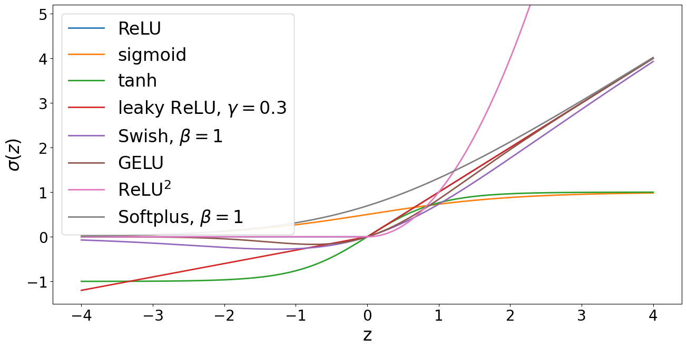

## How to read this lesson

This lesson has two levels. **Level 1 (Core)** contains what you need to
understand everything that follows in CS229 and the courses that build on
it. **Level 2 (Deep)** contains what you need for correct, interview-grade
understanding. Read Level 1 straight through. Return to Level 2 when you
want depth.

No prerequisites are assumed. Every term is defined at first use. GLMs
were the linear ceiling in [lecture 4](l04-glms-softmax.html); this lecture
breaks through it.

## Level 1: One word for three words

Error and loss and cost are the same [09:07](ts:09:07). The field uses all
three for the scalar that training minimizes. The loss chip from lecture
2 is the canonical picture. From here on, the lesson says loss.

## Level 1: The neuron

A **neuron** takes numbers in, mixes them linearly, then bends the
result. In symbols: a = sigma(w . x + b). The vector w holds the
**weights**, b is the **bias** (a single number, unrelated to the bias of
lecture 6; the field overloaded the word). Sigma is the **activation
function**: the bend.

Without sigma, a stack of neurons is still one linear map. Matrices
compose into a matrix. The bend is the entire source of nonlinearity, and
nonlinearity is the entire point. GLMs were linear in x. Neurons are not.

## Level 1: ReLU from first principles

The lecture derives the activation from scratch instead of asserting it.
Requirements: nonlinear, cheap to compute, friendly to gradients. The
answer is **ReLU**, the rectified linear unit [39:26](ts:39:26):

ReLU(z) = max(0, z)

Flat zero for negative inputs, the identity for positive ones. Its
derivative is 1 for z > 0 and 0 for z < 0: no shrinkage on the active
side. Compare the sigmoid, whose derivative peaks at 0.25 and multiplies
toward zero across layers. That shrinkage is the **vanishing gradient**
problem, and ReLU sidesteps it wherever the neuron is active.

The zoo has more animals: tanh, leaky ReLU, GELU, Swish. Each keeps the
same contract: bend the line, keep gradients alive. Modern transformers
use GELU or Swish variants. The lecture's message is not which animal to
pick. It is why the cage exists: linear compositions stay linear, so
every layer needs a bend.

> [!QA]
> Q: Why is ReLU the default activation?
> A: Three reasons. It is nonlinear, so networks can bend. It is cheap: a max and a comparison. Its derivative is 1 on the active side, so gradients pass through unchanged instead of shrinking like the sigmoid's 0.25 maximum. Dead neurons (stuck at zero) are the known failure mode, addressed by leaky variants.
> Follow-up: Why not just use the sigmoid everywhere like the old days?
> A: The sigmoid saturates: large inputs give outputs near 0 or 1 with near-zero derivative. In a deep stack, those tiny derivatives multiply across layers and the gradient vanishes. Training stalls. ReLU's active side never saturates, so deep stacks keep learning.

## Level 1: The MLP

Stack neurons in **layers**. Every neuron in one layer reads every neuron
in the previous layer. That is a **multilayer perceptron** (MLP), also
called a fully connected network.

Notation: layer l computes u^l = sigma(W^l u^(l-1) + b^l). The superscript
is the layer index, not a power. W^l is the weight matrix, b^l the bias
vector. The first layer sees the input x. The last layer feeds the loss.

Two facts make MLPs worth studying. First, **universal approximation**:
with enough hidden neurons, an MLP can approximate any continuous
function on a bounded region. The theorem says the capacity exists. It
does not say gradient descent will find it. Second, depth beats width in
practice: deep stacks of simple layers learn hierarchical features that
shallow wide ones miss.

> [!QA]
> Q: What does universal approximation actually guarantee?
> A: Existence, not learnability. It says some setting of the weights approximates the target function. It does not say gradient descent finds those weights, or how many neurons you need, or that the found solution generalizes. Interviewers use it as a trap: quoting the theorem as a reason MLPs always work is wrong. Capacity is not training.
> Follow-up: Why go deep instead of wide?
> A: Depth composes features hierarchically: edges from pixels, parts from edges, objects from parts. A shallow wide network must learn each complex pattern directly. Depth reuses intermediate patterns, which is exponentially more parameter efficient for structured data. Practice and theory both favor depth.

## Level 1: Residual connections

Very deep stacks hit a wall: adding layers stops helping, then hurts,
even on training data. The problem is not overfitting. The optimizer
cannot push identity-like transformations through many bent layers.

The fix is the **residual block** (ResNet, 2015) [65:30](ts:65:30).
Instead of learning the full map, each block learns the change:

output = x + F(x)

, add the input back. Deep stacks train. Original plate.")

The **skip connection** carries x past the block untouched. If the block
is useless, the network sets F(x) to zero and keeps x: depth becomes
harmless. Gradients flow back through the skip untouched, which cures the
vanishing that killed plain deep stacks. ResNets made 100+ layer vision
models trainable. Transformers use the same trick around every
sub-layer, as lecture 14 shows.

> [!QA]
> Q: Why do skip connections help training?
> A: Two reasons. Forward: the block only needs to learn the residual change, and learning near-zero is easy when the layer should be near-identity. Backward: the gradient has a direct path through the skip that no activation can shrink. Both effects compound with depth. Without skips, deep stacks degrade even on training data.
> Follow-up: Is a residual block still a universal approximator?
> A: Yes, and the argument is simple. A residual network can simulate a plain network by setting skips to carry what the plain layers need. The skip only adds representational options. It never removes any.

## Level 2: Counting parameters

A layer from d_in to d_out has d_in * d_out weights plus d_out biases.
An MLP with layers 784 -> 256 -> 128 -> 10 holds about 235,000
parameters. The count matters twice. It sets the memory footprint, and
it sets the cost of the forward and backward passes, which lecture 8
proves are both linear in it.

Width and depth trade differently. Doubling width quadruples the
matrix. Doubling depth doubles the parameter count but doubles the
sequential steps. Hardware prefers wide parallel math; optimization
prefers deep composition. Architecture search lives in this tension.

## Level 2: What the lecture deliberately skips

Initialization, normalization placement, and the optimizer details are
deferred. The lecture notes that where you start matters for non-convex
models, unlike least squares. Proper initialization keeps activations
and gradients at stable scales across layers. The full treatment belongs
with the training lecture arc, not the architecture tour. Do not mistake
the omission for unimportance: bad initialization breaks everything built
here.

## Recap: the whole lesson on one screen

Eight ideas carry this lecture. Read each card. Say the core sentence out
loud. If you can, you own the lesson.

<strong>1. Loss, error, cost: one word</strong>

Three names for the minimized scalar. The course says loss. The chip
from lecture 2 is the picture.

Key: loss = error = cost

<strong>2. A neuron mixes, then bends</strong>

a = sigma(w.x + b). Weights w, bias b, activation sigma. Without the
bend, stacks stay linear. The bend is the point.

Key: linear part, then sigma

<strong>3. ReLU: max(0, z)</strong>

Nonlinear, cheap, derivative 1 when active. Sidesteps the sigmoid's
vanishing gradients. The default bend.

Key: max(0,z); grad 1 or 0

<strong>4. The activation zoo</strong>

Tanh, leaky ReLU, GELU, Swish: same contract, different curves.
Transformers use GELU/Swish variants. Pick by gradient behavior.

Key: bend the line, keep gradients alive

<strong>5. MLPs stack fully connected layers</strong>

Every neuron sees every previous neuron. Universal approximation
promises capacity, not trainability. Depth beats width in
practice.

Key: u^l = sigma(W^l u^(l-1) + b^l)

<strong>6. Residual: learn the change</strong>

Output = x + F(x). Skip carries x untouched. Useless blocks learn
zero. Gradients flow back unshrunk. ResNet 2015.

Key: x + F(x)

<strong>7. Count the parameters</strong>

Layer d_in to d_out: d_in*d_out weights + d_out biases. 784-256-128-10
is ~235K. Count sets memory and compute.

Key: width quadruples, depth doubles

<strong>8. Vanishing gradients kill deep stacks</strong>

Sigmoid derivatives peak at 0.25 and multiply toward zero. ReLU and
skips keep gradients alive. Architecture is gradient plumbing.

Key: derivatives multiply across layers

## Official sources and further reading

**Official:**
- Lecture 7 video: loss vocabulary [09:07](ts:09:07), ReLU [39:26](ts:39:26), residual networks [65:30](ts:65:30).
- CS229 Spring 2026 official course notes: neural network chapter; the activation figure above is from it.

**Further reading:**
- He et al. (2015), "Deep Residual Learning for Image Recognition": the ResNet paper.
- Cybenko (1989): the original universal approximation theorem.

**Caveats from these sources.** Universal approximation says nothing
about learnability or generalization; do not cite it as a guarantee.
ReLU's dead-neuron problem is real: large gradients can push neurons
into permanent zero. The notes' activation figure shows curves, not the
gradient pathologies that motivate the choices.

## Connections to the other courses

- **CS336:** every transformer block is an MLP with GELU/Swish plus residual skips; this lecture is its anatomy.
- **CS224N:** word vectors feed MLPs for classification; the architecture pattern transfers directly.
- **CS329H:** residual connections are the reason 100-layer policy networks can train at all.

> [!CHEAT]
> **Neural network architecture cheatsheet.** Loss = error = cost. Neuron: a = sigma(w.x + b); bend is the point. ReLU = max(0,z); derivative 1 active, 0 dead; cures sigmoid's vanishing (max derivative 0.25). Zoo: tanh, leaky ReLU, GELU, Swish. MLP: u^l = sigma(W^l u^(l-1)+b^l); universal approximation = capacity, not training; depth beats width. Residual: x + F(x); skip carries gradient; ResNet 2015. Params: d_in*d_out + d_out per layer.

> [!MEMORY]
> **Bend every layer.** A stack without activations is one linear map wearing a costume. The activation is the only nonlinearity. Everything deep learning can do that GLMs cannot lives in those bends.
