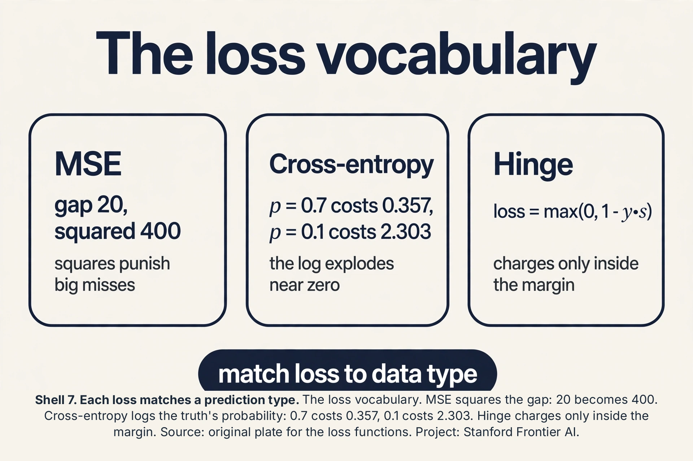
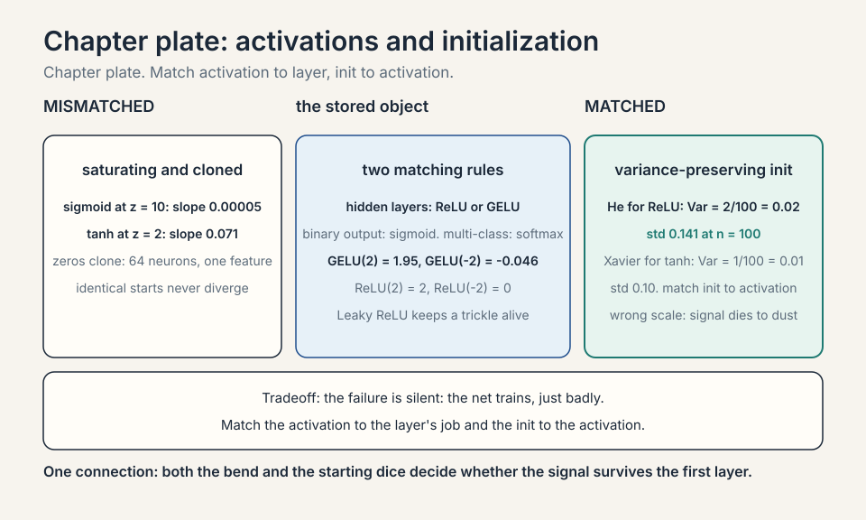
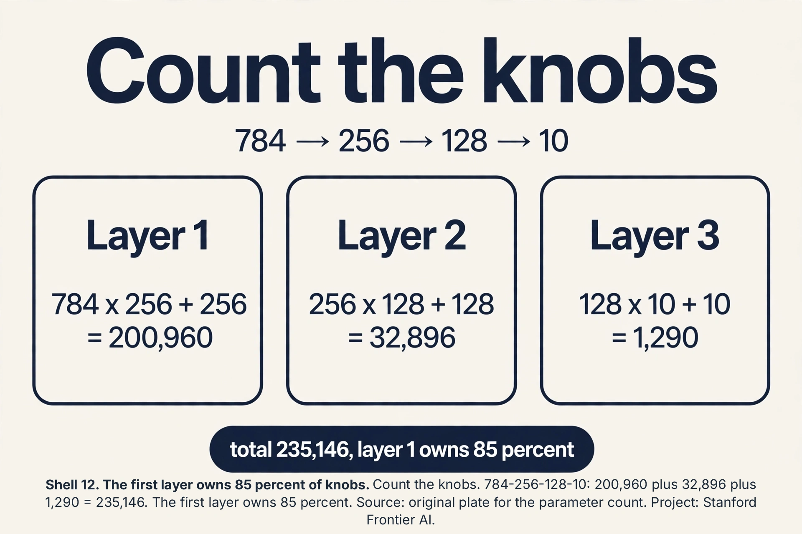
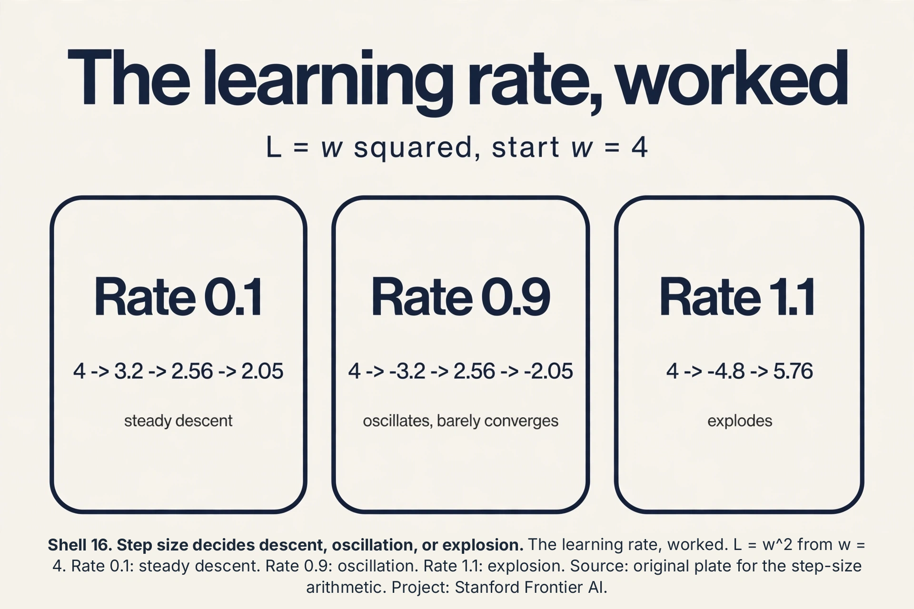
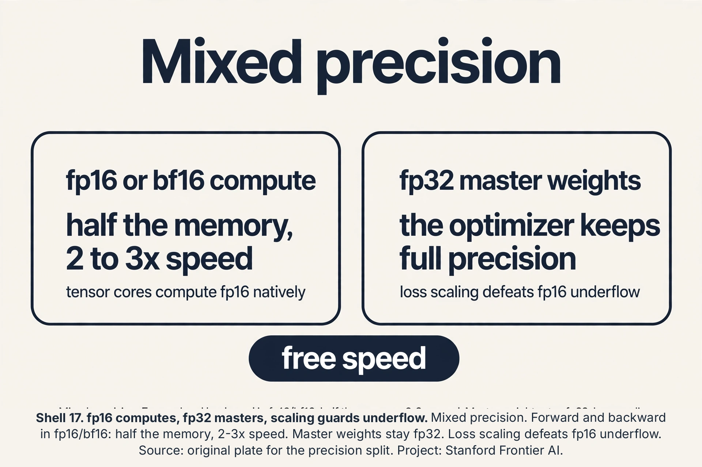
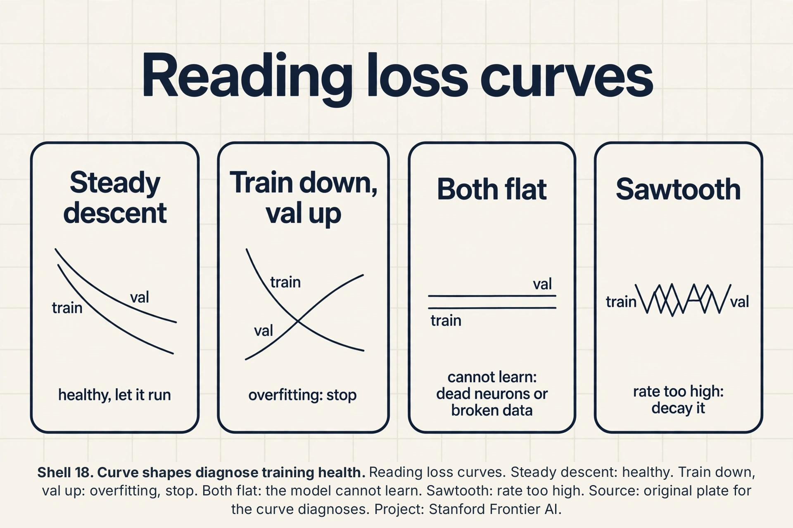
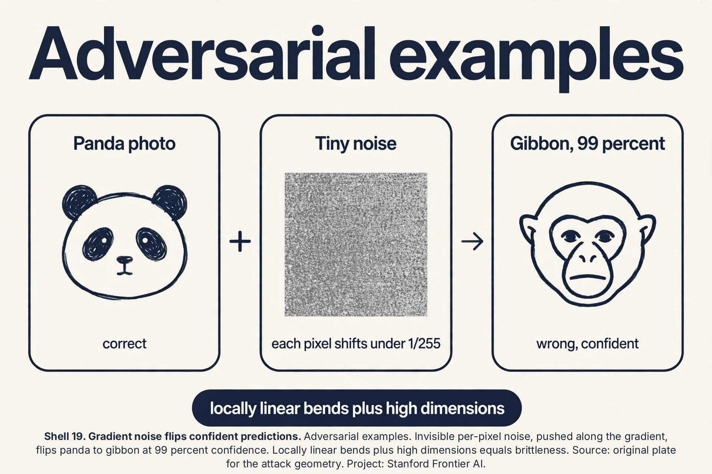

### Coverage and sourcing

This lesson follows Lecture 7 of Stanford CS229 (Machine Learning,
Spring 2026, instructor Tengyu Ma): "Neural Networks 1
(Architecture)". The lecture builds neural networks from the neuron
up: the loss vocabulary, ReLU from first principles, neurons, MLPs,
the activation zoo, and residual connections. It draws on the
official subtitle transcript and the course notes. The coverage map
at the end of the chapter maps every major lecture claim to the
section that covers it. Figures and claims marked "October 2026"
are updates added after the lecture, each with its source.

## The job: price the house from what the spreadsheet cannot say

Back to Ames. The spreadsheet has size, bedrooms, zip code. But the
price really depends on things no column contains: walkability, how
pleasant the streets are. School quality, how good the nearby schools
are. These intermediate quantities matter more than the raw inputs,
and nobody measured them. A linear model can only mix the raw
columns. It cannot invent walkability.

The key question: can a model learn its own intermediate features,
the unmeasured quantities, from the raw inputs and the prices alone?

## First attempt: hand-build the features

The classical answer is feature engineering: a human invents the
intermediate quantities. Walkability = 0.6 * park distance +
0.4 * sidewalk coverage, hand-tuned. This is the rule-list story of
lecture 1 wearing new clothes. It works until the world changes, it
costs expert hours per feature, and it caps the model at the
human's imagination. The lecture's verdict is implied by the whole
course: stop hand-building features. Learn them.

### Subchapter: the XOR failure, worked

The cleanest proof that lines are not enough. Four points, two
classes: (0,0) -> 0, (1,1) -> 0, (0,1) -> 1, (1,0) -> 1. The
diagonal pairs share a class. Try any line w1*x1 + w2*x2 + b = 0.
The zeros need w1*0 + w2*0 + b < 0 and w1 + w2 + b < 0: so b < 0
and w1 + w2 < -b. The ones need w2 + b > 0 and w1 + b > 0: so
w1 > -b and w2 > -b. Add the last two: w1 + w2 > -2b. But -2b > -b
when b < 0, so w1 + w2 > -b contradicts w1 + w2 < -b. No line
exists. One hidden layer fixes it. A **neuron** is the smallest
learnable feature builder: it mixes its inputs linearly, then bends
the result nonlinearly. Neuron A learns OR (fires when either input
is 1), neuron B learns AND (fires only when both are 1), output =
A AND NOT B. Two bends solve what no line can. This is the whole
lecture in four points.

 build the bend that does. Source: original plate for the linear separability proof. Project: Stanford Frontier AI.")

## One neuron

A **neuron** is the smallest learnable feature builder. It takes a
vector x, mixes it linearly (w^T x + b), then bends the result with
a nonlinear **activation function** sigma:

```ascii
neuron(x) = sigma(w^T x + b)
```

The linear mix draws a straight boundary. The bend makes it a
feature: without sigma, the neuron is just another linear model and
stacking linear models gives a linear model. The bend is the entire
point.

The lecture builds the bend from first principles. Start with the
simplest useful bend: zero on one side, straight line on the other.
That is **ReLU**, the rectified linear unit:

```ascii
ReLU(z) = max(0, z)
```

ReLU(2.5) = 2.5. ReLU(-1.3) = 0. Linear with slope 1 on the positive
side, flat zero on the negative side. The name "activation" nods to
biology: a neuron fires when its input crosses a threshold, silent
otherwise. ReLU is that idea with the math cleaned up.

Watch one neuron learn walkability. Inputs: x1 = park distance
(miles), x2 = sidewalk coverage (fraction). Weights w = (-2, 3),
bias b = 0.5. A house with park 0.2 miles away and 0.9 sidewalk
coverage: z = -2*0.2 + 3*0.9 + 0.5 = 2.8, ReLU gives 2.8: highly
walkable. A house with park 2 miles away and 0.1 coverage: z =
-4 + 0.3 + 0.5 = -3.2, ReLU gives 0: not walkable at all. One
neuron, one learned intermediate quantity, zero hand-tuning.


### Subchapter: the bias as a movable threshold

The bias b looks like a spare knob. It is the neuron's threshold.
The neuron fires when w^T x + b > 0, which is w^T x > -b. The bias
sets where the hinge sits. In the walkability toy, w = (-2, 3) and
b = 0.5, so the neuron fires when -2*park + 3*sidewalk > -0.5. Drop
b to -3 and the same house needs a far better (park, sidewalk) pair
to fire. Training moves the hinge by tuning b. Every "threshold" in
every neuron is just a bias the optimizer placed.


### Subchapter: the perceptron, the neuron's ancestor

The neuron has a grandparent. The **perceptron** (Rosenblatt,
1958) is a neuron with a step activation: output 1 if w^T x + b >
0, else 0. No bend, just a hard threshold. It learns by the
perceptron rule: on a mistake, w <- w + y*x (add the input scaled
by its label). Work it: w = (0,0), b = 0. Point (1, 0), label 1:
w^T x + b = 0, predicts 0, wrong. Update: w = (0,0) + 1*(1,0) =
(1,0). Point (0, 1), label 0: w^T x = 0, predicts 1 (0 > 0 is
false, so 0: correct, no update). The perceptron converges if the
data is linearly separable (the perceptron convergence theorem).
If not (XOR), it cycles forever. Minsky and Papert's 1969 book
proved the single-layer limit and froze neural net research for a
decade: the field needed the hidden layer and backprop (lecture 8)
to escape. The interview line: the perceptron is a neuron with a
step function, and its failure on XOR is why depth exists.

## Where one neuron breaks

A single ReLU neuron draws one bent boundary. The Ames market needs
many intermediate quantities at once: walkability, school quality,
commute convenience, and each is a different bend of the inputs. One
neuron gives you one feature. You need dozens.

Worse, one layer of bends has limited vocabulary. A single ReLU can
make a hinge. It cannot make a bump (up then down) or a valley. Many
real patterns need bumps: house prices peak at a medium distance
from downtown, falling off in both directions. One hinge cannot say
that.

## Stacking: the MLP

Put neurons side by side in a **layer**, then stack layers. Each
neuron in layer 1 builds one bent feature from the raw inputs.
Layer 2 mixes those features and bends again. This is the
**multi-layer perceptron**, the MLP:

```ascii
x --> [layer 1: 64 ReLU neurons] --> [layer 2: 32 ReLU neurons] --> price
```

Layer 1 might learn walkability, school quality, commute score.
Layer 2 combines them: "walkability AND good schools" bends into a
premium-neighborhood feature. Depth builds abstraction: each layer's
features are bends of the previous layer's bends.

The bump problem dissolves. Two ReLUs make a bump: ReLU(x) rises,
ReLU(x - 2) rises later, and their difference ReLU(x) - ReLU(x-2)
rises then flattens: a ramp with a plateau. Subtract a second such
shape and you get a peak. With enough neurons, MLPs approximate any
continuous function on a bounded region. This is the **universal
approximation** claim: one hidden layer, enough neurons, any shape.
The lecture states it as the reason MLPs are taken seriously as a
model class.


### Subchapter: the bump, built

Two ReLUs make a ramp with a plateau: ReLU(x) - ReLU(x-2). At x =
0, 1, 2, 3, 4 the values are 0, 1, 2, 2, 2: rises, then flat. Fold
it down with a mirror pair and you get a peak:
bump(x) = ReLU(x) - 2*ReLU(x-2) + ReLU(x-4). Values at x = 0, 1, 2,
3, 4: 0, 1, 2, 1, 0. A triangle peaking at x = 2, built from four
hinges. Slide and scale copies of this bump and you can trace any
curve: this is the constructive half of universal approximation,
not a slogan but a recipe.

 minus twice ReLU(x-2) plus ReLU(x-4) gives 0, 1, 2, 1, 0 at x = 0 to 4. Hinges make bumps, bumps trace any curve. Source: original toy for the bump construction. Project: Stanford Frontier AI.")

 and the walkability toy. Right: the MLP stack, the bump 0, 1, 2, 1, 0, and 235,146 knobs. Bottom: bends buy learned features and any-shape approximation, priced at representable not meaning learnable. Dense chapter plate. Source: original synthesis of the lesson. Project: Stanford Frontier AI.")

## Embeddings: the first layer learns a dictionary

The Ames spreadsheet has a zip code column. Zip 50010 vs 50011:
as numbers they differ by 1, as neighborhoods they differ
completely. One-hot encoding (a 1 in position 50010, 0 elsewhere)
makes them equidistant and blows up the width. An **embedding**
is the learned alternative: a table with one vector per category,
trained like any other weight.

### Subchapter: the embedding lookup, worked

Ten zip codes, embedding dimension 4. The table is 10x4 = 40
numbers, learned. House in zip 3: look up row 3, say (0.2, -1.1,
0.5, 0.9). That vector feeds the MLP like any input. During
training, backprop tunes row 3 so zips with similar prices get
similar vectors: the geometry of the table learns the geography
of the market. Parameter math: 10,000 product IDs x 64 dims =
640,000 numbers in the first layer. This is why recommender MLPs
are embedding-heavy: the vocabulary is the model. The interview
line: embeddings turn "category 50010" from a meaningless integer
into a point in a learned space where distance means similarity.

. Ten zips, dim 4: 40 learned numbers. Distance in the table means similarity in the market. Source: original plate for the embedding lookup. Project: Stanford Frontier AI.")

## The loss vocabulary

The network predicts. The loss scores the prediction. A **loss
function** takes (prediction, truth) and returns one number: how
wrong the prediction was. Training minimizes the average loss over
the data. Three losses cover nearly every job. Each matches a data
type: numbers, probabilities, or scores with a margin.

### Subchapter: MSE, the regression loss

**Mean squared error** is for numbers. Predict a price, compare to
the true price, square the gap, average over examples:

```ascii
MSE = (1/n) * sum (y_hat - y)^2
```

Work it. True price 320 (thousand dollars). Predicted 300. Gap
20. Squared: 400. Three houses with squared gaps 400, 100, 900:
MSE = 1400/3 = 466.7. The square punishes big misses hard: a gap
of 40 costs 1600, four times a gap of 20, not twice. That is the
point: MSE hates outliers and drags the model toward them. The
gradient is clean: the derivative of (y_hat - y)^2 with respect to
y_hat is 2(y_hat - y). Lecture 2's least squares is MSE with a
linear model. Same loss, richer model.

### Subchapter: cross-entropy, the classification loss

**Cross-entropy** is for probabilities. True label 1 (the review is
positive). Model says P(positive) = 0.7. Loss = -log(0.7) = 0.357.
Model says 0.1. Loss = -log(0.1) = 2.303. Confident and wrong
costs far more than unsure. The binary formula:

```ascii
CE = -(y * log(p) + (1 - y) * log(1 - p))
```

With y = 1 only the first term survives. With y = 0 only the
second. The log is the whole trick: it turns "the probability
assigned to the truth" into a loss that explodes as that
probability goes to zero. Why not MSE on probabilities? MSE treats
0.49 vs 0.51 like any other gap. Cross-entropy cares about
calibration near the truth: it is the negative log likelihood of
lecture 3, so minimizing it is maximum likelihood. The multi-class
version is -log(p_true_class). The interview line: cross-entropy
is MLE wearing a loss costume.

### Subchapter: hinge loss, the margin loss

**Hinge loss** is for raw scores with a margin. Label y is +1 or
-1. The model outputs a score s, not a probability. Loss:

```ascii
hinge = max(0, 1 - y * s)
```

Work it. y = +1, s = 0.3: y*s = 0.3, loss = 0.7. Correct side but
too close to the boundary: pays. y = +1, s = 1.5: loss = 0.
Correct with margin to spare: free. y = +1, s = -0.5: loss = 1.5.
Wrong side: pays the full miss plus the margin. The hinge only
cares about the boundary region: examples far on the correct side
cost nothing and pull nothing. That sparsity is the SVM heritage.
Modern nets rarely use the hinge, but the margin idea returns in
contrastive losses (lecture 13).

### Subchapter: which loss where, the interview table

One term in this table needs its definition now. **Softmax** turns
k raw scores z into k probabilities that sum to 1: softmax(z)_i =
exp(z_i) / sum_j exp(z_j). Its purpose is competition: the classes
share one probability budget, so raising one class's share lowers
the others'.

| Job | Loss | Output activation | Why this pair |
|---|---|---|---|
| Predict a number | MSE | Linear | Squares punish big misses; the gradient is linear |
| Yes or no | Binary cross-entropy | Sigmoid | The log punishes confident errors; it is MLE |
| Pick of k classes | Cross-entropy | Softmax | -log(p_true): probabilities that compete |
| Rank with a margin | Hinge | Linear | Only the boundary region pays |

The rule behind the table: the loss must score what the task
cares about. Regression cares about distance: square it.
Classification cares about the probability of the truth: log it.
Mismatch them (MSE on class labels) and training optimizes the
wrong pain: the numbers look fine while the model is wrong.



## The softmax-cross-entropy pair

Softmax and cross-entropy always ship together, and the reason is
the gradient. Scores z, softmax p, true class c, loss -log(p_c).
The gradient of the loss with respect to the scores is beautifully
plain:

```ascii
dL/dz = p - y    (y is one-hot truth)
```

Work it. Scores (2.0, 1.0, 0.5), true class 0. Softmax gave
(0.63, 0.23, 0.14). Gradient: (0.63 - 1, 0.23 - 0, 0.14 - 0) =
(-0.37, 0.23, 0.14). Read it: push the true class's score up
(negative gradient = move up), push the others down, each in
proportion to its error. No logarithms survive in the gradient.
No exponentials either. That is why the pair trains well: the
backward signal is just "how far each probability is from the
truth". The interview line: never implement them separately in a
custom layer. The combined backward is one subtraction.

### Subchapter: the log-sum-exp trick

Softmax overflows: exp(1000) is infinity in float32. The fix
subtracts the max first: softmax(z) = softmax(z - max(z)). The
loss needs log(sum(exp(z_i))): same overflow. The **log-sum-exp**
trick: log(sum(exp(z_i))) = m + log(sum(exp(z_i - m))) with m =
max(z). Work it: z = (1000, 999). Naive: exp(1000) = inf, dead.
Trick: m = 1000, log-sum-exp = 1000 + log(e^0 + e^-1) = 1000 +
log(1.368) = 1000.31. Finite and exact. Every framework's
cross-entropy does this internally. If you ever write softmax by
hand and see NaN on large scores, this is the missing line.

: MSE squares the gap, cross-entropy logs the truth's probability. Right: the softmax-cross-entropy pair, gradient p minus y, and the log-sum-exp trick. Bottom: match the loss to the data type: square the gap, log the probability, charge the margin. Dense chapter plate. Source: original synthesis of the lesson. Project: Stanford Frontier AI.")

## The activation zoo

ReLU is the default, but the lecture tours the alternatives because
each fixes a real failure.

**Sigmoid** (lecture 3's friend): squashes to (0, 1). Failure:
saturates. At z = 10 the output is 0.99995 and the slope is
0.00005. Gradients die in the flat regions. Hidden layers avoid it.

**Tanh**: squashes to (-1, 1), zero-centered. Better behaved than
sigmoid but still saturates at the extremes. Work it: tanh(2) is
about 0.964, and the slope there is 1 - 0.964^2, about 0.071. At
z = 2 the curve is nearly flat: only 7 percent of the upstream
gradient reaches the weights.

**Leaky ReLU**: max(0.01z, z). Fixes ReLU's **dying neuron**
problem: a ReLU whose input is always negative outputs 0 forever,
its gradient is 0 forever, and it never recovers. The small negative
slope keeps a trickle of gradient alive.

**GELU / Swish**: smooth bends used in transformers (lecture 14).
Slightly better than ReLU in deep stacks, slightly more expensive.

The interview trap: "which activation where?" ReLU (or GELU) in
hidden layers, sigmoid only for binary outputs, softmax only for
multi-class outputs, linear for regression outputs. The activation
must match the job of the layer.

### Subchapter: the interview table, activation by layer

One glance, no hesitation:

| Layer job | Activation | If you mismatch |
|---|---|---|
| Hidden layer | ReLU or GELU | Sigmoid saturates, gradients die |
| Binary output | Sigmoid | ReLU outputs are not probabilities |
| Multi-class output | Softmax | Sigmoids do not compete, sum is not 1 |
| Regression output | Linear (none) | Sigmoid caps your prices at 1 |

The rule behind the table: the activation must match what the layer
promises. Hidden layers promise features: ReLU bends cheaply. Output
layers promise a data type: probabilities, class shares, or raw
numbers. Interviewers ask this table cold. Memorize it.

### Subchapter: softmax, worked

**Softmax** turns k raw scores into k probabilities that sum to 1:

```ascii
softmax(z)_i = exp(z_i) / sum_j exp(z_j)
```

Work it. Scores z = (2.0, 1.0, 0.5). Exponentials: e^2 = 7.39,
e^1 = 2.72, e^0.5 = 1.65. Sum: 11.76. Probabilities: (0.63, 0.23,
0.14). Sum: 1.00. The exponential exaggerates gaps: the top
score's lead of 1.0 became a probability ratio of 2.7 to 1.
**Temperature** T divides the scores first: softmax(z/T). High T
flattens toward uniform. Low T sharpens toward winner-take-all.
Two interview traps. Softmax never outputs exact 0 or 1. And it is
shift-invariant: add 5 to every score and the probabilities do not
change, because exp(z_i + 5) = e^5 * exp(z_i) and the e^5 cancels
top and bottom. Implement it as softmax(z - max(z)) or the
exponentials overflow to infinity.

### Subchapter: GELU and SiLU, worked

Transformers use **GELU** (Gaussian Error Linear Unit), not ReLU.
The formula: GELU(z) = z * Phi(z), where Phi is the standard
Gaussian CDF. Intuition: it weights the input by the probability
that it is positive: large z passes through, large negative z is
killed, near zero it bends smoothly. Values: GELU(2) = 2 * 0.977
= 1.95. GELU(-2) = -2 * 0.023 = -0.046. GELU(0) = 0. Compare ReLU:
(2, 0, 0). GELU is ReLU with the kink sanded off: smooth
everywhere, nonzero gradient for small negatives. **SiLU**
(sigmoid linear unit, also called Swish): z * sigmoid(z). SiLU(2)
= 2 * 0.88 = 1.76. Same family: smooth, self-gated. Why
transformers prefer them: smooth activations give smoother loss
surfaces, and at billion-parameter scale the small gains compound.
Price: GELU needs the erf function (or a tanh approximation),
slightly costlier than ReLU's one comparison. The interview line:
ReLU for MLPs and CNNs, GELU/SiLU for transformers. Match the
activation to the architecture family.

 = 1.95, GELU(-2) = -0.046: the kink sanded off. ReLU gives (2, 0). Smooth bends for deep stacks. Source: original plate for the activation values. Project: Stanford Frontier AI.")

## Initialization: the symmetry problem

Weights must start somewhere. The choice decides whether training
works at all. Two failure modes: all-same and wrong-scale.

### Subchapter: zeros fail, demonstrated

Set every weight to 0. Two hidden neurons receive identical inputs
x, hold identical weights 0 and identical bias 0: both output
ReLU(0) = 0. Backward pass: both receive identical gradients,
because each gradient is computed from the weights, and the
weights are equal. Update: both move identically. They stay clones
forever. A layer of 64 zero-initialized neurons is one neuron
wearing a costume. This is the **symmetry problem**: identical
starts never diverge. Random initialization breaks it: each neuron
rolls different dice and learns a different feature.

### Subchapter: the scale matters too

Random is not enough. The scale decides the signal's fate. Too
large: z = w^T x lands far from 0, sigmoid saturates, ReLU outputs
huge values, gradients explode. Too small: every layer shrinks
the signal, and by layer 10 the activations are dust. The target:
keep the variance of activations stable across layers. Two
standard answers. **Xavier** (Glorot) init: Var(W) = 1/n_in, for
tanh and sigmoid. Numbers: n_in = 100 gives Var(W) = 0.01, so the
std is 0.1. **He** init: Var(W) = 2/n_in, for ReLU.

### Subchapter: the He variance, worked

Why 2/n? Trace one ReLU layer. Inputs x_i have variance 1.
Weights w_i have variance v, independent of the inputs. Then
z = sum w_i x_i has variance n * v. ReLU kills the negative half,
so the output variance is about half of z's: n*v/2. For the output
variance to stay 1, need n*v/2 = 1, so v = 2/n. Numbers: n_in =
100, ReLU layer: Var(W) = 0.02, std = 0.141. Sample weights from a
Gaussian with std 0.141. Xavier's 1/n is the same argument without
the ReLU half: for tanh, Var(W) = 1/n_in. The interview line:
match the init to the activation, or depth eats the signal before
training starts.

 = 2/100 and std = 0.141. Match the init to the activation. Source: original plate for the variance arithmetic. Project: Stanford Frontier AI.")



## Where depth breaks: vanishing gradients

Stack 50 layers and a new failure appears. Each layer's bend
multiplies the learning signal by its slope. ReLU's slope is 0 or 1.
Sigmoid's slope peaks at 0.25. Through 50 sigmoid layers, the signal
for the first layer is multiplied by 0.25 fifty times: 0.25^50 is
about 10^-30. The early layers learn nothing. This is the
**vanishing gradient**, the same disease that killed the RNN in the
sequence lesson, now attacking depth instead of time. Deep networks
trained worse than shallow ones, which made no sense until the fix.

## Residual connections

The fix, from the 2015 ResNet paper the lecture presents: do not
make each block learn the full transformation. Make it learn the
**change**, and add the input back:

```ascii
residual block:  out = x + F(x)
```

F is two rounds of linear-mix-plus-activation. The block learns the
residual F(x): how much to adjust x. If a block has nothing useful
to add, it sets F(x) = 0 and the input passes through unchanged.
Deep stacks become safe: adding more blocks cannot hurt, because
each block can choose to be an identity.

Why this fixes the gradient: the backward signal now has two paths.
One path goes through F, getting multiplied by small slopes. The
other path goes through the + x skip, multiplied by 1, untouched.
Even if F's path vanishes, the skip carries the full signal back to
every earlier layer. Gradients flow through 100+ layers. The
lecture notes the dimension constraint: x and F(x) must match, so
the block preserves dimension.

, add the input back. The skip path carries gradients untouched through any depth. Source: original plate for Stanford Frontier AI.")

### Subchapter: ResNet by the numbers

The 2015 ResNet paper (He et al., Microsoft Research) settled the
depth question with one experiment. Plain networks got worse past
about 20 layers: training error rose with depth, which meant the
optimizer was failing, not overfitting. Residual networks with the
same depth trained fine and kept improving: 34, 50, 101, 152
layers. The 152-layer ensemble scored 3.57% top-5 error on the
ImageNet test set and won ILSVRC 2015. Depth stopped being a risk
and became a dial. Every transformer block since (lecture 14) is a
residual block.


: learn the change, add the input back. Right: ResNet-152 at 3.57 percent top-5 error, winning ILSVRC 2015. Bottom: depth stopped being a risk and became a dial, with a dimension-matching price. Dense chapter plate. Source: He et al. 2015. Project: Stanford Frontier AI.")

## Width and depth: the architecture dials

Two dials shape every MLP: how many neurons per layer (width) and
how many layers (depth). They buy different things, and the
interview tests whether you know which is which.

### Subchapter: width buys features, depth buys composition

Width adds features at one level of abstraction: 64 neurons in
layer 1 learn 64 bends of the raw inputs. Depth adds levels: layer
2 bends the bends. The lecture's composition story is a depth
story: "walkability AND good schools" needs two levels, and no
amount of width in one layer expresses it compactly. Theory backs
this: some functions need exponentially many neurons in one hidden
layer but only polynomially many in a deep net. In practice the
dial starts at "a few layers, a few hundred wide" and moves on
validation signal, not theory.

### Subchapter: count the knobs

A layer from n_in inputs to n_out neurons holds n_in * n_out
weights plus n_out biases. Work it: 784 inputs (28x28 pixels),
layers 256, 128, 10 outputs. Layer 1: 784*256 + 256 = 200,960.
Layer 2: 256*128 + 128 = 32,896. Layer 3: 128*10 + 10 = 1,290.
Total: 235,146 knobs. The first layer owns 85 percent of them.
Rules of thumb: widen the early layers (they build the feature
vocabulary), keep later layers narrower (they compose). The count
matters twice: lecture 8's memory bill scales with it, and lecture
6's variance warns that 235K knobs need real data.



## The loss surface is not convex

Linear models have one valley: convex loss, one global minimum.
Neural nets do not. The loss surface has symmetries that clone
every solution into an army of twins.

### Subchapter: permutation symmetry

Swap hidden neuron 3 and hidden neuron 7: swap their incoming
weights, their biases, and their outgoing weights. The network
computes exactly the same function. Every minimum comes in at
least h! copies for h hidden neurons (64! is about 10^89). ReLU
adds a scaling symmetry: multiply a neuron's incoming weights by 2
and divide its outgoing weights by 2. ReLU(2z)/2 = ReLU(z): same
function. The surface is tiled with equivalent minima, and the
optimizer cannot tell them apart. It does not need to.

### Subchapter: why training works anyway

Non-convex sounds fatal. Three facts save it. One:
overparameterized nets have many good minima, not one needle. The
235K-knob net has far more minima than the 2-knob line, and most
of them generalize. Two: gradient descent with noise (SGD) drifts
toward flat minima. Wide valleys generalize better than sharp
ones, and the noise kicks the optimizer out of sharp crevices.
Three: bad local minima are rare in high dimensions. Most critical
points are saddles, and saddles have an escape direction. The
lecture's honest position: universal approximation promises the
function exists. The loss surface explains why finding it is hard
but not hopeless.

## Double descent: bigger can generalize better

Lecture 6 taught the U-curve: more capacity, more variance, worse
test error past some point. Modern practice broke the curve.
**Double descent**: as the network grows, test error falls, then
rises (the classical U), then falls again past the
**interpolation threshold** (where the net is big enough to fit
training data exactly).

### Subchapter: the threshold, worked

Twelve houses, an MLP. 10 knobs: underfits, test error high. 12
knobs: fits exactly, test error peaks (the model threads every
point with wild oscillations). 1,000 knobs: fits exactly too, but
test error falls below the 10-knob level. Why: among all the exact
fits, gradient descent finds the smoothest one (small weights,
thanks to the init and the implicit bias of SGD). The wild
oscillator needs big weights. The smooth fit needs small ones.
The optimizer prefers small. So past the threshold, extra capacity
buys smoothness, not memorization. The interview line: the U-curve
describes the underparameterized regime. Modern nets live past the
peak, where bigger is a regularizer. Lecture 6's warning still
holds for small models.

, then falls again. Past the peak, capacity buys smoothness. Source: original plate for the double-descent curve. Project: Stanford Frontier AI.")

## Normalization: keep the signal tame

Deep stacks drift. Layer 1's outputs shift as its weights update,
so layer 2's inputs keep moving: every layer chases a moving
target. **Normalization** re-centers and re-scales activations so
each layer sees stable inputs. The idea is one line: for each
feature, subtract its mean and divide by its standard deviation,
then let the network learn a new scale and shift.

### Subchapter: batch norm, worked

**Batch normalization** normalizes over the mini-batch. Four
activation values from one neuron across 4 examples: (2, 4, 6, 8).
Mean: 5. Variance: (9+1+1+9)/4 = 5. Std: 2.236. Normalized:
(-1.34, -0.45, 0.45, 1.34). Then the layer learns gamma (scale)
and beta (shift): output = gamma * normalized + beta. With gamma
= 1, beta = 0 the values stay normalized. The network can recover
any scale it wants, but it starts from a tame one. Two effects:
gradients flow better (no saturated inputs), and higher learning
rates become safe. The price: batch norm couples examples in a
batch (small batches give noisy statistics), and it behaves
differently at train vs test time (running averages at test).

### Subchapter: layer norm, the transformer default

**Layer normalization** normalizes over the features of one
example, not over the batch. One example with 4 features: (2, 4,
6, 8): same arithmetic as above, but the mean and variance come
from the example's own features. No batch coupling: works with
batch size 1, identical behavior at train and test. That is why
transformers (lecture 14) use it: language batches have variable
lengths and small per-device batches. Decision rule: batch norm
for vision CNNs with big batches, layer norm for transformers and
small batches. Both sit between the linear mix and the activation:
normalize, then bend.

: mean 5, std 2.236, normalized (-1.34,-0.45,0.45,1.34). Batch norm pools over examples. Layer norm pools over features. Source: original plate for the normalization arithmetic. Project: Stanford Frontier AI.")

## Dropout: train an ensemble, test one net

Big nets memorize. **Dropout** fights it with noise: during
training, randomly zero each activation with probability p (often
0.5 for hidden layers). The network cannot rely on any single
neuron, so it spreads the knowledge around.

### Subchapter: inverted dropout, worked

The bookkeeping trap: at test time dropout is off, so activations
are larger than during training. **Inverted dropout** fixes it
during training instead: divide the surviving activations by
(1 - p). Work it: p = 0.5, activations (2, 4, 6, 8), dropout mask
keeps (2, 8): scaled values (4, 16). Expected value of each
position: 0.5 * 0 + 0.5 * (2x) = x. The expectation matches test
time, so test time needs no scaling. The interview line: dropout
trains 2^n thinned networks (n neurons, each in or out) and
averages them at test. It is ensemble training on a budget of one
network. Price: training takes longer (each step sees less signal),
and dropout rates are one more dial.

, scale by 2: (4,16). Expectation preserved, test time untouched. Source: original plate for the dropout scaling. Project: Stanford Frontier AI.")

## Weight decay: the quiet regularizer

**Weight decay** adds a penalty to the loss: lambda * sum(w^2).
The optimizer now minimizes loss + penalty, so every weight feels
a constant pull toward zero. Work it: weight w = 2.0, lambda =
0.01, gradient of the penalty = 2*lambda*w = 0.04. Each step
shrinks w by rate * 0.04 on top of the loss gradient. Big weights
pay rent. The effect: the network prefers small weights, which
means smoother functions (a weight of 100 makes a cliff, a weight
of 0.1 makes a gentle slope). In SGD the penalty is folded into
the update as w <- w - rate*(grad + 2*lambda*w): the "decay".
AdamW (the transformer default) decouples it: apply the decay
directly to the weights, not through the adaptive gradient.
Interview line: weight decay is L2 regularization for nets. It
does not sparsify (that is L1). It smooths.

## The learning rate: the one dial that matters most

Architecture gets the glory. The **learning rate** decides whether
training works. It is the step size of gradient descent: how far to
move along the downhill direction each step. Too small and training
crawls. Too large and it diverges.

### Subchapter: too big, too small, worked

One knob, loss L(w) = w^2, gradient 2w, start w = 4. Learning rate
0.1: w -> 4 - 0.1*8 = 3.2, then 2.56, then 2.05: steady descent.
Learning rate 0.9: w -> 4 - 0.9*8 = -3.2, then 2.56, then -2.05:
oscillates, still converges (barely). Learning rate 1.1: w -> 4 -
1.1*8 = -4.8, then 5.76: explodes. The threshold is 1/curvature:
for w^2 the curvature is 2, so rates above 1.0 diverge. Real nets
have unknown curvature, so the rate is tuned on a schedule: start
moderate, decay when the loss plateaus. The interview line: if
training diverges, cut the learning rate first and ask questions
later.

### Subchapter: schedules

Constant rates waste the end of training: big steps near the
minimum bounce around it. **Schedules** shrink the rate over time:
step decay (divide by 10 every N epochs), cosine decay (smooth
curve to near zero).

### Subchapter: warmup

**Warmup** does the reverse at the start: begin tiny and ramp up
over the first few thousand steps. Why: early gradients are noisy
(random init, unnormalized), and a big first step can kill ReLUs or
blow up the loss before training begins. Warmup is standard in
transformer training (lecture 14): a few thousand steps of ramp,
then cosine decay. One more dial, but it is the dial that most
often fixes "training is unstable".



## Mixed precision: train faster with fewer bits

Float32 is the default. **Mixed precision** trains mostly in
float16 (or bfloat16): half the memory, up to 2-3x the speed on
modern GPUs (tensor cores compute fp16 natively).

### Subchapter: why fp16 underflows, and the fix

Float16's smallest normal value is about 6e-5. Gradients smaller
than that round to zero: the early layers stop learning silently.
**Loss scaling** fixes it: multiply the loss by 1024 before the
backward pass (gradients scale up, safely above the floor), then
divide the weight updates by 1024. Bfloat16 dodges the problem
differently: same exponent range as float32 (no underflow), fewer
mantissa bits (less precision). Decision rule: bfloat16 where the
hardware supports it (simpler, no loss scaling), fp16 with loss
scaling elsewhere. The interview line: mixed precision is free
speed. The master weights stay in float32 (the optimizer needs the
precision), only the forward/backward compute drops to 16 bit.



## Reading loss curves

The loss curve is the training run's vital sign. Its shape
diagnoses the run before any metric does.

### Subchapter: five shapes, five diagnoses

**Steady descent, both curves falling:** healthy. Let it run.
**Train falls, val flat:** the model stopped generalizing further.
More data or regularization, or stop here. **Train falls, val
rises:** overfitting in progress. Stop now (early stopping) or
regularize. **Both flat from the start:** the model cannot learn.
Dead neurons, broken data pipeline, or rate far too small. Run the
tiny-overfit test. **Sawtooth with upward drift:** rate too high.
Decay it. The x-axis matters: plot against steps, not epochs, when
comparing runs with different batch sizes. Smooth the curve
(exponential moving average) before reading it: raw mini-batch
loss is noise with a trend inside.

### Subchapter: early stopping, the free regularizer

Watch the validation loss each epoch. It falls, bottoms out, then
rises. **Early stopping** keeps the weights from the bottom: the
best generalizing point of the run. It costs nothing (you already
compute val loss) and it regularizes as strongly as explicit
penalties: stopping early limits how far the weights travel from
init, which limits the function's complexity. The patience dial:
wait N epochs past the best before stopping (N = 5-10 typical),
because val loss jitters. Interview line: early stopping is the
first regularizer to try. It is free, and it never hurts.



## What the network learned: feature visualization

The honest price listed opacity: nobody can read walkability out
of 64 ReLU neurons. **Feature visualization** tries anyway:
optimize an input image to maximize one neuron's activation, and
look at what the neuron wants to see.

### Subchapter: the walkability neuron, imagined

Take the walkability neuron (w = (-2, 3), b = 0.5). Ask: which
input maximizes its output? Gradient ascent on the input: the
answer is park distance 0, sidewalk coverage 1 (maximize -2*park +
3*sidewalk). Visualize that as an image: the neuron's "dream" is
the platonic walkable neighborhood. In vision nets this produces
real pictures: early neurons dream of edges and textures, deep
neurons dream of dog faces and buildings. The method is
optimization, not introspection: it shows what excites the
neuron, not what the neuron "means". Two neurons can share a dream
and do different jobs. Opacity remains. But the dreams are the
best window available, and they confirm the lecture's story:
neurons really do become feature detectors.

## The lottery ticket hypothesis

A dense net trains. Prune 90 percent of its weights (keep the
largest magnitudes). The pruned net trains fine from the original
initialization. The **lottery ticket hypothesis**: inside every
dense network hides a sparse subnetwork ("the winning ticket")
that trains to the same accuracy alone.

### Subchapter: why it matters

If true, most weights are passengers: the init lottery picks a
lucky sparse few, and training only needs those. Evidence: winning
tickets found by prune-and-rewind match dense accuracy at 90-95
percent sparsity on small vision nets. Limits: tickets are found
by training the dense net first (no free lunch), and the effect
weakens at large scale. The interview line: the hypothesis
explains why overparameterization helps (more tickets bought, more
chances to win) and connects to double descent (the extra capacity
is mostly empty seats). It is a hypothesis, not a shipping
technique: nobody finds tickets without paying for the dense run
first.

## Adversarial examples: the bend's dark side

Add invisible noise to a photo of a panda. The net says "gibbon",
99 percent confident. The noise is tiny (each pixel shifts by less
than 1/255). This is an **adversarial example**: a worst-case
perturbation, not random noise.

### Subchapter: why bends are brittle

Each ReLU bend is locally linear. Chain hundreds of linear pieces
and the function is linear almost everywhere, with a huge input
dimension. In high dimensions, a small push in the gradient's
direction accumulates across thousands of pixels into a large
change in the output: the **fast gradient sign method** builds the
attack in one step (perturb each pixel by epsilon times the sign
of the gradient). Defenses: adversarial training (train on the
attacks), which costs 3-10x the compute and some clean accuracy.
The interview line: adversarial examples are not bugs in one
model. They are a property of locally-linear functions in high
dimensions. Every deep net has them.



## Calibration: do the probabilities mean it?

The softmax says 0.9. Is the model right 90 percent of the time it
says 0.9? Often not: modern nets are **overconfident**.
**Calibration** measures the gap.

### Subchapter: the reliability diagram, worked

Bucket 100 predictions by confidence: 10 in (0.8, 0.9], average
confidence 0.85. If 7 are correct, accuracy 0.70: overconfident by
15 points. Plot accuracy vs confidence per bucket: a calibrated
model hugs the diagonal. The fix is **temperature scaling**: fit
one temperature T on a held-out set (softmax(z/T), T > 1 softens),
which fixes confidence without changing predictions. Why it
matters: any system that acts on probabilities (medical, fraud,
autonomous) needs calibrated numbers, not just accurate argmaxes.
Interview line: accuracy measures the top class. Calibration
measures the probabilities. Report both.

## Failure modes: the field guide

When a network misbehaves, the symptom points at the cause. This
is the diagnostic table to reach for before touching the
architecture.

| Symptom | Likely cause | Check | Fix |
|---|---|---|---|
| Loss is NaN in the first epochs | Learning rate too high, or log(0) | Print max gradient norm per step | Cut the rate 10x, add epsilon inside logs |
| Loss flat from step 1 | Dead ReLUs or zero init | Fraction of activations exactly 0 | He init, lower rate, Leaky ReLU |
| Train loss falls, val loss rises | Overfitting (lecture 6) | Gap between the curves | More data, dropout, weight decay, smaller net |
| Train loss will not fall | Underfitting or bug | Loss vs a tiny overfit test | Bigger net, higher rate, check the data pipeline |
| Loss oscillates wildly | Rate too high near the minimum | Loss curve sawtooth | Decay the schedule, add gradient clipping |
| Early layers learn nothing | Vanishing gradient | Gradient norms per layer | Residuals, normalization, better init |

The tiny-overfit test deserves a line: train on 10 examples. A
healthy net memorizes them (loss near 0). If it cannot, the bug is
in the code or the data, not the hyperparameters. Run this test
before any tuning. It separates "the model cannot learn" from
"the setup cannot train".

## The honest price

Neurons buy learned features and pay in three currencies. First,
data hunger: a 2-knob line learns from 12 houses. A 10,000-knob MLP
needs thousands of examples or it memorizes (lecture 6's variance).
Second, opacity: nobody can read walkability back out of 64 ReLU
neurons the way you read a hand-built formula. Third, architecture
decisions: how many layers, how wide, which activation. These are
hyperparameters (lecture 6), and the wrong ones waste the training
budget. Universal approximation promises the function exists in the
model class. It does not promise gradient descent will find it.
That is lecture 8's problem.

## Mapping back

| Idea | Pain it answers | How |
|---|---|---|
| Neuron | Hand-built features cap the model at human imagination | sigma(w^T x + b): learnable bend; walkability from (park, sidewalk) with zero hand-tuning |
| ReLU | Sigmoid saturates, gradients die | max(0,z): slope 1 or 0, cheap, no saturation on the positive side |
| MLP stacking | One neuron, one feature; one hinge cannot make a bump | Layers of bends: two ReLUs make a ramp, stacks make any shape (universal approximation) |
| Activation zoo | Dying ReLUs, saturating sigmoids | Leaky ReLU keeps a trickle; tanh centers; GELU smooths; each matched to its layer's job |
| Residual block | 0.25^50 kills gradients in deep stacks | out = x + F(x): the skip carries signal multiplied by 1 through any depth |
| Loss vocabulary | The network needs a scoreboard per data type | MSE squares gaps; cross-entropy logs the truth's probability; hinge charges the margin |
| Softmax-cross-entropy pair | Separate implementations are slow and unstable | Combined gradient is p - y; log-sum-exp defeats overflow |
| Embeddings | Categories are not numbers | Learned lookup table; 10 zips x 4 dims; distance means similarity |
| Initialization | Zeros clone; wrong scale kills signal | He Var = 2/n for ReLU; Xavier Var = 1/n for tanh; std 0.141 at n = 100 |
| Normalization | Layers chase moving targets | Batch norm pools over examples; layer norm over features; normalize then bend |
| Dropout | Big nets memorize | Zero with prob p, scale survivors by 1/(1-p); trains 2^n thinned nets |
| Weight decay | Weights grow into cliffs | Penalty lambda*sum(w^2); AdamW decouples it; smooths the function |
| Learning rate | Wrong step size diverges or crawls | Tune on schedule; warmup then cosine decay; cut 10x when NaN |
| Double descent | The U-curve said stop growing | Past the interpolation threshold, capacity buys smoothness |
| Mixed precision | Float32 wastes memory and speed | bfloat16 compute, fp32 master weights; loss scaling for fp16 |
| Loss curves | The run's vital signs are cryptic | Five shapes, five diagnoses; early stopping is the free regularizer |
| Failure field guide | Symptoms mislead | Table: NaN, flat, gap, oscillation mapped to cause, check, fix |
| Feature visualization | Opacity hides what neurons learned | Optimize the input to excite one neuron; dreams show feature detectors |
| Lottery ticket | Dense nets look wasteful | A sparse winning ticket hides inside; found by training dense first |
| Adversarial examples | Tiny noise flips predictions | Locally-linear bends in high dimensions; fast gradient sign attack |
| Calibration | 0.9 confidence is not 90 percent accuracy | Reliability diagram; temperature scaling fixes confidence |

> [!QA]
> Q: Why must a neuron have a nonlinear activation? What goes wrong without it?
> A: Without the bend, a neuron is w^T x + b: a linear function. A stack of linear layers is still linear: W2(W1 x) = (W2 W1) x, one matrix. The whole deep network collapses to a single linear model, and lectures 2 through 6 already cover those. The nonlinearity is what buys new capability per layer. Every "deep" claim in deep learning rests on sigma being nonlinear.
> Follow-up: Prove a stack of linear layers collapses.
> A: Layer 1: h = W1 x + b1. Layer 2: y = W2 h + b2 = W2 W1 x + (W2 b1 + b2). Define W = W2 W1 and b = W2 b1 + b2: y = W x + b, a single linear layer. Induction extends to any depth. No bend, no depth.

> [!QA]
> Q: What is the dying ReLU problem, and how do you fix it?
> A: ReLU outputs 0 for all negative inputs, and its gradient there is 0. If a neuron's weights shift so its input is always negative, it outputs 0 forever and receives zero gradient forever: it never recovers, it is dead. With bad initialization or a too-large learning rate, whole layers can die. Fixes: Leaky ReLU (max(0.01z, z)) keeps a small gradient alive on the negative side. Careful initialization keeps neurons in the live region at the start. Lower learning rates avoid killing them.
> Follow-up: Why is ReLU still the default despite this?
> A: Because in practice, with sane initialization and learning rates, few neurons die, and ReLU's positives dominate: no saturation for positive inputs (unlike sigmoid's 0.00005 slope at z=10), one comparison to compute, and sparse activations (many exact zeros) that are cheap. The dead-neuron risk is real but manageable. The saturation tax of sigmoid is paid on every step.

> [!QA]
> Q: What does universal approximation actually guarantee?
> A: That a one-hidden-layer MLP with enough neurons can approximate any continuous function on a bounded region arbitrarily well. It is an existence claim about the model class, not a training claim. It does not say gradient descent will find the weights, how many neurons "enough" is (often exponentially many), or that the found solution generalizes. Interviewers use it to test whether you confuse "can represent" with "can learn".
> Follow-up: If one hidden layer suffices, why go deep?
> A: Efficiency of representation. A deep network can represent some functions with exponentially fewer neurons than a shallow one: each layer reuses the previous layer's features. "Walkability AND good schools" as a composed feature needs depth to be compact. In practice, deep narrow networks train better and generalize better than shallow wide ones with the same parameter count.

> [!QA]
> Q: How do residual connections fix the vanishing gradient?
> A: The block computes out = x + F(x). During backpropagation the gradient splits: one path through F, multiplied by the layers' small slopes, and one path through the skip connection, multiplied by exactly 1. The skip carries the full learning signal to every earlier layer no matter how deep the stack. Blocks can also default to identity (F = 0), so adding depth never hurts. The 2015 ResNet paper used this to train 100+ layer networks when 20-layer plain networks failed.
> Follow-up: What is the dimension constraint on a residual block?
> A: x and F(x) are added, so they must have the same shape. When a stage changes dimension (e.g., doubling channels), the skip uses a projection, usually a 1x1 convolution or linear map, to match. The lecture flags this: the block preserves dimension by definition.

> [!QA]
> Q: Walk me through the mechanism: forward pass of a tiny 2-layer MLP. Input x = (1, 0). Layer 1: neuron A has w = (2, -1), b = 0. Neuron B has w = (-1, 0.5), b = 1. Layer 2: one neuron with w = (1, 1), b = -1. ReLU everywhere.
> A: Layer 1, neuron A: z = 2*1 + (-1)*0 + 0 = 2, ReLU gives 2. Neuron B: z = -1*1 + 0.5*0 + 1 = 0, ReLU gives 0. Layer 1 output: (2, 0). Layer 2: z = 1*2 + 1*0 - 1 = 1, ReLU gives 1. Final answer: 1. Notice neuron B died on this input (output 0) but the network still answered: dead on one input is normal, dead on all inputs is the dying-ReLU disease.
> Follow-up: Change layer 2's bias to -3. What happens?
> A: z = 2 + 0 - 3 = -1, ReLU gives 0. The network now says 0. One bias moved the final threshold: biases are the cheapest dials in the network.

> [!QA]
> Q: Applied design: your 40-layer plain MLP trains worse than your 10-layer one, and the training error is worse too. Diagnose and fix.
> A: Training error worse with more depth means optimization failure, not overfitting: the deeper net cannot even fit. Prime suspect is vanishing gradients through 40 bends. Confirm: check gradient norms per layer. Early layers near zero confirms it. Fix: residual connections around each block so the skip carries signal at full strength. Also check initialization and add normalization. If training error drops with depth after residuals, the diagnosis was right.
> Follow-up: Why not just use the 10-layer net?
> A: Because depth buys representational efficiency: the 40-layer net can express composed features the 10-layer one cannot afford. The lecture's lesson from ResNet: depth stopped being a risk once residuals existed, and the 152-layer winner beat every shallow model.

> [!QA]
> Q: Where does the sigmoid still live, if ReLU won hidden layers?
> A: Three places. Binary outputs: the final layer of a yes-or-no classifier, where you need a probability. Gates: LSTM and GRU gates multiply by sigmoids to open or close information flow. Attention: softmax, the sigmoid's multi-class sibling, normalizes attention weights. ReLU won the hidden feature layers. The squashing functions kept every job that needs "a number between 0 and 1."
> Follow-up: Why not ReLU on a binary output?
> A: ReLU outputs are unbounded and uncalibrated: 2.8 is not a probability. The loss needs a probability to score against the label. Sigmoid is the probability-shaped activation, so it owns the binary output layer.

> [!QA]
> Q: Why must weights start random, and why does the scale matter?
> A: Zeros fail by symmetry: identical weights get identical gradients and stay clones forever, so 64 neurons learn one feature. Random values break the symmetry. The scale must preserve signal variance across layers: too large saturates or explodes, too small vanishes to dust. He init (Var = 2/n_in for ReLU) and Xavier (Var = 1/n_in for tanh) set the scale so each layer's output variance stays near 1. At n_in = 100 with ReLU, sample weights with std 0.141.
> Follow-up: What goes wrong if you use Xavier init with ReLU in a 50-layer net?
> A: Xavier assumes the activation preserves variance (true near 0 for tanh). ReLU kills half the variance per layer, so after 50 layers the signal scales by roughly (1/2)^50: dust. He init's factor of 2 compensates exactly. The mismatch is a slow silent death: the net trains, just badly, and the bug looks like "deep nets do not work".

## Recap: the whole lesson on one screen

1. **The job.** Price houses from unmeasured quantities like
   walkability. Lines mix raw columns. They cannot invent features.
2. **First attempt.** Hand-build features. Rule-list economics
   again: expert hours per feature, capped at human imagination.
3. **The neuron.** sigma(w^T x + b). The bend makes it a feature.
   Toy: walkability 2.8 vs 0 from (park, sidewalk).
4. **ReLU.** max(0, z): 2.5 stays, -1.3 dies. Slope 1 or 0, cheap,
   no saturation.
5. **Where one neuron breaks.** One feature per neuron. One hinge
   cannot make a bump.
6. **The MLP.** Stack bent layers. Two ReLUs make a ramp. Stacks
   make any shape. Universal approximation: existence, not
   training.
7. **The zoo.** Sigmoid saturates (slope 0.00005 at z=10). Leaky
   ReLU rescues dead neurons. Match activation to layer job.
8. **Vanishing gradients.** 0.25^50 = 10^-30 through deep sigmoid
   stacks. Early layers learn nothing.
9. **Residuals.** out = x + F(x). Skip carries gradient at full
   strength through any depth. 2015, 100+ layers.

10. **The honest price.** Data hunger, opacity, architecture
    hyperparameters. Representable does not mean learnable.
11. **The bias is the threshold.** b moves the hinge: fires when
    w^T x > -b.
12. **The bump, built.** ReLU(x) - 2ReLU(x-2) + ReLU(x-4) gives
    0,1,2,1,0: a peak from four hinges.
13. **The table.** Hidden: ReLU/GELU. Binary: sigmoid.
    Multi: softmax. Regression: linear.
14. **ResNet.** 152 layers, 3.57% top-5 (ensemble), ILSVRC 2015.
    Depth became a dial.
15. **XOR.** No line separates the diagonal pairs. Two hidden
    neurons (OR, AND) build the bend that does.
16. **Perceptron.** Step activation, 1958. Converges only on
    separable data. Its XOR failure froze the field for a decade.
17. **Embeddings.** Zip 3 looks up row 3. Learned tables turn
    categories into geometry.
18. **Losses.** MSE squares gaps. Cross-entropy logs the truth's
    probability. Hinge charges the margin. Match loss to data type.
19. **The pair.** Softmax plus cross-entropy: gradient is p - y.
    Log-sum-exp defeats overflow.
20. **Softmax.** (2,1,0.5) becomes (0.63,0.23,0.14). Temperature
    sharpens or flattens. Shift-invariant.
21. **GELU.** z * Phi(z): ReLU with the kink sanded off.
    Transformer default.
22. **Init.** Zeros clone forever. He: Var = 2/n for ReLU.
    Xavier: 1/n for tanh. Match init to activation.
23. **Width and depth.** Width buys features, depth buys
    composition. 784-256-128-10: 235,146 knobs, 85% in layer 1.
24. **Loss surface.** Permutation symmetry clones every minimum
    h! times. SGD finds flat minima. Saddles, not traps.
25. **Double descent.** Past the interpolation threshold, bigger
    generalizes better. The U-curve was the small-model story.
26. **Normalization.** Batch norm pools over examples. Layer norm
    over features. Normalize, then bend.
27. **Dropout.** p = 0.5, scale survivors by 2. Trains 2^n thinned
    nets, tests one.
28. **Weight decay.** lambda * sum(w^2). Big weights pay rent.
    AdamW decouples it.
29. **Learning rate.** 0.1 descends, 0.9 oscillates, 1.1 explodes
    on w^2. Warmup, then cosine decay.
30. **Mixed precision.** bfloat16 compute, fp32 masters. Loss
    scaling defeats fp16 underflow.
31. **Loss curves.** Five shapes, five diagnoses. Early stopping
    is the free regularizer.
32. **Field guide.** NaN, flat, gap, oscillation: symptom to cause
    to check to fix.
33. **Dreams.** Feature visualization: optimize the input to excite
    one neuron. Opacity remains, but neurons are feature detectors.
34. **Lottery.** A sparse winning ticket hides in every dense net.
    Found by training dense first.
35. **Adversarial.** Invisible noise flips panda to gibbon.
    Locally-linear bends in high dimensions.
36. **Calibration.** Reliability diagram: 0.85 confidence, 0.70
    accuracy is overconfidence. Temperature scaling fixes it.
37. **Recommender.** 68,097 MLP knobs plus 64.64M embedding knobs.
    The whole lesson composed in one production job.

## What is used where

**MLPs run tabular production.** Gradient-boosted trees contest
them, but MLPs with embeddings dominate recommender systems and
any tabular job with high-cardinality categories. Every
transformer (lecture 14) contains MLP blocks: the feed-forward
sublayer is this lesson's MLP with GELU.

**ReLU and GELU are the default hidden activations in every deep
net shipped.** ResNet variants remain the standard vision backbone
for feature extraction. The residual pattern is universal: GPT,
diffusion U-Nets, AlphaFold all stack residual blocks.

**Normalization and init are load-bearing in every training run.**
Batch norm remains standard in vision CNNs. Layer norm is the
transformer default (every GPT, Llama, and Gemini block normalizes
before attention and before the MLP). He init ships as the default
dense-layer initializer in PyTorch and JAX for ReLU nets.

**Dropout and weight decay are the default regularizers.**
Dropout rates of 0.1-0.5 appear in MLPs and transformer training.
AdamW (decoupled weight decay) is the standard optimizer for
transformer pre-training. Mixed precision (bfloat16) is the
default training mode for large runs: the speed and memory wins
are too large to leave on the table.

### Subchapter: a recommender sketch, end to end

Tie the lesson together on one production job. A store scores
10,000 products per user. Inputs: user embedding (64 dims, learned
table over 1M users), product embedding (64 dims, 10,000 products),
context features (hour, device: 8 dims). Concatenate: 136 dims.
MLP: 136 -> 256 (ReLU, He init, layer norm) -> 128 (ReLU,
dropout 0.2) -> 1 (sigmoid: P(click)). Loss: binary
cross-entropy. Knobs: 136*256 + 256*128 + 128*1 + biases (256 +
128 + 1 = 385) = 34,816 + 32,768 + 128 + 385 = 68,097, plus the
embedding tables
(1M*64 + 10K*64 = 64.64M: the tables dwarf the MLP). Training:
AdamW, warmup + cosine decay, bfloat16. Every idea in this lesson
appears: embeddings, MLP, ReLU, He init, layer norm, dropout,
sigmoid output, cross-entropy loss, AdamW, schedule, mixed
precision. That is what "the architecture" means in production:
not one trick, but the whole stack composed.

## Watch next

<div class="video-block"><div class="video-wrap"><iframe src="https://www.youtube-nocookie.com/embed/aircAruvnKk" title="3Blue1Brown: Neural Networks Chapter 1" allow="accelerometer; autoplay; clipboard-write; encrypted-media; gyroscope; picture-in-picture" allowfullscreen loading="lazy" referrerpolicy="strict-origin-when-cross-origin"></iframe></div><p class="video-cap">Explainer: 3Blue1Brown, Neural Networks Chapter 1. Grant Sanderson animates the neuron, the layers, and the learned features. Watch after the MLP section.</p></div>

## Go deeper

<div class="video-block"><div class="video-wrap"><iframe src="https://www.youtube-nocookie.com/embed/fRM41w9jzQo" title="Lecture 7: Neural Networks 1 (Architecture)" allow="accelerometer; autoplay; clipboard-write; encrypted-media; gyroscope; picture-in-picture" allowfullscreen loading="lazy" referrerpolicy="strict-origin-when-cross-origin"></iframe></div><p class="video-cap">The lecture itself: Tengyu Ma builds the neuron from ReLU first principles, stacks the MLP, tours activations, and presents residual blocks. Watch the full 80 minutes after the chapter.</p></div>

- [Deep Residual Learning for Image Recognition (He et al., 2015)](https://arxiv.org/abs/1512.03385)
- The ResNet paper the lecture presents: 152 layers, 3.57% top-5 error, ILSVRC 2015. Read section 3 for the residual formulation.
- [Feature Visualization (Olah et al., Distill, 2017)](https://distill.pub/2017/feature-visualization/)
- What neurons actually learn to detect, visualized: the "walkability neuron" made visible. Matches the neuron-as-feature-builder sections.

## Official sources and further reading

**Official:**
- Lecture 7 video, Stanford Online YouTube:
  - [Tengyu Ma builds](https://www.youtube.com/watch?v=fRM41w9jzQo)
  the neuron from ReLU first principles, stacks the MLP on the
  housing example, tours activations, and presents residual blocks.
- Official subtitle transcript (en-US): the lecture's spoken text.
- CS229 Spring 2026 official course notes (local PDF): the formal
  statements.

**Caveats from these sources.** The walkability/school-quality
housing example is the lecture's own running illustration. The
specific numbers in this lesson's toy are an original miniature.
The universal approximation claim is stated as the model class's
credential, with the lecture's emphasis on architecture over
training guarantees. The residual presentation follows the 2015
ResNet paper as the lecture presents it.

## Connections to the other courses

- **CS229 L02-L04:** the linear ceiling this lesson breaks: GLMs
  cannot invent walkability.
- **CS229 L06:** the variance price of flexible models. Why MLPs
  need data and regularization.
- **CS229 L08:** how the millions of MLP knobs actually get
  trained: backpropagation.
- **CS229 L14:** the transformer block: residual connections around
  attention and MLPs, GELU activations.
- **CS336:** MLPs at scale: width, depth, and initialization in
  real training.

## Coverage map: every lecture claim and where it lives

| Lecture claim | Covered in | File line |
|---|---|---|
| Feature engineering caps the model at human imagination | First attempt: hand-build the features | L58 |
| No line separates XOR; proof by contradiction | the XOR failure, worked | L68 |
| Neuron: sigma(w^T x + b); the bend makes it a feature | One neuron | L86 |
| ReLU from first principles: max(0,z), slope 1 or 0 | One neuron | L86 |
| Walkability toy: 2.8 vs 0 from (park, sidewalk) | One neuron | L86 |
| Bias as movable threshold: fires when w^T x > -b | the bias as a movable threshold | L124 |
| Perceptron ancestor; XOR failure froze the field | the perceptron, the neuron's ancestor | L136 |
| One neuron, one feature; one hinge cannot make a bump | Where one neuron breaks | L153 |
| MLP: layers of bends; depth builds abstraction | Stacking: the MLP | L166 |
| Two ReLUs build a peak: 0,1,2,1,0 | the bump, built | L193 |
| Universal approximation: existence, not training | Stacking: the MLP | L166 |
| Embeddings: learned lookup tables for categories | Embeddings: the first layer learns a dictionary | L206 |
| Loss vocabulary: MSE, cross-entropy, hinge | The loss vocabulary | L230 |
| Softmax-cross-entropy pair: gradient is p - y | The softmax-cross-entropy pair | L318 |
| Log-sum-exp trick defeats overflow | the log-sum-exp trick | L339 |
| Activation zoo: sigmoid, tanh, Leaky ReLU, GELU, Swish | The activation zoo | L351 |
| Match activation to layer job (interview table) | the interview table, activation by layer | L379 |
| Softmax worked: (2,1,0.5) to (0.63,0.23,0.14); temperature | softmax, worked | L397 |
| GELU/SiLU values; transformer default | GELU and SiLU, worked | L417 |
| Zero init fails by symmetry; He and Xavier scales | Initialization: the symmetry problem | L438 |
| He variance worked: std 0.141 at n = 100 | the He variance, worked | L466 |
| Vanishing gradient: 0.25^50 through deep sigmoids | Where depth breaks: vanishing gradients | L481 |
| Residual block: out = x + F(x); skip carries gradient | Residual connections | L492 |
| ResNet: 152 layers, 3.57% top-5, ILSVRC 2015 | ResNet by the numbers | L518 |
| Width buys features; depth buys composition | width buys features, depth buys composition | L538 |
| Knob count: 784-256-128-10 = 235,146 | count the knobs | L550 |
| Permutation and scaling symmetries of the loss surface | The loss surface is not convex | L564 |
| Double descent past the interpolation threshold | Double descent | L595 |
| Batch norm and layer norm, worked | Normalization: keep the signal tame | L621 |
| Dropout and inverted dropout scaling | Dropout | L659 |
| Weight decay as L2; AdamW decoupling | Weight decay: the quiet regularizer | L682 |
| Learning rate: 0.1/0.9/1.1 on w^2; schedules and warmup | The learning rate | L698 |
| Mixed precision: bfloat16, fp32 masters, loss scaling | Mixed precision | L737 |
| Loss curve shapes; early stopping | Reading loss curves | L759 |
| Feature visualization: the neuron's dream | What the network learned | L792 |
| Lottery ticket hypothesis | The lottery ticket hypothesis | L814 |
| Adversarial examples from local linearity | Adversarial examples | L836 |
| Calibration; reliability diagram; temperature scaling | Calibration | L859 |
| Failure field guide: symptom to fix | Failure modes: the field guide | L878 |
| Honest price: data hunger, opacity, hyperparameters | The honest price | L899 |
| Recommender sketch composing the whole lesson | a recommender sketch, end to end | L1091 |
