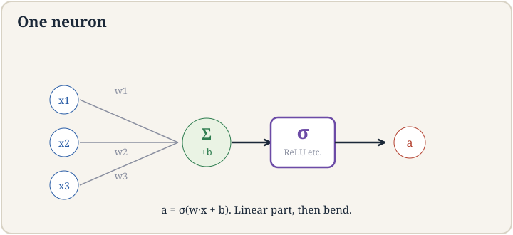
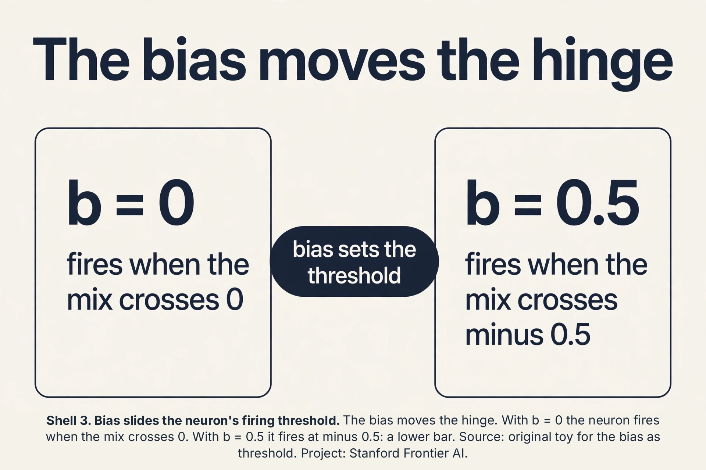
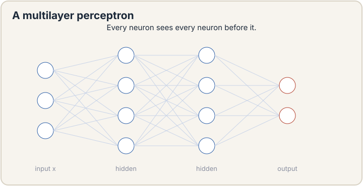
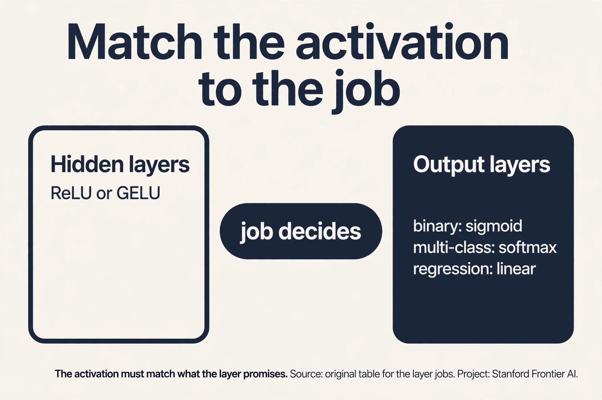
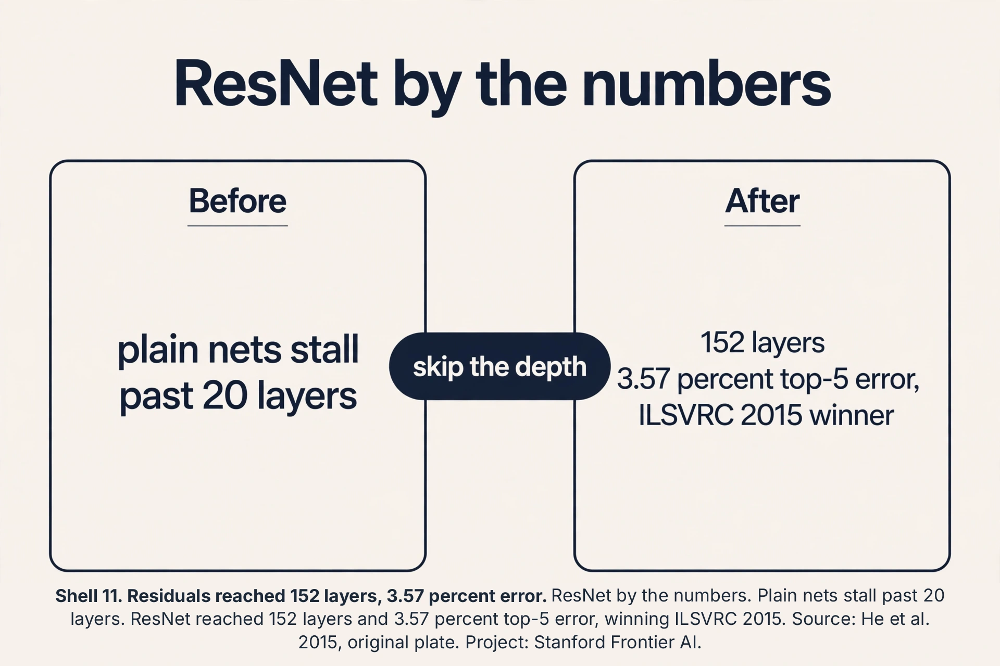

## The job: price the house from what the spreadsheet cannot say

Back to Ames. The spreadsheet has size, bedrooms, zip code. But the
price really depends on things no column contains: walkability, how
pleasant the streets are. School quality, how good the nearby schools
are. These intermediate quantities matter more than the raw inputs,
and nobody measured them. A linear model can only mix the raw
columns. It cannot invent walkability.

The key question: can a model learn its own intermediate features,
the unmeasured quantities, from the raw inputs and the prices alone?

## First attempt: hand-build the features

The classical answer is feature engineering: a human invents the
intermediate quantities. Walkability = 0.6 * park distance +
0.4 * sidewalk coverage, hand-tuned. This is the rule-list story of
lecture 1 wearing new clothes. It works until the world changes, it
costs expert hours per feature, and it caps the model at the
human's imagination. The lecture's verdict is implied by the whole
course: stop hand-building features. Learn them.

## One neuron

A **neuron** is the smallest learnable feature builder. It takes a
vector x, mixes it linearly (w^T x + b), then bends the result with
a nonlinear **activation function** sigma:

```ascii
neuron(x) = sigma(w^T x + b)
```

The linear mix draws a straight boundary. The bend makes it a
feature: without sigma, the neuron is just another linear model and
stacking linear models gives a linear model. The bend is the entire
point.

The lecture builds the bend from first principles. Start with the
simplest useful bend: zero on one side, straight line on the other.
That is **ReLU**, the rectified linear unit:

```ascii
ReLU(z) = max(0, z)
```

ReLU(2.5) = 2.5. ReLU(-1.3) = 0. Linear with slope 1 on the positive
side, flat zero on the negative side. The name "activation" nods to
biology: a neuron fires when its input crosses a threshold, silent
otherwise. ReLU is that idea with the math cleaned up.

Watch one neuron learn walkability. Inputs: x1 = park distance
(miles), x2 = sidewalk coverage (fraction). Weights w = (-2, 3),
bias b = 0.5. A house with park 0.2 miles away and 0.9 sidewalk
coverage: z = -2*0.2 + 3*0.9 + 0.5 = 2.8, ReLU gives 2.8: highly
walkable. A house with park 2 miles away and 0.1 coverage: z =
-4 + 0.3 + 0.5 = -3.2, ReLU gives 0: not walkable at all. One
neuron, one learned intermediate quantity, zero hand-tuning.



### Subchapter: the bias as a movable threshold

The bias b looks like a spare knob. It is the neuron's threshold.
The neuron fires when w^T x + b > 0, which is w^T x > -b. The bias
sets where the hinge sits. In the walkability toy, w = (-2, 3) and
b = 0.5, so the neuron fires when -2*park + 3*sidewalk > -0.5. Drop
b to -3 and the same house needs a far better (park, sidewalk) pair
to fire. Training moves the hinge by tuning b. Every "threshold" in
every neuron is just a bias the optimizer placed.



## Where one neuron breaks

A single ReLU neuron draws one bent boundary. The Ames market needs
many intermediate quantities at once: walkability, school quality,
commute convenience, and each is a different bend of the inputs. One
neuron gives you one feature. You need dozens.

Worse, one layer of bends has limited vocabulary. A single ReLU can
make a hinge. It cannot make a bump (up then down) or a valley. Many
real patterns need bumps: house prices peak at a medium distance
from downtown, falling off in both directions. One hinge cannot say
that.

## Stacking: the MLP

Put neurons side by side in a **layer**, then stack layers. Each
neuron in layer 1 builds one bent feature from the raw inputs.
Layer 2 mixes those features and bends again. This is the
**multi-layer perceptron**, the MLP:

```ascii
x --> [layer 1: 64 ReLU neurons] --> [layer 2: 32 ReLU neurons] --> price
```

Layer 1 might learn walkability, school quality, commute score.
Layer 2 combines them: "walkability AND good schools" bends into a
premium-neighborhood feature. Depth builds abstraction: each layer's
features are bends of the previous layer's bends.

The bump problem dissolves. Two ReLUs make a bump: ReLU(x) rises,
ReLU(x - 2) rises later, and their difference ReLU(x) - ReLU(x-2)
rises then flattens: a ramp with a plateau. Subtract a second such
shape and you get a peak. With enough neurons, MLPs approximate any
continuous function on a bounded region. This is the **universal
approximation** claim: one hidden layer, enough neurons, any shape.
The lecture states it as the reason MLPs are taken seriously as a
model class.



### Subchapter: the bump, built

Two ReLUs make a ramp with a plateau: ReLU(x) - ReLU(x-2). At x =
0, 1, 2, 3, 4 the values are 0, 1, 2, 2, 2: rises, then flat. Fold
it down with a mirror pair and you get a peak:
bump(x) = ReLU(x) - 2*ReLU(x-2) + ReLU(x-4). Values at x = 0, 1, 2,
3, 4: 0, 1, 2, 1, 0. A triangle peaking at x = 2, built from four
hinges. Slide and scale copies of this bump and you can trace any
curve: this is the constructive half of universal approximation,
not a slogan but a recipe.

 minus twice ReLU(x-2) plus ReLU(x-4) gives 0, 1, 2, 1, 0 at x = 0 to 4. Hinges make bumps, bumps trace any curve. Source: original toy for the bump construction. Project: Stanford Frontier AI.")

## The activation zoo

ReLU is the default, but the lecture tours the alternatives because
each fixes a real failure.

**Sigmoid** (lecture 3's friend): squashes to (0, 1). Failure:
saturates. At z = 10 the output is 0.99995 and the slope is
0.00005. Gradients die in the flat regions. Hidden layers avoid it.

**Tanh**: squashes to (-1, 1), zero-centered. Better behaved than
sigmoid but still saturates at the extremes.

**Leaky ReLU**: max(0.01z, z). Fixes ReLU's **dying neuron**
problem: a ReLU whose input is always negative outputs 0 forever,
its gradient is 0 forever, and it never recovers. The small negative
slope keeps a trickle of gradient alive.

**GELU / Swish**: smooth bends used in transformers (lecture 14).
Slightly better than ReLU in deep stacks, slightly more expensive.

The interview trap: "which activation where?" ReLU (or GELU) in
hidden layers, sigmoid only for binary outputs, softmax only for
multi-class outputs, linear for regression outputs. The activation
must match the job of the layer.

### Subchapter: the interview table, activation by layer

One glance, no hesitation:

| Layer job | Activation | If you mismatch |
|---|---|---|
| Hidden layer | ReLU or GELU | Sigmoid saturates, gradients die |
| Binary output | Sigmoid | ReLU outputs are not probabilities |
| Multi-class output | Softmax | Sigmoids do not compete, sum is not 1 |
| Regression output | Linear (none) | Sigmoid caps your prices at 1 |

The rule behind the table: the activation must match what the layer
promises. Hidden layers promise features: ReLU bends cheaply. Output
layers promise a data type: probabilities, class shares, or raw
numbers. Interviewers ask this table cold. Memorize it.



## Where depth breaks: vanishing gradients

Stack 50 layers and a new failure appears. Each layer's bend
multiplies the learning signal by its slope. ReLU's slope is 0 or 1.
Sigmoid's slope peaks at 0.25. Through 50 sigmoid layers, the signal
for the first layer is multiplied by 0.25 fifty times: 0.25^50 is
about 10^-30. The early layers learn nothing. This is the
**vanishing gradient**, the same disease that killed the RNN in the
sequence lesson, now attacking depth instead of time. Deep networks
trained worse than shallow ones, which made no sense until the fix.

## Residual connections

The fix, from the 2015 ResNet paper the lecture presents: do not
make each block learn the full transformation. Make it learn the
**change**, and add the input back:

```ascii
residual block:  out = x + F(x)
```

F is two rounds of linear-mix-plus-activation. The block learns the
residual F(x): how much to adjust x. If a block has nothing useful
to add, it sets F(x) = 0 and the input passes through unchanged.
Deep stacks become safe: adding more blocks cannot hurt, because
each block can choose to be an identity.

Why this fixes the gradient: the backward signal now has two paths.
One path goes through F, getting multiplied by small slopes. The
other path goes through the + x skip, multiplied by 1, untouched.
Even if F's path vanishes, the skip carries the full signal back to
every earlier layer. Gradients flow through 100+ layers. The
lecture notes the dimension constraint: x and F(x) must match, so
the block preserves dimension.

, add the input back. The skip path carries gradients untouched through any depth. Source: original plate for Stanford Frontier AI.")

### Subchapter: ResNet by the numbers

The 2015 ResNet paper (He et al., Microsoft Research) settled the
depth question with one experiment. Plain networks got worse past
about 20 layers: training error rose with depth, which meant the
optimizer was failing, not overfitting. Residual networks with the
same depth trained fine and kept improving: 34, 50, 101, 152
layers. The 152-layer ensemble scored 3.57% top-5 error on the
ImageNet test set and won ILSVRC 2015. Depth stopped being a risk
and became a dial. Every transformer block since (lecture 14) is a
residual block.



## The honest price

Neurons buy learned features and pay in three currencies. First,
data hunger: a 2-knob line learns from 12 houses. A 10,000-knob MLP
needs thousands of examples or it memorizes (lecture 6's variance).
Second, opacity: nobody can read walkability back out of 64 ReLU
neurons the way you read a hand-built formula. Third, architecture
decisions: how many layers, how wide, which activation. These are
hyperparameters (lecture 6), and the wrong ones waste the training
budget. Universal approximation promises the function exists in the
model class. It does not promise gradient descent will find it.
That is lecture 8's problem.

## Mapping back

| Idea | Pain it answers | How |
|---|---|---|
| Neuron | Hand-built features cap the model at human imagination | sigma(w^T x + b): learnable bend; walkability from (park, sidewalk) with zero hand-tuning |
| ReLU | Sigmoid saturates, gradients die | max(0,z): slope 1 or 0, cheap, no saturation on the positive side |
| MLP stacking | One neuron, one feature; one hinge cannot make a bump | Layers of bends: two ReLUs make a ramp, stacks make any shape (universal approximation) |
| Activation zoo | Dying ReLUs, saturating sigmoids | Leaky ReLU keeps a trickle; tanh centers; GELU smooths; each matched to its layer's job |
| Residual block | 0.25^50 kills gradients in deep stacks | out = x + F(x): the skip carries signal multiplied by 1 through any depth |

> [!QA]
> Q: Why must a neuron have a nonlinear activation? What goes wrong without it?
> A: Without the bend, a neuron is w^T x + b: a linear function. A stack of linear layers is still linear: W2(W1 x) = (W2 W1) x, one matrix. The whole deep network collapses to a single linear model, and lectures 2 through 6 already cover those. The nonlinearity is what buys new capability per layer. Every "deep" claim in deep learning rests on sigma being nonlinear.
> Follow-up: Prove a stack of linear layers collapses.
> A: Layer 1: h = W1 x + b1. Layer 2: y = W2 h + b2 = W2 W1 x + (W2 b1 + b2). Define W = W2 W1 and b = W2 b1 + b2: y = W x + b, a single linear layer. Induction extends to any depth. No bend, no depth.

> [!QA]
> Q: What is the dying ReLU problem, and how do you fix it?
> A: ReLU outputs 0 for all negative inputs, and its gradient there is 0. If a neuron's weights shift so its input is always negative, it outputs 0 forever and receives zero gradient forever: it never recovers, it is dead. With bad initialization or a too-large learning rate, whole layers can die. Fixes: Leaky ReLU (max(0.01z, z)) keeps a small gradient alive on the negative side. Careful initialization keeps neurons in the live region at the start. Lower learning rates avoid killing them.
> Follow-up: Why is ReLU still the default despite this?
> A: Because in practice, with sane initialization and learning rates, few neurons die, and ReLU's positives dominate: no saturation for positive inputs (unlike sigmoid's 0.00005 slope at z=10), one comparison to compute, and sparse activations (many exact zeros) that are cheap. The dead-neuron risk is real but manageable. The saturation tax of sigmoid is paid on every step.

> [!QA]
> Q: What does universal approximation actually guarantee?
> A: That a one-hidden-layer MLP with enough neurons can approximate any continuous function on a bounded region arbitrarily well. It is an existence claim about the model class, not a training claim. It does not say gradient descent will find the weights, how many neurons "enough" is (often exponentially many), or that the found solution generalizes. Interviewers use it to test whether you confuse "can represent" with "can learn".
> Follow-up: If one hidden layer suffices, why go deep?
> A: Efficiency of representation. A deep network can represent some functions with exponentially fewer neurons than a shallow one: each layer reuses the previous layer's features. "Walkability AND good schools" as a composed feature needs depth to be compact. In practice, deep narrow networks train better and generalize better than shallow wide ones with the same parameter count.

> [!QA]
> Q: How do residual connections fix the vanishing gradient?
> A: The block computes out = x + F(x). During backpropagation the gradient splits: one path through F, multiplied by the layers' small slopes, and one path through the skip connection, multiplied by exactly 1. The skip carries the full learning signal to every earlier layer no matter how deep the stack. Blocks can also default to identity (F = 0), so adding depth never hurts. The 2015 ResNet paper used this to train 100+ layer networks when 20-layer plain networks failed.
> Follow-up: What is the dimension constraint on a residual block?
> A: x and F(x) are added, so they must have the same shape. When a stage changes dimension (e.g., doubling channels), the skip uses a projection, usually a 1x1 convolution or linear map, to match. The lecture flags this: the block preserves dimension by definition.

> [!QA]
> Q: Walk me through the mechanism: forward pass of a tiny 2-layer MLP. Input x = (1, 0). Layer 1: neuron A has w = (2, -1), b = 0. Neuron B has w = (-1, 0.5), b = 1. Layer 2: one neuron with w = (1, 1), b = -1. ReLU everywhere.
> A: Layer 1, neuron A: z = 2*1 + (-1)*0 + 0 = 2, ReLU gives 2. Neuron B: z = -1*1 + 0.5*0 + 1 = 0, ReLU gives 0. Layer 1 output: (2, 0). Layer 2: z = 1*2 + 1*0 - 1 = 1, ReLU gives 1. Final answer: 1. Notice neuron B died on this input (output 0) but the network still answered: dead on one input is normal, dead on all inputs is the dying-ReLU disease.
> Follow-up: Change layer 2's bias to -3. What happens?
> A: z = 2 + 0 - 3 = -1, ReLU gives 0. The network now says 0. One bias moved the final threshold: biases are the cheapest dials in the network.

> [!QA]
> Q: Applied design: your 40-layer plain MLP trains worse than your 10-layer one, and the training error is worse too. Diagnose and fix.
> A: Training error worse with more depth means optimization failure, not overfitting: the deeper net cannot even fit. Prime suspect is vanishing gradients through 40 bends. Confirm: check gradient norms per layer. Early layers near zero confirms it. Fix: residual connections around each block so the skip carries signal at full strength. Also check initialization and add normalization. If training error drops with depth after residuals, the diagnosis was right.
> Follow-up: Why not just use the 10-layer net?
> A: Because depth buys representational efficiency: the 40-layer net can express composed features the 10-layer one cannot afford. The lecture's lesson from ResNet: depth stopped being a risk once residuals existed, and the 152-layer winner beat every shallow model.

> [!QA]
> Q: Where does the sigmoid still live, if ReLU won hidden layers?
> A: Three places. Binary outputs: the final layer of a yes-or-no classifier, where you need a probability. Gates: LSTM and GRU gates multiply by sigmoids to open or close information flow. Attention: softmax, the sigmoid's multi-class sibling, normalizes attention weights. ReLU won the hidden feature layers. The squashing functions kept every job that needs "a number between 0 and 1."
> Follow-up: Why not ReLU on a binary output?
> A: ReLU outputs are unbounded and uncalibrated: 2.8 is not a probability. The loss needs a probability to score against the label. Sigmoid is the probability-shaped activation, so it owns the binary output layer.

## Recap: the whole lesson on one screen

1. **The job.** Price houses from unmeasured quantities like
   walkability. Lines mix raw columns. They cannot invent features.
2. **First attempt.** Hand-build features. Rule-list economics
   again: expert hours per feature, capped at human imagination.
3. **The neuron.** sigma(w^T x + b). The bend makes it a feature.
   Toy: walkability 2.8 vs 0 from (park, sidewalk).
4. **ReLU.** max(0, z): 2.5 stays, -1.3 dies. Slope 1 or 0, cheap,
   no saturation.
5. **Where one neuron breaks.** One feature per neuron. One hinge
   cannot make a bump.
6. **The MLP.** Stack bent layers. Two ReLUs make a ramp. Stacks
   make any shape. Universal approximation: existence, not
   training.
7. **The zoo.** Sigmoid saturates (slope 0.00005 at z=10). Leaky
   ReLU rescues dead neurons. Match activation to layer job.
8. **Vanishing gradients.** 0.25^50 = 10^-30 through deep sigmoid
   stacks. Early layers learn nothing.
9. **Residuals.** out = x + F(x). Skip carries gradient at full
   strength through any depth. 2015, 100+ layers.

10. **The honest price.** Data hunger, opacity, architecture
    hyperparameters. Representable does not mean learnable.
11. **The bias is the threshold.** b moves the hinge: fires when
    w^T x > -b.
12. **The bump, built.** ReLU(x) - 2ReLU(x-2) + ReLU(x-4) gives
    0,1,2,1,0: a peak from four hinges.
13. **The table.** Hidden: ReLU/GELU. Binary: sigmoid.
    Multi: softmax. Regression: linear.
14. **ResNet.** 152 layers, 3.57% top-5 (ensemble), ILSVRC 2015.
    Depth became a dial.

## What is used where

**MLPs run tabular production.** Gradient-boosted trees contest
them, but MLPs with embeddings dominate recommender systems and
any tabular job with high-cardinality categories. Every
transformer (lecture 14) contains MLP blocks: the feed-forward
sublayer is this lesson's MLP with GELU.

**ReLU and GELU are the default hidden activations in every deep
net shipped.** ResNet variants remain the standard vision backbone
for feature extraction. The residual pattern is universal: GPT,
diffusion U-Nets, AlphaFold all stack residual blocks.

## Watch next

<div class="video-block"><div class="video-wrap"><iframe src="https://www.youtube-nocookie.com/embed/aircAruvnKk" title="3Blue1Brown: Neural Networks Chapter 1" allow="accelerometer; autoplay; clipboard-write; encrypted-media; gyroscope; picture-in-picture" allowfullscreen loading="lazy" referrerpolicy="strict-origin-when-cross-origin"></iframe></div><p class="video-cap">Explainer: 3Blue1Brown, Neural Networks Chapter 1. Grant Sanderson animates the neuron, the layers, and the learned features. Watch after the MLP section.</p></div>

## Official sources and further reading

**Official:**
- Lecture 7 video, Stanford Online YouTube:
  - [Tengyu Ma builds](https://www.youtube.com/watch?v=fRM41w9jzQo)
  the neuron from ReLU first principles, stacks the MLP on the
  housing example, tours activations, and presents residual blocks.
- Official subtitle transcript (en-US): the lecture's spoken text.
- CS229 Spring 2026 official course notes (local PDF): the formal
  statements.

**Caveats from these sources.** The walkability/school-quality
housing example is the lecture's own running illustration. The
specific numbers in this lesson's toy are an original miniature.
The universal approximation claim is stated as the model class's
credential, with the lecture's emphasis on architecture over
training guarantees. The residual presentation follows the 2015
ResNet paper as the lecture presents it.

## Connections to the other courses

- **CS229 L02-L04:** the linear ceiling this lesson breaks: GLMs
  cannot invent walkability.
- **CS229 L06:** the variance price of flexible models. Why MLPs
  need data and regularization.
- **CS229 L08:** how the millions of MLP knobs actually get
  trained: backpropagation.
- **CS229 L14:** the transformer block: residual connections around
  attention and MLPs, GELU activations.
- **CS336:** MLPs at scale: width, depth, and initialization in
  real training.
