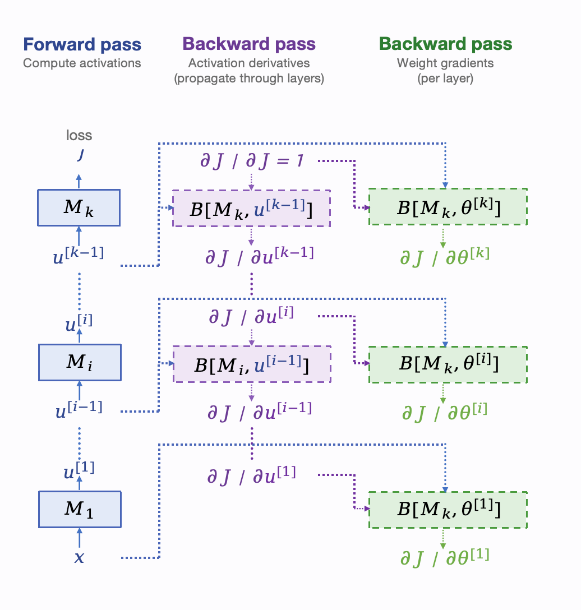
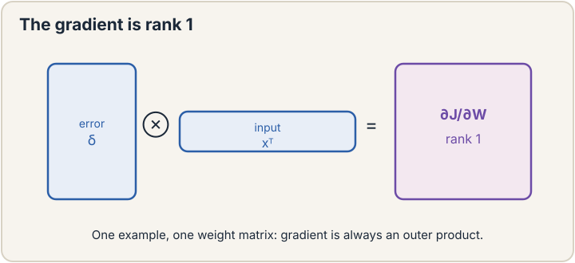

## How to read this lesson

This lesson has two levels. **Level 1 (Core)** contains what you need to
understand everything that follows in CS229 and the courses that build on
it. **Level 2 (Deep)** contains what you need for correct, interview-grade
understanding. Read Level 1 straight through. Return to Level 2 when you
want depth.

No prerequisites are assumed. Every term is defined at first use. The
neuron, MLP, and residual block were defined in [lecture
7](l07-neural-networks-1.html); they are reused, not re-explained.

## Level 1: The fundamental theorem

Training needs the gradient of the loss with respect to every parameter.
A modern network has billions of parameters. Computing a billion
derivatives sounds like it should cost far more than one forward pass.
It does not.

The theorem: both the forward pass (evaluating the loss) and the gradient
computation run in time linear in the number of parameters
[11:00](ts:11:00). O(N) for the loss, O(N) for all N derivatives. The
lecture's main job is proving this and showing the algorithm that
achieves it: **backpropagation**.

The proof idea is composition. A network is a chain of **modules**
M_1 ... M_k: matrix multiplies, activations, normalizations. The forward
pass computes each module's output in turn. The backward pass walks the
chain in reverse, and each module does a fixed amount of work
proportional to its own size. Sum over modules: O(N). No module ever
needs to know the whole network.

> [!QA]
> Q: Why is backprop O(N) and not O(N^2)?
> A: Each module's backward step costs proportional to that module's parameter count, not the network's. The chain rule factors the full gradient into local pieces, one per module. Summing local costs over all modules gives O(N) total. The naive alternative, perturbing each parameter and remeasuring the loss, costs O(N) forward passes: O(N^2). Backprop's trick is sharing work across parameters.
> Follow-up: Does the constant matter in practice?
> A: Yes. Backprop costs roughly 2x a forward pass: one forward sweep plus one backward sweep of similar size. Training step budgets in large runs assume this 3x ratio (forward plus backward plus optimizer). The theorem gives the scaling. Engineering gives the constant.

## Level 1: Modules and backward functions

Each module M has a forward function and a **backward function**
[26:53](ts:26:53). Forward: given input x, compute output u = M(x).
Backward: given the gradient of the loss with respect to the output,
dJ/du, compute the gradient with respect to the input, dJ/dx.

The backward function is the **chain rule** [17:59](ts:17:59): dJ/dx =
(transpose of the Jacobian of M) times dJ/du [23:35](ts:23:35). The
**Jacobian** is the matrix of all partial derivatives of the output with
respect to the input. You never form it fully. Each module implements its
own backward directly, using only its local math.

The seed of the backward pass is dJ/dJ = 1 at the loss. Walk it back
through every module. Two streams emerge: activation derivatives that
propagate through layers, and weight gradients collected per layer. The
modules need not match: matmul, sigma, LayerNorm each bring their own
backward. Compose them and the chain rule handles the rest.

> [!QA]
> Q: What is a backward function, concretely?
> A: For a module with forward u = M(x), the backward function takes the incoming gradient dJ/du and returns dJ/dx = J_M^T · dJ/du, where J_M is the module's Jacobian. For a matrix multiply it is a matrix-vector product. For an elementwise activation it is elementwise multiplication by the derivative. Each module author writes one backward, and the chain rule composes them.
> Follow-up: Why the transpose?
> A: Dimensions. dJ/du is a row-like object over outputs; dJ/dx must be row-like over inputs. The Jacobian maps input-directions to output-directions, so pulling a gradient back through it needs the transpose. In code this is just the right multiplication order. The transpose is bookkeeping, not deep mathematics.

## Level 1: The gradient is rank 1

A gem from the lecture. For one training example and one weight matrix,
the gradient dJ/dW is always **rank 1** [55:00](ts:55:00): an outer
product of the error vector and the input vector.

This is the error-times-input pattern from lecture 2, grown up. The
gradient is not a generic matrix. It has structure: every row is a scaled
copy of the input. Efficiency methods exploit this fact to compress
updates. With many examples the gradients average and the rank grows, but
the per-example structure is the building block.

For activations the backward is even simpler. Elementwise activation
means each output depends only on its own input, so the Jacobian is
**diagonal** [57:37](ts:57:37): sigma'(z_i) on the diagonal, zeros
elsewhere. Backward through an activation is elementwise multiplication
by the derivative. No matrix needed.

> [!QA]
> Q: Why does the rank-1 fact matter?
> A: It says gradients carry far less information than their size suggests. A d-by-d weight gradient from one example has d^2 entries but only 2d degrees of freedom. Update-compression and low-rank adaptation methods exploit exactly this. It also explains why gradient noise has structure: the noise lives in a low-dimensional subspace per example.
> Follow-up: Does the rank stay 1 for a minibatch?
> A: No. The minibatch gradient is the average of per-example rank-1 matrices, and the average of rank-1 matrices is generally full rank. The rank-1 property is per example. Methods that exploit it must handle the averaging explicitly.

## Level 2: Apply it twice. Second-order methods

The module construction applies twice. Take one gradient step:
theta' = theta - alpha * grad J(theta). Evaluate J(theta'). Now
differentiate with respect to theta. Theta appears twice: directly, and
inside theta'. The backward functions compose again, at about 3x the
parameter cost. This is the basis of **second-order methods**
[13:09](ts:13:09): Hessian-vector products without ever forming the
Hessian.

Applications: meta-learning (differentiate through the learning step
itself), hyperparameter gradients, and curvature-aware optimizers. The
point is not the applications. It is that backprop is a general
differentiation engine for composed computations, not just a neural
network trick. Any differentiable program gets O(N) gradients.

## Level 2: Vectorization over examples

The lecture closes by batching the whole construction over training
examples. Stack examples into matrices. Every module's forward and
backward becomes matrix math. GPUs do matrix math fast. This is why
minibatch training from lecture 2 is not just statistics: it is also the
unit of efficient computation. The mathematics of backprop and the
hardware of GPUs agree on the batch as the atomic workload.

## Recap: the whole lesson on one screen

Eight ideas carry this lecture. Read each card. Say the core sentence out
loud. If you can, you own the lesson.

<strong>1. The theorem: O(N) for loss and gradient</strong>

Forward pass and full gradient both cost linear in parameter count.
Backprop achieves it. Finite differences would cost O(N^2).

Key: both O(#params)

<strong>2. Networks are compositions of modules</strong>

Matmul, activation, norm: each with a forward and a backward. Sum of
local costs is O(N). Modules need not match.

Key: M_1 ... M_k, forward then back

<strong>3. Backward = transpose Jacobian times incoming gradient</strong>

dJ/dx = J_M^T dJ/du. Each module implements its own. Seed with
dJ/dJ = 1. The chain rule does the rest.

Key: local backward, global composition

<strong>4. One example, one matrix: rank 1</strong>

dJ/dW = error outer input. The error-times-input pattern, grown up.
Averaging over examples raises the rank.

Key: outer product structure

<strong>5. Activation backward is diagonal</strong>

Elementwise means the Jacobian is diagonal: sigma'(z_i) only.
Backward is elementwise multiply. No matrix needed.

Key: multiply by sigma'(z)

<strong>6. Apply twice: second-order methods</strong>

Differentiate through a gradient step. Hessian-vector products at ~3x
cost, no Hessian formed. Meta-learning lives here.

Key: backprop is a general engine

<strong>7. Two streams: activations and weights</strong>

Activation derivatives propagate through layers. Weight gradients are
collected per layer. Both come from one backward walk.

Key: propagate dJ/du, collect dJ/dW

<strong>8. Batches are the hardware's atom</strong>

Stack examples into matrices. Module math becomes matrix math. GPUs
agree with the statistics: the minibatch is the unit of work.

Key: vectorize over examples

## Official sources and further reading

**Official:**
- Lecture 8 video: O(N) theorem [11:00](ts:11:00), chain rule [17:59](ts:17:59), transpose Jacobian [23:35](ts:23:35), backward function [26:53](ts:26:53), rank 1 [55:00](ts:55:00), diagonal activation backward [57:37](ts:57:37), second-order basis [13:09](ts:13:09).
- CS229 Spring 2026 official course notes: backpropagation chapter; the module figure above is from it.

**Further reading:**
- Rumelhart, Hinton, and Williams (1986), "Learning representations by back-propagating errors": the paper that made backprop famous.
- Griewank and Walther, Evaluating Derivatives: the general theory of automatic differentiation.

**Caveats from these sources.** The O(N) theorem counts arithmetic
operations, not memory: storing activations for the backward pass costs
memory linear in depth times batch size, which is the real bottleneck at
scale. The rank-1 fact is per example; minibatch gradients are full
rank. Second-order via double backprop costs extra memory for the
computation graph.

## Connections to the other courses

- **CS336:** every transformer training step is this lecture's backward walk at billion-parameter scale; the 3x forward-backward cost ratio governs training budgets.
- **CS224N:** backprop through time is the same chain rule unrolled over sequence steps.
- **CS329H:** policy gradients differentiate through sampling, and the module view explains why the score-function estimator composes.

> [!CHEAT]
> **Backprop cheatsheet.** Theorem: forward O(N), gradient O(N). Modules M_1..M_k each with forward and backward. Backward: dJ/dx = J_M^T dJ/du; seed dJ/dJ=1. Rank-1: one example, one W gives error outer input. Activations: diagonal Jacobian, elementwise multiply by sigma'(z). Twice: Hessian-vector products ~3x, basis of second-order methods. Batch everything into matrices.

> [!MEMORY]
> **Share the work.** Backprop's whole trick is that N derivatives share one backward walk. Whenever a computation looks like it needs N separate passes, ask what walk they could share.
