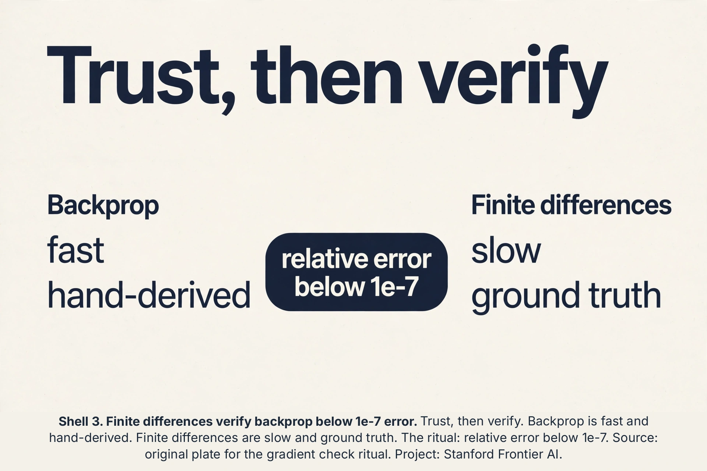
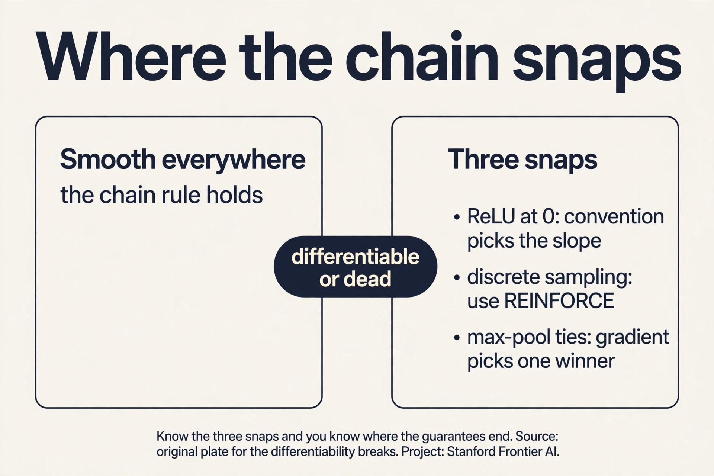
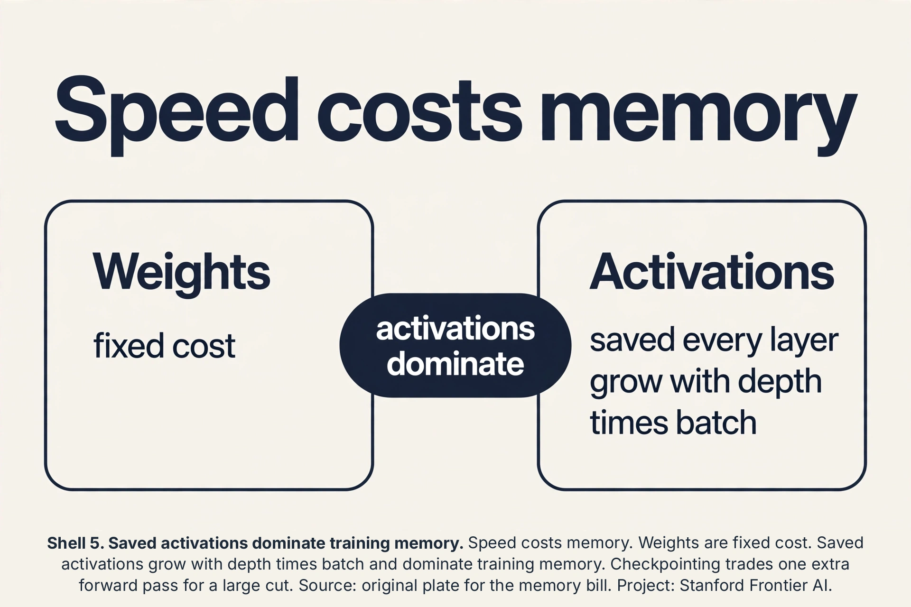
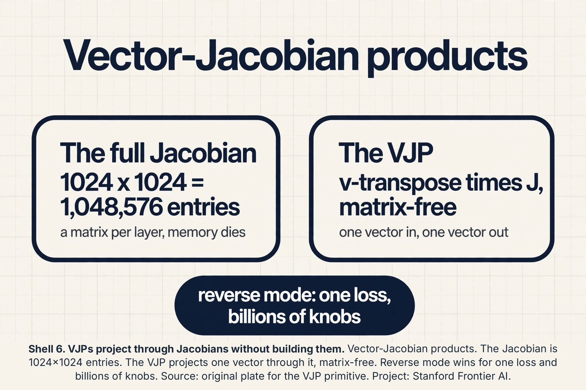
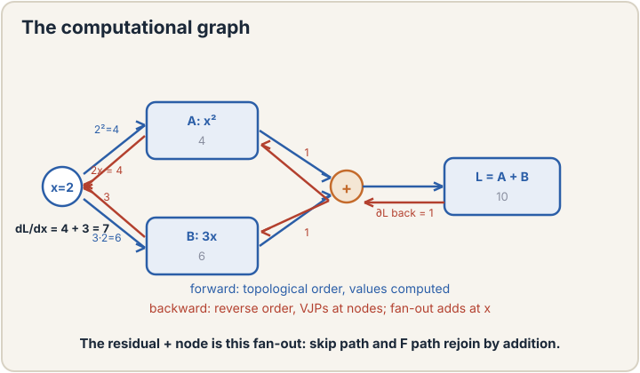
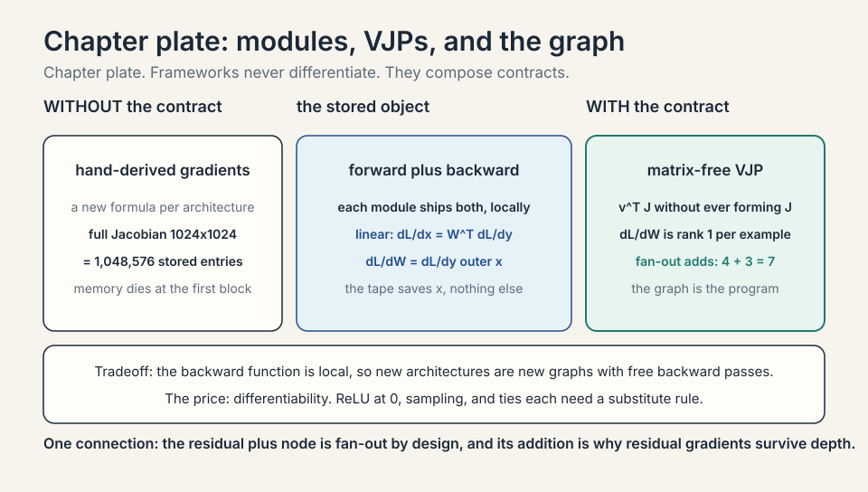
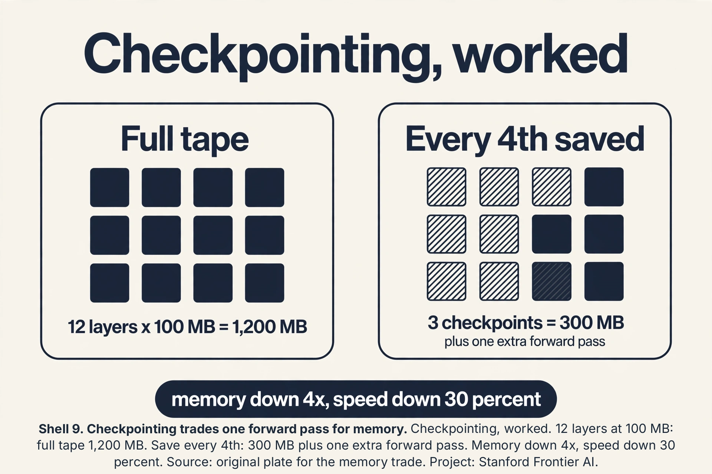
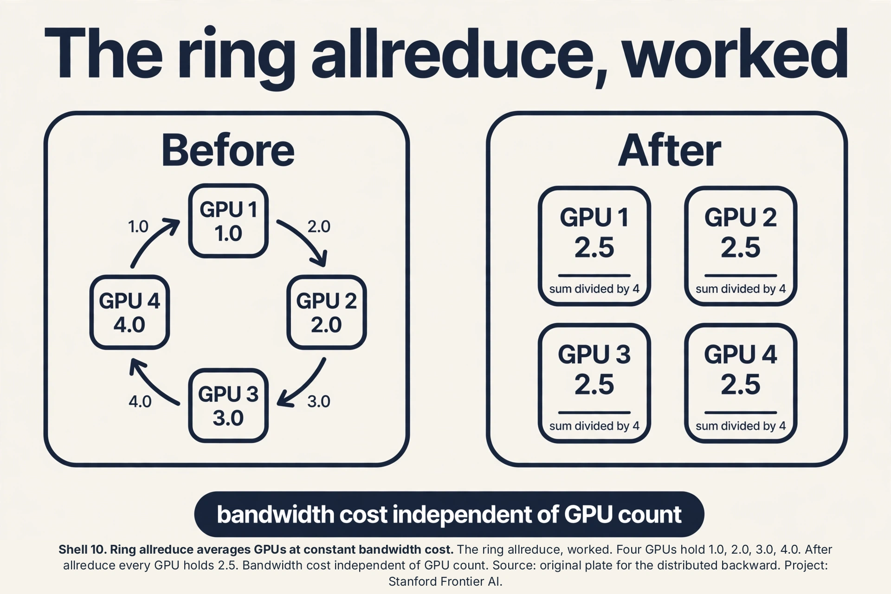
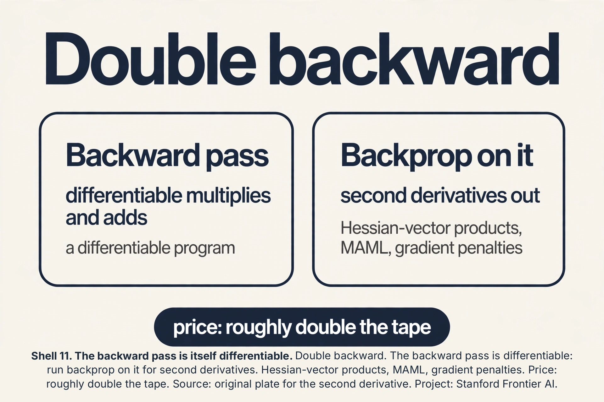
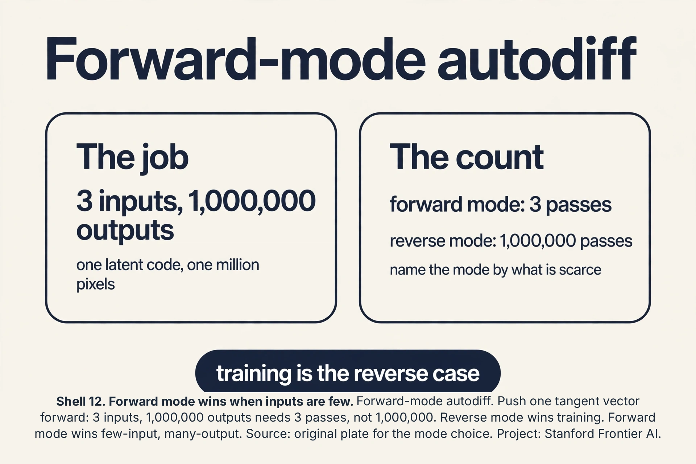

### Coverage and sourcing

This lesson follows Lecture 8 of Stanford CS229 (Machine Learning,
Spring 2026, instructor Tengyu Ma): "Neural Networks 2
(Backprop)". The lecture proves the backprop complexity theorem
(forward and gradient both cost O(parameters)), derives the
module-wise backward functions, and covers the rank-1 gradient and
second-order methods. It draws on the official subtitle transcript
and the course notes. The coverage map at the end of the chapter
maps every major lecture claim to the section that covers it.
Figures and claims marked "October 2026" are updates added after
the lecture, each with its source.

## The job: train 10,000 knobs before lunch

Lecture 7 built the MLP. A modest one has 10,000 knobs. Gradient
descent needs the gradient: the downhill direction for every knob.
The naive way to get it is finite differences: nudge knob 1 a hair,
measure how the loss moves, restore. Repeat 10,000 times. Each
measurement is a full forward pass. Training one step costs 10,001
forward passes. For a language model with 1 billion knobs, one
gradient step costs 1 billion forward passes. The universe ends
first.

The key question: can all 10,000 (or 1 billion) derivatives be
computed for the price of one forward pass?

## First attempt: finite differences

Make it concrete. Loss L(w) = w^2, one knob, w = 3. Finite
differences: L(3.001) - L(3) over 0.001 = (9.006 - 9)/0.001 = 6. The
true derivative is 6. It works, and it is simple enough to debug
anything. Its cost is the killer: n knobs need n+1 forward
evaluations per gradient. For the 10,000-knob MLP, each training
step pays 10,001 forward passes. Nobody trains this way, but
everyone debugs this way: finite differences are the ground truth
you check backprop against.

## The chain rule, on a toy with real numbers

A network is a chain of simple operations. The **chain rule** says:
if you know how the loss responds to a module's output, you can
compute how it responds to the module's input, using only local
information. Work it on a 2-layer toy, by hand, before any
formalism.

```ascii
forward pass:
  x = [1, 2]
  W1 = [[1, -1], [0.5, 0.5]],  b1 = [0, 0]
  z1 = W1 x = [1*1 + (-1)*2,  0.5*1 + 0.5*2] = [-1, 1.5]
  a1 = ReLU(z1) = [0, 1.5]
  W2 = [2, -1],  b2 = 0
  y_hat = W2 a1 = 2*0 + (-1)*1.5 = -1.5
  target y = 1
  L = (1/2)(y_hat - y)^2 = 0.5 * (-2.5)^2 = 3.125
```

The prediction is -1.5, the truth is 1, the loss is 3.125. Now walk
backward. At each step, ask: "if this intermediate value wiggled a
little, how much would the loss move?" Multiply by the local slope
to pass the question one step back.

```ascii
backward pass:
  dL/dy_hat = (y_hat - y) = -2.5
      "each unit of prediction moves loss by -2.5"

  dL/dW2 = dL/dy_hat * a1 = -2.5 * [0, 1.5] = [0, -3.75]
      "W2's second knob matters (a1's second entry is live).
       Its first knob does not (a1's first entry is 0)"

  dL/da1 = W2 * dL/dy_hat = [2, -1] * (-2.5) = [-5, 2.5]
      "push a1's entries along W2's direction"

  dL/dz1 = dL/da1 * ReLU'(z1) = [-5 * 0, 2.5 * 1] = [0, 2.5]
      "ReLU's slope is 0 at z1[0] = -1 (dead), 1 at z1[1] = 1.5 (live)"

  dL/dW1 = dL/dz1 outer x = [0, 2.5]^T [1, 2] = [[0, 0], [2.5, 5]]
      "each weight's gradient is downstream signal times its input"
```

Read the result. Every knob's gradient came from one backward walk,
reusing each module's local slope. The dead ReLU (z1[0] = -1)
zeroed a whole row of W1's gradient: that neuron learns nothing
this step, exactly lecture 7's dying neuron, now visible in the
arithmetic. One forward pass, one backward pass, all gradients. No
finite differences.

### Subchapter: the two-billion-multiply audit

O(N) is a claim. Audit it on the toy. Forward pass multiplies:
W1 x is a 2x2 matrix-vector product: 4 multiplies, 2 adds. ReLU:
2 comparisons. W2 a1: 2 multiplies, 1 add. Loss: about 3 ops. Total
forward: roughly 12 operations. Backward pass: dL/dW2 is a scalar
times a vector: 2 multiplies. dL/da1 is a vector times a scalar: 2.
dL/dz1: 2. dL/dW1 is an outer product: 4 multiplies. Total
backward: roughly 10 operations. The backward pass costs about the
same as the forward, not N times more. Scale this audit to 1
billion knobs: each module's backward does work shaped like its
forward, so the ratio stays near 2 to 1. Count, do not fear.

 theorem. Project: Stanford Frontier AI.")

## The fundamental theorem

The lecture states it as an informal theorem. A differentiable
circuit with N operations computing one real-valued output: the
forward pass costs O(N), and the full gradient costs O(N) too. Not
O(N^2). Not N forward passes. One constant factor more than the
forward pass.

Why it matters: N here counts operations, which for a network is
proportional to the parameter count. The gradient for 1 billion
knobs costs about as much as 2 or 3 forward passes, not 1 billion.
This single fact is what makes training large models possible. The
lecture's phrasing: the gradient is "efficiently computable" at the
same scale as the function itself.

The mechanism behind the theorem is **modules with backward
functions**. Each operation (matrix multiply, ReLU, loss) knows two
things: how to compute its output from its input (forward), and how
to convert "gradient with respect to my output" into "gradient with
respect to my input" (backward). Chain the backward functions in
reverse order and the gradient pops out. Modern frameworks
(PyTorch, JAX) are exactly this: a library of modules, each with a
forward and a backward, composed into a graph.

. Backpropagation. Forward pass computes values. Backward pass chains each module's backward function in reverse. Full gradient costs O(N), like the forward pass. Source: original plate for Stanford Frontier AI.")

### Subchapter: gradient checking, the ritual

Finite differences are too slow to train with and exactly right to
debug with. The ritual: after implementing a backward pass, compare
it against centered differences, (L(w+e) - L(w-e)) / 2e, with
e = 1e-5. Check the toy's dL/dW2[1] = -3.75: nudge W2[1] by 1e-5
both ways, recompute the loss, and the difference quotient should
match -3.75 to about 7 digits. The pass criterion is relative
error below 1e-7 for float64. Every deep learning framework runs
this check in its test suite: the slow method certifies the fast
one. When your custom layer's gradients look wrong, this is the
first tool, not printf debugging.



### Subchapter: when the chain snaps

Backprop needs differentiability, and three common ops break it.
ReLU at exactly 0: the slope is undefined, and frameworks pick a
convention (usually 0 or 1). It almost never matters in practice,
because landing exactly on 0 has probability zero with float
arithmetic. Discrete sampling: you cannot differentiate through a
coin flip, so lecture 16's REINFORCE scores the sample instead of
differentiating through it. Ties in max-pooling: two equal maxima
make the "which input won" choice ambiguous, and the gradient goes
to one of them arbitrarily. The rule: wherever the chain snaps, you
need a substitute rule, a stochastic estimator, or a tie-break.
Know the three snaps and you know where backprop's guarantees end.



: 1B knobs cost 2-3 forward passes, not 1B. Bottom: finite differences stay as the debugging ground truth, and memory is the invoice. Dense chapter plate. Source: original synthesis of the lecture. Project: Stanford Frontier AI.")

## The module contract

The lecture's central abstraction: every operation is a module
with two functions. Forward: given the input, compute the output.
Backward: given the gradient of the loss with respect to the
output, compute the gradient with respect to the input (and the
weights). The contract is local: the backward function needs only
the module's own saved values, never the rest of the network.

### Subchapter: the linear module, worked

Module: y = Wx + b. Forward on the toy's numbers: W = [[1,-1],
[0.5,0.5]], x = [1,2], b = [0,0]: y = [-1, 1.5]. Backward: given
dL/dy = [g1, g2], the contract returns dL/dx = W^T * dL/dy and
dL/dW = dL/dy outer x. With dL/dy = [0, 2.5]: dL/dx = [1*0 +
0.5*2.5, -1*0 + 0.5*2.5] = [1.25, 1.25]. dL/dW = [0,2.5]^T [1,2] =
[[0,0],[2.5,5]]. The backward function is three multiplies per
weight: the same shape of work as the forward. Every module in the
zoo (ReLU, softmax, convolution, attention) ships exactly this
pair. Frameworks never differentiate. They compose contracts.

### Subchapter: the saved tensors

The backward function needs the forward's intermediates: the
linear module's backward needs x (for dL/dW) but not y. ReLU's
backward needs the sign of z (or the output). The framework's
**tape** (PyTorch) or **tracer** (JAX) records which tensors each
backward will need and keeps them alive. Forget to save x and the
backward recomputes or crashes. This is the memory bill's origin:
the tape holds every layer's inputs until the backward pass
consumes them.

### Subchapter: the memory bill, priced

The backward pass needs the forward pass's intermediates: a1, z1
in the toy. Price it. A layer with batch B and hidden size h
stores B*h floats per activation tensor. A 12-layer network with
B = 32 and h = 1024 stores 12 * 32 * 1024 = 393,216 floats per
tensor type, about 1.5 MB per type in float32: small here,
gigabytes at transformer scale. Weights are fixed cost. Activations
grow with depth times batch, and they dominate training memory.
The escape hatch is activation checkpointing: save only every
k-th layer and recompute the rest on the backward pass. It trades
one extra forward pass for a large memory cut. The O(N) theorem
buys speed. Memory is the invoice.



## Vector-Jacobian products: the real primitive

The backward function has a formal name: the **vector-Jacobian
product** (VJP). The Jacobian J of a module is the matrix of all
partial derivatives (output dim x input dim). The VJP computes
v^T * J for an incoming vector v: it projects the output-side
gradient back to the input side without ever forming J.

### Subchapter: why not the full Jacobian

A layer maps 1,024 dims to 1,024 dims. Its Jacobian is 1,024 x
1,024 = 1,048,576 entries. The VJP needs one matrix-vector product:
about 1,048,576 multiplies, same count, but it never stores the
matrix and it composes: chain VJPs and the intermediates stay
vectors. Form the full Jacobian at every layer and memory dies at
the first transformer block. The lecture's module framing is the
VJP in work clothes: "gradient with respect to my output in,
gradient with respect to my input out" is v^T * J, computed
matrix-free. The forward-mode dual is the **Jacobian-vector
product** (JVP): push a direction forward. Reverse mode (VJP)
wins when outputs are few and parameters are many (one loss,
billions of knobs). Forward mode wins for few inputs, many
outputs. Training is the first case. Always.



## The computational graph

Unroll the network's operations into a **directed acyclic graph**:
nodes are values (tensors), edges are modules. The forward pass
evaluates nodes in topological order. The backward pass walks the
reverse order, applying each module's VJP.

### Subchapter: fan-out adds gradients

A value used twice splits the graph: x feeds both module A and
module B. The chain rule says dL/dx = (dL/dA)*(dA/dx) +
(dL/dB)*(dB/dx): the gradients from each use ADD. Work it: x = 2,
A computes x^2 = 4, B computes 3x = 6, loss = A + B = 10.
dL/dx = 2x + 3 = 7. The backward pass accumulates 4 (from A) + 3
(from B) = 7 at x's node. Residual connections (lecture 7) are
fan-out by design: x feeds F and the skip, so the gradient splits
into the F path and the untouched skip path. The "+" node in the
graph is where the two gradient streams rejoin by addition. Every
skip connection in every ResNet and transformer is this addition.

### Subchapter: the graph is the program

PyTorch builds the graph dynamically as the Python code runs
(define-by-run): each forward op appends a node with its VJP.
JAX traces the function once into a static graph, then transforms
it. Same chain rule, different bookkeeping. The interview line:
backprop is not a formula. It is graph traversal with VJPs at the
nodes. New architectures (attention, Mamba, diffusion samplers)
are new graphs, and their backward passes fall out of the same
traversal.





## The rank-1 gradient

Look again at dL/dW2 = [0, -3.75]. It equals (dL/dy_hat) * a1: a
column vector times a row vector, an **outer product**. An outer
product always has rank 1: every row is a multiple of one vector.
The lecture proves this holds for every weight matrix in the
network: each gradient dL/dW is rank 1 (for one example).

This is not trivia. It means the gradient's information is
structured: the update to W is "add a multiple of (signal outer
input)". Low-rank structure is what makes some advanced optimizers
and compression schemes possible. It also explains a subtle fact:
the gradient never has more independent directions than the batch
provides. With batch size 1, every weight update is rank 1.


## Second order without the matrix

Lecture 3 priced Newton's method at O(n d^2 + d^3): the Hessian
(second-derivative matrix) is d by d, and inverting it is hopeless
at scale. The lecture salvages something. You cannot form the
Hessian for d = 1 billion (10^18 entries), but you can compute a
**Hessian-vector product** H*v in O(N) time, the same cost as a
gradient, using one extra backward pass through the gradient
computation.

Why that suffices: many second-order methods never need H itself,
only its product with vectors. Conjugate gradient, for example,
solves H^-1 g by repeated H*v products. So the door to curvature
information is not fully closed at scale. It is open exactly as far
as matrix-free methods can walk through. The lecture's contrast:
the matrix is too big to exist, but its action on any vector is
cheap.

 with 10^18 Hessian entries at d = 1B. Center: rank-1 gradients and Hessian-vector products. Right: H*v in O(N) via double backward: the matrix never exists. Bottom: curvature survives only for matrix-free methods. Dense chapter plate. Source: original synthesis of the lecture. Project: Stanford Frontier AI.")

## Gradient clipping: the explosion guard

The chain multiplies slopes. When they compound upward, gradients
explode: one bad batch sends a weight to infinity and the loss to
NaN. **Gradient clipping** caps the step: if the gradient norm
exceeds a threshold C, scale the whole gradient down to norm C.

### Subchapter: clip by norm, worked

Gradient g = (3, 4): norm 5. Threshold C = 1. Scale factor:
1/5 = 0.2. Clipped: (0.6, 0.8), norm 1. Direction preserved,
magnitude capped. The update stays bounded no matter what the
batch did. Why clip the norm and not each value: per-value
clipping distorts the direction (it clips coordinates
independently). Norm clipping keeps the direction honest and only
tames the size. Standard in RNN and transformer training (lecture
14): C = 1.0 is the common default. The interview line: clipping
does not fix the cause of explosions (bad init, bad rate). It
keeps the run alive while you find the cause.

## Checkpointing, worked

The memory bill said activations dominate. **Activation
checkpointing** (gradient checkpointing) trades compute for
memory: save only every k-th layer's activations, recompute the
rest during the backward pass.

### Subchapter: the trade, priced

Twelve layers, each activation 100 MB. Full tape: 1,200 MB.
Checkpoint every 4th layer: save 3 checkpoints (300 MB). Backward
through layers 12-9: recompute 9-11 from checkpoint 8 (one extra
forward over 3 layers), then run their VJPs. Total extra compute:
about one additional forward pass over the network. Memory falls
from 1,200 MB to 300 MB plus workspace. The price is 30-40 percent
slower training. Decision rule: checkpoint when memory binds
(first), buy bigger GPUs when money binds. Every large
transformer run checkpoints: without it, the tape for a 70B model
at long context does not fit on any GPU.



## Distributed backprop: allreduce

One GPU cannot hold the batch or the model. **Data parallelism**
copies the model to G GPUs, splits the batch G ways, and each GPU
runs forward-backward on its shard. Each GPU now holds a gradient
computed on 1/G of the data. The true batch gradient is the
average.

### Subchapter: the ring allreduce, worked

Four GPUs with gradient shards (on one weight): GPU0 has 1.0,
GPU1 has 2.0, GPU2 has 3.0, GPU3 has 4.0. **Allreduce** sums them
across GPUs and divides by 4: every GPU ends with 2.5. The ring
algorithm passes shards around the ring: each GPU sends 1/G of the
data per step, 2*(G-1) steps total. Bandwidth cost is independent
of G: doubling the GPUs does not double the communication. Then
every GPU applies the same averaged gradient to its copy: the
copies stay in sync. The interview line: data parallel backprop is
local backprop plus one allreduce. The math is identical to a big
batch. The systems cost is the allreduce bandwidth.



## Double backward: differentiating the backward

The backward pass is itself a differentiable program: it is made
of multiplies and adds. Run backprop on the backward pass and you
get second derivatives. This is **double backward**.

### Subchapter: what it buys

Hessian-vector products (the lecture's second-order section) are
double backward in disguise: differentiate the gradient computation
with respect to the weights, applied to a vector. Meta-learning
(MAML) differentiates through an inner optimization step: the
outer gradient flows through the inner step's backward pass.
Gradient penalties (WGAN-GP) penalize the gradient's norm, which
needs the gradient of the gradient. Price: double backward stores
the backward's intermediates too, roughly doubling the tape. Most
training never needs it. When you do (meta-learning, penalties,
curvature), the framework gives it for free: the VJPs compose.



## Backprop through time, the thumbnail

Sequences reuse one module across time steps: the same RNN cell
runs at t = 1, 2, ..., T. Unroll it: T copies of the cell in a
chain. Backprop walks the unrolled chain: this is **backprop
through time** (BPTT).

### Subchapter: the shared-weight wrinkle

The T copies share one weight matrix. Fan-out adds gradients: each
copy's dL/dW accumulates into the same W. Work it: 3 steps, copies
compute dL/dW of (0.1, 0.2, 0.3): the update uses 0.6. The chain
through time multiplies the same Jacobian T times: if its largest
eigenvalue is 0.9, the signal decays as 0.9^T (vanishing). If 1.1,
it grows as 1.1^T (exploding). This is lecture 7's depth disease
rotated into time: the same multiplication, the same cure family
(gating in LSTMs, clipping, careful init). Full BPTT stores all T
steps' activations: truncated BPTT processes chunks of K steps to
cap the tape. The interview line: BPTT is backprop on the unrolled
graph. The wrinkles are weight sharing (sum the gradients) and the
repeated Jacobian (vanish or explode).

## Reversible layers: the memory escape hatch

Checkpointing recomputes activations from saved checkpoints. A
**reversible layer** goes further: design the layer so its input
can be recomputed exactly from its output. Then save nothing.

### Subchapter: the RevNet trick

Split the input into (x1, x2). Forward: y1 = x1 + F(x2), y2 = x2
+ G(y1). Backward needs (x1, x2): recover x2 = y2 - G(y1), then
x1 = y1 - F(x2). Exact, no storage. The tape for a reversible
network is O(1) in depth: only the final output is saved. Price:
the architecture is constrained (the split-and-add form), and the
recomputation costs one extra forward pass, like checkpointing.
Used where depth is extreme and memory is the wall. The interview
line: reversibility trades architectural freedom for a tape that
does not grow with depth.

 tapes in depth. Bottom: speed costs memory: checkpoint when memory binds, buy GPUs when money binds. Dense chapter plate. Source: original synthesis of the lesson. Project: Stanford Frontier AI.")

## Sparse gradients: the embedding backward

The embedding lookup (lecture 7) has a special backward. Forward:
look up row 3 of a 10,000-row table. Backward: the gradient flows
only into row 3. The other 9,999 rows get exactly zero.

### Subchapter: why sparsity matters

A dense backward would touch all 10,000 x 64 = 640,000 entries per
example. The sparse backward touches 64. At vocabulary 50,000 and
batch 1,024, the dense version is 50,000x the work for 49,999 rows
of zeros. Frameworks implement embedding backward as indexed
adds: accumulate each example's gradient into its row. The
optimizer must handle sparse updates too (Adam's momentum for
untouched rows stays stale, which is correct: no signal, no
change). The interview line: embedding gradients are sparse by
construction. Any dense implementation is a 10,000x slowdown bug.

## The straight-through estimator

Some ops have no useful gradient: quantization rounds to the
nearest integer (gradient zero almost everywhere), step functions
are flat. The **straight-through estimator** (STE) lies
productively: forward, apply the real op (round). Backward,
pretend the op was the identity (pass the gradient through
unchanged).

### Subchapter: quantization-aware training, worked

Weight w = 0.7, quantize to 1 bit: round(0.7) = 1. Forward uses 1.
Backward receives dL/dq = 0.5: STE passes 0.5 to w as if no
rounding happened. w updates by the real gradient of the quantized
model. The lie is principled: the quantized model's loss really
does change with w (through the rounding boundary), and the
identity surrogate points the right way on average. Used in
quantization-aware training (lecture 15's quantization): train
with fake quantization nodes so the deployed int8 model keeps its
accuracy. The interview line: STE is a biased gradient that works.
Admit the bias, ship the model.

## Forward-mode autodiff: the JVP

Reverse mode (VJP) computes one loss's gradient over billions of
knobs. **Forward mode** (JVP) computes one input direction's
effect on all outputs. Push a tangent vector forward through the
graph: each module applies its Jacobian to the incoming direction.

### Subchapter: when forward mode wins

A function from 3 inputs to 1,000,000 outputs (a generator's
latent code to pixels). Reverse mode needs 1,000,000 backward
passes (one per output). Forward mode needs 3 (one per input
direction). The crossover: forward mode wins when inputs are few
and outputs are many. Training is the reverse case (billions of
knobs, one loss), so reverse mode owns deep learning. Forward mode
appears in: Hessian-vector products via forward-over-reverse,
neural ODEs, and sensitivity analysis. The interview line: name
the mode by what is scarce. Few losses, many knobs: reverse. Few
inputs, many outputs: forward.



## Pipeline parallelism: the backward bubble

Data parallelism copies the model. **Pipeline parallelism** splits
it: GPU0 holds layers 1-3, GPU1 holds layers 4-6. Micro-batches flow
through the pipe: GPU0 forwards micro-batch 1, hands activations
to GPU1, starts micro-batch 2.

### Subchapter: the bubble, priced

The pipe has a fill and drain phase: at the start GPU1 idles
waiting for GPU0's first output. At the end GPU0 idles while GPU1
finishes. With 4 stages and 8 micro-batches, the bubble (idle
fraction) is about (stages - 1) / micro-batches = 3/8 = 37.5
percent of the step. More micro-batches shrink the bubble but grow
the activation memory (each in-flight micro-batch holds its
tape). The backward pass flows backward through the same pipe.
Interleaved schedules (each GPU holds two non-adjacent stage
chunks) cut the bubble further. The interview line: pipeline
parallelism trades a bubble for fitting bigger models. Data
parallel has no bubble but copies everything.

## Gradient accumulation, worked

The batch does not fit. **Gradient accumulation** runs K small
forward-backward passes, sums the gradients, and steps once. The
math equals one big batch.

### Subchapter: the sum is exact

Batch 64 does not fit. Batch 32 does. Loss on 64 examples:
L = (1/64) * sum_64 l_i. Two passes of 32: pass 1 gradient =
(1/64) * sum_first32 dl_i, pass 2 = (1/64) * sum_last32 dl_i
(scale each pass's mean loss by 1/2, or sum and divide once).
Summed: (1/64) * sum_64 dl_i. Identical to the batch-64 gradient.
The optimizer steps once on the sum. Memory: batch-32 tape. Math:
batch-64 gradient. The exception is batch normalization: its mean
and variance are per-32, not per-64, so the normalized values
differ. With layer norm or no norm, accumulation is bit-exact in
the gradient (up to float summation order). The interview line:
accumulation buys batch size with time. Two passes, one step,
same math.

## Batch norm backward, conceptually

Batch norm's backward is the most feared in the zoo, because the
normalization couples every example to every other. Forward:
x_hat_i = (x_i - mu) / sigma, with mu and sigma computed over the
batch. Backward: dL/dx_i has three paths. The direct path through
x_hat_i. The path through mu (x_i contributed to the mean). The
path through sigma (x_i contributed to the variance).

### Subchapter: why it is worth knowing

You will never hand-derive it in production (the framework does).
But the structure explains two behaviors. One: batch norm's
backward is O(batch) per element with cross terms, which is why
tiny batches give noisy gradients (each example's gradient depends
on 31 strangers, not 1023). Two: at test time the module uses
running averages, so the backward's coupling vanishes: train and
test really are different functions. The interview line: do not
derive it. Know that it couples the batch, and know why small
batches suffer.

## Mixed precision backward: loss scaling, worked

Float16 gradients underflow: values below 6e-5 round to zero, and
early-layer gradients live down there. **Loss scaling** shifts the
whole backward pass into representable range.

### Subchapter: the scale dance

Loss L = 2.5. Scale factor S = 1024. Backward runs on 1024 * L:
every gradient is 1024x larger, safely above the fp16 floor. Before
the optimizer step, divide the weight gradients by 1024: the update
is exact (in fp32 master weights). If any gradient overflows to
inf (fp16 max is 65,504), skip the step and shrink S. Dynamic loss
scaling automates this: grow S when steps are clean, shrink on
overflow. Numbers: a gradient of 1e-6 underflows fp16 (rounds to
0). Scaled by 1024: 1.02e-3, representable. The interview line:
loss scaling is a change of units for the backward pass. The math
is identical. The floats survive.

## The honest price

Backprop buys O(N) gradients and pays three prices. First, memory:
the backward pass needs the forward pass's intermediate values
(a1, z1), so training stores every layer's activations. For deep
networks this dominates memory, which is why the later lectures
obsess over activation checkpointing and KV caches. Second,
numerical fragility: the chain multiplies many local slopes, so
vanishing and exploding gradients (lecture 7, the RNN lesson) are
backprop's native diseases. Third, the theorem needs
differentiability: ReLU's kink at 0, discrete sampling, and
if-statements break the chain, and each needs its own workaround.
The gradient is cheap, exact, and partial: it tells you the
downhill direction from here, nothing about the terrain beyond.

## Mapping back

| Idea | Pain it answers | How |
|---|---|---|
| Chain rule backward walk | Finite differences need n+1 forward passes per gradient | One backward pass reuses local slopes; toy: all gradients from a single reverse walk |
| Fundamental theorem | Gradient cost seemed to scale with knob count | Forward O(N) implies gradient O(N); 1B knobs cost ~2-3 forward passes, not 1B |
| Modules + backward functions | Hand-deriving gradients per architecture | Each op ships forward and backward; frameworks compose them; the graph is the program |
| Rank-1 gradient | Gradient structure was opaque | dL/dW = signal outer input; rank 1 per example; toy W2 gradient [0, -3.75] |
| Hessian-vector products | Newton needs O(d^3); Hessian has 10^18 entries at d=1B | H*v in O(N) via double backward; matrix-free methods keep curvature affordable |
| Module contract | Each op's backward was hand-derived folklore | Forward plus backward as a local API; linear module worked: dL/dx = W^T dL/dy |
| VJP | Full Jacobians would drown memory | v^T J matrix-free; reverse mode wins for one loss, billions of knobs |
| Computational graph | Backprop looked like a formula | DAG traversal with VJPs; fan-out adds: residual skip plus F path rejoin by addition |
| Gradient clipping | One bad batch explodes the run | Clip norm to C: (3,4) norm 5 becomes (0.6,0.8); direction kept, size tamed |
| Checkpointing | The tape does not fit | Save every 4th layer: 1,200 MB to 300 MB for one extra forward pass |
| Allreduce | One GPU cannot hold the batch | Ring sums shards: (1,2,3,4) to 2.5 on all; bandwidth cost independent of G |
| Double backward | Second derivatives looked impossible | Backprop on the backward pass; MAML, penalties, curvature |
| BPTT | Sequences reuse one cell | Unroll, walk back; shared weights sum gradients; 0.9^T vanishes, 1.1^T explodes |
| Reversible layers | The tape grows with depth | Recompute inputs from outputs: y1 = x1 + F(x2); O(1) tape in depth |
| Sparse embedding backward | Dense backward on tables is 10,000x waste | Indexed adds touch only the looked-up rows |
| Straight-through estimator | Rounding has zero gradient | Forward rounds, backward pretends identity; quantization-aware training |
| Forward-mode JVP | Reverse mode is not always cheapest | Push tangents forward; wins for few inputs, many outputs |
| Pipeline bubble | One GPU cannot hold the model | Split layers across GPUs; bubble = (stages-1)/micro-batches |
| Gradient accumulation | The batch does not fit | K small passes, sum, one step; exact except batch norm |
| Batch norm backward | The coupling confuses | Three paths: direct, through mu, through sigma; small batches suffer |
| Loss scaling | fp16 gradients underflow | Scale loss by 1024, unscale before step; 1e-6 becomes representable |

> [!QA]
> Q: Why is backpropagation O(N) and not O(N^2)?
> A: Each module's backward function converts the gradient at its output to the gradient at its input using only local information: a matrix-vector product shaped like the module itself. Chaining these in reverse visits each module once, so the total work is proportional to the number of operations N, the same as the forward pass. The naive fear was that each of the N knobs needs its own pass. The chain rule shares the work across all knobs in one reverse walk.
> Follow-up: What exactly must be stored from the forward pass?
> A: Every intermediate value the backward functions need: the inputs to each module (a1, z1 in the toy). That is why training memory is dominated by activations, not weights. Forget to save them and you recompute the forward pass: the price of backprop's speed is memory.

> [!QA]
> Q: Work one step of the toy backward pass from the numbers.
> A: Forward gave y_hat = -1.5, y = 1, L = 3.125. dL/dy_hat = -2.5. dL/dW2 = -2.5 * [0, 1.5] = [0, -3.75]: the first knob gets zero gradient because its input a1[0] = 0. dL/da1 = [2,-1]*(-2.5) = [-5, 2.5]. dL/dz1 = [-5*0, 2.5*1] = [0, 2.5]: the dead ReLU at z1[0] = -1 kills that path. dL/dW1 = [0,2.5]^T [1,2] = [[0,0],[2.5,5]]. Every number follows from "downstream signal times local slope".
> Follow-up: Which knob learns the most this step, and why?
> A: W1[1,1] with gradient 5: it sits on the live path (a1[1] = 1.5, ReLU slope 1) fed by the largest input (x[1] = 2) with the full downstream signal (2.5). Gradient descent will move it most. The dead neuron's row stays frozen: zero gradient, zero learning, exactly the dying-ReLU phenomenon.

> [!QA]
> Q: What does "the gradient of a weight matrix is rank 1" mean?
> A: For one training example, dL/dW = (backward signal) outer (forward input): a column times a row. Every row of that matrix is a multiple of the input vector, so the matrix has rank 1 no matter how big W is. In the toy, dL/dW2 = [0, -3.75] is (-2.5) times [0, 1.5]. Practical meaning: a single example's update carries one direction of information per layer. The batch size caps the rank of the total update.
> Follow-up: How do Hessian-vector products dodge the O(d^3) bill?
> A: Forming the Hessian needs d^2 entries and inverting it d^3 work: dead at d = 1B. But H*v, the Hessian's action on one vector, costs O(N) via an extra backward pass through the gradient graph. Matrix-free methods like conjugate gradient only ever need H*v, so they get curvature information without ever building the matrix. The lecture's line: the matrix is too big to exist, its action is cheap.

## Recap: the whole lesson on one screen

1. **The job.** Gradients for 10,000 knobs before lunch. Finite
   differences need 10,001 forward passes per step.
2. **First attempt.** Finite differences: correct, simple, dead at
   scale. Kept only as the debugging ground truth.
3. **The key question.** Can all derivatives cost one forward pass?
4. **The chain rule, by hand.** 2-layer toy: forward gives
   y_hat = -1.5, L = 3.125. Backward walk: dL/dW2 = [0,-3.75],
   dL/dW1 = [[0,0],[2.5,5]]. Dead ReLU zeroes a row.
5. **The theorem.** Forward O(N) implies gradient O(N). 1B knobs
   cost ~2-3 forward passes. This is why large models train.
6. **Modules.** Each op ships forward + backward. Frameworks
   compose them. The graph is the program.
7. **Rank 1.** dL/dW = signal outer input, per example. Batch size
   caps update rank.
8. **Hessian-vector.** H*v in O(N). The matrix never exists.
   Curvature stays affordable for matrix-free methods.
> [!QA]
> Q: Walk me through the mechanism: compute dL/dW1[1,1] from scratch using only the rule "downstream signal times input".
> A: The weight W1[1,1] multiplies input x[1] = 2 to feed z1[1]. The downstream signal at z1[1] is dL/dz1[1] = 2.5: every unit z1[1] rises moves the loss by 2.5. The rule: gradient = downstream signal times the weight's own input = 2.5 * 2 = 5. That matches the toy's matrix [[0,0],[2.5,5]]. Every entry of every weight gradient is this product: how much the loss cares about the output side, times what the input side fed in.
> Follow-up: Why is the whole first row of dL/dW1 zero?
> A: The first row feeds z1[0], whose downstream signal dL/dz1[0] = 0: the dead ReLU at z1[0] = -1 killed it. Zero signal times any input is zero. The neuron learns nothing this step: the dying-ReLU phenomenon, visible as a row of zeros.

> [!QA]
> Q: Applied design: training runs out of memory at batch 64 but fits at batch 32, and you need batch-64 gradients. Options?
> A: Three, in order of preference. Gradient accumulation: run two batch-32 forward-backward passes and sum the gradients before stepping. The math is identical to one batch-64 step. Activation checkpointing: save fewer intermediates, recompute on backward. Same math, about 30% slower, large memory cut. Mixed precision: float16 activations halve memory, but the math changes slightly and some ops need float32 master weights. Decision rule: accumulation first (free correctness), checkpointing second, mixed precision when speed matters too.
> Follow-up: Does gradient accumulation change the learning dynamics at all?
> A: No, if you sum the full gradients before one optimizer step: the gradient of the 64-example loss equals the sum of the two 32-example gradients. Batch normalization is the exception: its statistics are per-mini-batch, so two batches of 32 normalize differently than one of 64. With layer norm or no norm, accumulation is exact.

> [!QA]
> Q: When does backprop silently give the wrong answer?
> A: Three classic silent bugs. In-place operations that overwrite a saved activation before the backward pass reads it: the gradient is computed from corrupted values with no error raised. Custom backward functions with a wrong formula: the chain runs fine and returns wrong numbers. Nondeterministic ops (some GPU reductions) make the gradient irreproducible across runs. The defense is the gradient-check ritual: centered differences with relative error below 1e-7 certify any backward pass. If the check fails, the bug is in your backward, not in calculus.
> Follow-up: Why centered differences and not one-sided?
> A: One-sided (L(w+e)-L(w))/e has error O(e): with e = 1e-5 the truncation error is 1e-5, too coarse to certify 1e-7. Centered (L(w+e)-L(w-e))/2e has error O(e^2) = 1e-10, which is below float64 noise and actually tests the implementation.

> [!QA]
> Q: The rank-1 gradient sounds like trivia. Why should I care?
> A: Because it constrains what the optimizer can do in one step. A batch-32 update to any weight matrix has rank at most 32: only 32 independent directions, no matter how many millions of weights. Optimizer designers exploit this: K-FAC approximates the curvature with Kronecker factors that respect the outer-product structure, and low-rank adaptation (LoRA) fine-tunes with rank-r updates that echo the gradient's own low rank. The interview answer: one example, one direction per layer. The batch size is the rank budget.
> Follow-up: So with batch size 1, the network can only learn one thing per layer per step?
> A: One direction per layer per step, not one thing: the rank-1 update still touches every weight, just along a single direction in weight space. Over many steps the directions accumulate into full-rank learning. But the per-step budget is real, and it is why tiny batches train noisily: each step commits to one direction.

> [!QA]
> Q: Walk me through the mechanism: a value x feeds two modules A and B. Why do the gradients add, and where does this appear in real architectures?
> A: The loss depends on x through both paths: L(A(x), B(x)). The multivariable chain rule gives dL/dx = (dL/dA)(dA/dx) + (dL/dB)(dB/dx): each path contributes its own chain, and they sum. In the toy: x = 2, A = x^2 = 4, B = 3x = 6, L = A + B = 10: dL/dx = 4 + 3 = 7. In real architectures this is every skip connection: x feeds F(x) and the identity path, so the backward signal splits and rejoins by addition at the + node. That addition is the entire reason residual gradients survive depth.
> Follow-up: What if x feeds the same module twice (weight sharing, like an RNN unrolled)?
> A: Same rule, one wrinkle: the two uses share the weight matrix W, so both copies' dL/dW accumulate into the single W. With 3 time steps giving (0.1, 0.2, 0.3), W's update uses 0.6. The activations differ per step (each copy has its own x_t), but the parameter is one. Forgetting to sum (updating per copy) is a classic BPTT bug.

10. **The audit.** Toy forward ~12 ops, backward ~10. The ratio
    stays near 2 to 1 at any scale.
11. **The ritual.** Centered differences, relative error below
    1e-7. The slow method certifies the fast one.
12. **The memory bill.** Activations grow with depth times batch
    and dominate. Checkpointing trades compute for memory.
13. **The snaps.** ReLU at 0, discrete sampling, max-pool ties.
    Know where the guarantees end.
14. **The contract.** Forward plus backward, local. Linear module:
    dL/dx = W^T dL/dy, dL/dW = dL/dy outer x. Tape saves x.
15. **VJP.** v^T J, matrix-free. Reverse mode for one loss and
    billions of knobs. JVP is the forward dual.
16. **The graph.** DAG traversal. Fan-out adds gradients. The
    residual + node rejoins two streams.
17. **Clipping.** Norm 5 to 1: (3,4) becomes (0.6,0.8).
    Direction kept, explosion capped.
18. **Checkpointing.** 1,200 MB to 300 MB for one extra forward.
    The 4x memory cut costs 30 percent speed.
19. **Allreduce.** (1,2,3,4) to 2.5 everywhere. Data parallel is
    local backprop plus one ring sum.
20. **Double backward.** Backprop on the backward pass. H*v,
    MAML, penalties. Double the tape.
21. **BPTT.** Unroll the cell, walk back. Shared W sums
    gradients. 0.9^T vanishes, 1.1^T explodes.
22. **Reversible.** x2 = y2 - G(y1). O(1) tape in depth, one
    extra forward, constrained architecture.
23. **Sparse.** Embedding backward touches only looked-up rows.
    Indexed adds, not dense multiplies.
24. **STE.** Forward rounds, backward pretends identity. Biased
    gradient that ships quantized models.
25. **Forward mode.** JVP pushes tangents forward. Few inputs,
    many outputs: 3 passes beat 1,000,000.
26. **Pipeline.** Split layers, not batches. Bubble =
    (stages-1)/micro-batches: 37.5% at 4 stages, 8 micros.
27. **Accumulation.** Two batch-32 passes sum to one batch-64
    gradient. Exact, except batch norm's per-batch statistics.
28. **Batch norm backward.** Three paths: direct, through the
    mean, through the variance. Small batches, noisy gradients.
29. **Loss scaling.** 1024x the loss, unscale before the step.
    fp16 underflow defeated.

## What is used where

**Every training pipeline runs this lesson.** PyTorch autograd and
JAX grad are module-and-backward-function systems exactly as the
lecture frames them: each op ships a vector-Jacobian product, and
the framework chains them. Gradient checkpointing is standard in
large-model training runs. The gradient-check ritual lives in
every framework's test suite and in any team that writes custom
CUDA kernels or custom autograd functions.

**Distributed training is allreduce plus this lesson.**
Data-parallel runs (every large pre-training job) average
gradients with ring allreduce before each optimizer step. Gradient
clipping at norm 1.0 is the default guard in transformer training
configs. BPTT is the training loop for every RNN, and its
truncated variant caps the tape for long sequences.

## Watch next

<div class="video-block"><div class="video-wrap"><iframe src="https://www.youtube-nocookie.com/embed/Ilg3gGewQ5U" title="3Blue1Brown: What is backpropagation really doing?" allow="accelerometer; autoplay; clipboard-write; encrypted-media; gyroscope; picture-in-picture" allowfullscreen loading="lazy" referrerpolicy="strict-origin-when-cross-origin"></iframe></div><p class="video-cap">Explainer: 3Blue1Brown, What is backpropagation really doing? Grant Sanderson animates the chain rule on a tiny network. Watch after the toy walkthrough.</p></div>

## Go deeper

- [Yes you should understand backprop (Karpathy, 2016)](https://karpathy.medium.com/yes-you-should-understand-backprop-e2f92405c9e7)
- Karpathy's guided tour of the chain rule on a tiny circuit, with the "pullback" intuition. Matches the module-contract sections. (Medium blocks bots. Open in a browser.)
- [PyTorch autograd mechanics](https://pytorch.org/docs/stable/notes/autograd.html)
- The official notes on how the tape records VJPs, when graphs are freed, and how double backward composes. Matches the tape and graph sections.

## Official sources and further reading

**Official:**
- Lecture 8 video, Stanford Online YouTube:
  - [Tengyu Ma states](https://www.youtube.com/watch?v=ne2ngVAoMG8)
  the complexity theorem, builds the chain rule via modules and
  backward functions, and derives the rank-1 gradient and
  Hessian-vector products.
- Official subtitle transcript (en-US): the lecture's spoken text.
- CS229 Spring 2026 official course notes (local PDF): the formal
  theorem statement and derivations.

**Caveats from these sources.** The theorem is stated informally in
the lecture ("if you really want to make it formal you need a lot
of jargon"). The precise circuit model is in the notes. The 2-layer
toy in this lesson is an original miniature demonstrating the
lecture's module/backward-function framing with the lecture's
conventions. The "1 billion knobs" scale is the lecture's
motivating regime for the theorem.

## Connections to the other courses

- **CS229 L02:** gradient descent, the consumer of the gradients
  this lesson produces.
- **CS229 L07:** the MLP architecture whose knobs backprop trains.
  The dying ReLU visible in the toy's arithmetic.
- **CS229 L14-L15:** backprop at transformer scale: activation
  memory becomes the KV cache problem.
- **CS336:** the O(N) theorem in practice: how frameworks
  implement backward functions on GPUs.
- **CS224N:** backprop through time: the chain rule unrolled over
  sequences.

## Coverage map: every lecture claim and where it lives

| Lecture claim | Covered in | File line |
|---|---|---|
| 10,000 knobs need gradients before lunch; finite differences need 10,001 passes | The job; First attempt: finite differences | L47, L61 |
| Chain rule on the 2-layer toy: y_hat = -1.5, L = 3.125 | The chain rule, on a toy with real numbers | L72 |
| Backward walk: dL/dW2 = [0,-3.75], dL/dW1 = [[0,0],[2.5,5]] | The chain rule, on a toy with real numbers | L72 |
| Dead ReLU zeroes a row of W1's gradient | The chain rule, on a toy with real numbers | L72 |
| Two-billion-multiply audit: backward ~ forward cost | the two-billion-multiply audit | L123 |
| Fundamental theorem: forward O(N) implies gradient O(N) | The fundamental theorem | L138 |
| Gradient checking ritual: centered differences, 1e-7 | gradient checking, the ritual | L164 |
| Module contract: forward plus backward, local | The module contract | L195 |
| Linear module worked: dL/dx = W^T dL/dy = [1.25,1.25] | the linear module, worked | L204 |
| Saved tensors: the tape holds x for dL/dW | the saved tensors | L216 |
| VJP: v^T J matrix-free; reverse vs forward mode | Vector-Jacobian products | L243 |
| Computational graph: DAG, topological order | The computational graph | L269 |
| Fan-out adds gradients: 4 + 3 = 7; residual + node | fan-out adds gradients | L276 |
| Rank-1 gradient: dL/dW = signal outer input | The rank-1 gradient | L302 |
| Memory bill: B*h floats per tensor; activations dominate | the memory bill, priced | L227 |
| Hessian-vector products in O(N), matrix never exists | Second order without the matrix | L319 |
| Chain snaps: ReLU at 0, discrete sampling, max-pool ties | when the chain snaps | L179 |
| Gradient clipping: (3,4) to (0.6,0.8) at C = 1 | Gradient clipping | L337 |
| Checkpointing: 1,200 MB to 300 MB, one extra forward | Checkpointing, worked | L357 |
| Allreduce: (1,2,3,4) to 2.5; ring bandwidth | Distributed backprop: allreduce | L379 |
| Double backward: MAML, penalties, curvature | Double backward | L402 |
| BPTT: unroll, shared weights sum, 0.9^T vs 1.1^T | Backprop through time, the thumbnail | L423 |
| Reversible layers: x2 = y2 - G(y1); O(1) tape | Reversible layers | L445 |
| Sparse embedding backward: indexed adds | Sparse gradients | L463 |
| Straight-through estimator for rounding | The straight-through estimator | L481 |
| Forward-mode JVP: few inputs, many outputs | Forward-mode autodiff: the JVP | L503 |
| Pipeline bubble: (stages-1)/micro-batches | Pipeline parallelism | L525 |
| Gradient accumulation: two batch-32 passes equal batch 64 | Gradient accumulation, worked | L546 |
| Batch norm backward: three paths through x_hat, mu, sigma | Batch norm backward, conceptually | L567 |
| Loss scaling: 1024x shift defeats fp16 underflow | Mixed precision backward | L588 |
