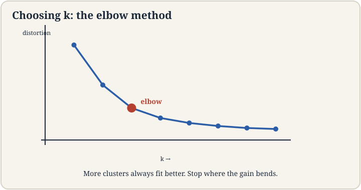
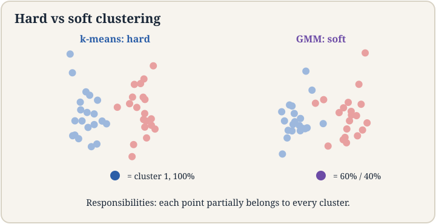

## The job: a million unlabeled customer records

A store has one million customer records: age, yearly spend, visit
frequency. No labels. Nobody tagged anyone "bargain hunter" or
"whale". The job: find the natural groups, so marketing can treat
each group differently. This is **clustering**, the flagship
unsupervised task. No y anywhere. The machine must invent the
categories from the shape of the data.

## First attempt: k-means

The intuitive algorithm: pick k group centers, assign each customer
to the nearest center, move each center to its group's average,
repeat. That is **k-means**, and the lecture calls it ad hoc on
purpose: it is not derived from a probability model, it is just the
obvious thing, and it works.

The two steps, precisely. **Assignment**: each point joins the
cluster whose center mu_j is closest. **Update**: each center moves
to the mean of its assigned points. Repeat until assignments stop
changing.

Watch it on a toy. Six points on a line: {1, 2, 3, 10, 11, 12}.
k = 2. Start centers at mu_1 = 1, mu_2 = 12 (bad luck: the extremes).

```ascii
start:   mu_1 = 1, mu_2 = 12
assign:  {1,2,3} -> mu_1,  {10,11,12} -> mu_2
update:  mu_1 = 2, mu_2 = 11
assign:  unchanged. Done in 1 round.
```

Lucky start. Now start at mu_1 = 1, mu_2 = 2 (both in the left
clump):

```ascii
start:   mu_1 = 1, mu_2 = 2
assign:  {1} -> mu_1,  {2,3,10,11,12} -> mu_2
update:  mu_1 = 1, mu_2 = 7.6
assign:  {1,2,3} -> mu_1,  {10,11,12} -> mu_2
update:  mu_1 = 2, mu_2 = 11.  Done in 2 rounds.
```

Same data, different start, same good answer here. But the lecture
stresses the general truth: the final clusters depend on where the
centers start. K-means converges (the **distortion**, the sum of
squared distances to centers, falls every round and cannot fall
forever), but it converges to a **local minimum**, not the global
one. Different seeds, different answers. The NP-hardness result the
lecture cites says no efficient algorithm guarantees the global
optimum.

## Where it breaks: the seed decides

Demonstrate with numbers. Eight points: four at x = 0 (call them
A), four at x = 10 (B), and the true groups are {A} and {B}. Start
centers at 0 and 0.1 (both inside A). Round 1: all eight points go
to mu_2 = 0.1 (closer than 0 to every B point? B at 10: distance to
0.1 is 9.9, to 0 is 10: yes, mu_2 wins everything). mu_1 gets zero
points. The implementation must handle the empty cluster (common
fix: reinitialize it randomly). Depending on the fix, you can end
with both centers inside A and B unclustered: distortion far above
optimal. The seed decided the answer. On real data with hundreds of
dimensions, bad seeds are the norm, not the exception.

## The key question

Can we seed the centers so cleverly that the local minimum is
probably a good one, with a guarantee?

## k-means++: seed far apart

**K-means++**, from Stanford graduate students (Arthur and
Vassilvitskii), seeds one center at a time: pick the first center
uniformly at random among the points. Pick each next center with
probability proportional to its squared distance from the nearest
existing center. Points far from all centers are likely seeds.
Points near a center are unlikely.

On the toy {1,2,3,10,11,12}: first center lands somewhere, say 2.
Squared distances: 10 is 64 away, 11 is 81, 12 is 100; 1 is 1, 3 is
1. The next seed is overwhelmingly likely to come from {10,11,12}.
The two clumps get one seed each with high probability. The lecture
reports the payoff: k-means++ guarantees an expected approximation
ratio of O(log k) to the optimal distortion. Not optimal (NP-hard
forbids that), but provably close, from seeding alone. It is the
default in sklearn.

## How many clusters? The elbow

K-means needs k up front. The **elbow method**: run k-means for
k = 1, 2, 3, ..., plot the final distortion. Distortion always falls
as k rises (k = n gives distortion 0: every point its own center).
Look for the **elbow**, the k where the curve bends: gains slow
down after it. Toy distortions: k=1: 121.5, k=2: 4.0, k=3: 2.7,
k=4: 1.5. The elbow is at k = 2: the drop from 121.5 to 4.0 dwarfs
everything after. The lecture's honest note: elbows are often
ambiguous on real data. It is a heuristic, not a rule.



## Softening: Gaussian mixture models

K-means makes hard assignments: each point belongs to exactly one
cluster. Real groups overlap. A **Gaussian mixture model** (GMM)
softens everything: the data is a mix of k Gaussians, each point has
a probability of belonging to each one.

The model: pick a cluster j with probability phi_j, then draw x
from Gaussian(mu_j, Sigma_j). The **responsibility** gamma_j(x) is
the posterior probability that point x came from cluster j: how much
cluster j "claims" x. A point between two clumps might be 70 percent
cluster 1, 30 percent cluster 2, instead of k-means' all-or-nothing.

K-means is the limiting case: let every Sigma shrink toward zero
and the responsibilities harden to 0 or 1. The lecture frames GMM as
the probabilistic grown-up of the ad-hoc algorithm: same spirit,
with uncertainty quantified.



## The honest price

K-means buys simplicity and pays in guarantees: local minima, seed
dependence, and no notion of uncertainty. It assumes spherical
clusters of similar size: stretch one cluster into a long ellipse
and k-means splits it wrongly, because Euclidean distance is the
only geometry it knows. Choosing k is a heuristic. GMM buys soft
assignments and pays in fitting: the cluster labels are hidden, so
MLE has no closed form, and the next lecture's EM algorithm must
iterate. Both assume you know the right k and the right distance.
When clusters are non-convex (two interleaved crescents), both fail
and density methods take over.

## Mapping back

| Idea | Pain it answers | How |
|---|---|---|
| K-means | No labels, need groups | Alternate assignment and mean-update; distortion falls every round; toy converges in 1-2 rounds |
| Local-minima diagnosis | Same data, different answers per seed | Convergence is to a local minimum; NP-hard globally; seeds at 0 and 0.1 can strand a cluster |
| K-means++ | Bad seeds are the norm | Seed proportional to squared distance; O(log k) expected approximation ratio; sklearn default |
| Elbow method | k is unknown | Distortion 121.5, 4.0, 2.7, 1.5: the bend at k=2; heuristic, often ambiguous |
| GMM | Hard assignments lie about overlap | Responsibilities: 70/30 splits; k-means is the zero-variance limit |

> [!QA]
> Q: Why does k-means converge, and to what?
> A: Each round has two steps and neither raises the distortion (sum of squared distances to centers). Assignment moves each point to its nearest center, lowering or holding its term. Update moves each center to its points' mean, which is the unique minimizer of its term. Distortion falls every round, is bounded below by 0, so it converges. It converges to a local minimum: no single reassignment or mean-move improves it, but a different seed could reach a better one. The seed-dependence is fundamental, not a bug.
> Follow-up: What do you do about empty clusters?
> A: Common fixes: reinitialize the empty center to a random data point (often the point farthest from its center), or drop it and continue with k-1. The lecture's implementation note: handle it explicitly, because bad seeds produce empty clusters routinely in high dimensions.

> [!QA]
> Q: How does k-means++ seeding work, and what does it guarantee?
> A: Seed centers one at a time. First center uniform at random. Each next center chosen with probability proportional to its squared distance from the nearest existing center: far-apart points are likely seeds. On {1,2,3,10,11,12} with first seed at 2, the squared distances (64, 81, 100 for the right clump vs 1, 1 for the left) make the second seed land in the right clump with high probability. Guarantee: expected distortion within O(log k) of optimal. It cannot promise optimal: the problem is NP-hard.
> Follow-up: Why squared distance and not distance?
> A: Because the objective is squared distance (distortion). Seeding proportional to squared distance samples proportionally to each point's current contribution to the objective, which is what the approximation proof needs. Linear distance would under-seed far outliers relative to their cost.

> [!QA]
> Q: What is a responsibility in a GMM?
> A: The posterior probability that a point came from each cluster: gamma_j(x) = phi_j * Gaussian(x. Mu_j, Sigma_j) / sum over clusters. It is how much cluster j claims the point. A point dead center in cluster 1 has responsibility near 1 for it. A point between clusters splits, e.g., 0.7 and 0.3. K-means' hard assignment is the limit as cluster variances go to zero: responsibilities collapse to 0 or 1.
> Follow-up: When does k-means fail where GMM succeeds?
> A: Overlapping clusters of different sizes or shapes. K-means draws a hard bisector and assumes spheres. A small dense clump next to a big diffuse one gets mis-split. GMM's responsibilities and per-cluster covariances model the overlap and the shapes. The price: fitting needs EM (lecture 10), and you still choose k.

## Recap: the whole lesson on one screen

1. **The job.** One million unlabeled customers. Find the natural
   groups. No y anywhere.
2. **K-means.** Assign to nearest center, move centers to means,
   repeat. Toy {1,2,3,10,11,12} converges in 1-2 rounds.
3. **Where it breaks.** Seeds decide: centers at 0 and 0.1 strand
   a cluster. Local minima, NP-hard globally.
4. **The key question.** Can seeding alone guarantee a good local
   minimum?
5. **K-means++.** Seed proportional to squared distance. O(log k)
   expected approximation ratio. Sklearn default.
6. **The elbow.** Distortions 121.5, 4.0, 2.7, 1.5: bend at k=2.
   Heuristic, often ambiguous.
7. **GMM.** Soft assignments via responsibilities: 70/30 splits.
   K-means is the hard limit.
8. **The honest price.** Local minima, spherical bias, heuristic k,
   EM needed for GMM, both die on crescents.

## Official sources and further reading

**Official:**
- Lecture 9 video, Stanford Online YouTube:
  https://www.youtube.com/watch?v=bSmIGBCoffA — Chris Ré runs
  k-means live, proves convergence to local minima, presents
  k-means++ with its approximation guarantee, and sets up GMMs.
- Official subtitle transcript (en-US): the lecture's spoken text.
- CS229 Spring 2026 official course notes (local PDF): the full
  k-means and GMM treatment.

**Caveats from these sources.** The lecture calls k-means "ad hoc"
deliberately: it is the intuitive algorithm, not a derived one.
The k-means++ attribution (Stanford graduate students Arthur and
Vassilvitskii) and the sklearn-default status are the lecture's.
The toy runs in this lesson are original miniatures of the
lecture's live demos. GMM fitting (EM) is deferred to lecture 10
by the lecture's own ordering.

## Connections to the other courses

- **CS229 L05:** GDA's Gaussians with known labels; GMM is GDA
  with the labels hidden.
- **CS229 L10:** EM: the algorithm that fits GMMs, and PCA for
  visualizing clusters.
- **CS229 L06:** the elbow as model selection. Distortion vs k as
  a bias-variance curve.
- **CS224N:** clustering word vectors: k-means on embeddings.
