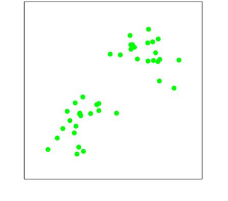
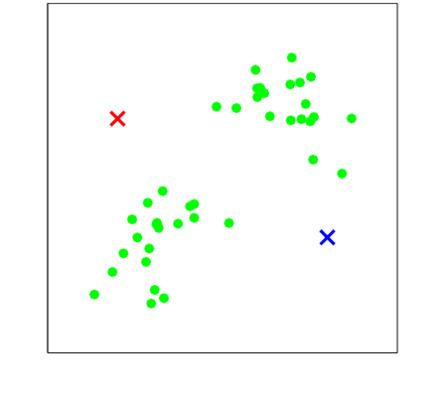
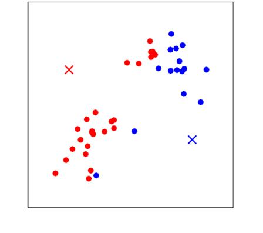
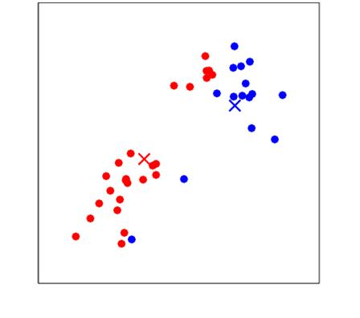
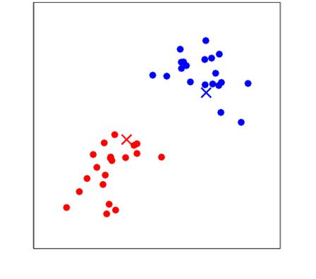
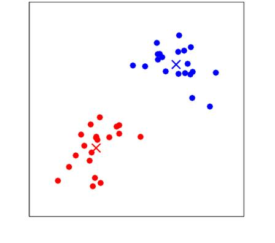

## How to read this lesson

This lesson has two levels. **Level 1 (Core)** contains what you need to
understand everything that follows in CS229 and the courses that build on
it. **Level 2 (Deep)** contains what you need for correct, interview-grade
understanding. Read Level 1 straight through. Return to Level 2 when you
want depth.

No prerequisites are assumed. Every term is defined at first use. This
is the unsupervised block: no labels anywhere. Supervised concepts from
[lectures 2](l02-linear-regression.html) through [8](l08-backpropagation.html)
are reused, not re-explained.

## Level 1: The unsupervised question

No labels. The data is x only. The question changes from "predict y" to
"what structure is hiding here?" The lecture's pedagogical goal is that
question itself: what are we modeling, what structure do we assume, what
do we pull out? The algorithms take five minutes to look up. The judgment
takes the lecture.

**Clustering** is the canonical unsupervised task: split points into
groups so that similar points share a group. Two algorithms, one
intuition. **K-means** is ad hoc but obvious. **Gaussian mixture models**
(GMMs) are the probabilistic, softer version [01:34](ts:01:34). The EM
algorithm that fits GMMs is lecture 10. This lecture builds the
intuition.

Unsupervised methods had a renaissance in the last ten years. The
motivation in the lecture is concrete: photons hitting a plate
[30:43](ts:30:43). You count photon arrivals and must infer how many
sources there are and where they sit. No one labels the photons. The
structure, sources plus noise, must be hypothesized.

> [!QA]
> Q: What is the core difference between supervised and unsupervised learning?
> A: Labels. Supervised training pairs (x, y) tell the algorithm what the right answer is. Unsupervised data is x only, so the algorithm must propose its own structure: clusters, directions, densities. Evaluation is also harder: without labels there is no single score, which is why the lecture stresses the modeling questions over the algorithms.
> Follow-up: When is clustering the right tool?
> A: When you suspect discrete hidden structure and want it made explicit: customer segments, cell types, photon sources. If you only need the structure as features for a later supervised task, softer representations often beat hard cluster assignments. Know what you will do with the clusters before you compute them.

## Level 1: K-means

Pick k. **Initialize** k centers mu_1..mu_k randomly [08:45](ts:08:45).
Then repeat two steps. Assign each point to its nearest center. Move each
center to the mean of its assigned points. Stop when assignments stop
changing.

The **distortion** is the sum of squared distances from points to their
centers [31:33](ts:31:33). Each step lowers it or leaves it unchanged, so
the algorithm **converges** [17:49](ts:17:49). Converges to what? A
**local minimum**. Different random starts give different answers. The
deterministic steps hide one random choice at the top: the
initialization. That choice decides which minimum you land in.

The key unsupervised insight: cluster labels are meaningless
[03:24](ts:03:24). The professor states that cluster identity is unknown:
which cluster is mu 1 or mu 2 is unknowable, because there are no labels.
Swapping all labels changes nothing. What matters is where
the centers ended up, not what they are called.

> [!QA]
> Q: Why does k-means converge, and to what?
> A: Each of the two steps minimizes the distortion with the other fixed: assignment picks the nearest center, and the mean minimizes squared distance to assigned points. Distortion never increases, and there are finitely many assignments, so it must stabilize. It stabilizes at a local minimum, not necessarily the global one. Restarts with different seeds explore different minima.
> Follow-up: How do you pick k?
> A: The **elbow method**: plot distortion against k and stop where the curve bends [01:15](ts:01:15). More clusters always fit better, so the curve always falls. The elbow is where extra clusters stop buying much. It is a heuristic, not a theorem. Domain knowledge beats the elbow when you have it.

## Level 1: K-means++

Random initialization is the weak point. **K-means++** fixes the start
[18:57](ts:18:57). Pick the first center uniformly at random. Pick each
next center with probability proportional to its squared distance from
the nearest existing center. Far-flung points become likely seeds.
Centers spread out instead of piling up.

The result is a theorem, not a trick: k-means++ guarantees an
**approximation ratio** [19:03](ts:19:03), a bound on how far the final
distortion can be from optimal. The optimal clustering is NP-hard, so no
efficient method guarantees perfection. A provable ratio is the best
possible kind of promise. It is the default in sklearn, written by
Stanford graduate students.

> [!QA]
> Q: What does k-means++ actually do differently?
> A: It seeds centers far apart instead of uniformly at random. Each new center is sampled with probability proportional to squared distance from the closest existing center. This spreads seeds across the data's extent and comes with a provable approximation ratio. In practice: better minima, fewer restarts.
> Follow-up: Why is the optimal k-means solution NP-hard relevant?
> A: It tells you to stop looking for the perfect algorithm. NP-hard means no efficient method finds the global optimum in general. The field therefore competes on approximation guarantees and practical behavior. K-means++ is the canonical example: provably good seeding plus a local optimizer.

## Level 1: GMMs, the soft version

K-means assigns each point to exactly one cluster. A **Gaussian mixture
model** softens that: each cluster is a Gaussian with its own mean,
covariance, and mixing weight, and each point belongs to every cluster
partially. The partial memberships are **responsibilities**: the
probability each cluster generated the point.

Hard assignments are a limiting case of soft ones. Let the Gaussians get
narrow and the responsibilities collapse to 0 or 1: you recover k-means.
GMMs also model cluster shape through covariances, where k-means only
knows spherical distance to a center.

Fitting a GMM means maximizing the likelihood over means, covariances,
and weights. The likelihood has a sum inside the log that resists
closed-form attack. The weapon is the EM algorithm: guess the soft
assignments, then fit the Gaussians to the weighted points, then repeat.
Lecture 10 derives it. The photon plate is the running example: each
photon partially belongs to each candidate source.

> [!QA]
> Q: K-means or GMM: which do you pick?
> A: K-means for speed and simplicity: spherical clusters, hard assignments, one distance computation per point per center. GMM for shape and uncertainty: elliptical clusters, soft responsibilities, a real likelihood you can compare across models. If clusters overlap or have different shapes, k-means' hard spherical assumption visibly fails and GMM earns its cost.
> Follow-up: What do the mixing weights mean?
> A: The prior probability of each cluster: what fraction of the data each Gaussian generates. They must sum to one. A tiny weight means a rare cluster the model keeps around because some points need explaining. Weights near zero suggest you picked k too large.

## Level 2: What the distortion leaves out

Distortion measures compactness, not correctness. A clustering can have
low distortion and miss the real structure: elongated clusters get
chopped, overlapping ones get merged. K-means assumes spherical clusters
of similar size because Euclidean distance to a center is its only
notion of belonging. When the assumption fails, the algorithm fails
confidently.

There is also the scaling trap. Features on different scales distort
Euclidean distance: the lecture 10 rescaling discussion applies here
too. Standardize features before clustering, or the large-scale feature
decides every assignment. K-means has no built-in sense of units.

## Level 2: EM as the general pattern

Step back. K-means alternates: assign points given centers, move centers
given assignments. EM will alternate: estimate hidden assignments given
parameters (E-step), maximize parameters given assignments (M-step).
K-means is the hard, zero-temperature limit of EM on a GMM. Learn to see
the alternating pattern and lecture 10 is a derivation, not a new idea.
The pattern recurs anywhere hidden variables meet maximum likelihood.

## Recap: the whole lesson on one screen

Eight ideas carry this lecture. Read each card. Say the core sentence out
loud. If you can, you own the lesson.

<strong>1. Unsupervised: x only, find structure</strong>

No labels. The questions are what to model and what structure to
assume. Photon plate: infer sources from arrival counts.

Key: structure, not prediction

<strong>2. K-means: assign, then move</strong>

Random centers. Assign each point to nearest. Move centers to means.
Repeat until assignments freeze.

Key: two steps, alternating

<strong>3. Distortion never increases</strong>

Sum of squared distances to centers. Each step lowers it. Converges
to a local minimum, not the global one.

Key: monotone, local

<strong>4. Initialization decides the minimum</strong>

Random starts land in different minima. Labels are meaningless: only
center positions matter. Restart and compare by distortion.

Key: labels permute freely

<strong>5. K-means++ seeds far apart</strong>

Sample new centers proportional to squared distance from existing
ones. Provable approximation ratio. The sklearn default.

Key: spread seeds, bound the cost

<strong>6. Elbow picks k</strong>

Plot distortion vs k. Stop at the bend. Heuristic, not theorem. More
clusters always fit better.

Key: diminishing returns

<strong>7. GMM: soft, shaped clusters</strong>

Each cluster a Gaussian with own covariance. Responsibilities split
points across clusters. K-means is the hard limit.

Key: partial membership

<strong>8. The alternating pattern</strong>

Assign given parameters, fit given assignments. EM generalizes it.
See the pattern and lecture 10 is a derivation.

Key: alternate until stable

## Official sources and further reading

**Official:**
- Lecture 9 video: softer clustering [01:34](ts:01:34), elbow [01:15](ts:01:15), no labels [03:24](ts:03:24), random init [08:45](ts:08:45), k-means++ [18:57](ts:18:57), photon plate [30:43](ts:30:43).
- CS229 Spring 2026 official course notes: clustering chapter; the k-means figures above are from it.

**Further reading:**
- Arthur and Vassilvitskii (2007), "k-means++: The Advantages of Careful Seeding": the seeding paper.
- MacQueen (1967): the original k-means paper, for historical flavor.

**Caveats from these sources.** The elbow is a heuristic with no
guarantee; automated elbow-finders disagree. K-means++ bounds the
expected cost, not the worst case. The photon example is illustrative;
real source-separation problems add backgrounds the lecture omits.

## Connections to the other courses

- **CS336:** vector quantization for efficient inference clusters activations; k-means is the algorithm.
- **CS224N:** word-sense clusters and topic models are clustering over text representations.
- **CS329H:** mixture models are the simplest latent-variable decision models; EM is the inference pattern.

> [!CHEAT]
> **Clustering cheatsheet.** Unsupervised: x only, find structure. K-means: random centers, assign nearest, means of assigned, repeat; distortion = sum squared distances, monotone decreasing, local minima; labels meaningless; elbow picks k. K-means++: seed proportional to squared distance; approximation ratio; sklearn default. GMM: Gaussians with own covariances and weights; soft responsibilities; k-means is its hard limit. Pattern: alternate assignment and fitting.

> [!MEMORY]
> **Labels are a luxury.** Without them, every answer is a hypothesis about structure. State the hypothesis before running the algorithm. K-means assumes spheres. If your clusters are bananas, say so first.
