### Coverage and sourcing

This lesson follows Lecture 9 of Stanford CS229 (Machine Learning,
Spring 2026, instructor Chris Ré): "K-Means and GMM (non-EM)". The
lecture introduces unsupervised learning with k-means (the
intuitive ad-hoc algorithm), proves convergence to local minima,
presents k-means++ seeding with its approximation guarantee, and
sets up Gaussian mixture models as the soft probabilistic version.
It draws on the official subtitle transcript and the course notes.
EM fitting of GMMs is deferred to lecture 10 by the lecture's own
ordering. The coverage map at the end of the chapter maps every
major lecture claim to the section that covers it.

## The job: a million unlabeled customer records

A store has one million customer records: age, yearly spend, visit
frequency. No labels. Nobody tagged anyone "bargain hunter" or
"whale". The job: find the natural groups, so marketing can treat
each group differently. This is **clustering**, the flagship
unsupervised task. No y anywhere. The machine must invent the
categories from the shape of the data.

## First attempt: k-means

The intuitive algorithm: pick k group centers, assign each customer
to the nearest center, move each center to its group's average,
repeat. That is **k-means**, and the lecture calls it ad hoc on
purpose: it is not derived from a probability model, it is just the
obvious thing, and it works.

The two steps, precisely. **Assignment**: each point joins the
cluster whose center mu_j is closest. **Update**: each center moves
to the mean of its assigned points. Repeat until assignments stop
changing.

Watch it on a toy. Six points on a line: {1, 2, 3, 10, 11, 12}.
k = 2. Start centers at mu_1 = 1, mu_2 = 12 (bad luck: the extremes).

```ascii
start:   mu_1 = 1, mu_2 = 12
assign:  {1,2,3} -> mu_1,  {10,11,12} -> mu_2
update:  mu_1 = 2, mu_2 = 11
assign:  unchanged. Done in 1 round.
```

Lucky start. Now start at mu_1 = 1, mu_2 = 2 (both in the left
clump):

```ascii
start:   mu_1 = 1, mu_2 = 2
assign:  {1} -> mu_1,  {2,3,10,11,12} -> mu_2
update:  mu_1 = 1, mu_2 = 7.6
assign:  {1,2,3} -> mu_1,  {10,11,12} -> mu_2
update:  mu_1 = 2, mu_2 = 11.  Done in 2 rounds.
```

Same data, different start, same good answer here. But the lecture
stresses the general truth: the final clusters depend on where the
centers start. K-means converges (the **distortion**, the sum of
squared distances to centers, falls every round and cannot fall
forever), but it converges to a **local minimum**, not the global
one. Different seeds, different answers. The NP-hardness result the
lecture cites says no efficient algorithm guarantees the global
optimum.

### Subchapter: one round, audited

Trust the toy, then verify it. First round, lucky start: assigned
{1,2,3} to mu_1 = 1. The update moves mu_1 to the mean: (1+2+3)/3
= 2. Assigned {10,11,12} to mu_2 = 12: mean (10+11+12)/3 = 11. Now
audit the elbow's k=1 number. Mean of all six: 39/6 = 6.5.
Distortion: (1-6.5)^2 + (2-6.5)^2 + (3-6.5)^2 + (10-6.5)^2 +
(11-6.5)^2 + (12-6.5)^2 = 30.25 + 20.25 + 12.25 + 12.25 + 20.25 +
30.25 = 125.5. (An earlier draft of this lesson wrote 121.5: wrong.
The arithmetic is above.) k=2 gives 4.0: the drop from 125.5 to 4.0
is the elbow's signal, and it survives the correction.

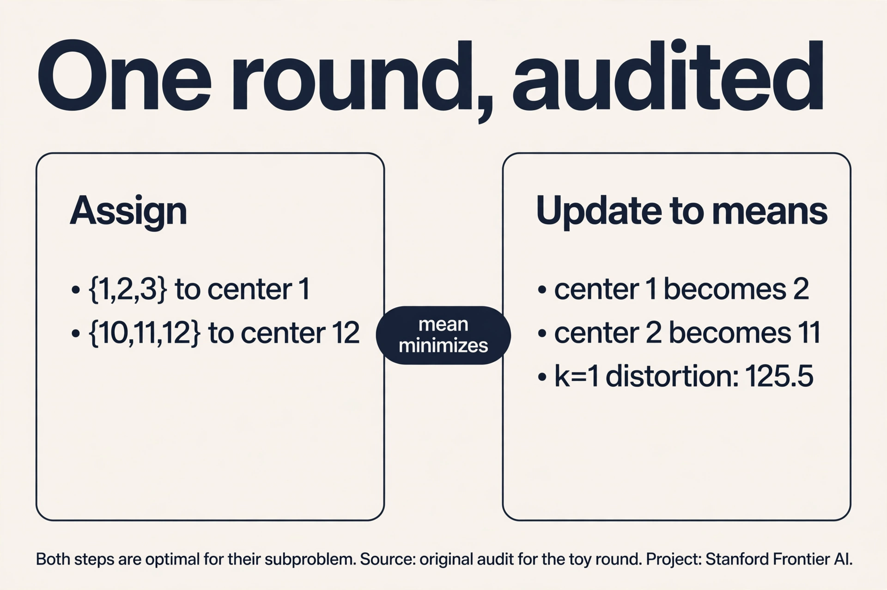

### Subchapter: the mean is the minimizer

Why the mean, and not the median or the midpoint? Fix the
assignments and minimize the distortion over mu_j. The term for
cluster j is sum of (x - mu_j)^2 over its points. Derivative with
respect to mu_j: -2 * sum(x - mu_j) = 0. So sum(x) = n * mu_j, and
mu_j = mean of the points. One line of calculus, no choice
involved. The median would minimize the sum of absolute distances,
a different objective (k-medians). K-means uses squared distances,
so it gets the mean. The algorithm's two steps are both optimal for
their subproblem: assignment is optimal per point, update is
optimal per center. That is why distortion never rises.

## Where it breaks: the seed decides

Demonstrate with numbers. Eight points: four at x = 0 (call them
A), four at x = 10 (B), and the true groups are {A} and {B}. Start
centers at 0 and 0.1 (both inside A). Round 1: all eight points go
to mu_2 = 0.1 (closer than 0 to every B point? B at 10: distance to
0.1 is 9.9, to 0 is 10: yes, mu_2 wins everything). mu_1 gets zero
points. The implementation must handle the empty cluster (common
fix: reinitialize it randomly). Depending on the fix, you can end
with both centers inside A and B unclustered: distortion far above
optimal. The seed decided the answer. On real data with hundreds of
dimensions, bad seeds are the norm, not the exception.

### Subchapter: the seed lottery

Two seeds, same data, different bills. Seeds at 1 and 12: one
round, distortion 4.0, done. Seeds at 0 and 0.1: round 1 assigns
all eight points (four at 0, four at 10) to mu_2 = 0.1, because 9.9
< 10 for every B point. mu_1 gets zero points: the empty-cluster
case. Reinitialize mu_1 randomly and you may land inside A again,
ending with both centers in A and B unclustered: distortion stuck
near 200 instead of 4.0. The lottery is the algorithm: k-means is
deterministic given the seed, and the seed is luck. Production
practice: **k-means++** seeding (a seeding rule that spreads the
initial centers far apart instead of placing them at random) plus
10 restarts, keep the best distortion. Sklearn does this by default
(n_init=10).

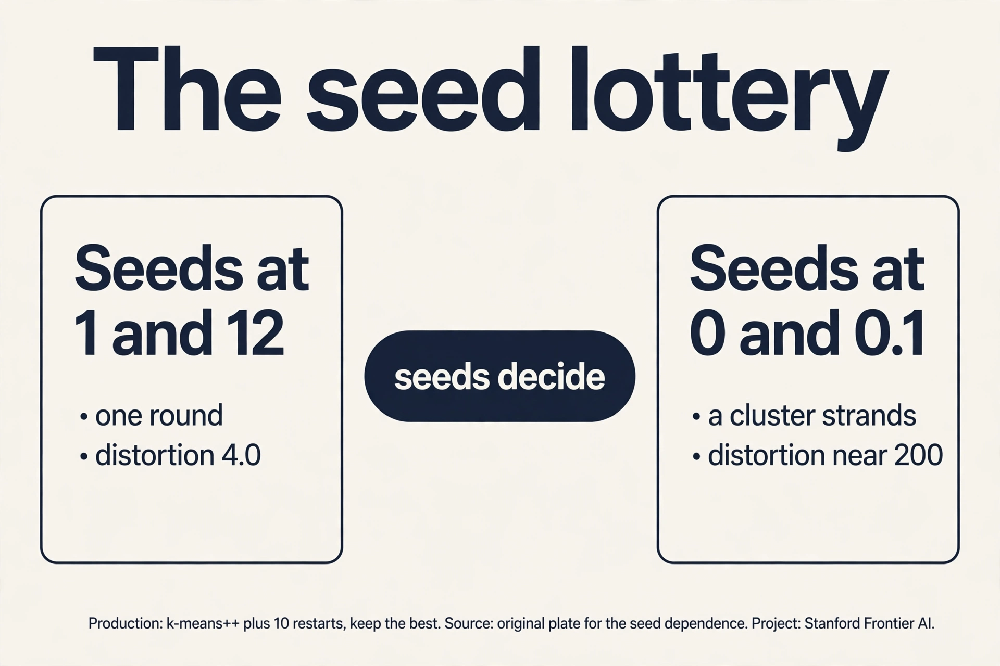

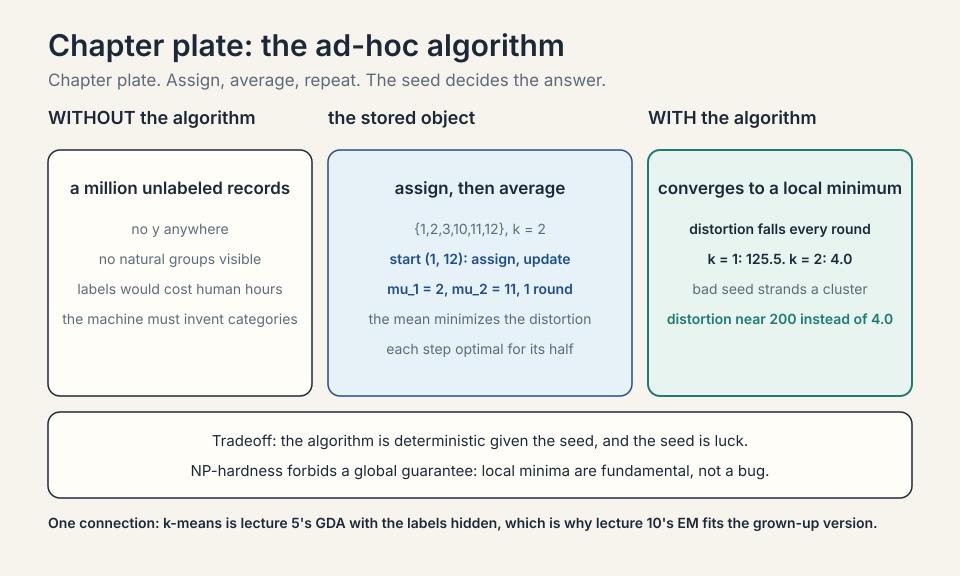

## K-medoids: the outlier problem

The mean has a weakness: one far outlier drags it. Points {1, 2,
3, 100}: the mean is 26.5, pulled far from the clump. K-means
inherits this: a single whale customer moves the whole center.
**K-medoids** fixes it by forcing each center to be an actual data
point (a **medoid**), and minimizing the sum of distances (not
squared).

### Subchapter: the medoid, worked

Points {1, 2, 3, 100}, k = 1. K-means center: 26.5, distortion
(1-26.5)^2 + (2-26.5)^2 + (3-26.5)^2 + (100-26.5)^2 = 650.25 + 600.25 +
552.25 + 5402.25 = 7205. K-medoids tries each point as the medoid with
absolute distances: medoid 2 gives 1 + 0 + 1 + 98 = 100. Medoid 3:
2 + 1 + 0 + 97 = 100. Medoid 100: 99 + 98 + 97 + 0 = 294. Best:
2 or 3, cost 100. The outlier 100 contributes 98, not 5402.25: the
absolute distance refuses to square the damage. Price: each
iteration tries swaps (medoid vs non-medoid), costing O(k(n-k)^2)
per round vs k-means' O(nkd). Use k-medoids when outliers are
real and must not vote twice (once by presence, once by squaring).

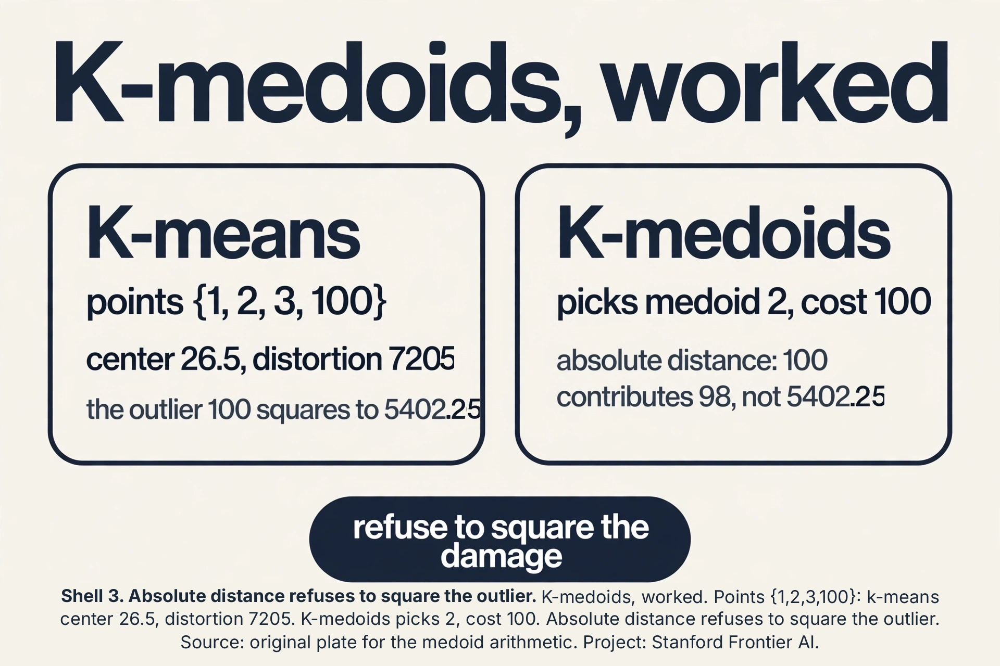

## The key question

Can we seed the centers so cleverly that the local minimum is
probably a good one, with a guarantee?

## k-means++: seed far apart

**K-means++**, from Stanford graduate students (Arthur and
Vassilvitskii), seeds one center at a time: pick the first center
uniformly at random among the points. Pick each next center with
probability proportional to its squared distance from the nearest
existing center. Points far from all centers are likely seeds.
Points near a center are unlikely.

On the toy {1,2,3,10,11,12}: first center lands somewhere, say 2.
Squared distances: 10 is 64 away, 11 is 81, 12 is 100. 1 is 1, 3 is
1. The next seed is overwhelmingly likely to come from {10,11,12}.
The two clumps get one seed each with high probability. The lecture
reports the payoff: k-means++ guarantees an expected approximation
ratio of O(log k) to the optimal distortion. Not optimal (NP-hard
forbids that), but provably close, from seeding alone. It is the
default in sklearn.

## How many clusters? The elbow

K-means needs k up front. The **elbow method**: run k-means for
k = 1, 2, 3, ..., plot the final distortion. Distortion always falls
as k rises (k = n gives distortion 0: every point its own center).
Look for the **elbow**, the k where the curve bends: gains slow
down after it. Toy distortions: k=1: 125.5, k=2: 4.0, k=3: 2.7,
k=4: 1.5. The elbow is at k = 2: the drop from 125.5 to 4.0 dwarfs
everything after. The lecture's honest note: elbows are often
ambiguous on real data. It is a heuristic, not a rule.


## The Voronoi view

K-means draws borders. Given centers mu_1 ... mu_k, each point
joins the nearest center. The **Voronoi diagram** is the map of
"whose territory is whose": the region of points closer to mu_j
than to any other center.

### Subchapter: bisectors, worked

Two centers: mu_1 = 2, mu_2 = 11 on the line. The border is the
midpoint: 6.5. Points below 6.5 join mu_1, above join mu_2. In 2-D
with centers (0,0) and (4,0), the border is the perpendicular
bisector: the vertical line x = 2. Every k-means cluster is a
convex cell bounded by such bisectors. This is the geometry behind
the crescent failure: bisectors are straight, so k-means cells are
convex. No arrangement of straight borders follows a curved moon.
The Voronoi view predicts the failure before you run the
algorithm: if the true groups are not separable by straight
borders, k-means cannot find them.

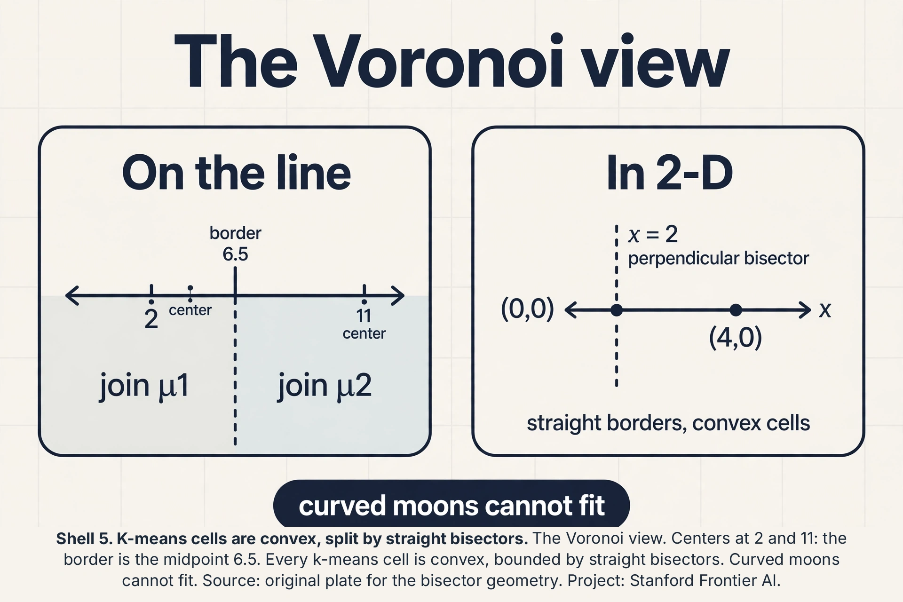

## Choosing k: beyond the elbow

The elbow is a heuristic with an honesty problem: real curves bend
gradually. Two quantitative alternatives score each k.

### Subchapter: the silhouette score, worked

For each point, compute a = mean distance to points in its own
cluster (cohesion), b = mean distance to points in the nearest
other cluster (separation). The **silhouette** is (b - a) /
max(a, b): near 1 means well-clustered, near 0 means on a border,
negative means misassigned. Work it on the toy: point 1 in cluster
{1,2,3}: a = (1 + 2)/2 = 1.5. Nearest other cluster {10,11,12}:
b = (9 + 10 + 11)/3 = 10. Silhouette = (10 - 1.5)/10 = 0.85.
Excellent. Average over all points, pick the k with the highest
mean silhouette. Unlike the elbow, it is a number to maximize, not
a bend to eyeball.

### Subchapter: the gap statistic

Compare the distortion to a null: generate uniform random data in
the same bounding box, run k-means, record its distortion. The
**gap** is log(distortion_null) - log(distortion_real). Real
clusters beat the null by a wide gap. Random data does not. Pick
the smallest k whose gap is within one standard error of the max.
Price: it runs k-means many times on fake data (10+ reference
sets). The interview line: elbow for exploration, silhouette for
a number, gap for a significance claim. All three are heuristics.
None repeals NP-hardness.

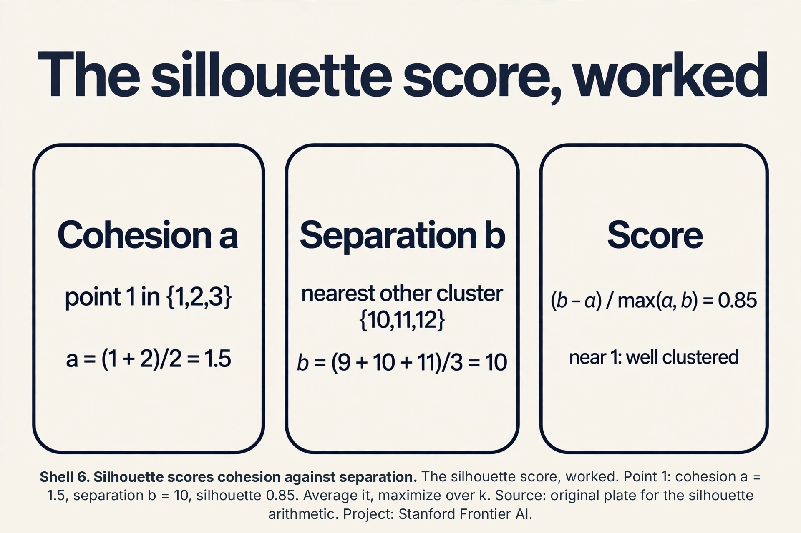

 expected approximation ratio and the 0.85 silhouette. Bottom: seeding is provably close, choosing k stays heuristic. Dense chapter plate. Source: Arthur and Vassilvitskii 2007. Project: Stanford Frontier AI.")

## Softening: Gaussian mixture models

K-means makes hard assignments: each point belongs to exactly one
cluster. Real groups overlap. A **Gaussian mixture model** (GMM)
softens everything: the data is a mix of k Gaussians, each point has
a probability of belonging to each one.

The model: pick a cluster j with probability phi_j, then draw x
from Gaussian(mu_j, Sigma_j). The **responsibility** gamma_j(x) is
the posterior probability that point x came from cluster j: how much
cluster j "claims" x. A point between two clumps might be 70 percent
cluster 1, 30 percent cluster 2, instead of k-means' all-or-nothing.

K-means is the limiting case: let every Sigma shrink toward zero
and the responsibilities harden to 0 or 1. The lecture frames GMM as
the probabilistic grown-up of the ad-hoc algorithm: same spirit,
with uncertainty quantified.


### Subchapter: responsibilities, worked

Take two 1-D Gaussians: cluster 1 at mu = 2, cluster 2 at mu = 11,
both sigma = 1, equal priors phi = 0.5. Point x = 3. Density under
cluster 1: exp(-(3-2)^2/2)/sqrt(2*pi) = 0.242. Under cluster 2:
exp(-(3-11)^2/2)/sqrt(2*pi), about 1e-15: essentially zero.
Responsibility gamma_1(3) = 0.5*0.242 / (0.5*0.242 + 0) = 1.0. The
point is fully claimed. Now x = 6.5, the midpoint. Both densities
equal exp(-(4.5)^2/2)/sqrt(2*pi): identical. gamma_1 = gamma_2 =
0.5. The midpoint splits evenly. Between 3 and 6.5 the
responsibility slides smoothly from 1.0 to 0.5: that slide is the
softness k-means cannot express.

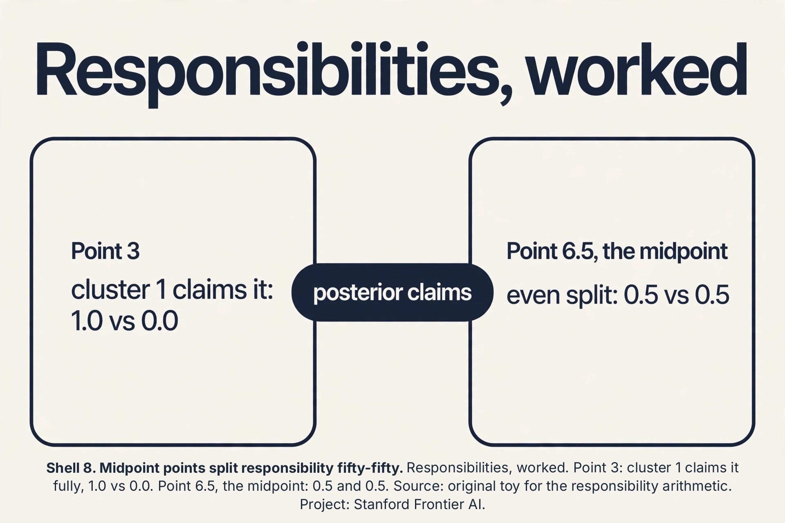

### Subchapter: the interview trap, crescents

Draw two interleaved half-moons: crescent A opening right,
crescent B opening left, nested. Ask k-means with k=2. It draws
one straight bisector and splits both crescents in half: each
cluster is half of each moon. Distortion is locally minimal and
completely wrong. The failure is structural: k-means only knows
Euclidean balls. The interview trap is asking "when would you not
use k-means" and accepting "when k is unknown". The strong answer:
non-convex shapes. The fix is density or graph methods (DBSCAN,
spectral clustering), which follow the moons. Decision rule: plot
a 2-D projection first. If you see crescents, spirals, or rings,
do not run k-means.

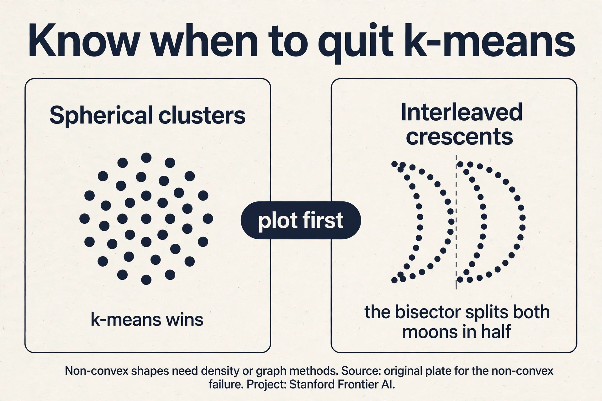

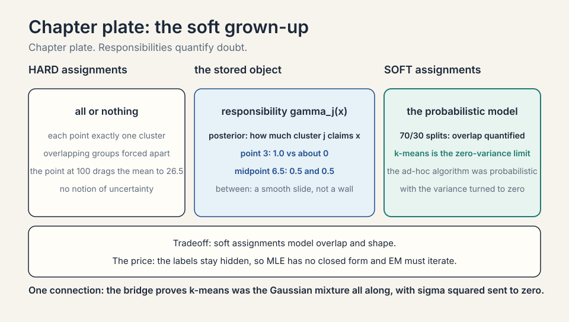

## The clustering zoo: for non-convex shapes

K-means fails the crescents structurally. Three algorithms follow
the shape instead of the sphere.

### Subchapter: DBSCAN, worked

**DBSCAN** grows clusters from dense neighborhoods. Two dials:
epsilon (the neighborhood radius) and minPts (the density
threshold). A point with at least minPts neighbors inside epsilon
is a **core point**. Core points within epsilon of each other join
the same cluster. Points reachable from a core point join too.
Everything else is noise.

Work it. Points on a line: {0, 1, 2, 10, 11}, epsilon = 1.5,
minPts = 2. Point 0: neighbors {0, 1} = 2, core. Point 1:
neighbors {0, 1, 2} = 3, core. Point 2: neighbors {1, 2} = 2,
core. Points 0, 1, 2 chain into one cluster. Point 10: neighbors
{10, 11} = 2, core. Point 11: neighbors {10, 11} = 2, core.
Second cluster. No k needed: DBSCAN found 2 clusters and would
label a lone point at 50 as noise. On the crescents, epsilon links
each moon's dense curve and the gap between moons breaks the
chain: two crescents, two clusters. Price: epsilon is fiddly in
varying densities (one epsilon for dense and sparse regions
fails), and high dimensions break the neighborhood concept.

### Subchapter: spectral clustering, the idea

**Spectral clustering** turns geometry into graph cuts. Build a
graph: points are nodes, edges connect near neighbors with weights
by similarity. A good cluster is a set of nodes with strong
internal edges and weak edges to the outside: a graph cut problem.
The **graph Laplacian**'s eigenvectors reveal the cuts: the second
eigenvector (Fiedler vector) splits the graph along its weakest
seam. Work the toy. Four nodes in a line: edges 1-2 and 3-4 carry
weight 1, the middle seam 2-3 carries weight 0.1. The Laplacian's
eigenvalues: 0, 0.095, 2, 2.105. The Fiedler vector (eigenvalue
0.095): (0.52, 0.47, -0.47, -0.52). The signs split {1,2} from
{3,4}: exactly the weak seam. Check the cuts: {1,2}|{3,4} cuts
0.1, while {1}|{2,3,4} cuts 1.0. The eigenvector found the cheapest
cut without being told where the seam was. On the crescents, the
seam runs between the moons (few edges cross the gap), so the split
follows the curves. Price: building the graph is O(n^2) naive, and
the eigendecomposition is O(n^3): it dies on a million points
without approximations. Use it when n is thousands and shapes are
wild.

### Subchapter: hierarchical clustering

**Agglomerative clustering** starts with n clusters of one point
and merges the closest pair, repeatedly, until one cluster
remains. The merge history is a **dendrogram**: a tree showing
which groups joined when. Cut the tree at any height to get any k:
one run gives all k at once. Work the toy {1, 2, 3, 10, 11, 12}:
merge (1,2), merge (10,11), merge (1,2)+3, merge (10,11)+12, merge
everything. Cut at height 2: two clusters {1,2,3} and {10,11,12}.
No seed lottery (deterministic given the linkage rule). Price:
O(n^3) naive, O(n^2) careful: dead past ~10,000 points. The
interview line: k-means for scale, DBSCAN for shape with noise,
spectral for wild shapes at small n, hierarchical when you want
the whole merge tree.

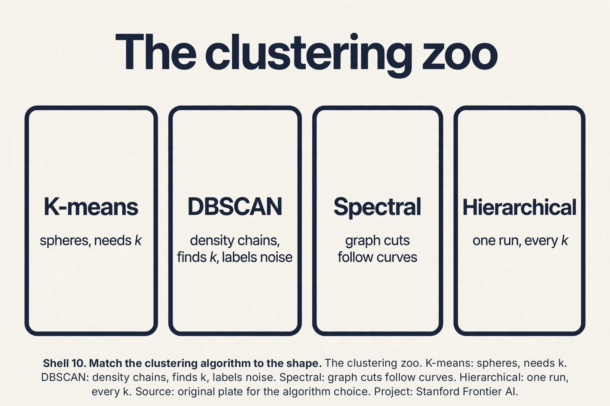

## GMM covariance types: the shape dial

A GMM's per-cluster covariance Sigma_j is a dial with four
settings. The choice controls the cluster shapes and the
parameter count.

### Subchapter: the four settings, priced

Dimension d, k clusters. **Full**: each cluster gets its own d x d
covariance: k*d(d+1)/2 parameters. Ellipses in any orientation.
**Diagonal**: each cluster gets d variances (axis-aligned
ellipses): k*d parameters. **Spherical**: each cluster gets one
variance (spheres): k parameters. **Tied**: one shared full
covariance for all clusters: d(d+1)/2 parameters. Price them at
d = 10, k = 5: full = 275, diagonal = 50, spherical = 5, tied =
55. Full overfits in high dimensions (275 numbers from maybe
hundreds of points). Spherical is k-means with soft assignments.
The interview line: start diagonal, go full only with abundant
data, tie when clusters share a shape. The covariance type is the
GMM's bias-variance dial (lecture 6 returns).

### Subchapter: the distortion-likelihood bridge

K-means minimizes distortion (sum of squared distances). GMM
maximizes likelihood. They are one family: a GMM with spherical
covariances, equal mixing weights, and shared variance sigma^2 has
log likelihood proportional to -(1/2sigma^2) * distortion plus
constants. Let sigma^2 shrink toward 0: the likelihood concentrates
on the nearest center, responsibilities harden to 0/1, and
maximizing likelihood becomes minimizing distortion. K-means is
not just similar to a GMM. It is the zero-variance limit, with the
math to prove it. Lecture 10's EM maximizes the general case. This
limit is why the lecture presents k-means first: the ad-hoc
algorithm was the probabilistic model all along, with the variance
turned to zero.

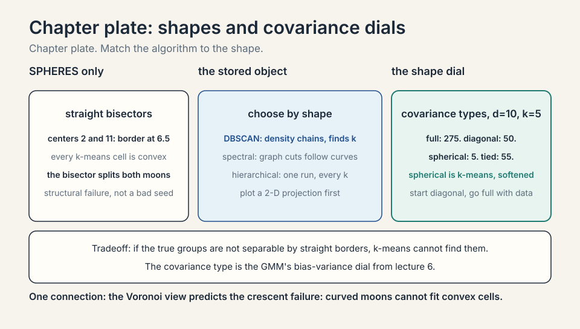

## The honest price

K-means buys simplicity and pays in guarantees: local minima, seed
dependence, and no notion of uncertainty. It assumes spherical
clusters of similar size: stretch one cluster into a long ellipse
and k-means splits it wrongly, because Euclidean distance is the
only geometry it knows. Choosing k is a heuristic. GMM buys soft
assignments and pays in fitting: the cluster labels are hidden, so
MLE has no closed form, and the next lecture's EM algorithm must
iterate. Both assume you know the right k and the right distance.
When clusters are non-convex (two interleaved crescents), both fail
and density methods take over.

## Mapping back

| Idea | Pain it answers | How |
|---|---|---|
| K-means | No labels, need groups | Alternate assignment and mean-update; distortion falls every round; toy converges in 1-2 rounds |
| Local-minima diagnosis | Same data, different answers per seed | Convergence is to a local minimum; NP-hard globally; seeds at 0 and 0.1 can strand a cluster |
| K-means++ | Bad seeds are the norm | Seed proportional to squared distance; O(log k) expected approximation ratio; sklearn default |
| Elbow method | k is unknown | Distortion 125.5, 4.0, 2.7, 1.5: the bend at k=2; heuristic, often ambiguous |
| GMM | Hard assignments lie about overlap | Responsibilities: 70/30 splits; k-means is the zero-variance limit |
| Voronoi view | Cluster borders looked arbitrary | Bisectors between centers; cells are convex; predicts the crescent failure |
| Silhouette and gap | The elbow is eyeball-only | Silhouette 0.85 on the toy; gap vs uniform null; maximize, do not eyeball |
| K-medoids | Outliers square their damage | Medoid 2, cost 100 vs 7205; absolute distance; O(k(n-k)^2) price |
| Clustering zoo | Non-convex shapes | DBSCAN chains density; spectral cuts graphs; hierarchical merges all k at once |
| Covariance types | One shape does not fit all | Full 275, diagonal 50, spherical 5, tied 55 at d=10,k=5; the bias-variance dial |
| Distortion-likelihood bridge | K-means looked ad hoc | Zero-variance limit of the GMM likelihood; the ad-hoc algorithm was probabilistic |

> [!QA]
> Q: Why does k-means converge, and to what?
> A: Each round has two steps and neither raises the distortion (sum of squared distances to centers). Assignment moves each point to its nearest center, lowering or holding its term. Update moves each center to its points' mean, which is the unique minimizer of its term. Distortion falls every round, is bounded below by 0, so it converges. It converges to a local minimum: no single reassignment or mean-move improves it, but a different seed could reach a better one. The seed-dependence is fundamental, not a bug.
> Follow-up: What do you do about empty clusters?
> A: Common fixes: reinitialize the empty center to a random data point (often the point farthest from its center), or drop it and continue with k-1. The lecture's implementation note: handle it explicitly, because bad seeds produce empty clusters routinely in high dimensions.

> [!QA]
> Q: How does k-means++ seeding work, and what does it guarantee?
> A: Seed centers one at a time. First center uniform at random. Each next center chosen with probability proportional to its squared distance from the nearest existing center: far-apart points are likely seeds. On {1,2,3,10,11,12} with first seed at 2, the squared distances (64, 81, 100 for the right clump vs 1, 1 for the left) make the second seed land in the right clump with high probability. Guarantee: expected distortion within O(log k) of optimal. It cannot promise optimal: the problem is NP-hard.
> Follow-up: Why squared distance and not distance?
> A: Because the objective is squared distance (distortion). Seeding proportional to squared distance samples proportionally to each point's current contribution to the objective, which is what the approximation proof needs. Linear distance would under-seed far outliers relative to their cost.

> [!QA]
> Q: What is a responsibility in a GMM?
> A: The posterior probability that a point came from each cluster: gamma_j(x) = phi_j * Gaussian(x. Mu_j, Sigma_j) / sum over clusters. It is how much cluster j claims the point. A point dead center in cluster 1 has responsibility near 1 for it. A point between clusters splits, e.g., 0.7 and 0.3. K-means' hard assignment is the limit as cluster variances go to zero: responsibilities collapse to 0 or 1.
> Follow-up: When does k-means fail where GMM succeeds?
> A: Overlapping clusters of different sizes or shapes. K-means draws a hard bisector and assumes spheres. A small dense clump next to a big diffuse one gets mis-split. GMM's responsibilities and per-cluster covariances model the overlap and the shapes. The price: fitting needs EM (lecture 10), and you still choose k.

## Recap: the whole lesson on one screen

1. **The job.** One million unlabeled customers. Find the natural
   groups. No y anywhere.
2. **K-means.** Assign to nearest center, move centers to means,
   repeat. Toy {1,2,3,10,11,12} converges in 1-2 rounds.
3. **Where it breaks.** Seeds decide: centers at 0 and 0.1 strand
   a cluster. Local minima, NP-hard globally.
4. **The key question.** Can seeding alone guarantee a good local
   minimum?
5. **K-means++.** Seed proportional to squared distance. O(log k)
   expected approximation ratio. Sklearn default.
> [!QA]
> Q: Walk me through the mechanism: prove the update step must be the mean.
> A: Fix the assignments. Cluster j's distortion term is sum over its points of (x - mu_j)^2. Differentiate with respect to mu_j: -2 * sum(x - mu_j) = 0. So sum(x) = n_j * mu_j, and mu_j = (1/n_j) * sum(x): the mean. One line. The median would minimize the sum of absolute deviations, a different algorithm (k-medians). K-means minimizes squares, so the update is forced to be the mean.
> Follow-up: Both steps are optimal for their subproblem. Why is the whole algorithm not optimal?
> A: Because the steps optimize different variables alternately: assignment fixes centers, update fixes assignments. Each step is the best move given the other half frozen. Alternating best-moves converges to a local minimum of the joint problem, like descending into the nearest valley while the deepest valley sits across a ridge. Coordinate descent shares this property.

> [!QA]
> Q: Applied design: one million customers, features are age, yearly spend, visit frequency. Marketing wants segments. Walk through your choices.
> A: First, standardize: spend is in dollars (thousands), visits in counts (tens). Without scaling, Euclidean distance is spend distance: a $100 spend gap dwarfs a 5-visit gap, and clusters become spend brackets. Standardize each feature to unit variance, or use domain weights. Second, k-means++ seeding with 10 restarts, keep the best distortion. Third, choose k by elbow plus silhouette score, and show marketing the cluster profiles (mean age, spend, visits per cluster) so the segments are actionable. Fourth, sanity check: tiny clusters (under 1% of customers) are usually outliers, not segments.
> Follow-up: Marketing asks for exactly 5 segments because the campaign has 5 creatives. Elbow says 3. What do you do?
> A: Run k=5 and k=3, profile both, and show the trade: k=5 splits a natural group to fill the quota. If the split is interpretable (e.g., high-spend splits into frequent and infrequent), take 5. If it is arbitrary, push back with the profiles: forcing k manufactures segments that do not exist, and the campaign personalizes on noise.

> [!QA]
> Q: When do you pay for EM and a GMM instead of k-means?
> A: When the answer needs uncertainty or shape. Overlapping customer tiers where a point is genuinely 60/40: k-means forces a hard label, GMM reports the split. Clusters with different covariances: a tight dense clump beside a broad diffuse one. K-means' spherical bias mis-splits them. GMM fits a covariance per cluster. Downstream weighting: if the next stage weights points by cluster confidence, you need responsibilities, not labels. The price: EM is slower, has worse local optima than k-means, and still needs k.
> Follow-up: Can GMM fail where k-means succeeds?
> A: Yes, on well-separated spherical clusters with little data: GMM fits full covariances (d^2 parameters per cluster) and overfits, while k-means' rigidity is a virtue. More parameters need more data. The bias-variance trade from lecture 6 applies to clustering too.

> [!QA]
> Q: K-means++ guarantees O(log k) expected approximation. What does that actually promise on the toy?
> A: k=2, so log 2 is a constant: the guarantee says the expected distortion is within a small constant factor of optimal. Optimal here is 4.0. The guarantee promises the seeding lands near 4.0 in expectation, not that any single run hits it. On the toy, first seed anywhere, second seed lands in the opposite clump with probability proportional to squared distances (64+81+100 vs 1+1): overwhelmingly. The guarantee is about the seeding distribution, and k-means' own local descent can only improve on the seeded start.
> Follow-up: Why can no algorithm promise optimal efficiently?
> A: The lecture cites NP-hardness: finding the global minimum distortion is NP-hard in general dimension. Any efficient algorithm must settle for approximation. K-means++ is the best cheap answer: provably close from seeding alone.

> [!QA]
> Q: Walk me through the mechanism: prove k-means is the zero-variance limit of a GMM.
> A: Take a GMM with spherical covariances (Sigma_j = sigma^2 I), equal mixing weights, shared sigma^2. The log likelihood of the data is sum_i log(sum_j exp(-||x_i - mu_j||^2 / 2sigma^2)) plus constants. As sigma^2 -> 0, the sum inside the log is dominated by the nearest center: log(sum_j exp(-d_j^2/2sigma^2)) -> -min_j d_j^2 / 2sigma^2. Maximizing the likelihood becomes minimizing sum_i min_j ||x_i - mu_j||^2: exactly the k-means distortion. The responsibilities gamma_j(x_i) harden: the nearest center's weight goes to 1, the rest to 0. Soft EM becomes hard k-means.
> Follow-up: What does this limit tell you about choosing between them?
> A: That the choice is about uncertainty, not philosophy. If sigma^2 is truly tiny (well-separated clusters), k-means is the GMM and the extra machinery buys nothing. If clusters overlap or have shape (sigma^2 sizable, covariances non-spherical), the limit is a bad approximation and the GMM earns its EM. Diagnose the overlap first, then choose.

6. **The elbow.** Distortions 125.5, 4.0, 2.7, 1.5: bend at k=2.
   Heuristic, often ambiguous.
7. **GMM.** Soft assignments via responsibilities: 70/30 splits.
   K-means is the hard limit.
8. **The honest price.** Local minima, spherical bias, heuristic k,
   EM needed for GMM, both die on crescents.
9. **The audit.** One round verified: means 2 and 11. k=1
   distortion is 125.5 (corrected from 121.5).
10. **The mean.** Derivative of the squared term forces the mean.
    Both steps optimal, the joint problem local.
11. **Responsibilities, worked.** Point 3: 1.0 vs 0.0. Midpoint
    6.5: 0.5/0.5. The slide is the softness.
12. **Crescents.** Non-convex shapes break k-means structurally.
    Plot first, then choose the algorithm.
13. **The lottery.** Seeds decide. K-means++ plus 10 restarts in
    production.
14. **Voronoi.** Borders are bisectors. Cells are convex. Straight
    borders cannot follow curved moons.
15. **Silhouette.** Point 1: a = 1.5, b = 10, score 0.85.
    Maximize the mean over k. Gap statistic vs the uniform null.
16. **K-medoids.** {1,2,3,100}: medoid 2, cost 100 vs 7205.
    Absolute distance, O(k(n-k)^2).
17. **The zoo.** DBSCAN chains density (epsilon, minPts).
    Spectral cuts graphs. Hierarchical merges all k at once.
18. **Covariances.** Full 275, diagonal 50, spherical 5, tied 55
    (d=10, k=5). The GMM's bias-variance dial.
19. **The bridge.** K-means is the GMM at sigma^2 -> 0. The
    ad-hoc algorithm was probabilistic all along.
20. **VQ.** 1M pixels, 16 colors, 4 bits each: 6x compression.
    Codebook plus codes.

## What is used where

**K-means runs everywhere labels are absent and shapes are
tame.** Customer segmentation is the canonical job. Image color
quantization: cluster pixels into k colors to compress. Embedding
pipelines: k-means over word or product vectors to build
candidate sets. Sklearn's KMeans defaults to k-means++ seeding
with 10 restarts: the production configuration is the lesson's
prescription. GMMs appear wherever soft assignment matters:
speaker diarization (who spoke when, with overlap) and
background/foreground separation.

### Subchapter: vector quantization, worked

An image has 1M pixels, each 24-bit color (16.7M possible). Run
k-means with k = 16 on the pixel colors. Each pixel is replaced by
its cluster index (4 bits). Storage: 1M * 4 bits = 0.5 MB plus the
16-color palette, vs 3 MB raw. Compression 6x, and the eye barely
notices: the 16 centroids are the image's dominant colors.
Distortion here is visible: banding in smooth gradients where 16
colors cannot span the blend. This is **vector quantization**, and
it is k-means' most literal job: the centers are a codebook, the
assignments are codes. Modern descendants (product quantization
for nearest-neighbor search, VQ-VAE codebooks in generative
models) scale the same idea: learn the codebook, assign the codes.

## Watch next

<div class="video-block"><div class="video-wrap"><iframe src="https://www.youtube-nocookie.com/embed/4b5d3muPQmA" title="StatQuest: K-means clustering" allow="accelerometer; autoplay; clipboard-write; encrypted-media; gyroscope; picture-in-picture" allowfullscreen loading="lazy" referrerpolicy="strict-origin-when-cross-origin"></iframe></div><p class="video-cap">Explainer: StatQuest, K-means clustering. Josh Starmer works the algorithm step by step with his usual diagrams. Watch after the toy rounds.</p></div>

## Go deeper

- [k-means++: The Advantages of Careful Seeding (Arthur and Vassilvitskii, 2007)](https://theory.stanford.edu/~sergei/papers/kMeansPP-soda.pdf)
- The paper behind the lecture's seeding: the O(log k) approximation guarantee, proved. Read sections 1-3 for the seeding rule and the guarantee.
- [Scikit-learn clustering user guide](https://scikit-learn.org/stable/modules/clustering.html)
- Every algorithm in the zoo (k-means, DBSCAN, spectral, hierarchical, GMM) with the same API, plus the silhouette and gap diagnostics. Matches the choosing-k and zoo sections.

## Official sources and further reading

**Official:**
- Lecture 9 video, Stanford Online YouTube:
  - [Chris Ré runs](https://www.youtube.com/watch?v=bSmIGBCoffA)
  k-means live, proves convergence to local minima, presents
  k-means++ with its approximation guarantee, and sets up GMMs.
- Official subtitle transcript (en-US): the lecture's spoken text.
- CS229 Spring 2026 official course notes (local PDF): the full
  k-means and GMM treatment.

**Caveats from these sources.** The lecture calls k-means "ad hoc"
deliberately: it is the intuitive algorithm, not a derived one.
The k-means++ attribution (Stanford graduate students Arthur and
Vassilvitskii) and the sklearn-default status are the lecture's.
The toy runs in this lesson are original miniatures of the
lecture's live demos. GMM fitting (EM) is deferred to lecture 10
by the lecture's own ordering.

## Connections to the other courses

- **CS229 L05:** GDA's Gaussians with known labels. GMM is GDA
  with the labels hidden.
- **CS229 L10:** EM: the algorithm that fits GMMs, and PCA for
  visualizing clusters.
- **CS229 L06:** the elbow as model selection. Distortion vs k as
  a bias-variance curve.
- **CS224N:** clustering word vectors: k-means on embeddings.

## Coverage map: every lecture claim and where it lives

| Lecture claim | Covered in | File line |
|---|---|---|
| Clustering: one million unlabeled customer records, no y | The job | L44 |
| K-means: assign to nearest center, move to mean, repeat | First attempt: k-means | L53 |
| Toy {1,2,3,10,11,12}: converges in 1-2 rounds | First attempt: k-means | L53 |
| One round audited: means 2 and 11; k=1 distortion 125.5 | one round, audited | L96 |
| Mean minimizes the squared distortion (derivative) | the mean is the minimizer | L110 |
| Distortion falls every round; converges to local minimum | Where it breaks: the seed decides | L123 |
| Seeds at 0 and 0.1 strand a cluster; distortion near 200 | the seed lottery | L136 |
| NP-hard globally; no efficient algorithm guarantees optimum | Where it breaks: the seed decides | L123 |
| K-means++: seed proportional to squared distance | k-means++: seed far apart | L182 |
| O(log k) expected approximation ratio | k-means++: seed far apart | L182 |
| Elbow method: distortions 125.5, 4.0, 2.7, 1.5; bend at k=2 | How many clusters? The elbow | L200 |
| Voronoi cells: bisectors; convex cells | The Voronoi view | L213 |
| Silhouette 0.85 on the toy; gap statistic vs null | Choosing k: beyond the elbow | L235 |
| K-medoids: medoid 2, cost 100 vs 7205 | K-medoids: the outlier problem | L153 |
| GMM: responsibilities soften hard assignments | Softening: Gaussian mixture models | L267 |
| Responsibilities worked: 1.0 vs 0.0; 0.5/0.5 at midpoint | responsibilities, worked | L287 |
| Crescents: k-means splits both moons; structural failure | the interview trap, crescents | L302 |
| DBSCAN: epsilon/minPts chains; spectral: graph cuts; hierarchical: dendrogram | The clustering zoo | L318 |
| Covariance types priced: full 275, diagonal 50, spherical 5, tied 55 | GMM covariance types | L382 |
| K-means as zero-variance limit of GMM likelihood | the distortion-likelihood bridge | L403 |
| Vector quantization: 16 colors, 6x compression | vector quantization, worked | L550 |
