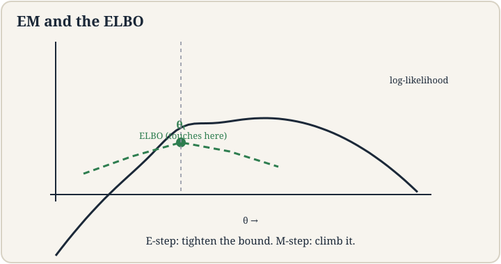
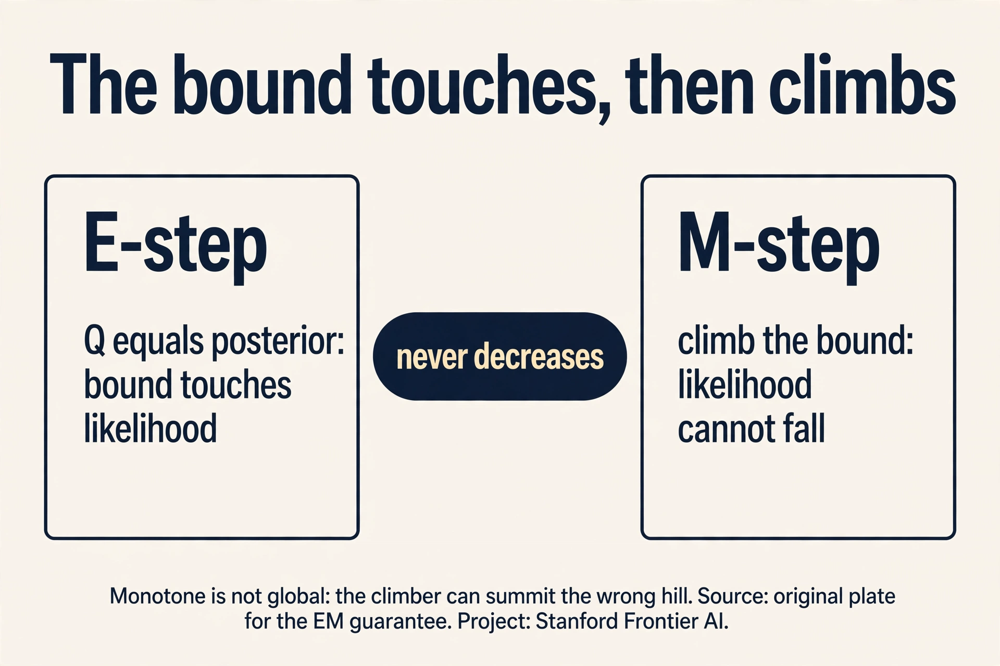
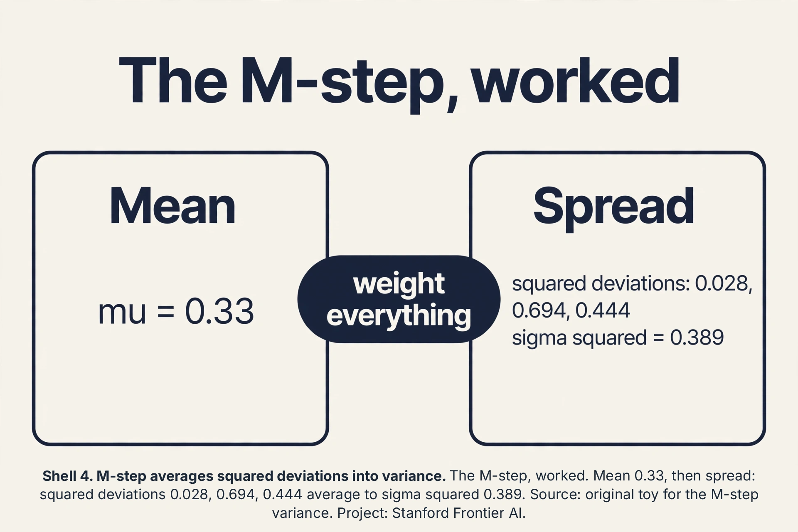
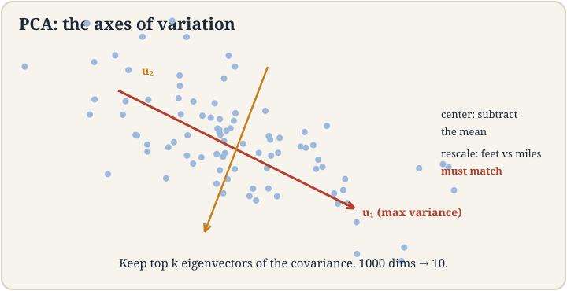
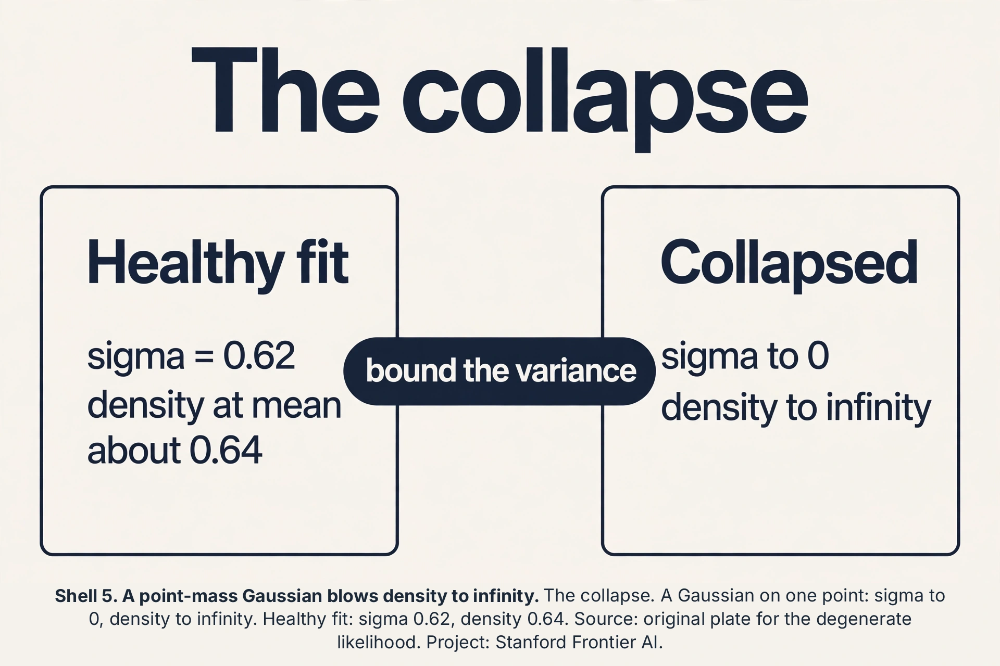

## The job: fit the mixture when the labels are hidden

Lecture 9 set up the Gaussian mixture: the data is k Gaussians
mixed together, each point secretly from one of them. The
**latent variable** z^(i) is that secret: which cluster point i
came from. If we knew the z's, fitting would be trivial: group the
points by label and average (lecture 5's GDA). We do not know them.
That is the whole difficulty.

## First attempt: guess the labels, fit, repeat

The naive idea is hard EM by hand: guess the labels (k-means),
fit Gaussians to each guessed group, reassign each point to its
most likely Gaussian, repeat. Watch it on a toy. Two 1-D Gaussians,
true means 0 and 10, 6 points: {0.5, -0.5, 1.0} from cluster 1,
{9.5, 10.5, 10.0} from cluster 2. Guess labels by k-means: correct
here. Fit: mu_1 = 0.33, mu_2 = 10.0. Reassign: unchanged. Done.

Now corrupt the start: guess that {0.5, -0.5} are cluster 1 and
{1.0, 9.5, 10.5, 10.0} are cluster 2. Fit: mu_1 = 0, mu_2 = 7.75.
Reassign 1.0: distance to 0 is 1.0, to 7.75 is 6.75, so cluster 1.
Reassign 9.5: cluster 2. Converges to mu_1 = 0.17, mu_2 = 10.0:
recovered anyway. But hard assignment throws away doubt: the point
at 5.0, exactly between, gets forced into one cluster at full
weight and drags its mean. The soft version, which weighs points by
their responsibilities, is what we want. The question is how to
derive it instead of inventing it.

## The key question

MLE says: maximize the probability of the observed data. The
observed data is x. The labels z are hidden. The likelihood sums
over all possible labelings:

```ascii
L(theta) = product over i of sum over z of p(x^(i), z; theta)
```

The log of a sum. The log cannot reach inside the sum, so no closed
form, no clean gradient. The key question: can we maximize this
without ever differentiating through the sum?

## Jensen builds a lower bound

**Jensen's inequality**: for a concave function like log, the
function of an average is at least the average of the function.
Picture log(x): the curve sags below every chord between two of its
points. So log(E[X]) >= E[log(X)]. The log of the average beats the
average of the logs.

Apply it to the log likelihood. Introduce any distribution Q_i over
the hidden labels of example i. Then:

```ascii
log sum_z p(x, z) = log sum_z Q(z) * p(x, z)/Q(z) >= sum_z Q(z) * log(p(x, z)/Q(z))
```

The right side is the **ELBO**, the evidence lower bound. It is a
lower bound on the log likelihood, and it is a sum, not a log of a
sum: tractable. The bound is tight (equality) when Q(z) equals the
posterior p(z|x. Theta): Jensen is an equality when the chord
collapses, i.e., when Q puts all its structure where the posterior
is. So: set Q to the posterior, and maximizing the ELBO pushes the
true likelihood up.



### Subchapter: why the likelihood cannot fall

The guarantee is two lines. Write L(theta) for the log likelihood
and B(theta, Q) for the ELBO. The E-step sets Q_new to the
posterior at theta_old, which makes the bound tight: B(theta_old,
Q_new) = L(theta_old). The M-step picks theta_new to maximize the
bound: B(theta_new, Q_new) >= B(theta_old, Q_new). Chain them:
L(theta_new) >= B(theta_new, Q_new) >= B(theta_old, Q_new) =
L(theta_old). The first inequality is Jensen (the bound is below
the truth). The likelihood never falls. Note what is missing: no
claim about where it lands. A climber that never descends still
summits the wrong hill.



## EM: alternate two easy steps

**Expectation-Maximization** alternates. The **E-step**: fix the
parameters, set Q_i(z) = p(z | x^(i). Theta), the responsibilities.
This makes the ELBO touch the likelihood at the current parameters.
The **M-step**: fix Q, maximize the ELBO over theta. With Q fixed,
the ELBO is a weighted log likelihood: each example counted with
fractional weights, and weighted MLE for Gaussians is closed form.

For GMMs the steps are concrete. E-step: compute each point's
responsibilities under the current Gaussians. M-step: update each
Gaussian's mean to the responsibility-weighted average of points,
its covariance to the weighted spread, its mixing weight to the
average responsibility. Then repeat. The likelihood rises every
round: the E-step tightens the bound to touch the current value,
the M-step climbs the bound, so the true likelihood cannot fall.

Run the toy. Start mu_1 = 0, mu_2 = 7.75, equal weights, variance
1. E-step for x = 1.0: responsibility for cluster 1 proportional to
exp(-(1-0)^2/2) = 0.61, for cluster 2 exp(-(1-7.75)^2/2) ~ 0.
Nearly hard. For a point at 5.0 (add one): cluster 1 gives
exp(-12.5) ~ 0, cluster 2 gives exp(-3.8) = 0.022: soft, mostly
cluster 2 but not entirely. M-step: mu_1 becomes the weighted
average, pulled slightly by the 5.0 point's small responsibility.
Converge: mu_1 = 0.33, mu_2 = 10.0. The soft weights handled the
boundary point honestly instead of forcing it.

EM is k-means grown up: E-step softens the assignment into
responsibilities, M-step softens the mean update into weighted
averages. Same alternating skeleton, uncertainty preserved.

### Subchapter: the M-step, worked

The lesson fits the means. Fit the spread too. The M-step updates
each Gaussian's variance to the responsibility-weighted spread:
sigma_j^2 = sum_i gamma_ij (x_i - mu_j)^2 / sum_i gamma_ij. On the
toy, cluster 1 owns {0.5, -0.5, 1.0} with mu_1 = 0.33 (hard
weights for the audit). Deviations: 0.17, -0.83, 0.67. Squares:
0.028, 0.694, 0.444. Sum: 1.167. Divide by 3: sigma_1^2 = 0.389,
sigma_1 = 0.62. The cluster's points spread about 0.62 around
0.33. With soft weights the same formula applies, and a boundary
point like 5.0 contributes a little to both clusters' spreads.
Every M-step quantity is a weighted average: means, spreads,
mixing weights. Weight everything, by the doubt.



## The honest price of EM

EM climbs to a local maximum of the likelihood, not the global one.
Initialization matters: start the Gaussians badly and EM polishes
the wrong answer confidently. It can also crawl: near the top, the
steps shrink and convergence slows to a walk. And the likelihood it
maximizes can be degenerate: one Gaussian collapsing onto a single
point sends the likelihood to infinity (variance -> 0, density ->
infinite). Practitioners bound the variances away from zero or use
priors. EM is a hill-climber with no view of the landscape.

## PCA: the axes of variation

New job, same lecture. The customer records have 200 features.
Plotting is impossible, distance computations are expensive, and
most features are redundant (yearly spend and visit frequency move
together). **PCA** (principal component analysis) finds the few
directions that carry the most variation and projects the data onto
them.

The lecture's toy: SUVs plotted by two features, say length and
weight. The cloud is a diagonal cigar: long SUVs are heavy. The
**first principal component** is the direction of the cigar's long
axis: the single direction along which the data varies most.
Project every SUV onto that line and you keep most of the spread
with one number instead of two.

Formally: center the data (subtract the mean), form the covariance
matrix Sigma, take its **eigenvectors**. The eigenvector with the
largest **eigenvalue** is the first principal component. The
eigenvalue is the variance along it. The second component is the
next eigenvector, perpendicular to the first, and so on. Keep the
top k, drop the rest.

Work a toy. Four points: (1,1), (2,2), (3,3), (4,4), already
centered at (2.5, 2.5) -> (-1.5,-1.5), (-0.5,-0.5), (0.5,0.5),
(1.5,1.5). Covariance: each point contributes [a^2, a^2. A^2, a^2]
with a in {1.5, 0.5}: Sigma = [[2.5, 2.5],[2.5, 2.5]] (dividing by
4). Eigenvalues: 5 and 0. Eigenvectors: (1,1)/sqrt(2) and
(1,-1)/sqrt(2). The first component explains 5/5 = 100 percent of
the variance: the data lives on the diagonal, and one number (the
position along it) captures everything. The second eigenvalue is 0:
no variation perpendicular to the diagonal, so dropping it loses
nothing.

In practice: eigenvalues (5.0, 3.0, 0.4, 0.05, ...). Keep components
until the kept eigenvalues sum to, say, 95 percent of the total.
That is the dimensionality reduction: 200 features down to 12, with
95 percent of the variation intact.



### Subchapter: PCA on SUV numbers

Make the SUV toy concrete. Four SUVs, (length in meters, weight in
tons): (4,2), (5,3), (6,3), (7,4). Mean: (5.5, 3). Centered:
(-1.5,-1), (-0.5,0), (0.5,0), (1.5,1). Covariance (divide by 4):
var(length) = 1.25, var(weight) = 0.5, cov = 0.75. Sigma =
[[1.25, 0.75],[0.75, 0.5]]. Eigenvalues: (1.75 +/- sqrt(1.75^2 -
4*0.0625))/2 = 1.7135 and 0.0365. The first component keeps
1.7135/1.75 = 97.9 percent of the variance. Its eigenvector
satisfies -0.4635*x + 0.75*y = 0, so y = 0.618*x: the direction
(1, 0.618), mostly length with some weight. That is the cigar's
long axis, in numbers: long SUVs are heavy, and one number along
(1, 0.618) captures 97.9 percent of the two-feature spread.

 keeps 97.9 percent of the variance. Source: original toy for the PCA arithmetic. Project: Stanford Frontier AI.")

### Subchapter: the collapse, priced

The degenerate warning deserves a number. A Gaussian sitting on a
single point x_0 with variance sigma^2 has density
1/(sqrt(2*pi)*sigma) at x_0. Let sigma go to 0.01: density ~ 40.
Sigma 0.001: density ~ 400. The likelihood contribution explodes as
1/sigma while the point's responsibility for that component goes to
1. EM happily climbs this: infinite likelihood, useless model.
Contrast the healthy toy fit: sigma_1 = 0.62, density at the mean
~ 0.64. The fix is a variance floor (never let sigma below, say,
0.1) or a prior pulling variances up. K-means never collapses this
way: distortion has no singularity. The singularity is the price of
a probabilistic model with unbounded densities.



## The honest price of PCA

PCA is linear: it finds straight axes. Data curved like a Swiss
roll has no good straight summary. The roll's two intrinsic
dimensions need nonlinear methods. PCA also chases variance, not
meaning: the highest-variance direction might be sensor noise while
the signal hides in a small one. It is sensitive to scaling: measure
one feature in millimeters instead of meters and it dominates the
covariance, so standardize features first. And the eigendecomposition
costs O(d^3): at d = 100,000 (raw pixels), exact PCA is dead and
randomized approximations take over.

## Mapping back

| Idea | Pain it answers | How |
|---|---|---|
| ELBO via Jensen | Log of a sum has no closed form | log(E) >= E[log]: lower bound that is a sum; tight at Q = posterior |
| E-step | Labels hidden | Set Q to responsibilities under current params; bound touches likelihood |
| M-step | Bound still needs maximizing | Weighted MLE: closed-form weighted averages; likelihood rises every round |
| Soft vs hard | Hard assignment forces boundary points | 5.0 point gets soft weight, not forced; k-means is the hard limit |
| PCA | 200 features, mostly redundant | Top eigenvectors of covariance; toy: eigenvalue 5 of 5 = 100 percent on the diagonal |

> [!QA]
> Q: What is the ELBO and why does EM maximize it instead of the likelihood?
> A: The evidence lower bound: sum_z Q(z) log(p(x,z)/Q(z)), a lower bound on the log likelihood built by Jensen's inequality. The true log likelihood is a log of a sum over hidden labelings: intractable to differentiate. The ELBO is a sum: tractable. EM alternates: the E-step sets Q to the posterior, making the bound tight at the current parameters. The M-step maximizes the bound, which is weighted MLE with closed forms. Since the bound touches the likelihood before each M-step, climbing the bound climbs the likelihood. It never decreases.
> Follow-up: When is the bound tight?
> A: When Q(z) = p(z|x. Theta), the posterior under the current parameters. Jensen's inequality is an equality when the distribution inside is degenerate relative to the function: here, when Q matches the posterior, the "average" the log wraps is exact. That is precisely the E-step's choice.

> [!QA]
> Q: How is EM different from k-means?
> A: Same alternating skeleton, soft instead of hard. K-means E-step: assign each point to one cluster. EM E-step: compute responsibilities, the posterior probability per cluster. K-means M-step: plain means. EM M-step: responsibility-weighted means, covariances, and mixing weights. K-means minimizes distortion. EM maximizes likelihood. Let the Gaussians' variances go to zero and EM's soft steps harden into k-means.
> Follow-up: What can go wrong with EM?
> A: Three things. Local maxima: bad initialization gets polished, not fixed. Slow crawl near convergence. Degenerate likelihood: a Gaussian collapsing onto one point drives variance to zero and likelihood to infinity, so bound variances or use priors. None of these affect the guarantee that likelihood never decreases. They affect which maximum you reach and how fast.

> [!QA]
> Q: What does PCA actually compute, and how do you choose k?
> A: Center the data, form the covariance matrix, take its eigendecomposition. The eigenvectors are the principal components, ordered by eigenvalue: variance along that axis. Project onto the top k. Choose k by explained variance: keep components until their eigenvalues sum to a target like 95 percent of the total. In the toy, eigenvalues (5, 0) meant k=1 keeps 100 percent.
> Follow-up: When does PCA fail?
> A: When the structure is nonlinear (Swiss roll), when variance is not meaning (the top component is noise), or when features are unscaled (millimeters dominate meters: standardize first). It also costs O(d^3), so exact PCA dies around d = 100,000 and randomized methods take over.

## Recap: the whole lesson on one screen

1. **The job.** Fit k Gaussians when each point's label is a
   hidden secret.
2. **First attempt.** Guess labels, fit, reassign, repeat. Hard
   forcing of boundary points. No uncertainty.
3. **The key question.** Maximize the likelihood without
   differentiating through a log of a sum.
4. **Jensen.** log(E) >= E[log]. The ELBO: a tractable lower
   bound, tight at Q = posterior.
5. **EM.** E-step: responsibilities. M-step: weighted MLE.
   Likelihood rises every round. Toy converges to mu = 0.33, 10.0.
6. **EM's price.** Local maxima, slow crawl, degenerate collapse.
   Initialization matters.
7. **PCA.** Top eigenvectors of the covariance: the axes of
   variation. Toy: (5, 0), one axis keeps 100 percent.
> [!QA]
> Q: Walk me through the mechanism: prove the likelihood cannot fall in one EM round.
> A: Write L for log likelihood, B for the ELBO. E-step: Q_new is the posterior at theta_old, so the bound is tight: B(theta_old, Q_new) = L(theta_old). M-step: theta_new maximizes the bound, so B(theta_new, Q_new) >= B(theta_old, Q_new). Jensen says the bound sits below the truth: L(theta_new) >= B(theta_new, Q_new). Chain: L(theta_new) >= B(theta_new, Q_new) >= B(theta_old, Q_new) = L(theta_old). Done. Every round climbs or holds.
> Follow-up: Then why not run EM once from a great initialization and stop?
> A: One round climbs once, not to the top. The guarantee is per-round monotonicity, not one-round convergence. Near the top the steps shrink and EM crawls: the bound gets flatter as Q approaches the true posterior shape. Monotone is not fast.

> [!QA]
> Q: Applied design: your 5-component GMM on customer spend collapses one component onto a single whale customer. Diagnose and fix.
> A: The degenerate likelihood: that Gaussian's variance went to zero and its density at the whale went to infinity, so the likelihood "improved" into meaninglessness. Confirm: check component variances. One near zero confirms it. Fix in order: set a variance floor (e.g., sigma >= 0.1 in standardized units), or fit MAP with a prior on variances instead of MLE, or drop to fewer components, or remove the outlier and fit separately. Decision rule: a component owning fewer than ~d+1 points (d = dimension) is a collapse suspect.
> Follow-up: Why did k-means never do this to you?
> A: Distortion is a sum of squared distances: no division by variance, no singularity. A cluster with one point contributes zero distortion, which is fine, not infinite. The collapse is specific to probabilistic models with unbounded densities. K-means' rigidity is protective here.

> [!QA]
> Q: Compute the M-step variance for cluster 1 of the toy, and say what it means.
> A: Points {0.5, -0.5, 1.0}, mu_1 = 0.33. Squared deviations: 0.028, 0.694, 0.444. Average: 0.389. Sigma_1 = 0.62. It means cluster 1's points spread about 0.62 around 0.33: the cluster is a bump of width ~0.6, not a spike. With soft responsibilities the same formula weighs each point's squared deviation by its gamma: a boundary point at 5.0 adds a little spread to both clusters instead of a lot to one.
> Follow-up: How does this connect to the E-step's softness?
> A: The E-step's doubt flows into the M-step's parameters: uncertain points spread their influence across clusters in both the mean and the variance. Hard assignment concentrates all influence in one cluster. EM's honesty about doubt is what the weighted formulas implement.

> [!QA]
> Q: PCA says PC1 = (1, 0.618) keeps 97.9%. Your colleague drops the weight feature and keeps length only. Who is right?
> A: The projection is right and the colleague is approximating. PC1 uses both features: the 0.618 weight component captures the length-weight correlation, and length alone recovers only part of the 97.9%. But quantify the loss: projecting onto length alone keeps var(length)/total = 1.25/1.75 = 71.4% of variance, vs 97.9% for PC1. That is a real gap. The colleague is right only if interpretability beats 26 points of variance: e.g., a dashboard where "length" is explainable and the extra precision changes no decision.
> Follow-up: Give the never-confuse pair for PCA vs feature selection.
> A: PCA builds new features (linear combos). Feature selection keeps originals. PC1 = 1.0*length + 0.618*weight is not "the length feature". If the downstream model needs raw-feature meaning (regulation, debugging), select features. If it needs compact variance, use PCA. Never say "PCA selected length": it built a direction.

9. **The guarantee.** B touches at E-step, climbs at M-step.
   Likelihood never falls. Local summit, not global.
10. **The M-step, worked.** Sigma_1^2 = 0.389. Every parameter
    is a responsibility-weighted average.
11. **SUV numbers.** PC1 = (1, 0.618), keeps 97.9 percent. The
    cigar axis, in numbers.
12. **The collapse.** Sigma to 0, density to infinity. Variance
    floor or prior. K-means cannot do this.

## What is used where

**EM fits mixtures wherever labels are hidden.** Speaker
diarization (who spoke when, with overlapping speech), background
subtraction in video, and missing-data imputation all run EM or its
cousins. **PCA is the default first step on wide data:**
visualization (plot the first two components), denoising (drop
small components), and compression before expensive models.
Eigenfaces (faces as PCA components) was the classic demo. At
d = 100,000, exact O(d^3) PCA dies and randomized SVD takes over:
the production version of this lesson's eigendecomposition.

## Watch next

<div class="video-block"><div class="video-wrap"><iframe src="https://www.youtube-nocookie.com/embed/FgakZw6K1QQ" title="StatQuest: Expectation Maximization" allow="accelerometer; autoplay; clipboard-write; encrypted-media; gyroscope; picture-in-picture" allowfullscreen loading="lazy" referrerpolicy="strict-origin-when-cross-origin"></iframe></div><p class="video-cap">Explainer: StatQuest, Expectation Maximization. Josh Starmer derives the E and M steps with his usual worked numbers. Watch after the Jensen section.</p></div>

## Official sources and further reading

**Official:**
- Lecture 10 video, Stanford Online YouTube:
  - [Chris Ré derives](https://www.youtube.com/watch?v=sUS-eTa0l6s)
  the ELBO from Jensen's inequality, runs EM on GMMs, and presents
  PCA on the SUV toy.
- Official subtitle transcript (en-US): the lecture's spoken text.
- CS229 Spring 2026 official course notes (local PDF): the full
  EM derivation and PCA eigendecomposition.

**Caveats from these sources.** The lecture states Jensen only for
concave functions (the log case) and draws the chord picture live.
The general statement is in the notes. The SUV toy is the lecture's
own illustration. The diagonal 4-point miniature in this lesson is
an original with the lecture's eigenstructure. The degenerate
likelihood warning is standard practice around EM, presented here
as the practitioner's caveat.

## Connections to the other courses

- **CS229 L05:** GDA: the same Gaussians with labels known. EM
  handles them hidden.
- **CS229 L09:** k-means: the hard limit of EM as variances go to
  zero.
- **CS229 L11:** diffusion models: latent-variable generative
  modeling with the ELBO grown to neural scale.
- **CS229 L13:** embeddings: PCA's linear ancestor of learned
  representations.
- **CS336:** randomized PCA and scale: dimensionality reduction at
  training scale.
