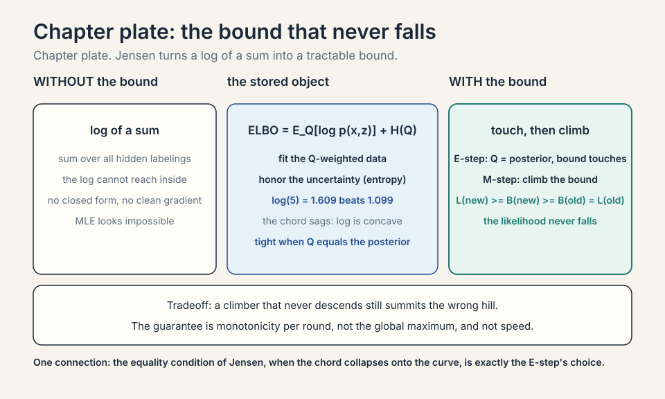
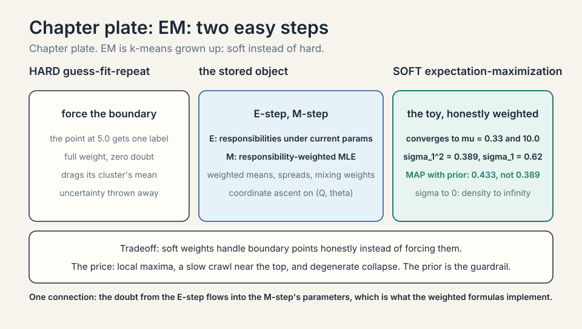
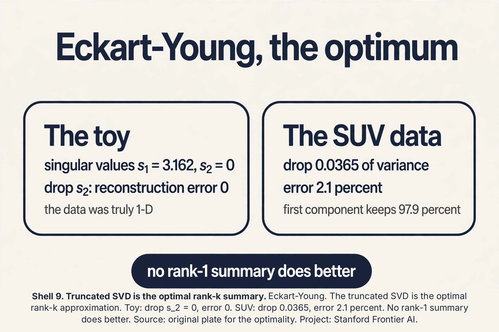

### Coverage and sourcing

This lesson follows Lecture 10 of Stanford CS229 (Machine Learning,
Spring 2026, instructor Chris Ré): "GMM (EM), PCA". The lecture
derives the EM algorithm via Jensen's inequality and the ELBO,
runs EM on Gaussian mixtures, and presents PCA as the workhorse of
dimensionality reduction. It draws on the official subtitle
transcript and the course notes. The coverage map at the end of
the chapter maps every major lecture claim to the section that
covers it. Figures and claims marked "October 2026" are updates
added after the lecture, each with its source.

## The job: fit the mixture when the labels are hidden

Lecture 9 set up the Gaussian mixture: the data is k Gaussians
mixed together, each point secretly from one of them. The
**latent variable** z^(i) is that secret: which cluster point i
came from. If we knew the z's, fitting would be trivial: group the
points by label and average (lecture 5's GDA). We do not know them.
That is the whole difficulty.

## First attempt: guess the labels, fit, repeat

The naive idea is hard EM by hand: guess the labels (k-means),
fit Gaussians to each guessed group, reassign each point to its
most likely Gaussian, repeat. Watch it on a toy. Two 1-D Gaussians,
true means 0 and 10, 6 points: {0.5, -0.5, 1.0} from cluster 1,
{9.5, 10.5, 10.0} from cluster 2. Guess labels by k-means: correct
here. Fit: mu_1 = 0.33, mu_2 = 10.0. Reassign: unchanged. Done.

Now corrupt the start: guess that {0.5, -0.5} are cluster 1 and
{1.0, 9.5, 10.5, 10.0} are cluster 2. Fit: mu_1 = 0, mu_2 = 7.75.
Reassign 1.0: distance to 0 is 1.0, to 7.75 is 6.75, so cluster 1.
Reassign 9.5: cluster 2. Converges to mu_1 = 0.33, mu_2 = 10.0:
recovered anyway. But hard assignment throws away doubt: the point
at 5.0, exactly between, gets forced into one cluster at full
weight and drags its mean. The soft version, which weighs points by
their responsibilities, is what we want. The question is how to
derive it instead of inventing it.

## The key question

MLE says: maximize the probability of the observed data. The
observed data is x. The labels z are hidden. The likelihood sums
over all possible labelings:

```ascii
L(theta) = product over i of sum over z of p(x^(i), z; theta)
```

The log of a sum. The log cannot reach inside the sum, so no closed
form, no clean gradient. The key question: can we maximize this
without ever differentiating through the sum?

## Jensen builds a lower bound

**Jensen's inequality**: for a concave function like log, the
function of an average is at least the average of the function.
Picture log(x): the curve sags below every chord between two of its
points. So log(E[X]) >= E[log(X)]. The log of the average beats the
average of the logs.

Apply it to the log likelihood. Introduce any distribution Q_i over
the hidden labels of example i. Then:

```ascii
log sum_z p(x, z) = log sum_z Q(z) * p(x, z)/Q(z) >= sum_z Q(z) * log(p(x, z)/Q(z))
```

The right side is the **ELBO**, the evidence lower bound. It is a
lower bound on the log likelihood, and it is a sum, not a log of a
sum: tractable. The bound is tight (equality) when Q(z) equals the
posterior p(z|x. Theta): Jensen is an equality when the chord
collapses, i.e., when Q puts all its structure where the posterior
is. So: set Q to the posterior, and maximizing the ELBO pushes the
true likelihood up.


### Subchapter: why the likelihood cannot fall

Name the two moves first. The **E-step** (expectation): freeze the
parameters, set Q to the posterior. The **M-step** (maximization):
freeze Q, pick the parameters that maximize the bound. The
guarantee is two lines. Write L(theta) for the log likelihood
and B(theta, Q) for the ELBO. The E-step sets Q_new to the
posterior at theta_old, which makes the bound tight: B(theta_old,
Q_new) = L(theta_old). The M-step picks theta_new to maximize the
bound: B(theta_new, Q_new) >= B(theta_old, Q_new). Chain them:
L(theta_new) >= B(theta_new, Q_new) >= B(theta_old, Q_new) =
L(theta_old). The first inequality is Jensen (the bound is below
the truth). The likelihood never falls. Note what is missing: no
claim about where it lands. A climber that never descends still
summits the wrong hill.


## Jensen, slowly

Jensen's inequality deserves its own slow pass, because the ELBO
is just Jensen applied with intent. A function f is **concave**
if the chord between any two of its points lies below the curve.
Log is concave: log(1) = 0, log(9) = 2.197. The chord midpoint at
x = 5 has height (0 + 2.197)/2 = 1.099. The curve at x = 5:
log(5) = 1.609. Curve above chord: 1.609 > 1.099. Concave.

### Subchapter: the inequality, worked

Jensen: for concave f, f(E[X]) >= E[f(X)]. The function of the
average beats the average of the function. Work it: X takes 1 and
9 with equal probability. E[X] = 5. f(E[X]) = log(5) = 1.609.
E[f(X)] = (log(1) + log(9))/2 = 1.099. Indeed 1.609 >= 1.099. The
gap (0.51) is the price of averaging inside vs outside. For convex
f (like x^2) the inequality flips: f(E[X]) <= E[f(X)]. The lecture
needs only the concave case (log). Equality holds when X is
constant (no averaging happens) or f is linear on X's range: the
chord collapses onto the curve. That equality condition is the
E-step: choose Q so the bound touches.

 = 1.609 beats (log(1)+log(9))/2 = 1.099. Equality when the chord collapses: the E-step's choice. Source: original plate for the Jensen arithmetic. Project: Stanford Frontier AI.")

## The ELBO, term by term

The ELBO has two faces. Face one (the bound): sum_z Q(z)
log(p(x,z)/Q(z)). Face two (the decomposition): expected
complete-data log likelihood plus the entropy of Q.

### Subchapter: the decomposition, worked

Split the log: sum_z Q(z) log p(x,z) - sum_z Q(z) log Q(z). The
first term is E_Q[log p(x,z)]: the average log likelihood if the
hidden labels were drawn from Q. The second is H(Q), the
**entropy** of Q: how uncertain Q is. So ELBO = E_Q[log p(x,z)] +
H(Q). Read it: fit the parameters to the Q-weighted data (first
term), but keep Q honest about its uncertainty (second term
rewards spread). When Q is the posterior (E-step), the entropy
term is exactly the posterior's uncertainty, and the bound is
tight. When Q is overconfident (all mass on one label), entropy is
0 and the bound sags. The M-step maximizes the first term over
theta (weighted MLE). The E-step maximizes the whole bound over Q
(by setting Q to the posterior). EM is coordinate ascent on the
ELBO: alternate maximizing over Q and over theta. The lecture's
two steps are the two coordinates.



## EM: alternate two easy steps

**Expectation-Maximization** alternates. The **E-step**: fix the
parameters, set Q_i(z) = p(z | x^(i). Theta), the responsibilities.
This makes the ELBO touch the likelihood at the current parameters.
The **M-step**: fix Q, maximize the ELBO over theta. With Q fixed,
the ELBO is a weighted log likelihood: each example counted with
fractional weights, and weighted MLE for Gaussians is closed form.

For GMMs the steps are concrete. E-step: compute each point's
responsibilities under the current Gaussians. M-step: update each
Gaussian's mean to the responsibility-weighted average of points,
its covariance to the weighted spread, its mixing weight to the
average responsibility. Then repeat. The likelihood rises every
round: the E-step tightens the bound to touch the current value,
the M-step climbs the bound, so the true likelihood cannot fall.

Run the toy. Start mu_1 = 0, mu_2 = 7.75, equal weights, variance
1. E-step for x = 1.0: responsibility for cluster 1 proportional to
exp(-(1-0)^2/2) = 0.61, for cluster 2 exp(-(1-7.75)^2/2) ~ 0.
Nearly hard. For a point at 5.0 (add one): cluster 1 gives
exp(-12.5) ~ 0, cluster 2 gives exp(-3.8) = 0.022: soft, mostly
cluster 2 but not entirely. M-step: mu_1 becomes the weighted
average, pulled slightly by the 5.0 point's small responsibility.
Converge: mu_1 = 0.33, mu_2 = 10.0. The soft weights handled the
boundary point honestly instead of forcing it.

EM is k-means grown up: E-step softens the assignment into
responsibilities, M-step softens the mean update into weighted
averages. Same alternating skeleton, uncertainty preserved.

### Subchapter: the M-step, worked

The lesson fits the means. Fit the spread too. The M-step updates
each Gaussian's variance to the responsibility-weighted spread:
sigma_j^2 = sum_i gamma_ij (x_i - mu_j)^2 / sum_i gamma_ij. On the
toy, cluster 1 owns {0.5, -0.5, 1.0} with mu_1 = 0.33 (hard
weights for the audit). Deviations: 0.17, -0.83, 0.67. Squares:
0.028, 0.694, 0.444. Sum: 1.167. Divide by 3: sigma_1^2 = 0.389,
sigma_1 = 0.62. The cluster's points spread about 0.62 around
0.33. With soft weights the same formula applies, and a boundary
point like 5.0 contributes a little to both clusters' spreads.
Every M-step quantity is a weighted average: means, spreads,
mixing weights. Weight everything, by the doubt.


## EM beyond mixtures

GMMs are one latent-variable model. The EM recipe is general:
any model with hidden variables and a tractable complete-data
likelihood gets an E-step (posterior over the hidden) and an
M-step (weighted MLE).

### Subchapter: the general recipe

Three ingredients. One: a model p(x, z; theta) with hidden z.
Two: an E-step you can compute: Q(z) = p(z|x; theta), the
posterior. Three: an M-step you can solve: maximize E_Q[log
p(x,z; theta)] over theta. GMMs satisfy all three (posterior is
the responsibility formula, M-step is weighted averages). Other
members of the family: hidden Markov models (the Baum-Welch
algorithm is EM with the forward-backward algorithm as its
E-step), missing-data imputation (z is the missing entries),
mixture of experts (z is which expert owns each point). When the
E-step has no closed form, variational EM approximates Q instead
of computing the exact posterior: the ELBO stays a bound, and the
guarantee (never decrease) survives. Lecture 11's diffusion ELBO
is this idea grown to neural scale.

### Subchapter: the collapse, priced

The degenerate warning deserves a number. A Gaussian sitting on a
single point x_0 with variance sigma^2 has density
1/(sqrt(2*pi)*sigma) at x_0. Let sigma go to 0.01: density ~ 40.
Sigma 0.001: density ~ 400. The likelihood contribution explodes as
1/sigma while the point's responsibility for that component goes to
1. EM happily climbs this: infinite likelihood, useless model.
Contrast the healthy toy fit: sigma_1 = 0.62, density at the mean
~ 0.64. The fix is a variance floor (never let sigma below, say,
0.1) or a prior pulling variances up. K-means never collapses this
way: distortion has no singularity. The singularity is the price of
a probabilistic model with unbounded densities.


### Subchapter: MAP-EM, the prior as a guardrail

The collapse (a Gaussian on one point, likelihood to infinity) is
MLE's fault: nothing stops sigma from hitting 0. **MAP-EM**
replaces MLE with MAP (maximum a posteriori): maximize E_Q[log
p(x,z; theta)] + log p(theta), where p(theta) is a prior. A prior
that penalizes tiny variances (e.g., an Inverse-Gamma on
sigma^2) makes the collapse infinitely costly: the posterior, not
the likelihood, is the objective, and it stays finite. The M-step
gains a prior term: the variance update becomes (weighted scatter
+ prior pseudo-counts) / (weight sum + prior strength). Work it:
prior adds 1 fake point with scatter 1.0 and strength 2. Toy
cluster: scatter 1.167 over weight 3. MAP variance: (1.167 + 1.0)
/ (3 + 2) = 0.433 vs MLE 0.389. The prior pulls the variance up,
away from the singularity. The interview line: MLE asks what fits
best. MAP asks what fits best among the reasonable. The prior is
the definition of reasonable.

/(3+2) = 0.433, pulled away from the singularity. The prior is the guardrail. Source: original plate for the MAP correction. Project: Stanford Frontier AI.")



## The honest price of EM

EM climbs to a local maximum of the likelihood, not the global one.
Initialization matters: start the Gaussians badly and EM polishes
the wrong answer confidently. It can also crawl: near the top, the
steps shrink and convergence slows to a walk. And the likelihood it
maximizes can be degenerate: one Gaussian collapsing onto a single
point sends the likelihood to infinity (variance -> 0, density ->
infinite). Practitioners bound the variances away from zero or use
priors. EM is a hill-climber with no view of the terrain.

## PCA: the axes of variation

New job, same lecture. The customer records have 200 features.
Plotting is impossible, distance computations are expensive, and
most features are redundant (yearly spend and visit frequency move
together). **PCA** (principal component analysis) finds the few
directions that carry the most variation and projects the data onto
them.

The lecture's toy: SUVs plotted by two features, say length and
weight. The cloud is a diagonal cigar: long SUVs are heavy. The
**first principal component** is the direction of the cigar's long
axis: the single direction along which the data varies most.
Project every SUV onto that line and you keep most of the spread
with one number instead of two.

Formally: center the data (subtract the mean), form the covariance
matrix Sigma, take its **eigenvectors**. An **eigenvector** v of
Sigma satisfies Sigma v = lambda v: a direction along which the
data spreads by the factor lambda, staying on its own line. The
eigenvector with the largest **eigenvalue** is the first principal
component. The eigenvalue is the variance along it. The second component is the
next eigenvector, perpendicular to the first, and so on. Keep the
top k, drop the rest.

Work a toy. Four points: (1,1), (2,2), (3,3), (4,4), already
centered at (2.5, 2.5) -> (-1.5,-1.5), (-0.5,-0.5), (0.5,0.5),
(1.5,1.5). Covariance: each point contributes [a^2, a^2; a^2, a^2].
Summed over all 4 points: 2.25 + 0.25 + 0.25 + 2.25 = 5.0 per
entry. Dividing by 4 gives Sigma = [[1.25, 1.25],[1.25, 1.25]].
Eigenvalues: 2.5 and 0. Eigenvectors: (1,1)/sqrt(2) and
(1,-1)/sqrt(2). The first component explains 2.5/2.5 = 100 percent
of the variance: the data lives on the diagonal, and one number
(the position along it) captures everything. The second eigenvalue
is 0: no variation perpendicular to the diagonal, so dropping it
loses nothing.

In practice: eigenvalues (5.0, 3.0, 0.4, 0.05, ...). Keep components
until the kept eigenvalues sum to, say, 95 percent of the total.
That is the dimensionality reduction: 200 features down to 12, with
95 percent of the variation intact.


### Subchapter: PCA on SUV numbers

Make the SUV toy concrete. Four SUVs, (length in meters, weight in
tons): (4,2), (5,3), (6,3), (7,4). Mean: (5.5, 3). Centered:
(-1.5,-1), (-0.5,0), (0.5,0), (1.5,1). Covariance (divide by 4):
var(length) = 1.25, var(weight) = 0.5, cov = 0.75. Sigma =
[[1.25, 0.75],[0.75, 0.5]]. Eigenvalues: (1.75 +/- sqrt(1.75^2 -
4*0.0625))/2 = 1.7135 and 0.0365. The first component keeps
1.7135/1.75 = 97.9 percent of the variance. Its eigenvector
satisfies -0.4635*x + 0.75*y = 0, so y = 0.618*x: the direction
(1, 0.618), mostly length with some weight. That is the cigar's
long axis, in numbers: long SUVs are heavy, and one number along
(1, 0.618) captures 97.9 percent of the two-feature spread.

 keeps 97.9 percent of the variance. Source: original toy for the PCA arithmetic. Project: Stanford Frontier AI.")

## PCA via SVD: the computation that ships

Eigendecomposing the covariance is the definition. The **singular
value decomposition** (SVD) is the computation. For the centered
data matrix X (n x d): X = U S V^T. The columns of V are the
principal components. The singular values (diagonal of S) are the
square roots of the eigenvalues times sqrt(n).

### Subchapter: the SVD-PCA link, worked

Toy X (centered, 4x2): rows (-1.5,-1.5), (-0.5,-0.5), (0.5,0.5),
(1.5,1.5). The SVD gives V's first column (1,1)/sqrt(2): the
diagonal direction, matching the eigendecomposition's (1,1)/sqrt(2).
Singular values: s_1 = sqrt(n * lambda_1) = sqrt(4 * 2.5) = sqrt(10) = 3.162,
s_2 = 0. Why SVD wins in practice: forming X^T X squares the
condition number (small eigenvalues drown in float error), while
SVD works on X directly. Every production PCA (sklearn, torch)
runs SVD under the hood, not the eigendecomposition ([sklearn PCA docs](https://scikit-learn.org/1.7/modules/generated/sklearn.decomposition.PCA.html) and [torch.pca_lowrank docs](https://docs.pytorch.org/docs/2.7/generated/torch.pca_lowrank.html), both checked Oct 2026). The
interview line: PCA is eig(X^T X). Shipped PCA is SVD(X). Same
answer, better arithmetic.

### Subchapter: the Eckart-Young theorem

PCA is not just a good low-rank approximation. It is the optimal
one. **Eckart-Young**: among all rank-k matrices, the one closest
to X (in Frobenius norm, the square root of the sum of squared entries,) is the truncated SVD: keep the top k
singular components. So the PCA projection is the best possible
k-dimensional summary by squared reconstruction error. Work the
toy: rank-1 approximation keeps s_1 = 3.162, drops s_2 = 0.
Reconstruction error: s_2^2 = 0. Perfect, because the data was
truly 1-D. On the SUV data: dropping the second component costs
0.0365 of variance (2.1 percent). The theorem says no other
rank-1 summary does better. This is why PCA is the default
compressor: it is not a heuristic. It is the optimum.



 eigendecomposition. Center: eigenvectors of the covariance, with eigenvalues as variance. Right: the SUV toy keeps 97.9 percent on one axis, and Eckart-Young proves optimality. Bottom: the best linear summary, but linear only. Dense chapter plate. Source: original synthesis of the lecture. Project: Stanford Frontier AI.")

## Whitening and the scaling decision

PCA finds the axes. **Whitening** goes one step further: project
onto the top k components, then divide each by its standard
deviation (sqrt of eigenvalue). The result has identity covariance:
unit variance in every direction, zero correlation.

### Subchapter: when to whiten, when not

Whitening helps when downstream models assume spherical inputs
(some clustering, some neural nets). It hurts when the variance
carries meaning: the top component's large eigenvalue said "this
direction matters", and whitening erases that ranking. The scaling
decision comes first: PCA on the covariance matrix lets
large-scale features dominate. PCA on the **correlation** matrix
(standardize each feature to unit variance first) treats all
features equally. Work it: feature A in millimeters (variance
1,000,000), feature B in meters (variance 1). Covariance PCA:
PC1 is basically A. Correlation PCA: A and B compete fairly. The
interview line: standardize unless the units are meaningful and
comparable. Whiten only when the downstream consumer wants a
sphere.

## Randomized SVD: PCA at scale

Exact SVD costs O(n d^2): at d = 100,000 (raw pixels, vocab
embeddings), it never finishes. **Randomized SVD** finds the top k
components without the full decomposition.

### Subchapter: the sketch, conceptually

Multiply X by a random Gaussian matrix Omega (d x (k+p), p small
oversampling): Y = X Omega captures the top-k range of X with
high probability (random projections preserve the large singular
directions). Orthogonalize Y (QR), project X onto it: B = Q^T X,
a small (k+p) x d matrix. SVD the small B. Done: top-k components
at O(n d k) instead of O(n d^2). At n = 1M, d = 100K, k = 50:
exact is hopeless, randomized finishes. Sklearn's
randomized_svd is this ([sklearn PCA docs](https://scikit-learn.org/1.7/modules/generated/sklearn.decomposition.PCA.html): a randomized truncated SVD by the method of Halko et al. 2009, checked Oct 2026). The interview line: exact PCA dies at
d = 100K. Randomized SVD is the production PCA. The randomness is
controlled: oversample by 10, and the error is tiny with
overwhelming probability.

 not O(n d^2). The production PCA at d = 100K. Source: original plate for the sketch. Project: Stanford Frontier AI.")

: dead at d = 100,000. Center: the sketch: Y = X times random Omega, orthogonalize, SVD the small core. Right: O(n d k) with oversampling by 10 and tiny error. Bottom: approximate, with oversampling as the control on the randomness. Dense chapter plate. Source: Halko et al. 2009. Project: Stanford Frontier AI.")

## The honest price of PCA

PCA is linear: it finds straight axes. Data curved like a Swiss
roll has no good straight summary. The roll's two intrinsic
dimensions need nonlinear methods. PCA also chases variance, not
meaning: the highest-variance direction might be sensor noise while
the signal hides in a small one. It is sensitive to scaling: measure
one feature in millimeters instead of meters and it dominates the
covariance, so standardize features first. And the eigendecomposition
costs O(d^3): at d = 100,000 (raw pixels), exact PCA is dead and
randomized approximations take over.

## Mapping back

| Idea | Pain it answers | How |
|---|---|---|
| ELBO via Jensen | Log of a sum has no closed form | log(E) >= E[log]: lower bound that is a sum; tight at Q = posterior |
| E-step | Labels hidden | Set Q to responsibilities under current params; bound touches likelihood |
| M-step | Bound still needs maximizing | Weighted MLE: closed-form weighted averages; likelihood rises every round |
| Soft vs hard | Hard assignment forces boundary points | 5.0 point gets soft weight, not forced; k-means is the hard limit |
| PCA | 200 features, mostly redundant | Top eigenvectors of covariance; toy: eigenvalue 2.5 of 2.5 = 100 percent on the diagonal |
| Jensen, slowly | The ELBO looked like a trick | log(5) = 1.609 beats the chord's 1.099; equality when the chord collapses |
| ELBO decomposition | The bound's two terms blurred | E_Q[log p(x,z)] + H(Q): fit the weighted data, honor the uncertainty |
| EM beyond mixtures | GMMs looked like the whole story | General recipe: posterior E-step, weighted-MLE M-step; HMMs, missing data |
| MAP-EM | The collapse has no MLE fix | Prior on variances: (1.167+1.0)/(3+2) = 0.433; the guardrail |
| SVD-PCA | Eig(X^T X) squares the condition number | SVD(X) directly; s_1 = 3.162 on the toy; what ships |
| Eckart-Young | PCA looked like a heuristic | Truncated SVD is the optimal rank-k approximation; the default compressor |
| Whitening | Correlated features confuse downstream | Divide by sqrt(eigenvalue); sphere the data; standardize first |
| Randomized SVD | Exact SVD dies at d = 100K | Sketch with random Omega; O(n d k); the production PCA |

> [!QA]
> Q: What is the ELBO and why does EM maximize it instead of the likelihood?
> A: The evidence lower bound: sum_z Q(z) log(p(x,z)/Q(z)), a lower bound on the log likelihood built by Jensen's inequality. The true log likelihood is a log of a sum over hidden labelings: intractable to differentiate. The ELBO is a sum: tractable. EM alternates: the E-step sets Q to the posterior, making the bound tight at the current parameters. The M-step maximizes the bound, which is weighted MLE with closed forms. Since the bound touches the likelihood before each M-step, climbing the bound climbs the likelihood. It never decreases.
> Follow-up: When is the bound tight?
> A: When Q(z) = p(z|x. Theta), the posterior under the current parameters. Jensen's inequality is an equality when the distribution inside is degenerate relative to the function: here, when Q matches the posterior, the "average" the log wraps is exact. That is precisely the E-step's choice.

> [!QA]
> Q: How is EM different from k-means?
> A: Same alternating skeleton, soft instead of hard. K-means E-step: assign each point to one cluster. EM E-step: compute responsibilities, the posterior probability per cluster. K-means M-step: plain means. EM M-step: responsibility-weighted means, covariances, and mixing weights. K-means minimizes distortion. EM maximizes likelihood. Let the Gaussians' variances go to zero and EM's soft steps harden into k-means.
> Follow-up: What can go wrong with EM?
> A: Three things. Local maxima: bad initialization gets polished, not fixed. Slow crawl near convergence. Degenerate likelihood: a Gaussian collapsing onto one point drives variance to zero and likelihood to infinity, so bound variances or use priors. None of these affect the guarantee that likelihood never decreases. They affect which maximum you reach and how fast.

> [!QA]
> Q: What does PCA actually compute, and how do you choose k?
> A: Center the data, form the covariance matrix, take its eigendecomposition. The eigenvectors are the principal components, ordered by eigenvalue: variance along that axis. Project onto the top k. Choose k by explained variance: keep components until their eigenvalues sum to a target like 95 percent of the total. In the toy, eigenvalues (2.5, 0) meant k=1 keeps 100 percent.
> Follow-up: When does PCA fail?
> A: When the structure is nonlinear (Swiss roll), when variance is not meaning (the top component is noise), or when features are unscaled (millimeters dominate meters: standardize first). It also costs O(d^3), so exact PCA dies around d = 100,000 and randomized methods take over.

> [!QA]
> Q: Walk me through the mechanism: derive the ELBO decomposition and say what each term does in the M-step.
> A: Start from sum_z Q(z) log(p(x,z)/Q(z)). Split the log: sum_z Q(z) log p(x,z) - sum_z Q(z) log Q(z) = E_Q[log p(x,z)] + H(Q). The first term is the expected complete-data log likelihood under Q. The M-step maximizes it over theta: for a GMM this is weighted MLE (weighted means, covariances, mixing weights), because log p(x,z) splits per cluster and Q provides the weights. The entropy term does not involve theta, so the M-step ignores it. The E-step maximizes the whole ELBO over Q by setting Q to the posterior, which is where the entropy term matters: it stops Q from collapsing to a point mass.
> Follow-up: Why is EM called coordinate ascent?
> A: Because the ELBO is a function of two arguments (Q, theta), and EM alternately maximizes over each while holding the other fixed: E-step maximizes over Q, M-step over theta. Each step cannot lower the bound, and the bound touches the likelihood after each E-step, so the likelihood never falls. Coordinate ascent on a bound, not on the likelihood directly.

## Recap: the whole lesson on one screen

1. **The job.** Fit k Gaussians when each point's label is a
   hidden secret.
2. **First attempt.** Guess labels, fit, reassign, repeat. Hard
   forcing of boundary points. No uncertainty.
3. **The key question.** Maximize the likelihood without
   differentiating through a log of a sum.
4. **Jensen.** log(E) >= E[log]. The ELBO: a tractable lower
   bound, tight at Q = posterior.
5. **EM.** E-step: responsibilities. M-step: weighted MLE.
   Likelihood rises every round. Toy converges to mu = 0.33, 10.0.
6. **EM's price.** Local maxima, slow crawl, degenerate collapse.
   Initialization matters.
7. **PCA.** Top eigenvectors of the covariance: the axes of
   variation. Toy: (2.5, 0), one axis keeps 100 percent.
> [!QA]
> Q: Walk me through the mechanism: prove the likelihood cannot fall in one EM round.
> A: Write L for log likelihood, B for the ELBO. E-step: Q_new is the posterior at theta_old, so the bound is tight: B(theta_old, Q_new) = L(theta_old). M-step: theta_new maximizes the bound, so B(theta_new, Q_new) >= B(theta_old, Q_new). Jensen says the bound sits below the truth: L(theta_new) >= B(theta_new, Q_new). Chain: L(theta_new) >= B(theta_new, Q_new) >= B(theta_old, Q_new) = L(theta_old). Done. Every round climbs or holds.
> Follow-up: Then why not run EM once from a great initialization and stop?
> A: One round climbs once, not to the top. The guarantee is per-round monotonicity, not one-round convergence. Near the top the steps shrink and EM crawls: the bound gets flatter as Q approaches the true posterior shape. Monotone is not fast.

> [!QA]
> Q: Applied design: your 5-component GMM on customer spend collapses one component onto a single whale customer. Diagnose and fix.
> A: The degenerate likelihood: that Gaussian's variance went to zero and its density at the whale went to infinity, so the likelihood "improved" into meaninglessness. Confirm: check component variances. One near zero confirms it. Fix in order: set a variance floor (e.g., sigma >= 0.1 in standardized units), or fit MAP with a prior on variances instead of MLE, or drop to fewer components, or remove the outlier and fit separately. Decision rule: a component owning fewer than ~d+1 points (d = dimension) is a collapse suspect.
> Follow-up: Why did k-means never do this to you?
> A: Distortion is a sum of squared distances: no division by variance, no singularity. A cluster with one point contributes zero distortion, which is fine, not infinite. The collapse is specific to probabilistic models with unbounded densities. K-means' rigidity is protective here.

> [!QA]
> Q: Compute the M-step variance for cluster 1 of the toy, and say what it means.
> A: Points {0.5, -0.5, 1.0}, mu_1 = 0.33. Squared deviations: 0.028, 0.694, 0.444. Average: 0.389. Sigma_1 = 0.62. It means cluster 1's points spread about 0.62 around 0.33: the cluster is a bump of width ~0.6, not a spike. With soft responsibilities the same formula weighs each point's squared deviation by its gamma: a boundary point at 5.0 adds a little spread to both clusters instead of a lot to one.
> Follow-up: How does this connect to the E-step's softness?
> A: The E-step's doubt flows into the M-step's parameters: uncertain points spread their influence across clusters in both the mean and the variance. Hard assignment concentrates all influence in one cluster. EM's honesty about doubt is what the weighted formulas implement.

> [!QA]
> Q: PCA says PC1 = (1, 0.618) keeps 97.9%. Your colleague drops the weight feature and keeps length only. Who is right?
> A: The projection is right and the colleague is approximating. PC1 uses both features: the 0.618 weight component captures the length-weight correlation, and length alone recovers only part of the 97.9%. But quantify the loss: projecting onto length alone keeps var(length)/total = 1.25/1.75 = 71.4% of variance, vs 97.9% for PC1. That is a real gap. The colleague is right only if interpretability beats 26 points of variance: e.g., a dashboard where "length" is explainable and the extra precision changes no decision.
> Follow-up: Give the never-confuse pair for PCA vs feature selection.
> A: PCA builds new features (linear combos). Feature selection keeps originals. PC1 = 1.0*length + 0.618*weight is not "the length feature". If the downstream model needs raw-feature meaning (regulation, debugging), select features. If it needs compact variance, use PCA. Never say "PCA selected length": it built a direction.

9. **The guarantee.** B touches at E-step, climbs at M-step.
   Likelihood never falls. Local summit, not global.
10. **The M-step, worked.** Sigma_1^2 = 0.389. Every parameter
    is a responsibility-weighted average.
11. **SUV numbers.** PC1 = (1, 0.618), keeps 97.9 percent. The
    cigar axis, in numbers.
12. **The collapse.** Sigma to 0, density to infinity. Variance
    floor or prior. K-means cannot do this.
13. **Jensen, slowly.** log(5) = 1.609 vs chord 1.099. Equality
    when the chord collapses: the E-step's choice.
14. **ELBO split.** E_Q[log p(x,z)] + H(Q). M-step maximizes the
    first over theta. E-step maximizes all over Q. Coordinate
    ascent.
15. **Beyond mixtures.** HMMs (Baum-Welch), missing data, mixture
    of experts. Variational EM when the posterior is intractable.
16. **MAP-EM.** Prior on variances: 0.433 vs 0.389. The guardrail
    against collapse.
17. **SVD.** Shipped PCA is SVD(X), not eig(X^T X). s_1 = 3.162.
    Better arithmetic, same answer.
18. **Eckart-Young.** Truncated SVD is optimal. PCA is the best
    rank-k summary, not a heuristic.
19. **Whitening.** Divide by sqrt(eigenvalue). Sphere the data.
    Standardize first unless units are meaningful.
20. **Randomized SVD.** Sketch, orthogonalize, SVD the core.
    O(n d k). Production PCA at d = 100K.

## What is used where

**EM fits mixtures wherever labels are hidden.** Speaker
diarization (who spoke when, with overlapping speech), background
subtraction in video, and missing-data imputation all run EM or its
cousins ([speaker diarization](https://arxiv.org/html/2410.21455v1/): EM-fit mixture models. [Background subtraction](https://github.com/ahoereth/gazeprediction/blob/HEAD/03/report.md): per-pixel GMM trained by EM or its online k-means cousin. [Missing-data imputation](https://www.numberanalytics.com/blog/mastering-missing-data-imputation-methods): EM under missing-at-random. All checked Oct 2026). **PCA is the default first step on wide data:**
visualization (plot the first two components), denoising (drop
small components), and compression before expensive models.
Eigenfaces (faces as PCA components) was the classic demo ([Turk and Pentland, CVPR 1991](https://pmc.ncbi.nlm.nih.gov/articles/PMC8384131/), checked Oct 2026). At
d = 100,000, exact O(d^3) PCA dies and randomized SVD takes over:
the production version of this lesson's eigendecomposition ([sklearn PCA docs](https://scikit-learn.org/1.7/modules/generated/sklearn.decomposition.PCA.html): SVD under the hood, checked Oct 2026).

## Watch next

<div class="video-block"><div class="video-wrap"><iframe src="https://www.youtube-nocookie.com/embed/REypj2sy_5U" title="EM algorithm: how it works (Victor Lavrenko)" allow="accelerometer; autoplay; clipboard-write; encrypted-media; gyroscope; picture-in-picture" allowfullscreen loading="lazy" referrerpolicy="strict-origin-when-cross-origin"></iframe></div><p class="video-cap">Explainer: Victor Lavrenko, EM algorithm: how it works. A clean visual derivation of the E and M steps on mixtures. Watch after the Jensen section.</p></div>

<div class="video-block"><div class="video-wrap"><iframe src="https://www.youtube-nocookie.com/embed/FgakZw6K1QQ" title="StatQuest: Principal Component Analysis (PCA), Step-by-Step" allow="accelerometer; autoplay; clipboard-write; encrypted-media; gyroscope; picture-in-picture" allowfullscreen loading="lazy" referrerpolicy="strict-origin-when-cross-origin"></iframe></div><p class="video-cap">Explainer: StatQuest, Principal Component Analysis (PCA), Step-by-Step. Josh Starmer builds PCA from the ground up with worked numbers. Watch after the SUV section.</p></div>

## Go deeper

- [Scikit-learn: Gaussian mixture models user guide](https://scikit-learn.org/stable/modules/mixture.html)
- GMMs in practice: covariance types, the EM implementation, model selection by BIC. Matches the covariance and EM sections. (Verified live.)

## Official sources and further reading

**Official:**
- Lecture 10 video, Stanford Online YouTube:
  - [Chris Ré derives](https://www.youtube.com/watch?v=sUS-eTa0l6s)
  the ELBO from Jensen's inequality, runs EM on GMMs, and presents
  PCA on the SUV toy.
- Official subtitle transcript (en-US): the lecture's spoken text.
- CS229 Spring 2026 official course notes (local PDF): the full
  EM derivation and PCA eigendecomposition.

**Caveats from these sources.** The lecture states Jensen only for
concave functions (the log case) and draws the chord picture live.
The general statement is in the notes. The SUV toy is the lecture's
own illustration. The diagonal 4-point miniature in this lesson is
an original with the lecture's eigenstructure. The degenerate
likelihood warning is standard practice around EM, presented here
as the practitioner's caveat.

## Connections to the other courses

- **CS229 L05:** GDA: the same Gaussians with labels known. EM
  handles them hidden.
- **CS229 L09:** k-means: the hard limit of EM as variances go to
  zero.
- **CS229 L11:** diffusion models: latent-variable generative
  modeling with the ELBO grown to neural scale.
- **CS229 L13:** embeddings: PCA's linear ancestor of learned
  representations.
- **CS336:** randomized PCA and scale: dimensionality reduction at
  training scale.

## Coverage map: every lecture claim and where it lives

| Lecture claim | Covered in | File line |
|---|---|---|
| Latent variable z: the hidden cluster label | The job | L46 |
| Hard EM by hand: guess, fit, reassign; forces boundary points | First attempt | L55 |
| Log of a sum: no closed form, no clean gradient | The key question | L74 |
| Jensen: log(E) >= E[log]; the chord picture | Jensen builds a lower bound | L88 |
| ELBO: sum_z Q(z) log(p(x,z)/Q(z)); tight at Q = posterior | Jensen builds a lower bound | L88 |
| Likelihood never falls: B touches, climbs, chains | why the likelihood cannot fall | L113 |
| Jensen worked: log(5) = 1.609 vs 1.099; equality condition | Jensen, slowly | L131 |
| ELBO decomposition: E_Q[log p(x,z)] + H(Q) | The ELBO, term by term | L155 |
| EM as coordinate ascent on (Q, theta) | the decomposition, worked | L161 |
| E-step: responsibilities; M-step: weighted MLE | EM: alternate two easy steps | L178 |
| Toy EM run: converges to mu = 0.33, 10.0 | EM: alternate two easy steps | L178 |
| M-step variance worked: sigma_1^2 = 0.389 | the M-step, worked | L209 |
| EM beyond GMMs: HMMs, missing data, variational EM | EM beyond mixtures | L225 |
| MAP-EM: prior pulls variance to 0.433 | MAP-EM, the prior as a guardrail | L264 |
| EM price: local maxima, slow crawl, degenerate collapse | The honest price of EM | L284 |
| PCA: eigenvectors of covariance; eigenvalues are variance | PCA: the axes of variation | L295 |
| Diagonal toy: eigenvalues (2.5, 0), 100 percent on one axis | PCA: the axes of variation | L295 |
| SUV numbers: PC1 = (1, 0.618), 97.9 percent | PCA on SUV numbers | L339 |
| SVD-PCA link: s_1 = 3.162; ships as SVD(X) | PCA via SVD | L355 |
| Eckart-Young: truncated SVD is optimal rank-k | the Eckart-Young theorem | L376 |
| Whitening: divide by sqrt(eigenvalue); standardize first | Whitening and the scaling decision | L392 |
| Randomized SVD: O(n d k); production at d = 100K | Randomized SVD: PCA at scale | L415 |
| Collapse priced: sigma to 0, density to infinity | the collapse, priced | L248 |
| PCA price: linear, chases variance, O(d^3), scaling | The honest price of PCA | L437 |
