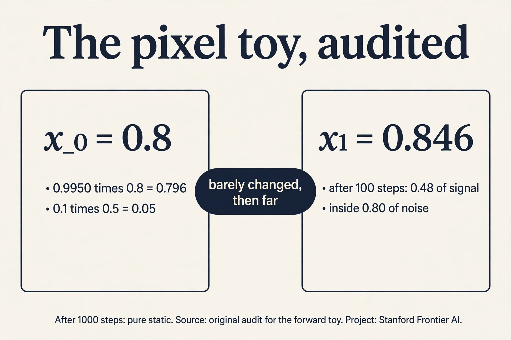
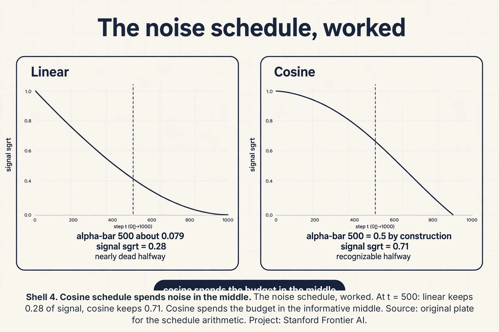
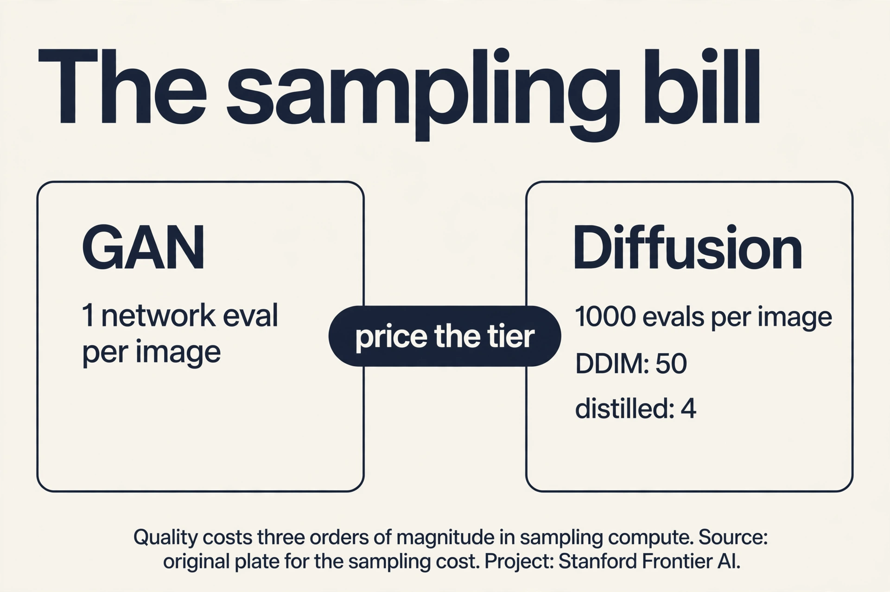
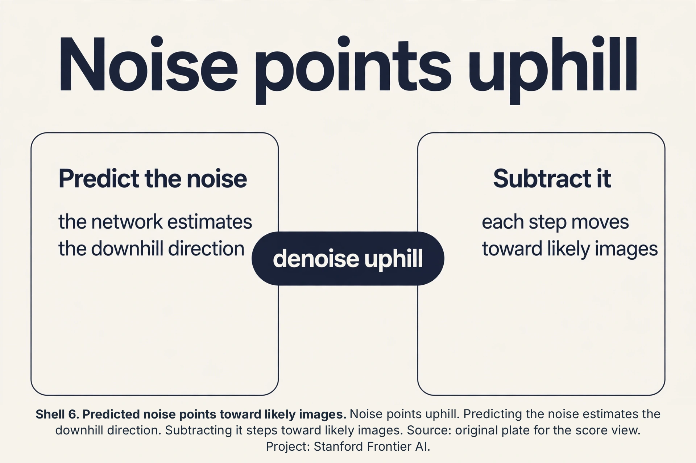
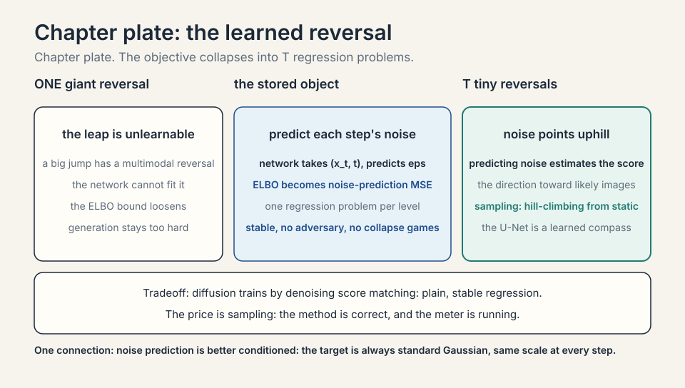
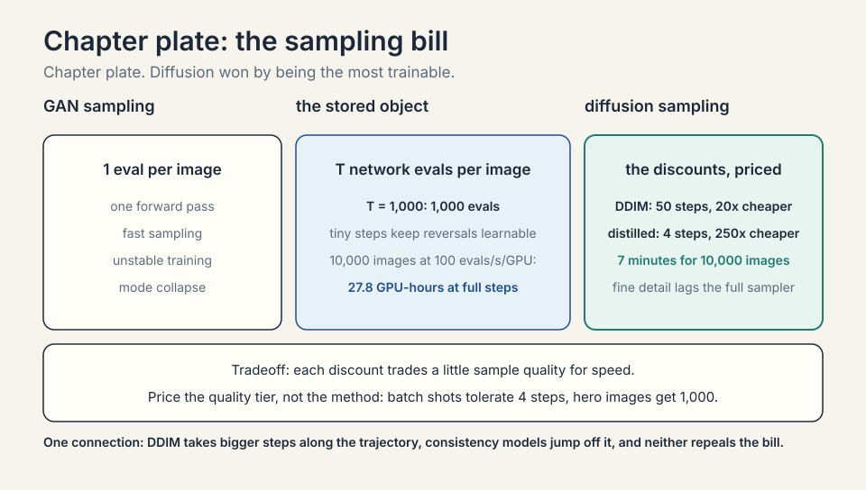

### Coverage and sourcing

This lesson follows Lecture 11 of Stanford CS229 (Machine Learning,
Spring 2026, instructor Tengyu Ma): "Diffusion Models". The lecture
builds diffusion models from zero: the fixed forward noising
process, the learned reverse denoiser, ELBO training, sampling
from pure noise, and the contrast with GANs and VAEs. A VAE
(variational autoencoder) is an encoder-decoder pair that compresses
data to a compact latent code, trained once and frozen. It draws on
the official subtitle transcript and the course notes. The coverage
map at the end of the chapter maps every major lecture claim to
the section that covers it. Figures and claims marked "October
2026" are updates added after the lecture, each with its source.

## The job: draw a cat that does not exist

Type "a cat astronaut on the moon" and get a photograph of one. No
such photo exists. The machine must invent pixels that look real.
This is **generative modeling** of images: learn p(x), the
distribution of natural images, then sample new x from it. Lectures
5 and 10 modeled distributions with Gaussians and mixtures. Images
have millions of pixels. Bell curves cannot touch them.

## First attempt: predict the pixels directly

The naive idea: train a network to output an image in one shot from
a random seed. This is roughly the GAN story the lecture contrasts
against. It works, but training is a fight: the generator and the
discriminator chase each other, modes collapse (the model draws the
same cat forever), and there is no clean likelihood to optimize.
The lecture's verdict by placement: the field moved to diffusion,
which trains on a stable, well-understood objective.

## The key question

What if generation were destruction in reverse? Take a real image
and destroy it gradually with noise until nothing remains. That
destruction is easy and needs no learning. Then learn to reverse
each tiny destruction step. To generate, start from pure noise and
run the reversals. The hard job (invent an image) becomes many easy
jobs (remove a little noise).

## The forward process: fixed destruction

Start with a clean image x_0. Each step shrinks it slightly and adds
a little Gaussian noise:

```ascii
x_t = sqrt(1 - beta_t) * x_{t-1} + sqrt(beta_t) * epsilon,  epsilon ~ N(0, I)
```

**Beta_t** is the noise schedule: small numbers like 10^-4 growing
to 10^-2. Each step keeps most of the image (sqrt(1-beta) is near 1)
and adds a whisper of noise. After one step the image is slightly
blurry. After T steps, with T in the hundreds or thousands, x_T is
pure static: the original is gone.

The crucial property: the forward process needs no learning. Given
x_0, you can sample x_t at any t directly in closed form (Gaussians
compose). So training data for the reverser is free: take real
images, noise them to any level, and you have (noisy, clean) pairs
at every noise level.

Toy with numbers. One pixel, x_0 = 0.8, beta_1 = 0.01, sampled
epsilon_1 = 0.5. x_1 = sqrt(0.99)*0.8 + sqrt(0.01)*0.5 = 0.796 +
0.05 = 0.846. Barely changed. After 100 such steps the pixel has
wandered far. After 1,000 it is standard Gaussian noise,
independent of the 0.8 it started from.


### Subchapter: the pixel toy, audited

Check the arithmetic. beta_1 = 0.01, so sqrt(1 - beta_1) =
sqrt(0.99) = 0.9950. Times x_0 = 0.8: 0.796. sqrt(beta_1) = 0.1,
times epsilon_1 = 0.5: 0.05. Sum: 0.846. The lesson's number is
exact. Now extend it: hold beta = 0.01 constant and run 100 steps.
The signal fraction is alpha_bar_100 = 0.99^100 = 0.366. Signal
left: sqrt(0.366) * 0.8 = 0.484. Noise std: sqrt(1 - 0.366) =
0.80. The pixel started at 0.8 with no noise. After 100 steps it is
0.48 of signal inside 0.80 of noise. "Wandered far" is now a
number. After 1,000 steps alpha_bar = 0.99^1000 ~ 0: pure static.



### Subchapter: the closed-form shortcut

Simulating the chain step by step to reach x_t costs O(t). The
shortcut: Gaussians compose, so x_t = sqrt(alpha_bar_t) * x_0 +
sqrt(1 - alpha_bar_t) * epsilon, with alpha_bar_t the product of
(1 - beta_s) up to t. One formula, O(1), any t. This is why
training is cheap: pick a random image, a random t, a random noise,
and you have a training pair instantly, no chain simulation. The
forward process is not just fixed: it is jumpable. Every diffusion
training loop in production samples t uniformly and uses this
formula. Without it, training would cost O(T) per example and the
method would be dead.

. Skip the chain. Simulate t steps: O(t). Closed form: x_t from x_0 in one formula, O(1). Source: original plate for the Gaussian composition. Project: Stanford Frontier AI.")

## The noise schedule

Beta_t is a design choice, not a law. The **noise schedule** sets
how fast the image dies. Two standards.

### Subchapter: linear vs cosine, worked

**Linear** (the DDPM original): beta runs from 1e-4 to 0.02 over
T = 1,000. Early steps add almost nothing. Late steps add a lot.
**Cosine**: alpha_bar_t follows a cosine curve from 1 to 0. The
noise grows slowly at both ends and fast in the middle. Work the
signal fraction at t = 500. Linear: alpha_bar_500 is roughly
0.079 (most betas were large by then). Signal: sqrt(0.079) =
0.28. Cosine: alpha_bar_500 = 0.5 by construction (the cosine
hits its midpoint). Signal: sqrt(0.5) = 0.71. The cosine schedule
keeps the image recognizable halfway through. The linear schedule
has nearly killed it. Why it matters: the denoiser trains on all
t, and a schedule that rushes through the mid-noise levels starves
the most informative regime. Cosine won the rematch. The interview
line: the schedule shapes the curriculum. Linear front-loads the
easy (near-clean) and back-loads the dead (near-noise). Cosine
spends the budget where learning happens.



. Right: 0.8 to 0.846 in one step, pure static at 1,000, and cosine keeping 0.71 at t=500. Bottom: destruction needs no intelligence, and the schedule is the curriculum. Dense chapter plate. Source: Ho et al. 2020. Project: Stanford Frontier AI.")

## The reverse process: the learned denoiser

The **reverse process** learns p(x_{t-1} | x_t): given the noisy
image, predict one step cleaner. A neural network (usually a U-Net)
takes (x_t, t) and predicts the noise that was added, or
equivalently the cleaner x_{t-1}. Each single step is easy: the
noise added per step is tiny, so the reversal is a small correction.

Training is the ELBO from lecture 10, grown up. The latent
variables are the whole chain x_1 ... x_T. The ELBO decomposes into
a sum over steps, and each step's term is essentially: how well did
the network predict the noise at level t? In practice it simplifies
to a beautifully plain objective: mean squared error between the
true noise epsilon and the network's prediction. The lecture's
bottom line: diffusion trains by denoising score matching, which
walks and talks like a pile of regression problems, one per noise
level. Stable, no adversary, no mode collapse games.

### Subchapter: the sampling bill, priced

Count the evaluations. T = 1,000 steps means 1,000 neural network
evaluations per image. A GAN needs 1. The ratio is 1,000 to 1:
diffusion's quality costs three orders of magnitude in sampling
compute. The discounts, priced the same way: **DDIM** (Denoising
Diffusion Implicit Models) samplers take larger principled steps,
cutting T from 1,000 to 50: 20x cheaper. DDIM drops the random
noise DDPM injects at every reverse step and walks a deterministic
path instead: no dice rolls between the start and the end, so
fewer, larger steps stay on track. Distillation trains a student
to mimic the teacher in 4 steps: 250x cheaper. Each discount trades a little sample quality
for speed, and the trade is measured in FID points per step
removed. The bill is why image APIs charge per image and why video
models distill aggressively: the method is correct, the meter is
running.



### Subchapter: noise points uphill

"Predict the noise" has a second name: **score matching**. The
score of a distribution is the gradient of its log density:
the direction of steepest uphill toward likely images. It turns out
that the noise added at step t points, in expectation, downhill
away from the clean image: so predicting the noise is estimating
the downhill direction, and subtracting the predicted noise steps
uphill toward likely images. Each denoising step is a small uphill
step on the terrain of natural images. The U-Net is a learned
compass: at every noise level, it points toward "more like a real
image". Sampling is hill-climbing from pure noise, guided by T
compass readings. Same method, geometric name.





## Sampling: noise to image

To generate: sample x_T from pure Gaussian noise. Run the learned
reverser T times: x_T -> x_{T-1} -> ... -> x_0. Each step removes a
little noise, guided by the network. Out comes an image. Condition
on text ("a cat astronaut") by feeding the text embedding into the
denoiser at every step, steering each correction toward the prompt.

## Why T is large

Why not destroy in 10 big steps instead of 1,000 small ones? Two
reasons. First, each reversal must be easy to learn. A tiny noise
step has a near-Gaussian reversal the network can fit. A giant leap
has a complex multimodal reversal it cannot. Second, the ELBO is
tight only when each step's reversal is close to the true posterior.
Small steps keep the approximation honest. The price is sampling
speed: generating one image needs T network evaluations. T = 1,000
means 1,000 forward passes per image. The field's whole
distillation and few-step sampler industry exists to pay this price
down.

## Classifier-free guidance: the steering dial

Text conditioning steers each denoising step. **Classifier-free
guidance** sets how hard it steers. Train the denoiser twice in
one: usually with the prompt, sometimes with the prompt dropped
(unconditional). At sampling, combine:

```ascii
guided_noise = uncond_noise + w * (cond_noise - uncond_noise)
```

### Subchapter: the dial, worked

w = 1: pure conditional (no extra push). w = 7.5 (the Stable
Diffusion default): push 7.5x away from the unconditional
prediction toward the conditional one. Work the direction: at one
step, uncond predicts noise (0.1, 0.2), cond predicts (0.3, 0.1).
Difference: (0.2, -0.1). Guided: (0.1, 0.2) + 7.5*(0.2, -0.1) =
(1.6, -0.55). The prompt's direction is amplified 7.5x. Effects:
higher w means stronger prompt adherence and more vivid images,
but past ~15 the images saturate and distort (the push
overshoots). w = 0 ignores the prompt entirely. The interview
line: guidance is a dial, not a switch. 7.5 is the default. Turn
it down for diversity, up for adherence, past 15 for artifacts.

, cond (0.3,0.1), w = 7.5: guided (1.6,-0.55). The prompt's direction amplified 7.5x. Source: original plate for the guidance arithmetic. Project: Stanford Frontier AI.")

## Latent diffusion: compress first

Diffusing in pixel space wastes compute: a 512x512 image is
786,432 numbers, most of them redundant (neighboring pixels
correlate). **Latent diffusion** compresses first with a VAE
encoder (8x downsample: 512x512x3 becomes 64x64x4 = 16,384
numbers, 48x smaller), diffuses in the latent space, then decodes.

### Subchapter: the 48x saving

The denoiser's cost scales with the tensor size. Pixel U-Net on
786K numbers per step vs latent U-Net on 16K: roughly 48x less
compute per evaluation, 48x less memory. The VAE encode/decode
runs once each (negligible against 1,000 steps). Quality holds
because the VAE's latent space keeps the perceptual content and
drops the pixel noise the eye ignores. Stable Diffusion is latent
diffusion: the lesson's forward-reverse loop runs on 64x64x4
latents, not pixels. The interview line: pixel diffusion is the
textbook. Latent diffusion is the product. The VAE is a fixed
compressor, not learned jointly: train it once, freeze it, diffuse
in its world.

, with a VAE compressing once. Right: w = 7.5 giving (1.6, -0.55), and 64x64x4 latents 48x smaller. Bottom: guidance is a dial not a switch, and latent diffusion is the product. Dense chapter plate. Source: original synthesis of the lesson. Project: Stanford Frontier AI.")

## The U-Net: the denoiser's shape

The denoiser needs a shape that sees both fine detail and global
structure. The **U-Net** is an encoder-decoder with skip
connections: downsample the noisy image through shrinking,
deepening layers (capturing global structure), then upsample back
(the decoder), with **skip connections** copying each encoder
level's feature map to the matching decoder level.

### Subchapter: why the U shape works

Denoising needs two views at once. The bottleneck (smallest,
deepest layer) sees the whole image coarsely: it knows "this is a
cat shape". The skip connections hand the decoder the fine detail
it lost in downsampling: edges, textures. Without skips, the
decoder must reconstruct detail from the bottleneck alone (blurry).
With skips, each decoder level fuses "what" (from below) with
"where exactly" (from the skip). Time enters via a **time
embedding**: t is encoded as a vector and added at every block, so
one network serves all noise levels. Text enters via
**cross-attention**: each block attends to the prompt's embedding.
The interview line: the U-Net is an hourglass with shortcuts. The
hourglass sees the gist. The shortcuts keep the detail.

. Decoder upsamples. Skip connections carry fine detail across. Time embedding and cross-attention enter every block. Source: original plate for Stanford Frontier AI.")

## From U-Net to DiT: transformer denoisers

The U-Net is convolutional. **DiT** (Diffusion Transformer)
replaces it with a transformer: patchify the latent (16x16
patches), run transformer blocks, unpatchify. Same forward-reverse
loop, different denoiser.

### Subchapter: why transformers won again

Convolutions bake in locality (each filter sees a small window).
Transformers learn the receptive field via attention: any patch
can attend to any other from layer one. At scale, the learned
beats the baked-in: DiT-XL/2 set the ImageNet generation records
the convolutional U-Nets held ([DiT repo, fork of the official implementation](https://github.com/a-gn/dit), quoting Peebles and Xie 2022: DiT-XL/2 outperform all prior diffusion models on the class-conditional ImageNet 512x512 and 256x256 benchmarks, SOTA FID 2.27 on 256x256, checked Oct 2026). The patchify step is the price:
16x16 patches on 64x64 latents give 4 tokens per side, 16
tokens: attention over 16 tokens is cheap. Sora and the video
diffusion models are DiTs: space-time patches through transformer
blocks ([Sora technical report via](https://scientyficworld.org/openai-sora-workflow-technical-architecture/): Sora is a diffusion transformer operating on spacetime patches, checked Oct 2026). The interview line: diffusion is the training recipe.
The denoiser is the architecture. U-Net was the first. DiT is the
scaling answer.

## The SDE view: continuous time

The lecture presents discrete steps. The continuous view: the
forward process is a **stochastic differential equation** (SDE)
that injects noise over continuous time t. The reverse is another
SDE running backward, driven by the **score** (gradient of the log
density) at each noise level.

### Subchapter: Langevin dynamics, the sampler

Given the score, **Langevin dynamics** samples: x <- x + (step/2)
* score(x) + sqrt(step) * noise. Uphill half-step toward likely
images, plus fresh noise to explore. Repeat: the chain converges
to the distribution. The discrete DDPM sampler is a
discretization of the reverse SDE. The probability-flow ODE drops
the noise term: a deterministic path from noise to image (this is
what DDIM approximates). Why the view matters: it unifies DDPM,
score matching, and DDIM as one SDE with different solvers, and it
is where the fast samplers are derived. The interview line: DDPM
is the discrete algorithm. The SDE is the theory it
discretizes. Name both.

## Consistency models: the few-step frontier

Distillation trains a student on the teacher's outputs. A
**consistency model** trains a bolder student: map ANY point on
the noise trajectory directly to the clean image. One evaluation,
one image.

### Subchapter: the consistency trick

The teacher defines a trajectory: noise x_T -> ... -> x_0. The
student f(x_t, t) learns to output x_0 for every t. Loss: the
student's outputs at adjacent t must agree (consistency), anchored
by f(x_0, 0) = x_0. Train it by distillation (match the teacher's
trajectory) or from scratch (consistency training). Result: 1-4
step generation at quality near the 1,000-step teacher. The price:
some fine detail still lags the full sampler, and training is
fiddly. The interview line: DDIM takes bigger steps along the
trajectory. Consistency models jump off it. Both pay the sampling
bill down. Neither repeals it.



## The honest price

Diffusion buys stable training and stunning samples, and pays in
sampling cost: hundreds to thousands of network evaluations per
image versus one for a GAN. It pays in likelihood too: the ELBO is
a bound, not the exact likelihood, so comparing models by ELBO is
comparing bounds. And it pays in data: the denoiser must see every
noise level of every kind of image, which takes enormous datasets
and compute. The lecture contrasts with GANs (fast sampling,
unstable training) and VAEs (clean latent story, blurrier samples):
diffusion won image generation by being the most trainable, not the
most elegant.

## Mapping back

| Idea | Pain it answers | How |
|---|---|---|
| Forward process | Learning to invent pixels directly is unstable | Fixed destruction: x_t = sqrt(1-beta_t) x_{t-1} + sqrt(beta_t) eps; free (noisy, clean) pairs at every level |
| Reverse denoiser | One-shot generation is too hard a job | T easy jobs: predict one step's noise; pixel toy: 0.8 -> 0.846 in one step |
| ELBO training | GAN training fights; no clean objective | ELBO over the chain simplifies to noise-prediction MSE per level; stable regression |
| Large T | Big jumps have unlearnable reversals | Hundreds-thousands of tiny steps keep each reversal near-Gaussian and the bound tight |
| Text conditioning | Unconditional samples ignore the prompt | Feed text embedding into the denoiser every step; each correction steers toward the prompt |
| Noise schedule | The curriculum shapes what the denoiser learns | Linear: 0.28 signal at t=500. Cosine: 0.71. Cosine spends the budget in the middle |
| Classifier-free guidance | The prompt steers too weakly or too hard | w=7.5 amplifies the cond direction; (0.1,0.2) and (0.3,0.1) give (1.6,-0.55) |
| Latent diffusion | Pixel space wastes 48x compute | VAE to 64x64x4, diffuse there, decode once; Stable Diffusion's design |
| U-Net | Denoising needs gist and detail at once | Hourglass plus skips; time embedding and cross-attention per block |
| DiT | Convolutions bake in locality | Patchify, transformer blocks, unpatchify; the scaling answer |
| SDE view | DDPM, DDIM, score matching looked separate | One SDE, different solvers; Langevin samples via the score |
| Consistency models | Even DDIM costs 50 steps | Map any x_t to x_0 directly; 1-4 steps near teacher quality |

> [!QA]
> Q: What is the forward process in a diffusion model?
> A: Fixed, learning-free destruction. Start from a clean image x_0 and iterate x_t = sqrt(1-beta_t) x_{t-1} + sqrt(beta_t) epsilon with small betas (10^-4 to 10^-2). Each step barely changes the image. After T = hundreds to thousands of steps, x_T is pure Gaussian noise. Because Gaussians compose, you can sample x_t at any t directly from x_0 in closed form, so training pairs at every noise level are free.
> Follow-up: Why is the forward process fixed rather than learned?
> A: Because destruction needs no intelligence: adding noise is trivial. Fixing it makes the training data for the reverser free and the ELBO tractable. All learning concentrates in the reverse process, which is where the intelligence belongs. A learned forward process would add parameters with no benefit.

> [!QA]
> Q: What does the diffusion network actually learn to predict?
> A: The noise. Given a noisy image x_t and the timestep t, the network predicts the Gaussian noise epsilon that was added, or equivalently the slightly cleaner x_{t-1}. The training objective (from the ELBO) simplifies to mean squared error between true and predicted noise, averaged over timesteps and images. Each noise level is one regression problem. The network shares weights across all levels with t as input.
> Follow-up: Why predict the noise instead of the clean image directly?
> A: They are equivalent by algebra (x_0 can be recovered from x_t minus the noise), but noise prediction is better conditioned: the target epsilon is always standard Gaussian, same scale at every timestep, while x_0's scale varies. Stable targets train stably. The lecture presents noise prediction as the practical parameterization.

> [!QA]
> Q: Why does sampling need so many steps, and how is that being fixed?
> A: Each learned reversal only undoes a tiny noise step accurately. Big jumps have complex reversals the network cannot fit, and the ELBO bound loosens. So generation runs the network T times (hundreds to thousands) per image. The field attacks this with distillation (train a student to do in 4 steps what the teacher does in 1,000), better samplers (DDIM, DPM-Solver take larger principled steps), and noise schedule design. The price is fundamental to the method. The discounts are engineering.
> Follow-up: Compare diffusion with GANs and VAEs.
> A: GANs: one forward pass to sample (fast), but adversarial training is unstable and modes collapse. VAEs: clean probabilistic latent story, but samples are blurrier and likelihoods are bounds too. Diffusion: slowest to sample, but the most stable to train (plain regression objectives) and the best sample quality. The field chose trainability.

## Recap: the whole lesson on one screen

1. **The job.** Draw a cat astronaut that never existed. Learn
   p(x) for images, sample new x.
2. **First attempt.** One-shot generation (GAN-style): unstable
   training, mode collapse, no clean objective.
3. **The key question.** What if generation were destruction in
   reverse?
4. **Forward.** x_t = sqrt(1-beta_t) x_{t-1} + sqrt(beta_t) eps.
   Fixed, free training pairs. Pixel toy: 0.8 -> 0.846.
5. **Reverse.** Network predicts each step's noise. ELBO becomes
   noise-prediction MSE per level. Stable.
6. **Sampling.** Pure noise x_T, run T reversals, steer each with
   the text prompt.
7. **Large T.** Tiny steps keep reversals learnable and the bound
   tight. Price: T network evals per image.
> [!QA]
> Q: Walk me through the mechanism: audit the pixel toy and extend it to 100 steps.
> A: beta_1 = 0.01. sqrt(0.99) = 0.9950, times 0.8 = 0.796. sqrt(0.01) = 0.1, times 0.5 = 0.05. Sum: 0.846. Exact. Extend: constant beta = 0.01, alpha_bar_100 = 0.99^100 = 0.366. Signal: sqrt(0.366)*0.8 = 0.484. Noise std: sqrt(1-0.366) = 0.80. After 100 steps the pixel is 0.48 of signal inside 0.80 of noise: "wandered far", quantified. After 1,000 steps alpha_bar ~ 0: pure static.
> Follow-up: Why does the closed-form shortcut matter for training cost?
> A: Without it, making one training pair at level t costs t simulation steps: O(T) per example. With x_t = sqrt(alpha_bar_t) x_0 + sqrt(1-alpha_bar_t) eps, any t costs O(1). Training samples random (image, t, noise) triples directly. The shortcut is what makes training cost independent of T.

> [!QA]
> Q: Applied design: you need 10,000 product images by tomorrow. Your diffusion model takes 100 network evals per second per GPU and needs 1,000 evals per image. Plan.
> A: 1,000 evals at 100/s = 10 s per image per GPU. 10,000 images = 100,000 GPU-seconds = 27.8 GPU-hours. Options: distill to 4 steps (0.04 s/image, 7 minutes on one GPU, small quality loss), or DDIM at 50 steps (0.5 s/image, 1.4 GPU-hours), or parallelize 28 GPUs at full 1,000 steps for max quality. Decision rule: batch product shots tolerate the distilled model. Hero images get full steps. The bill is per image, so price the quality tier, not the method.
> Follow-up: Your distilled 4-step model looks worse on hands. Why hands, specifically?
> A: Few-step samplers compress the fine-correction phase where details resolve. Coarse structure survives 4 steps. High-frequency detail (fingers, text) needs the late small steps. Mitigation: keep full steps for detail-critical images, or distill with extra weight on late timesteps. The failure concentrates where the corrections were smallest.

> [!QA]
> Q: Why does the ELBO become noise-prediction MSE?
> A: The chain ELBO decomposes into a sum of per-step terms, each a KL divergence between the true reversal posterior q(x_{t-1}|x_t, x_0) and the learned p(x_{t-1}|x_t). Both are Gaussian, so the KL has a closed form: it penalizes the difference of their means. Reparameterize the means in terms of the noise, and the penalty becomes MSE between the true noise epsilon and the network's prediction. The probabilistic objective collapses into T regression problems. That collapse is the whole reason diffusion trains stably.
> Follow-up: Where did the "score matching" name come from?
> A: Predicting the added noise is mathematically equivalent to estimating the score: the gradient of the log data density. The denoiser learns, at each noise level, which direction is uphill toward real images. Score matching is the older name for the same idea. Diffusion is score matching run as a chain.

> [!QA]
> Q: Your diffusion model draws nearly the same cat for every prompt. Diagnose.
> A: Mode collapse is the GAN disease. In diffusion, suspect the conditioning path first. Tests: fix the prompt, vary the seed. If images are identical, the model ignores the initial noise: over-conditioning or a broken stochastic sampler. Fix the seed, vary the prompt. If images are identical, the model ignores the prompt: the text embedding is not reaching the denoiser (broken cross-attention) or the guidance scale is misconfigured. If both vary the image but every cat looks alike, the training data lacked diversity: the model learned one cat. Each test isolates one suspect.
> Follow-up: The seed test shows variation but the prompt test shows none. The text encoder works fine standalone. Where is the break?
> A: Between the encoder and the denoiser: the cross-attention layers that inject the text embedding into each denoising step. Check that the conditioning tensors have the right shape and are not zeroed or detached. A common bug: the text embedding is computed but never passed, so the model trains and samples unconditionally while the prompt pipeline looks healthy.

> [!QA]
> Q: Walk me through the mechanism: why does the cosine schedule beat the linear schedule, in numbers?
> A: The denoiser trains on all t uniformly, so the schedule decides how much training budget each noise regime gets. Linear (beta 1e-4 to 0.02): at t = 500 the signal fraction alpha_bar is about 0.079, signal 0.28: the image is nearly dead halfway, so half the training pairs are near-noise (uninformative) or near-clean (trivial). Cosine: alpha_bar_500 = 0.5, signal 0.71: the mid-noise regime, where the denoising job is hardest and most informative, gets its fair share of training pairs. The schedule is the curriculum: cosine spends the budget where the learning happens.
> Follow-up: Could you learn the schedule instead of fixing it?
> A: In principle yes, and some work tries. In practice the schedule interacts with the ELBO weighting per t, and joint optimization is unstable: the model games the schedule to weight easy timesteps. Fixed schedules (linear, cosine) are the stable choice. The learned part is the denoiser, not the curriculum.

9. **The audit.** 0.796 + 0.05 = 0.846. 100 steps: 0.48 signal
   in 0.80 noise. Numbers, not adjectives.
10. **The shortcut.** Closed form makes training O(1) per pair.
    Jumpable, not simulable.
11. **The bill.** 1,000 evals vs 1. DDIM 50, distilled 4. Price
    the quality tier.
12. **The compass.** Noise prediction is score estimation.
    Sampling is hill-climbing from static.
13. **Schedule.** Linear: 0.28 signal at t=500. Cosine: 0.71.
    The curriculum decides where learning happens.
14. **Guidance.** w=7.5: (1.6,-0.55) from (0.1,0.2) and
    (0.3,0.1). Dial, not switch. Past 15: artifacts.
15. **Latent.** 512x512x3 to 64x64x4: 48x smaller. Diffuse
    there. Stable Diffusion's design.
16. **U-Net.** Hourglass plus skips. Time embedding and
    cross-attention per block. Gist plus detail.
17. **DiT.** Patchify, transformer, unpatchify. The scaling
    answer. Sora is a DiT (OpenAI Sora technical report, checked Oct 2026).
18. **SDE.** One equation, many solvers. Langevin samples via
    the score. DDIM is the probability-flow ODE.
19. **Consistency.** Any x_t maps to x_0. 1-4 steps near teacher
    quality. The few-step frontier.

## What is used where

**Diffusion runs production image and video generation.**
Stable Diffusion (open weights), DALL-E 3, Midjourney, and the
video models (Sora and its peers) are diffusion-based ([Stable Diffusion](https://arxiv.org/abs/2112.10752): latent diffusion, Rombach et al. 2021. [Midjourney](https://www.cometapi.com/how-does-midjourney-ai-work/): denoising-diffusion U-Net backbone per third-party technical write-ups. [Sora](https://scientyficworld.org/openai-sora-workflow-technical-architecture/): diffusion transformer per OpenAI's technical report. DALL-E 3: [uncertain], OpenAI has not publicly disclosed its architecture. All checked Oct 2026): the lesson's
forward-reverse-ELBO loop is the deployed architecture. GANs
survive in niche real-time jobs where one-eval sampling matters.
The distillation and few-step sampler industry (DDIM, DPM-Solver,
consistency models) exists to pay down the sampling bill the
lesson prices.

## Watch next

<div class="video-block"><div class="video-wrap"><iframe src="https://www.youtube-nocookie.com/embed/iv-5mZ_9CPY" title="Explainer: how diffusion models work" allow="accelerometer; autoplay; clipboard-write; encrypted-media; gyroscope; picture-in-picture" allowfullscreen loading="lazy" referrerpolicy="strict-origin-when-cross-origin"></iframe></div><p class="video-cap">Explainer: how diffusion models work. A visual walkthrough of the forward destruction and the learned reversal. Watch after the pixel toy.</p></div>

## Go deeper

- [Denoising Diffusion Probabilistic Models (Ho et al., 2020)](https://arxiv.org/abs/2006.11239)
- The DDPM paper the lecture builds on: the forward process, the simplified noise-prediction objective, the sampling loop. Read sections 2-3 for the ELBO simplification.
- [Generative Modeling by Estimating Gradients of the Data Distribution (Song and Ermon, 2019)](https://arxiv.org/abs/1911.07072)
- The score-based view: noise-conditional score networks, the geometric "noise points uphill" story. Matches the score subchapter.
- [High-Resolution Image Synthesis with Latent Diffusion Models (Rombach et al., 2021)](https://arxiv.org/abs/2112.10752)
- Latent diffusion: the VAE bottleneck, cross-attention conditioning, the 48x saving. Matches the latent section.
- [The Annotated Diffusion Model (HuggingFace blog)](https://huggingface.co/blog/annotated-diffusion)
- A line-by-line code walkthrough of the DDPM training and sampling loops. Matches the pixel toy and the closed-form sections.

## Official sources and further reading

**Official:**
- Lecture 11 video, Stanford Online YouTube:
  - [Tengyu Ma derives](https://www.youtube.com/watch?v=dqUMCzWjZSI)
  the forward process, the ELBO training objective, and sampling,
  contrasting with GANs and VAEs.
- Official subtitle transcript (en-US): the lecture's spoken text.
- CS229 Spring 2026 official course notes (local PDF): the full
  ELBO derivation for diffusion.

**Caveats from these sources.** The lecture's beta schedule values
(10^-4 to 10^-2) and T in the hundreds-to-thousands are the
standard DDPM regime the lecture presents. The pixel toy is an
original miniature of the lecture's per-step arithmetic. Distillation
and few-step samplers are the field's ongoing answer to the
sampling price, surveyed but not derived in the lecture.

## Connections to the other courses

- **CS229 L10:** the ELBO, grown from one latent variable to a
  chain of T.
- **CS229 L05:** generative modeling's classical roots: from
  class-conditional Gaussians to learned denoisers.
- **CS229 L13:** text conditioning: the prompt embeddings that
  steer each denoising step.
- **CS229 L14:** the transformer backbones inside modern
  denoisers (DiT).
- **CS336:** training diffusion models at scale: the compute
  behind the samples.

## Coverage map: every lecture claim and where it lives

| Lecture claim | Covered in | File line |
|---|---|---|
| Generative modeling of images: learn p(x), sample new x | The job | L48 |
| One-shot generation (GAN-style): unstable, mode collapse | First attempt | L57 |
| Generation as destruction in reverse | The key question | L67 |
| Forward: x_t = sqrt(1-beta_t) x_{t-1} + sqrt(beta_t) eps | The forward process | L76 |
| Betas 1e-4 to 1e-2; T in hundreds to thousands | The forward process | L76 |
| Pixel toy: 0.8 to 0.846 in one step, audited | the pixel toy, audited | L105 |
| Closed form: x_t from x_0 in O(1); training is cheap | the closed-form shortcut | L119 |
| Linear vs cosine schedule: 0.28 vs 0.71 signal at t=500 | The noise schedule | L134 |
| Reverse: network predicts each step's noise | The reverse process | L159 |
| ELBO simplifies to noise-prediction MSE per level | The reverse process | L159 |
| Sampling bill: 1,000 evals vs 1; DDIM 50; distilled 4 | the sampling bill, priced | L177 |
| Score view: noise points uphill; sampling is hill-climbing | noise points uphill | L196 |
| Sampling: x_T noise, T reversals, text steering | Sampling: noise to image | L212 |
| Large T: tiny steps keep reversals learnable, bound tight | Why T is large | L220 |
| Classifier-free guidance: w=7.5 gives (1.6,-0.55) | Classifier-free guidance | L233 |
| Latent diffusion: 64x64x4, 48x saving | Latent diffusion: compress first | L260 |
| U-Net: hourglass plus skips; time and text per block | The U-Net | L282 |
| DiT: patchify, transformer, unpatchify; scaling answer | From U-Net to DiT | L308 |
| SDE view: reverse SDE, Langevin, probability-flow ODE | The SDE view | L329 |
| Consistency models: any x_t to x_0; 1-4 steps | Consistency models | L351 |
| Honest price: sampling cost, ELBO bounds, data hunger | The honest price | L371 |
| GAN/VAE/diffusion contrast: trainability won | Why T is large; the sampling bill | L220, L177 |
