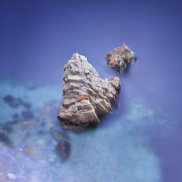
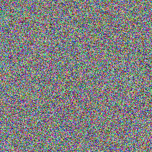

## How to read this lesson

This lesson has two levels. **Level 1 (Core)** contains what you need to
understand everything that follows in CS229 and the courses that build on
it. **Level 2 (Deep)** contains what you need for correct, interview-grade
understanding. Read Level 1 straight through. Return to Level 2 when you
want depth.

No prerequisites are assumed. Every term is defined at first use. The
ELBO and the generative question were defined in [lecture
10](l10-em-pca.html); they are reused, not re-explained.

## Level 1: What diffusion models are

A **diffusion model** is a generative model for images, and now video and
robot actions. Given many natural images, it learns to generate new
clean images from the same distribution [00:05](ts:00:05). Not copies of
training images. New images that look like they came from the same
source.

The field history matters. Image generation used GANs, then variational
autoencoders (VAEs). Diffusion is now the predominant approach, better
than both [01:40](ts:01:40). The course no longer teaches GANs or VAEs;
the notes keep VAEs only for the curious. When a course drops two
established topics for one, pay attention.

Two applications beyond images. **VLA** models, vision-language-action,
use diffusion to generate robot actions [00:39](ts:00:39). And diffusion
can generate in **parallel** in some sense, making inference potentially
faster than autoregressive generation [02:33](ts:02:33).

> [!QA]
> Q: What problem do diffusion models solve?
> A: Sampling from a complex distribution given only samples. You have many real images and want new ones from the same distribution. The model learns a denoising process: start from pure noise, remove noise step by step, land on a realistic image. Training needs only the real images and the fixed noising process, no labels.
> Follow-up: Why did diffusion beat GANs?
> A: Training stability. GANs pit two networks against each other in a game that is notoriously unstable. Diffusion trains a single denoising network on a straightforward regression-like objective. Stable training plus excellent sample quality won the field. The lecture states the outcome without relitigating the war.

## Level 1: The forward process

The **forward process** q destroys images gradually [27:58](ts:27:58).
Start from a clean image x_0. Each step shrinks it slightly and adds a
little Gaussian noise:

x_t = (1 - beta_t) x_{t-1} + sqrt(beta_t) eps_t

Beta is small, between 0 and 1, like 1e-4 [07:40](ts:07:40). Eps_t is
fresh standard Gaussian noise each step. One step barely blurs the
image. After T steps, around 1000 in the original paper
[35:20](ts:35:20), the image is pure noise.

The coefficients are chosen to **preserve variance**
[12:29](ts:12:29). If the data starts with identity covariance, every
x_t keeps identity covariance: the shrinkage and the added noise balance
exactly. Normalize the data first and the scale never drifts. This is
bookkeeping, but the kind that prevents training from exploding.

The forward process is fixed. No learning. It is just a recipe for
turning images into noise, step by step.

> [!QA]
> Q: Why add noise gradually instead of all at once?
> A: Because denoising gradually is easier to learn than denoising all at once [33:51](ts:33:51). One giant jump from pure noise to a clean image is a brutally hard function to learn. A thousand tiny denoising steps are each easy: remove a little noise, keep the structure. The lecture's intuition: the gradual path gives the learner a curriculum of easy problems instead of one impossible one.
> Follow-up: Why is the forward process fixed rather than learned?
> A: A learned noiser is what VAEs do, and it complicates training: the noiser and denoiser must co-adapt. Diffusion is more brute force: fix a simple noising recipe, spend all learning capacity on the denoiser. Fewer moving parts, more stable training. The fixed process is a feature.

## Level 1: The reverse process and training

The **reverse process** p_theta learns to denoise. Given the noisier
x_t, predict the cleaner x_{t-1}. A neural network does this, one step
at a time. Chain T steps: start from pure noise x_T, apply the denoiser
repeatedly, and a clean image x_0 emerges.

Training needs a loss for the denoiser. The answer is the **ELBO** from
lecture 10: the evidence lower bound over the whole chain
[39:44](ts:39:44). The latent variables are the intermediate noisy
images. The bound decomposes per step, so training becomes: pick a
random clean image, pick a random step t, noise it to x_t with the fixed
forward process, and train the network to denoise it. Simple, stable,
scalable.

Sampling reverses the recipe. Draw x_T from a standard Gaussian. For t
from T down to 1, sample x_{t-1} from p_theta given x_t. Output x_0.
Every sample is a fresh walk from noise to image.

> [!QA]
> Q: What does the diffusion network actually predict?
> A: How to remove the noise added at one step: given x_t, produce a cleaner x_{t-1}. Equivalently, and commonly implemented, it predicts the noise eps_t that was added, and the cleaner image follows by subtraction. Both views describe the same learned denoiser. The network sees the noisy image and the step index t, because the right amount of denoising depends on how noisy the input is.
> Follow-up: Where does the ELBO from lecture 10 appear?
> A: As the training objective. The chain x_0..x_T is a latent-variable model: the noisy intermediates are hidden. The ELBO over the chain gives a per-step denoising loss. EM's pattern, bound the hard thing and climb the bound, is literally the training algorithm. Lecture 10 was the rehearsal.

## Level 2: Why T is large

T around 1000 looks wasteful. Each step is cheap, but a thousand steps
per sample is a thousand network evaluations. The lecture's answer is
that small steps make each denoising problem easy, and easy problems
train reliably. Fewer, bigger steps make each step harder and training
less stable.

The field has since developed shortcuts: fewer-step samplers that skip
along the chain, and distillation that compresses many steps into few.
The training still uses the long chain. The sampling need not. This
split, train long and sample short, is characteristic of deployed
diffusion systems.

## Level 2: Diffusion versus autoregression

Lecture 14 covers autoregressive generation: predict token by token,
each depending on all previous. Diffusion differs in two ways. The
generation order is not fixed: every step refines the whole image at
once, which is the parallelism the lecture mentions. And the model sees
the full noisy canvas each step, not just a prefix.

The tradeoff: autoregressive models handle discrete sequences naturally
and need no fixed length. Diffusion handles continuous data naturally
and refines globally. The frontier uses both: diffusion for images and
actions, autoregression for text. Stefano Ermon's work on diffusion
language models tries to cross that boundary for faster text inference.

## Recap: the whole lesson on one screen

Eight ideas carry this lecture. Read each card. Say the core sentence out
loud. If you can, you own the lesson.

<strong>1. Diffusion generates from noise</strong>

Learn the distribution of real images. Sample: pure noise in, clean
image out. Predominant approach, better than GANs and VAEs.

Key: noise to image, learned

<strong>2. Forward: fixed noising</strong>

x_t = (1-beta_t) x_{t-1} + sqrt(beta_t) eps. Small beta, ~1000 steps.
Variance preserving. No learning here.

Key: image to noise, fixed

<strong>3. After T steps: pure noise</strong>

The chain ends at a standard Gaussian. Sampling starts here. The
forward process defines the starting distribution exactly.

Key: x_T is just noise

<strong>4. Reverse: learned denoising</strong>

p_theta(x_{t-1} | x_t): a network removes one step of noise. Chain T
applications. Gradual beats one-shot: easy problems, not one hard
one.

Key: denoise step by step

<strong>5. Training is the ELBO</strong>

The chain is a latent-variable model. The bound gives a per-step
denoising loss. Lecture 10's pattern, deployed.

Key: bound, then climb

<strong>6. Sampling walks backward</strong>

Draw noise, denoise T times, keep x_0. Every run gives a fresh image.
Shortcuts exist for fewer steps at sample time.

Key: T denoise evaluations

<strong>7. Beyond images: VLA and speed</strong>

Diffusion generates robot actions in VLA models. Parallel refinement
can beat autoregressive token-by-token inference.

Key: actions are images too

<strong>8. Fixed forward, learned reverse</strong>

VAEs learn both directions and co-adaptation hurts. Diffusion fixes
the noiser, learns only the denoiser. Fewer moving parts win.

Key: brute force, stable

## Official sources and further reading

**Official:**
- Lecture 11 video: image generation task [00:05](ts:00:05), VLA [00:39](ts:00:39), predominant approach [01:40](ts:01:40), parallel generation [02:33](ts:02:33), forward process [07:40](ts:07:40), variance preservation [12:29](ts:12:29), one-shot question [33:51](ts:33:51), T ~ 1000 [35:20](ts:35:20), ELBO training [39:44](ts:39:44).
- CS229 Spring 2026 official course notes: diffusion chapter; the x_0/x_T figures above are from it.

**Further reading:**
- Ho, Jain, and Abbeel (2020), "Denoising Diffusion Probabilistic Models": the DDPM paper.
- Sohl-Dickstein et al. (2015): the original diffusion formulation.

**Caveats from these sources.** The "better than GANs and VAEs" claim is
about image quality and training stability circa 2026; GANs still win on
single-step sampling speed. The parallelism claim is "in some sense":
practical speedups need few-step samplers. The notes' VAE chapter is
retained for interest, not examined.

## Connections to the other courses

- **CS336:** diffusion language models are the alternative to autoregressive generation; the course compares the paradigms.
- **CS224N:** the ELBO training pattern matches variational objectives in text generation.
- **CS329H:** VLA models are diffusion policies: actions sampled like images.

> [!CHEAT]
> **Diffusion cheatsheet.** Task: sample new images from the data distribution. Forward q: x_t = (1-beta_t)x_{t-1} + sqrt(beta_t) eps_t; fixed; variance preserving; T ~ 1000; ends at pure noise. Reverse p_theta: learned denoiser, one step at a time; gradual beats one-shot. Training: ELBO over the chain, per-step denoising loss. Sampling: noise, denoise T times. Wins: stable training, quality; VLA actions; parallel refinement.

> [!MEMORY]
> **Easy problems, chained.** One impossible denoising jump becomes a thousand easy ones. When a task looks unlearnable, ask what gradual version of it is learnable. The curriculum is the algorithm.
