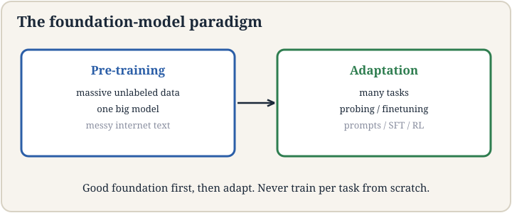
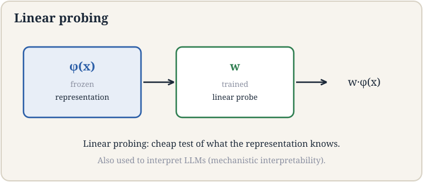

## How to read this lesson

This lesson has two levels. **Level 1 (Core)** contains what you need to
understand everything that follows in CS229 and the courses that build on
it. **Level 2 (Deep)** contains what you need for correct, interview-grade
understanding. Read Level 1 straight through. Return to Level 2 when you
want depth.

No prerequisites are assumed. Every term is defined at first use. Neural
networks were defined in [lectures 7](l07-neural-networks-1.html) and
[8](l08-backpropagation.html); they are reused, not re-explained.

## Level 1: A new paradigm

After GPT-3 arrived in summer 2020 [37:12](ts:37:12), Stanford faculty
gathered around the OpenAI playground and realized the field had
changed. Percy Liang led a team to study the shift and named it in a
survey paper: **foundation models** [37:59](ts:37:59). Not an emergent
paradigm anymore. The new paradigm.

The old paradigm: pick a task, collect labeled data, train a model for
that task. The new paradigm has two phases. **Pre-training**: train one
big model on massive unlabeled data [39:23](ts:39:23), orders of
magnitude more than before, messy internet text and all. **Adaptation**:
adapt that model to many downstream tasks [39:46](ts:39:46). You start
from a good foundation instead of from scratch. That is why it is called
a foundation model.

The pre-training data is deliberately broad and initially messy: HTML
with tags, Word documents, everything. Quality filtering came later.
The bet: scale plus diversity teaches general structure that no single
task's labels could.

> [!QA]
> Q: What makes a model a foundation model?
> A: Two phases. Pre-training on massive, broad, unlabeled data produces one general model. Adaptation specializes it to tasks. The old way trained one model per task from its own labels. The new way amortizes one expensive pre-training across unlimited adaptations. GPT-3 was the demonstration that this works.
> Follow-up: Why unlabeled data?
> A: Labels are expensive and narrow. Unlabeled text is abundant and broad. A pre-training objective like next-word prediction turns raw text into supervision for free: every word is a label for its context. Scale of data beats quality of labels for learning general structure.

## Level 1: Representation learning

**Representation learning** is pre-training with a specific product: a
mapping from raw input to a vector [48:03](ts:48:03). The vector is
called the **representation**, the **embedding**, or the **feature**.
The lecture uses "embedding" as the standard word. Similar inputs should
land near each other in vector space.

Formally: learn phi_theta mapping x to a vector in R^m. Train it with
some loss on unlabeled or weakly labeled data. Freeze the result. The
frozen phi is the product. Everything downstream consumes vectors, not
raw inputs.

This lecture covers the pre-ChatGPT era techniques, roughly 2019 to
2022. The post-2022 dominating approach, full LLM pre-training plus
post-training, is lectures 13 through 17. The representation idea
survives in all of them: every modern model is, at bottom, a machine
that turns inputs into vectors.

> [!QA]
> Q: What is an embedding, intuitively?
> A: A list of numbers that places an input in a space where distance means similarity. Two cat photos get nearby vectors. A cat photo and an airplane get distant vectors. The numbers are learned, not designed. Downstream models work in this space because similarity is now geometry: near means alike.
> Follow-up: Who decides what the embedding dimensions mean?
> A: Nobody. The dimensions are not designed to mean anything. They are whatever the training loss found useful. This is why embeddings need probing to interpret: the coordinates are emergent, not assigned. Interpretability methods exist precisely because we did not choose the axes.

## Level 1: Linear probing

Once you have a frozen representation, the cheapest downstream model is
**linear probing** [50:06](ts:50:06): train a linear classifier on top
of the fixed vectors. Prediction = w . phi(x), plus softmax for
classification.

, trained linear w. Prediction is their dot product. Original plate.")

Linear probing has two uses. As a task solver: when data is scarce, a
linear layer on good embeddings beats training a full network. As a
measuring instrument: probe accuracy reports what the representation
knows. If a linear probe can read syntax from the vectors, the
representation encodes syntax. This second use survives into the LLM
era as **mechanistic interpretability** [50:14](ts:50:14): probes as
tools for understanding what large models compute internally.

The logic is a fortiori. If even a linear model can extract the
information, the information is definitely there. Probing is a lower
bound on what the representation contains.

> [!QA]
> Q: Why freeze the representation instead of fine-tuning everything?
> A: Two reasons. Data: a linear layer has few parameters, so it trains on little labeled data without overfitting. Diagnosis: freezing isolates what pre-training learned from what the task added. If the probe succeeds, credit goes to the representation. Fine-tuning everything is stronger but tells you nothing about the frozen features.
> Follow-up: What does a failed probe prove?
> A: Less than you hope. It proves a linear model cannot read the information, not that the information is absent. A nonlinear probe might succeed. Probing gives lower bounds on represented knowledge, never upper bounds. Absence of evidence is not evidence of absence.

## Level 1: Adapting cheaply. LoRA and multitask

Full fine-tuning updates every parameter. For billion-parameter models
that is expensive. **LoRA**, low-rank adaptation [62:59](ts:62:59),
updates less. Freeze the pre-trained weight W_0. Learn a low-rank change
Delta = A B, where A and B are thin matrices. The adapted weight is W_0
+ A B.

Rank r controls the budget. W_0 is d-by-d. A is d-by-r, B is r-by-d.
With r much smaller than d, the update has a fraction of the
parameters. The bet: task adaptation lives in a low-dimensional
subspace. Empirically it usually does.

**Multitask** training [42:01](ts:42:01) is the other adaptation
strategy: train one model on many tasks at once, sharing the
representation. Tasks regularize each other. The shared layers learn
structure useful across tasks, which is exactly the foundation-model
bet in miniature.

> [!QA]
> Q: Why does low-rank adaptation work?
> A: Because adapting to a new task rarely needs the full parameter space. The pre-trained model already knows language, or vision, or both. The task adds a small adjustment: a style, a format, a domain. That adjustment fits in a low-rank subspace. LoRA bets the update rank is small, and the bet usually pays.
> Follow-up: LoRA or full fine-tuning?
> A: LoRA for cheap adaptation: few parameters, fast training, easy to swap adapters per task. Full fine-tuning when the task needs deep changes the low-rank update cannot express, or when you have the compute budget anyway. Many deployments use LoRA for everything and reserve full fine-tuning for the base model itself.

## Level 2: Parallelism

Training foundation models needs many GPUs. Two kinds of **parallelism**
[72:00](ts:72:00) split the work. **Data parallelism**: copy the model
to each GPU, give each a different data shard, average the gradients.
Simple, but every GPU holds the full model. **Model parallelism**: split
the model itself across GPUs, each holding some layers or some shards
of layers. Needed when the model does not fit on one GPU.

The lecture treats parallelism as architecture co-design: the model's
shape and the hardware's shape must be designed together. Attention's
quadratic cost from lecture 14 is the kind of fact that forces this
co-design. The guest lecture on system ML continues the thread.

## Level 2: What "paradigm" claims and what it does not

"New paradigm" is a strong claim. The lecture earns it with the
deployment story from lecture 15: one off-the-shelf model plus prompts
replaced per-company training pipelines. But the claim has limits. The
paradigm covers models where pre-training transfers. For problems with
no relevant unlabeled data, the old task-specific training remains the
answer. Paradigms describe the center of the field, not its edges.

Also note the convergence the lecture mentions: the paradigm narrowed
over five years. Early "foundation models" included many techniques.
By 2026 the term mostly means pre-trained transformers plus
adaptation. The course follows that narrowing: representation
techniques here, the transformer core next.

## Recap: the whole lesson on one screen

Eight ideas carry this lecture. Read each card. Say the core sentence out
loud. If you can, you own the lesson.

<strong>1. Foundation models: pre-train, then adapt</strong>

One big model on massive unlabeled data, then many adaptations.
Named after GPT-3 by Percy Liang's team. The new paradigm.

Key: two phases, one foundation

<strong>2. Pre-training eats the messy internet</strong>

Massive, diverse, initially unfiltered. Scale teaches general
structure. Quality filtering came later. Unlabeled is abundant.

Key: scale over labels

<strong>3. Embeddings geometrize similarity</strong>

Representation, embedding, feature: a vector per input. Near means
alike. Dimensions are emergent, not designed.

Key: similarity as distance

<strong>4. Linear probing: freeze, then fit w</strong>

Prediction = w . phi(x). Cheap task solver. Honest measuring
instrument. Powers mechanistic interpretability.

Key: frozen phi, trained w

<strong>5. Probes give lower bounds</strong>

Success proves the information is there. Failure proves only that a
linear read failed. Never an upper bound on knowledge.

Key: a fortiori logic

<strong>6. LoRA: adapt in low rank</strong>

W = W_0 + AB, thin A and B. Task changes live in small subspaces.
Cheap, swappable, usually enough.

Key: rank r controls budget

<strong>7. Multitask shares the representation</strong>

One model, many tasks, shared layers. Tasks regularize each other.
The foundation bet in miniature.

Key: shared structure

<strong>8. Parallelism: data and model</strong>

Data: shard the batch, average gradients. Model: shard the weights.
Co-design architecture with hardware. Scale demands both.

Key: split work, split model

## Official sources and further reading

**Official:**
- Lecture 12 video: GPT-3 summer 2020 [37:12](ts:37:12), foundation models named [37:59](ts:37:59), pre-training [39:23](ts:39:23), adaptation [39:46](ts:39:46), representation learning [48:03](ts:48:03), linear probing [50:06](ts:50:06), mechanistic interpretability [50:14](ts:50:14), LoRA [62:59](ts:62:59), parallelism [72:00](ts:72:00).
- CS229 Spring 2026 official course notes: foundation models chapter.

**Further reading:**
- Bommasani et al. (2021), "On the Opportunities and Risks of Foundation Models": the survey paper.
- Hu et al. (2021), "LoRA: Low-Rank Adaptation of Large Language Models."

**Caveats from these sources.** The paradigm narrative is a framing,
not a theorem; task-specific training still wins where unlabeled data
is irrelevant. LoRA's rank is a hyperparameter; too small starves the
task. Probing lower bounds are often misread as upper bounds; the
lecture warns against it.

## Connections to the other courses

- **CS336:** the full pre-training pipeline is CS336's subject; this lecture is its conceptual on-ramp.
- **CS224N:** word embeddings were the original representation-learning success; sentence embeddings generalize them.
- **CS329H:** RLHF is adaptation by reinforcement; LoRA is adaptation by low-rank updates. Same phase, different tool.

> [!CHEAT]
> **Foundation model cheatsheet.** Paradigm: pre-train on massive unlabeled data, adapt to tasks. Named by Percy Liang's team post-GPT-3. Representation learning: phi_theta maps x to vectors; similar inputs near each other; "embedding" is standard. Linear probing: freeze phi, train w; prediction w.phi(x); measures what is represented; lower bounds only. LoRA: W_0 + AB, rank r budget. Multitask: shared layers across tasks. Parallelism: data shards batches, model shards weights.

> [!MEMORY]
> **Amortize the expensive part.** Pre-training is the cost. Adaptation is the dividend. Whenever one expensive computation serves many cheap uses, you are looking at a foundation-model-shaped deal.
