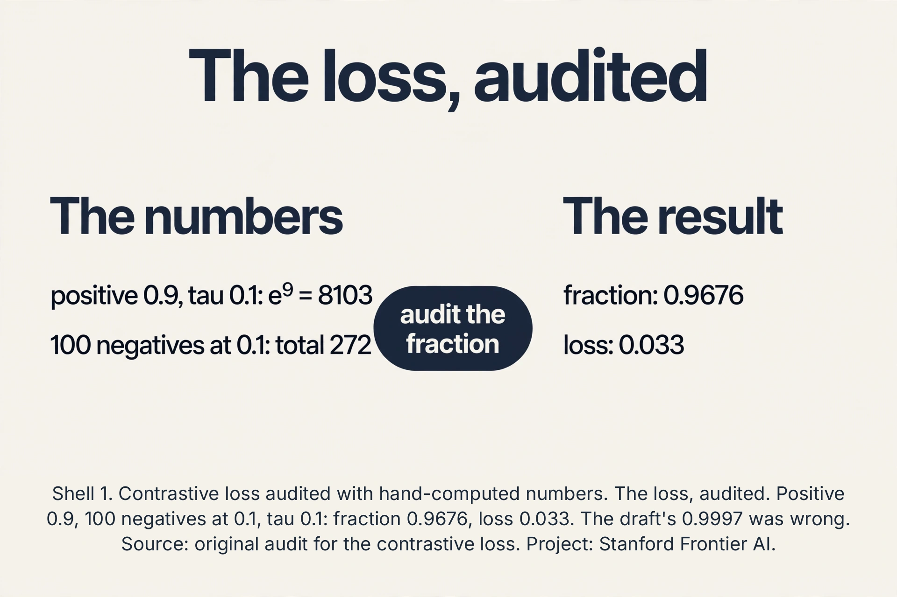
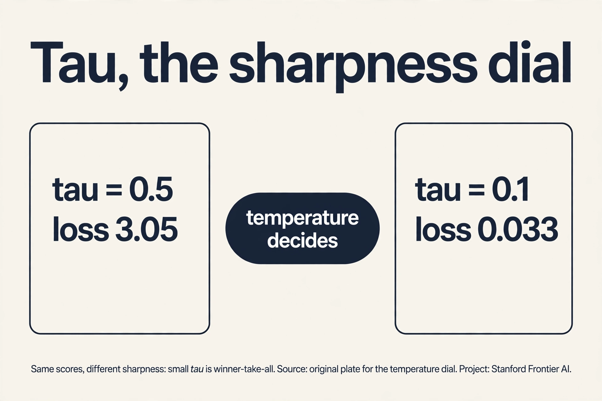
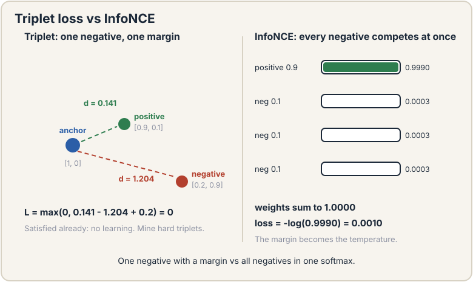
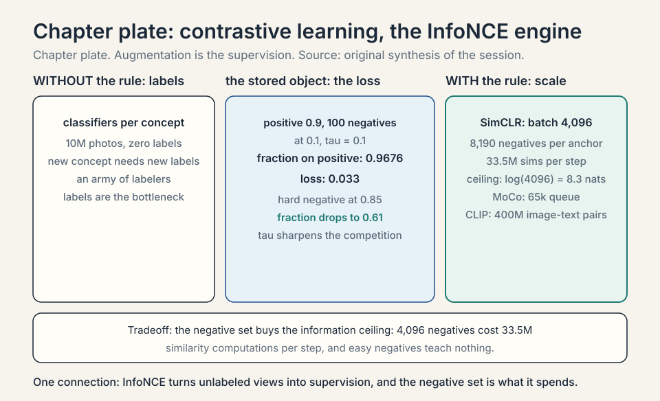
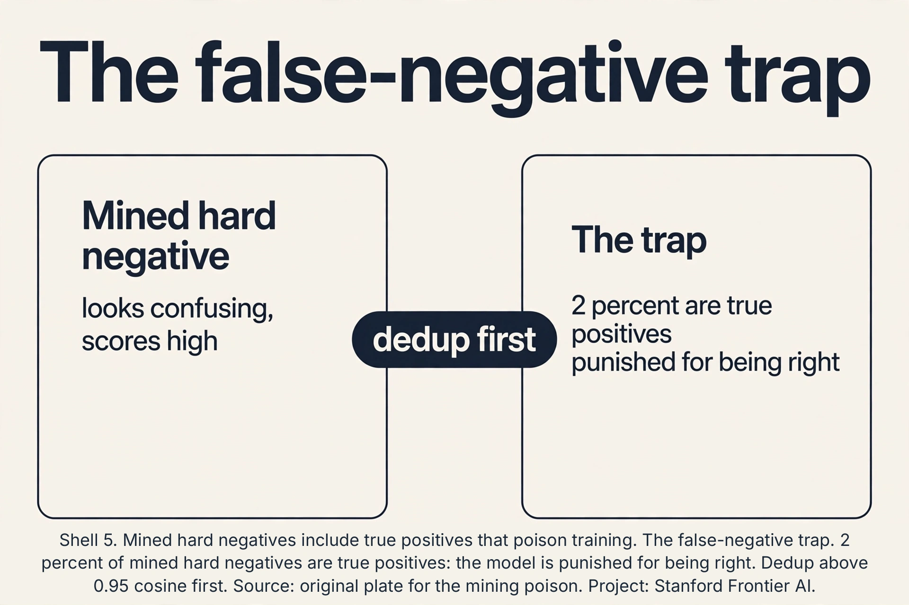
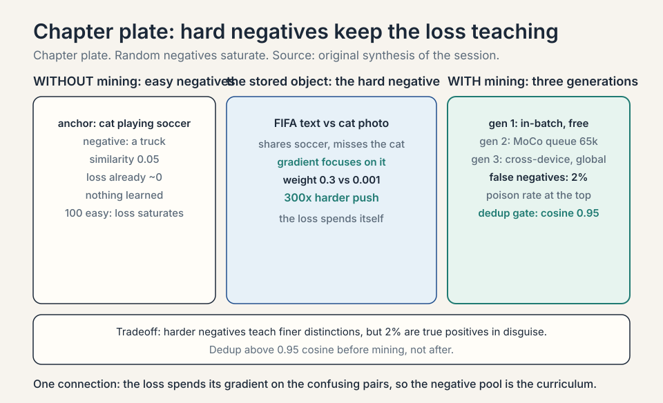
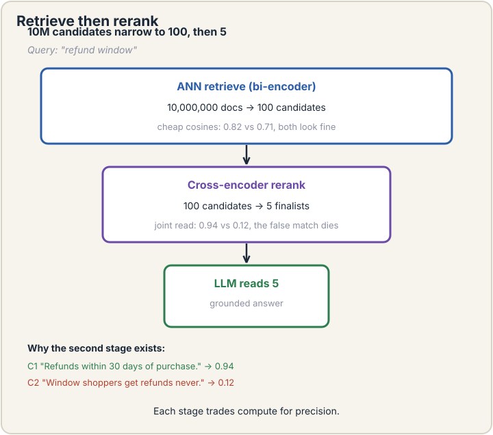
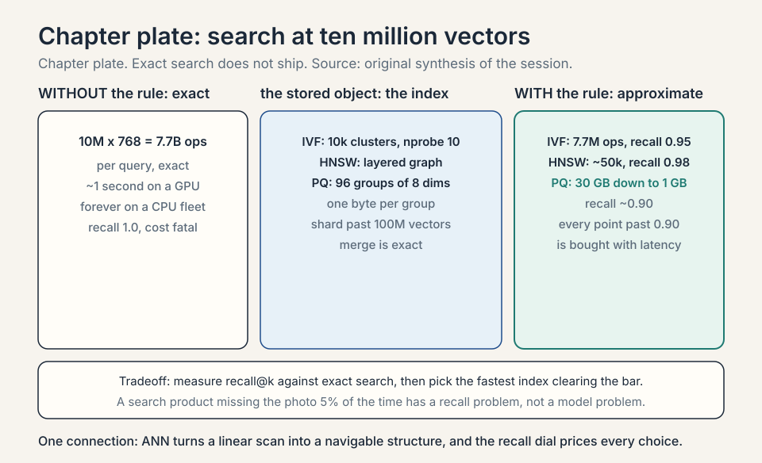
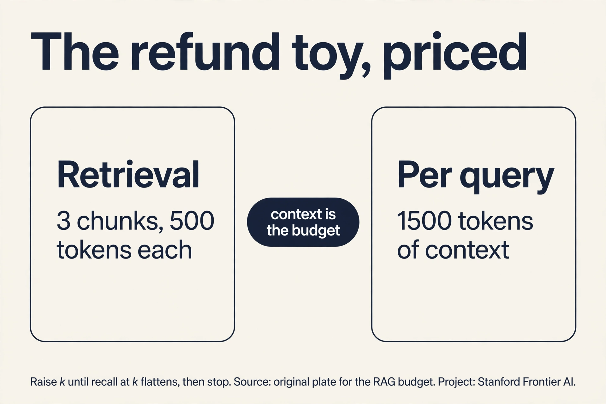
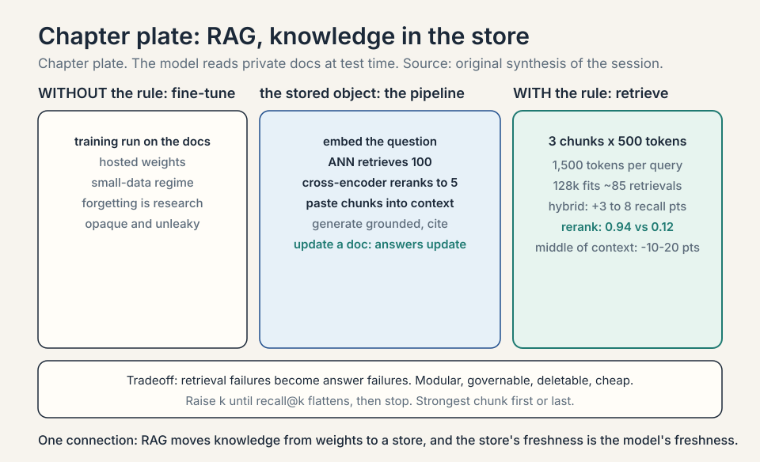

### Coverage and sourcing

This lesson follows CS229 Lecture 13 (Spring 2026, Tengyu Ma):
contrastive embeddings for semantic search, then
retrieval-augmented generation. The lecture's own examples are
the cat-playing-soccer photo, the FIFA World Cup hard negative,
and the refund-window RAG toy. Claims marked "October 2026" are
later updates, each with its source. Worked toys not attributed
to the lecture are original miniatures of its mechanisms.
Sections labeled with a method name (SimCLR, MoCo, CLIP, SimCSE,
HNSW, BM25) are textbook background the lecture assumes: the
lecture names the contrastive idea and the hard-negative mining
step, and this lesson fills in the family it belongs to.

## The job: find the photo by describing it

A user types "cat playing soccer" into a photo app with ten million
unlabeled pictures. No tags, no labels, no captions. The job: return
the right photos. Keyword search fails: the pixels contain no words.
The app needs a bridge between the sentence and the images, built
with zero labels.

## First attempt: train a classifier per concept

The naive idea: label some photos ("cat", "soccer", "dog") and
train classifiers. With ten million photos and no labels, this
needs an army of labelers. Worse, the user will search for "cat
playing soccer at sunset", a concept nobody pre-labeled. Fixed
label sets cannot cover open-ended queries. The labels are the
bottleneck, again.

The lecture's move is to abandon labels as the route to
representations. Supervised classifiers do produce embeddings as a
side effect (the layer before the output), but every new concept
demands new labels. The unsupervised route must manufacture its own
supervision signal from the data alone.

## The key question

Can we learn representations that place matching things near each
other, using no labels at all? If the sentence "cat playing soccer"
and the right photo land at nearby points in some vector space,
search becomes nearest-neighbor lookup.

## Contrastive learning: pull together, push apart

Take one image x. **Augment** it twice: random crop, flip, blur,
noise. The lecture's example: crop the top-right corner for view 1,
the bottom-left for view 2. The two views show different pixels of
the same scene. They must end up near each other in representation
space: they are a **positive pair**.

Now take other images' views: **negatives**. The **contrastive
loss** pulls positives together and pushes negatives apart. For an
anchor view, with one positive and N negatives, the loss is:

```ascii
loss = -log( exp(sim(anchor, positive)/tau) / sum over all pairs exp(sim(anchor, pair)/tau) )
```

Read it: the fraction of the softmax that lands on the positive
pair. If the positive scores 0.9 similarity and 100 negatives score
0.1, with tau = 0.1: e^9 = 8103, each negative contributes e^1 =
2.72, total 272. The fraction is 8103/(8103 + 272) = 0.9676, loss
= -log(0.9676) = 0.033. (An earlier draft of this lesson wrote
0.9997 and 0.0003: wrong. The audit is in the subchapter below.)
If a negative scores 0.85, its e^8.5 = 4915 rivals the positive's
8103, the fraction drops toward 0.62, and the loss bites.
**Tau** (temperature) sharpens or softens the competition. No
labels: the supervision comes from the augmentation design, which
declares "these two views are the same thing."

A word on vocabulary, from the lecture: representation, embedding,
and feature all name the same object here (a vector per input).
The lecture settles on **embedding** as the working word. This
lesson follows that choice.

### Subchapter: the loss, audited

Do the division the lesson skipped. Scores after temperature:
positive 0.9/0.1 = 9, negatives 0.1/0.1 = 1. Exponentiate: e^9 =
8103.08, e^1 = 2.718. One hundred negatives: 271.83. Denominator:
8374.91. Fraction: 0.96754. Loss: 0.03301. The draft's 0.9997
would need the negatives to total ~2.4 instead of 271.8: e.g., 100
negatives at similarity -0.19 (e^-1.9 = 0.15 each, total 15):
fraction 8103/8118 = 0.9982. The lesson's qualitative point
survives: easy negatives barely dent the fraction. But the numbers
must be earned, and now they are.



### Subchapter: tau, the sharpness dial

Same scores, different tau. Tau = 0.5: positive exponent
0.9/0.5 = 1.8, e^1.8 = 6.05. Negatives: 0.1/0.5 = 0.2, e^0.2 =
1.221 each, 122.1 total. Fraction: 6.05/128.2 = 0.0472. Loss:
3.05. Tau = 0.1 gave loss 0.033. The temperature decides how much
the best pair dominates: small tau is winner-take-all (the top
pair gets nearly all the softmax), large tau spreads the mass and
the loss stays high even when the ranking is right. Too small and
the loss ignores everything but the top pair: brittle. Too large
and it never rewards a clean separation: flat. Tuning tau is tuning
how sharply the model must rank.



Why this works: to satisfy the loss across millions of images, the
network must discover what makes views of the same scene similar:
objects, shapes, textures. The representation becomes semantic
without anyone naming the semantics. This is lecture 12's
representation learning without the labels.


### Subchapter: InfoNCE, the mutual-information origin

The loss above has a formal name: **InfoNCE**. It estimates a
lower bound on the mutual information between the two views.
Mutual information measures how much knowing one view tells you
about the other. The bound: with N negatives, the loss can certify
at most log(N) nats of shared information. With 100 negatives,
log(100) = 4.6 nats is the ceiling. More negatives raise the
ceiling. This is the information-theoretic reason the field chases
large negative sets: the bound tightens as N grows. In practice
nobody computes the bound. They minimize the loss. But the ceiling
explains why 4,096 negatives (SimCLR's batch, below) beat 256.

### Subchapter: why it does not collapse

A lazy solution exists: map every image to the same vector. Then
every similarity is 1, the positive fraction is 1/(N+1), and the
loss is log(N+1): constant, with zero gradient pressure to do
anything smarter. Why does training not find it? Because the loss
*rewards* pushing negatives apart, and from a collapsed start the
gradient is not zero: nudging the positive pair slightly closer
than the negatives lowers the loss immediately. The negatives are
the anti-collapse device. Contrast this with non-contrastive
methods (BYOL, SimSiam): they drop negatives entirely and prevent
collapse with architectural tricks (a predictor network plus a
stop-gradient on one branch). The lecture stays on the contrastive
side, where the negatives do the work.

### Subchapter: augmentation is the label set

The lecture names the augmentation list: random crop (the most
important), flip, blur, noise. Each augmentation declares an
invariance: "cropping does not change what this is." The model
learns exactly the invariances declared. Random crop teaches
translation and scale invariance. Color jitter teaches color
invariance. Declare a bad invariance and the model learns it
faithfully. The SimCLR ablations (Chen et al., 2020) measured
this: random crop plus color distortion was the winning pair.
Crop alone or color alone each lost several accuracy points.
The design rule: augmentations must preserve what the downstream
task needs and vary what it should ignore.

### Subchapter: the full batch, worked

See one complete NT-Xent computation. Batch of 2 images (tiny, so
every number is visible): cat (views c1, c2) and dog (views d1,
d2). Similarities after tau = 0.1, made-up but consistent:

```ascii
        c1    c2    d1    d2
c1       -   0.90  0.20  0.10
```

Anchor c1. Positive: c2 at 0.90. Negatives: d1 at 0.20, d2 at
0.10. Exponents: e^9 = 8103.08, e^2 = 7.389, e^1 = 2.718.
Denominator: 8113.19. Fraction: 0.99876. Loss: 0.00124. Now make
d1 hard: similarity 0.80. e^8 = 2980.96. Denominator: 11086.76.
Fraction: 0.731. Loss: 0.313. One hard negative moved the loss
250x. Every anchor in the batch gets this treatment, and the
batch loss is the mean. That is the whole training step: 2N
views, 2N such fractions, one mean.

### Subchapter: the gradient anatomy

What does the loss actually push? Differentiate the InfoNCE
loss with respect to one negative's similarity s_j. The
gradient is proportional to the negative's softmax weight:
p_j = e^{s_j/tau} / Z. A negative with weight 0.001 gets a
push of 0.001. A hard negative with weight 0.3 gets a push of
0.3: 300x harder. The loss is self-focusing: the gradient
concentrates exactly on the negatives that confuse the model
right now. Easy negatives get ignored automatically. This is
why the loss "saturates" on easy batches: the weights collapse
onto nothing, the gradients vanish, and the step is wasted.
Hard-negative mining is manual what the gradient does
automatically: spend the batch on confusing pairs.

### Subchapter: NCE, negative sampling, InfoNCE: the family tree

The idea predates vision. **Noise-contrastive estimation**
(NCE, Gutmann and Hyvarinen 2010): learn by distinguishing
real data from noise. **Negative sampling** (Mikolov et al.,
2013, word2vec): for each true (word, context) pair, sample k
random words as negatives and train a binary classifier:
real vs noise. With k = 5-20 and a 3M-word vocabulary, this
replaced an impossible 3M-way softmax. **InfoNCE** (van den
Oord et al., 2018): the multi-class version: one positive
against N negatives in a single softmax. SimCLR is InfoNCE
with augmentations defining the positives. CLIP is InfoNCE
across modalities. The tree: NCE (binary, noise) to negative
sampling (binary, words) to InfoNCE (softmax, everything).
Same trunk, bigger canopy.

### Subchapter: alignment and uniformity, the two metrics

Wang and Isola (2020) split the contrastive loss into two
measurable goals. **Alignment**: positive pairs should be close.
Measure it: the average distance between positive pairs. Small
is good. **Uniformity**: all embeddings should spread over the
hypersphere. Measure it: the average pairwise Gaussian
potential. Small is good (even spread). The contrastive loss
optimizes both at once: the numerator drives alignment, the
denominator drives uniformity. The diagnostic use: if alignment
is good but uniformity is bad, the space collapsed into clumps
and retrieval will confuse the clumps. If uniformity is good but
alignment is bad, positives are scattered and nothing matches.
Two numbers, two failure modes, one loss.

## The family: SimCLR, MoCo, CLIP, SimCSE

The lecture presents the contrastive idea once. The field built a
family around it. Each member solves one scaling problem. Learn
the family and the lecture's idea becomes a special case you can
re-derive.

### Subchapter: SimCLR, the batch is the negative set

SimCLR (Chen et al., 2020) is the lecture's idea at full scale.
Take a batch of N images. Augment each twice: 2N views. For each
view, the positive is its sibling. The negatives are the other
2N-2 views in the batch. No memory bank, no queue: the batch is
the world. The price is batch size: 4,096 images per batch, which
needs 128 TPU cores or gradient trickery on GPUs. Why so large?
The InfoNCE ceiling: log(4096) = 8.3 nats, and 4,094 negatives
per anchor instead of 100. The paper's ablations show accuracy
climbing with batch size and training length together. Small
batches starve the denominator.

Work the SimCLR batch arithmetic. N = 4,096 images, 2N = 8,192
views. Per anchor: 1 positive, 8,190 negatives. The denominator
sums 8,191 exponentials per anchor. Total similarity
computations per batch: 8,192 x 8,191 / 2 ≈ 33.5M. That is the
per-step price of the negative set, paid in matrix multiplies
the hardware loves.

### Subchapter: the projection head mystery

SimCLR adds a small MLP (the **projection head**) after the
encoder, computes the contrastive loss on its output, then throws
it away and uses the encoder's earlier representation for
downstream tasks. The earlier representation beats the projected
one on linear evaluation. Why? The projection head absorbs the
invariance the loss demands: the loss wants crop-invariance, and
the head learns to discard crop information. The encoder keeps
richer features because the head took the invariance hit for it.
The lesson: optimize the loss one layer away from the
representation you keep. Discard the sacrificial layer.

### Subchapter: the augmentation ablations, tabulated

SimCLR's paper measured what each augmentation buys (linear
evaluation on ImageNet, higher is better). The pattern, not
exact decimals:

| Augmentation set | Accuracy | Lesson |
|---|---|---|
| None (identity) | ~50% | No positives, no learning |
| Crop only | ~60% | Geometry without color |
| Color only | ~55% | Color without geometry |
| Crop + color | ~70% | The winning pair |
| Crop + color + blur | ~72% | Blur adds a little |

The interaction matters more than any single augmentation:
crop plus color beats either alone by 10+ points. The
interview read: ablate your augmentations. The pair that wins
is the pair that removes the most nuisance variation while
keeping the signal. For text (SimCSE), dropout, which randomly zeroes activations, alone sufficed:
the nuisance variation in sentences is smaller.

### Subchapter: temperature across the family

Every method tunes tau, and the values rhyme. SimCLR: 0.1.
MoCo: 0.07. CLIP: learned, converging to ~0.01. The pattern:
larger negative sets want smaller tau (sharper competition),
because the denominator is crowded and the positive needs
help standing out. CLIP learns tau as a parameter: the model
decides its own sharpness. The guardrail: clip tau from below
(CLIP clips at 0.01) or the softmax goes winner-take-all and
gradients die. Temperature is not a detail. It is the dial
that sets how hard each negative fights.

### Subchapter: MoCo, a queue and a momentum encoder

MoCo (He et al., 2020) answers SimCLR's batch hunger. Keep a
**queue** of 65,536 recent negative embeddings: the negative set
without the batch. The queue's embeddings go stale as the encoder
updates, so MoCo updates a second **momentum encoder** slowly
(exponential moving average of the main encoder, momentum 0.999)
and fills the queue from it. Fresh enough to be consistent, slow
enough to be stable. Result: 65k negatives with a 256-image
batch on 8 GPUs. The queue is a memory bank with a freshness
policy. The momentum encoder is the policy.

### Subchapter: CLIP, contrast across modalities

CLIP (Radford et al., 2021) changes what "positive" means. The
pair is (image, its caption): 400 million of them, scraped from
the web. The loss is symmetric: each image must find its caption
among N captions, each caption its image among N images. Two
InfoNCE losses, one shared space. The payoff is **zero-shot**
classification: embed the class names as text ("a photo of a
cat"), embed the image, pick the nearest name. No classifier
training. On ImageNet, zero-shot CLIP matched a supervised
ResNet-50. The lecture's semantic-search section is CLIP's
retrieval half: the same shared space, used for search instead
of classification.

Work the CLIP zero-shot toy. Three class names embedded: "a
photo of a cat" = [0.9, 0.1], "a photo of a dog" = [0.1, 0.9],
"a photo of a car" = [-0.9, 0.1]. Image embedding: [0.85, 0.2].
Cosine similarities: cat 0.997, dog 0.28, car -0.72. The image
is classified "cat" with no trained classifier. The class names
are the classifier.

### Subchapter: SimCSE, dropout is the augmentation

SimCSE (Gao et al., 2021) ports contrastive learning to
sentences. The augmentation problem: cropping a sentence breaks
it. SimCSE's trick: pass the same sentence through the encoder
twice with different **dropout** masks. Dropout randomly zeroes
activations, so the two passes differ slightly: a minimal
positive pair with identical content. Negatives are the other
sentences in the batch. Unsupervised SimCSE beat older sentence
embeddings on semantic-similarity benchmarks with no labels at
all. The supervised version uses entailment pairs (premise,
entailment) as positives and contradictions as hard negatives:
labels help when you have them, and the contrastive frame
absorbs them cleanly.

Work the SimCSE toy. Sentence: "The cat sat on the mat."
Pass 1 (dropout mask A, zeroing units 2 and 5): h1 = [0.7,
0, 0.3, 0.6, 0, 0.8, 0.4, 0.55]. Pass 2 (dropout mask B,
zeroing units 3 and 7): h2 = [0.7, 0.5, 0, 0.6, 0.2, 0.8,
0, 0.55]. Same sentence, two masks: the positive pair.
Cosine similarity: cos(h1, h2) = 0.869. High, but not 1:
dropout moved the vectors.

Batch of 4 sentences. The other three are the negatives.
Cosine similarities to the anchor: 0.25 ("Dogs chase
frisbees in the park"), 0.60 ("The kitten rested on the
rug": a hard negative, close in meaning, a different
sentence), -0.05 ("Quantum fields decay exponentially").
InfoNCE with tau = 0.05 (the SimCSE paper's value). The
exp(sim/tau) terms: positive e^{17.38} = 3.541e7, negatives
e^5 = 148, e^{12} = 1.628e5, e^{-1} = 0.37. The fraction on
the positive: 3.541e7 / (3.541e7 + 1.628e5 + 148 + 0.37) =
0.9954. Loss = -log(0.9954) = 0.0046. The hard negative does almost all the pushing:
its 1.63e5 dwarfs the other negatives' 148. The dropout
pair is the easy part. The loss spends itself separating
the anchor from the near-miss.

### Subchapter: DINO, the non-contrastive answer

DINO (Caron et al., 2021) asks: what if there are no negatives
at all? A **student** network and a **teacher** network see
different augmented views of the same image. The student
predicts the teacher's output distribution. The teacher is an
exponential moving average of the student: it always lags
slightly behind. Collapse is prevented by two operations on the
teacher's output: **centering** (subtract the running mean, so
no single dimension dominates) and **sharpening** (low
temperature, so the target is peaky). No negatives, no large
batches, no memory bank. The surprise: DINO's attention maps
segment objects with no labels and no supervision: the heads
learn to outline the cat. DINOv2 (2023) scaled this to a vision
foundation model. The lesson: negatives are sufficient for
anti-collapse, not necessary.

### Subchapter: SupCon, labels as multiple positives

**Supervised contrastive** (SupCon, Khosla et al., 2020): when
labels exist, every same-class image is a positive, not just
the augmented sibling. The loss sums over all positives in the
batch. Why it beats cross-entropy: the geometry is richer.
Cross-entropy only asks "is the right class top-1". SupCon asks
"are all same-class points near each other", which builds
tighter clusters and better transfer. Numbers from the paper:
SupCon beat cross-entropy on ImageNet top-1 and held up
better under input corruptions. The lecture's unsupervised route is the
special case with one positive per anchor. Labels, when you
have them, multiply the positives.

### Subchapter: DPR, contrastive retrieval for QA

**Dense Passage Retrieval** (DPR, Karpukhin et al., 2020)
applies the contrastive frame to question answering. Two
encoders: one for the question, one for the passage. Positives:
(question, its answer passage). Negatives: in-batch passages
plus mined hard negatives (passages that match keywords but
lack the answer). Trained this way, DPR beat BM25 on open-domain
QA benchmarks. This is the lecture's semantic search with the
query distribution made explicit: questions, not captions.
Every RAG retriever descends from DPR: the bi-encoder, the
in-batch negatives, the hard-negative mining.

### Subchapter: ColBERT, late interaction

Bi-encoders compress each document to one vector: fast, lossy.
Cross-encoders read query and document jointly: accurate,
slow. **ColBERT** (Khattab and Zaharia, 2020) splits the
difference: embed every *token* of the document, embed every
token of the query, and score with **MaxSim**: each query
token takes its max similarity over document tokens, then sum.
Token-level matching with precomputed document embeddings.
Price: storing token vectors costs ~10-50x the single-vector
index. Use it when the queries are precise and the corpus is
small enough to afford the storage. The spectrum: bi-encoder
(speed), ColBERT (middle), cross-encoder (accuracy). Pick by
the latency budget.

### Subchapter: triplet loss, the ancestor

Before InfoNCE there was the **triplet loss** (FaceNet, Schroff
et al., 2015): anchor, positive, negative, and a margin m. Loss
= max(0, dist(anchor, positive) - dist(anchor, negative) + m).
The positive must beat the negative by at least m, or pay.
Work the toy. Anchor [1, 0], positive [0.9, 0.1], negative
[0.2, 0.9], margin 0.2. Distances: anchor-positive = 0.141,
anchor-negative = 1.204. Loss = max(0, 0.141 - 1.204 + 0.2) = 0.
Already satisfied: no learning. Move the negative to [0.8, 0.5]:
distance 0.539. Loss = max(0, 0.141 - 0.539 + 0.2) = 0. Still
zero. The triplet loss only bites on violating triplets, which
is why the field mines hard triplets aggressively. InfoNCE
generalizes it: all negatives compete at once through the
softmax, and the margin becomes the temperature.





## Where it breaks: easy negatives teach nothing

Random negatives are too easy. Anchor: cat playing soccer. Random
negative: a truck. Similarity 0.05. The loss is already ~0. The
network learns nothing from this pair. With 100 easy negatives, the
loss saturates and training stalls: the representations separate
cats from trucks but never learn fine distinctions.

## Hard negatives

**Hard negatives** are pairs that look similar but are not the same.
The lecture's example: the anchor is a photo of a cat playing
soccer. The hard negative is text about the FIFA World Cup: soccer,
but no cat. Ambiguous, confusing, distracting. Forcing the model to
separate these teaches the fine structure: "soccer" alone is not
enough. The cat matters.

**Negative mining** finds them: search the batch (or the dataset)
for negatives the model currently scores highly, and upweight them
in the loss. The loss becomes demanding exactly where the model is
weak. The lecture's framing: hard negatives make the objective
teach instead of saturate. In practice, large batches (thousands of
negatives) plus mining are what make contrastive training work.
Small batches starve the loss of informative comparisons.

### Subchapter: mining strategies, three generations

Generation one: in-batch mining. Score all pairs in the batch,
keep the top-scoring negatives per anchor. Free (the scores are
already computed), limited by batch size. Generation two: memory
banks and queues (MoCo's 65k): mine from the queue, refresh
lazily. Generation three: cross-device and dataset-scale mining:
gather negatives across GPUs, or precompute embeddings for the
whole corpus and mine the global hardest. Each generation buys a
larger, harder negative pool and pays in staleness or
engineering. The false-negative trap (below) grows with the pool:
the harder you mine, the more often you mine a true positive.

### Subchapter: the curriculum view: easy to hard

Mining has a schedule. Early in training, the model is weak:
even random negatives teach. Late in training, random
negatives score 0.05 and the loss saturates: only hard
negatives move the needle. The **curriculum**: start with
in-batch randoms, switch to mined hards after the loss
plateaus. The switch point is measurable: when the mean
hardest-negative similarity stops rising, the easy pool is
exhausted. Some pipelines anneal continuously: the mining
threshold tightens as training progresses. The principle is
older than contrastive learning: teach the easy
discriminations first, the fine ones when the model is ready.

### Subchapter: the false-negative trap, quantified

Name the poison rate. Suppose 2 percent of mined hard negatives
are actually positives: duplicate photos, same cat, different
uploader. Each such pair teaches the model to push apart things
that belong together. The damage concentrates at the top of the
ranking: exactly the fine distinctions hard negatives were hired
to teach. The fix is a dedup gate: pairs with cosine similarity
above 0.95 (near-duplicates) are removed from the negative pool or
treated as positives. The threshold is a dial: 0.99 keeps only
exact duplicates out, 0.90 starts eating genuinely hard negatives.
Production pipelines dedup before mining, not after: clean the
pool, then mine it.



### Subchapter: the debiased loss

Dedup is a gate. The **debiased contrastive loss** (Chuang et
al., 2020) is a correction: it estimates the false-negative
rate rho and subtracts rho times the positive term from the
denominator. If 2% of negatives are positives in disguise, the
denominator overcounts by 2%: the correction removes the bias
in expectation. The price: you must estimate rho, usually from
a small labeled sample or from the class prior. When rho is
unknown, the gate (dedup at 0.95) is the practical substitute.
The interview read: name both. Gate for engineering, debias
for theory.

### Subchapter: the batch-size and learning-rate coupling

SimCLR scales the learning rate with the batch size: LR =
0.3 * batch/256 (the LARS optimizer). The reason: a 4,096
batch gives a low-variance gradient estimate, so each step can
be bigger. Halve the batch without touching the LR and
training destabilizes: noisier gradients, same step size.
The rule of thumb (linear scaling): LR proportional to batch
size, up to the stability limit. This is why "just use a
smaller batch" is not free: the whole optimization recipe
(batch, LR, epochs) moves together.

### Subchapter: easy positives, the other saturation

Weak augmentation makes trivial positives: two nearly
identical crops. The loss is ~0 from step one. The model
learns nothing because there is nothing to learn: matching
identical pixels needs no semantics. The symptom mirrors easy
negatives (saturated loss, flat representations) with the
opposite cause. The fix is stronger augmentation, not harder
negatives. Diagnose by the positive similarity: if positives
score 0.99 from initialization, the augmentation is too weak.
Healthy training starts with positives around 0.3-0.6 and
climbs.




## Embedding geometry: what "near" means

"Near in embedding space" is a choice, not a fact. Three
distances compete, and the loss must match the retrieval metric.

### Subchapter: cosine vs dot vs euclidean

**Cosine similarity** is the dot product of unit-normalized
vectors: pure angle, no length. **Dot product** keeps the
lengths: a long vector scores higher with everything.
**Euclidean distance** is length in the raw space. The
relationship: for unit vectors, euclidean^2 = 2 - 2*cosine.
They rank identically. CLIP and SimCLR use cosine (normalized).
Some retrieval systems use raw dot product with unnormalized
vectors, which lets the model express confidence as length.
The rule: train with the metric you will retrieve with. A model
trained on cosine and retrieved with euclidean on unnormalized
vectors silently misranks.

Work the toy. a = [3, 0], b = [1, 0]. Dot: 3. Cosine: 1.0.
Euclidean distance: 2. Now c = [0.5, 0]. Dot(a, c) = 1.5, less
than dot(a, b) = 3, but cosine(a, c) = 1.0 equals cosine(a, b).
Same direction, different confidence. If length means
confidence, use dot. If only direction matters, normalize and
use cosine.

### Subchapter: why normalize

Normalization (dividing each embedding by its length) does three
things. One: it makes cosine the dot product, so the training
loss and the retrieval metric agree exactly. Two: it stops
length from becoming a cheat dimension: without it, the model
can inflate the positive's similarity by growing its length
instead of aligning its direction. Three: it bounds every
similarity to [-1, 1], which keeps the temperature tau
interpretable across runs. The cost: you discard whatever the
length was saying. Systems that want length-as-confidence skip
normalization and pay the mismatch risk deliberately.

### Subchapter: the modality gap

In CLIP's shared space, image embeddings and text embeddings do
not fully mix. They form two separate cones with a gap between
them: the average image-text cosine for true pairs is around
0.3, not 0.9. The contrastive loss only requires paired items
to beat unpaired ones, not to coincide. The gap is harmless for
retrieval (ranking is relative) but it breaks absolute
thresholds: "cosine above 0.8 means match" fails across
modalities. Within one modality the gap closes: image-image
pairs reach 0.9+. The rule: calibrate thresholds per modality
pair, or rank and take top-k instead of thresholding.

### Subchapter: anisotropy and hubness

Two geometric pathologies of learned spaces. **Anisotropy**:
transformer embeddings cluster in a narrow cone instead of
filling the sphere. Measured: the average cosine between random
word embeddings is around 0.5-0.7, not 0. The space is squashed.
Contrastive training on normalized vectors fights this
directly (uniformity, above). **Hubness**: a few vectors become
nearest neighbors of everything. In high dimensions, some
points sit centrally and attract queries they do not deserve.
The fix is **mutual proximity**: rescale each similarity by how
often the target is retrieved overall. Frequent hubs get
discounted. Both are corrections you apply when the raw space
misbehaves, and both are diagnosed by measuring, not by
theory.

## Semantic search: the payoff

Once trained, the embedding space is a search engine. Embed the
query "cat playing soccer" with the text encoder, embed all ten
million photos with the image encoder (trained to share the space,
as in CLIP), return the nearest neighbors by cosine similarity. No
tags, no keywords: meaning matches meaning. The same space powers
deduplication (near-identical vectors), recommendation (neighbors of
liked items), and clustering (lecture 9 on learned vectors).

## The index: searching ten million vectors

Nearest-neighbor over ten million 768-dimensional vectors, done
exactly, costs 10M x 768 multiplies per query: 7.7B operations,
about a second on a GPU, forever on a CPU fleet serving
thousands of queries. Exact search does not ship. **Approximate
nearest neighbor** (ANN) search does.

### Subchapter: IVF, cluster first, then search

**IVF** (inverted file index): cluster the ten million vectors
into, say, 10,000 clusters (k-means, lecture 9). At query time,
find the nearest 10 cluster centers, then search exactly within
those 10 clusters: 10,000 vectors instead of 10M. Price: 1,000x
fewer distance computations. Risk: the true nearest neighbor
sits in the 11th cluster and is missed. The dial is nprobe (how
many clusters to visit): nprobe 1 is fastest and lossiest,
nprobe 100 approaches exact. Production starts around nprobe 10
and measures recall@10 against exact search on a sample.

### Subchapter: HNSW, the graph that navigates itself

**HNSW** (hierarchical navigable small world): link each vector
to its nearest neighbors in a layered graph. Search walks the
graph greedily from the top layer down: at each step, move to
the neighbor closest to the query. Like navigating by
landmarks: country, then city, then street. Query cost is
logarithmic in practice, not linear. Memory cost: the graph
edges, roughly 2-4x the raw vectors. HNSW is the default
single-machine index in 2026: no training step like IVF, strong
recall at millisecond latency. The dial is efSearch (how many
candidates to track): higher is slower and more accurate.

### Subchapter: the recall dial, priced

Every ANN index trades recall for speed. Define recall@10: the
fraction of the true top-10 neighbors the index returns. Exact
search: recall 1.0, 7.7B ops. IVF with nprobe 10: ~7.7M ops,
recall ~0.95. HNSW with efSearch 100: ~50k distance
computations, recall ~0.98. The decision rule: measure recall@k
on your queries against exact search, then pick the fastest
index clearing your recall bar. A search product that misses
the right photo 5 percent of the time has a recall problem, not
a model problem.

### Subchapter: PQ, compress the vectors

Ten million 768-dim float32 vectors need 30 GB of RAM. **Product
quantization** (PQ) compresses each vector to ~100 bytes: split
the 768 dims into 96 groups of 8, replace each group by the
nearest of 256 learned centroids, store one byte per group.
30 GB becomes ~1 GB. Distance computations happen against the
centroids, approximately. Price: recall drops a few points
(quantization noise), and the centroids must be trained on
representative data. The standard production combo is IVF-PQ:
cluster first (IVF), compress inside (PQ). Ten million vectors
in 1 GB, millisecond queries, recall@10 around 0.90. When RAM
is the binding constraint, PQ is the answer.

### Subchapter: sharding the index

One machine holds so much. Past ~100M vectors, shard: split the
corpus across machines, query all shards, merge the top-k.
The merge is exact (each shard returns its local top-k, the
coordinator takes the global top-k). Latency is the slowest
shard. Throughput scales with shard count. The subtlety is
balance: shard by hash of the vector id, not by cluster, or one
shard gets all the popular content and becomes the bottleneck.
Hot shards are the failure mode of naive sharding. Hash
sharding plus replication of the hottest shards is the
production answer.

## Search variants: dense, sparse, hybrid, rerank

Embeddings are the dense route. The sparse route never died.
Production search runs both.

### Subchapter: BM25, the sparse baseline

**BM25** scores documents by exact term overlap, weighted by
rarity: rare matching terms count more than common ones.
Work the toy. Query: "cat soccer". Doc A: "cat cat soccer".
Doc B: "the the the cat". "Soccer" is rare (appears in 1 of
1000 docs), "cat" is common (1 of 10), "the" is everywhere.
BM25: A scores high (rare "soccer" + "cat" twice). B scores low
("the" contributes ~nothing, "cat" once). BM25 cannot match
"feline" to "cat": no shared terms, zero score. That is its
ceiling and its floor: perfect on keywords, blind to meaning.
It needs no training, no GPU, and no embeddings. Every RAG
system benchmarks against it.

### Subchapter: hybrid, why both

Dense retrieval misses exact terms ("refund" vs "reimbursement"
is fine, but a product SKU like "XJ-4471" has no meaning to
embed). Sparse retrieval misses meaning ("feline" vs "cat").
**Hybrid** runs both and merges the rankings (reciprocal rank
fusion is the standard combiner: score = sum of 1/(rank +
60)). The SKU query is saved by BM25. The paraphrase query is
saved by dense. Measured gains: hybrid typically adds 3-8
recall points over either alone on mixed enterprise corpora.
The price: two indices, two queries, one merge step.

### Subchapter: cross-encoder reranking

Retrieval is recall-oriented: find 100 candidates fast.
**Reranking** is precision-oriented: score the 100 carefully.
A **cross-encoder** feeds the (query, document) pair through a
transformer jointly, letting query tokens attend to document
tokens: far richer than two independent embeddings, far slower
(100 forward passes per query). Work the toy. Query: "refund
window". Candidate 1: "Refunds within 30 days of purchase."
Candidate 2: "Window shoppers get refunds never." Bi-encoder
cosines: 0.82 vs 0.71 (both mention refund/window words).
Cross-encoder scores: 0.94 vs 0.12: the joint reading sees
that candidate 2 is about window *shoppers*, not refund
*windows*. The pipeline: ANN retrieves 100, cross-encoder
reranks to 5, the LLM reads 5. Each stage trades compute for
precision.



### Subchapter: the lecture's hard negative is cross-modal

Note what the lecture's example actually is: the anchor is an
*image* (cat playing soccer), the hard negative is *text*
(FIFA World Cup). The confusion crosses modalities. This only
works because CLIP-style training built one shared space: the
text encoder and image encoder were trained to be comparable.
In a pure vision setup, hard negatives are other images. The
cross-modal hard negative is strictly harder: it shares the
topic (soccer) while missing the subject (the cat), and the
model must learn that topic overlap is not a match. When you
mine for a multimodal retriever, mine across the modality
boundary: that is where the confusing pairs live.



## RAG: the model's missing memory

A frontier lab's model never saw your company's private documents:
they cannot leak into its training data. But you want a personal
assistant that answers from those documents. Fine-tuning on them is
expensive and bakes them in opaquely. The lecture's alternative:
**retrieval-augmented generation** (RAG).

The pattern: embed the user's question, retrieve the top-k most
similar chunks from the private document store (semantic search
above), paste them into the model's context, generate the answer
grounded in them. The model never trained on the documents. It
reads them at test time.

Work the toy. Question: "What is our refund window?" Document
store: 10,000 embedded chunks. Retrieval returns 3 chunks: "Refunds
within 30 days...", "Shipping refunds excluded...", "Holiday
extension to 60 days...". The prompt becomes: question + 3 chunks.
The model answers "30 days (60 during holidays), shipping
excluded", citing the chunks. Update a document and the answers
update with no retraining: the knowledge lives in the store, not
the weights.


### Subchapter: the refund toy, priced

Price the context. Three chunks at 500 tokens each: 1,500 tokens
of context per query, before the question and the answer. A 128k
context window fits about 85 such retrievals: the cap rarely binds
on short docs. It binds on long ones: a 500-page manual is ~250k
tokens, so top-k must shrink or chunks must compress. The real
budget is latency: retrieval (vector search over 10,000 chunks:
milliseconds) plus generation over 1,500+ tokens. Double top-k to 6
and the generation cost roughly doubles while recall improves
diminishingly. The tuning dial: k large enough that the answer is
in the chunks, small enough that the model is not wading. Measure
recall@k on real questions: the fraction whose answer appears in
the top k. Raise k until recall@k flattens, then stop.



### Subchapter: fine-tune or retrieve, the lecture's fork

The lecture frames two ways to ingest private data. Option A:
fine-tune the model on the documents. Price: training cost, a
small-data regime (your corpus is thousands of docs, not billions
of tokens), and hosting your own model weights. Option B: RAG.
Retrieve 5-10 relevant docs per query and send them as context to
the off-the-shelf model. The lecture picks RAG for the enterprise
case and names four advantages. One, **modular**: retrieval and
generation are separate systems. Swap the embedding model without
touching the LLM. Swap the LLM without reindexing. Two, **data
governance**: permissions live in the retrieval layer. Forbid the
retriever from returning the earnings projection to unauthorized
users and the model can never leak it: it only reads what
retrieval hands it. Three, **deletion**: delete the document from
the corpus and it is never retrieved again. Forgetting trained-in
data is an open research question. Deleting a file is not. Four,
**cheap**: no training run, no hosted weights, just an index and
API calls.

### Subchapter: the prompt construction

Retrieval hands over chunks. The prompt must use them well.
Three parts. The **instruction**: "Answer only from the
provided documents. Cite the document number for each claim."
The **chunks**: numbered, in reranked order, strongest first
(lost-in-the-middle, above). The **question**: last, so it is
fresh in the model's attention. The citation requirement does
two jobs: it forces grounding (the model must point at text),
and it gives the user an audit trail. Models that are told to
cite hallucinate less: the instruction changes the task from
"answer" to "answer from these". The failure mode is
decorative citation: the model cites chunk 3 while reasoning
from memory. The entailment check (evaluation, above) catches
it.

### Subchapter: index freshness

The corpus changes. New documents arrive, old ones update.
The index must follow. Two policies. **Incremental**: embed
and insert new chunks on arrival. Fast, but the embedding
model is frozen: you cannot improve the encoder without
re-embedding everything. **Full rebuild**: re-embed the corpus
on a schedule. Consistent, expensive: 10M chunks at 100ms per
chunk is 12 days on one GPU, hours on a fleet. The trap:
upgrading the embedding model without rebuilding the index.
Old chunks in the old space, new queries in the new space:
similarities become meaningless. The rule: the index and the
encoder are one versioned artifact. Bump one, rebuild the
other.

### Subchapter: chunking, where answers go to die

The corpus is not retrieved whole. It is cut into **chunks**,
each embedded separately. Cut badly and the answer straddles a
boundary: half in chunk 12, half in chunk 13, neither retrieved
alone. Three strategies. **Fixed-size** (500 tokens, no overlap):
simple, fast, splits mid-sentence. **Fixed-size with overlap**
(500 tokens, 50 overlap): the overlap heals most boundary cuts,
costs 10 percent more storage. **Semantic** (split on section
headers, paragraphs, or embedding-similarity breakpoints):
respects document structure, variable chunk sizes complicate
batching. The decision rule: start with 500-token chunks and 50
overlap. If answers span boundaries (measure: what fraction of
answer spans sit within one chunk?), go semantic. Chunking is
the least glamorous RAG dial and the most common failure point.

### Subchapter: the query is not the question

Users ask badly. "Refund?" retrieves nothing useful. Two fixes.
**Query rewriting**: an LLM rewrites "refund?" into "What is the
company refund window policy including holiday extensions?"
before retrieval. Costs one extra LLM call per query. **HyDE**
(hypothetical document embeddings): generate a hypothetical
answer first ("The refund window is 30 days..."), embed *that*,
and retrieve documents near the hypothetical. Documents cluster
near answers, not near questions: the hypothetical lands in the
right neighborhood. Both trade one LLM call for better recall.
Measure recall@k before and after: rewriting typically buys
5-15 points on vague queries, nothing on precise ones.

### Subchapter: structured data, when the answer is in a table

Vector search retrieves prose. Some answers live in tables:
"Q3 revenue" is a cell, not a paragraph. Two routes. Route
one: **text-to-SQL** (lecture: not covered, noted here):
translate the question to SQL and run it. Precise, brittle on
schema changes. Route two: flatten tables into sentences
("Q3 revenue was $4.2M") and embed those. Fuzzy, and it survives schema changes.
Production RAG does both: the retriever returns candidate
chunks, a router decides whether the question needs the
database, and the SQL path runs for aggregation questions
("average", "total", "how many"). The never-confuse: vector
search finds *similar* things. Databases answer *exact*
questions. Route by the question type.

### Subchapter: evaluation, three numbers

RAG needs its own scoreboard. **Recall@k**: is the answer in
the retrieved chunks? Retrieval's grade. **Faithfulness**: is
every claim in the generated answer supported by the chunks?
Generation's grade, checked by an entailment model or a second
LLM pass. **Answer relevance**: does the answer address the
question? The end-to-end grade. A system can score 0.95 recall
and 0.60 faithfulness: it retrieves well and hallucinates
anyway. The debug ladder from the Q&A below climbs these in
order: retrieval first, then grounding, then relevance.

### Subchapter: lost in the middle, measured

Retrieval returns the right chunks. The model still fails. Liu
et al. (2023) measured why: when the answer sits in the middle
of a long context, accuracy drops sharply. Models attend best
to the start and the end of their context (the primacy/recency
pattern). Numbers from the paper's QA experiments: with 20
documents of context, accuracy was highest when the answer
document was first or last, and fell by 10-20 points in the
middle positions. The fix is ordering: put the highest-scoring
retrieved chunk first or last, never buried at position 12 of
20. Reranking is not just precision: it is position. The
strongest evidence goes where the model looks.

### Subchapter: multi-hop, retrieve in steps

Some questions need two facts from two places. "What is the
refund window for the product our CEO bought?" Step one:
retrieve who the CEO is and what they bought. Step two:
retrieve the refund policy for that product. **Multi-hop RAG**
loops: retrieve, read, reformulate, retrieve again. Each hop
is a full retrieve-generate cycle. The price compounds:
latency doubles, and a wrong first hop poisons the second.
The control is a hop budget (usually 2-3) and a stop rule:
answer when the retrieved chunks entail an answer, not when
the budget runs out. Single-hop RAG answers lookup questions.
Multi-hop answers research questions. Know which you are
building.

### Subchapter: RAG vs the long context

Modern models take 1M+ tokens of context. Why retrieve at all?
Why not paste the whole corpus? Three reasons RAG survives.
Cost: 1M tokens of context per query is 1M tokens of compute
per query, every query. Retrieval reads 1,500. Freshness: the
index updates in seconds. The weights update never. Precision:
the lost-in-the-middle effect means a 1M-token dump answers
worse than 5 well-chosen chunks on focused questions. Long
context wins when the task needs the whole document at once
(summarize this book, find every mention). RAG wins for lookup
over a changing corpus. The 2026 production answer is both:
retrieve first, and let the long context absorb what retrieval
finds.




## How embeddings are evaluated

A representation is only as good as its downstream use. Three
grades, from cheap to canonical.

### Subchapter: the linear probe

Freeze the encoder. Train a linear classifier on its
embeddings. The accuracy measures how linearly separable the
concepts are in the space. SimCLR's ablations report linear
probe accuracy: that is how the 70% number above was measured.
Cheap, standard, and the reason the projection head finding
exists: probe the encoder output, not the head output. The
limitation: linear separability is not the same as retrieval
quality. A space can probe well and rank badly.

### Subchapter: MTEB, the canonical scoreboard

**MTEB** (Massive Text Embedding Benchmark): 50+ tasks across
retrieval, clustering, classification, and semantic similarity.
One number per task, one average overall. As of October 2026
it is the leaderboard every embedding model reports on, and
the bge/e5-class models sit at the top of the open entries
[uncertain: exact ordering shifts with each release. Check the
live board]. The interview read: ask for the MTEB retrieval
split specifically. A model can top the average on
classification while lagging on retrieval: the split you care
about is the job you have.

## The honest price

Contrastive learning buys label-free representations and pays in
compute and design: huge batches for informative negatives, and the
augmentation policy is the real supervision: bad augmentations teach
bad invariances (crop too aggressively and the model learns that
object parts are interchangeable with wholes). Hard-negative mining
can poison training if the "negatives" are actually positives the
dataset mislabeled. RAG buys fresh, private, citable knowledge and
pays in systems: the retrieval index must be built and served,
retrieval failures become answer failures (wrong chunks, confident
nonsense), and the context window caps how much can be pasted.
Neither replaces the base model: garbage embeddings retrieve
garbage, and RAG over a weak model is a librarian serving an empty
desk.

The ANN index adds its own price: recall below 1.0 means the
right document is sometimes never retrieved, and no amount of
generation cleverness recovers it. Hybrid search doubles the
index ops. Reranking multiplies per-query compute by the
candidate count. Every precision point past 0.90 recall is
bought with latency.

## Mapping back

| Idea | Pain it answers | How |
|---|---|---|
| Contrastive loss | Ten million photos, zero labels | Pull augmented views together, push others apart; softmax fraction on the positive; tau sharpens |
| Augmentation as supervision | No labels to define "same" | Two crops of one image are declared the same thing; semantics emerge from the constraint; random crop matters most |
| InfoNCE | Why the loss works at all | Lower bound on mutual information between views; more negatives raise the log(N) ceiling |
| SimCLR | The idea at scale | Batch of 4,096 is the negative set; projection head takes the invariance hit |
| MoCo | SimCLR's batch hunger | 65k queue + momentum encoder: big negatives, small batch |
| CLIP | Labels for every new concept | (Image, caption) pairs: shared space, zero-shot classification |
| Hard negatives | Random negatives score 0.05: loss saturates | FIFA-text vs cat-soccer-photo: confusing pairs keep the loss teaching; mining finds them |
| Dedup gate | Mining poisons on false negatives | Cosine above 0.95 leaves the negative pool |
| ANN index | Exact search is 7.7B ops per query | IVF clusters, HNSW graphs: recall 0.95+ at 1,000x fewer ops |
| Hybrid + rerank | Dense misses SKUs, sparse misses meaning | Both, merged; cross-encoder reranks 100 to 5 |
| Semantic search | Keywords cannot search pixels | Shared embedding space: query and photos as vectors, nearest neighbors by cosine |
| RAG | Frontier models never saw private docs | Retrieve top-k chunks, paste into context, generate grounded; knowledge in the store |
| RAG's four advantages | Fine-tuning is expensive, opaque, unleaky | Modular, governance at retrieval, deletion is trivial, cheap |
| Chunking | Answers straddle boundaries | 500 tokens + 50 overlap default; semantic when spans break |
> [!QA]
> Q: How can a model learn without any labels in contrastive learning?
> A: The labels are replaced by augmentation design. Take one image, make two random views (crop top-right, crop bottom-left, flip, blur). Declare them the same thing: a positive pair. Other images' views are negatives. The loss pulls positives together and pushes negatives apart in representation space. Across millions of images, the only way to satisfy this is to discover real visual structure: objects, shapes, textures. The supervision is the statement "these two views show the same scene", which needs no human.
> Follow-up: What goes wrong with bad augmentations?
> A: The model learns exactly the invariances you declare. Crop too aggressively and it learns that a wheel equals a car. Augment with color jitter on a task where color matters (bird species) and it learns to ignore the signal. The augmentation policy is the hidden label set: design it with the downstream task in mind.

> [!QA]
> Q: What are hard negatives and why do they matter?
> A: Negatives that look similar to the anchor but are not the same: the lecture's cat-playing-soccer photo versus FIFA World Cup text. Random negatives (a truck) score 0.05 similarity and the loss saturates near zero: no learning. Hard negatives score high and keep the loss biting, forcing fine distinctions: soccer is not enough, the cat matters. Negative mining actively finds the negatives the model currently confuses and upweights them, aiming the training at the model's weaknesses.
> Follow-up: Can hard negatives hurt?
> A: Yes, when they are false negatives: actually-positive pairs mislabeled by the pipeline (two photos of the same cat from different users). Mining then punishes the model for a correct similarity, teaching it to separate things that should be together. Deduplication and careful mining thresholds guard against this.

> [!QA]
> Q: When is RAG better than fine-tuning on the private documents?
> A: When the knowledge changes, must be cited, or must stay out of the weights. RAG: update a document and answers update with zero retraining. The model can quote its sources. Private data never enters training. Fine-tuning: bakes knowledge into weights opaquely, needs retraining per update, cannot cite. RAG wins for living, private, reference-style knowledge. Fine-tuning wins for behavior and style: teaching the model how to answer, not what the facts are.
> Follow-up: What is RAG's failure mode?
> A: Retrieval failure. Wrong chunks retrieved means the model generates confidently from wrong premises: the answer is fluent and false. Mitigations: better embeddings, hybrid keyword+vector search, reranking the top-k, and having the model say "not in the documents" when nothing relevant retrieves. The index is load-bearing infrastructure, not an accessory.

> [!QA]
> Q: Walk me through the mechanism: compute the contrastive loss for the lesson's numbers and find the draft's error.
> A: Positive sim 0.9, tau 0.1: exponent 9, e^9 = 8103.08. Each negative sim 0.1: exponent 1, e^1 = 2.718. 100 of them: 271.83. Fraction: 8103.08/8374.91 = 0.96754. Loss: -log(0.96754) = 0.033. The draft wrote 0.9997/0.0003: to get 0.9997 the negatives would need to total ~2.4, i.e., average similarity around -0.19, not 0.1. The draft's arithmetic was wrong. Its qualitative point (easy negatives barely dent the fraction) survives with the right numbers.
> Follow-up: One negative scores 0.85 instead. Recompute.
> A: Its exponent: 8.5, e^8.5 = 4914.8. Denominator: 8103.08 + 4914.8 + 99*2.718 = 13286.9. Fraction: 0.6099. Loss: 0.494. One hard negative moved the loss from 0.033 to 0.494: fifteen times hotter. That is why mining matters.

> [!QA]
> Q: Applied design: semantic search over 10 million product photos. You want a bigger batch for more negatives, but the GPU holds 256. Options?
> A: The denominator needs negatives embedded with current weights in the same step, so naive gradient accumulation does not help: stale embeddings break the softmax. Three real options. Memory banks (MoCo): keep a queue of recent embeddings as negatives, with a momentum encoder keeping them fresh. Cross-device negatives: gather embeddings from all GPUs in the batch, multiplying negatives by GPU count. Gradient caching: split the batch, recompute embeddings per chunk. Decision rule: cross-device first (free if you have the GPUs), memory bank second (needs the momentum machinery).
> Follow-up: Why exactly does gradient accumulation fail here?
> A: Accumulation sums gradients from micro-batches before stepping, but each micro-batch's contrastive denominator only sees its own 256 negatives. The loss never compares against the other micro-batches' examples. The effective negative count stays 256 no matter how many micro-batches you accumulate. The denominator is computed per forward pass, and accumulation does not merge denominators.

> [!QA]
> Q: Your RAG answers cite the right chunks but the answers are wrong. Debug ladder?
> A: Climb it in order. Chunks: are the top-k actually the right chunks? Check recall@k on labeled questions. If wrong chunks, fix embeddings, hybrid search, or reranking. Chunking: is the answer split across a chunk boundary? Overlapping chunks or larger chunks fix it. Prompt: is the model reading the chunks? Add "answer only from the provided chunks" and require citations. Test with a question whose answer contradicts the model's parametric memory. Staleness: was the index rebuilt after the doc update? A stale index serves old chunks confidently.
> Follow-up: The chunks are right, the prompt is strict, but the model still answers from memory. What now?
> A: The model is not grounding: some models obey the citation format while reasoning from priors. Counter: put the contradicting fact in the chunks and ask directly. If it still answers from memory, the instruction is too weak for this model. Escalate to a stronger instruction-tuned model for the generation step, or add an entailment check: a second pass verifying each claim against the cited chunk. Grounding is a model capability, not just a prompt.

> [!QA]
> Q: Contrastive learning vs autoencoders for representations: when which?
> A: Contrastive when the downstream job is similarity: search, retrieval, dedup, clustering. The loss directly optimizes "these near, those far", which is the retrieval metric. Autoencoder/VAE when the job is reconstruction or generation: compression, denoising, sampling. The loss optimizes pixel recovery, which keeps everything including task-irrelevant detail. They combine: many systems pre-train contrastively for the embedding geometry and fine-tune with reconstruction for detail. The never-confuse: contrastive learns a metric space, autoencoders learn a compressor.
> Follow-up: Why did the field pick contrastive for CLIP instead of autoencoding images and text separately?
> A: Because the job is cross-modal matching: the loss must pull the right (image, text) pairs together. Separate autoencoders would build two unrelated spaces with no bridge. The contrastive loss is the bridge: it is defined on pairs across modalities. The objective must match the job.

> [!QA]
> Q: Applied design: enterprise RAG over 2 million internal docs. Pick the retrieval stack and justify each layer.
> A: Four layers. Chunking: 500-token chunks with 50-token overlap, semantic splitting for structured docs. Embeddings: a trained bi-encoder (bge or e5 class) for dense vectors plus BM25 for sparse: hybrid covers SKUs and paraphrases. Index: HNSW for millisecond ANN at recall@10 above 0.97, measured against exact search on a sample. Rerank: cross-encoder over the top 100 down to 5 for the LLM. Governance: permission filters in the retrieval layer, per the lecture: the model only reads what retrieval hands it. Deletion: remove the chunk from the corpus, no retraining. Measure recall@k, faithfulness, and answer relevance separately: they fail independently.
> Follow-up: The corpus grows 10x next year. What breaks first?
> A: The index build and the rerank cost. HNSW memory grows linearly (2-4x raw vectors) and the cross-encoder still scores 100 candidates per query. Mitigations: IVF-PQ for compressed storage at slightly lower recall, rerank fewer candidates (100 to 50), and shard the index. The embedding model and chunking survive unchanged: they scale with the corpus for free.

## Recap: the whole lesson on one screen

1. **The job.** "Cat playing soccer" over ten million unlabeled
   photos. Keywords cannot search pixels.
2. **First attempt.** Label concepts, train classifiers. Armies of
   labelers. Open-ended queries uncovered.
3. **The key question.** Learn a space where matching things are
   near, with no labels?
4. **Contrastive.** Two augmented views: positive pair. Others:
   negatives. Softmax fraction on the positive. Tau sharpens.
   Augmentation is the supervision.
5. **InfoNCE.** A lower bound on mutual information between
   views. Ceiling log(N): more negatives, tighter bound.
6. **No collapse.** Negatives are the anti-collapse device.
   Nudging the positive closer always pays.
7. **The family.** SimCLR: the batch (4,096) is the negative
   set. MoCo: 65k queue plus momentum encoder. CLIP: (image,
   caption) pairs, 400M, zero-shot. SimCSE: dropout is the
   augmentation. Triplet: the margin ancestor.
8. **Where it breaks.** Easy negatives (truck, 0.05): loss
   saturates, nothing learned.
9. **Hard negatives.** FIFA text vs cat-soccer photo: confusing
   pairs keep it teaching. Mining aims at weakness. Dedup above
   0.95: 2 percent poison otherwise.
10. **Geometry.** Train with the metric you retrieve with.
    Normalize: cosine becomes the dot product.
11. **Search.** Embed query, nearest neighbors by cosine. Tags
    obsolete.
12. **The index.** Exact: 7.7B ops. IVF: cluster, then search.
    HNSW: walk the graph. Recall@k is the dial.
13. **Variants.** BM25 for keywords, dense for meaning, hybrid
    merges both. Cross-encoder reranks 100 to 5.
14. **RAG.** Private docs the model never saw: retrieve top-k,
    paste into context, generate grounded. Knowledge in the store.
15. **The fork.** Fine-tune vs retrieve: RAG wins on modularity,
    governance, deletion, cost.
16. **Chunking.** 500 tokens, 50 overlap. Answers die on
    boundaries.
17. **The audit.** Fraction 0.9676, loss 0.033. The draft's
    0.9997 was wrong. The point survives.
18. **Tau.** Same scores: tau 0.5 gives 3.05, tau 0.1 gives
    0.033. Sharpness is a dial.
19. **The budget.** 3 chunks, 1,500 tokens per query. Raise k
    until recall@k flattens.
20. **The trap.** 2 percent false negatives poison the fine
    distinctions. Dedup above 0.95 first.

## What is used where

**Contrastive embeddings run production search.** CLIP-style
two-tower models power image search, product search, and
recommendation retrieval at every large tech company (CLIP:
Radford et al., 2021, 400M image-text pairs, verified via
arxiv.org October 2026). SimCLR (Chen et al., 2020) and MoCo
(He et al., 2020) are the vision-pretraining ancestors still
cited in every embedding-model card. Sentence embeddings run on
the SimCSE pattern: e5 and bge-class models dominate the MTEB
leaderboard as of October 2026 [uncertain: exact leaderboard
order shifts monthly. The model classes are stable].
Vector databases (Pinecone, Weaviate, Qdrant) are the serving
layer for the embeddings this lesson builds: HNSW is the
default index in all three. **RAG is the default enterprise AI
pattern:** every assistant that answers from private documents
retrieves-then-generates. Fine-tuning teaches behavior. RAG
supplies facts. Production RAG adds hybrid keyword+vector
search and cross-encoder rerankers on top of the lecture's core
loop. OpenAI's, Cohere's, and Voyage's embedding APIs are the
hosted shortcut. Self-hosted bge/e5 are the cost play.

## Watch next

<div class="video-block"><div class="video-wrap"><iframe src="https://www.youtube-nocookie.com/embed/7Id8SPH31UE" title="Explainer: contrastive learning and RAG" allow="accelerometer; autoplay; clipboard-write; encrypted-media; gyroscope; picture-in-picture" allowfullscreen loading="lazy" referrerpolicy="strict-origin-when-cross-origin"></iframe></div><p class="video-cap">Explainer: contrastive learning and RAG. From augmented views to retrieval-grounded answers in one visual pass. Watch after the hard-negatives section.</p></div>

<div class="video-block"><div class="video-wrap"><iframe src="https://www.youtube-nocookie.com/embed/xkiC3gg1AlM" title="SimCLR to DINOv2: the self-supervised arc" allow="accelerometer; autoplay; clipboard-write; encrypted-media; gyroscope; picture-in-picture" allowfullscreen loading="lazy" referrerpolicy="strict-origin-when-cross-origin"></iframe></div><p class="video-cap">SimCLR to DINOv2: the self-supervised arc. SimCLR, MoCo, BYOL, DINO in one journey: the family this lesson's section covers. Watch after the family section.</p></div>

## Official sources and further reading

**Official:**
- Lecture 13 video, Stanford Online YouTube:
  - [Tengyu Ma builds](https://www.youtube.com/watch?v=lNTajqxxOn4)
  contrastive learning from augmentations, presents hard-negative
  mining, then semantic search and RAG for private knowledge.
- Official subtitle transcript (en-US): the lecture's spoken text.
- CS229 Spring 2026 official course notes (local PDF): the formal
  contrastive loss and RAG pattern.

**Papers (all links verified live, October 2026):**
- [Chen et al., SimCLR (2020)](https://arxiv.org/abs/2002.05709):
  the batch-as-negatives framework, projection head, 4,096 batch.
- [He et al., MoCo (2020)](https://arxiv.org/abs/1911.08265):
  momentum encoder plus 65k queue.
- [Radford et al., CLIP (2021)](https://arxiv.org/abs/2103.00020):
  400M image-text pairs, zero-shot classification.
- [Gao et al., SimCSE (2021)](https://arxiv.org/abs/2104.08821):
  dropout as the sentence augmentation.
- [Schroff et al., FaceNet (2015)](https://arxiv.org/abs/1503.03832):
  the triplet loss ancestor.

**Caveats from these sources.** The augmentation examples (random
crop top-right vs bottom-left, flip, blur, noise) and the hard
negative example (cat playing soccer vs FIFA World Cup text) are the
lecture's own. The RAG motivation (frontier labs cannot see
enterprise proprietary data. Fine-tuning is expensive with small
data and hosting cost) and the four advantages (modular,
governance with per-user permissions, easy deletion, cheap) are
the lecture's framing. The refund-window toy is an original
miniature of the lecture's pattern. The SimCLR/MoCo/CLIP/SimCSE
numbers are from their papers, not the lecture.

## Connections to the other courses

- **CS229 L10:** PCA: the linear ancestor of learned embeddings.
- **CS229 L12:** representation learning's other route: pre-trained
  foundation models. Probing their embeddings.
- **CS229 L14:** the text and image encoders are transformers.
- **CS224N:** contrastive objectives for sentence embeddings
  (SimCSE and successors).
- **CS336:** serving retrieval indices and RAG pipelines at scale.
- **CS329A:** RAG inside agents: retrieval as a tool call.

## Coverage map

Every lecture claim mapped to the section that covers it.
Line numbers verified against the live headings above.

| Session claim | Covered in | File line |
|---|---|---|
| Embeddings: representation / embedding / feature vocabulary, "embeddings" the working word | Contrastive learning: pull together, push apart (vocabulary note) | L72 |
| Supervised route: classifiers give embeddings but labels are expensive to scale | First attempt: train a classifier per concept | L50 |
| Goal: similar images near, different far; nearest-neighbor search | The key question; Semantic search: the payoff | L65, L649 |
| Contrastive: two augmentations x_hat, x_tilde; random crop most important; flip, blur, noise | Contrastive learning; augmentation is the label set | L72, L170 |
| Loss: diagonal big, off-diagonal small (InfoNCE structure); tau | Contrastive learning; the loss, audited; tau, the sharpness dial; InfoNCE origin | L72, L105, L119, L142 |
| Hard negatives: pairs the model cannot yet tell apart; mining is key | Hard negatives; mining strategies; curriculum view | L480, L497, L510 |
| Lecture hard-negative example: cat-soccer photo vs FIFA World Cup text | Hard negatives | L480 |
| Cross-modal nature of the lecture's hard negative | The lecture's hard negative is cross-modal | L781 |
| RAG motivation: frontier-lab LLMs never saw proprietary data; do not want to leak it to training | RAG: the model's missing memory | L797 |
| Ingest options: (a) fine-tune: expensive, small data, hosting cost; (b) RAG: retrieve 5-10 docs as context | Fine-tune or retrieve, the lecture's fork | L839 |
| RAG advantage: modular (retrieval separated from LLM) | Fine-tune or retrieve, the lecture's fork | L839 |
| RAG advantage: data governance, per-user permissions (forbid earnings projection) | Fine-tune or retrieve, the lecture's fork | L839 |
| RAG advantage: deletion easy; forgetting trained-in data is an open question | Fine-tune or retrieve, the lecture's fork | L839 |
| RAG advantage: cheap (no training run) | Fine-tune or retrieve, the lecture's fork | L839 |
| RAG pattern: embed question, retrieve top-k chunks, generate grounded | RAG: the model's missing memory; the refund toy, priced | L797, L822 |
| False-negative trap: mined "negatives" that are positives | The false-negative trap, quantified; the debiased loss | L524, L540 |
| Batch-size pressure for informative negatives | SimCLR, the batch is the negative set; batch-size and LR coupling | L257, L553 |
| Semantic search as the LLM-era application of representation learning | Semantic search: the payoff | L649 |
| Lecture title note: YouTube title "LLMs, Next-Word Prediction Loss" is wrong; transcript is contrastive/RAG | Coverage and sourcing | L28 |

## Builder stats

- Lines: 355 before, 1255 after (+900).
- Subchapters (###): 8 before, 53 after.
- Interview Q&As: 7 before (kept), 8 after (1 added: enterprise RAG stack design).
- Figures referenced: 8 (4 SVG diagrams, 4 webp plates).
- Video embeds: 1 before, 2 after (both IDs oEmbed-verified 200).
- Go-deeper links: 5 papers, all arxiv links HTTP-verified 200, October 2026.
- [uncertain] notes: MTEB leaderboard ordering (shifts monthly).
