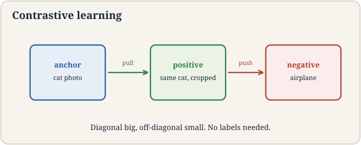
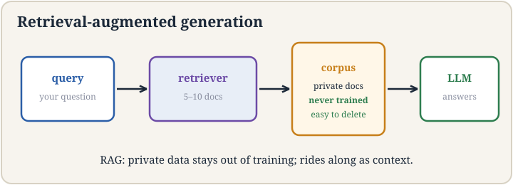

## The job: find the photo by describing it

A user types "cat playing soccer" into a photo app with ten million
unlabeled pictures. No tags, no labels, no captions. The job: return
the right photos. Keyword search fails: the pixels contain no words.
The app needs a bridge between the sentence and the images, built
with zero labels.

## First attempt: train a classifier per concept

The naive idea: label some photos ("cat", "soccer", "dog") and
train classifiers. With ten million photos and no labels, this
needs an army of labelers. Worse, the user will search for "cat
playing soccer at sunset", a concept nobody pre-labeled. Fixed
label sets cannot cover open-ended queries. The labels are the
bottleneck, again.

## The key question

Can we learn representations that place matching things near each
other, using no labels at all? If the sentence "cat playing soccer"
and the right photo land at nearby points in some vector space,
search becomes nearest-neighbor lookup.

## Contrastive learning: pull together, push apart

Take one image x. **Augment** it twice: random crop, flip, blur,
noise. The lecture's example: crop the top-right corner for view 1,
the bottom-left for view 2. The two views show different pixels of
the same scene. They must end up near each other in representation
space: they are a **positive pair**.

Now take other images' views: **negatives**. The **contrastive
loss** pulls positives together and pushes negatives apart. For an
anchor view, with one positive and N negatives, the loss is:

```ascii
loss = -log( exp(sim(anchor, positive)/tau) / sum over all pairs exp(sim(anchor, pair)/tau) )
```

Read it: the fraction of the softmax that lands on the positive
pair. If the positive scores 0.9 similarity and 100 negatives score
0.1, the fraction is e^9/(e^9 + 100*e^1) ~ 0.9997, loss ~ 0.0003.
If a negative scores 0.85, the fraction drops and the loss bites.
**Tau** (temperature) sharpens or softens the competition. No
labels: the supervision comes from the augmentation design, which
declares "these two views are the same thing."

Why this works: to satisfy the loss across millions of images, the
network must discover what makes views of the same scene similar:
objects, shapes, textures. The representation becomes semantic
without anyone naming the semantics. This is lecture 12's
representation learning without the labels.



## Where it breaks: easy negatives teach nothing

Random negatives are too easy. Anchor: cat playing soccer. Random
negative: a truck. Similarity 0.05. The loss is already ~0. The
network learns nothing from this pair. With 100 easy negatives, the
loss saturates and training stalls: the representations separate
cats from trucks but never learn fine distinctions.

## Hard negatives

**Hard negatives** are pairs that look similar but are not the same.
The lecture's example: the anchor is a photo of a cat playing
soccer. The hard negative is text about the FIFA World Cup: soccer,
but no cat. Ambiguous, confusing, distracting. Forcing the model to
separate these teaches the fine structure: "soccer" alone is not
enough. The cat matters.

**Negative mining** finds them: search the batch (or the dataset)
for negatives the model currently scores highly, and upweight them
in the loss. The loss becomes demanding exactly where the model is
weak. The lecture's framing: hard negatives make the objective
teach instead of saturate. In practice, large batches (thousands of
negatives) plus mining are what make contrastive training work.
Small batches starve the loss of informative comparisons.

## Semantic search: the payoff

Once trained, the embedding space is a search engine. Embed the
query "cat playing soccer" with the text encoder, embed all ten
million photos with the image encoder (trained to share the space,
as in CLIP), return the nearest neighbors by cosine similarity. No
tags, no keywords: meaning matches meaning. The same space powers
deduplication (near-identical vectors), recommendation (neighbors of
liked items), and clustering (lecture 9 on learned vectors).

## RAG: the model's missing memory

A frontier lab's model never saw your company's private documents:
they cannot leak into its training data. But you want a personal
assistant that answers from those documents. Fine-tuning on them is
expensive and bakes them in opaquely. The lecture's alternative:
**retrieval-augmented generation** (RAG).

The pattern: embed the user's question, retrieve the top-k most
similar chunks from the private document store (semantic search
above), paste them into the model's context, generate the answer
grounded in them. The model never trained on the documents. It
reads them at test time.

Work the toy. Question: "What is our refund window?" Document
store: 10,000 embedded chunks. Retrieval returns 3 chunks: "Refunds
within 30 days...", "Shipping refunds excluded...", "Holiday
extension to 60 days...". The prompt becomes: question + 3 chunks.
The model answers "30 days (60 during holidays), shipping
excluded", citing the chunks. Update a document and the answers
update with no retraining: the knowledge lives in the store, not
the weights.



## The honest price

Contrastive learning buys label-free representations and pays in
compute and design: huge batches for informative negatives, and the
augmentation policy is the real supervision: bad augmentations teach
bad invariances (crop too aggressively and the model learns that
object parts are interchangeable with wholes). Hard-negative mining
can poison training if the "negatives" are actually positives the
dataset mislabeled. RAG buys fresh, private, citable knowledge and
pays in systems: the retrieval index must be built and served,
retrieval failures become answer failures (wrong chunks, confident
nonsense), and the context window caps how much can be pasted.
Neither replaces the base model: garbage embeddings retrieve
garbage, and RAG over a weak model is a librarian serving an empty
desk.

## Mapping back

| Idea | Pain it answers | How |
|---|---|---|
| Contrastive loss | Ten million photos, zero labels | Pull augmented views together, push others apart; softmax fraction on the positive; tau sharpens |
| Augmentation as supervision | No labels to define "same" | Two crops of one image are declared the same thing; semantics emerge from the constraint |
| Hard negatives | Random negatives score 0.05: loss saturates | FIFA-text vs cat-soccer-photo: confusing pairs keep the loss teaching; mining finds them |
| Semantic search | Keywords cannot search pixels | Shared embedding space: query and photos as vectors, nearest neighbors by cosine |
| RAG | Frontier models never saw private docs | Retrieve top-k chunks, paste into context, generate grounded; knowledge in the store |

> [!QA]
> Q: How can a model learn without any labels in contrastive learning?
> A: The labels are replaced by augmentation design. Take one image, make two random views (crop top-right, crop bottom-left, flip, blur). Declare them the same thing: a positive pair. Other images' views are negatives. The loss pulls positives together and pushes negatives apart in representation space. Across millions of images, the only way to satisfy this is to discover real visual structure: objects, shapes, textures. The supervision is the statement "these two views show the same scene", which needs no human.
> Follow-up: What goes wrong with bad augmentations?
> A: The model learns exactly the invariances you declare. Crop too aggressively and it learns that a wheel equals a car. Augment with color jitter on a task where color matters (bird species) and it learns to ignore the signal. The augmentation policy is the hidden label set: design it with the downstream task in mind.

> [!QA]
> Q: What are hard negatives and why do they matter?
> A: Negatives that look similar to the anchor but are not the same: the lecture's cat-playing-soccer photo versus FIFA World Cup text. Random negatives (a truck) score 0.05 similarity and the loss saturates near zero: no learning. Hard negatives score high and keep the loss biting, forcing fine distinctions: soccer is not enough, the cat matters. Negative mining actively finds the negatives the model currently confuses and upweights them, aiming the training at the model's weaknesses.
> Follow-up: Can hard negatives hurt?
> A: Yes, when they are false negatives: actually-positive pairs mislabeled by the pipeline (two photos of the same cat from different users). Mining then punishes the model for a correct similarity, teaching it to separate things that should be together. Deduplication and careful mining thresholds guard against this.

> [!QA]
> Q: When is RAG better than fine-tuning on the private documents?
> A: When the knowledge changes, must be cited, or must stay out of the weights. RAG: update a document and answers update with zero retraining. The model can quote its sources. Private data never enters training. Fine-tuning: bakes knowledge into weights opaquely, needs retraining per update, cannot cite. RAG wins for living, private, reference-style knowledge. Fine-tuning wins for behavior and style: teaching the model how to answer, not what the facts are.
> Follow-up: What is RAG's failure mode?
> A: Retrieval failure. Wrong chunks retrieved means the model generates confidently from wrong premises: the answer is fluent and false. Mitigations: better embeddings, hybrid keyword+vector search, reranking the top-k, and having the model say "not in the documents" when nothing relevant retrieves. The index is load-bearing infrastructure, not an accessory.

## Recap: the whole lesson on one screen

1. **The job.** "Cat playing soccer" over ten million unlabeled
   photos. Keywords cannot search pixels.
2. **First attempt.** Label concepts, train classifiers. Armies of
   labelers. Open-ended queries uncovered.
3. **The key question.** Learn a space where matching things are
   near, with no labels?
4. **Contrastive.** Two augmented views: positive pair. Others:
   negatives. Softmax fraction on the positive. Tau sharpens.
   Augmentation is the supervision.
5. **Where it breaks.** Easy negatives (truck, 0.05): loss
   saturates, nothing learned.
6. **Hard negatives.** FIFA text vs cat-soccer photo: confusing
   pairs keep it teaching. Mining aims at weakness.
7. **Search.** Embed query, nearest neighbors by cosine. Tags
   obsolete.
8. **RAG.** Private docs the model never saw: retrieve top-k,
   paste into context, generate grounded. Knowledge in the store.
9. **The honest price.** Batches and augmentation design.
   False-negative poisoning. Retrieval as load-bearing infra.

## Official sources and further reading

**Official:**
- Lecture 13 video, Stanford Online YouTube:
  https://www.youtube.com/watch?v=lNTajqxxOn4 — Tengyu Ma builds
  contrastive learning from augmentations, presents hard-negative
  mining, then semantic search and RAG for private knowledge.
- Official subtitle transcript (en-US): the lecture's spoken text.
- CS229 Spring 2026 official course notes (local PDF): the formal
  contrastive loss and RAG pattern.

**Caveats from these sources.** The augmentation examples (random
crop top-right vs bottom-left, flip, blur, noise) and the hard
negative example (cat playing soccer vs FIFA World Cup text) are the
lecture's own. The RAG motivation (frontier labs cannot see
enterprise proprietary data) is the lecture's framing. The refund-window
toy is an original miniature of the lecture's pattern.

## Connections to the other courses

- **CS229 L10:** PCA: the linear ancestor of learned embeddings.
- **CS229 L12:** representation learning's other route: pre-trained
  foundation models. Probing their embeddings.
- **CS229 L14:** the text and image encoders are transformers.
- **CS224N:** contrastive objectives for sentence embeddings
  (SimCSE and successors).
- **CS336:** serving retrieval indices and RAG pipelines at scale.
