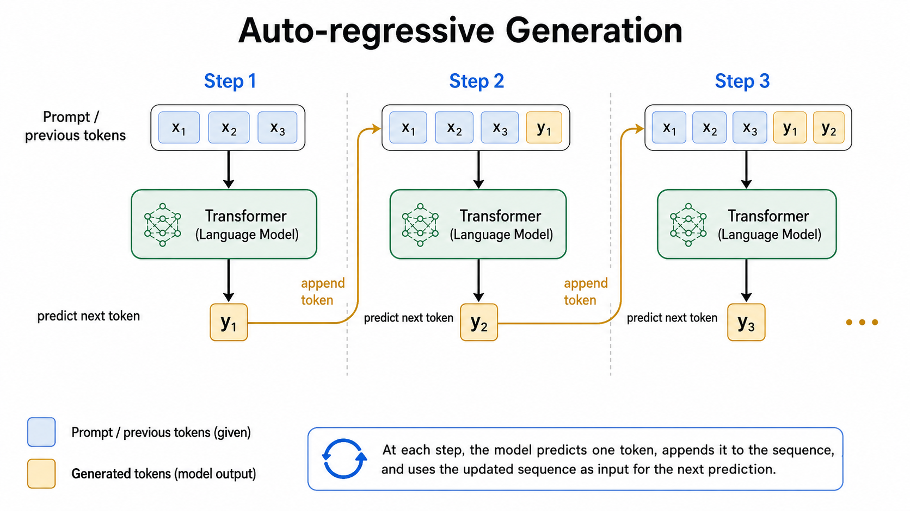

## How to read this lesson

This lesson has two levels. **Level 1 (Core)** contains what you need to
understand everything that follows in CS229 and the courses that build on
it. **Level 2 (Deep)** contains what you need for correct, interview-grade
understanding. Read Level 1 straight through. Return to Level 2 when you
want depth.

No prerequisites are assumed. Every term is defined at first use. The
MLP, residual block, and softmax were defined in [lectures
7](l07-neural-networks-1.html) and [4](l04-glms-softmax.html); they are
reused, not re-explained.

## Level 1: The autoregressive paradigm

A language model assigns probabilities to sequences of tokens. The
**autoregressive** paradigm factors the joint probability into a product
of conditionals [01:00](ts:01:00):

p(x_1..x_T) = product over t of p(x_t | x_1..x_{t-1})

Generate one token at a time. Each new token depends on all previous
ones. The model is **causal**: position t sees only positions up to t
[24:29](ts:24:29). This lecture covers autoregressive transformers only.
Non-autoregressive variants are skipped.

The paradigm starts with GPT-3. Before it, the field trained models per
task. After it, one model generates text for everything. Lectures 15
through 17 continue the story: efficiency, prompting, fine-tuning,
reinforcement learning. This lecture is the architecture.

> [!QA]
> Q: What does autoregressive mean?
> A: Each token is predicted from the tokens before it, one step at a time. The joint probability is the product of these conditionals by the chain rule. Generation is sequential: you cannot produce token 10 before tokens 1 through 9. Training is parallel, because all the true previous tokens are known. That asymmetry shapes everything about transformers.
> Follow-up: Why is training parallel but generation sequential?
> A: Training uses teacher forcing: the true previous tokens are in the data, so every position's prediction can be computed at once. Generation has no true tokens: each prediction becomes the input for the next. The model must wait for its own output. This is why inference optimization is its own field.

## Level 1: Tokenization

Transformers compute on numbers, not text. **Tokenization** turns text
into integers first [01:48](ts:01:48). The **token** is the smallest unit
the model sees. Not characters: sequences get too long. Not words:
vocabularies explode and new words break. Subword pieces: frequent
strings become single tokens, rare ones split.

The tokenizer is fixed before training and never changes. Every token
indexes a row of the embedding matrix. Replace the tokenizer and the
model's input space changes meaning: the trained weights no longer
apply. Tokenization is infrastructure, decided once, lived with
forever. CS336 derives it from first principles.

## Level 1: Attention from Q, K, V

**Attention** lets each position gather information from other
positions. The input is a sequence of vectors h_1..h_T. Each becomes
three vectors: a **query** q, a **key** k, a **value** v, via learned
projections [44:10](ts:44:10).

The mechanism: score = q . k, a dot product measuring relevance. Softmax
over scores gives weights summing to one. Output = weighted sum of
values. In words: the query asks "what do I need?", the keys advertise
"what I have", the weights decide the mix, the values supply the
content.

The lecture is honest about understanding: the intuition is relevance
matching, but nobody knows exactly how attention works inside trained
models. It just works. Mechanistic interpretability, mentioned in
lecture 12, is the field trying to change that.

> [!QA]
> Q: Why three vectors instead of one?
> A: Separation of concerns. The query encodes what the position is looking for. The key encodes what each position offers. The value encodes what each position contributes if selected. One vector cannot serve all three roles well: what you seek differs from what you hold. The projections learn the three roles separately.
> Follow-up: Why the dot product for scores?
> A: It measures alignment: large when query and key point the same way. Scaled by dimension to keep softmax inputs in a sane range. The choice is simple, differentiable, and fast on hardware. Fancier similarity functions exist, but the dot product won on the tradeoff.

## Level 1: Causal masking

Causality must be enforced mechanically. The score matrix is T-by-T:
every query against every key. **Masking** adds negative infinity to the
upper triangle before the softmax [61:09](ts:61:09). Softmax turns
negative infinity into zero weight. Position t attends only to positions
up to t.

Without the mask, the model would cheat: peek at future tokens during
training, then fail at generation where the future does not exist. The
mask is the difference between a model that predicts and a model that
copies. Every autoregressive transformer carries it.

## Level 1: The block and the bottleneck

A transformer block stacks: attention, normalization, MLP, with residual
connections around each [72:35](ts:72:35). The normalization is usually
**RMSNorm**. The order of norm, residual, and sub-layer varies:
**pre-norm** applies normalization before the sub-layer,
**post-norm** after [73:26](ts:73:26). Details are in the notes. The
shape is the same: attend, normalize, transform, add back.

Then the bill. The attention matrix is T-by-T, each entry a dot product
in d_h dimensions: O(T^2 d_h) operations [74:32](ts:74:32). The T^2 is
the bottleneck. Double the sequence length, quadruple the attention
cost. Everything about transformer efficiency, the guest lecture on
system ML, sparse attention, and the KV cache of lecture 15, is a
response to this term.

> [!QA]
> Q: Why is attention quadratic?
> A: Every position scores against every other position: T queries times T keys. The matrix itself is T^2 entries, each costing a dot product. Nothing about the mechanism avoids the pairwise comparison. Linear-time attention variants exist but change the model. The quadratic term is the price of letting every token see every other token.
> Follow-up: What breaks first as T grows?
> A: Memory, usually before compute. The T^2 matrix must be stored for the backward pass. Long-context training is memory-bound: the activations, not the FLOPs, set the limit. That is why memory-efficient attention and gradient checkpointing are production necessities, not optimizations.

## Level 2: Multi-head attention

One attention head learns one relevance pattern. **Multi-head**
attention runs several heads in parallel on slices of the dimension and
concatenates the results. Each head can specialize: one tracks syntax,
another tracks coreference, a third tracks position. The lecture
presents single-head first because the mechanism is identical per head.
The multiplicity is capacity, not concept.

Heads also parallelize cleanly: independent score matrices, one
concatenation. The hardware likes this. Much of the transformer's
success is mechanisms that are both expressive and parallel-friendly.

## Level 2: The next-word prediction loss

Training minimizes cross-entropy on the next token: the loss chip from
lecture 2 holding -log p of the true next token, summed over positions.
Every position is a training example. A 2048-token sequence is 2048
supervised examples in one forward pass. This density is why language
modeling scales: the data labels itself, and every token teaches.

The loss also explains the paradigm's name. The model never sees the
whole sequence as one object. It sees two thousand next-word problems.
"Language modeling" is next-word prediction, repeated at scale until
reasoning emerges.

## Recap: the whole lesson on one screen

Eight ideas carry this lecture. Read each card. Say the core sentence out
loud. If you can, you own the lesson.

<strong>1. Autoregressive: one token at a time</strong>

p(x_1..x_T) = product of p(x_t | past). Causal. Training parallel,
generation sequential. The GPT paradigm.

Key: chain rule as architecture

<strong>2. Tokenization first, forever</strong>

Text to integers before anything else. Subword pieces. Fixed before
training, never changed. Infrastructure.

Key: decided once

<strong>3. Attention: query, key, value</strong>

Scores = q.k, softmax to weights, output = weighted values. Queries
ask, keys advertise, values supply.

Key: relevance-weighted mixing

<strong>4. Mask the future</strong>

Upper triangle to negative infinity before softmax. Position t sees
only the past. No peeking, no cheating.

Key: causality by construction

<strong>5. Attention costs O(T^2 d)</strong>

T-by-T score matrix. 4x length, 16x compute. Memory breaks first.
The bottleneck everything else answers.

Key: the quadratic term

<strong>6. Block: attend, norm, MLP, residual</strong>

RMSNorm, pre-norm or post-norm ordering. Residuals around
everything. Same skip trick as ResNet.

Key: composition of lecture 7 parts

<strong>7. Loss: cross-entropy per position</strong>

Next-token prediction, summed over the sequence. Every token is a
training example. The data labels itself.

Key: -log p_true, per token

<strong>8. Heads specialize in parallel</strong>

Multiple Q/K/V projections, concatenated. One mechanism per head.
Capacity and parallelism, not new concept.

Key: same attention, many views

## Official sources and further reading

**Official:**
- Lecture 14 video: autoregressive paradigm [01:00](ts:01:00), tokenization [01:48](ts:01:48), Q/K/V [44:10](ts:44:10), causal model [24:29](ts:24:29), masking [61:09](ts:61:09), residuals [72:35](ts:72:35), pre/post-norm [73:26](ts:73:26), T-squared [74:32](ts:74:32).
- CS229 Spring 2026 official course notes: transformer chapter; the autoregressive figure above is from it.

**Further reading:**
- Vaswani et al. (2017), "Attention Is All You Need": the transformer paper.
- Elhage et al. (2021), "A Mathematical Framework for Transformer Circuits": the interpretability program.

**Caveats from these sources.** The "nobody knows how attention works"
line is about internal mechanisms, not the mathematics, which is exact.
Pre-norm versus post-norm is an active design choice with tradeoffs, not
a settled answer. The lecture skips non-autoregressive transformers
entirely; they exist and matter for some applications.

## Connections to the other courses

- **CS336:** the transformer is CS336's entire subject: this lecture is the bridge, CS336 is the deep dive.
- **CS224N:** the 2024 course covers the same architecture from the language side; the mathematics matches.
- **CS329H:** attention weights are the model's uncertainty made explicit, reused in decision-theoretic analyses.

> [!CHEAT]
> **Transformer cheatsheet.** Autoregressive: p(x) = product p(x_t|past); causal; train parallel, generate sequential. Tokenize first, fix forever. Attention: q,k,v projections; scores=q.k; softmax; output=weighted values. Causal mask: -inf upper triangle. Block: attention, RMSNorm, MLP, residuals; pre/post-norm. Cost O(T^2 d): the bottleneck. Loss: per-position cross-entropy; every token teaches.

> [!MEMORY]
> **Every token sees the past.** The mask is the model's honesty: it can only use what generation would have. Whenever a model seems too good, check what it was allowed to see.
