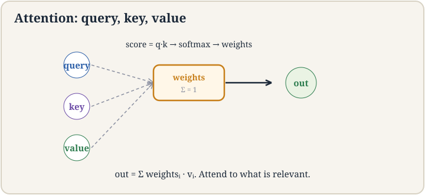
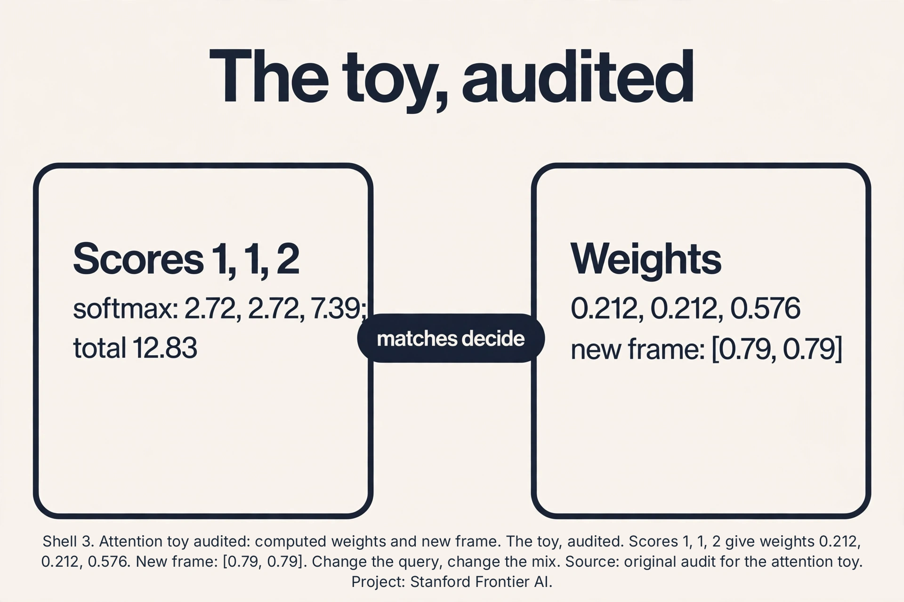
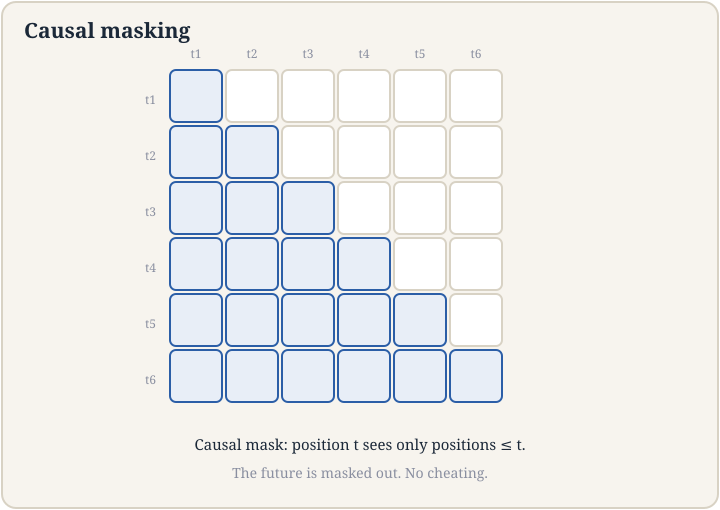
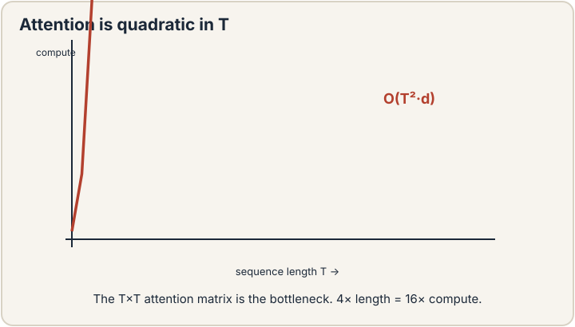
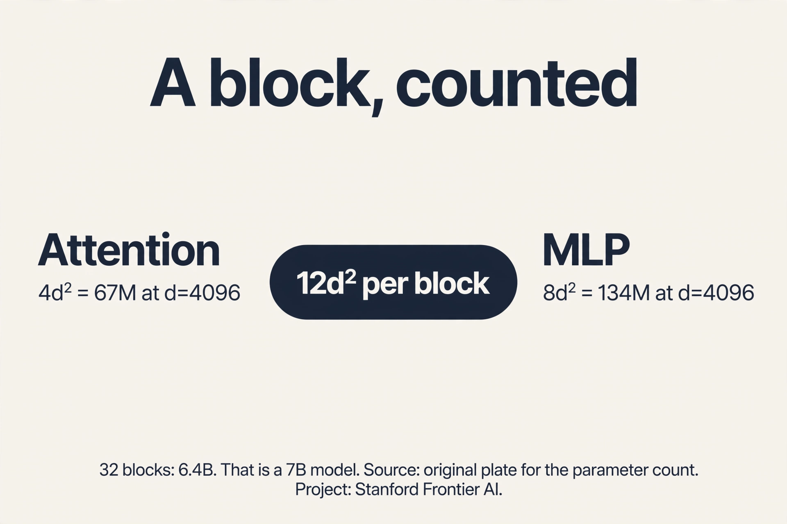
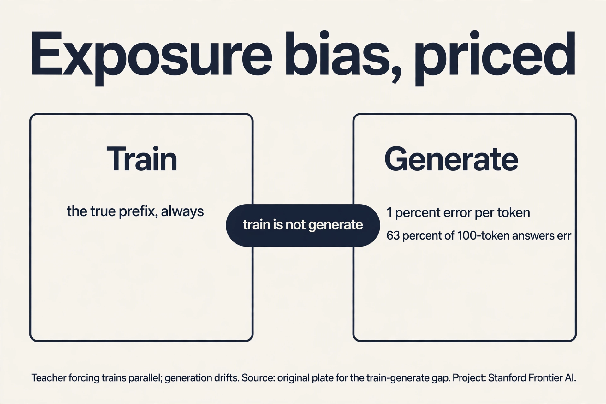

## The job: finish the sentence

"The cat sat on the". A human finishes it: "mat". The job: build a
machine that, given any text prefix, predicts the next piece of
text. Do this well enough, at scale, and you get the foundation
models of lecture 12. This chapter builds the machine that does it:
the transformer.

## First attempt: predict whole sentences

The naive idea: model entire sentences at once. Learn p("the cat
sat on the mat") as one number. Three facts kill it. Sentences have
different lengths: a model for 6-word sentences cannot score 7-word
ones. The space explodes: with 50,000 tokens, there are 50,000^10
possible 10-token sentences. And whole-sentence scores cannot
generate: you need the next word, not a verdict on a finished
sentence.

## The autoregressive fix

The **chain rule** of probability factors the joint into a product
of next-step predictions:

```ascii
p("the cat sat") = p("the") * p("cat"|"the") * p("sat"|"the cat")
```

Each factor is one small question: given the words so far, what
comes next? Train a model to answer that question on billions of
words, and the product scores whole sequences. This is the
**autoregressive** paradigm: predict one piece at a time, feed each
prediction back as context for the next. Generation is just repeated
prediction.

## Tokenization: what is a piece?

The model eats numbers, not text. **Tokenization** cuts text into
pieces (**tokens**) and maps each to an integer. What should a piece
be? Characters are too many steps per sentence. Words fail on rare
words: "internationalization" as one token never shares anything
with "internationalized" or "nation", though they share meaning.

The answer is **subword** tokenization: split rare words into
frequent pieces. "Internationalization" becomes "international" +
"ization". The model learns "international" once and reuses it.
The lecture's live example: "LLMefication" splits into pieces the
model already knows. Vocabulary around 50,000 pieces covers a
language. Every token becomes a vector (**embedding**). The model
never sees raw text, only sequences of vectors.

## First attempt at context: fixed windows

Each token's vector should carry its context: "frame" means one
thing in "frame the situation" and another in "photo frame". The
naive idea: mix each token with its, say, 5 neighbors using fixed
weights. It fails where it matters: in "The counselor helped frame
the situation", the word that disambiguates "frame" ("counselor")
sits 3 back, but in another sentence the key word sits 20 back. Fixed
windows cannot reach it. Fixed weights cannot know which neighbor
matters. The mixing must be data-dependent: each token decides, per
sentence, which other tokens to listen to.

## The key question

What if every token could look directly at every other token and
decide how much each one matters, with the decision computed from
the tokens themselves?

## Attention, by hand

**Attention** is a lookup. Each token produces three vectors: a
**query** (what I am looking for), a **key** (what I contain), and a
**value** (what I offer). To build the new representation of token
i: compare its query against every token's key (scores), turn scores
into weights summing to 1 (**softmax**), mix the values by the
weights.

Work it on a toy. Three tokens, 2-D vectors, identity projections
(the real model learns them. The mechanism is identical).

```ascii
tokens:  counselor = [1, 0]   helped = [0, 1]   frame = [1, 1]
query for "frame": q = [1, 1]

scores (dot products of q with each key):
  q . counselor = 1,   q . helped = 1,   q . frame = 2

softmax: e^1 = 2.72, e^1 = 2.72, e^2 = 7.39; total = 12.83
weights = [0.21, 0.21, 0.58]

new "frame" = 0.21*[1,0] + 0.21*[0,1] + 0.58*[1,1] = [0.79, 0.79]
```

"Frame" pulled 21 percent from "counselor", 21 percent from
"helped", 58 percent from itself. The mix came from the data: the
query-key matches decided it. Every token does this against every
other token, simultaneously. That is attention, and the result is a
**contextual representation**: each token's vector now carries its
sentence.

The full operation is four matrix steps. Stack N tokens into N x d
matrix X. Project to Q, K, V (three learned matrices). Scores =
QK^T (N x N). Softmax each row (scaled by 1/sqrt(d)). Output =
weights * V.



### Subchapter: the attention toy, audited

Check the division. e^1 = 2.718 (twice), e^2 = 7.389. Total:
12.825. Weights: 2.718/12.825 = 0.212, 0.212, 7.389/12.825 =
0.576. The lesson's 0.21/0.21/0.58 rounds correctly. New frame:
0.212*[1,0] + 0.212*[0,1] + 0.576*[1,1] = [0.788, 0.788]. Rounds
to [0.79, 0.79]. Exact. Now change the query to [1, 0]: a token
looking for counselor-like keys. Scores: 1, 0, 1. Softmax: e^1 =
2.718, e^0 = 1, e^1 = 2.718. Total 6.436. Weights: 0.422, 0.155,
0.422. The same keys, a different question, a different mix: the
query decides. That is the whole mechanism in one changed number.



### Subchapter: the 1/sqrt(d) audit

Why the scaling is not optional. Take d = 64, random vectors with
unit-variance entries. Dot products have variance 64, std 8:
scores spread over roughly ±16. Softmax: e^16 vs e^-16, a ratio
of e^32 ≈ 8×10^13. One weight is 1, the rest are 0: winner-take-all
on random noise, and gradients through the losers are dead.
Divide by sqrt(64) = 8: std becomes 1, scores spread ±2, ratio
e^4 = 54.6. The softmax stays responsive: weights differ, none
vanish. The rule: dot products grow as sqrt(d). The scaling
cancels the growth. Forget it and the first training steps weld
each query to one random key.

. Raw dots at d=64: std 8, softmax ratio 8e13, winner-take-all. Scaled: std 1, ratio 55, responsive. Source: original plate for the scaling audit. Project: Stanford Frontier AI.")

## Causal masking: no peeking

For next-word prediction, token 5 may only use tokens 1-4. If
"frame" could see "situation" (token 6) during training, the model
would cheat: it predicts the future from the future. The **causal
mask** forbids it: before the softmax, set scores for future
positions to negative infinity. Softmax turns them to exactly 0.
The weight matrix becomes lower-triangular: each row only mixes the
past. At generation time this matches reality: the future does not
exist yet.



## The block: attention plus MLP, with residuals

One transformer block: attention (mix across positions), then an
MLP (bend within each position, lecture 7), each wrapped in a
**residual connection** (lecture 7: out = x + F(x)) and
**RMSNorm** (rescale each vector to unit root-mean-square:
stabilizes the signal through dozens of blocks). Stack 32-96
blocks. The final block's last-position vector feeds a softmax over
the 50,000-token vocabulary: the next-token distribution. Train
with cross-entropy (lecture 4) against the true next token.



### Subchapter: a block, counted

Price one block at d = 4096. Attention: Q, K, V, O, four d-by-d
matrices: 4 * 4096^2 = 67.1M parameters. MLP with 4x expansion:
up 4096→16384 and down 16384→4096: 2 * 4 * 4096^2 = 134.2M. Per
block: 201.3M. Thirty-two blocks: 6.44B. Add embeddings (50k
vocab × 4096 = 204.8M): ~6.6B total. That is a "7B model": the
label is the block count times 12*d^2 plus embeddings. The
interview move: 12*d^2 per block (4 for attention, 8 for the MLP)
is the whole sizing rule. Given a parameter budget and d, blocks =
budget / (12*d^2).



### Subchapter: exposure bias, priced

Teacher forcing feeds the true prefix at every position. At
generation the model feeds itself. Price the gap. Suppose each
generated token has a 1% error rate independently. A 100-token
answer contains at least one error with probability 1 - 0.99^100
= 0.634: nearly two-thirds of answers. And errors compound: the
model never trained on its own mistakes, so one wrong token
poisons the context for all later ones. The attempted fix is
scheduled sampling: during training, randomly feed the model's own
predictions instead of the truth, growing the fraction over time.
It helps and it is fiddly: the training distribution keeps
shifting. The honest summary: teacher forcing trains fast and
parallel. Generation drifts. The gap is structural to the
autoregressive setup.



## The honest price: quadratic

The score matrix is N x N: every token pairs with every token.
Double the length, quadruple the work. At N = 4,096: 16.7M scores
per layer per head, most of which must sit in memory. This single
fact, attention is quadratic in sequence length, is the bottleneck
the next lecture attacks. The transformer won training (fully
parallel, unlike the RNN's serial chain). The field now pays for
inference.

## Mapping back

| Idea | Pain it answers | How |
|---|---|---|
| Autoregressive factorization | Whole sentences: variable length, 50,000^10 space, cannot generate | Chain rule: one next-token question at a time; generation is repeated prediction |
| Subword tokenization | Characters too many steps; words cannot share across rare forms | "Internationalization" -> "international"+"ization"; ~50K pieces cover a language |
| Attention | Fixed windows cannot reach far context with data-dependent weights | Q/K/V lookup; toy: frame = 0.21 counselor + 0.21 helped + 0.58 self |
| Causal mask | Training would peek at the future | Future scores -> zero weight; lower-triangular; matches generation reality |
| Block design | Deep stacks destabilize | Attention + MLP, residuals (lecture 7), RMSNorm; 32-96 blocks |
| Quadratic price | Nothing is free | N x N scores: 16.7M at N=4,096; the next lecture's target |

> [!QA]
> Q: Why predict one token at a time instead of whole sentences?
> A: Three reasons. Sentences vary in length: a fixed-size model cannot score all lengths. The space explodes: 50,000^10 possible 10-token sentences cannot be tabulated. Generation needs the next word, not a whole-sentence verdict. The chain rule turns the joint distribution into a product of next-token conditionals, each a small learnable question. Train on billions of those questions and the product scores anything.
> Follow-up: What is teacher forcing?
> A: During training, feed the true prefix at every position instead of the model's own predictions. All positions train in parallel against known targets. The mismatch: at generation time the model feeds itself its own (possibly wrong) predictions, so errors compound. That train/generate gap is called exposure bias.

> [!QA]
> Q: Work the attention toy: why does "frame" get weights [0.21, 0.21, 0.58]?
> A: Query [1,1] dot each key: counselor [1,0] gives 1, helped [0,1] gives 1, frame [1,1] gives 2. Softmax: e^1=2.72 twice, e^2=7.39, total 12.83. Weights: 2.72/12.83=0.21, 0.21, 7.39/12.83=0.58. New frame = 0.21*[1,0]+0.21*[0,1]+0.58*[1,1] = [0.79,0.79]. The query-key matches set the mix: "frame" matches itself best, the other two equally.
> Follow-up: Why divide by sqrt(d) before the softmax?
> A: Dot products grow with dimension: variance d for random vectors. Unscaled, the softmax saturates in large models: one weight nears 1, the rest near 0, gradients through the tiny weights die. Dividing by sqrt(d) restores unit variance and keeps the softmax responsive. Forget it and large-model attention collapses onto one token per query early in training.

> [!QA]
> Q: Why is attention O(N^2), and what does the causal mask change about the cost?
> A: The score matrix QK^T has one entry per token pair: N^2 entries to compute and (naively) store. At N=4,096 that is 16.7M per layer per head. The causal mask zeroes the upper triangle but the standard implementation still computes all N^2 scores. It saves nothing computationally, only enforces the no-peeking rule. True savings need different algorithms (the next lecture) or different architectures.
> Follow-up: Why did transformers beat RNNs if attention is quadratic?
> A: Training economics. RNNs are serial: step t waits for t-1, leaving thousands of GPU cores idle. Attention computes all pairs in parallel: every core works. At scale, the architecture that trains fast on huge data wins even if each step costs more. Inference is where the quadratic bill comes due.

## Recap: the whole lesson on one screen

1. **The job.** Finish "The cat sat on the". Predict the next
   piece, repeatedly.
2. **Whole sentences fail.** Lengths vary, 50,000^10 space, cannot
   generate.
3. **Autoregressive.** Chain rule: p = product of next-token
   conditionals. Generation is repeated prediction.
4. **Tokenization.** Subword pieces: "internationalization" shares
   "international". ~50K vocabulary.
5. **Fixed windows fail.** Key context sits at varying distances.
   Weights must be data-dependent.
6. **Attention.** Q/K/V lookup. Toy: frame = [0.79, 0.79] from
   weights [0.21, 0.21, 0.58]. Contextual representations.
7. **Causal mask.** Future scores to zero. No peeking. Matches
   generation.
8. **The block.** Attention + MLP, residuals, RMSNorm, 32-96 deep.
   Softmax over vocabulary, cross-entropy loss.
> [!QA]
> Q: Walk me through the mechanism: recompute the toy weights from the scores, then change the query.
> A: Scores 1, 1, 2. e^1 = 2.718 twice, e^2 = 7.389, total 12.825. Weights: 0.212, 0.212, 0.576. New frame: 0.212*[1,0]+0.212*[0,1]+0.576*[1,1] = [0.788, 0.788]. Now query [1,0]: scores 1, 0, 1. Softmax: 2.718, 1, 2.718. Total 6.436. Weights: 0.422, 0.155, 0.422. Same keys, different question, different mix: counselor and frame now tie. The query decides the attention pattern. The keys only answer.
> Follow-up: What do learned (non-identity) projections change?
> A: They rotate the spaces: the query "what I look for" and the key "what I contain" need not live in token space. A token can ask about syntax while offering semantics. The arithmetic is identical: project, dot, softmax, mix. Identity projections just make the numbers visible.

> [!QA]
> Q: Applied design: you need a ~1B-parameter transformer at d=2048. How many blocks?
> A: Per block: 12*d^2 = 12 * 2048^2 = 50.3M (4d^2 attention + 8d^2 MLP). Embeddings: 50,000 * 2048 = 102.4M. Blocks = (1,000M - 102.4M) / 50.3M = 17.8: use 18. Total: 18*50.3 + 102.4 = 1,008M. The 12*d^2 rule sizes any decoder: pick d for the width, divide the budget for the depth. Deeper-narrow vs shallower-wide at fixed budget is then a dev-set question.
> Follow-up: Why not d=4096 with 4 blocks for the same 1B?
> A: Four blocks give four rounds of mixing and bending: too shallow to compose the features language needs. Depth buys composition (lecture 7's lesson). The field's rule of thumb: depth and width grow together. Extreme aspect ratios underperform. At 1B, ~20 blocks at d~2048 is the balanced region.

> [!QA]
> Q: Why multiple heads instead of one big attention head?
> A: One head gives each token one mix pattern. Language needs several simultaneous relations: one head can track syntax (which verb governs this noun), another coreference (which "it" is this), another position. Heads partition the width: d=4096 with 32 heads gives each head d=128 to work in. Total compute equals one 4096-wide head: the partition costs nothing. The capacity is in the diversity of mixes, not the arithmetic.
> Follow-up: What goes wrong with too many heads?
> A: Each head gets too narrow: 128 heads at d=4096 means d=32 per head, too thin to represent a useful query-key match. The mixes become noise. Head count is a dev-tuned dial, typically d/128 to d/64 per head.

> [!QA]
> Q: RMSNorm vs LayerNorm: what was dropped, and what breaks with no norm at all?
> A: LayerNorm centers (subtract mean) then rescales (divide by std). RMSNorm drops the centering: it only rescales by root-mean-square. Cheaper, and in practice the centering bought little for transformers. With no normalization across 96 blocks, activation magnitudes drift: each block's output scale multiplies, signals explode or vanish down the stack, and training destabilizes. The norm is the guardrail that lets depth reach 96.
> Follow-up: Where does the norm sit: before or after the sublayer?
> A: Modern stacks put it before (pre-norm): norm, then attention, then residual add. Pre-norm keeps the residual stream unscaled and gradients flowing. Post-norm (original transformer) normalizes after the add and trains worse at depth. The lecture presents RMSNorm as the stabilizer. Pre-norm placement is the accompanying practice.

10. **The audit.** Weights 0.212/0.212/0.576, frame [0.79,
    0.79]. New query, new mix.
11. **The scaling.** Raw dots at d=64: softmax ratio 8e13.
    Scaled: 55. Responsive, not welded.
12. **The count.** 12*d^2 per block. 32 blocks at 4096: 6.4B.
    That is a 7B model.
13. **The gap.** 1% per token: 63% of 100-token answers err.
    Teacher forcing trains parallel. Generation drifts.

## What is used where

**The transformer is the deployed architecture.** GPT, Claude,
Llama, Gemini: all decoder-only transformers running this
lesson's block. BERT-style encoders run the same attention
without the causal mask for classification and search. The 12*d^2
sizing rule is the back-of-envelope every practitioner uses.
RMSNorm and pre-norm residuals are the standard stack in every
open-weights model. Subword tokenization (BPE/SentencePiece) is
the universal text frontend.

## Watch next

<div class="video-block"><div class="video-wrap"><iframe src="https://www.youtube-nocookie.com/embed/wjZofJX0v4M" title="Explainer: transformers visualized" allow="accelerometer; autoplay; clipboard-write; encrypted-media; gyroscope; picture-in-picture" allowfullscreen loading="lazy" referrerpolicy="strict-origin-when-cross-origin"></iframe></div><p class="video-cap">Explainer: transformers, visualized. Attention and the block stack animated end to end. Watch after the attention toy.</p></div>

## Official sources and further reading

**Official:**
- Lecture 14 video, Stanford Online YouTube:
  - [Tengyu Ma builds](https://www.youtube.com/watch?v=pwQ0l4hFCVI)
  tokenization (subword, the "internationalization" and
  "LLMefication" examples), the autoregressive paradigm, attention
  from Q/K/V, causal masking, and the quadratic bottleneck.
- Official subtitle transcript (en-US): the lecture's spoken text.
- CS229 Spring 2026 official course notes (local PDF): the formal
  attention equations.

**Caveats from these sources.** The attention toy in this lesson is
an original miniature following the lecture's Q/K/V framing with
identity projections for visible arithmetic. The 16.7M figure is
N^2 at N = 4,096 per layer per head, the lecture's canonical
bottleneck illustration. RMSNorm is presented as the lecture
presents it: per-vector rescaling for stack stability.

## Connections to the other courses

- **CS229 L04:** softmax and cross-entropy: the output layer and
  the training loss.
- **CS229 L07:** residuals and the MLP inside each block. The RNN
  contrast from the sequence lesson.
- **CS229 L12:** this machine, pre-trained: the foundation model.
- **CS229 L15:** attacking the quadratic price: KV cache, GQA,
  MoE. Then ICL and SFT.
- **CS224N:** attention from the NLP side: the same mechanism,
  translation as the driving example.
- **CS336:** the transformer block built in full: the systems
  view of this lesson.
