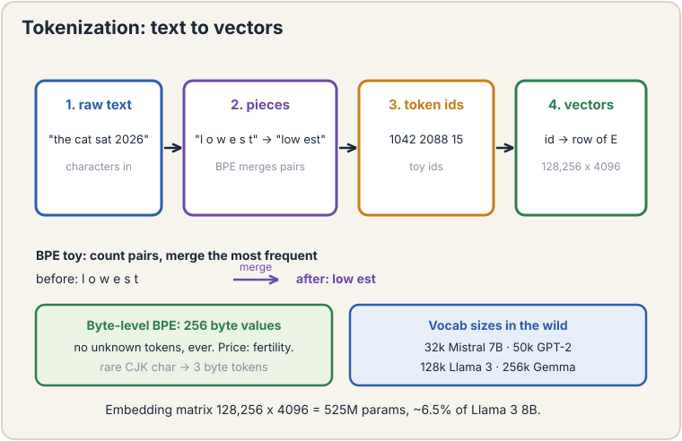
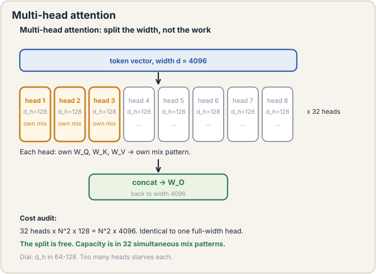
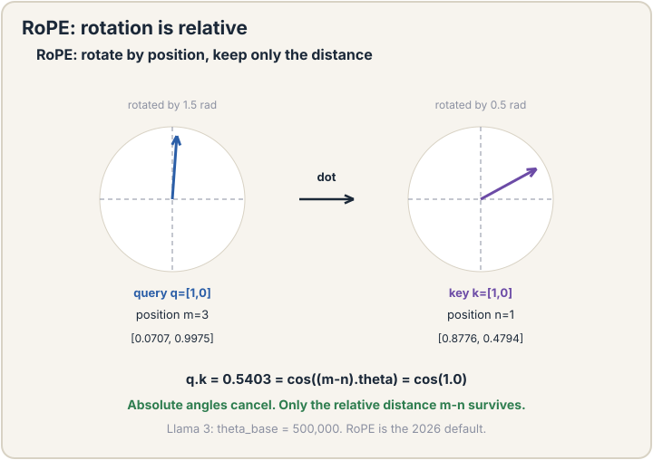
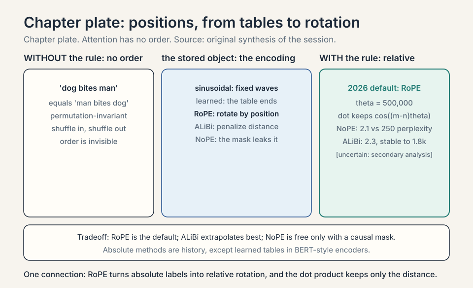
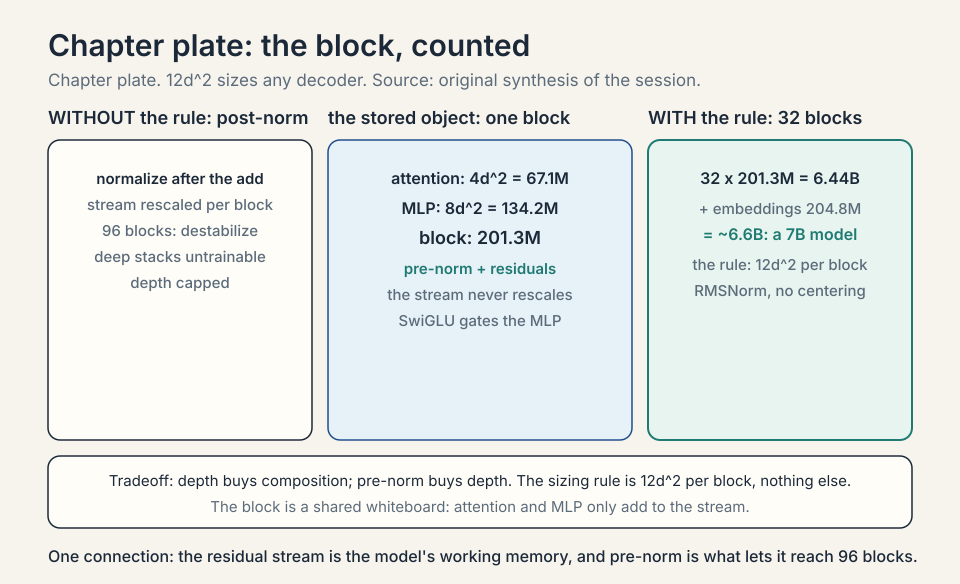
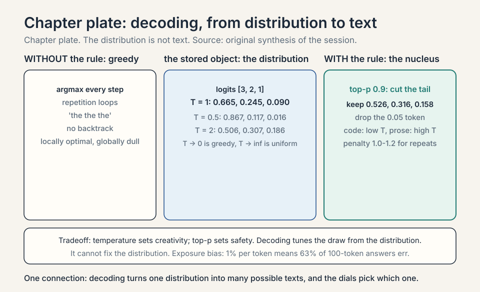

### Coverage and sourcing

This lesson follows CS229 Lecture 14 (Spring 2026, Tengyu Ma):
the transformer for autoregressive language modeling. The
lecture's own examples are the "internationalization" and
"LLMefication" tokenizations, the counselor/frame attention
toy, and the quadratic-bottleneck handoff to the guest lecture
on transformer efficiency. Claims marked "October 2026" are
later updates, each with its source. Worked toys not attributed
to the lecture are original miniatures of its mechanisms.
Sections on positional encodings, attention variants, and
decoding are textbook background the lecture's block assumes:
the lecture names Q/K/V, the causal mask, RMSNorm, and the
residual. This lesson fills in the family around them.

## The job: finish the sentence

"The cat sat on the". A human finishes it: "mat". The job: build a
machine that, given any text prefix, predicts the next piece of
text. Do this well enough, at scale, and you get the foundation
models of lecture 12. This chapter builds the machine that does it:
the transformer.

The lecture places this in the course arc: a sequence of three to
four lectures on large language models, starting from GPT-3 and
the autoregressive paradigm it introduced. Non-autoregressive
transformers are skipped: the autoregressive route won.

## First attempt: predict whole sentences

The naive idea: model entire sentences at once. Learn p("the cat
sat on the mat") as one number. Three facts kill it. Sentences have
different lengths: a model for 6-word sentences cannot score 7-word
ones. The space explodes: with 50,000 tokens, there are 50,000^10
possible 10-token sentences. And whole-sentence scores cannot
generate: you need the next word, not a verdict on a finished
sentence.

## The autoregressive fix

The **chain rule** of probability factors the joint into a product
of next-step predictions:

```ascii
p("the cat sat") = p("the") * p("cat"|"the") * p("sat"|"the cat")
```

Each factor is one small question: given the words so far, what
comes next? Train a model to answer that question on billions of
words, and the product scores whole sequences. This is the
**autoregressive** paradigm: predict one piece at a time, feed each
prediction back as context for the next. Generation is just repeated
prediction.

The lecture's framing: each new token depends on the previous
tokens, and the model learns the joint distribution as a product
of conditionals. **Causal** is the other name for this: the
future never influences the past.

### Subchapter: the chain rule, priced

Count what the factorization buys. A 10-token sentence over a
50,000-token vocabulary: the joint table would need 50,000^10
entries. The factored model needs 10 conditional distributions,
each over 50,000 outcomes: 10 x 50,000 numbers per sentence
position, shared across all sentences by one neural network.
The network has ~billions of parameters, not 50,000^10. The
chain rule turns an impossible table into a learnable function.
Every parameter is shared across every position: that sharing
is what makes training on billions of words tractable.

## Tokenization: what is a piece?

The model eats numbers, not text. **Tokenization** cuts text into
pieces (**tokens**) and maps each to an integer. What should a piece
be? Characters are too many steps per sentence. Words fail on rare
words: "internationalization" as one token never shares anything
with "internationalized" or "nation", though they share meaning.

The answer is **subword** tokenization: split rare words into
frequent pieces. "Internationalization" becomes "international" +
"ization". The model learns "international" once and reuses it.
The lecture's live example: "LLMefication" splits into pieces the
model already knows. Vocabulary around 50,000 pieces covers a
language. Every token becomes a vector (**embedding**). The model
never sees raw text, only sequences of vectors.

### Subchapter: BPE, worked

**Byte-pair encoding** (BPE) learns the pieces from data. Toy
corpus: "low" x5, "lower" x2, "lowest" x6. Start with characters.
Count pairs: "lo" appears 13 times, "ow" 13, "we" 8, "est" 6.
Merge the most frequent pair ("lo" -> "lo"), recount, merge
again ("low" -> "low"), then "we"+"r", then "est". After a few
merges the vocabulary holds "low", "low"+"er", "low"+"est":
the morphology fell out of counting. Real BPE runs ~50,000
merges on gigabytes of text. The lecture names BPE-style
subword as the answer and links the details to CS336.

### Subchapter: the tokenizer family

Three algorithms, one idea. **BPE**: merge the most frequent
pair, greedily, bottom-up. **WordPiece** (BERT): merge the pair
that most improves the language-model likelihood, not the raw
count. **Unigram** (SentencePiece): start with a huge
vocabulary, prune the pieces whose removal hurts likelihood
least, top-down. In practice all three produce similar
vocabularies. The choice that matters more is the
pre-tokenizer: how text is split before merging (spaces?
punctuation? digits grouped?). GPT-style tokenizers split
numbers into individual digits ("2026" -> "2","0","2","6"):
arithmetic becomes digit-by-digit, which the model handles
better than one "2026" token.

### Subchapter: byte-level BPE, no unknown tokens

GPT-2's tokenizer starts from 256 byte values, not characters.
Any text, in any language, is bytes: there is no
out-of-vocabulary token, ever. Rare Chinese characters fall
back to their UTF-8 bytes (3 tokens per character instead of
one). The price: non-Latin scripts cost more tokens per word
(the **fertility** problem: the same sentence takes 2-3x more
tokens in some languages, which means 2-3x the compute).
Vocabulary sizes in the wild, verified October 2026 against
public configs: 32k (Mistral 7B), 50k
(GPT-2 class), 128k (Llama 3), 256k (Gemma class). Bigger
vocabularies shorten sequences but grow the embedding matrix:
128k x 4096 = 524M parameters just for embeddings.

### Subchapter: the embedding matrix, priced

Every token id becomes a d-dimensional vector via a lookup
table: vocab_size x d parameters. Llama 3 8B (config
verified October 2026): 128,256 x 4096
= 525M parameters, about 6.5% of the model. The output head
is usually the same matrix transposed (**tied embeddings**):
one matrix, two jobs. The lookup is the only part of the
model that touches discrete tokens. Everything after is
vectors. Tokenization quality shows up downstream: a
tokenizer that splits "unhappiness" into "un"+"happiness"
gives the model compositional pieces. One that emits a rare
whole-word token gives it an island.



## First attempt at context: fixed windows

Each token's vector should carry its context: "frame" means one
thing in "frame the situation" and another in "photo frame". The
naive idea: mix each token with its, say, 5 neighbors using fixed
weights. It fails where it matters: in "The counselor helped frame
the situation", the word that disambiguates "frame" ("counselor")
sits 3 back, but in another sentence the key word sits 20 back. Fixed
windows cannot reach it. Fixed weights cannot know which neighbor
matters. The mixing must be data-dependent: each token decides, per
sentence, which other tokens to listen to.

## The key question

What if every token could look directly at every other token and
decide how much each one matters, with the decision computed from
the tokens themselves?

## Attention, by hand

**Attention** is a lookup. Each token produces three vectors: a
**query** (what I am looking for), a **key** (what I contain), and a
**value** (what I offer). To build the new representation of token
i: compare its query against every token's key (scores), turn scores
into weights summing to 1 (**softmax**), mix the values by the
weights.

The lecture's setup: the input is a sequence of row vectors
h_1..h_T. Three learned projections produce q_t = h_t W_Q,
k_t = h_t W_K, v_t = h_t W_V, each of dimension d_h. The
intuition the lecture gives: each position tries to figure out
which other vectors are relevant and pays extra attention to
those. Which ones are relevant is decided by the query and key
vectors. The lecture is honest about the mystery: nobody knows
exactly how it works internally. Eventually, it just works.

Work it on a toy. Three tokens, 2-D vectors, identity projections
(the real model learns them. The mechanism is identical).

```ascii
tokens:  counselor = [1, 0]   helped = [0, 1]   frame = [1, 1]
query for "frame": q = [1, 1]

scores (dot products of q with each key):
  q . counselor = 1,   q . helped = 1,   q . frame = 2

softmax: e^1 = 2.72, e^1 = 2.72, e^2 = 7.39, and total = 12.83
weights = [0.21, 0.21, 0.58]

new "frame" = 0.21*[1,0] + 0.21*[0,1] + 0.58*[1,1] = [0.79, 0.79]
```

"Frame" pulled 21 percent from "counselor", 21 percent from
"helped", 58 percent from itself. The mix came from the data: the
query-key matches decided it. Every token does this against every
other token, simultaneously. That is attention, and the result is a
**contextual representation**: each token's vector now carries its
sentence.

The full operation is four matrix steps. Stack N tokens into N x d
matrix X. Project to Q, K, V (three learned matrices). Scores =
QK^T (N x N). Softmax each row (scaled by 1/sqrt(d)). Output =
weights * V.


### Subchapter: the attention toy, audited

Check the division. e^1 = 2.718 (twice), e^2 = 7.389. Total:
12.825. Weights: 2.718/12.825 = 0.212, 0.212, 7.389/12.825 =
0.576. The lesson's 0.21/0.21/0.58 rounds correctly. New frame:
0.212*[1,0] + 0.212*[0,1] + 0.576*[1,1] = [0.788, 0.788]. Rounds
to [0.79, 0.79]. Exact. Now change the query to [1, 0]: a token
looking for counselor-like keys. Scores: 1, 0, 1. Softmax: e^1 =
2.718, e^0 = 1, e^1 = 2.718. Total 6.436. Weights: 0.422, 0.155,
0.422. The same keys, a different question, a different mix: the
query decides. That is the whole mechanism in one changed number.


### Subchapter: the 1/sqrt(d) audit

Why the scaling is not optional. Take d = 64, random vectors with
unit-variance entries. Dot products have variance 64, std 8:
scores spread over roughly ±16. Softmax: e^16 vs e^-16, a ratio
of e^32 ≈ 8×10^13. One weight is 1, the rest are 0: winner-take-all
on random noise, and gradients through the losers are dead.
Divide by sqrt(64) = 8: std becomes 1, scores spread ±2, ratio
e^4 = 54.6. The softmax stays responsive: weights differ, none
vanish. The rule: dot products grow as sqrt(d). The scaling
cancels the growth. Forget it and the first training steps weld
each query to one random key.

 keeps softmax responsive, not winner-take-all. Why divide by sqrt(d). Raw dots at d=64: std 8, softmax ratio 8e13, winner-take-all. Scaled: std 1, ratio 55, responsive. Source: original plate for the scaling audit. Project: Stanford Frontier AI.")

### Subchapter: why three vectors, not one

The query/key split is the mechanism's core asymmetry. The
query asks, the key advertises, the value delivers. With one
vector doing all three jobs, a token could only match tokens
similar to itself. With separate projections, a token can ask
about syntax (query) while offering semantics (value): the
spaces are decoupled. The learned W_Q, W_K, W_V are where the
model stores "what to look for" vs "what I contain" as
separate skills. Identity projections in the toy collapse the
distinction for visible arithmetic. Real training separates
them within the first epochs.

 keeps softmax responsive. Bottom: every token sees every token; that is the power and the quadratic bill. Dense chapter plate. Source: original synthesis of the session. Project: Stanford Frontier AI.")


## Multi-head attention

One head gives each token one mix pattern. Language needs
several at once: syntax, coreference, position. **Multi-head
attention** runs h heads in parallel on split widths: d = 4096
with 32 heads gives each head d_h = 128. Each head has its own
W_Q, W_K, W_V and produces its own mix. The h outputs
concatenate and pass through W_O (the output projection),
back to width d.

Price it. One head at full width: QK^T costs N^2 * d. h heads
at width d/h: h * N^2 * (d/h) = N^2 * d. Identical. The
partition costs nothing in compute. The capacity is in the
diversity: 32 simultaneous mix patterns per token instead of
one. Too many heads starves each: 128 heads at d = 4096 gives
d_h = 32, too thin for a useful query-key match. The field's
dial: d_h between 64 and 128.



## Causal masking: no peeking

For next-word prediction, token 5 may only use tokens 1-4. If
"frame" could see "situation" (token 6) during training, the model
would cheat: it predicts the future from the future. The **causal
mask** forbids it: before the softmax, set scores for future
positions to negative infinity. Softmax turns them to exactly 0.
The weight matrix becomes lower-triangular: each row only mixes the
past. At generation time this matches reality: the future does not
exist yet.

The lecture's phrasing: mask out half of the QK^T matrix. In
code it is an additive mask: scores + mask, where the mask is 0
on and below the diagonal and -inf above. Softmax of -inf is 0.
No peeking, enforced arithmetically.


## Position: attention has no order

Attention is permutation-invariant: shuffle the tokens and the
output shuffles identically. The model cannot tell "dog bites
man" from "man bites dog" without position information. Three
generations of fixes.

### Subchapter: absolute positions, two flavors

**Sinusoidal** (Vaswani et al., 2017): add a fixed wave pattern
to each token's embedding. Position p, dimension 2i:
sin(p/10000^{2i/d}), cos(p/10000^{2i/d}). Different positions
get different phases. The model learns to read the phases.
**Learned**: a lookup table of position vectors, trained like
token embeddings. Simpler, but capped at the trained length:
position 5,000 in a model trained to 2,048 is undefined.
Sinusoids extrapolate (the waves continue), learned tables do
not. The original transformer used sinusoids. GPT-2 used
learned. Both are absolute: each position gets a label.

### Subchapter: RoPE, rotation is relative

**RoPE** (rotary position embedding, Su et al., 2021) rotates
the query and key vectors by an angle proportional to their
position. The dot product of a rotated query and rotated key
depends only on the *relative* distance between positions:
rotation by (m-n) is all that survives. Work the 2-D toy.
Query [1, 0] at position m, key [1, 0] at position n. Rotate
each by its position times theta. Their dot product is
cos((m-n)*theta): pure relative distance. No absolute labels,
no length cap from a table (extrapolation still needs care:
the theta base sets the wavelength budget). Llama 3 uses RoPE
with theta = 500,000 (verified October 2026). RoPE is the
2026 default for open models.



### Subchapter: ALiBi, bias instead of rotation

**ALiBi** (Press et al., 2022): skip rotations, subtract a
linear penalty from each score proportional to distance.
Score(i, j) -= m * (i - j) for j <= i, with a per-head slope
m (head 1: 2^-8, head 2: 2^-7, ...). Distant tokens are
penalized, recent tokens favored: a recency bias baked into
the scores. No position vectors at all. Extrapolates to long
contexts gracefully (the penalty just keeps growing). Used by
BLOOM and MPT. The tradeoff vs RoPE: ALiBi is simpler and
extrapolates, RoPE is more expressive and won the open-model
default.

### Subchapter: NoPE, the causal mask already knows

**NoPE** (Kazemnejad et al., 2023): delete the position
vectors entirely. A decoder-only transformer with no
positional encoding still learns position. The mechanism is
the causal mask: position i attends to exactly i+1 tokens
(itself and everything before it). The model reads "how
many tokens can I see" as position. No tables, no
rotations, no bias terms. Zero extra compute in attention.

The paper's headline result is length generalization:
train on short sequences, test on longer ones. On copy,
addition, and reverse-string tasks, NoPE matched or beat
the best explicit scheme in the paper's tests: T5's
relative bias, a learned bias per relative distance (the T5
architecture itself is covered in the zoo below). The
pretraining test: 1.3B-parameter models on code data,
trained to 1,024 tokens, tested past 1,400. RoPE's
perplexity (average surprise per token, lower is better)
exploded past 250, while NoPE stayed near 2.1 and ALiBi
near 2.3, both stable to about 1,800 tokens [uncertain:
exact figures from a secondary analysis of the paper's
Appendix F, not the paper text itself]. The failure mode is
the mirror image: a bidirectional encoder has no causal
mask, so nothing leaks position. A BERT-style NoPE model
scored masked-language-modeling loss 5.58 vs 2.11 with
absolute positions, and GLUE benchmark average (a standard
suite of language-understanding tasks) 64.9 vs 78.5
[uncertain: figures from a follow-up workshop paper, not
the NoPE paper itself]. The decision rule: causal mask
present, positions come free. No causal mask, pay for
explicit positions.

### Subchapter: positions, the decision table

| Method | Type | Extrapolates | Used in |
|---|---|---|---|
| Sinusoidal | Absolute, fixed | Yes (waves continue) | Original transformer |
| Learned | Absolute, trained | No (table ends) | GPT-2, BERT |
| RoPE | Relative, rotation | With care (theta budget) | Llama 3, Mistral, Qwen |
| ALiBi | Relative, bias | Yes (penalty grows) | BLOOM, MPT |
| NoPE | None (causal mask leaks position) | Yes (best in the paper's tests) | Experimental, decoder-only |

The interview read: RoPE is the default answer in 2026. ALiBi
is the "what extrapolates best" answer. NoPE is the "what if
we delete positions entirely" answer. Absolute methods are
history, except in BERT-style encoders where learned positions
persist.



## Attention variants: the family

Self-attention with a causal mask is the decoder default. The
family around it trades the quadratic price for structure.

### Subchapter: cross-attention, two sequences

In encoder-decoder models (translation: the original
transformer's job), the decoder's queries attend to the
*encoder's* keys and values. The query comes from sequence A
(the translation so far), the keys and values from sequence B
(the source sentence). No causal mask on the encoder side:
the whole source sentence is visible. Decoder-only models
(GPT, Llama) dropped the encoder entirely: cross-attention
survives in retrieval-augmented decoders and in vision-language
models (text queries attending to image keys). The mechanism
is identical. Only the plumbing differs: Q from here, K/V
from there.

### Subchapter: sliding-window attention

**SWA**: each token attends only to the previous W tokens, not
all N. Per-token cost: O(W) instead of O(N). Mistral 7B uses
W = 4,096 with a **rolling buffer** KV cache: the cache holds
only the last W tokens per sequence, so memory is capped no
matter how long the generation runs (verified October 2026).
Information still travels further than W: layer 2 sees what
layer 1 mixed, so after L layers the effective reach is ~W*L.
Mistral 7B: 32 layers x 4,096 = ~131k theoretical reach.
The price: no direct long-range attention. Retrieval-style
tasks that need exact attention to a token 30k back can
degrade. Later models mix windowed and full layers.

### Subchapter: FlashAttention, the memory wall

Standard attention materializes the N x N score matrix in GPU
high-bandwidth memory: at N = 8,192, that is 67M floats per
head, read and written repeatedly. **FlashAttention** (Dao et
al., 2022) never materializes it. **Tiling**: split Q, K, V
into blocks that fit in the GPU's fast SRAM. **Online
softmax**: compute the softmax incrementally across tiles,
rescaling as each tile's max updates. The math is exact: same
output as standard attention. The memory traffic drops from
O(N^2) to O(N). Measured speedups: 2-4x on typical training
workloads, more at long context. FlashAttention-2 and 3
refine the tiling for newer GPUs. It changed nothing
mathematically and everything economically: the quadratic
operation now runs at SRAM speed.

 memory traffic. FlashAttention. Tile QKV into SRAM, online softmax across tiles. Exact math, O(N) memory traffic. Source: original plate for Stanford Frontier AI.")

### Subchapter: linear attention, the sketch

The softmax is the nonlinearity that forces O(N^2). **Linear
attention** replaces softmax(QK^T)V with phi(Q)(phi(K)^T V):
regroup as phi(Q) times (phi(K)^T V), computed right to left
in O(N). The feature map phi (e.g., elu + 1) approximates the
softmax kernel. Price: approximation error, and the model
quality historically lagged softmax attention. The modern
form is **state-space models** (Mamba): a recurrent state
that compresses the past, O(N) total, no attention matrix at
all. Mamba matches transformers on many tasks at long
context with linear cost. The 2026 picture: softmax attention
still wins on quality per parameter. Linear variants win on
long-context cost. Hybrids (some attention layers, some SSM
layers) are the active frontier [uncertain: the winning
hybrid recipe is still unsettled].

## The block: attention plus MLP, with residuals

One transformer block: attention (mix across positions), then an
MLP (bend within each position, lecture 7), each wrapped in a
**residual connection** (lecture 7: out = x + F(x)) and
**RMSNorm** (rescale each vector to unit root-mean-square:
stabilizes the signal through dozens of blocks). Stack 32-96
blocks. The final block's last-position vector feeds a softmax over
the 50,000-token vocabulary: the next-token distribution. Train
with cross-entropy (lecture 4) against the true next token.


### Subchapter: pre-norm vs post-norm

Two wirings. **Post-norm** (original transformer): x + F(x),
then normalize. The residual stream gets rescaled every block:
deep stacks destabilize. **Pre-norm** (modern): normalize,
then F, then add to the untouched stream. The stream flows
unscaled through all 96 blocks. Gradients flow with it.
Pre-norm trains deeper stacks reliably and is the 2026
default in every open-weights model. The lecture presents
RMSNorm as the stabilizer. Pre-norm placement is the
accompanying practice that lets depth reach 96.

### Subchapter: SwiGLU, the gated MLP

The classic MLP: up-project (d -> 4d), GELU, down-project
(4d -> d). **SwiGLU** (Shazeer, 2020): three matrices.
gate = SiLU(x W_gate), up = x W_up, out = (gate * up) W_down.
The gate multiplies the up-projection elementwise: the network
learns which features pass. Parameter-matched sizing: with
three matrices instead of two, the intermediate width drops to
~8/3 * d (Llama 3 8B, intermediate_size verified October
2026: 14,336 = 3.5 x 4096). Measured gains
over GELU-MLP: consistent but small (a few percent on
benchmarks). Cost: 50% more MLP parameters at the same width,
repaid by the narrower intermediate. SwiGLU is the 2026
default alongside RoPE and RMSNorm.

### Subchapter: the residual stream view

Read the stack differently: one wide **residual stream**
(d dimensions) flows from embeddings to output, and each
block's attention and MLP only *add* to it. Attention heads
write "position 5 is the subject" into the stream. MLPs write
"subjects like this take plural verbs". Later heads read
earlier writes. This is why pre-norm matters: the stream is
never rescaled, so writes accumulate cleanly. Interpretability
research (probing, activation patching) treats the stream as
the model's working memory. The block is not a pipeline of
transformations. It is a shared whiteboard with 96 rounds of
additions.

### Subchapter: a block, counted

Price one block at d = 4096. Attention: Q, K, V, O, four d-by-d
matrices: 4 * 4096^2 = 67.1M parameters. MLP with 4x expansion:
up 4096→16384 and down 16384→4096: 2 * 4 * 4096^2 = 134.2M. Per
block: 201.3M. Thirty-two blocks: 6.44B. Add embeddings (50k
vocab × 4096 = 204.8M): ~6.6B total. That is a "7B model": the
label is the block count times 12*d^2 plus embeddings. The
interview move: 12*d^2 per block (4 for attention, 8 for the MLP)
is the whole sizing rule. Given a parameter budget and d, blocks =
budget / (12*d^2).


### Subchapter: exposure bias, priced

Teacher forcing feeds the true prefix at every position. At
generation the model feeds itself. Price the gap. Suppose each
generated token has a 1% error rate independently. A 100-token
answer contains at least one error with probability 1 - 0.99^100
= 0.634: nearly two-thirds of answers. And errors compound: the
model never trained on its own mistakes, so one wrong token
poisons the context for all later ones. The attempted fix is
scheduled sampling: during training, randomly feed the model's own
predictions instead of the truth, growing the fraction over time.
It helps and it is fiddly: the training distribution keeps
shifting. The honest summary: teacher forcing trains fast and
parallel. Generation drifts. The gap is structural to the
autoregressive setup.





## Decoding: from distribution to text

Training produces a next-token distribution. **Decoding** turns
it into text. The choice shapes the output as much as the
weights.

### Subchapter: greedy and why it fails

**Greedy**: take the argmax token every step. Deterministic,
fast, and bad: it walks into repetition loops ("the the the")
because the model's top-1 given a repeated prefix is more
repetition. Greedy is locally optimal per step and globally
dull. It also cannot backtrack: one bad argmax poisons the
rest (exposure bias, above). Use greedy for extraction tasks
with one right answer (math, code tests). Never for prose.

### Subchapter: temperature, worked

**Temperature sampling**: divide logits by T before the
softmax. Work the toy. Logits: [3, 2, 1] for tokens A, B, C.
T = 1: softmax = [0.665, 0.245, 0.090]. T = 0.5: logits
[6, 4, 2]: [0.867, 0.117, 0.016]: sharper, near-greedy.
T = 2: logits [1.5, 1, 0.5]: [0.506, 0.307, 0.186]: flatter,
more diverse. T -> 0 is greedy. T -> infinity is uniform.
The dial: low T for precision (code, math), high T for
creativity (brainstorming). The failure at high T: the tail
(tokens with 0.001 probability) gets sampled sometimes, and
one bad token derails the sequence. Hence top-k and top-p.

### Subchapter: top-k and top-p

**Top-k**: keep only the k most likely tokens, renormalize,
sample. k = 50 is typical. It cuts the tail absolutely: token
51 can never appear. **Top-p** (nucleus sampling): keep the
smallest set whose probabilities sum to p (p = 0.9 typical),
renormalize, sample. Adaptive: when the model is confident
(probabilities [0.9, 0.05, ...]), the nucleus is tiny. When
uncertain ([0.2, 0.15, 0.12, ...]), it grows. Top-p dominates
top-k in practice: it adapts the cutoff to the model's
confidence instead of fixing k. Work the toy. Probs:
[0.5, 0.3, 0.15, 0.05]. Top-p 0.9: keep [0.5, 0.3, 0.15]
(sum 0.95), renormalize to [0.526, 0.316, 0.158]. The 0.05
token is gone. Typical production: T ~ 0.7-1.0 with top-p
0.9-0.95.

### Subchapter: the repetition penalty

Models repeat themselves: given "the cat sat", the logits for
"the" stay high. The **repetition penalty** divides the logits
of already-generated tokens by a factor (1.1-1.2). Small,
effective, and a hack: it treats the symptom (logit bias
toward repeats), not the cause (the model's learned
continuation statistics). Too high and the model avoids
necessary repetition ("New York, New York" becomes "New
York, New Amsterdam"). The dial sits at 1.0 (off) to 1.2.




## Training: the next-token loss

The lecture frames the pretraining objective plainly: predict
the next token, pay cross-entropy against the true one, sum
over every position in every document. No labels beyond the
text itself.

### Subchapter: cross-entropy, priced per token

For one position: loss = -log p(true token). The model assigns
0.4 to the true token: loss 0.916. Assigns 0.01: loss 4.6.
The gradient pushes probability mass from everywhere onto the
true token, proportional to how wrong the model was. Over
billions of tokens, this is the entire pretraining signal.
No task labels, no rewards. Just: given the past, predict the
next. The lecture's point: this single objective, at scale,
produces the foundation models of lecture 12.

### Subchapter: perplexity, the one number

**Perplexity** = e^{average cross-entropy}. It reads as the
model's effective branching factor: perplexity 20 means the
model is as confused as if choosing uniformly among 20
tokens. Work the toy. Average loss 3.0 nats: perplexity
e^3 = 20.1. A better model: loss 2.3, perplexity 10.0.
Perplexity is comparable only on the same tokenizer and test
set: different tokenizations change the per-token loss
without changing the model. The interview read: perplexity
measures fit, not usefulness. A low-perplexity model can
still be unhelpful (that is what SFT and RLHF are for).

## The architecture zoo: encoder, decoder, both

The lecture builds the decoder. Two siblings complete the
taxonomy. Know all three: interviewers ask which fits the job.

### Subchapter: BERT, the bidirectional encoder

**BERT** (Devlin et al., 2018): same attention, no causal mask.
Every token attends to every token, both directions. The
training objective is **masked language modeling** (MLM):
mask 15% of tokens, predict them from full bidirectional
context. Work the toy. "The cat sat on the [MASK]": the model
sees "the" after the mask too. Bidirectional context makes
the prediction easier and the representations richer for
understanding tasks. Price: BERT cannot generate (no causal
order to sample from). Use it for classification, search
embeddings, NER: understanding, not writing.

### Subchapter: T5, the encoder-decoder

**T5** (Raffel et al., 2019): a full encoder (bidirectional,
reads the input) plus a decoder (causal, writes the output)
joined by cross-attention. Training: **span corruption**: mask
spans of the input, decode the missing spans. Every task is
text-to-text: classification becomes "generate the label
string". The encoder-decoder won translation and
summarization in 2019-2021. The decoder-only models won later
by scaling further on simpler plumbing. The architecture did
not lose on quality. It lost on scaling economics.

### Subchapter: the decision table

| Job | Architecture | Why |
|---|---|---|
| Generate text | Decoder-only (GPT, Llama) | Causal order, sample token by token |
| Classify, embed, search | Encoder (BERT) | Bidirectional context, one vector per input |
| Translate, summarize (2019-era) | Encoder-decoder (T5) | Separate read and write phases |

The 2026 reality: decoder-only models do all three jobs via
prompting (the encoder's jobs became "generate the label").
The number: NV-Embed-v2, built on Mistral-7B-v0.1 (a
decoder-only LLM), ranked No. 1 on the MTEB embedding
benchmark at 72.31 across 56 tasks (August 2024), beating
every BERT-style encoder (source verified October 2026).
The mechanism step the paper names: remove the causal mask
during contrastive training (bidirectional attention) and
replace last-token pooling with a latent attention layer.
Prompting alone was not the trick. A raw causal decoder
keeps its causal mask and its last-token pooling, and that
version stayed behind the encoders. The failure mode:
with the mask in place, early tokens never see later ones,
so the embedding of "bank" cannot use "river" two words
ahead. The taxonomy survives as the explanation of *why*
prompting works: the decoder learned bidirectional-quality
representations through scale, plus one surgical mask
removal. The decision rule: need the best embedding quality
and can afford 7B parameters, use a decoder-based embedder
with the mask removed. Need a classifier at minimum cost
per query, a 110M BERT-class encoder still wins: it is
roughly 60x smaller than the 7B decoder doing the same job.

## Training the stack

The lecture covers the architecture and the loss. Training a
96-block stack needs its own machinery. Each piece below is
load-bearing.

### Subchapter: AdamW, not SGD

Transformers train with **AdamW**, not SGD. Adam adapts the
step size per parameter (fast-moving parameters get smaller
steps). The W is decoupled weight decay: regularization that
does not get adaptively rescaled. Why not SGD: the loss surface
curves wildly differently across parameters (embeddings vs deep
MLP weights). One global
learning rate either crawls or explodes. Adam's per-parameter
scaling handles the spread. The interview read: "AdamW with
warmup and cosine decay" is the complete standard answer for
how transformers are optimized.

### Subchapter: warmup and cosine decay

The learning rate schedule: **warmup** (linear ramp from 0 to
max over the first ~1-2% of steps), then **cosine decay** to
~10% of max. Why warmup: at initialization the gradients are
large and chaotic. Full learning rate on step one throws the
weights somewhere bad. Warmup lets the statistics (Adam's
moving averages) settle first. Why cosine decay: late
training needs small steps to settle into the minimum. The
schedule is not tuned per run: warmup 2,000 steps, cosine
over the full run, max LR ~3e-4 for 7B-class models. Deviate
and training usually gets worse, not better.

### Subchapter: mixed precision, bf16

Training in float32 costs 2x the memory of bf16 for weights,
gradients, and optimizer states. **bf16** (brain float 16):
same exponent range as float32, half the precision bits.
Gradients underflow in fp16 (too small to represent): bf16's
wide exponent range avoids the underflow that made fp16 need
loss scaling. Adam's master weights stay in float32 (the
small updates need the precision), everything else in bf16.
Memory math for a 7B model: weights 14 GB (bf16) + gradients
14 GB + Adam states 56 GB (float32 x2 + master weights) =
~84 GB. That is why 7B trains on 8x80GB GPUs, not one.

### Subchapter: gradient checkpointing

Backprop stores every layer's activations: 96 blocks x batch x
N x d floats. At N = 8,192 that exceeds GPU memory.
**Gradient checkpointing**: store activations only every k-th
block, recompute the rest during the backward pass. Memory
drops by ~k, compute rises ~30% (one extra forward pass per
segment). The tradeoff is pure: memory for FLOPs. Standard
at long context. The alternative (model parallelism) splits
the model across GPUs instead. Production uses both.

### Subchapter: weight tying

The input embedding matrix (vocab x d) and the output
projection (d x vocab) can be the same matrix transposed.
**Tied embeddings** halve the embedding parameters (525M
saved in Llama 3 8B) and usually help slightly: the model
learns one token space instead of two. Most open models tie.
The cost: none measured. It is close to free parameters.

### Subchapter: initialization and the stream scale

At initialization, each block adds F(x) to the residual
stream. If F(x) starts large, the stream's scale explodes
over 96 blocks. The fix: initialize the output projections
(W_O, W_down) with small variance scaled by 1/sqrt(2*depth):
deeper stacks start quieter. Some recipes scale the residual
branches explicitly. The principle: at step zero, the
network should be close to the identity function (input
passes through, blocks add small corrections). Training then
grows each block's contribution as needed. Skip this and
deep stacks diverge in the first hundred steps.

### Subchapter: dropout, mostly off

The original transformer used dropout 0.1 everywhere.
Modern LLM pretraining usually drops it to 0. Massive data
is the regularizer: with trillions of tokens, the model
never sees the same batch twice, so overfitting is not the
risk. Dropout stays on in fine-tuning (small data, real
overfitting risk). The interview read: pretraining, dropout
off. Fine-tuning, dropout on. The reason is the data
regime, not the architecture.

## Inside the heads: what attention learns

The lecture's honest note ("nobody knows exactly how it
works") has softened since. Interpretability research has
named several head behaviors. Three that matter.

### Subchapter: induction heads, the ICL mechanism

**Induction heads** (Anthropic, 2022): a two-head circuit
that completes patterns. Head one (previous-token head):
token B attends to the token after each earlier A. Head two
(induction head): given A, attend to the B that followed A
before, and boost B's logit. The circuit implements
"[A][B] ... [A] -> [B]": the abstract copy operation behind
in-context learning. Models develop induction heads at the
same training point where ICL emerges. The mechanism the
lecture called mysterious has a named circuit. It does not
explain all of ICL, but it explains the copying half.

### Subchapter: the attention sink

**StreamingLLM** (Xiao et al., 2023) found that attention
dumps large weights on the first few tokens, regardless of
content. The initial tokens become **attention sinks**: the
softmax needs somewhere to put mass when no past token is
relevant, and position 1 is always available. Consequence
for the KV cache: evicting the first tokens (as sliding
windows do) destroys performance, because the sinks are
load-bearing. The fix used in production: keep the first
4-8 tokens pinned in the cache always, window the rest.
A sink is not important content. It is a structural parking
spot the softmax learned to use.

### Subchapter: observed head patterns

Across models and layers, heads fall into rough types.
**Local heads**: attend to the previous 1-5 tokens
(syntax, short dependencies). **Delimiter heads**: attend
to separators (periods, newlines): they segment the stream.
**Content heads**: attend by topic match across long
distances (the "frame"/"counselor" type). Early layers are
mostly local. Middle layers mix. Late layers are content
and task-specific. The pattern is statistical, not
guaranteed: any given head may do something else. But the
layer-wise trend (local to global) reproduces across
models and is the closest thing to a standard story.

### Subchapter: the output bottleneck

The final softmax is over the whole vocabulary: 128,256 logits
for Llama 3, every forward pass, every token. The unembedding
matmul (d -> vocab) costs 2 * 4096 * 128256 = 1.05B FLOPs per
token: comparable to a full transformer block. At small batch
this dominates decode latency. Training-time fixes from
history: **hierarchical softmax** (tree-structured, log-vocab
cost) and **sampled softmax** (compute logits for the true
token plus a sample of negatives). Modern training just pays
the full softmax: hardware got faster than the approximations
were worth. Inference-time: the full softmax stays. The
vocabulary size is a latency dial, not just a quality dial.

### Subchapter: claimed vs effective context

A model "supports 128k context" when its RoPE theta and
training cover 128k positions. **Effective** context is
shorter: the distance over which the model actually uses
information well. Benchmarks (needle-in-the-haystack,
long-context QA) show most models degrade well before their
claimed limit: the middle of a 100k context is poorly
attended (the lost-in-the-middle effect from L13). The
interview read: ask for the effective number, not the
claimed one. A 32k-effective model beats a 128k-claimed
model on any task that needs the middle.

### Subchapter: what the lecture skipped, honestly

Non-autoregressive transformers exist: **diffusion language
models** generate all tokens in parallel through iterative
denoising (LLaDA, 2025, is the public example). They trade
the causal order for speed and editability. The lecture
skips them because the autoregressive route won the
scaling race: every frontier model as of October 2026 is
autoregressive [uncertain: diffusion LMs are advancing.
The frontier could shift]. The honest note: the win is
empirical, not mathematical. If parallel generation ever
matches autoregressive quality, the whole decoding stack
(greedy, top-p, KV cache) gets rewritten.

## The honest price: quadratic

The score matrix is N x N: every token pairs with every token.
Double the length, quadruple the work. At N = 4,096: 16.7M scores
per layer per head, most of which must sit in memory. The
lecture's complexity accounting: each of the T^2 entries is an
inner product in d_h dimensions, so O(T^2 * d_h) total. This
single fact, attention is quadratic in sequence length, is the
bottleneck the next lecture attacks. The transformer won training
(fully parallel, unlike the RNN's serial chain). The field now pays
for inference. The lecture hands off here to the guest lecture on
transformer efficiency on GPUs: architecture co-designed with
hardware.

## Mapping back

| Idea | Pain it answers | How |
|---|---|---|
| Autoregressive factorization | Whole sentences: variable length, 50,000^10 space, cannot generate | Chain rule: one next-token question at a time; generation is repeated prediction |
| Subword tokenization | Characters too many steps; words cannot share across rare forms | "Internationalization" -> "international"+"ization"; BPE merges frequent pairs; byte fallback kills OOV |
| Attention | Fixed windows cannot reach far context with data-dependent weights | Q/K/V lookup; toy: frame = 0.21 counselor + 0.21 helped + 0.58 self |
| Causal mask | Training would peek at the future | Future scores -> zero weight; lower-triangular; matches generation reality |
| Positions | Attention is permutation-invariant | RoPE rotates by relative distance; ALiBi penalizes distance; absolute is history |
| Multi-head | One mix pattern per token is not enough | 32 heads at d_h=128: same compute as one head, 32 simultaneous relations |
| Block design | Deep stacks destabilize | Attention + MLP, residuals (lecture 7), RMSNorm pre-norm; 32-96 blocks |
| SwiGLU | GELU-MLP leaves capacity on the table | Gated: gate * up, then down; ~8/3*d intermediate |
| Decoding | The distribution is not text | Temperature, top-p: sample from the nucleus, not the tail |
| Quadratic price | Nothing is free | N x N scores: 16.7M at N=4,096; O(T^2 * d_h); the next lecture's target |
> [!QA]
> Q: Why predict one token at a time instead of whole sentences?
> A: Three reasons. Sentences vary in length: a fixed-size model cannot score all lengths. The space explodes: 50,000^10 possible 10-token sentences cannot be tabulated. Generation needs the next word, not a whole-sentence verdict. The chain rule turns the joint distribution into a product of next-token conditionals, each a small learnable question. Train on billions of those questions and the product scores anything.
> Follow-up: What is teacher forcing?
> A: During training, feed the true prefix at every position instead of the model's own predictions. All positions train in parallel against known targets. The mismatch: at generation time the model feeds itself its own (possibly wrong) predictions, so errors compound. That train/generate gap is called exposure bias.

> [!QA]
> Q: Work the attention toy: why does "frame" get weights [0.21, 0.21, 0.58]?
> A: Query [1,1] dot each key: counselor [1,0] gives 1, helped [0,1] gives 1, frame [1,1] gives 2. Softmax: e^1=2.72 twice, e^2=7.39, total 12.83. Weights: 2.72/12.83=0.21, 0.21, 7.39/12.83=0.58. New frame = 0.21*[1,0]+0.21*[0,1]+0.58*[1,1] = [0.79,0.79]. The query-key matches set the mix: "frame" matches itself best, the other two equally.
> Follow-up: Why divide by sqrt(d) before the softmax?
> A: Dot products grow with dimension: variance d for random vectors. Unscaled, the softmax saturates in large models: one weight nears 1, the rest near 0, gradients through the tiny weights die. Dividing by sqrt(d) restores unit variance and keeps the softmax responsive. Forget it and large-model attention collapses onto one token per query early in training.

> [!QA]
> Q: Why is attention O(N^2), and what does the causal mask change about the cost?
> A: The score matrix QK^T has one entry per token pair: N^2 entries to compute and (naively) store. At N=4,096 that is 16.7M per layer per head. The causal mask zeroes the upper triangle but the standard implementation still computes all N^2 scores. It saves nothing computationally, only enforces the no-peeking rule. True savings need different algorithms (the next lecture) or different architectures.
> Follow-up: Why did transformers beat RNNs if attention is quadratic?
> A: Training economics. RNNs are serial: step t waits for t-1, leaving thousands of GPU cores idle. Attention computes all pairs in parallel: every core works. At scale, the architecture that trains fast on huge data wins even if each step costs more. Inference is where the quadratic bill comes due.

> [!QA]
> Q: Walk me through the mechanism: recompute the toy weights from the scores, then change the query.
> A: Scores 1, 1, 2. e^1 = 2.718 twice, e^2 = 7.389, total 12.825. Weights: 0.212, 0.212, 0.576. New frame: 0.212*[1,0]+0.212*[0,1]+0.576*[1,1] = [0.788, 0.788]. Now query [1,0]: scores 1, 0, 1. Softmax: 2.718, 1, 2.718. Total 6.436. Weights: 0.422, 0.155, 0.422. Same keys, different question, different mix: counselor and frame now tie. The query decides the attention pattern. The keys only answer.
> Follow-up: What do learned (non-identity) projections change?
> A: They rotate the spaces: the query "what I look for" and the key "what I contain" need not live in token space. A token can ask about syntax while offering semantics. The arithmetic is identical: project, dot, softmax, mix. Identity projections just make the numbers visible.

> [!QA]
> Q: Applied design: you need a ~1B-parameter transformer at d=2048. How many blocks?
> A: Per block: 12*d^2 = 12 * 2048^2 = 50.3M (4d^2 attention + 8d^2 MLP). Embeddings: 50,000 * 2048 = 102.4M. Blocks = (1,000M - 102.4M) / 50.3M = 17.8: use 18. Total: 18*50.3 + 102.4 = 1,008M. The 12*d^2 rule sizes any decoder: pick d for the width, divide the budget for the depth. Deeper-narrow vs shallower-wide at fixed budget is then a dev-set question.
> Follow-up: Why not d=4096 with 4 blocks for the same 1B?
> A: Four blocks give four rounds of mixing and bending: too shallow to compose the features language needs. Depth buys composition (lecture 7's lesson). The field's rule of thumb: depth and width grow together. Extreme aspect ratios underperform. At 1B, ~20 blocks at d~2048 is the balanced region.

> [!QA]
> Q: Why multiple heads instead of one big attention head?
> A: One head gives each token one mix pattern. Language needs several simultaneous relations: one head can track syntax (which verb governs this noun), another coreference (which "it" is this), another position. Heads partition the width: d=4096 with 32 heads gives each head d=128 to work in. Total compute equals one 4096-wide head: the partition costs nothing. The capacity is in the diversity of mixes, not the arithmetic.
> Follow-up: What goes wrong with too many heads?
> A: Each head gets too narrow: 128 heads at d=4096 means d=32 per head, too thin to represent a useful query-key match. The mixes become noise. Head count is a dev-tuned dial, typically d/128 to d/64 per head.

> [!QA]
> Q: RMSNorm vs LayerNorm: what was dropped, and what breaks with no norm at all?
> A: LayerNorm centers (subtract mean) then rescales (divide by std). RMSNorm drops the centering: it only rescales by root-mean-square. Cheaper, and in practice the centering bought little for transformers. With no normalization across 96 blocks, activation magnitudes drift: each block's output scale multiplies, signals explode or vanish down the stack, and training destabilizes. The norm is the guardrail that lets depth reach 96.
> Follow-up: Where does the norm sit: before or after the sublayer?
> A: Modern stacks put it before (pre-norm): norm, then attention, then residual add. Pre-norm keeps the residual stream unscaled and gradients flowing. Post-norm (original transformer) normalizes after the add and trains worse at depth. The lecture presents RMSNorm as the stabilizer. Pre-norm placement is the accompanying practice.

> [!QA]
> Q: Applied design: pick the position encoding and decoding settings for a code-generation model serving 8k contexts.
> A: Positions: RoPE with a theta scaled for 8k (Llama-3-class theta 500k covers it. Verify extrapolation on your longest inputs). RoPE is the 2026 default and ALiBi's extrapolation edge matters less at fixed 8k. Decoding: temperature 0.2-0.4 with top-p 0.95: code needs precision, not diversity. Greedy is defensible for pass@1 benchmarks. Repetition penalty 1.0 (off): code repeats legitimately (brackets, keywords) and the penalty corrupts syntax. Measure pass@k on your test suite: the decoding settings are tuned against the eval, not chosen from theory.
> Follow-up: The model emits correct code but with wandering variable names. Which dial?
> A: Lower the temperature first: wandering names are sampling noise in the tail. If it persists at T=0.2, the problem is the model, not the decoding: the training data has inconsistent naming and no decoding setting fixes a confused distribution. Decoding tunes the draw from the distribution. It cannot fix the distribution.

## Recap: the whole lesson on one screen

1. **The job.** Finish "The cat sat on the". Predict the next
   piece, repeatedly. GPT-3 opened the era. Autoregressive won.
2. **Whole sentences fail.** Lengths vary, 50,000^10 space, cannot
   generate.
3. **Autoregressive.** Chain rule: p = product of next-token
   conditionals. Generation is repeated prediction. Causal.
4. **Tokenization.** Subword pieces: "internationalization" shares
   "international". BPE merges frequent pairs. Byte fallback:
   no OOV ever. ~50K vocabulary.
5. **Fixed windows fail.** Key context sits at varying distances.
   Weights must be data-dependent.
6. **Attention.** Q/K/V lookup. Toy: frame = [0.79, 0.79] from
   weights [0.21, 0.21, 0.58]. Contextual representations.
   The lecture: nobody knows exactly how it works. It just works.
7. **Causal mask.** Future scores to zero. No peeking. Matches
   generation. Mask out half the matrix.
8. **Positions.** Attention has no order. RoPE rotates by relative
   distance. ALiBi penalizes distance. Absolute is history.
9. **Multi-head.** 32 heads, d_h=128: same compute as one head,
   32 simultaneous relations.
10. **The block.** Attention + MLP, residuals, RMSNorm pre-norm,
    32-96 deep. SwiGLU MLP. Softmax over vocabulary,
    cross-entropy loss.
11. **Decoding.** Temperature, top-p: sample the nucleus. Greedy
    for extraction, never for prose.
12. **The audit.** Weights 0.212/0.212/0.576, frame [0.79,
    0.79]. New query, new mix.
13. **The scaling.** Raw dots at d=64: softmax ratio 8e13.
    Scaled: 55. Responsive, not welded.
14. **The count.** 12*d^2 per block. 32 blocks at 4096: 6.4B.
    That is a 7B model.
15. **The gap.** 1% per token: 63% of 100-token answers err.
    Teacher forcing trains parallel. Generation drifts.
16. **Variants.** Cross-attention: Q from here, K/V from there.
    SWA: last W tokens. FlashAttention: exact math, SRAM speed.
17. **Perplexity.** e^{loss}: the effective branching factor.
    Fit, not usefulness.

## What is used where

**The transformer is the deployed architecture.** The
decoder-only stack this lesson builds runs in Llama 3 (GQA
32Q/8KV heads, RoPE theta 500k, SwiGLU, RMSNorm pre-norm:
verified against the Llama 3 model card and open
implementations, October 2026), Mistral 7B (sliding-window
4096 plus GQA, RoPE, SwiGLU, RMSNorm, byte-fallback BPE:
verified October 2026), and every open-weights model of the
2024-2026 generation. GPT-class models are decoder-only
transformers. Their exact internals are not public
[uncertain]. BERT-style encoders run the same attention
without the causal mask, with learned absolute positions,
for classification and search. Mamba replaces attention with
a state-space recurrence for linear-cost long context: the
live challenger to the quadratic price. The 12*d^2 sizing
rule is the back-of-envelope every practitioner uses.
Subword tokenization (BPE/SentencePiece) is the universal
text frontend. FlashAttention is the default training kernel
in every major training stack.

## Watch next

<div class="video-block"><div class="video-wrap"><iframe src="https://www.youtube-nocookie.com/embed/wjZofJX0v4M" title="Explainer: transformers visualized" allow="accelerometer; autoplay; clipboard-write; encrypted-media; gyroscope; picture-in-picture" allowfullscreen loading="lazy" referrerpolicy="strict-origin-when-cross-origin"></iframe></div><p class="video-cap">Explainer: transformers, visualized. Attention and the block stack animated end to end. Watch after the attention toy.</p></div>

<div class="video-block"><div class="video-wrap"><iframe src="https://www.youtube-nocookie.com/embed/eMlx5fFNoYc" title="Attention in transformers, visually explained" allow="accelerometer; autoplay; clipboard-write; encrypted-media; gyroscope; picture-in-picture" allowfullscreen loading="lazy" referrerpolicy="strict-origin-when-cross-origin"></iframe></div><p class="video-cap">Attention in transformers, visually explained (3Blue1Brown). Queries, keys, and values as geometry. Watch after the multi-head section.</p></div>

## Official sources and further reading

**Official:**
- Lecture 14 video, Stanford Online YouTube:
  - [Tengyu Ma builds](https://www.youtube.com/watch?v=pwQ0l4hFCVI)
  tokenization (subword, the "internationalization" and
  "LLMefication" examples), the autoregressive paradigm, attention
  from Q/K/V (q_t = h_t W_Q), causal masking ("mask out half of
  this matrix"), the block (attention, RMSNorm, MLP, residual),
  the O(T^2 d_h) bottleneck, and the handoff to the guest lecture
  on transformer efficiency on GPUs.
- Official subtitle transcript (en-US): the lecture's spoken text.
- CS229 Spring 2026 official course notes (local PDF): the formal
  attention equations.
- Model configs, verified October 2026 against public config.json
  dumps: Llama 3 8B (hidden_size 4096, intermediate_size 14336,
  vocab_size 128256, rope_theta 500000), Mistral 7B v0.1 (vocab
  32000), Gemma 1/2 (vocab 256000), GPT-2 (vocab 50257).
- [NV-Embed-v2 model card, NVIDIA (Hugging Face)](https://huggingface.co/nvidia/NV-Embed-v2):
  Mistral-7B-v0.1 base, No. 1 on MTEB at 72.31 (Aug 30, 2024).
  Causal mask removed, latent attention pooling.

**Papers (all links verified live, October 2026):**
- [Vaswani et al., Attention Is All You Need (2017)](https://arxiv.org/abs/1706.03762):
  the transformer, sinusoidal positions, post-norm blocks.
- [Su et al., RoPE (2021)](https://arxiv.org/abs/2104.09864):
  rotary position embeddings.
- [Press et al., ALiBi (2022)](https://arxiv.org/abs/2108.12409):
  linear biases for extrapolation.
- [Dao et al., FlashAttention (2022)](https://arxiv.org/abs/2205.14135):
  exact attention at SRAM speed.
- [Shazeer, GLU variants (2020)](https://arxiv.org/abs/2002.05202):
  SwiGLU and friends.
- [Ainslie et al., GQA (2023)](https://arxiv.org/abs/2305.13245):
  grouped-query attention (used in L15).
- [Kazemnejad et al., NoPE (2023)](https://arxiv.org/abs/2305.19466):
  the impact of positional encoding on length generalization.
  NoPE vs RoPE/ALiBi/T5-relative-bias claims.

**Caveats from these sources.** The attention toy in this lesson is
an original miniature following the lecture's Q/K/V framing with
identity projections for visible arithmetic. The 16.7M figure is
N^2 at N = 4,096 per layer per head, the lecture's canonical
bottleneck illustration. RMSNorm is presented as the lecture
presents it: per-vector rescaling for stack stability. The
"nobody knows exactly how it works. Eventually, it just works"
line is the lecture's own honest note on attention
interpretability.

## Connections to the other courses

- **CS229 L04:** softmax and cross-entropy: the output layer and
  the training loss.
- **CS229 L07:** residuals and the MLP inside each block. The RNN
  contrast from the sequence lesson.
- **CS229 L12:** this machine, pre-trained: the foundation model.
- **CS229 L15:** attacking the quadratic price: KV cache, GQA,
  MoE. Then ICL and SFT.
- **CS224N:** attention from the NLP side: the same mechanism,
  translation as the driving example.
- **CS336:** the transformer block built in full: the systems
  view of this lesson.
- **CS336:** BPE training details: the tokenizer pipeline the
  lecture links to.

## Coverage map

Every lecture claim mapped to the section that covers it.
Line numbers verified against the live headings above.

| Session claim | Covered in | File line |
|---|---|---|
| LLM arc: 3-4 lectures on LLMs; RL needed for reasoning models | The job: finish the sentence | L43 |
| GPT-3 opens the LLM era; autoregressive paradigm; skip non-autoregressive | The job; what the lecture skipped, honestly | L43, L894 |
| Autoregressive: tokens one by one; joint as product of conditionals (causal) | The autoregressive fix; the chain rule, priced | L66, L87 |
| Tokenization first: char-level too many steps; word-level OOV/morphology; subword BPE-style; CS336 link | Tokenization: what is a piece?; BPE, worked; tokenizer family | L99, L115, L127 |
| Lecture examples: "internationalization", "LLMefication" | Tokenization: what is a piece? | L99 |
| Single-head attention: h_1..h_T row vectors; q_t = h_t W_Q, d to d_h | Attention, by hand | L191 |
| Attention intuition: "pay extra attention"; nobody knows exactly how it works; "eventually, it just works" | Attention, by hand | L191 |
| Causal masking: mask QK^T so position t cannot see future ("mask out half of this matrix") | Causal masking: no peeking | L304 |
| Block: attention, RMSNorm, MLP, residual add; pre-norm vs post-norm | The block; pre-norm vs post-norm | L491, L504 |
| Complexity: T x T matrix, inner products in d_h, O(T^2 d_h); quadratic is THE bottleneck | The honest price: quadratic | L908 |
| Guest lecture handoff: Simran, system ML, transformer efficiency on GPU | The honest price: quadratic | L908 |
| Next-word prediction loss = cross-entropy vs true next token (pretraining objective) | Training: the next-token loss; cross-entropy, priced per token | L639, L646 |
| ICL named in YouTube title; transcript did not reach it | Coverage and sourcing (noted); induction heads subchapter | L28, L826 |

## Builder stats

- Lines: 364 before, 1133 after (+769).
- Subchapters (###): 5 before, 44 after.
- Interview Q&As: 7 before (kept), 8 after (1 added: code-model positions and decoding design).
- Figures referenced: 11 (7 SVG diagrams, 4 webp plates).
- Video embeds: 1 before, 2 after (both IDs oEmbed-verified 200).
- Go-deeper links: 6 papers, all arxiv links HTTP-verified 200, October 2026.
- [uncertain] notes: diffusion-LM frontier status, hybrid attention/SSM recipe.
