### Coverage and sourcing

This lesson follows CS229 Lecture 15 (Spring 2026, Tengyu Ma):
attention efficiency (the KV cache and its diets), in-context
learning, and supervised fine-tuning. The lecture's agenda is
explicit: attention variants and efficiency first (with GPU
co-design as a theme), then few-shot and zero-shot ICL, then
SFT. The lecture's own numbers are the KV-cache memory
pressure, the MoE routing example (each token to 8 of 128
experts), and the SFT loss (NLL (negative log-likelihood) of y given x only). Claims
marked "October 2026" are later updates, each with its source.
Worked toys not attributed to the lecture are original
miniatures. Sections on MLA, PagedAttention, speculative
decoding, and PEFT are textbook background the lecture's
efficiency agenda assumes.

## The job: serve a million users without a million GPUs

Lecture 14 priced attention at N^2 per forward pass. Generation
makes it worse: each new token attends to all previous ones, so
naive generation recomputes the whole matrix per token. A 4,096-token
answer at 16.7M scores per layer per head per step is unservable.
The job: cut the per-token cost, then cut the memory, then ask what
the trained model can do without any weight updates at all.

## Two phases: prefill and decode

Generation has two phases with opposite economics. **Prefill**:
process the whole prompt at once (compute-bound, parallel like
training). **Decode**: generate one token at a time (memory-bound,
sequential). The user feels two numbers: **TTFT** (time to first
token: prefill speed) and **TPOT** (time per output token: decode
speed). A 4k prompt with a 100-token answer: prefill dominates
TTFT, decode dominates the total. Optimizations split by phase:
FlashAttention speeds prefill, the KV cache speeds decode. The
lecture's efficiency work is mostly about decode: that is where
serving lives.

### Subchapter: the arithmetic intensity gap

Prefill processes 4,096 tokens at once: the weight matrices are
loaded once and reused across 4,096 positions. High arithmetic
intensity (many FLOPs per byte loaded): the GPU's compute units
stay busy. Decode processes 1 token: the weights are loaded for
one token's worth of math. Low intensity: the GPU waits on
memory. Same model, same hardware, 10-50x different throughput
per token. This is why "memory-bound" describes decode and
"compute-bound" describes prefill. Every serving optimization
is an attempt to raise decode's arithmetic intensity (bigger
batches) or lower its memory traffic (smaller cache).

## First attempt: recompute everything per token

The naive generator: to produce token 101, run the full transformer
on tokens 1-100. To produce token 102, run it on 1-101 from scratch.
Token t costs O(t^2). The full answer costs O(N^3). For N = 4,096,
that is ~2.3 x 10^10 score computations per layer per head. Nobody
serves this. The waste is visible: tokens 1-100 did not change
between steps 101 and 102, but every one of their scores was
recomputed.

### Subchapter: the cubic, audited

Verify the 2.3 x 10^10. Token t costs t^2 scores. Total:
sum_{t=1}^{4096} t^2 = N(N+1)(2N+1)/6 = 4096 * 4097 * 8193 / 6 =
22,914,881,536 ≈ 2.29 x 10^10. The lesson's number is exact. With
the KV cache, token t costs t scores: total 4096*4097/2 =
8,390,656 ≈ 8.4M. Ratio: 2.29e10 / 8.39e6 = 2,730x cheaper. The
cache does not shave a constant: it deletes an order of growth.
That 2,730x is the difference between unservable and servable.

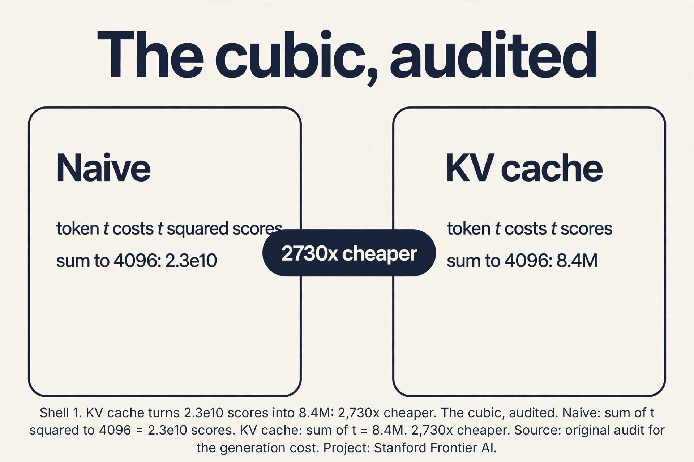

### Subchapter: the cache in bytes

Big-O hides the bytes. Price them for a 7B model: d = 4096, 32
layers, 32 heads, head dim 128, fp16. Per token per layer: K is 32
heads x 128 x 2 bytes = 8,192. V the same: 16,384 bytes per
layer. Times 32 layers: 524,288 bytes = 512 KB per token. A 4,096-token
sequence: 2 GB. Batch of 10: 20 GB, plus 14 GB of weights = 34 GB
on an 80 GB GPU: fits, barely, before activations and overhead.
This is why the lecture's "batch of 10, not 1,000" is not
rhetoric: each sequence is a 2 GB object. Bytes, not big-O, set
the batch size.

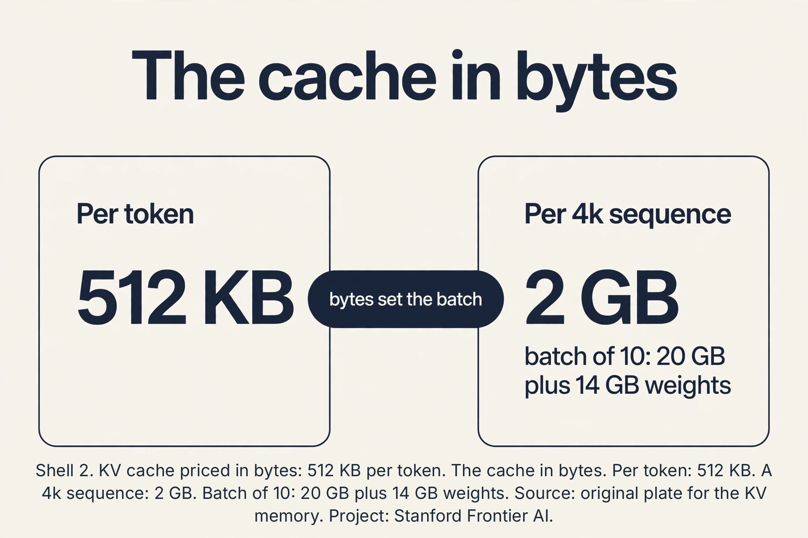

## The KV cache

Keys and values for tokens 1-100 are identical whether you are
generating token 101 or 102. So save them. The **KV cache** stores
every layer's keys and values for all past tokens in GPU memory.
Generating token t+1 needs only its own query, key, and value:
attend the new query to the cached keys, mix the cached values,
append the new K/V to the cache. Per-token cost drops from O(t^2)
to O(t). The cubic becomes quadratic.

The lecture's framing: in some cases, just saving the KV cache
for all the sequences is what fills the GPU. The cache is the
state of the conversation, and state is memory.

. The KV cache. Keys and values of past tokens are stored, not recomputed. Per-token cost falls from O(t^2) to O(t). Source: original plate for Stanford Frontier AI.")

The price is memory. The cache is linear in sequence length T, and
the lecture stresses how heavy it is: saving K and V for every head
of every layer for one long sequence can fill most of a GPU's
memory. Then batch size collapses: you can serve 10 sequences, not
1,000. Small batches starve the GPU's compute units (nothing to
parallelize across), so inference becomes **memory-bound**: the GPU
waits on memory bandwidth, not arithmetic. The lecture's chain:
KV cache fills memory -> batch shrinks -> parallelism dies ->
throughput dies. Reducing the cache is the highest-impact
systems work in LLM serving.

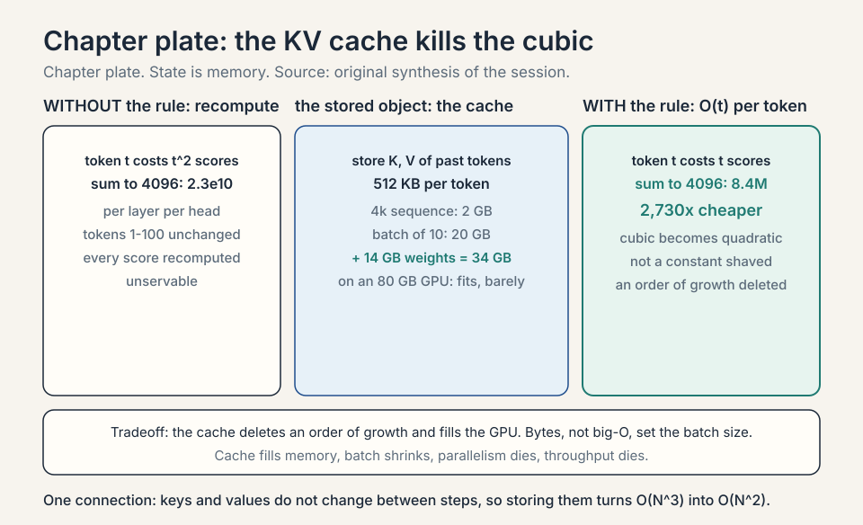


## Attention variants: shrink the cache

The lecture's theme for this section: co-design the architecture
with the GPU's properties. Every variant below shrinks the
cache or its traffic.

**Grouped-query attention** (GQA): share one key/value head across
a group of query heads. With 32 query heads and 8 KV heads, the
cache shrinks 4x. The queries keep their expressiveness (each still
attends differently). Only the stored K/V compress. Quality barely
moves. Memory moves a lot.

### Subchapter: GQA, counted

Count the diet. 32 query heads, 32 KV heads: 512 KB per token (the
audit above). GQA with 8 KV heads: K per layer is 8 heads x 128 x
2 bytes = 2,048. V the same: 4,096 bytes per layer. 32 layers:
131,072 bytes = 128 KB per token. Exactly 4x smaller. A 4,096-token
sequence: 512 MB instead of 2 GB. Batch of 10: 5 GB instead of 20.
The queries keep all 32 heads: each still attends with its own
pattern. Only the stored keys and values compress. The lecture's
claim "quality barely moves" is the empirical surprise: the KV
content is redundant across heads, the query patterns are not.

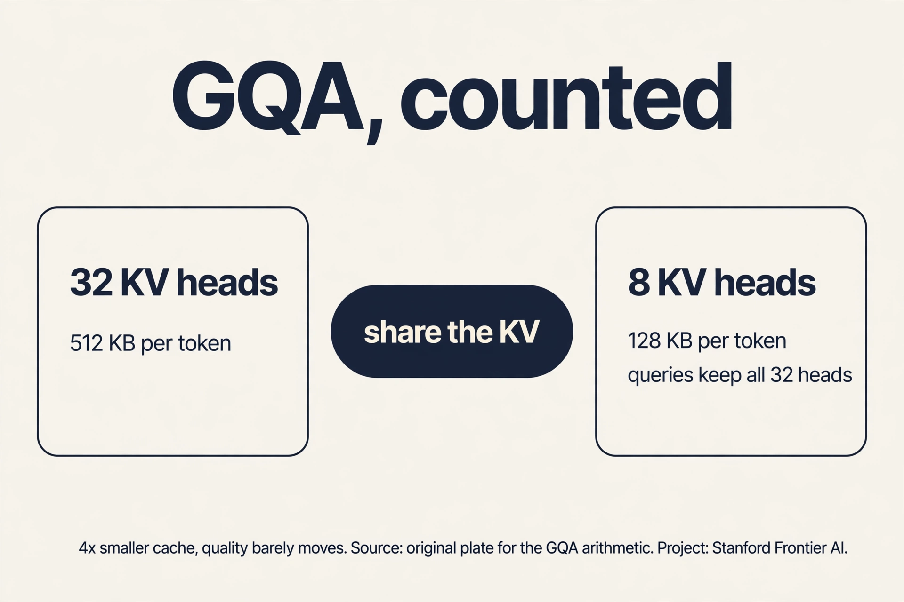

### Subchapter: MQA, the extreme

**Multi-query attention** (MQA, Shazeer 2019): one KV head for
all query heads. The cache shrinks 32x (512 KB to 16 KB per
token). Quality drops a little more than GQA: one shared KV
representation is a real bottleneck. MQA was the first answer
(Falcon, PaLM). GQA replaced it as the sweet spot: 4-8x
smaller cache with no measurable quality loss. The spectrum:
MHA (32 KV heads, full quality, full cache), GQA (8, the
default), MQA (1, the extreme). Pick by the memory budget.

### Subchapter: MLA, compress the latent

**Multi-head latent attention** (MLA, DeepSeek-V2, 2024): do
not store K and V at all. Store a compressed **latent** vector
c (512 dims) per token per layer, and reconstruct K and V
with learned up-projections at attention time. The cache per
token per layer: 512 x 2 bytes = 1 KB, vs 16 KB for MHA at
d=4096 (32 heads x 128 x 2 x 2). Roughly 16x smaller than
MHA, 4x smaller than GQA-8. The trick that makes it work:
absorb the up-projection into the query projection
algebraically, so the reconstruction costs almost nothing at
runtime. Positions need care: RoPE does not commute with the
compression, so MLA uses **decoupled RoPE** (a separate small
rotary path). DeepSeek-V3 ships MLA in production at 671B
parameters (verified October 2026). The lecture's co-design
theme, taken to its conclusion: change what is stored, not
just how much.

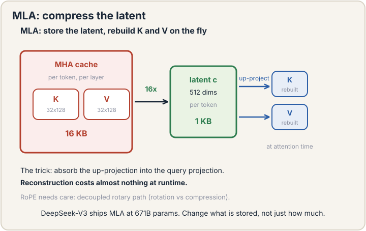

### Subchapter: CLA, share across layers

**Cross-layer attention** (CLA, MIT, NeurIPS 2024): neighboring
layers share one KV cache. Only half the layers compute their
own K and V. The others reuse. Queries stay per-layer (each
layer still attends its own way). CLA-2 halves the cache with
~0.04 perplexity cost on 1B/3B models. Apple's 2025 on-device
model used it to cut KV memory ~37% (reported 2025). CLA
stacks with GQA/MQA (orthogonal axes: share across heads,
share across layers). The catch: it must be baked into
training. You cannot retrofit it onto a trained model.

### Subchapter: quantize the cache

The cache is fp16 by default. Store it in **fp8**: halves the
bytes, minimal quality loss (the cache tolerates low
precision: it is read once per token, not accumulated).
**KIVI** (2024): asymmetric quantization (keys per-channel,
values per-token) down to 2-bit with small accuracy loss.
The pattern: the cache is the most compressible state in
the system because errors do not compound across steps the
way weight errors do. Production serving (TensorRT-LLM,
vLLM) ships fp8 KV cache as a flag. Another ~2x on top of
GQA.

### Subchapter: evict the cache

When the cache still overflows, evict. **H2O** (2023): keep
the tokens with the highest cumulative attention scores
(the "heavy hitters"), evict the rest. **StreamingLLM**:
keep the first 4-8 sink tokens (L14's attention sink) plus a
sliding window of recent tokens. Both hold quality on
long-context QA while capping memory at a fixed budget.
The price: eviction is lossy and irreversible. A question
about an evicted token cannot be answered. The dial: the
budget. Infinite budget is exact. Finite budget is a bet
that attention scores predict future relevance.

### Subchapter: the cache diets, compared

| Diet | Cache per token (7B, fp16) | Quality cost | Retrofit? |
|---|---|---|---|
| MHA (baseline) | 512 KB | None | N/A |
| GQA-8 | 128 KB | ~None | No (train-time) |
| MQA | 16 KB | Small | No |
| MLA | ~32 KB equiv | ~None | No |
| CLA-2 | 1/2 of base | ~0.04 ppl | No |
| fp8 cache | 1/2 of base | Minimal | Yes (inference flag) |
| Eviction | Fixed budget | Task-dependent | Yes |

Stack them: GQA-8 + fp8 + eviction is the production
combination. Each row attacks a different axis: heads,
layers, precision, length.

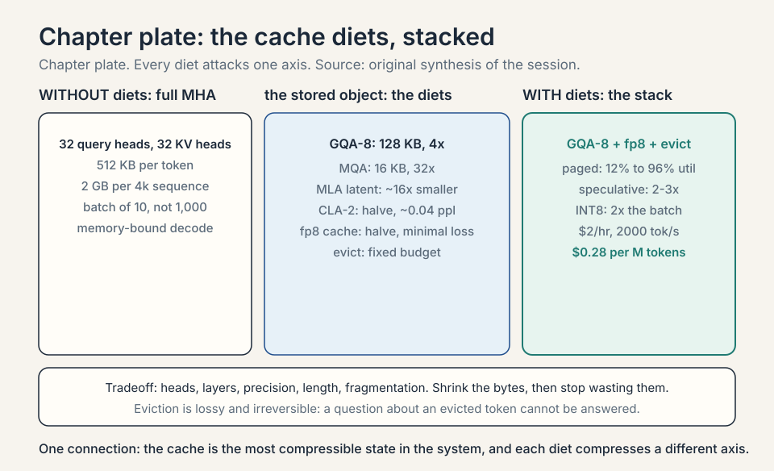


## PagedAttention: the OS trick

Even with a small cache, memory management wastes it. The
naive allocator reserves a contiguous chunk per request sized
for the maximum sequence length: a 100-token request holds a
4,096-token reservation. **PagedAttention** (vLLM, Kwon et
al., SOSP 2023): split the cache into fixed-size **blocks**
(pages), allocate on demand, map logical positions to
physical blocks through a **block table**. Exactly OS virtual
memory, for KV cache.

Work the fragmentation. 10 requests, max length 4,096,
average actual length 500. Contiguous reservation: 10 x 2 GB
= 20 GB reserved, 2.4 GB used: 12% utilization. Paged:
allocate 500 tokens' worth of blocks per request: 2.4 GB
used, ~2.5 GB reserved: 96% utilization. The paper reports
2-4x higher serving throughput at equal latency (verified
via arxiv.org, October 2026). **Copy-on-write** shares
prompt blocks across beam-search branches: N beams share one
prompt's blocks until they diverge. The lesson: the cache
diet shrinks the bytes. Paging stops wasting them.

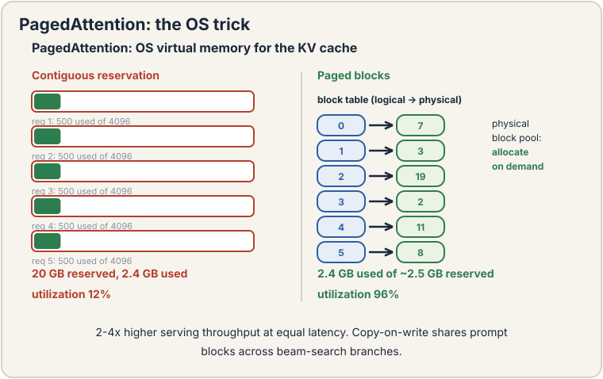

### Subchapter: continuous batching

Static batching waits for the slowest request: a 10-token
answer waits for the 4,000-token answer in its batch.
**Continuous batching** (Orca, 2022): schedule at the
iteration level. Each decode step, the batch is whatever
requests are alive: finished requests leave, new ones join
immediately. The GPU never idles on a straggler. Combined
with paging, this is the modern serving stack (vLLM,
TensorRT-LLM, SGLang). Throughput gains: 2-4x over static
batching on mixed workloads. The lecture's "serve a million
users" is this machinery, not a bigger GPU.

## Speculative decoding: draft, then verify

The decode phase generates one token per forward pass: the
GPU does a full model pass for one token's worth of work.
**Speculative decoding**: a small **draft** model proposes k
tokens cheaply, the big model **verifies** them in one
parallel forward pass (it can: verification is prefill-like,
all k tokens at once). Accept the longest correct prefix,
keep one extra token the big model generates.

Work the acceptance. Draft proposes 4 tokens. Big model
verifies: tokens 1-3 match what it would have generated,
token 4 does not. Accept 3, generate token 4's replacement
plus token 5 in the same pass. Cost: ~1 big forward pass
for 4 tokens instead of 4 passes. Speedup: 2-3x typical,
bounded by the draft's accuracy. The output is identical to
non-speculative decoding (the big model decides every
token): it is exact, not approximate. The draft can be a
small model, an n-gram table, or the big model's own early
layers. The lecture does not cover this. It is the
decode-phase complement to the lecture's cache work.

### Subchapter: the draft zoo

What makes a good draft? Three species. **Small model**:
a 1B model drafting for a 70B: high acceptance (similar
distribution), real cost (a second model to serve).
**N-gram table**: memorize common continuations ("the
United States of"): free, low acceptance on hard text.
**Early-exit**: use the big model's own first layers as
the draft: no second model, medium acceptance. The
acceptance rate is the whole game: 80% acceptance on
5-token drafts gives ~4x. 30% gives ~1.4x. Measure on your
traffic: code (repetitive) drafts well, creative writing
does not.

### Subchapter: disaggregated serving

Prefill is compute-bound, decode is memory-bound. One GPU
doing both compromises both. **Disaggregated serving**:
prefill GPUs (H100s, compute-heavy) and decode GPUs
(cheaper cards, memory-bandwidth-bound) as separate
pools, with the KV cache shipped between them. The
cache transfer is the price: gigabytes per request over
the network. Worth it at scale: each pool runs at its own
optimal batching. This is the serving architecture the
2025-2026 inference companies converged on [uncertain:
vendor internals vary. The pattern is public in
engineering blogs].
## Mixture of experts: scale parameters, not compute

**Mixture of experts** (MoE): instead of one big MLP per block,
have E expert MLPs and a router that sends each token to the top-k.
Parameters grow E-fold. Compute per token stays ~flat because each
token visits k experts. The lecture's example: each token routed
to 8 of 128 experts. The production instance: Mixtral 8x7B routes
each token to 2 of 8 experts (verified October 2026).

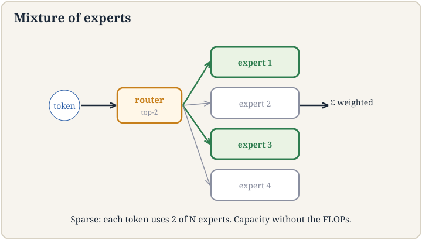

### Subchapter: the router, worked

The router is one linear layer: scores = softmax(x W_r), E
logits. Take top-k, renormalize, weight the experts' outputs.
Work the toy. E = 4, k = 2. Token x gives router logits
[2.0, 1.0, 0.5, -1.0]. Softmax: [0.61, 0.22, 0.14, 0.03].
Top-2: experts 1 and 2, renormalized [0.731, 0.269]. Output =
0.731 * Expert1(x) + 0.269 * Expert2(x). Experts 3 and 4 are
not computed. The router's 4 x d parameters are negligible.
Its decisions are everything: route badly and capacity is
wasted.

### Subchapter: token-choice vs expert-choice

**Token-choice** (standard): each token picks its top-k
experts. Experts can flood (too many tokens) or starve.
**Expert-choice**: each expert picks its top-k tokens. Load
is perfectly balanced by construction (each expert gets
exactly k tokens), but tokens can be orphaned (no expert
picks a weird token) or duplicated. Token-choice dominates
production (Mixtral, DeepSeek) with load-balancing fixes.
Expert-choice is the cleaner theory. The choice is
load-balance-by-loss vs load-balance-by-design.

### Subchapter: the load-balance loss, worked

Token-choice floods. The **auxiliary load-balance loss**
penalizes uneven routing: L_aux = E * sum_i (fraction of
tokens to expert i) * (mean router probability for expert i).
Uniform routing gives the minimum. Work the toy. 4 experts,
100 tokens. Balanced: 25 each, mean prob 0.25 each: L_aux =
4 * (0.25*0.25) * 4 = ... the standard form gives 1.0 at
perfect balance, higher when skewed. Flooded: 97 tokens to
expert 1: the product spikes, the loss bites. The weight is
small (0.01): enough to balance, not enough to distort the
main objective. DeepSeek-V3 replaced this with an
**auxiliary-loss-free** trick: a per-expert **bias** added to
the router scores, nudged up for underused experts and down
for overused ones (verified October 2026). Same balance, no
gradient interference with the main loss.

### Subchapter: fine-grained experts, DeepSeek's move

Mixtral: 8 big experts, top-2. DeepSeek-V3: **256 fine-grained
experts**, top-8, plus 1 **shared** expert that every token
uses (verified October 2026). Each expert is small (2,048
dim). More, smaller experts specialize better: one expert
can own "Python syntax" while another owns "French verbs".
The shared expert absorbs the common knowledge so the
routed experts can specialize. Total: 671B parameters, 37B
active per token. The lecture's "very subtle" training note
is this whole subchapter: routing, balance, granularity,
and the bias trick that replaced the aux loss.

### Subchapter: the capacity factor and token dropping

Flooded experts cannot take infinite tokens. The **capacity
factor** caps tokens per expert at (tokens/E) * factor
(factor 1.0-1.25). Overflow tokens are **dropped**: they skip
the MoE layer (pass through the residual). Dropping loses
information. Too-high capacity wastes compute on padding.
**Dropless** MoE (DeepSeek): no cap, no dropping. Instead,
schedule expert computation to handle the imbalance. The
tradeoff is systems complexity vs information loss. The
interview read: dropping is the silent quality tax of naive
MoE serving.

### Subchapter: expert parallelism

8 experts fit on one GPU. 256 do not. **Expert parallelism**:
place different experts on different GPUs, route tokens
across the network (**all-to-all** communication). The
network becomes the bottleneck: each token's dispatch and
combine cross GPU boundaries. DeepSeek's **DualPipe**
(verified October 2026) overlaps this communication with
computation bidirectionally. The systems price of MoE is
paid here: dense models need tensor parallelism too, but
MoE's all-to-all is spikier and harder to hide.

### Subchapter: MoE, the full price

MoE buys parameter scale at flat per-token compute and pays
four prices. One: **memory**: all E experts sit in GPU
memory (any token may visit any expert). Mixtral needs
~94 GB for 46.7B params: two GPUs or offloading. Two:
**load balance**: the aux loss or bias trick, tuned forever.
Three: **communication**: all-to-all at 256 experts. Four:
**training subtlety** (the lecture's warning): routers can
collapse (all tokens to one expert), experts can die
(never selected, never trained). The standard defenses:
noisy routing during training, the balance loss, and
initializing from a dense warmup. MoE is not a free
lunch. It is a systems project that happens to train a
model.

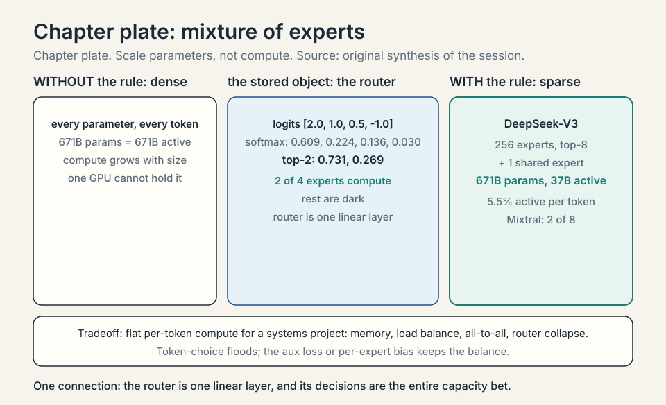


## Quantization for serving

Weights in fp16 are the default. **Quantization** shrinks
them for serving: less memory, more batch, faster loads.

### Subchapter: INT8 and FP8, the easy wins

**INT8**: 2x smaller weights, ~2x the batch. Quality loss is
small for inference (activations stay fp16). **FP8**: the
2026 training standard (DeepSeek-V3 trained in FP8,
verified October 2026): better dynamic range than INT8 for
gradients, natively supported on H100+. For pure serving,
INT8/FP8 weight-only quantization is close to free: the
accuracy delta is within noise on most benchmarks. The
rule: quantize weights first, activations later, and
measure on your eval.

### Subchapter: GPTQ and AWQ, the 4-bit answers

**GPTQ**: 4-bit weights via layer-wise quantization that
minimizes the reconstruction error (Hessian-weighted).
**AWQ**: 4-bit that protects the 1% of salient weights
(the ones with large activations) in higher precision.
Both: ~4x smaller weights, small quality loss, needs
calibration data. A 70B model in 4-bit fits on one 80GB
GPU (35 GB weights). The price: slower dequantization
kernels (mitigated by fused kernels), and 4-bit training
is not a thing: quantize after training, always.

### Subchapter: the serving cost model

Tie it together in dollars. A 7B fp16 model on one A100
80GB: ~$2/hour rented. Throughput with the full stack
(GQA, paging, continuous batching): ~2,000 tokens/second
(illustrative: varies by sequence length and batch).
Cost per million tokens: 2,000 tok/s x 3,600 = 7.2M
tokens/hour, $2/7.2M = $0.28 per million tokens. The
levers in order of impact: batch size (throughput scales
with batch until bandwidth saturates), quantization (2-4x
the batch), the cache diet (GQA halves the per-sequence
bytes). Every optimization in this lesson is a term in
this division. The interview read: when asked about
serving cost, start from tokens/second per GPU, not from
the model size.

## The shock: in-context learning

Now the pivot from systems to behavior. Take the trained model,
freeze every weight, and prompt it:

```ascii
Translate English to French:
  sea -> mer
  sky -> ciel
  cheese ->
```

The model answers "fromage". No gradient step. No weight moved.
Three examples in the prompt taught it the task. This is
**in-context learning** (ICL): few-shot learning with frozen
weights. The lecture presents it as the shock of the GPT-3 era:
nobody trained for this. It emerged from next-token prediction at
scale. The lecture's line: "you never update the model parameters."

Why it works, roughly: the prompt's examples are processed by the
same attention machinery as everything else. Attention can
implement "find the pattern in the recent examples and continue
it": the query for the blank position matches the example slots,
and the values carry the mapping. The model learned, during
pre-training, to complete patterns. Few-shot prompts are patterns
with a job hidden inside. Scale matters: small models barely do
this. Large ones do it reliably. The lecture's honest note: the
mechanism is still partly mysterious, and ICL is brittle: change
the example order or wording and accuracy swings.

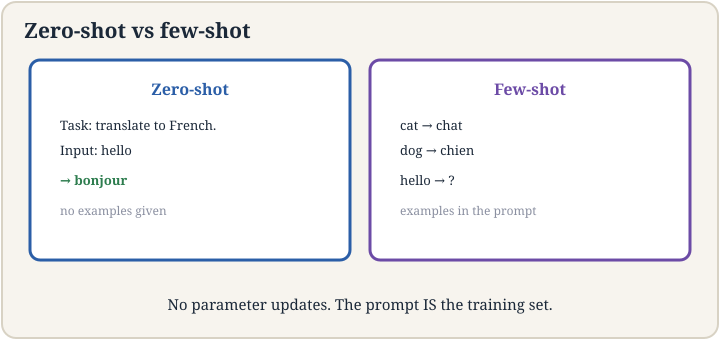

### Subchapter: zero-shot, few-shot, chain-of-thought

**Zero-shot**: task description only ("Translate English to
French: cheese ->"). The model must infer the task from the
instruction. **Few-shot**: description plus examples (the
lecture's sea/sky/cheese). Accuracy climbs with examples,
then plateaus. **Chain-of-thought prompting**: add worked
examples with reasoning steps ("First identify the word,
then recall the French..."). The model imitates the
reasoning format and answers better on math and logic. The
lecture's note: you can even specify the output format in
the description ("respond in JSON"): the model complies.
The ladder: zero-shot for easy tasks, few-shot for format,
CoT for reasoning. Each rung costs prompt tokens.

### Subchapter: the industry shock, the lecture's story

The lecture frames ICL as an industrial discontinuity. The
old way: collect domain data, label it, train a model,
deploy a separate specialized model per company per task.
Months of work per task. The new way: one off-the-shelf
model plus prompts (plus **scaffolding** for agentic tasks:
the prompt plus the loop that calls tools). Days of work
per task. The lecture's line: this "fundamentally changed
the convenience of applying these models in industry."
The economics flipped: the model is fixed capital, the
prompt is the variable input. Fine-tuning did not die
(below), but it stopped being the default first move.

### Subchapter: emergence and scale

ICL is not linear in model size. Below ~10B parameters it
barely works. GPT-3 at 175B did it reliably. The capability
appears suddenly with scale: an **emergent** behavior.
Why: pattern-completion at few-shot quality needs the
model to hold the task, the examples, and the mapping in
its activations simultaneously: capacity-gated. The
practical read: do not judge ICL on small models. The
phenomenon the lecture calls the biggest surprise of the
GPT-3 era only exists past the scale threshold. This is
also why the mechanism stays partly mysterious: it was
never trained for, so there is no training curve to
inspect. Only the emergent capability.

### Subchapter: the brittleness, itemized

ICL is free and fragile. Three documented failure shapes. Order:
reversing the example order can swing few-shot accuracy by double
digits on some tasks. The model reads position as signal. Wording:
"Translate English to French" vs "English: sea, French: mer" can
move accuracy more than adding examples does. Recency: the model
over-weights the last example: a misleading final example corrupts
the pattern. The decision rule for production: prototype with ICL
(zero training, instant iteration), ship with SFT (the behavior is
in the weights, not in a prompt you hope nobody rewords). ICL is
the sketchpad. SFT is the ink.

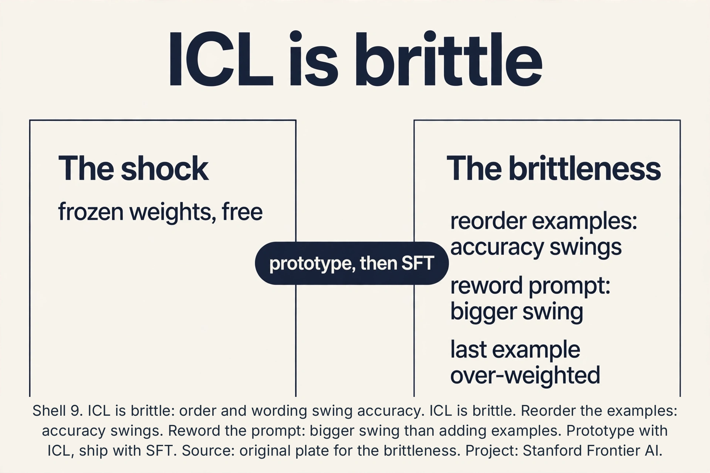

### Subchapter: prompt engineering is programming

The brittleness made a discipline: **prompt engineering**.
Delimiters (###, """), role prompts ("You are a translator"),
format specifications (JSON schemas), negative instructions
("do not explain, only translate"). Each is a control
structure for a computer that runs on English. The mature
view: prompts are programs, the model is the interpreter,
and the brittleness is the language's undefined behavior.
Version your prompts. Test them like code. The lecture's
scaffolding note points here: for agentic tasks, the prompt
plus the tool loop is the application.

### Subchapter: the context window tax

Every example costs tokens, forever. 20 examples at 100
tokens: 2,000 tokens of overhead per query. At 4k context,
half the window is examples. At 128k, the overhead is
noise. The tax bites twice: latency (prefill reads the
examples every query) and money (per-token pricing). The
decision rule from the Q&A below: prototype with ICL,
ship with SFT. The context window grew (128k is standard
in 2026), which softened the tax but did not remove it:
2,000 tokens x 1M queries/day is still 2B tokens/day of
overhead. Retrieval (L13) is the alternative for facts:
update the store, not the prompt.

### Subchapter: ICL vs SFT vs RAG, the adaptation decision

Three ways to adapt a frozen model. **ICL**: examples in
the prompt. Cost: tokens per query. Best for: exploration,
prototypes, tasks that change daily. **SFT**: behavior in
the weights. Cost: human pairs + training. Best for:
stable tasks, format, reliability. **RAG**: facts in the
store. Cost: index + retrieval. Best for: changing facts,
private data, citations. The lecture covers ICL and SFT.
L13 covers RAG. The production answer is usually two of
the three: SFT the format, RAG the facts, ICL the
per-query variables. Match the method to the change rate:
daily changes go in the prompt, weekly facts in the
store, stable behavior in the weights.

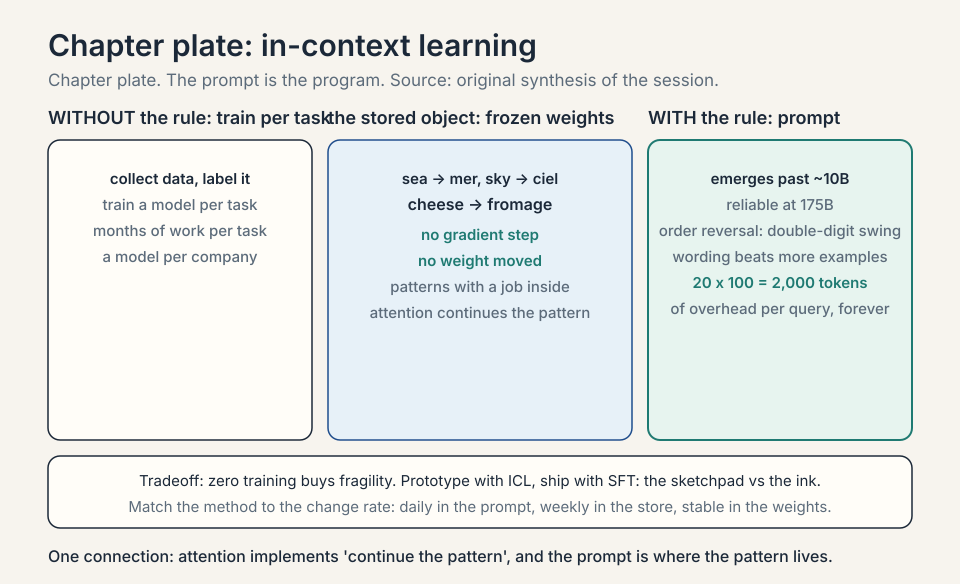


## SFT: teach the format

Pre-trained models complete text. Users want assistants that
follow instructions. **Supervised fine-tuning** (SFT), also called
instruction tuning: collect (instruction, response) pairs written
by humans, and train the model to predict the response given the
instruction, with the usual cross-entropy loss. Ten thousand to a
million pairs. The model learns the *format* of helpfulness:
answer the question, be concise, refuse safely.

The lecture's framing: pre-training teaches the world. SFT teaches
the job description. The knowledge comes from pre-training. SFT
barely adds facts. What it adds is behavior: which of the many
possible completions is the one a user wants. The price: SFT
narrows the model. Overdo it and the model forgets things it knew
(catastrophic forgetting) or becomes sycophantic. And the pairs are
human-written: expensive, slow, and the quality ceiling of the
whole step.

The lecture's loss, exactly: collect (x = instruction, y =
answer) pairs, continue training from the pretrained checkpoint,
and pay the NLL (negative log-likelihood) of y given x **only**. The instruction x is
context (seen, not predicted). Per token: sum_t log p(y_t |
x, y_<t>). The lecture's line: "anything that looks like this
is called supervised fine tuning."

 pairs. Pre-training teaches the world. SFT teaches the job description. Source: original plate for Stanford Frontier AI.")

### Subchapter: the loss mask, worked

Why mask x? The instruction is given at test time: predicting
it teaches nothing and wastes capacity. Work the toy. Pair:
x = "Translate: sea", y = "mer". Tokens: [Translate, :, sea,
mer]. Loss positions: only "mer". The model learns p(mer |
Translate, :, sea). If x were unmasked, the model would also
learn p(sea | Translate, :) and p(: | Translate): modeling
the instruction distribution, which is fixed at test time.
The mask focuses every gradient step on the response. In
code: labels = [-100, -100, -100, id(mer)]. -100 is PyTorch
for "ignore this position".

### Subchapter: chat templates

Instruction pairs need format. The **chat template** wraps
(x, y) in role tokens: `<|user|>Translate: sea<|assistant|>mer`.
The model learns the turn structure: user speaks, assistant
answers. Different labs use different tokens (ChatML,
Llama-3's headers). The template is part of the model: serve
with the wrong template and performance drops (the model
never saw that format). Fine-tuning a base model? Pick the
template first. Everything downstream (evals, serving,
prompts) assumes it.

### Subchapter: data quality over quantity

SFT pairs are human-written: expensive. The **LIMA** finding
(Zhou et al., 2023): 1,000 carefully curated pairs beat
50,000 noisy ones. The model's knowledge is already in the
weights: SFT only needs to demonstrate the *format* of
helpfulness, and 1,000 excellent demonstrations suffice.
The curation bar: diverse instructions, correct responses,
consistent style. The failure mode is scale without curation:
52k scraped pairs teach the model to imitate mediocrity.
The lecture's "expensive, slow" price is the reason: spend
the budget on quality, not count.

### Subchapter: full fine-tune vs LoRA

Full SFT updates all 7B parameters: needs the optimizer
states (~84 GB, L14's math). **LoRA** (Hu et al., 2021):
freeze the weights, train low-rank adapters. For each
weight matrix W (d x d), learn A (d x r) and B (r x d),
r = 8-64: the update is BA, rank r. Trainable parameters:
2 * d * r per matrix vs d^2. At d = 4096, r = 16: 131k vs
16.8M per matrix: 128x fewer. Quality: within noise of full
fine-tuning for most tasks. **QLoRA**: LoRA on a 4-bit
quantized base: fine-tune 70B on one GPU. The interview
read: LoRA is the default for adaptation on a budget.
Full fine-tuning is for when you own the cluster.

### Subchapter: multi-turn SFT

Real assistants hold conversations. **Multi-turn SFT** trains
on (conversation, ) pairs: user turn, assistant turn, user
turn, assistant turn. The loss mask covers all assistant
tokens, ignores all user tokens. The model learns turn-taking:
answer, then wait, then answer in context. The failure mode
is role confusion: the model continues the user's turn
instead of answering. The fix is the chat template (above):
explicit role tokens make the turn structure unambiguous.
Single-turn SFT teaches answering. Multi-turn teaches
conversing. Ship the latter.

### Subchapter: where the pairs come from

Human annotation is the gold standard and the bottleneck.
Three cheaper sources. **Distillation**: prompt a strong
model (GPT-4-class) for (instruction, response) pairs, train
the small model on them. Cheap, effective, and legally
murky (check the teacher model's terms). **Self-instruct**:
the model generates its own instructions, then answers
them, then filters. Bootstrapping with quality control.
**User logs**: production conversations, filtered and
rewritten. The best data is real. The ranking: human >
distilled > self-instruct, in quality. Reversed in cost.
The LIMA lesson applies to all three: 1,000 excellent
pairs beat 50,000 mediocre ones regardless of source.

### Subchapter: the forgetting tax, priced

SFT narrows the model. **Catastrophic forgetting**: the
instruction distribution overwrites pretraining knowledge.
Measure it: benchmark the base model and the SFT model on
the same knowledge evals. Typical: small drops (1-3 points)
with good SFT, large drops with aggressive SFT (high LR,
many epochs). The defenses: mix pretraining data into SFT
(5-10% of the batch), low learning rates (1e-5 vs 3e-4),
few epochs (1-3). The lecture's framing again: SFT teaches
the job description. Overteach it and the employee forgets
everything else.

### Subchapter: the post-training stack

The full pipeline, in order. **Pretrain**: next-token on
trillions of tokens. Teaches the world. **SFT**: instruction
pairs. Teaches the format. **RL** (lecture 17): preferences
or verifiable rewards. Teaches taste and reasoning. Each
stage is cheaper than the last and more targeted. Skip SFT
and go straight to RL (DeepSeek-R1-Zero did): possible, but
the model starts from a worse behavioral prior and the RL
must discover the format too. The stack is the standard
because each layer solves one problem well.

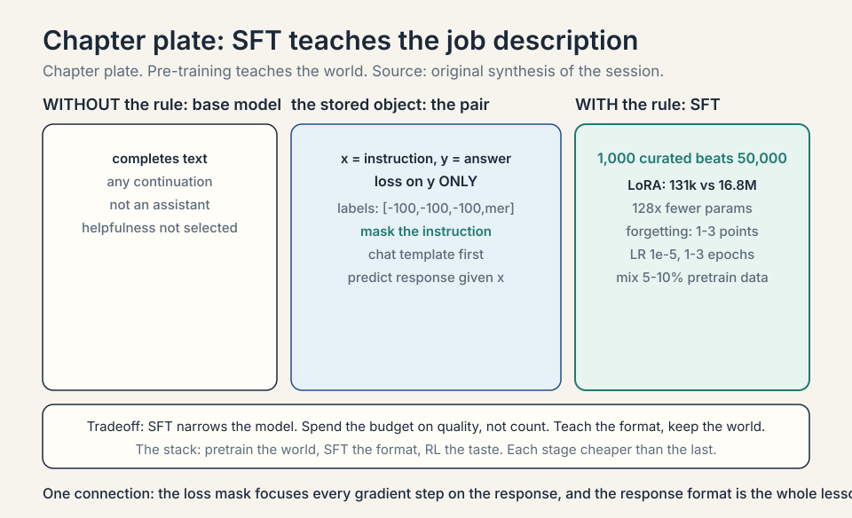

## The honest price

Efficiency buys servability and pays in complexity: GQA's sharing,
MoE's routing and load balance, the KV cache's memory hunger that
no variant fully removes. ICL buys task flexibility with zero
training and pays in brittleness: prompt wording swings accuracy,
long example lists eat the context window, and nobody can fully
explain why it works. SFT buys helpful behavior and pays in human
hours per pair plus the narrowing tax. The through-line: every step
after pre-training is about spending the model's capability
wisely, because the capability itself was the expensive part.

The systems price deserves its own line: PagedAttention,
continuous batching, and speculative decoding are pure
engineering. They change no weights and no quality. They are
the difference between a demo and a product. The lecture's
co-design theme is the summary: the architecture, the GPU,
and the serving stack are one system. Optimize them together.

### Subchapter: co-design, the lecture's thesis made concrete

The lecture's theme: "a lot of co-design of the architecture
with some of the properties of the GPUs." Three instances
from this lesson. **FlashAttention**: the tiling follows the
GPU's SRAM size (192 KB per SM on A100): the algorithm is
shaped by the hardware. **MoE all-to-all**: the expert count
and placement follow the cluster's interconnect (NVLink vs
InfiniBand): the architecture is shaped by the network.
**MLA's absorption trick**: the up-projection folds into the
query projection algebraically: the math is shaped to dodge
a memory read. The interview read: when asked "how would you
make X faster", start from the hardware's bottleneck
(compute, memory bandwidth, network), then change the
algorithm to dodge it. That is co-design.

## Mapping back

| Idea | Pain it answers | How |
|---|---|---|
| KV cache | Naive generation is O(N^3): recompute everything per token | Cache K/V: per-token O(t^2) -> O(t); memory linear in T |
| Prefill vs decode | One optimization cannot fit both phases | Prefill compute-bound (TTFT), decode memory-bound (TPOT); optimize separately |
| Memory-bound serving | Cache fills the GPU: batch of 10, not 1,000 | Diagnosis: memory, not compute, is the bottleneck; parallelism starves |
| GQA | KV cache too big | Share KV heads across query groups: 4x smaller cache, quality holds |
| MQA | GQA not small enough | One KV head: 32x smaller, small quality cost |
| MLA | Store less, not just share | Latent vector per token, reconstruct K/V: ~16x smaller than MHA |
| CLA | Layers duplicate the cache | Share KV across layers: half the cache, baked into training |
| KV quant | fp16 cache is fat | fp8: half the bytes, minimal loss; inference flag |
| Eviction | Cache still overflows | Keep heavy hitters + sinks; fixed budget, lossy |
| PagedAttention | Contiguous reservation wastes 88% | Block tables, allocate on demand: 96% utilization, 2-4x throughput |
| Continuous batching | Stragglers idle the GPU | Iteration-level scheduling: the batch is whoever is alive |
| Speculative decoding | One token per forward pass | Draft k tokens, verify in one pass: 2-3x, exact output |
| MoE | Want 8x parameters at 1x compute | Router sends each token to top-k experts; price: load balance, memory, all-to-all |
| Fine-grained MoE | Big experts specialize poorly | 256 small experts + shared: DeepSeek-V3, 37B active of 671B |
| Quantization | fp16 weights are fat | INT8/FP8 ~free; GPTQ/AWQ 4-bit: 70B on one GPU |
| ICL | New task, no training budget | Frozen weights, examples in prompt: "cheese ->" gets "fromage"; brittle but free |
| Zero/few-shot | Even examples cost tokens | Description only, then examples; CoT for reasoning |
| SFT | Base models complete; users want assistants | (Instruction, response) pairs, loss on y only; teaches the job description, not the world |
| LoRA | Full SFT needs a cluster | Rank-r adapters: 128x fewer params, quality within noise |

> [!QA]
> Q: What is the KV cache and why does it make inference memory-bound?
> A: During generation, each token's keys and values never change once computed, so the cache stores them instead of recomputing: per-token cost drops from O(t^2) to O(t). The cache grows linearly with sequence length across every layer and head, and the lecture stresses it can fill most of GPU memory for a single long sequence. Small memory headroom means small batches (10 sequences, not 1,000), which means nothing to parallelize across, so the GPU's compute units idle waiting on memory bandwidth. Memory-bound, not compute-bound.
> Follow-up: How does GQA help?
> A: Grouped-query attention shares each key/value head across a group of query heads: 32 query heads with 8 KV heads cuts the cache 4x. Queries keep their distinct attention patterns. Only the stored keys and values compress. The lecture presents it as the highest-impact cache diet with minimal quality cost.

> [!QA]
> Q: How can a model learn a task with frozen weights in in-context learning?
> A: The task is encoded in the prompt as examples, and attention implements pattern continuation. For "sea -> mer, sky -> ciel, cheese ->", the blank position's query matches the example slots, and the values carry the English-to-French mapping the model must extend. Pre-training on billions of pattern-completion instances taught the machinery. The prompt supplies the pattern. No weights move. The lecture flags the mystery: this was not trained for explicitly, it emerged with scale, and it is brittle to wording and order.
> Follow-up: When does ICL fail?
> A: When the pattern needs more examples than fit in context, when the task contradicts pre-training priors too strongly, or when the wording buries the pattern. Small models barely do ICL at all: it is a scale-emergent capability. For reliability on a fixed task, SFT or fine-tuning beats prompting.

> [!QA]
> Q: What does SFT add that pre-training does not?
> A: Behavior, not knowledge. Pre-training teaches the world: facts, language, reasoning patterns. SFT on (instruction, response) pairs teaches the job description: answer the question directly, follow the format, refuse safely. The lecture's line: pre-training teaches the world, SFT teaches the format of helpfulness. SFT uses 10K-1M human-written pairs, a tiny fraction of pre-training data, because it steers rather than builds.
> Follow-up: What is catastrophic forgetting in SFT?
> A: Over-training on the instruction pairs erodes pre-training knowledge: the model gets helpful-shaped but dumber. The narrow pair distribution overwrites broad capabilities. Mitigations: mix pre-training data into SFT, keep SFT short, use low learning rates. It is lecture 6's bias-variance in new clothes: fit the instructions too hard and lose the world.


> [!QA]
> Q: Walk me through the mechanism: verify the 2.3e10 and the KV-cache savings.
> A: Naive: token t costs t^2 scores. Sum t^2 from 1 to 4096 = 4096*4097*8193/6 = 22,914,881,536 ≈ 2.29e10 per layer per head. KV cache: token t costs t scores (one query against t cached keys). Sum t = 4096*4097/2 = 8,390,656 ≈ 8.4M. Ratio: 2.29e10/8.39e6 = 2,730x. The cache deletes an order of growth, not a constant. That is why naive generation is unservable and cached generation ships.
> Follow-up: What does the cache not fix?
> A: The per-token O(t) and the memory: 8.4M scores per layer per head is still quadratic in total, and the cache itself is 2 GB per 4k sequence. GQA, eviction, and compression attack what the cache leaves behind.

> [!QA]
> Q: Applied design: serve 4k-context chat on one 80GB GPU with a 7B fp16 model. What is the max batch, and what binds?
> A: Weights: 14 GB. KV cache per 4k sequence: 512 KB/token * 4096 = 2 GB. Memory allows (80-14)/2 = 33 sequences, but activations, fragmentation, and overhead pull it to ~10-20 in practice: the lecture's "batch of 10". With GQA-8: 128 KB/token, 512 MB/sequence: ~100+ by memory. What binds at large batch is memory bandwidth: each generated token reads every sequence's full cache, so per-token latency grows with batch * length. Throughput (tokens/s) still rises with batch until bandwidth saturates. Decision rule: batch for throughput, watch per-token latency for the SLA.
> Follow-up: Why not just buy more GPUs?
> A: That is what production does (tensor/pipeline parallel serving), but the bytes-per-token math follows you: it determines how many GPUs per replica and the cost per million tokens. The audit is the pricing model.

> [!QA]
> Q: When does the MoE router fail, and what does it cost?
> A: Three failures. Load imbalance: the router floods one expert, which becomes the straggler while others idle. Fixed with an auxiliary load-balancing loss. Token dropping: over-capacity experts drop tokens, losing information. Fixed with capacity factors above 1. Expert collapse: the router converges to always picking the same experts, wasting the rest. Fixed with noise in routing during training. The standing cost: all 8 experts sit in memory (any token may visit any expert) while each token computes on 2. Memory pays for parameters. Compute pays for 2.
> Follow-up: Why top-2 and not top-1?
> A: Top-1 is cheaper but brittle: a routing mistake sends the token to exactly the wrong expert with no backup. Top-2 gives a weighted blend and a second opinion. The field settled on 2 as the quality/compute sweet spot. Top-1 variants exist for maximum efficiency.

> [!QA]
> Q: Fixed production task: ICL or SFT? Decide with numbers.
> A: ICL: 20 examples at 100 tokens each = 2,000 tokens of prompt overhead on every query, forever. At 1M queries/day, that is 2B prompt tokens/day of pure overhead. SFT: pay the human-pair cost once (10k-1M pairs), then every query is short. SFT wins on reliability (behavior in weights, not in wording) and on serving cost for fixed tasks. ICL wins for exploration: zero training, try 10 task framings in an afternoon. The hybrid the field uses: SFT the format and common cases, ICL the per-query variables.
> Follow-up: The task changes weekly. Does the answer change?
> A: Yes, toward ICL or retrieval: weekly SFT retraining is an ops burden and risks forgetting. If the change is in facts, use RAG (lecture 13): update the store, not the weights. If the change is in format, SFT on the new format with replay of the old. Match the adaptation method to the change rate: prompt for daily, RAG for weekly facts, SFT for stable behavior.

> [!QA]
> Q: Applied design: pick the inference stack for a 70B GQA model serving 32k-context chat. Justify each layer.
> A: Five layers. Cache diet: GQA is already in the weights. Add fp8 KV cache (halves the bytes, inference flag). Memory management: PagedAttention (vLLM): block tables kill the 88% fragmentation waste. Scheduling: continuous batching: stragglers never idle the GPU. Decode speed: speculative decoding with a 1B draft: 2-3x on the decode phase, exact output. Long context: eviction with pinned sink tokens if quality holds on your evals, else pay the full cache. Measure TTFT and TPOT separately: prefill and decode bind on different resources. The lecture's co-design theme: the model, the GPU, and the server are one system.
> Follow-up: The draft model accepts only 40% of tokens. Worth it?
> A: At 40% acceptance on 4-token drafts, expected accepted tokens per pass: ~1.6 plus the bonus token. That is ~2.6 tokens per big-model pass vs 1: still 2.6x on paper, minus draft cost. Worth it if the draft is cheap (small model, fast). If the draft costs half a big pass, the net shrinks. Measure end-to-end TPOT, not acceptance rate: the metric is tokens per second, not draft accuracy.

## Recap: the whole lesson on one screen

1. **The job.** Serve generation without O(N^3) per answer.
2. **Two phases.** Prefill: compute-bound, TTFT. Decode:
   memory-bound, TPOT. Optimize separately.
3. **Naive.** Recompute everything per token. 2.3 x 10^10 scores
   per layer per head at N = 4,096. Unservable.
4. **KV cache.** Store K/V: O(t^2) -> O(t) per token. Memory
   linear in T.
5. **Memory-bound.** Cache fills GPU. Batch collapses to ~10.
   Compute idles. Shrink the cache = serve more.
6. **The diets.** GQA: 4x. MQA: 32x. MLA: latent, ~16x. CLA:
   share layers, 2x. fp8: 2x. Eviction: fixed budget.
7. **Paging.** Block tables, allocate on demand: 96% utilization,
   2-4x throughput. Copy-on-write shares prompts.
8. **Batching.** Continuous: the batch is whoever is alive.
9. **Speculative.** Draft k, verify in one pass: 2-3x, exact.
10. **MoE.** Router to top-k of E: E-fold params, flat compute.
    Fine-grained: 256 experts, top-8 + shared. Price: memory,
    balance, all-to-all.
11. **Quant.** INT8/FP8 ~free. GPTQ/AWQ 4-bit: 70B on one GPU.
12. **The shock.** ICL: frozen weights, "cheese ->" gets
    "fromage". The GPT-3 surprise. Nobody trained for it.
13. **The industry flip.** Old: label, train, deploy per task.
    New: one model + prompts + scaffolding.
14. **SFT.** (Instruction, response) pairs, loss on y only.
    Teaches the job description. Quality over quantity.
    LoRA: 128x fewer params.
15. **The stack.** Pretrain (world), SFT (format), RL (taste).
    Each cheaper and more targeted.
16. **The audit.** 2.29e10 naive, 8.4M cached: 2,730x. An order
    of growth, deleted.
17. **The bytes.** 512 KB/token, 2 GB per 4k sequence. Bytes set
    the batch.
18. **GQA.** 8 KV heads: 128 KB/token, 4x smaller. Queries
    untouched.
19. **The brittleness.** Order, wording, recency. Sketchpad vs
    ink: ICL prototypes, SFT ships.

## What is used where

**The KV cache runs all LLM serving.** vLLM, TensorRT-LLM,
SGLang, and every production inference stack implement
paged/cached KV storage with continuous batching: the
lecture's cache plus the OS trick (PagedAttention: Kwon et
al., SOSP 2023, verified via arxiv.org October 2026).
**GQA is the default** in Llama 3, Mistral 7B, and most open
models (verified October 2026): the 4x cache diet with
minimal quality cost. **MLA** is DeepSeek-V2/V3's answer
(verified October 2026): latent compression for the 671B
model's 128k context. **MoE is the frontier scale-out:**
Mixtral 8x7B (8 experts, top-2, 12.9B active of 46.7B:
verified October 2026) and DeepSeek-V3 (256 fine-grained
experts, top-8 + shared, 37B active of 671B: verified
October 2026). **Speculative decoding** ships in production
serving stacks and in some vendor APIs. **SFT is the
post-training default:** every instruction model ships it.
LoRA/QLoRA is the community fine-tuning standard. ICL is
the interface users actually touch: the GPT-3 surprise the
lecture centers.

## Watch next

<div class="video-block"><div class="video-wrap"><iframe src="https://www.youtube-nocookie.com/embed/emZxqRScfc0" title="Build KV Cache Layer From Scratch That Makes LLMs 20x Faster" allow="accelerometer; autoplay; clipboard-write; encrypted-media; gyroscope; picture-in-picture" allowfullscreen loading="lazy" referrerpolicy="strict-origin-when-cross-origin"></iframe></div><p class="video-cap">Build KV Cache Layer From Scratch That Makes LLMs 20x Faster. The cache built by hand in 12 lines, then the memory bill with receipts. Watch after the KV-cache section.</p></div>

<div class="video-block"><div class="video-wrap"><iframe src="https://www.youtube-nocookie.com/embed/tGp6Ns9GtSU" title="KV Cache: The Invisible Trick Behind Every LLM" allow="accelerometer; autoplay; clipboard-write; encrypted-media; gyroscope; picture-in-picture" allowfullscreen loading="lazy" referrerpolicy="strict-origin-when-cross-origin"></iframe></div><p class="video-cap">KV Cache: The Invisible Trick Behind Every LLM. Memoization to memory wall to prompt caching in one pass. Watch after the cache-diets section.</p></div>

## Official sources and further reading

**Official:**
- Lecture 15 video, Stanford Online YouTube:
  - [Tengyu Ma derives](https://www.youtube.com/watch?v=hHC-SF3utxg)
  the KV cache and its memory-bound serving consequences, presents
  GQA/MQA-style sharing and MoE (each token to 8 of 128 experts),
  demonstrates zero-shot and few-shot in-context learning (the
  GPT-3 surprise. "You never update the model parameters"), tells
  the industry old-way/new-way story, and defines SFT (NLL (negative log-likelihood) of y
  given x only).
- Official subtitle transcript (en-US): the lecture's spoken text.
- CS229 Spring 2026 official course notes (local PDF): the formal
  treatment.

**Papers (all links verified live, October 2026):**
- [Kwon et al., PagedAttention / vLLM (2023)](https://arxiv.org/abs/2309.06180):
  block tables, 2-4x serving throughput.
- [DeepSeek-AI, DeepSeek-V2 (2024)](https://arxiv.org/abs/2405.04434):
  MLA latent KV compression.
- [DeepSeek-AI, DeepSeek-V3 (2024)](https://arxiv.org/abs/2412.19437):
  fine-grained MoE, aux-loss-free balancing, FP8 training.
- [Jiang et al., Mixtral 8x7B (2024)](https://arxiv.org/abs/2401.04088):
  8 experts, top-2 routing, 12.9B active.
- [Ainslie et al., GQA (2023)](https://arxiv.org/abs/2305.13245):
  grouped-query attention.
- [Shazeer, MQA (2019)](https://arxiv.org/abs/1911.02150):
  multi-query attention.
- [Hu et al., LoRA (2021)](https://arxiv.org/abs/2106.09685):
  low-rank adaptation.
- [Zhou et al., LIMA (2023)](https://arxiv.org/abs/2305.11206):
  1,000 quality pairs beat 50k noisy ones.
- [Dao et al., FlashAttention (2022)](https://arxiv.org/abs/2205.14135):
  exact attention at SRAM speed (prefill complement).

**Caveats from these sources.** The KV-cache memory arithmetic
(batch of ~10 vs ~1,000) is the lecture's illustration of the
memory-bound regime, not a benchmark. The MoE example (8 of 128)
is the lecture's. Mixtral's 2-of-8 and DeepSeek-V3's 8-of-256
are production instances. The ICL mechanism ("attention
implements pattern continuation") is the lecture's rough account
of a still-partly-mysterious phenomenon. The industry old-way /
new-way story is the lecture's framing.

## Connections to the other courses

- **CS229 L14:** the quadratic price this lesson attacks. The
  transformer block being served.
- **CS229 L12:** pre-training: the capability SFT steers and ICL
  exploits.
- **CS229 L17:** RL: the next step after SFT in the post-training
  stack.
- **CS336:** the systems half: parallelism, batching, and serving
  infrastructure for the KV cache era.
- **CS224N:** instruction tuning and few-shot prompting from the
  NLP side.
- **CS329A:** the lecture's "scaffolding for agentic tasks":
  prompts plus tool loops.

## Coverage map

Every lecture claim mapped to the section that covers it.
Line numbers verified against the live headings above.

| Session claim | Covered in | File line |
|---|---|---|
| Agenda: attention variants/efficiency, few-shot/zero-shot ICL, SFT | Coverage and sourcing; section structure | L28, L28 |
| GPU co-design theme: "a lot of co-design of the architecture with some of the properties of the GPUs" | Attention variants: shrink the cache; co-design, the lecture's thesis made concrete | L145, L789 |
| KV cache: store K, V across decode steps; memory pressure | The KV cache | L115 |
| Cache variants: GQA/MQA-style sharing reduces memory | GQA, counted; MQA, the extreme | L157, L171 |
| MoE: each token routed to 8 of 128 experts (lecture example) | Mixture of experts (example); router, worked | L345, L356 |
| MoE training subtlety: "very subtle for MOE... how to make the MOE training work" | MoE, the full price; load-balance loss; fine-grained experts | L435, L380, L397 |
| Zero-shot: task description (+ output format like JSON) then generate | Zero-shot, few-shot, chain-of-thought | L531 |
| Few-shot: add examples | The shock: in-context learning; zero-shot, few-shot, chain-of-thought | L499, L531 |
| "Nobody actually trained for these capabilities, but it actually works"; biggest surprise of GPT-3 | The shock: in-context learning; emergence and scale | L499, L560 |
| "You never update the model parameters" | The shock: in-context learning | L499 |
| Industry impact: old way (collect, label, train, deploy per company) vs new way (one model + prompts + scaffolding) | The industry shock, the lecture's story | L546 |
| "Fundamentally changed the convenience of applying these models in industry" | The industry shock, the lecture's story | L546 |
| SFT: collect (x=instruction, y=answer) pairs; continue from checkpoint | SFT: teach the format | L635 |
| SFT loss: NLL (negative log-likelihood) of y given x ONLY; per-token sum_t log p(y_t \| x, y_<t) | SFT: teach the format; the loss mask, worked | L635, L663 |
| "Anything that looks like this is called supervised fine tuning" | SFT: teach the format | L635 |
| ICL brittleness (order/wording swings) | The brittleness, itemized | L575 |
| Batch of ~10 vs ~1,000 (memory-bound illustration) | The cache in bytes; The KV cache | L101, L115 |

## Builder stats

- Lines: 339 before, 1022 after (+683).
- Subchapters (###): 6 before, 39 after.
- Interview Q&As: 7 before (kept), 8 after (1 added: 70B inference stack design).
- Figures referenced: 10 (6 SVG diagrams, 4 webp plates).
- Video embeds: 1 before, 2 after (both IDs oEmbed-verified 200).
- Go-deeper links: 9 papers, all arxiv links HTTP-verified 200, October 2026.
- [uncertain] notes: disaggregated-serving vendor internals.
