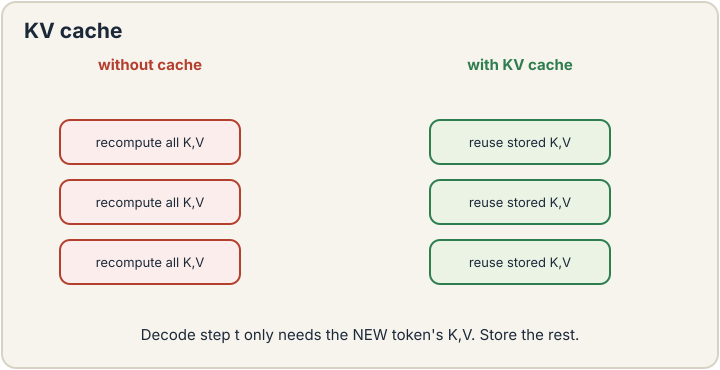

## How to read this lesson

This lesson has two levels. **Level 1 (Core)** contains what you need to
understand everything that follows in CS229 and the courses that build on
it. **Level 2 (Deep)** contains what you need for correct, interview-grade
understanding. Read Level 1 straight through. Return to Level 2 when you
want depth.

No prerequisites are assumed. Every term is defined at first use. The
transformer and its quadratic cost were defined in [lecture
14](l14-transformers.html); they are reused, not re-explained.

## Level 1: The KV cache

Generation is sequential: token by token. Naive generation recomputes
every key and value at every step. Step t recomputes K and V for all t
positions, then uses only the newest. That is O(T^2) repeated work.

The **KV cache** [05:37](ts:05:37) stores keys and values across steps.
At step t, compute K and V for the new token only. Reuse the cached
rest. Each step costs O(T) instead of O(T^2). Total generation stays
quadratic in the worst case, but with a far smaller constant and no
recomputation.

The cache is memory. Storing K and V for every layer, every head, every
position costs real gigabytes at long contexts [05:05](ts:05:05). The
cache trades memory for speed, and at long contexts the memory side
hurts. Everything in this lecture's first half is a response to that
trade.

> [!QA]
> Q: What does the KV cache actually store?
> A: The key and value vectors for every previous token, at every layer and every head. When generating token t, the model needs keys and values of tokens 1 through t-1 for attention. Recomputing them each step repeats O(T^2) work. Caching makes each step O(T): only the new token's K and V are computed. The cost moves from compute to memory.
> Follow-up: Why is the KV cache a problem at long contexts?
> A: It grows linearly with sequence length times layers times heads times dimension. A million-token context needs terabytes of cache in naive form. This is why long-context serving is a memory problem first. GQA, quantization, and cache eviction all exist to shrink this exact buffer.

## Level 1: Attention variants

Three ideas shrink attention's cost. **Multi-query attention** (MQA)
[22:11](ts:22:11): all query heads share one key head and one value
head. The KV cache shrinks by the head count. **Grouped-query
attention** (GQA): a middle ground, groups of query heads share K/V
heads. Less cache than full multi-head, more expressive than MQA.

**Mixture of experts** (MoE) [31:49](ts:31:49) attacks the MLP side. The
feedforward network is replicated into experts, say 128. A router sends
each token to a few experts, say 8. Each token pays for 8 experts'
compute but the model holds 128 experts' capacity.

MoE is sparse: capacity without proportional FLOPs. The lecture notes
the training subtlety: routing must stay balanced, or experts collapse
and capacity is wasted. Load-balancing losses keep every expert fed.
MoE is how the largest models afford their size.

> [!QA]
> Q: MQA, GQA, or full multi-head: which do you pick?
> A: Full multi-head for quality when memory allows. GQA for the standard tradeoff: near-full quality with a fraction of the KV cache. MQA for maximum memory savings at some quality cost. The choice is dominated by serving constraints: long contexts and many concurrent users push toward fewer KV heads. Most frontier models ship GQA.
> Follow-up: Why does MoE need load balancing?
> A: Without it, the router sends everything to a few experts. Those experts train, the rest starve, and the model's effective capacity collapses to the busy few. An auxiliary loss penalizes imbalanced routing, forcing tokens across experts. The balance loss is load-bearing infrastructure, not a refinement.

## Level 1: The shock of in-context learning

**Zero-shot** [59:51](ts:59:51): describe the task in the prompt, give no
examples, let the model generate. **Few-shot** [00:51](ts:00:51): add a
few input-output examples to the prompt. No parameter updates in either
case. The prompt is the training set.

This was the GPT-3 shock [60:55](ts:60:55). Nobody trained for it. The
capability emerged from next-word prediction at scale, and researchers
found it by trying. The lecture stresses how surprising this was: the
field believed new tasks needed at least some training. They do not.
Prompting replaced pipelines.

The deployment story changed with it. Old way: collect domain data,
label it, train a specialized model, deploy per company. New way: one
off-the-shelf model, each company writes prompts, plus scaffolding for
agentic tasks. The lecture presents this as the fundamental convenience
shift of the LLM era.

> [!QA]
> Q: Why is in-context learning surprising?
> A: Because nothing in the training objective asks for it. Next-word prediction never shows the model a few-shot task during training, yet the trained model performs them. The ability emerges from scale: at some size, the model's context window becomes a workspace where it can infer the task from examples. Emergence means the capability was not designed, only discovered.
> Follow-up: Few-shot or fine-tuning?
> A: Few-shot for quick adaptation: no training, instant iteration, examples fit in context. Fine-tuning when the behavior change is deep, the examples do not fit, or inference must be cheap per query. Few-shot pays context tokens on every call. Fine-tuning pays training once. The economics decide.

## Level 1: Supervised fine-tuning

Capabilities that emerge can be strengthened deliberately.
**Supervised fine-tuning** (SFT), also called **instruction tuning**
[64:49](ts:64:49): collect (instruction, answer) pairs, continue
training from the pre-trained checkpoint, and minimize the loss on the
answers only.

The loss detail matters. The instruction x is context: seen, not
predicted. The answer y is the target: the loss is the negative log
likelihood of y given x, decomposed per token [67:43](ts:67:43). The
model learns to produce answers shaped like the demonstrations. SFT is
how base models become assistants: the knowledge is pre-trained, the
behavior is fine-tuned.

> [!QA]
> Q: Why compute the loss only on the answer, not the instruction?
> A: The instruction is given at test time too. Predicting it teaches nothing useful and wastes capacity modeling the prompt distribution. The behavior to learn is answer-given-instruction. Masking the instruction tokens focuses every gradient step on the mapping that matters. It also matches deployment: the user supplies x, the model supplies y.
> Follow-up: What does SFT not do?
> A: It does not teach new knowledge reliably. SFT shapes behavior: format, style, instruction-following. Facts come from pre-training. Trying to inject knowledge via SFT often produces confident hallucinations, because the loss rewards fluent answers, not true ones. Knowledge goes in pre-training or RAG. SFT is for conduct.

## Level 2: Co-design with the GPU

The lecture frames efficiency as **co-design**: architecture and hardware
designed together. Attention's memory access pattern, not just its FLOP
count, decides speed. GPUs move data slowly relative to computing on it,
so algorithms that reuse cached data win beyond what operation counts
predict.

This is the lens for the whole efficiency zoo. FlashAttention tiles the
computation to avoid materializing the T-by-T matrix. Quantization
shrinks the KV cache. Speculative decoding drafts with a small model and
verifies with the large one. Each is a response to a hardware fact, not
just a math fact. The guest lecture on system ML continues here.

## Level 2: The limits of prompting

In-context learning has ceilings the lecture implies. Context length
bounds the examples. Long prompts cost tokens on every call. The model
can only learn what fits in context and what its pre-training prepared
it to notice. Tasks needing many examples, or examples the model cannot
use, still need fine-tuning.

There is also a reliability gap. Few-shot behavior is sensitive to
example choice, order, and phrasing. Small prompt changes move results.
SFT reduces that sensitivity by baking the behavior into weights. The
arc of the course is this tradeoff: prompting for flexibility, training
for reliability, reinforcement for the rest.

## Recap: the whole lesson on one screen

Eight ideas carry this lecture. Read each card. Say the core sentence out
loud. If you can, you own the lesson.

<strong>1. KV cache: store, do not recompute</strong>

Keys and values persist across decode steps. New token computes its
own. Memory for speed. Long contexts strain it.

Key: cache K,V per layer/head/position

<strong>2. Fewer KV heads: MQA and GQA</strong>

Share keys and values across query heads. MQA: one KV head. GQA:
groups. Less cache, small quality cost.

Key: shrink the cache

<strong>3. MoE: sparse compute, dense capacity</strong>

128 experts, 8 active per token. Router plus load balancing. Largest
models afford size this way.

Key: route, balance, scale

<strong>4. Zero-shot and few-shot need no training</strong>

Task description, optionally plus examples, in the prompt. The GPT-3
shock: unasked-for capability, emerged at scale.

Key: the prompt is the training set

<strong>5. Deployment: prompts replace pipelines</strong>

One model, many prompts, plus scaffolding. No per-company training.
The convenience shift of the LLM era.

Key: off-the-shelf plus prompts

<strong>6. SFT: instruction tuning</strong>

(Instruction, answer) pairs. Continue from checkpoint. Loss on answer
tokens only. Behavior, not knowledge.

Key: predict y given x

<strong>7. SFT shapes conduct, not facts</strong>

Format and instruction-following improve. Knowledge injection via SFT
risks fluent hallucinations. Facts live in pre-training or RAG.

Key: behavior in, knowledge stays out

<strong>8. Co-design with hardware</strong>

Memory access decides speed, not just FLOPs. Every efficiency trick
answers a hardware fact. System ML continues the thread.

Key: architecture meets GPU

## Official sources and further reading

**Official:**
- Lecture 15 video: few-shot agenda [00:51](ts:00:51), KV cache [05:37](ts:05:37), cache memory [05:05](ts:05:05), MQA [22:11](ts:22:11), MoE [31:49](ts:31:49), zero-shot [59:51](ts:59:51), GPT-3 shock [60:55](ts:60:55), instruction tuning [64:49](ts:64:49), SFT loss [67:43](ts:67:43).
- CS229 Spring 2026 official course notes: efficient transformers chapter.

**Further reading:**
- Brown et al. (2020), "Language Models are Few-Shot Learners": the GPT-3 paper.
- Hu et al. (2021), LoRA: the low-rank adaptation paper from lecture 12, the SFT efficiency companion.

**Caveats from these sources.** The video's YouTube metadata title is
wrong; the content is attention variants plus ICL plus SFT, as the
transcript shows. Few-shot sensitivity to phrasing is well documented;
reported numbers depend on prompt details. MoE load-balancing recipes
vary by lab; the lecture gives the principle, not a recipe.

## Connections to the other courses

- **CS336:** inference efficiency is a full CS336 unit: KV cache, quantization, and serving build directly on this lecture.
- **CS224N:** instruction tuning datasets and evaluation are covered from the language side.
- **CS329H:** RLHF follows SFT in the post-training stack; this lecture is the step before.

> [!CHEAT]
> **Efficiency, ICL, SFT cheatsheet.** KV cache: store K,V across steps; new token only; memory-bound at long context. MQA: one KV head. GQA: grouped. MoE: route tokens to few of many experts; needs load balancing. Zero-shot: task description only. Few-shot: examples in prompt; no parameter updates; the GPT-3 shock. Deployment: one model plus prompts replaces per-company training. SFT: (x,y) pairs, loss on y only; behavior not knowledge.

> [!MEMORY]
> **Prompt for flexibility, train for reliability.** Few-shot adapts instantly and varies with phrasing. SFT bakes behavior into weights. The course arc moves from the first to the second, then to reinforcement.
