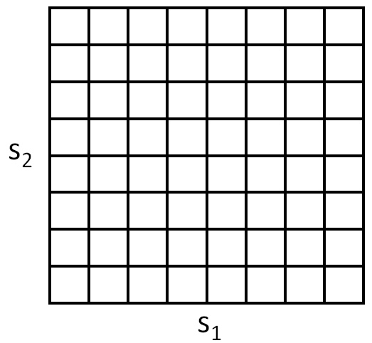
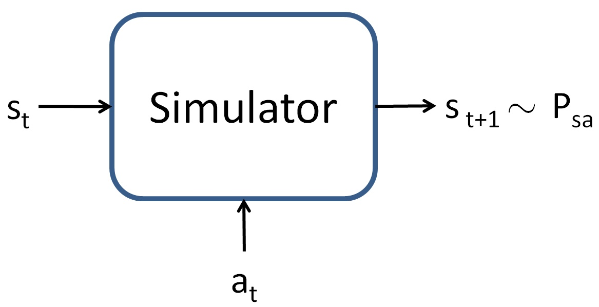

## How to read this lesson

This lesson has two levels. **Level 1 (Core)** contains what you need to
understand everything that follows in CS229 and the courses that build on
it. **Level 2 (Deep)** contains what you need for correct, interview-grade
understanding. Read Level 1 straight through. Return to Level 2 when you
want depth.

No prerequisites are assumed. Every term is defined at first use. Gradients
and the loss chip were defined in [lectures 2](l02-linear-regression.html)
and [8](l08-backpropagation.html); they are reused, not re-explained.

## Level 1: Sequential decision making

Prediction answers a question and stops. **Sequential decision making**
acts, and each action changes the future [00:53](ts:00:53). Operate a
robot: go left, raise the arm, grasp. Place an order. Every decision has
**ramifications**: downstream consequences that a single-step view
misses.

Two complications define the field. Greedy fails: what is optimal now
may be terrible later [02:32](ts:02:32). A robot that grabs the nearest
object may block its own arm. And decisions trade return against risk:
some actions are not optimal now but **collect information**
[03:06](ts:03:06), exploring to decide better later.

The lecture uses robotics as the clean vehicle. The mathematics is
identical for language models, but robotics keeps the RL setting
separate from the LLM application. Lecture 17 reunites them.

> [!QA]
> Q: How is RL different from supervised learning?
> A: Supervised learning predicts from labeled examples: the right answer is given. RL acts in a world: no correct action is given, only rewards after the fact, and actions change what happens next. Supervised learning is one-step with answers. RL is multi-step with consequences. The feedback is weaker and delayed, which is why RL is harder.
> Follow-up: Why does greedy fail?
> A: Greedy maximizes immediate reward and ignores the future. In sequential problems the immediate best action can lead to a dead end: a chess move that wins a pawn and loses the game. Optimal behavior maximizes total return over the whole trajectory, which requires valuing future states, not just present rewards.

## Level 1: The MDP

The **Markov decision process** (MDP) formalizes the setting. Five
parts. **States** S: where the world is. **Actions** A: what the agent
can do. **Transition dynamics** P(s' | s, a): how the world changes
[11:58](ts:11:58). **Reward** R: the score for each transition.
**Discount** gamma: how much the future matters relative to now.

A **policy** pi(a | s) is the agent's behavior: the probability of each
action in each state. The goal: find the policy maximizing the
**expected return**, the total discounted reward [26:12](ts:26:12).
Markov means the future depends on the present state only, not the full
history. The state summarizes everything relevant.

> [!QA]
> Q: What is a policy, exactly?
> A: A mapping from states to action probabilities: pi(a|s). Deterministic policies pick one action per state. Stochastic policies randomize. The policy is what learning optimizes: the agent's behavior is the parameter. Everything else, dynamics and rewards, is the world the policy operates in.
> Follow-up: Why discount the future?
> A: Three reasons. Mathematical: discounting keeps infinite sums finite. Practical: near rewards are more certain than far ones. Conceptual: it encodes time preference. Gamma near 1 plans far ahead. Gamma near 0 is myopic. The discount is a hyperparameter with behavioral meaning.

## Level 1: Value functions

The **value** of a state under a policy is the expected total return
starting there [40:13](ts:40:13): V^pi(s). The **optimal value** V*(s)
is the best achievable: max over policies. Values turn the sequential
problem into a local one: a good action is one leading to high-value
states.

Values satisfy the **Bellman equation** [43:43](ts:43:43): the value of
a state equals the immediate reward plus the discounted value of the
next state, in expectation. This recursion is the workhorse of RL
theory. Solve it and the optimal policy reads off: act to reach the
highest-value next state.

The lecture notes the classical algorithms that solve Bellman
equations, then sets them aside. This quarter focuses on the algorithms
that survive the jump to language models. The classical ones need the
dynamics known and the state space small. LLMs have neither.

> [!QA]
> Q: What does the value function buy you?
> A: It compresses the future into a number per state. Instead of reasoning about whole trajectories, the agent compares single numbers: this state is worth 10, that one 3. Planning becomes local choice plus value lookup. Learning values is often easier than learning policies directly, which is why actor-critic methods keep both.
> Follow-up: Why not just learn the policy directly?
> A: You can, and policy gradient does. But values help twice: they judge actions during learning, and they reduce variance as baselines. The lecture's path goes through policy gradient first because it is the precursor to LLM training. Values return as the variance-reduction tool in lecture 17.

## Level 1: Policy gradient (REINFORCE)

**Policy gradient**, also called **REINFORCE** [56:22](ts:56:22), is
the precursor to every LLM training algorithm in this course. It
optimizes the policy directly by gradient ascent on expected return.

The trick is the **log-derivative**: grad log pi = grad pi / pi. The
gradient of the expected return becomes an expectation over
trajectories:

grad J = E[ sum over t of grad log pi(a_t | s_t) * R ]

Sample trajectories from the current policy. Weight each trajectory's
action-gradients by its total return. Good trajectories push their
actions' probabilities up. Bad ones push them down.

It works only for **stochastic policies** [57:30](ts:57:30).
Deterministic policies have no log-probability to differentiate. The
randomness is load-bearing: it explores, and the gradient needs the
exploration distribution.

> [!QA]
> Q: Why does policy gradient need stochastic policies?
> A: The gradient is an expectation over trajectories sampled from the policy, weighted by grad log pi. A deterministic policy assigns probability 1 to one action and 0 to the rest: no sampling distribution, no log-probability gradient, no exploration. Stochasticity is not a convenience. The mathematics requires a distribution to differentiate through.
> Follow-up: What is the variance problem?
> A: Returns vary wildly across trajectories, so the gradient estimate is noisy. A lucky trajectory pushes its actions up whether they were good or just lucky. Baselines fix this: subtract a state-dependent value so only better-than-expected actions get pushed up. Lecture 17 makes the baseline the advantage function.

## Level 2: The log-derivative trick, carefully

The trick converts a gradient of an expectation into an expectation of
a gradient. Start: grad_theta E_{x ~ p_theta}[f(x)]. The distribution
depends on theta, so the gradient hits both f and p. Rewrite p * grad
log p for grad p. The p rejoins the expectation. Result: E[f(x) * grad
log p_theta(x)]. The expectation is now over the current distribution,
which you can sample.

This is the **score-function estimator**. It needs no derivatives of f:
f can be a black-box reward, a simulator, a human rating. That
generality is why RL scales to LLMs, where the reward is "did the
answer match" and nothing is differentiable. The price is variance:
black-box feedback is noisy, and the estimator feels it.

## Level 2: On-policy and its costs

Policy gradient is **on-policy**: trajectories must come from the
current policy. Update the policy and yesterday's trajectories are
stale. Every gradient step needs fresh samples. For robotics that means
fresh simulator rollouts. For LLMs it means fresh generations.

Fresh samples are expensive. The field's central engineering problem is
sample efficiency: learn as much as possible per trajectory. PPO, in
lecture 17, reuses samples carefully with importance weights. The
on-policy constraint is the reason RL training is sample-hungry in a
way supervised training is not. Supervised data is reusable forever.
On-policy data expires every update.

## Recap: the whole lesson on one screen

Eight ideas carry this lecture. Read each card. Say the core sentence out
loud. If you can, you own the lesson.

<strong>1. Decisions have ramifications</strong>

Actions change the future. Greedy fails. Some actions collect
information. Prediction stops; decisions continue.

Key: multi-step with consequences

<strong>2. MDP: states, actions, dynamics, reward</strong>

P(s'|s,a) is the world model. Pi(a|s) is the behavior. Maximize
expected discounted return. Markov: now summarizes history.

Key: five parts, one goal

<strong>3. Gridworld makes it concrete</strong>

Cells are states, moves are actions. Small enough to solve exactly.
The intuitions scale to robots and tokens.

Key: toy with the full structure

<strong>4. Values compress the future</strong>

V^pi(s): expected return from s. V*: the best achievable. Bellman:
value = reward now + discounted value next.

Key: one number per state

<strong>5. REINFORCE: weight by return</strong>

grad J = E[sum grad log pi * R]. Sample, score, shift probability
toward winners. Precursor to all LLM RL.

Key: log-derivative trick

<strong>6. Stochasticity is load-bearing</strong>

No distribution, no gradient, no exploration. Deterministic
policies cannot use policy gradient. Randomness is the mechanism.

Key: pi(a|s) must spread

<strong>7. On-policy data expires</strong>

Fresh trajectories per update. Supervised data is forever;
on-policy data dies each step. Sample efficiency is the engineering
problem.

Key: every update needs new samples

<strong>8. Variance is the enemy</strong>

Lucky trajectories mislead. Baselines subtract the expected, keeping
only better-than-expected. Lecture 17 builds the advantage.

Key: noise needs a baseline

## Official sources and further reading

**Official:**
- Lecture 16 video: sequential decisions [00:53](ts:00:53), greedy fails [02:32](ts:02:32), information gathering [03:06](ts:03:06), transition dynamics [11:58](ts:11:58), expected return [26:12](ts:26:12), value function [40:13](ts:40:13), Bellman [43:43](ts:43:43), REINFORCE [56:22](ts:56:22), stochastic only [57:30](ts:57:30).
- CS229 Spring 2026 official course notes: RL chapter; the gridworld and simulator figures above are from it.

**Further reading:**
- Sutton and Barto, Reinforcement Learning: An Introduction (2nd ed.): the canonical text.
- Williams (1992), "Simple Statistical Gradient-Following Algorithms for Connectionist Reinforcement Learning": the REINFORCE paper.

**Caveats from these sources.** The lecture skips classical
dynamic-programming algorithms; the notes cover them for completeness.
The robotics framing is pedagogical: real robot RL adds safety and
sample constraints the lecture omits. Discount selection is
task-dependent; the lecture gives the concept, not a value.

## Connections to the other courses

- **CS336:** RLHF and RLVR are this lecture's algorithms applied to language models at scale.
- **CS224N:** dialogue policies were early RL-for-language applications.
- **CS329H:** bandits are the single-step special case; mechanism design is multi-agent RL.

> [!CHEAT]
> **RL basics cheatsheet.** Sequential decisions: actions change the future; greedy fails; explore to inform. MDP: S, A, P(s'|s,a), R, gamma. Policy pi(a|s): the behavior, what learning optimizes. Goal: max expected discounted return. Values: V^pi(s) expected return; V* optimal; Bellman recursion. REINFORCE: grad J = E[sum grad log pi * R]; sample, weight by return; stochastic policies only. On-policy: fresh samples per update. Variance: needs baselines.

> [!MEMORY]
> **The future has a price.** Every RL concept is a way to value future consequences in present decisions. Values compress trajectories. Discounts weigh time. Baselines remove luck. The machinery prices the future.
