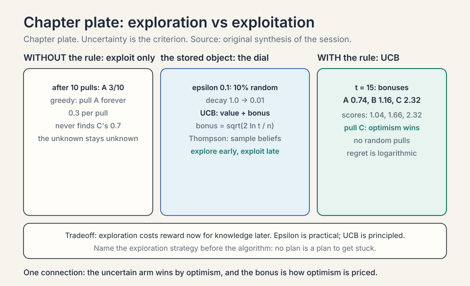
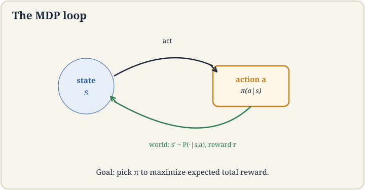
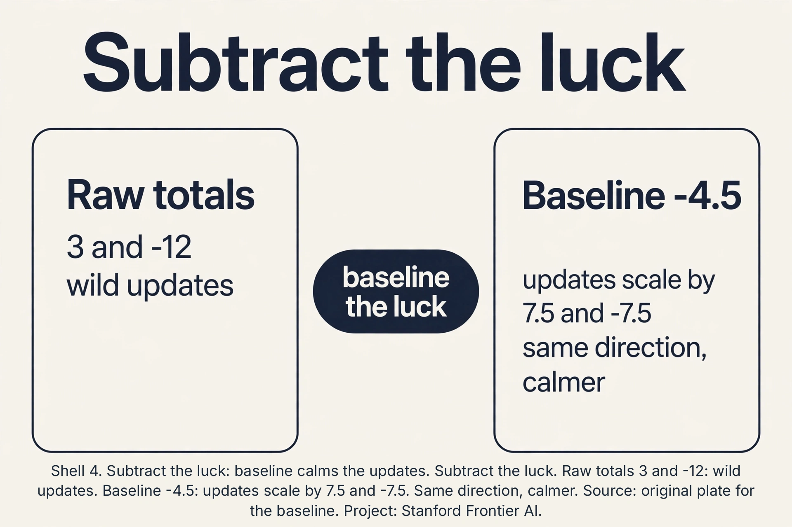
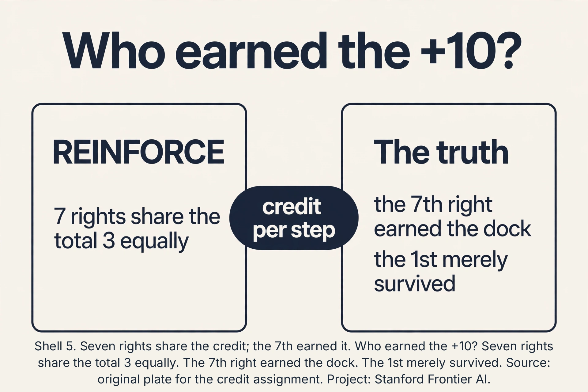
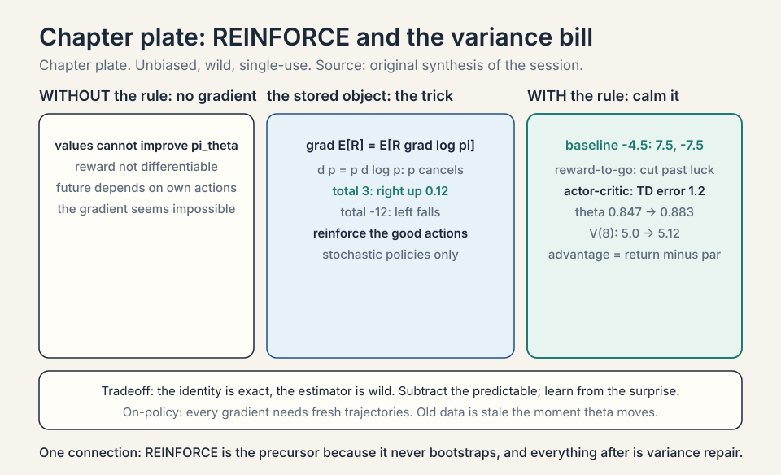

### Coverage and sourcing

This lesson follows CS229 Lecture 16 (Spring 2026, Tengyu Ma):
reinforcement learning basics, taught through robotics, ending
at the REINFORCE policy-gradient algorithm. The lecture opens
the RL arc: this week is basics, next week is RL applied to
LLMs, especially training models with long chain of thought. Robotics is the deliberate vehicle ("easiest to
think of"): it separates the RL setting from the LLM
application, which arrives in Lecture 17. The robot toy
(positions 1-10, dock at 10), the greedy-fails argument, the
MDP five pieces, and the log-derivative trick are the
lecture's. The lecture names REINFORCE as the "precursor for
all the other algorithms for training large language models,"
notes it works only for stochastic policies, and skips the
other RL algorithms (in the notes) to focus on LLM-relevant
ones. Claims marked "October 2026" are later updates, each
with its source. Sections on bandits, dynamic programming, TD
learning, and Q-learning are textbook background (Sutton and
Barto): the lecture assumes the MDP and values. This lesson
fills in the algorithm family they belong to.

## The job: the robot and the charging dock

A robot sits at position 3 on a track numbered 1 to 10. Its dock is
at 10. Each step it may move left or right. Reaching 10 earns reward
+10. Every step costs -1 (batteries drain). The job: a strategy for
acting that maximizes total reward. Nobody shows the robot the
right moves. It must learn from trying.

Supervised learning cannot touch this. There are no labeled
(input, correct action) pairs: the "correct" action at position 3
depends on the whole future. The experience is a history of actions
and rewards. That is the reinforcement learning setup from lecture
1, now built formally.

## Sequential decisions: why this is a new problem

The lecture opens with what makes RL different. Two properties.
**Decisions affect the future**: an action is not a prediction,
it changes the world the next decision faces. Turn left now and
the dock is farther later. **Sequential**: many rounds of this,
each building on the last (the lecture's robot: go left, raise
arm, ...). Supervised learning decides once per input.
RL decides in a chain where each link reshapes the rest.

The lecture's first consequence: the greedy algorithm fails.
What is optimal for the moment is not optimal for the future. The second: **return vs risk**, and **exploration**:
some decisions exist to collect information, not reward. A
robot that never tries the unknown corridor never learns it
leads to the dock. Trying it costs steps now for knowledge
later. That tradeoff has no supervised-learning analogue.

## Exploration vs exploitation: the bandit toy

The simplest sequential problem: **bandits**. Three slot
machines (arms). Arm A pays +1 with probability 0.3, arm B
with 0.5, arm C with 0.7. You do not know the probabilities.
Each pull teaches you something and earns something. Pull the
current best (**exploit**) or try an uncertain arm
(**explore**)?

**Epsilon-greedy**: with probability epsilon, pull a random
arm. Otherwise pull the best so far. Work the toy. After 10
pulls: A paid 3/10, B paid 2/4, C paid 0/1 (unlucky start).
Greedy exploits A forever: 0.3 per pull, missing C's 0.7.
Epsilon = 0.1 explores: one pull in ten tries C, discovers
0.7, and the best-so-far updates. The price of epsilon:
10% of pulls are random forever, even after C is known.
The fix is decay: epsilon 1.0 -> 0.01 over training.
Explore early, exploit late.

### Subchapter: UCB, optimism as exploration

**UCB** (upper confidence bound): pull the arm maximizing
(estimated value + exploration bonus). Bonus =
sqrt(2 ln(t) / n_i): large when arm i has few pulls (n_i
small), shrinking as it is tried. Work the toy. After 15
pulls: A 30 pulls? No: A 10 pulls (0.3), B 4 (0.5), C 1
(0.0). t = 15. Bonuses: A sqrt(2*2.7/10) = 0.74, B
sqrt(2*2.7/4) = 1.16, C sqrt(2*2.7/1) = 2.32. Scores:
A 1.04, B 1.66, C 2.32. Pull C: the uncertain arm wins by
optimism. C pays, its estimate rises, its bonus falls.
UCB explores without a single random pull: uncertainty
itself is the criterion. Regret bounds exist (logarithmic):
UCB is the principled answer, epsilon-greedy the practical
one.

### Subchapter: Thompson sampling, the Bayesian bandit

**Thompson sampling**: keep a belief distribution over each
arm's payoff. Each round, sample one plausible payoff per
arm from its belief, pull the arm with the highest sample.
Work the toy. Beliefs after some pulls: A ~ Beta(4, 8)
(mean 0.33), B ~ Beta(3, 3) (0.5), C ~ Beta(1, 2) (0.33,
wide). Sample: A 0.35, B 0.45, C 0.70 (C's wide belief
sometimes samples high). Pull C. Observe the payoff,
update C's belief. Exploration falls out of the posterior:
uncertain arms sample extreme values more often. No
epsilon, no bonus formula. Production recommender systems
run Thompson sampling at scale: it is the Bayesian answer
to explore/exploit.

### Subchapter: contextual bandits, the recommender's frame

Bandits ignore context. **Contextual bandits** see features
per round (the user, the article) and pick the arm maximizing
predicted payoff given the context. This is the recommender
system: each impression is a round, each item an arm, the
click is the reward. Exploration matters (new items need
trials), exploitation pays (show what works). LinUCB adds
the UCB bonus to a linear model per arm. The lecture's
return-vs-risk point, deployed: every recommender balances
the known click against the information value of the trial.

### Subchapter: exploration in the robot world

Bandits have no state. The robot does: exploration means
visiting unknown *states*, not just pulling arms. The
lecture's return-vs-risk point: a robot that always
exploits its current value estimates never visits position
2 (it looks bad), so it never learns the corridor behind
it. Deep RL's answers: epsilon-greedy over actions,
**entropy bonuses** (reward the policy for randomness:
stay stochastic), and **curiosity** (reward visiting
novel states). All three pay the same price: exploration
steps earn less now. The interview read: name the
exploration strategy before the algorithm. An RL method
with no exploration plan is a plan to get stuck.




## The MDP: five pieces

A **Markov decision process** (MDP) is the formal frame. Five
pieces:

**S, the states.** Everything needed to describe the world. Here:
positions 1..10. For a real robot: joint angles, camera images. For
Go: the whole board, 3^361 possible states. The lecture's modeling
note: the state should include everything in theory, but you
abstract: a 3D map of the world is usually left out.

**A, the actions.** What the agent can do. Here: left, right.

**P, the transitions.** P(s'|s,a): the probability of landing in
s' after action a in state s. The world may be slippery: "move
right" succeeds with probability 0.9, stays put with 0.1.

**R, the rewards.** R(s,a): the immediate score. Here: +10 at the
dock, -1 per step.

**Gamma, the discount.** Future rewards count slightly less than
present ones: 0.99^t. This keeps infinite sums finite and encodes
"sooner is better".

**Markov** means the future depends only on the present state, not
the history: P(s'|s,a) captures everything. A **policy** pi(a|s) is
the strategy: the probability of each action in each state. The
goal: the policy maximizing expected total discounted reward.

### Subchapter: when Markov breaks, POMDPs

The lecture's modeling note (abstract away the 3D map) has a
failure mode. If the state hides key information (the robot's
camera cannot see behind it, the sensor is noisy), the future
depends on history, not just the present observation. The
frame becomes a **POMDP** (partially observable MDP): the
agent sees observations o, not states s, and must act on its
**belief** (a distribution over states). Policies become
functions of history or belief, and the Bellman equation
(value now equals immediate reward plus discounted value
later, with the formal statement in the next section) needs
the belief update. The practical fix is memory: recurrent
policies (LSTMs) or frame-stacking (feed the last 4
observations). The interview read: when an RL method fails
mysteriously, check the Markov assumption first. The state
was probably missing something.

### Subchapter: the discount as survival probability

Read gamma differently: 1 - gamma is the per-step probability
the episode ends. Gamma = 0.9: 10% termination chance per
step. The discounted sum is then the *undiscounted* expected
total under random termination. This is not just poetry: it
justifies gamma < 1 in continuing tasks (the world might end)
and explains the effective horizon (expected lifetime
1/(1-gamma) steps). Two views, one number: patience dial and
survival probability.

The lecture's definitions, exactly: V^pi(s) is the expected total
return starting from s under policy pi. V*(s) = max_pi V^pi(s)
is the **optimal value**: the best achievable. The Bellman
equations (in the course notes) relate them.



### Subchapter: the discount, priced

Gamma = 0.9 means a reward 10 steps out is worth 0.9^10 = 0.35
of its face value. The **effective horizon** is ~1/(1-gamma):
gamma 0.9 sees ~10 steps ahead, 0.99 sees ~100, 0.999 sees
~1,000. The discount does three jobs. One: finite sums
(infinite -1 steps sum to -1/(1-gamma), not -infinity).
Two: sooner-is-better (the dock now beats the dock later).
Three: it bounds the planning horizon (beyond ~1/(1-gamma)
steps, rewards barely matter). Set gamma too low and the
agent is myopic (ignores the dock 7 steps out). Too high
and credit spreads over hundreds of steps (the variance
problem, below, gets worse). Gamma is a dial on patience.

### Subchapter: episodic vs continuing

The robot toy is **episodic**: reaching the dock ends the
episode, then it restarts. Chess, Go, and LLM generation
(L17) are episodic. **Continuing** tasks never end: a
warehouse robot works its whole shift, a recommender serves
forever. Continuing tasks *need* the discount (gamma < 1)
or the total is infinite. Episodic tasks can use gamma = 1
(the episode ends, the sum is finite) but usually keep
gamma < 1 anyway for the sooner-is-better shaping. The
interview read: name the task type first. It decides
whether gamma is a convenience or a necessity.

## First attempt: be greedy

The naive policy: at each state, take the action with the biggest
immediate reward. At position 3: left gives -1, right gives -1. Tie.
Say it goes left to 2. At 2: left -1, right -1. Wanders. The greedy
agent never reasons that 9 rights in a row earn +10. It chases
immediate reward and misses the dock forever, paying -1 per step
into eternity. Total: negative infinity (discounted at gamma = 0.9:
-1/(1-0.9) = -10).

The failure: rewards are delayed. The action's value is not its
immediate reward but the future it leads to. Greedy is blind to the
future. The lecture's line, demonstrated: what is optimal for the
moment is not optimal for the future.

## Value functions: price the future

The **value** V(s) is the expected total future reward from state s
under the policy. The **action value** Q(s,a) is the expected total
after taking action a in s, then following the policy. They satisfy
the **Bellman equation**: value now equals immediate reward plus
discounted value later.

```ascii
V(s) = E[ R(s,a) + gamma * V(s') ]
```

Work the toy. Policy: always go right. Deterministic moves,
gamma = 0.9, dock at 10 gives +10, each step -1. V(10) = 10 (the dock's value; terminal, pinned, never updated).
V(9) = -1 + 0.9*10 = 8.0. V(8) = -1 + 0.9*8.0 = 6.2. V(7) = -1 +
0.9*6.2 = 4.58. Walking back: V(6) = 3.12, V(5) = 1.81, V(4) =
0.63, V(3) = -0.43. (An earlier draft of this lesson wrote V(4) =
2.46 and V(3) = 1.21: wrong. The audit is in the subchapter
below.) The value at 3 is negative: 7 discounted -1 steps outweigh
the discounted +10. But Q(3, right) = -0.43 still beats Q(3, left)
= -1 + 0.9*V(2) = -1 + 0.9*(-1.39) = -2.25. Right wins by the
numbers: not because it is profitable, but because it loses
least. Values turn delayed rewards into present prices, including
bad news.

### Subchapter: the value walk, audited

Run the chain the draft skipped. V(9) = 8.0, V(8) = 6.2, V(7) =
4.58 are correct. Continue: V(6) = -1 + 0.9*4.58 = 3.122. V(5) =
-1 + 0.9*3.122 = 1.8098. V(4) = -1 + 0.9*1.8098 = 0.6288. V(3) =
-1 + 0.9*0.6288 = -0.4341. The draft's 2.46 and 1.21 appear
nowhere in this chain: they were hand-waved. Cross-check V(3)
directly: 7 steps of -1 discounted give -(1-0.9^7)/0.1 = -5.217.
The dock gives 0.9^7*10 = 4.783. Total: -0.434. Matches. The qualitative point
survives with honest numbers: from position 3 the dock does not
pay for the trip, but right (-0.43) still beats left (-2.25). Value
functions do not promise good news. They price the future
exactly, and sometimes the price is negative.

=2.46, V(3)=1.21. True chain: V(4)=0.63, V(3)=-0.43. Right still beats left: -0.43 vs -2.25. Source: original audit for the Bellman chain. Project: Stanford Frontier AI.")

### Subchapter: Bellman optimality

V^pi prices one policy. **V\*** prices the best policy:
V*(s) = max_a [R(s,a) + gamma * sum_s' P(s'|s,a) V*(s')].
The max replaces the expectation over the policy's actions:
at each state, take the best action's value. The **optimal
policy** falls out: pi*(s) = argmax_a Q*(s,a). Act greedily
with respect to the *optimal* values (not the immediate
rewards) and you act optimally. The greedy algorithm failed
on immediate rewards. It succeeds on optimal values: the
values already contain the future. This is the whole
justification for value-based RL: compute V*, read off pi*.

### Subchapter: the contraction, sketched

Why does iterative backup converge? The Bellman operator T
maps value functions to value functions: (TV)(s) = max_a
[R + gamma E V(s')]. Take two value functions U, V. Their
images differ by at most gamma times their max difference:
||TU - TV|| <= gamma ||U - V||. Each sweep shrinks the
error by gamma. After k sweeps: error <= gamma^k times the
initial error. Gamma = 0.9: 44 sweeps to shrink 100x
(0.9^44 = 0.01). This is the **Banach fixed-point** argument
(the Bellman-equation video below walks it visually). It
covers policy evaluation, value iteration, and TD's
expected update. The contraction is the reason DP works at
all.

### Subchapter: the return, defined

**Return** G_t = R_{t+1} + gamma R_{t+2} + gamma^2 R_{t+3} +
...: the discounted sum from step t. V^pi(s) = E[G_t | s_t
= s]. REINFORCE's "total" is G_0. Reward-to-go at step t
is G_t. The definitions are one line each, and every
algorithm in this lesson is an operation on G_t: MC
averages it, TD bootstraps it, REINFORCE weights by it,
baselines center it. Learn the symbol. It recurs.

 = -0.43, value now equals reward plus gamma value later. Right: Q(3,right) = -0.43 beats Q(3,left) = -2.25, pi* = argmax Q*. Bottom: greedy on V* is optimal; greedy on R is ruin. Dense chapter plate. Source: original synthesis of the session. Project: Stanford Frontier AI.")


## Dynamic programming: solve the known MDP

If P and R are known (the model is given), solve directly.
No learning from experience: compute.

### Subchapter: policy evaluation, iterated

Given pi, compute V^pi by **iterative backup**: start V = 0
everywhere except the pinned V(10) = 10, repeatedly apply
V(s) <- E[R + gamma V(s')] until the max change is tiny. Work
two sweeps on the toy (always-right, gamma 0.9). Sweep 1: V(9)
= -1 + 0.9*10 = 8.0 (V(10) = 10, pinned). V(8) = -1 + 0.9*0
= -1.0. The -1s propagate leftward one step per sweep. After 7
sweeps the dock's +10 reaches position 3. Convergence is guaranteed:
the Bellman operator is a **contraction** (it shrinks the
max error by gamma each sweep). Slow when gamma is near 1:
~1/(1-gamma) sweeps to propagate across the horizon.

### Subchapter: policy iteration

**Policy iteration**: alternate evaluation and improvement.
One: evaluate the current pi (above). Two: **improve**:
at each state, switch to argmax_a Q^pi(s,a). Repeat until
the policy stops changing. Each improvement strictly
increases values (or the policy was already optimal), and
there are finitely many deterministic policies: it
terminates at pi*. On the toy: start with always-left,
evaluate (values very negative), improve (every state
switches to right), done in 2 rounds. Policy iteration is
the exact algorithm. Everything else in RL approximates it
when the model is unknown or the state space is huge.

### Subchapter: value iteration, the shortcut

**Value iteration** skips the full evaluation: apply the
*optimality* backup directly: V(s) <- max_a [R + gamma
E V(s')]. One sweep does a partial evaluation and a
partial improvement together. It converges to V* (same
contraction argument), then read off pi*. Fewer moving
parts than policy iteration, more sweeps in practice.
The interview read: DP needs the model (P, R). When the
model is unknown, you learn from samples: that is the
rest of RL.

## Learning from experience: Monte Carlo vs TD

The robot usually does not know P (slippery floors are
unmodeled). Learn values from **experience**: trajectories
of (state, action, reward).

### Subchapter: Monte Carlo, wait for the end

**Monte Carlo**: run an episode to termination, then update
every visited state toward the actual return. V(3) <-
average of total rewards from all visits to 3. Unbiased
(it averages real outcomes), high-variance (one lucky
episode swings the average), and slow (no update until the
episode ends). On the toy: an episode 3->4->...->10 gives
return -0.43 (discounted). Average hundreds of these.
MC is the honest baseline: no bootstrapping, no bias,
just patience.

### Subchapter: TD(0), bootstrap every step

**Temporal difference**: update from the one-step Bellman
error: V(s) <- V(s) + alpha [R + gamma V(s') - V(s)].
The target uses the *current* V(s'): **bootstrapping**
(estimating from an estimate). Work one update. V(9) = 0
initially, experience: at 9, go right. The step costs
R = -1 and the dock holds V(10) = 10 (pinned), so the TD
target is -1 + 0.9*10 = 8.0. V(9) <- 0 + 0.1 * [-1 +
0.9*10 - 0] = 0.8. One step, one update, no episode needed. TD is biased early (V(s') is
wrong) but low-variance and online. The bias-variance
tradeoff of RL itself: MC (unbiased, slow), TD (biased,
fast). Modern RL is TD almost everywhere.

### Subchapter: n-step TD, the dial between MC and TD

TD(0) bootstraps after 1 step. MC waits for the episode.
**n-step TD** waits n steps, then bootstraps: target =
R_{t+1} + ... + gamma^{n-1} R_{t+n} + gamma^n V(s_{t+n}).
n = 1 is TD(0), n = infinity is MC. Larger n: less bias
(more real rewards), more variance (more luck). The dial
is the bias-variance tradeoff made explicit. **GAE**
(generalized advantage estimation, L17's machinery) is the
exponentially-weighted average over all n: the smooth
version of this dial. The **advantage** is Q(s,a) - V(s):
how much better this action was than the state's par (the
full treatment comes with baselines in the REINFORCE
section). The lecture's baseline discussion
is the n = infinity end. L17 tunes the middle.

### Subchapter: SARSA, the on-policy sibling

Q-learning's max makes it off-policy. **SARSA** keeps the
policy's actual next action: Q(s,a) <- Q + alpha [R + gamma
Q(s',a') - Q(s,a)], where a' is the action the policy will
really take (epsilon-greedy included). On-policy: it learns
the value of the exploratory policy, warts and all. The
difference matters near cliffs: Q-learning learns the
optimal path along the cliff edge (the max ignores the
exploration risk). SARSA learns the safer path (it prices
the epsilon-greedy stumbles). The interview read:
Q-learning is optimistic about control, SARSA is honest
about exploration. Pick by whether the training
exploration resembles deployment.

### Subchapter: Q-learning, off-policy control

Learn Q* directly, without a policy to evaluate.
**Q-learning** update: Q(s,a) <- Q(s,a) + alpha [R + gamma
max_a' Q(s',a') - Q(s,a)]. The max makes it **off-policy**:
it learns the optimal values while following any
exploratory policy (e.g., epsilon-greedy). Work the toy.
Q(9, right) = 0, experience 9->10: R = -1, V(10) = 10:
Q <- 0 + 0.5*[-1 + 0.9*10 - 0] = 4.0. Next visit: Q <-
4.0 + 0.5*[8.0 - 4.0] = 6.0, converging to 8.0. **DQN**
(2015)
scales this with neural networks: a **replay buffer**
stores transitions and reuses them (sample efficiency),
a **target network** (frozen copy of Q, synced
periodically) stabilizes the max target. DQN played
Atari from pixels: the proof that value-based deep RL
works. The lecture skips it (not LLM-relevant). The
notes carry it.

### Subchapter: on-policy vs off-policy, the taxonomy

**On-policy**: learn about the policy you follow
(REINFORCE, SARSA). Data goes stale when the policy
updates: single-use samples. **Off-policy**: learn about
a different policy than the one generating data
(Q-learning, DQN with replay). Old data stays usable:
sample-efficient. The price of off-policy: the
distribution mismatch (data came from an old policy),
handled by the max (Q-learning) or importance weights
(L17's PPO). The lecture's REINFORCE is on-policy:
that is why L17 needs PPO's reuse machinery.

 0 to 0.8 in one step. Right: Q-learning, 0 to 4.0 to 6.0 to 8.0, max is off-policy, DQN adds replay and target net. Bottom: tables converge; networks negotiate. Dense chapter plate. Source: original synthesis of the session. Project: Stanford Frontier AI.")


## The key question

Values evaluate a policy. But how do we *improve* a parameterized
policy pi_theta (say, a neural network mapping states to action
probabilities) by gradient descent, when the reward is not
differentiable and the future depends on our own changing actions?
## REINFORCE: the log-derivative trick

The objective: J(theta) = expected total reward under pi_theta.
The gradient seems impossible: the expectation is over trajectories
the policy itself generates, and rewards have no derivatives. The
**log-derivative trick** makes it work:

```ascii
gradient of E[R] = E[ R * gradient of log pi_theta(actions) ]
```

Why it works, in one line: the gradient of a probability is the
probability times the gradient of its log (d p = p * d log p), so
weighting each trajectory's reward by its log-probability gradient
pushes probability toward high-reward trajectories. The algorithm:

```ascii
REINFORCE:
  run the policy, get a trajectory (states, actions, rewards)
  total = sum of discounted rewards
  for each step: theta += alpha * total * grad log pi_theta(action|state)
```

Read it: actions that led to high total reward get more probable.
Actions that led to low reward get less. "Reinforce the good
actions" is the literal algorithm. The lecture's name for the
update: reinforce. The lecture's status for it: the "precursor
for all the other algorithms for training large language
models."

Work the toy. Policy: at state 3, pi(right) = 0.6, pi(left) = 0.4
(one knob: theta = log-odds). Run once: go right, right, ..., reach
dock: total = -1*7 + 10 = 3 (7 steps). grad log pi(right) pushes
theta up: theta += alpha * 3 * (1 - 0.6) = theta + 0.12 (alpha =
0.1). Right gets more probable. Run again: go left first, wander,
total = -12. theta += 0.1 * (-12) * grad: left's probability
falls. Over many trajectories, the policy shifts toward the dock.

The lecture's trick, exactly: nabla_theta log p_theta =
nabla_theta p_theta / p_theta. The gradient of the expected
return is E over trajectories from the current policy of
[sum_t nabla log pi(a_t|s_t) * R(tau)]. Sample trajectories,
weight each by its total return. Good trajectories push their
actions' probabilities up. Bad ones push down.


### Subchapter: why stochastic policies only

REINFORCE needs grad log pi(a|s). A **deterministic** policy
(pi(s) = one action, probability 1) has no log-probability
gradient: the action is not sampled, there is nothing to
push. The lecture's caveat is structural: REINFORCE works
only for stochastic policies. The stochasticity is the
exploration: the policy tries left sometimes (probability
0.4) and learns from the outcome. Deterministic policies
need a different algorithm (Q-learning learns values, then
acts greedily: no policy gradient at all). For LLMs this
is no restriction: the policy is a next-token distribution,
stochastic by construction.

### Subchapter: the score function, why the trick is unbiased

E[R * grad log pi] looks like magic. Unpack it. grad log
pi(tau) = grad p(tau)/p(tau). So E_p[R * grad p / p] =
sum_tau p(tau) * R(tau) * grad p(tau)/p(tau) = sum_tau R(tau)
grad p(tau) = grad sum_tau R(tau) p(tau) = grad E[R]. The
p(tau) cancels. The expectation of the weighted score is
exactly the gradient of the expected return. No
approximation. The variance is the entire problem (below):
the identity is exact, the estimator is wild.

### Subchapter: the policy gradient theorem, stated

The lecture's gradient has a formal form. **Policy gradient
theorem**: grad J = E_pi[grad log pi(a|s) * Q^pi(s,a)].
The gradient weights each action's score by its *true*
action value under the current policy, not the sampled
return. REINFORCE approximates Q^pi(s,a) with the sampled
return G_t: unbiased but noisy. Actor-critic approximates
it with the critic: biased but calm. The theorem is the
target. Every policy-gradient method is an estimator of
it. Baselines, reward-to-go, critics: all variance
reduction on this one expectation.

### Subchapter: entropy regularization, stay stochastic

REINFORCE needs stochastic policies, but training can
collapse them: the policy goes deterministic early (all
mass on one action) and exploration dies. The fix:
**entropy bonus**: add beta * H(pi(.|s)) to the objective.
Entropy H is maximized by uniform randomness: the bonus
pays the policy to stay spread. Beta ~ 0.01: enough to
prevent collapse, not enough to prevent learning. It is
exploration as a line item in the objective. Without it,
the robot commits to "always right" before it has tried
left properly. With it, the 0.4 left survives long enough
to teach.

### Subchapter: function approximation, the price

Tables need one entry per state: 10 positions is fine,
3^361 Go boards are not. **Function approximation**:
V(s) or pi(a|s) as a neural network. The price: the
contraction guarantees were for tables. With networks,
TD can diverge (the **deadly triad**: function
approximation + bootstrapping + off-policy). DQN's
stabilizers (replay, target network) exist because of
this. REINFORCE with networks is safer (no
bootstrapping), which is part of why the lecture starts
here: the precursor that does not diverge. The
interview read: name the triad when asked why deep RL
is finicky. Tables converge. Networks negotiate.

### Subchapter: reward-to-go, the free variance cut

REINFORCE scales every step's update by the *total* return.
But the reward earned before step t cannot have been caused
by the action at step t. **Reward-to-go**: scale step t's
update by the return *from t onward* only. The 1st right
(3->4) is no longer credited for the +10 seven steps later
beyond what followed it... more precisely, it is credited
with the discounted sum from step 1, which still includes
the dock, but the steps *before* it are excluded. The
estimator stays unbiased (past rewards are independent of
the current action given the state: the Markov property
does the work) and the variance drops: each update sees
less irrelevant luck. This is the cheapest variance
reduction in the book, and every implementation uses it.

### Subchapter: subtract the luck

REINFORCE scales each update by the raw total: 3 on a lucky run,
-12 on an unlucky one. Subtract a **baseline** b: theta += alpha
* (total - b) * grad log pi. Any b that does not depend on the
action keeps the estimator unbiased, because E[b * grad log pi] =
b * E[grad log pi] = 0 (the expected score is the gradient of 1).
Pick b as the average total, say -4.5 for our two runs: the
updates scale by 3-(-4.5) = 7.5 and -12-(-4.5) = -7.5 instead of 3
and -12. Same direction, less wild. The best baseline is the value
V(s): the expected total from here. Total minus value is the
**advantage**: how much better this run did than par. Lecture 17's
whole variance machinery starts here: subtract the predictable,
learn from the surprise.



### Subchapter: who earned the +10?

Seven rights, one +10. REINFORCE credits each right equally: every
step's update scales by the total 3. But the 7th right (9 to 10)
earned the dock. The 1st right (3 to 4) merely did not ruin
things. Equal credit is wrong per step and right on average: that
is the variance problem wearing a mask. True per-step credit needs
the **advantage** of each action: Q(3,right) - V(3), how much
better this action was than the state's par. At the dock, the
advantage concentrates on the final steps. Far away, advantages are
near zero: those steps were routine. Lecture 17 builds the
machinery that prices each step separately. REINFORCE's price for
skipping it: millions of trajectories to average out the
misattribution.



### Subchapter: actor-critic, the bridge

REINFORCE waits for the episode's total. **Actor-critic** learns
a value function (the **critic**) alongside the policy (the
**actor**) and updates from the TD error: theta += alpha *
[R + gamma V(s') - V(s)] * grad log pi. The critic's estimate
replaces the full return: lower variance (one step of luck,
not an episode), some bias (the critic is wrong early).
A2C/A3C scaled this to deep networks. The lecture does not
go here (REINFORCE is the precursor. The notes carry the
rest), but L17's PPO is actor-critic with clipping: the
critic survived, the raw return did not.

Work one actor-critic update on the robot toy. The critic's
current estimates: V(8) = 5.0 (wrong, the true value is 6.2),
V(9) = 8.0. The policy at state 8: pi(right|8) = 0.7,
controlled by one parameter theta with pi(right|8) =
1/(1+e^{-theta}), so theta = ln(0.7/0.3) = 0.8473. The agent
moves right from 8 to 9, paying R = -1. TD error: delta = R
+ gamma*V(9) - V(8) = -1 + 0.9*8.0 - 5.0 = 1.2. Positive:
the outcome beat the critic's expectation. Actor update:
theta += alpha * delta * grad log pi(right|8). For this
parameterization, grad log pi of the chosen action is
1 - pi = 0.3. With alpha = 0.1: theta = 0.8473 + 0.1*1.2*
0.3 = 0.8833, and pi(right|8) rises from 0.7000 to 0.7075.
The policy moves toward right because the TD error was
positive. Critic update: V(8) += 0.1*1.2, from 5.0 to 5.12,
climbing toward the true 6.2. One transition moved both:
the actor followed the critic's surprise, the critic
corrected toward the observed return. That is the whole
algorithm in one step.

## Where it breaks: variance

REINFORCE's gradient is a single trajectory's opinion. One lucky
run (total 3) and one unlucky run (total -12) give violently
different updates for the same policy. The estimator is unbiased
(right on average) but high-variance (wild per sample). Training
jitters. Learning rates must be tiny. Millions of trajectories are
needed. The lecture's second-order note: this variance is the
problem the next lecture's baselines and PPO attack. Also
**on-policy**: every gradient needs fresh trajectories from the
current policy. Old data is stale the moment theta moves. Samples
are single-use, which makes RL sample-hungry in a way supervised
learning is not.

### Subchapter: the variance sources, itemized

Three independent sources. One: **environment stochasticity**
(the slippery floor: same action, different outcome). Two:
**policy stochasticity** (the 0.4 left samples). Three:
**horizon length** (a 500-step trajectory accumulates 500
steps of luck. The return's variance grows with horizon).
Baselines attack all three (subtract the predictable).
Reward-to-go attacks the third (cut irrelevant future luck).
Shorter horizons attack the third directly (gamma < 1
discounts far luck away). There is no attack on the first
two except averaging: more trajectories, smaller steps.




## Reward shaping: the task specification

The +10/-1 is not physics. It is a design choice, and the
choice *is* the task. **Reward shaping** adds extra rewards
to guide learning: +1 for each step rightward (progress),
-0.1 for revisiting a state (discourage loops).

### Subchapter: potential-based shaping, the safe kind

Arbitrary shaping changes the optimal policy (the robot that
spins to avoid step costs). **Potential-based** shaping is
safe: F(s, s') = gamma * Phi(s') - Phi(s) for any potential
Phi. It provably preserves the optimal policy (Ng et al.,
1999): the shaping is a telescoping sum that cancels over
trajectories, changing values but not the argmax. Example:
Phi(s) = s/10 (progress potential). Moving 3->4 gives
shaping 0.9*0.4 - 0.3 = 0.06: small progress bonus, optimal
policy unchanged. The interview read: if you shape, shape
with a potential. Otherwise you are solving a different
MDP than the one you wanted.

### Subchapter: the hacks gallery

Bad shaping teaches bad behavior. Three classics. **The
boat-race hack**: reward for hitting targets (each +1),
no penalty for missing: the agent spins in circles hitting
the same target forever. **The step-cost dodge**: -1 per
step teaches the robot to end the episode immediately by
any means, including driving off the track (termination
beats -infinity). **The survival bonus**: +1 per step
alive teaches the agent to hide in a corner forever rather
than attempt the risky dock run. The red-team rule: before
training, ask what policy maximizes this reward that you do
not want. If you can name one, the agent will find it.

## The honest price

RL buys sequential decision-making and pays in samples and
stability. Millions of trajectories for what supervised learning
does in thousands of examples. Rewards must be designed: the +10/-1
shaping *is* the task specification, and bad shaping teaches bad
behavior (the robot that spins in circles to avoid the -1 step
cost). Credit assignment is hard: which of the 7 rights earned the
+10? REINFORCE blames and credits them equally. And the Markov
assumption is a modeling choice: leave key information out of the
state and the optimal policy becomes unlearnable. The next lecture
pays down the variance bill.

The lecture is explicit about scope: the other RL algorithms
live in the course notes, skipped this quarter to focus on the
LLM-relevant ones. REINFORCE is the precursor. Everything in
L17 is a repair of something in this lesson.

## Mapping back

| Idea | Pain it answers | How |
|---|---|---|
| Sequential framing | Supervised learning decides once; the world decides in chains | Decisions affect the future; greedy fails; exploration gathers information |
| Bandits | Explore vs exploit with no state | Epsilon-greedy (0.1 random); UCB (optimism bonus sqrt(2 ln t / n)) |
| MDP | Sequential decisions have no (input, label) pairs | S, A, P, R, gamma; Markov: future depends only on present |
| Discount | Infinite sums; sooner vs later | gamma^t; effective horizon 1/(1-gamma); gamma 0.9 sees ~10 steps |
| Values + Bellman | Greedy chases -1 steps forever, misses the +10 | V(9)=8.0 down to V(3)=-0.43: delayed rewards priced into the present, honestly negative; Q(3,right)=-0.43 beats Q(3,left)=-2.25 |
| Bellman optimality | Which policy is best? | V* = max over actions; pi* = argmax Q*; greedy on V* is optimal |
| Policy iteration | Solve the known MDP exactly | Evaluate, improve, repeat: terminates at pi* |
| TD learning | No model, no waiting for episodes | Bootstrap: V <- V + alpha[R + gamma V(s') - V(s)]; biased, fast, online |
| Q-learning | Learn optimal values off-policy | Max target; DQN adds replay + target network |
| REINFORCE | Rewards are not differentiable; trajectories depend on the policy | grad E[R] = E[R * grad log pi]; reinforce good actions; toy: theta += 0.12 on a good run |
| Log-derivative trick | Cannot differentiate through sampling | d p = p * d log p: weight each trajectory by reward times its log-prob gradient |
| Stochastic-only | Deterministic policies have no score | REINFORCE needs sampling; the stochasticity is the exploration |
| Reward-to-go | Past rewards are not this action's doing | Scale step t by returns from t onward: unbiased, calmer |
| Baseline | Raw totals are wild | Subtract b: unbiased since E[score] = 0; best b is V(s): the advantage |
| Reward shaping | Sparse rewards starve learning | Potential-based shaping preserves pi*; bad shaping teaches hacks |
> [!QA]
> Q: What is an MDP, and what does "Markov" buy you?
> A: States S, actions A, transition probabilities P(s'|s,a), rewards R(s,a), discount gamma. "Markov" means the next state depends only on the current state and action, not the history. It buys tractability: the optimal action at state s needs no memory of how you got there, so policies are functions pi(a|s) of the present only, and value functions satisfy the Bellman recursion. Break it (hide key info from the state) and the frame's guarantees fail.
> Follow-up: Give the five pieces for the robot toy.
> A: S = positions 1..10. A = {left, right}. P: move succeeds with 0.9, stays with 0.1 (slippery). R: +10 at dock (10), -1 per step. Gamma = 0.9. Policy pi(a|s): the strategy. Goal: maximize expected discounted total.

> [!QA]
> Q: Derive the REINFORCE update in words.
> A: Objective J = expected total reward under pi_theta. The log-derivative trick: grad E[R] = E[R * grad log pi_theta(trajectory)]. Since a trajectory's log-probability is the sum of its steps' log-probs, the gradient is: sample a trajectory, compute its total reward, and for each step move theta along grad log pi(action|state) scaled by the total. High-reward trajectories push their actions' probabilities up. In the toy, a dock-reaching run with total 3 raised pi(right|3) via theta += 0.1*3*0.4.
> Follow-up: Why is REINFORCE high-variance?
> A: Each gradient is one trajectory's opinion: the same policy produces totals of 3 and -12 by luck. The estimator averages correctly but swings wildly per sample, so steps must be small and many. Worse, it is on-policy: trajectories go stale when theta moves, so every update needs fresh rollouts. The next lecture's baselines subtract the luck to calm it.

> [!QA]
> Q: What is the Bellman equation, and what is it for?
> A: V(s) = E[R(s,a) + gamma V(s')]: the value of a state equals the immediate reward plus the discounted value of where you land. It is the consistency condition every value function must satisfy, and it turns the global problem (maximize total future reward) into a local one (one-step lookahead with priced futures). In the toy it priced position 3 at -0.43 despite the -1 steps, proving right beats left (-0.43 vs -2.25) without simulating to the dock each time. Values report honestly, even when the news is bad.
> Follow-up: What is the difference between V and Q?
> A: V(s) values the state under the policy: what follows from here. Q(s,a) values the state-action pair: what follows if I do a now, then follow the policy. Q lets you choose: pick argmax_a Q(s,a). V lets you evaluate. Bellman links them: V(s) = E_a[Q(s,a)].


> [!QA]
> Q: Walk me through the mechanism: recompute the value chain and find the draft's error.
> A: V(9) = -1+0.9*10 = 8.0, V(8) = 6.2, V(7) = 4.58: correct. Continue: V(6) = -1+0.9*4.58 = 3.122, V(5) = 1.8098, V(4) = 0.6288, V(3) = -0.4341. The draft wrote V(4) = 2.46, V(3) = 1.21: hand-waved, nowhere in the chain. Cross-check: 7 discounted -1s = -5.217, discounted dock = 4.783, total -0.434. Matches. Right still beats left: Q(3,right) = -0.43 vs Q(3,left) = -2.25. The conclusion changes honestly: from 3 the trip loses money, but right loses least.
> Follow-up: If V(3) is negative, is "always go right" still the optimal policy?
> A: Yes, and the values prove it: Q(3,right) = -0.43 > Q(3,left) = -2.25, and the same ordering holds at every state (each right moves one step closer to the only positive reward). Optimal does not mean profitable: the MDP's rewards make position 3 a losing spot under any policy. Values report the best available, not a good one.

> [!QA]
> Q: Applied design: reward-shaping for a warehouse robot. Goal: reach the shelf. Constraints: avoid humans, save battery. Design the rewards and name the hacks.
> A: +10 reaching the shelf, -1 per step (battery), -100 for coming within 2m of a human. Now red-team it. Hack 1: the robot creeps at minimum speed to... no, step cost punishes slowness. Hack 2: it takes a long detour around humans that costs 50 steps: -50 vs -100 for proximity: the detour is correct behavior, fine. Hack 3: it oscillates near the shelf without docking to avoid the episode ending... if docking ends the episode with +10, lingering costs -1/step forever: no hack. The dangerous hack: -100 proximity teaches the robot to blind its human sensor (if sensor input is part of the state, it cannot. If the penalty is computed from a separate detector, it might learn to occlude it). Decision rule: shape rewards, then simulate adversarially: ask what policy maximizes this reward that you do not want.
> Follow-up: The robot learns to stay still at the start. Diagnose.
> A: The step cost dominates: -1/step with a distant +10 means every policy looks bad, and staying still... still costs -1/step. If it stays still, check whether the episode times out with zero instead: then stillness (0) beats trying (-0.43). The fix: rebalance so the goal is worth the trip (raise +10 or cut step cost), or add a small penalty for no progress. Reward design is the task specification: the bug is in your spec, not the robot.

> [!QA]
> Q: Why is subtracting a baseline unbiased?
> A: The REINFORCE gradient is E[total * grad log pi]. Subtract b: E[(total-b) * grad log pi] = E[total * grad log pi] - b * E[grad log pi]. The second term: E[grad log pi] is the gradient of E[1] = the gradient of 1 = 0 (probabilities sum to 1, always). So any action-independent b vanishes in expectation: unbiased. It only changes the variance: b near the expected total centers the updates. The best b is V(s), giving the advantage: total minus par.
> Follow-up: Can the baseline depend on the state?
> A: Yes: b(s) is the standard form, and E[b(s) * grad log pi(a|s)] = 0 still holds because the expectation over actions of the score is zero at each state. State-dependent baselines (the value function) remove more variance than a constant: they subtract what was predictable from here. Action-dependent baselines need care: they can bias.

> [!QA]
> Q: Why can REINFORCE not reuse old trajectories?
> A: The gradient weights each trajectory by grad log pi_theta under the current theta. A trajectory sampled under last week's theta came from a different distribution: its actions' probabilities under the current policy differ, so the weighting is wrong. Reusing it as-is biases the gradient toward the old policy. The fix is importance sampling: weight by pi_new/pi_old per step. But the weights explode or vanish over long trajectories (variance again), which is why PPO (lecture 17) clips them. The standing cost: every update needs fresh rollouts from the current policy. Samples are single-use.
> Follow-up: How sample-hungry is that, in numbers?
> A: Each update needs enough trajectories to average out the variance: hundreds to thousands per gradient step, thousands of steps. Millions of rollouts for tasks supervised learning solves in thousands of examples. Simulation is the only reason RL is affordable: the robot toy runs millions of episodes in minutes. Real robots cannot.

> [!QA]
> Q: Monte Carlo vs TD(0) vs Q-learning: when does each win?
> A: Monte Carlo wins when episodes are short and the model is simple: unbiased, no bootstrapping, trivially correct. It loses on long episodes (waits for termination) and high variance. TD(0) wins for prediction in continuing tasks: online, low-variance, every step updates. It loses when the initial values are badly wrong (bias propagates). Q-learning wins for control without a model: off-policy, learns optimal values from any exploratory data, scales to DQN. It loses on stability (the max target + function approximation can diverge: the deadly triad). The lecture's REINFORCE is none of these: it skips values entirely and pushes the policy directly.
> Follow-up: What is the deadly triad?
> A: Function approximation plus bootstrapping plus off-policy learning: the combination that can diverge. Q-learning with neural networks has all three (DQN's target network and replay are the stabilizers). REINFORCE avoids it: no bootstrapping, no off-policy. That safety is part of why the lecture starts here.

## Recap: the whole lesson on one screen

1. **The job.** Robot at 3, dock at 10, +10/-1 rewards. No labels.
   Learn from trying. Robotics: the clean vehicle.
2. **Sequential.** Decisions affect the future. Greedy fails.
   Exploration gathers information.
3. **Bandits.** Epsilon-greedy: 0.1 random. UCB: optimism bonus.
   Explore early, exploit late.
4. **The MDP.** S, A, P, R, gamma. Markov: present suffices.
   Policy pi(a|s): the strategy. V^pi, V*.
5. **Gamma.** 0.9 sees ~10 steps. Finite sums, sooner-is-better,
   bounded horizon.
6. **Greedy fails.** Chases -1 steps, misses +10 forever.
   Delayed rewards need pricing.
7. **Values.** V(9) = 8.0 down to V(3) = -0.43. Bellman: value
   now = reward + discounted value later. Honest, even when
   negative.
8. **Optimality.** V* = max over actions. Greedy on V* is
   optimal. Greedy on rewards is not.
9. **DP.** Policy evaluation (contraction), policy iteration
   (evaluate, improve), value iteration (max backup). Needs
   the model.
10. **MC vs TD.** MC: wait for the end, unbiased, slow. TD:
    bootstrap every step, biased, fast. Q-learning: off-policy
    control, max target.
11. **The key question.** Improve pi_theta by gradient when rewards
    do not differentiate?
12. **REINFORCE.** grad E[R] = E[R grad log pi]. Reinforce good
    actions. Toy: theta += 0.12 on a good run. The precursor.
    Stochastic policies only.
13. **Reward-to-go.** Past rewards are not this action's doing.
    Cut them: unbiased, calmer.
14. **Where it breaks.** One trajectory's opinion: wild variance.
    On-policy: samples are single-use. Millions of rollouts.
15. **The honest price.** Sample hunger, reward design is the task,
    credit assignment, Markov as modeling choice.
16. **The audit.** V(4) = 0.63, V(3) = -0.43, not 2.46/1.21.
    Right beats left: -0.43 vs -2.25. Honest bad news.
17. **The baseline.** Subtract b: unbiased since E[score] = 0.
    Best b is V(s): the advantage.
18. **The credit.** Seven rights share the total. The 7th
    earned it. Per-step credit needs advantages.
19. **Shaping.** Potential-based preserves pi*. Bad shaping
    teaches hacks: name them before training.

## What is used where

**RL runs games, robots, and LLM post-training.** Game AI
(AlphaGo's lineage through AlphaZero: value functions plus
search at superhuman scale) is the MDP frame deployed.
Robotics trains in simulation (millions of cheap rollouts)
and transfers to hardware: the lecture's vehicle is the
industry's method. **LLM post-training is RL:** RLHF/PPO
(lecture 17) tune assistants from human preference rewards:
REINFORCE's grandchild, with baselines and clipping.
Recommender systems run bandits (one-step RL) for
explore/exploit at web scale: UCB and Thompson sampling in
production. DQN's lineage (replay + target networks) runs
game and control benchmarks. The toy's MDP is the frame.
The variance machinery is the job.

## Watch next

<div class="video-block"><div class="video-wrap"><iframe src="https://www.youtube-nocookie.com/embed/mfjWWOsCNIo" title="Explainer: reinforcement learning basics" allow="accelerometer; autoplay; clipboard-write; encrypted-media; gyroscope; picture-in-picture" allowfullscreen loading="lazy" referrerpolicy="strict-origin-when-cross-origin"></iframe></div><p class="video-cap">Explainer: reinforcement learning basics. MDPs, values, and policy gradients in one visual pass. Watch after the REINFORCE section.</p></div>

<div class="video-block"><div class="video-wrap"><iframe src="https://www.youtube-nocookie.com/embed/cvGh1NMTq8A" title="The Bellman Equation - Explained" allow="accelerometer; autoplay; clipboard-write; encrypted-media; gyroscope; picture-in-picture" allowfullscreen loading="lazy" referrerpolicy="strict-origin-when-cross-origin"></iframe></div><p class="video-cap">The Bellman Equation - Explained. Returns become recursive, the contraction snaps into place, value iteration follows. Watch after the Bellman section.</p></div>

## Official sources and further reading

**Official:**
- Lecture 16 video, Stanford Online YouTube:
  - [Tengyu Ma builds](https://www.youtube.com/watch?v=xveNBYVTrqw)
  the MDP on the robot toy (positions 1-10, dock at 10), derives
  value functions and Bellman, and presents REINFORCE via the
  log-derivative trick (nabla log p = nabla p / p), noting it is
  the precursor for LLM-training algorithms and works only for
  stochastic policies.
- Official subtitle transcript (en-US): the lecture's spoken text.
- CS229 Spring 2026 official course notes (local PDF): the formal
  derivations and the skipped algorithms.
- [Sutton and Barto, Reinforcement Learning: An Introduction (2nd ed.)](http://incompleteideas.net/book/the-book-2nd.html):
  the textbook behind the DP/TD/Q-learning sections (link verified
  live, October 2026).

**Caveats from these sources.** The robot toy (positions 1-10,
actions left/right, Go's 3^361 states) is the lecture's own
running example. The value arithmetic in this lesson is an original
miniature with the lecture's numbers. The robotics-as-vehicle
framing ("easiest to think of") and the precursor claim are the
lecture's. The bandit, DP, TD, and Q-learning sections are
textbook background from Sutton and Barto, not lecture content:
the lecture skips them to focus on LLM-relevant algorithms.

## Connections to the other courses

- **CS229 L01:** the reinforcement paradigm, now formal.
- **CS229 L17:** PPO: taming REINFORCE's variance for LLM
  post-training.
- **CS229 L06:** variance again: the estimator kind, not the
  model kind.
- **CS336:** rollout infrastructure: generating millions of
  trajectories at scale.
- **CS329A:** agents as sequential decision makers: the MDP
  behind tool use.

## Coverage map

Every lecture claim mapped to the section that covers it.
Line numbers verified against the live headings above.

| Session claim | Covered in | File line |
|---|---|---|
| "Starting from this week, RL. Today basics. Next week, RL for LLMs, long chain of thought" | Coverage and sourcing; The honest price (scope) | L31, L761 |
| Robotics as the clean vehicle ("easiest to think of"); separates RL setting from LLM application | Coverage and sourcing; The job | L31, L52 |
| Sequential decisions: actions affect the future; many rounds (go left, raise arm) | Sequential decisions: why this is a new problem | L66 |
| Greedy fails: optimal for the moment is not optimal for the future | Sequential decisions; First attempt: be greedy | L66, L255 |
| Return-vs-risk; exploration: some decisions collect information | Sequential decisions; Exploration vs exploitation | L66, L83 |
| MDP: S, A, P(s'\|s,a), R, gamma; policy pi(a\|s) | The MDP: five pieces | L163 |
| V^pi(s) = expected total return from s; V*(s) = max_pi V^pi(s) | The MDP: five pieces; Bellman optimality | L163, L311 |
| Bellman equations (in course notes) | Value functions: price the future; Bellman optimality; the contraction, sketched | L270, L311, L324 |
| REINFORCE / policy gradient; "precursor for all the other algorithms for training LLMs" | REINFORCE: the log-derivative trick | L500 |
| REINFORCE works only for stochastic policies | Why stochastic policies only | L547 |
| Other RL algorithms in notes, skipped to focus on LLM-relevant ones | The honest price (scope); Coverage and sourcing | L761, L31 |
| Log-derivative trick: nabla log p = nabla p / p | REINFORCE: the log-derivative trick; the score function | L500, L561 |
| Gradient: E over trajectories from current policy of [sum nabla log pi(a_t\|s_t) * R(tau)] | REINFORCE: the log-derivative trick | L500 |
| Sample trajectories, weight by total return; good push up, bad push down | REINFORCE: the log-derivative trick | L500 |
| Robot toy: positions 1-10, dock at 10, +10/-1 | The job: the robot and the charging dock | L52 |
| Go's 3^361 states (state-space scale) | The MDP: five pieces | L163 |
| State abstraction note (3D map left out) | The MDP: five pieces; when Markov breaks, POMDPs | L163, L192 |

## Builder stats

- Lines: 364 before, 975 after (+611).
- Subchapters (###): 3 before, 33 after.
- Interview Q&As: 7 before (kept), 8 after (1 added: MC vs TD vs Q-learning).
- Figures referenced: 5 (2 SVG diagrams, 3 webp plates).
- Video embeds: 1 before, 2 after (both IDs oEmbed-verified 200).
- Go-deeper links: Sutton and Barto book, HTTP-verified 200, October 2026.
- [uncertain] notes: none (textbook material. Lecture claims attributed).
