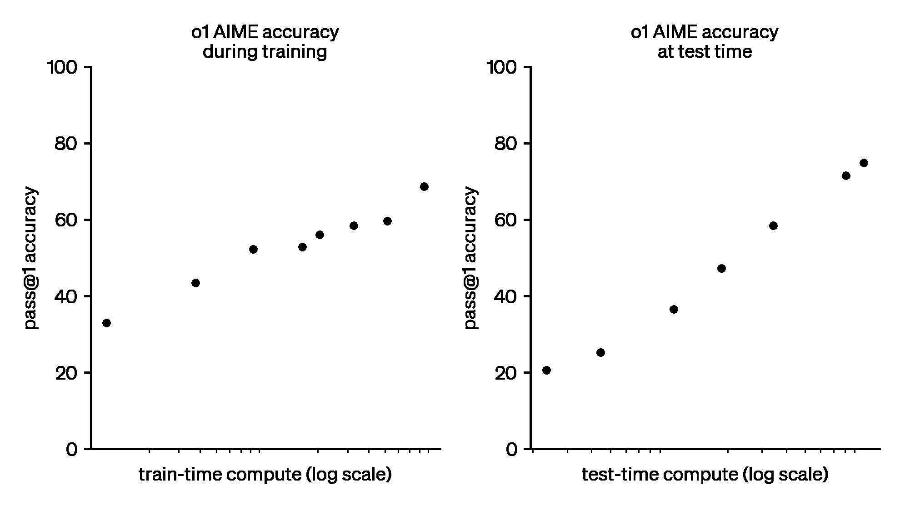

## How to read this lesson

This lesson has two levels. **Level 1 (Core)** contains what you need to
understand everything that follows in CS229 and the courses that build on
it. **Level 2 (Deep)** contains what you need for correct, interview-grade
understanding. Read Level 1 straight through. Return to Level 2 when you
want depth.

No prerequisites are assumed. Every term is defined at first use. Policy
gradient and the MDP were defined in [lecture
16](l16-reinforcement-learning.html); they are reused, not re-explained.

## Level 1: From REINFORCE to PPO

Policy gradient is on-policy: every update needs fresh trajectories
[01:23](ts:01:23). Fresh LLM generations are expensive. **PPO**,
proximal policy optimization [00:20](ts:00:20), reuses samples across
updates by correcting for the policy change.

The correction is the **ratio** r = pi_new(a|s) / pi_old(a|s): how much
more likely the action is under the new policy. Multiply the old
objective by r and stale samples approximate fresh ones. But ratios
explode: an action the old policy rarely took gets a huge weight, and
the update destabilizes.

The fix is **clipping** [44:30](ts:44:30): cap the ratio at [1 -
epsilon, 1 + epsilon]. The objective becomes min(r * A, clip(r) * A),
where A is the advantage. Big policy moves are simply ignored. The name
says it: keep the new policy **proximal** to the old one.

> [!QA]
> Q: What problem does PPO solve?
> A: Sample waste. Vanilla policy gradient discards every trajectory after one update because the policy changed. PPO reuses trajectories with importance weighting, then clips the weights so stale samples cannot yank the policy far. More learning per sample, stable updates. That is the whole contribution: efficiency plus a guardrail.
> Follow-up: Why clip instead of just trusting the ratio?
> A: Ratios have heavy tails. One rare action under the old policy gives a gigantic weight and a gigantic gradient step. A single bad batch can destroy training. Clipping bounds the damage: the update ignores any incentive to move the policy beyond the trust region. It is pessimism as engineering.

## Level 1: Advantages and baselines

Raw returns are noisy. A trajectory scores 10: was the action good, or
the situation easy? The **baseline** [17:07](ts:17:07) answers by
subtracting the expected: how much better than usual was this outcome?

The **advantage** [36:25](ts:36:25) is return minus baseline: A = R -
b(s). Positive advantage: push these actions up. Negative: push them
down. The baseline is often the value function V(s): the expected return
from the state. Subtracting it removes luck but not signal, because the
baseline does not depend on the action taken.

This is variance reduction, not bias introduction. The expected gradient
is unchanged: the baseline's contribution has expectation zero. What
changes is the noise. Smaller noise means fewer samples per update,
which is the currency PPO economizes.

> [!QA]
> Q: Why subtract a baseline instead of using raw returns?
> A: Raw returns mix action quality with situational luck. A good action in a bad state scores low; a bad action in a good state scores high. The baseline, usually the state's expected value, removes the situational part. What remains is the action's contribution: the advantage. Same expected gradient, far less noise. Less noise means fewer trajectories per update.
> Follow-up: What is a good baseline?
> A: The value function V(s): the expected return from the state under the current policy. It is the best state-dependent predictor of the return, so it removes the most variance. Learned alongside the policy, usually by a second network head. Actor-critic methods are exactly this: an actor for the policy, a critic for the baseline.

## Level 1: RL for reasoning models

Now the LLM application. The **state** is the token history. The
**action** is the next token. The dynamics are deterministic and trivial:
append the token. The reward comes only at the end of the trajectory:
did the final answer match the ground truth?

For math problems the reward is **verifiable** [00:35](ts:00:35) and
**binary** [67:24](ts:67:24): 1 if the extracted answer matches, 0
otherwise. No human labeler. No reward model to train. The task grades
itself.

The engineering detail: force the format. Ask the model to wrap its
answer in tags, like <answer>42</answer>. Extract with a parser, not an
AI judge [67:50](ts:67:50). Compare against the known answer. The parser
must be pragmatic: strict enough to be checkable, lenient enough that
formatting quirks do not zero out correct reasoning.

This trains **chain of thought** [56:36](ts:56:36): long reasoning
traces before the answer. The reward touches only the final answer, but
the gradient flows back through every token of the trace. Traces that
lead to correct answers get reinforced. Reasoning emerges from
answer-level rewards, with no supervision of the thinking itself.

> [!QA]
> Q: Why do verifiable rewards work so well for math?
> A: Three reasons. The reward is correct by construction: matching the answer is the task. It is cheap: a parser, not a human or a model. And it is dense enough at scale: with many problems, the binary signal separates good reasoning from bad across the dataset. No reward hacking through a learned judge, because there is no learned judge. The environment is the grader.
> Follow-up: What cannot verifiable rewards train?
> A: Anything without a checkable answer. Open-ended writing, taste, helpfulness: no parser grades those. Those need human feedback or learned reward models, which bring their own hacking problems. Verifiable rewards own the checkable slice: math, code, puzzles. The field's term is RLVR: reinforcement learning with verifiable rewards.

## Level 1: Stability is the open problem

The lecture is candid. PPO's theoretical justification is thin: why it
works, and when, remains partly mysterious. Post-training **stability**
is a general open issue [24:36](ts:24:36). Making these runs stable
"requires some magic." The open-source community has no consensus on the
best stabilization recipe. Frontier labs may know more.

This honesty is the point. RL post-training is the least settled part
of the modern stack. SFT is reliable. Pre-training is reliable. RL is
powerful and finicky. The course ends here deliberately: at the
frontier, where the answers are not in yet.

> [!QA]
> Q: If PPO is poorly understood, why is it the standard?
> A: It works reliably enough in practice and fails gracefully: clipping bounds the damage of bad updates. The alternatives are either less stable or more complex. Engineering often standardizes on the method with the best worst-case behavior, not the best theory. PPO's worst case is a clipped, small step. That is a comforting failure mode.
> Follow-up: What does "requires some magic" mean concretely?
> A: Reward shaping, KL penalties against the base model, careful batch construction, learning-rate schedules, early stopping on proxy metrics: a bundle of tricks with interacting effects. Change one and the run destabilizes. The magic is unprincipled but load-bearing. Documenting it honestly, as the lecture does, is more useful than pretending otherwise.

## Level 2: The full post-training stack

Step back and the course's modern arc is complete. Pre-training teaches
the world: next-word prediction on the internet. SFT teaches conduct:
instruction following from demonstrations. RL teaches reasoning:
trial-and-error on verifiable rewards. Each stage fixes what the
previous one cannot. Pre-training cannot follow instructions reliably.
SFT cannot discover reasoning strategies. RL can, at the cost of
stability.

The loss chip appears in every stage with new contents: cross-entropy,
then masked cross-entropy on answers, then the PPO clipped objective.
Same chip, three formulas. The course is one idea, specialized
repeatedly: define wrongness, minimize it, in that order.

## Level 2: RLVR and the reasoning frontier

The notes' o1 figure shows the payoff: AIME accuracy rising with both
train-time and test-time compute. **Test-time scaling** is the new axis:
let the model think longer, score higher. RL with verifiable rewards is
what taught the model to use the thinking time well.

The open questions are the course's parting gift. Which tasks admit
verifiable rewards? How far does test-time scaling go? What stabilizes
post-training? The answers are being written now, in labs and in the
open. The mathematics in this course is the vocabulary for reading
them.

## Recap: the whole lesson on one screen

Eight ideas carry this lecture. Read each card. Say the core sentence out
loud. If you can, you own the lesson.

<strong>1. PPO reuses samples safely</strong>

Importance ratio r corrects stale trajectories. Clipping bounds the
correction. Proximal updates, efficient learning.

Key: min(rA, clip(r)A)

<strong>2. Clipping is pessimism as engineering</strong>

Cap r at 1 +/- epsilon. Ignore incentives to move far. Heavy-tailed
ratios cannot destroy the run.

Key: bound the damage

<strong>3. Advantage = return minus baseline</strong>

Subtract the expected. Keep only better-than-expected. Same gradient
in expectation, far less noise.

Key: A = R - b(s)

<strong>4. Math grades itself</strong>

Binary reward: extracted answer matches truth. Parser, not judge.
<answer> tags make extraction pragmatic.

Key: 1 or 0, no human

<strong>5. Reasoning emerges from answer rewards</strong>

Reward touches only the final answer. Gradients flow through the
whole trace. Good thinking gets reinforced.

Key: supervise answers, get reasoning

<strong>6. Test-time scaling works</strong>

More thinking, higher AIME scores. RL taught the model to use the
time. A new axis alongside training compute.

Key: think longer, score higher

<strong>7. Stability is the open problem</strong>

Thin theory, finicky practice, no open-source consensus. Frontier
labs may know more. Honest uncertainty.

Key: powerful but unsettled

<strong>8. The stack: world, conduct, reasoning</strong>

Pre-train the world. SFT the conduct. RL the reasoning. Same chip,
three formulas. The course arc, complete.

Key: each stage fixes the last

## Official sources and further reading

**Official:**
- Lecture 17 video: PPO [00:20](ts:00:20), verifiable [00:35](ts:00:35), on-policy sampling [01:23](ts:01:23), baseline [17:07](ts:17:07), stability [24:36](ts:24:36), advantage [36:25](ts:36:25), clipping [44:30](ts:44:30), chain of thought [56:36](ts:56:36), binary reward [67:24](ts:67:24), answer extraction [67:50](ts:67:50).
- CS229 Spring 2026 official course notes: RL for LLMs chapter; the o1 scaling figure above is from it.

**Further reading:**
- Schulman et al. (2017), "Proximal Policy Optimization Algorithms": the PPO paper.
- OpenAI (2024), "Learning to Reason with LLMs": the o1 system card, for the test-time scaling results.

**Caveats from these sources.** The video's YouTube metadata title is
wrong; the content is PPO plus RL for LLMs per the transcript. PPO's
theory is thin by the lecturer's own account; treat justifications as
intuition. The o1 figure reports one benchmark family; generalization to
other tasks varies. RLVR needs checkable tasks; it does not transfer to
open-ended generation.

## Connections to the other courses

- **CS336:** the full RLHF/RLVR pipeline is CS336's post-training unit; this lecture is its foundation.
- **CS224N:** instruction tuning and preference data are the language-side inputs to this machinery.
- **CS329H:** reward modeling and preference aggregation are this lecture's reward function, formalized.

> [!CHEAT]
> **PPO and RLVR cheatsheet.** PPO: reuse samples via ratio r = pi_new/pi_old; clip r to [1-eps, 1+eps]; objective min(rA, clip(r)A); proximal updates. Advantage: A = R - b(s); baseline usually V(s); same expected gradient, less variance. LLM setup: state = history, action = next token, deterministic dynamics, reward at end. Verifiable: binary 1/0 on answer match; <answer> tags plus parser; no human. Chain of thought emerges from answer rewards. Stability: open problem, thin theory, bag of tricks.

> [!MEMORY]
> **Grade what you can check.** Verifiable rewards work because the task is its own judge. Wherever answers are checkable, RL is cheap and honest. Where they are not, you are back to human judgment with all its costs.
