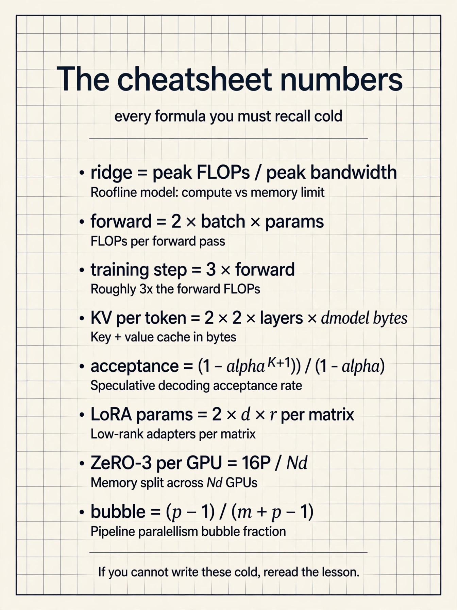
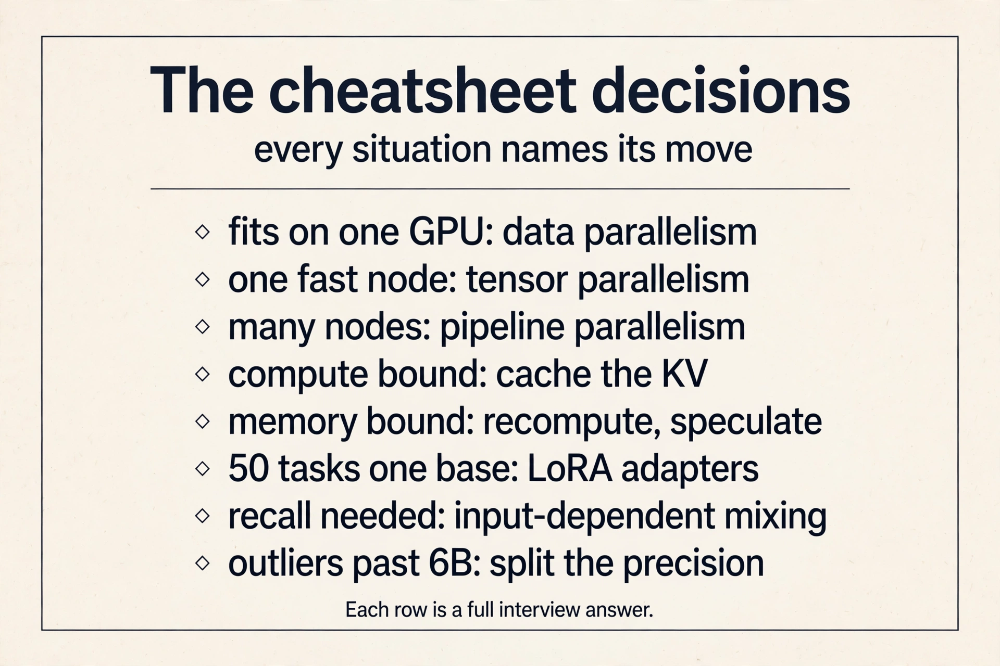

The whole course as a set of short stories. Each block tells one
idea the way the lesson tells it: the problem, the number, the
fix. Follow the links for the full derivations.

### The three gaps

Models grow because scaling laws say they should and because
abilities like few-shot learning appear only at scale. But
training compute demand grows 32x every 2 years against
Moore's law 2x, model size outruns the A100's 40 or 80 GB,
and a linear-time algorithm can still lose to
FlashAttention in wall-clock time. Training costs tens of
millions upfront. One inference call is under $0.0001 but
compounds with every user. Systems work closes all three
gaps. [Lecture 1](l01-introduction.html)

### Bottleneck diagnosis

Every kernel is load, compute, write. Time is max(Tmem,
Tmath), and the longer one names the bottleneck. Arithmetic
intensity is FLOPs per byte. The ridge is peak FLOPs over
peak bandwidth. On an A100 the ridge is 161: 312 TFLOPS
over 1,935 GB/s. Below it you are memory bound, so move
less data. Above it you are compute bound, so do more math.
The same matmul sits at 124 with N=128 (memory bound) and
2731 with N=8192 (compute bound): shape is part of the
diagnosis. [Lecture 3](l03-hardware-aware-design.html)

### The device block

One GPU holds 108 SMs with registers (256 KB per SM),
shared memory (192 KB per SM), L2 (40 MB), and HBM (40 GB
at about 2 TB/s). A kernel loads from HBM, computes
on-chip, writes back. Threads run in warps of 32 under
SIMT. One node connects 8 GPUs with NVLink. Many nodes
connect with InfiniBand, much slower. Frequent collectives
stay inside the node. Rare ones span the cluster. Tensor
cores multiply 16 by 16 tiles up to 16x faster, so keep
them busy with large tiles. [Lecture 5](l05-gpu-execution-model.html)

### Six performance principles

Fuse kernels to skip HBM round trips. Parallelize until
all SMs are busy. Tile so data is reused on-chip. Cache
intermediates when compute bound. Recompute them when
memory bound, because the extra math is free. Pipeline to
overlap memory with compute. And use the hardware's fast
path: tensor cores, intrinsics, new instructions. Diagnose
first, then pick the principle that matches the
bottleneck. [Lecture 3](l03-hardware-aware-design.html)

### FLOP counting

An MLP layer's forward pass costs 2BHN. The rule of thumb
is about 2 x batch x parameter count. The backward pass
needs two more matmuls per layer, 4BHN total, about twice
the forward, and it must cache the activations. One
training step is roughly 3x one forward pass: 1x forward,
2x backward, plus the activation storage. [Lecture 4](l04-transformer-performance.html)

### KV cache numbers

Past keys and values never change, so cache them. Per
token: 2 x 2 x layers x dmodel bytes in FP16. A 7B model
(24 layers, dmodel 2048) on a 40 GB A100 leaves 26 GB
after 14 GB of weights: 200k bytes per token, 130k tokens,
batch 128 at length 1024. On an A100 the Tmem/Tmath ratio
is 208 at dmodel 2048, so KV caching wins when compute
bound and recomputation wins when memory bound. Decode
arithmetic intensity is about 2 x batch: GPT-2-XL reads
over 3 GB per token, and an RTX 4090 with compute for
30,000 tokens/s decodes about 300. [Lecture 4](l04-transformer-performance.html)

### Speculative decoding

Decoding is memory bound, so extra compute is nearly free.
Guess the next tokens with a cheap draft, verify them all
in one big-model batch, keep the agreed prefix: branch
prediction for language models. Result: 2 to 3x speedup on
Chinchilla 70B, T5 11B, LaMDA 137B. Draft options: a small
model about 15x smaller (the sweet spot), Medusa heads
(nearly free, caps near 2x), or lossy tricks like INT4 and
skipped layers. The limit is draft agreement.
[Lecture 4](l04-transformer-performance.html)

### FlashAttention

Standard attention is memory bound: the cost is reads and
writes around the N by N score matrix, not the FLOPs. The
fix never materializes the matrix. Tile Q, K, V through
SRAM. Track a running softmax sum L and max m per tile, and
rescale each partial output by its share of the true
totals, which is exact. Recompute tiles in the backward
pass from the cached L and M of size N. 9x less HBM
traffic (40.3 to 4.4 GB), 13% more FLOPs, 6x faster (41.7
to 7.3 ms). Lower FLOPs do not imply wall-clock speedup.
[Lecture 6](l06-flash-attention.html)

### Pruning and sparsity

Pruning minimizes loss subject to a nonzero budget, and
iterative prune-and-fine-tune beats one-shot. But the
pattern decides the value: unstructured pruning is
accurate and scatters memory access, so it rarely speeds
up. Structured pruning stays regular and hardware-fast.
The compromise is 2:4 N:M sparsity, 2 of every 4 values
zero, which Ampere sparse tensor cores exploit for a real
50% weight cut. Set per-layer ratios by sensitivity
analysis, because layers differ.
[Lecture 7](l07-memory-efficient-networks.html)

### Quantization

Storage is parameters times bits. Adds cost O(N) and
multiplies O(N^2) in bit-width. FP32 is sign, 8-bit
exponent, 23-bit mantissa. BF16 trades precision for
range and trains stably. K-means quantization stores
log2(S)-bit indices plus S centroids: a 4x4 FP32 matrix
with 4 clusters goes from 64 to 20 bytes, 3.2x, with
compute still in FP32. Linear quantization maps r = S(q -
Z) and runs the whole matmul in integers. Past 6B
parameters, naive schemes break on outliers. LLM.int8()
fixes them with mixed precision to 175B.
[Lecture 7](l07-memory-efficient-networks.html)

### Distillation

Small models underfit, so a large teacher guides a small
student. The student matches the teacher's probability
distributions, not just its labels: in the worked example
the teacher says plane 5, car 1 (0.982/0.017) and the
student learns to move from 3, 2 (0.731/0.269) toward it.
The loss is cross-entropy E(-pt log ps) or L2 on the
probabilities. Align on logits, features, weights,
gradients, or sparsity: the student learns the teacher's
uncertainty, the dark knowledge.
[Lecture 7](l07-memory-efficient-networks.html)

### Fine-tuning and PEFT

Base models complete text. Instruction tuning teaches
them to follow it. RLHF trains a reward model on human
preference rankings and optimizes it, but human labels do
not scale. Constitutional AI replaces tens of thousands of
labels with about ten human principles: self-critique,
revisions, then RLAIF. Then the systems problem:
fine-tuning costs over 10x the weights. PEFT tunes almost
nothing instead. Prompt tuning trains m tunable input
embeddings on a frozen model. LoRA trains low-rank A and B
with r much smaller than d and merges them into the
weights after: h = Wx + BAx becomes one matmul, so
inference pays nothing.
[Lecture 8](l08-finetuning-and-peft.html)

### Attention-free architectures

Long convolutions cost O(N squared) naive, but the FFT
convolution theorem makes them O(N log N): transform,
multiply pointwise, transform back, exact. Linear
recurrences unroll into convolutions, so they train in
parallel and sample in O(1): that duality is S4, which
solved the long-range benchmarks. But language resisted:
at 360M scale attention hit 8.39 perplexity against 9.79
to 13.13 for SSMs. The diagnosis is recall: it needs
input-dependent mixing, and convolutional mixing is fixed
(diagonal-constant). The direction is sub-quadratic plus
selective: Mamba, gated linear attention.
[Lecture 9](l09-efficient-architectures.html)

### Parallelism

Split the data and replicate the weights, or split the
weights and replicate the data, or split the layers in
space and the batch in time. Mixed-precision Adam needs
16P bytes. ZeRO partitions it down to 16P/Nd across three
stages. Gradients sync by ring all-reduce, which is
bandwidth-optimal: per-node traffic approaches 2X no
matter the GPU count. Tensor parallelism shards
attention and MLP weights Megatron-style and must stay
inside NVLink. Pipeline parallelism stages layers and
flows microbatches, with 1F1B shrinking the bubble. The
decision: it fits, use data. One fast node, use tensor.
Many nodes, use pipeline. Combine all three at scale.
Alpa automates the search.
[Lecture 10](l10-parallelism.html)

### Interview one-liners

"Below the ridge, move less data. Above it, do more
math." "FlashAttention never writes the N by N matrix:
tile, rescale online, recompute backward." "Decoding is
memory bound: one token costs a full model read."
"LoRA merges into the weights, so inference pays
nothing." "Sparsity only helps if the pattern matches the
hardware." "Keep tensor parallelism inside NVLink. Span
nodes with data or pipeline." "KV caching wins when
compute bound. Recompute wins when memory bound."
"Recall needs input-dependent mixing: that is why
attention survives."

### Classic mistakes

Optimizing math on a memory-bound kernel: the toy proves
it buys nothing. Judging algorithms by big-O instead of
wall-clock on the target hardware. Unstructured pruning
with no speedup, because access stays scattered. Naive
quantization past 6B parameters, where outliers break it.
Tensor parallelism across nodes, where InfiniBand stalls
the all-reduces. One global sparsity ratio, when layers
differ. Confusing latency (time per item), throughput
(items per second), and bandwidth (the hardware ceiling).
Forgetting activations in training memory: the 16P is
before them.

### Go deeper

<iframe style="position:absolute;top:0;left:0;width:100%;height:100%;" src="https://www.youtube-nocookie.com/embed/9vcsZK3a76w" title="FlashAttention Explained" frameborder="0" allow="accelerometer; autoplay; clipboard-write; encrypted-media; gyroscope; picture-in-picture" allowfullscreen></iframe>

The papers behind the numbers: FlashAttention
(https://arxiv.org/abs/2205.14135), LoRA
(https://arxiv.org/abs/2106.09685), Mamba
(https://arxiv.org/abs/2312.00752), ZeRO
(https://arxiv.org/abs/1910.02054), DPO
(https://arxiv.org/abs/2305.18290), QLoRA
(https://arxiv.org/abs/2305.14314), S4
(https://arxiv.org/abs/2111.00396), Zoology
(https://arxiv.org/abs/2312.05482). Video explainers:
FlashAttention https://www.youtube.com/watch?v=9vcsZK3a76w,
LoRA https://www.youtube.com/watch?v=t509sv5MT0w, Mamba
https://www.youtube.com/watch?v=9dSkvxS2EB0.

