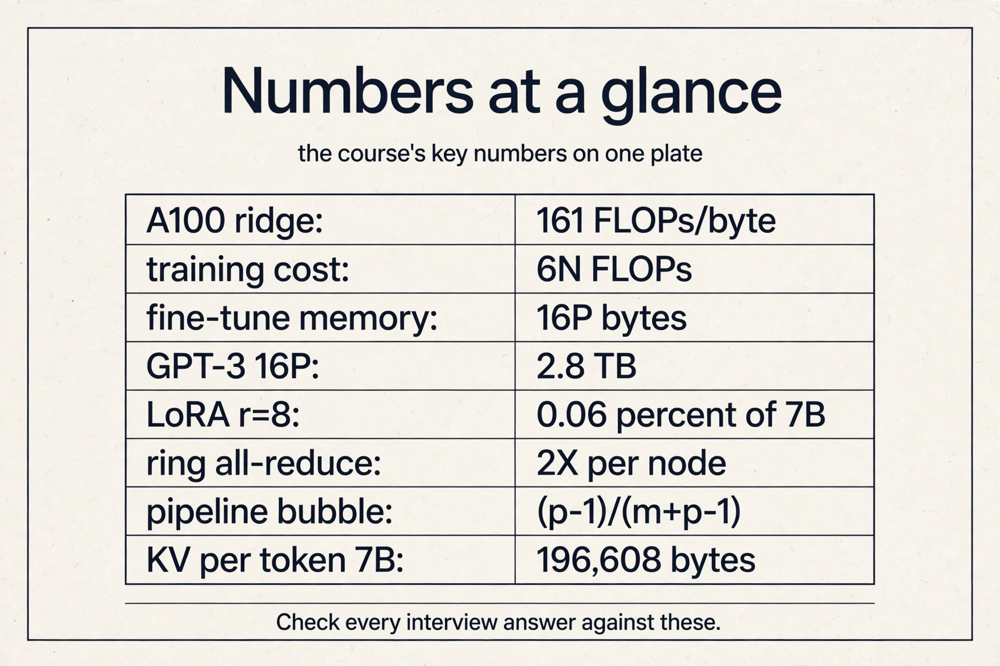
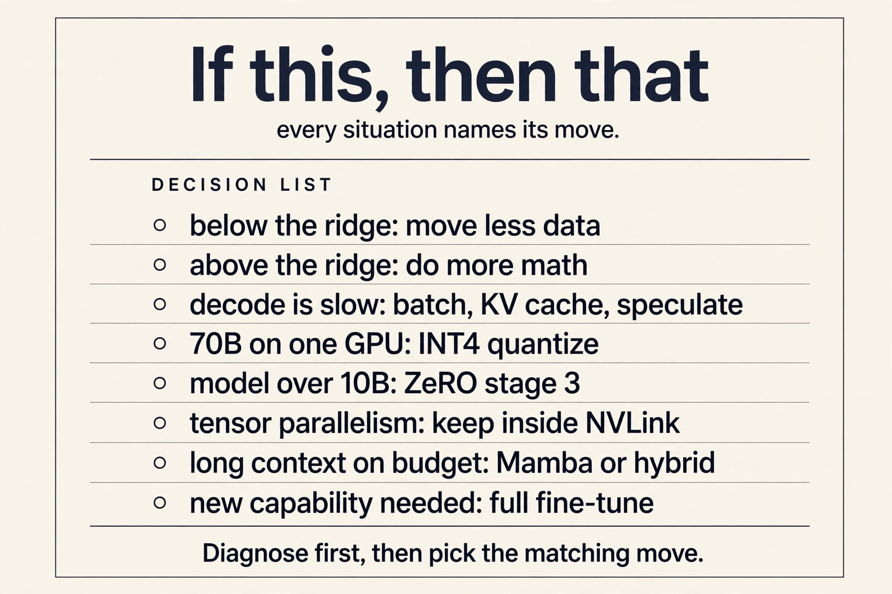
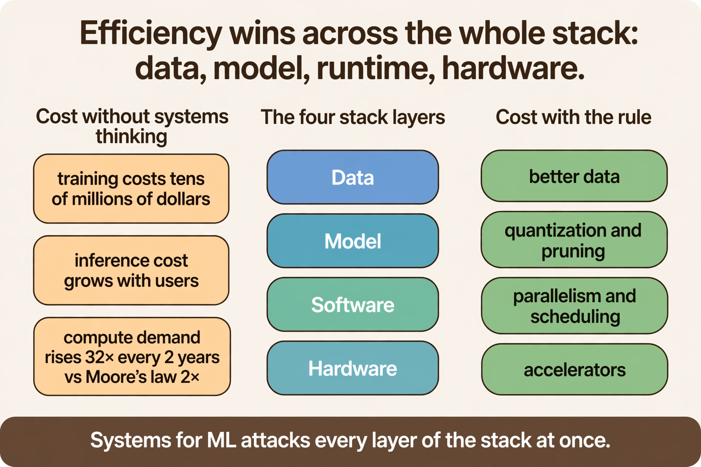
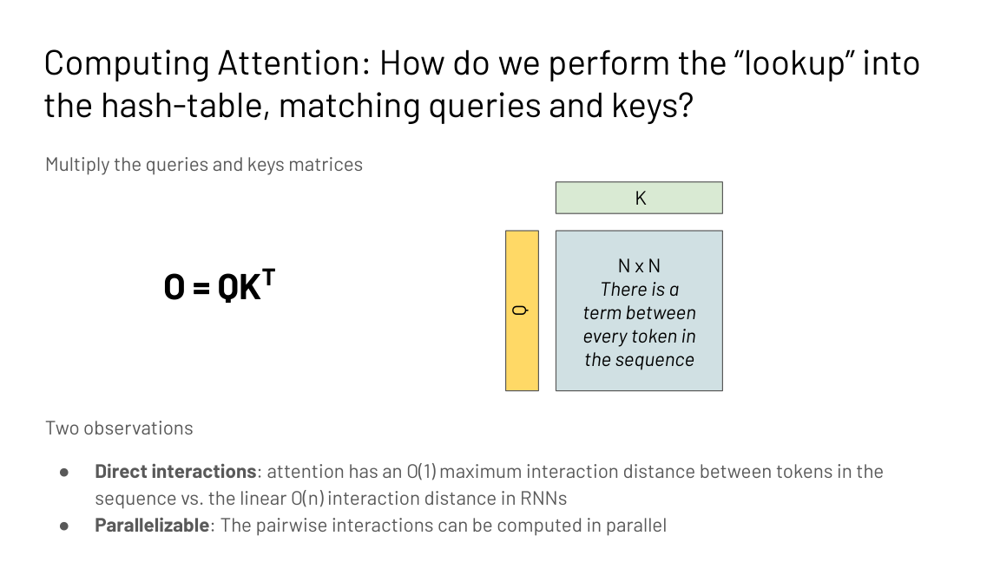
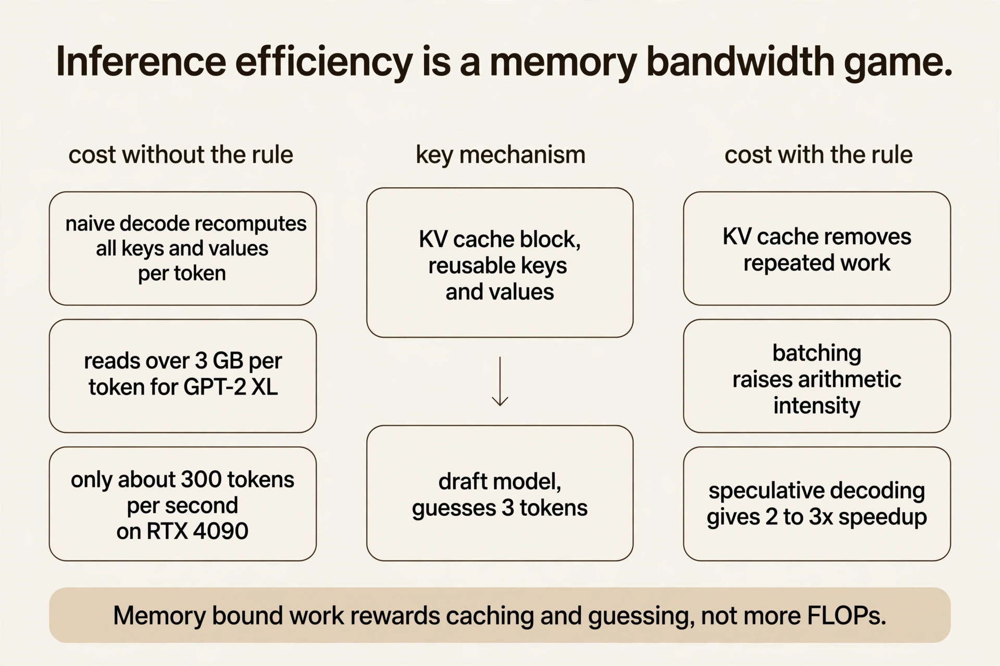
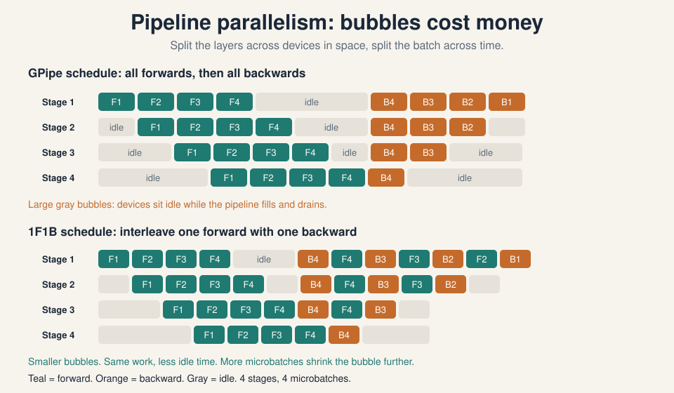

30 minutes · interview speed

This page tells the whole systems story fast. Each section gives you
the working version: enough to answer interview questions with
confidence. Links at the end of each section take you into the full
lesson when you want the derivations and the follow-ups.

<figure class="crash-fig"><figcaption>Every number the exam can ask for, on one plate. Check each answer against these.</figcaption></figure>

<figure class="crash-fig"><figcaption>Every situation names its move. Diagnose first, then pick the matching row.</figcaption></figure>

### 1. Three gaps drive the whole course

Models keep growing because scaling laws reward size and because
abilities like few-shot learning exist only at scale. But the
arithmetic is brutal. Training compute demand grows 32x every 2
years while Moore's law gives 2x. Model size outruns the A100's
40 or 80 GB of memory, so new models die with out-of-memory on
arrival. And paper speed is not wall-clock speed: a linear-time
attention algorithm loses to hardware-aware FlashAttention on a
real GPU. Training is a tens-of-millions upfront bill. One
inference call is under $0.0001 but compounds with every user.
Systems for ML closes all three gaps, one layer of the stack at
a time.

<figure class="crash-fig"><figcaption>Data, model, software, hardware: every layer gets its own efficiency lever.</figcaption></figure>

<ul class="crash-links">
<li><a href="l01-introduction.html">Lecture 1: the economic case</a></li>
</ul>

### 2. The transformer block you are optimizing

A language model factors into next-token predictions via the chain
rule. The transformer mixes tokens with attention: queries look up
keys, values mix by similarity, and every token meets every other
token in one step. That single property, O(1) interaction distance,
is what made transformers win. Its price is quadratic: the N by N
score matrix. Everything in this course is an answer to that
price.

<figure class="crash-fig"><figcaption>O = QK^T: O(1) interaction distance, parallelizable, quadratic cost.</figcaption></figure>

<ul class="crash-links">
<li><a href="l02-sequence-models.html">Lecture 2: the full story, built from zero</a></li>
</ul>

### 3. Diagnose first: memory bound or compute bound

Every kernel is load, compute, write, and total time is max(Tmem,
Tmath). Arithmetic intensity is FLOPs per byte. The device ridge
is peak FLOPs over peak bandwidth, 161 FLOPs per byte on an
A100. Below the ridge you are memory bound: move less data,
fuse kernels, tile better. Above it you are compute bound: do
more math, use tensor cores. The same matmul sits at 124 with
N=128 and 2731 with N=8192, so the shape is part of the
diagnosis. Never optimize before diagnosing.

<figure class="crash-fig"><figcaption>Left of the ridge, buy bandwidth. Right of the ridge, buy compute.</figcaption></figure>

<ul class="crash-links">
<li><a href="l03-hardware-aware-design.html">Lecture 3: the decision procedure</a></li>
</ul>

### 4. The device block

One GPU: 108 SMs, registers, shared memory, L2, 40 GB of HBM.
A kernel loads from HBM, computes on-chip, writes back. Threads
run in warps of 32 under SIMT. One node: 8 GPUs on NVLink.
One cluster: nodes on InfiniBand, much slower. Tiling keeps
data on-chip and halves redundant loads. Tensor cores multiply
16 by 16 tiles up to 16x faster, so express work as big
matmuls. The hierarchy decides everything: frequent collectives
stay inside the node, rare ones span the cluster.

<figure class="crash-fig"><figcaption>Defined here; MS&E435 reuses this symbol.</figcaption></figure>

<ul class="crash-links">
<li><a href="l05-gpu-execution-model.html">Lecture 5: the device block</a></li>
</ul>

### 5. Training costs 3x a forward pass; decoding is memory bound

Backprop on the toy graph shows the two systems facts: reuse
intermediate derivatives, and store activations for the
backward pass. Forward is 2BHN per MLP layer. Backward is
4BHN, so a training step costs about 3x one forward pass
plus activation storage. Inference breaks differently:
autoregressive decoding recomputes the whole prefix per
token. Past keys and values never change, so cache them:
the KV block costs 2 x 2 x layers x dmodel bytes per
token, and a 7B model on a 40 GB A100 caches 130k tokens,
batch 128 at length 1024. Decoding reads over 3 GB per
GPT-2-XL token. The RTX 4090 has compute for 30,000
tokens/s but decodes about 300. Memory sets the serving
limit, not FLOPs.

<figure class="crash-fig"><figcaption>Cache and guess when memory bound; batch when you can.</figcaption></figure>

<ul class="crash-links">
<li><a href="l04-transformer-performance.html">Lecture 4: FLOP counting and KV caching</a></li>
</ul>

### 6. Speculative decoding: guess, then verify

Decoding is memory bound, so extra compute is nearly free.
A small draft model, about 15x smaller than the main one,
guesses the next tokens. The big model checks them all in
one parallel batch. The agreed prefix is accepted for
free. Wrong guesses cost little because the batch was
memory bound anyway. Result: 2 to 3x speedup on 11B to
137B models. It is branch prediction for language models,
and the speedup is capped by how often the draft agrees.

<ul class="crash-links">
<li><a href="l04-transformer-performance.html">Lecture 4: the three draft strategies</a></li>
</ul>

### 7. FlashAttention: never write the N by N matrix

Standard attention is memory bound: the bill is reads and
writes around the score matrix, not FLOPs. The field tried
approximating first (sparse, low-rank, kernel), and paid
in quality. FlashAttention asked whether exactness could
be fast. Tile Q, K, V through SRAM so the N by N matrix
never exists. Track a running softmax sum and max per tile
and rescale each partial output by its share of the true
totals, which is exact. Recompute tiles in the backward
pass from cached vectors of size N. 9x less HBM traffic,
13% more FLOPs, 6x faster. Lower FLOPs do not imply
wall-clock speedup.

<figure class="crash-fig"><figcaption>Fusion plus tiling plus recompute beats lower FLOPs in wall clock.</figcaption></figure>

<ul class="crash-links">
<li><a href="l06-flash-attention.html">Lecture 6: the full derivation</a></li>
</ul>

### 8. Shrink the model: prune, quantize, distill

Three cuts, one smaller model. Pruning removes weights, but
only structured patterns speed up hardware: 2:4 N:M
sparsity matches Ampere tensor cores for a real 50% cut.
Quantization spends fewer bits: k-means stores indices plus
centroids (3.2x on the toy, compute still FP32), linear
quantization runs the whole matmul in integers via scale
and zero-point. Distillation trains a small student on the
teacher's probability distributions, transferring the
uncertainty, not just the labels. Each trades a little
accuracy for a lot of memory. Pruning plus quantization
compose.

<figure class="crash-fig"><figcaption>Three cuts, one smaller model.</figcaption></figure>

<ul class="crash-links">
<li><a href="l07-memory-efficient-networks.html">Lecture 7: all numbers worked</a></li>
</ul>

### 9. Fine-tune the behavior, then fine-tune the cost

Base models complete text. Instruction tuning teaches them
to follow it. RLHF trains a reward model on human
preference rankings and optimizes it. Constitutional AI
replaces tens of thousands of labels with about ten
human-written principles and AI feedback. Then the systems
problem: fine-tuning costs over 10x the weights in memory,
and one full model per task is undeployable. PEFT tunes
almost nothing: prompt tuning trains input embeddings on a
frozen model, and LoRA trains low-rank adapters that merge
into the weights after training, so inference pays zero
latency.

<ul class="crash-links">
<li><a href="l08-finetuning-and-peft.html">Lecture 8: RLHF, RLAIF, and PEFT</a></li>
</ul>

### 10. Attention-free architectures and the recall test

Convolutions via the FFT run in O(N log N), exact. Linear
recurrences train as convolutions and sample in O(1), and
that duality is S4, which solved the long-range
benchmarks. But language resisted: at 360M scale, attention
hit 8.39 perplexity against 9.79 to 13.13 for the SSMs.
The diagnosis is recall: grounding predictions in context
needs input-dependent mixing, and convolutional mixing is
fixed. The direction is sub-quadratic plus selective:
Mamba, gated linear attention. Measure efficiency on the
task, not on asymptotics.

<ul class="crash-links">
<li><a href="l09-efficient-architectures.html">Lecture 9: FFT, S4, and recall</a></li>
</ul>

### 11. Parallelism: split what does not fit

Data parallelism splits the batch and all-reduces
gradients. The ring version is bandwidth-optimal, with
per-node traffic approaching 2X at any GPU count.
Mixed-precision Adam needs 16P bytes. ZeRO partitions it
down to 16P/Nd. Tensor parallelism shards attention and
MLP weights Megatron-style and must stay inside NVLink,
because its all-reduces are constant. Pipeline parallelism
stages layers and flows microbatches, with 1F1B shrinking
the bubble, and needs only point-to-point sends. The
decision: it fits, use data. One fast node, use tensor.
many nodes, use pipeline. Combine all three at
thousand-GPU scale. Alpa automates the search.

<figure class="crash-fig"><figcaption>Microbatches and 1F1B keep stages busy.</figcaption></figure>

<ul class="crash-links">
<li><a href="l10-parallelism.html">Lecture 10: the decision table</a></li>
</ul>

### One-glance tables

**Ridges (FLOPs/byte):** A100 161, H100 295, H200 206,
B200 FP16 281, B200 FP8 562. Below your ridge: memory
bound, move less data. Above: compute bound, do more math.

**The 16P ladder (10B, 8 GPUs):** baseline 160 GB, ZeRO-1
55 GB, ZeRO-2 37.5 GB, ZeRO-3 20 GB. Climb only as far as
the memory gap demands.

**Parallelism decision:** fits on one GPU: data. One fast
node: tensor (NVLink only). Many nodes: pipeline.
Thousand-GPU scale: all three (PTD); Alpa automates the
search.

**Quantization family:** GPTQ for a quick one-shot shrink,
AWQ for the best 4-bit accuracy, FP8 when hardware and
training support it end to end, INT4 to fit 70B on one
80 GB GPU (35 GB weights).

**Recall needs what:** attention 8.39 vs SSM 9.79-13.13
perplexity at 360M. Content lookup needs input-dependent
mixing: attention, selective SSMs, hybrids.

### Memory aids

**Mnemonic for the six performance principles:** Fuse,
Parallelize, Tile, Cache-or-recompute, Pipeline, fast
Path. Say "FPT-CPP" before you touch any kernel.

**Never-confuse pairs:**

- Latency (time per item) vs throughput (items per second)
  vs bandwidth (the hardware ceiling).
- Tmem/Tmath (a ratio) vs arithmetic intensity (FLOPs per
  byte) vs the ridge (peak FLOPs over peak bandwidth).
- Prefill (compute bound, parallel) vs decode (memory
  bound, sequential).
- RLHF (reward model plus RL) vs DPO (one loss on the
  preference pairs).
- Data (split batch) vs tensor (split weights, NVLink
  only) vs pipeline (split layers, microbatches).
- Magnitude pruning (a weight statistic) vs regression
  pruning (an output statistic).
- Temperature T = 1 (hard labels) vs T = 5 (dark knowledge
  revealed).
- KV caching (wins compute bound) vs recomputation (wins
  memory bound).

**If-this-then-that:**

- Intensity below the ridge: fuse, tile, move less data.
- Intensity above the ridge: more math, tensor cores.
- Decode too slow: batch, KV cache, speculate.
- 70B on one 80 GB GPU: INT4 (35 GB weights).
- Model past 10B: ZeRO stage 3.
- Tensor parallelism: never across nodes.
- Long context on a budget: Mamba or a hybrid.
- Genuinely new capability: full fine-tuning, not LoRA.

### Rapid-fire Q&A

**Q: Memory bound or compute bound, and how do you know?**
A: Compare arithmetic intensity (FLOPs/byte) to the ridge
(161 on A100). Below: memory bound, move less data. Above:
compute bound, do more math.

**Q: Why is decoding slow?**
A: One token costs a full model read. Small batches are
memory bound. Fix with batching, KV caching, and
speculative decoding.

**Q: What is FlashAttention in one sentence?**
A: Exact attention that never materializes the N by N
matrix: tile through SRAM, rescale the softmax online,
recompute backward. 9x less traffic, 6x faster.

**Q: When does KV caching win?**
A: When compute bound: the extra memory traffic is the
cheaper side. When memory bound, recomputation can win
instead.

**Q: LoRA vs full fine-tuning for 50 tasks?**
A: One 14 GB base plus 50 tiny adapters versus 50 copies
of 14 GB. The adapters merge into the weights, so
inference pays nothing.

**Q: Why did sparsity need 2:4 structure?**
A: Unstructured pruning scatters memory access and rarely
speeds up. 2:4 matches Ampere sparse tensor cores:
regular, fast, 50% fewer weights.

**Q: Data, tensor, or pipeline parallelism?**
A: Model fits: data. One fast node: tensor (NVLink only).
Many nodes: pipeline. Combine at scale.

**Q: Why do convolutions lose to attention on recall?**
A: Recall needs input-dependent mixing. Attention adapts
per example. Convolutional mixing is fixed. Flexibility
beats asymptotics.

**Q: A 10B model, 8 GPUs. Which ZeRO stage?**
A: Stage 1 gives 55 GB per GPU (fits 80 GB). Stage 2 gives
37.5 GB. Stage 3 gives 20 GB for 1.5x communication. Match
the stage to the gap, not the maximum.

**Q: How many trainable parameters in LoRA r = 8 on Wq, Wv, 7B?**
A: 2 x 4096 x 8 = 65,536 per matrix. Times 2 matrices times
32 layers: 4.2M, 0.06 percent of 7B.

**Q: Ring all-reduce with N = 16, X = 4 GB?**
A: 30 iterations, 7.5 GB per node. As N grows, per-node
traffic approaches 2X: bandwidth-optimal.

**Q: Pipeline bubble with 4 stages and 8 microbatches?**
A: (4-1)/(8+4-1) = 3/11 = 27 percent. Double the
microbatches to cut it to 16 percent.

**Q: DPO versus RLHF in one breath?**
A: RLHF trains a reward model then RL-optimizes against
it. DPO trains one loss directly on the preference pairs.
Same inputs, one stable run.

**Q: Why does iterative pruning beat one-shot?**
A: One 90 percent cut destroys co-adapted structure. Five
rounds of 37 percent with fine-tuning between reach the
same sparsity with accuracy intact.

**Q: What does the distillation temperature do?**
A: T = 1 gives near-hard labels (0.98/0.02). T = 5 softens
to 0.69/0.31 and reveals the teacher's uncertainty. Train
at high T, deploy at T = 1.

**Q: FFT convolution theorem in one line?**
A: Time-domain convolution equals frequency-domain
pointwise multiplication. O(n^2) becomes O(n log n).
Exact, not approximate.

### Go deeper

<iframe style="position:absolute;top:0;left:0;width:100%;height:100%;" src="https://www.youtube-nocookie.com/embed/9vcsZK3a76w" title="FlashAttention Explained" frameborder="0" allow="accelerometer; autoplay; clipboard-write; encrypted-media; gyroscope; picture-in-picture" allowfullscreen></iframe>

- FlashAttention explained from zero: https://www.youtube.com/watch?v=9vcsZK3a76w
- LoRA explained: low-rank adaptation: https://www.youtube.com/watch?v=t509sv5MT0w
- Mamba explained: selective state spaces: https://www.youtube.com/watch?v=9dSkvxS2EB0
- FlashAttention paper (Dao et al.): https://arxiv.org/abs/2205.14135
- LoRA paper (Hu et al.): https://arxiv.org/abs/2106.09685
- Mamba paper (Gu and Dao): https://arxiv.org/abs/2312.00752
- ZeRO paper (Rajbhandari et al.): https://arxiv.org/abs/1910.02054

