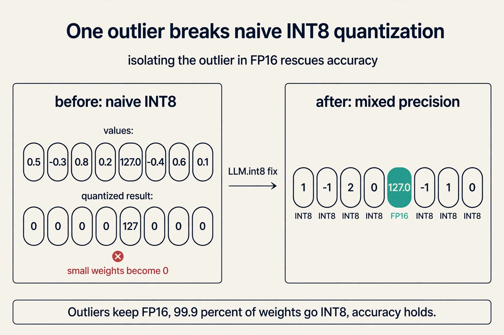
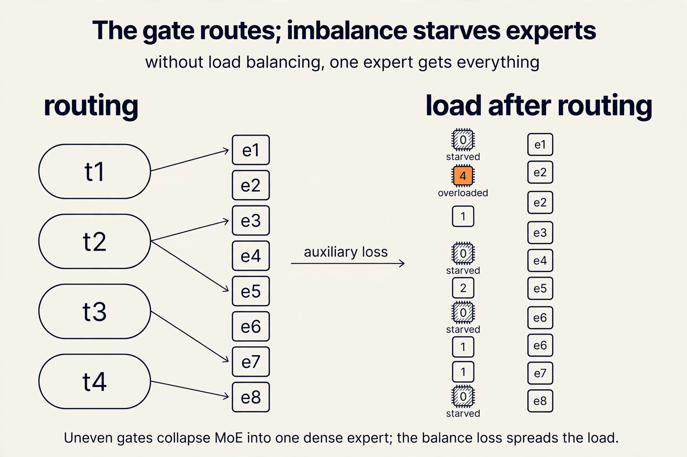
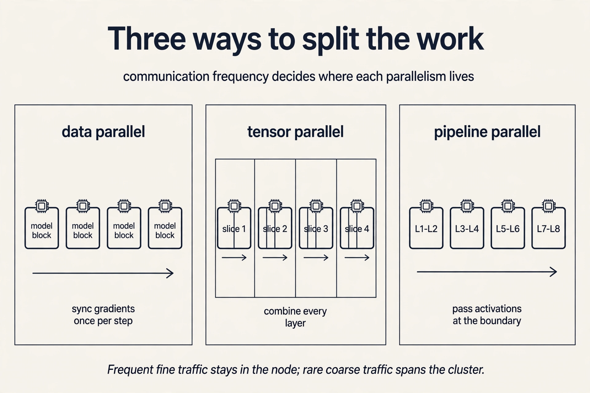
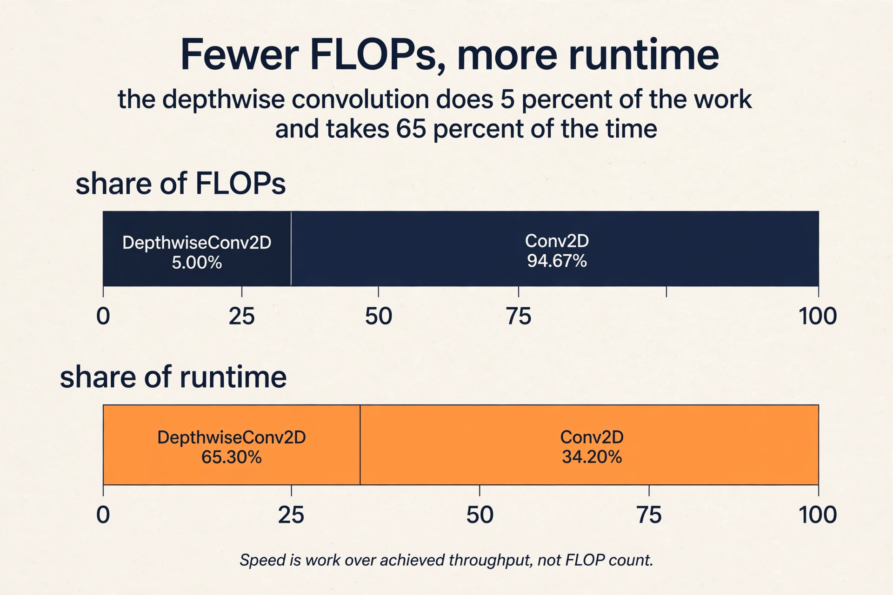

## The scene: a new model drops, and your GPUs say no

A new large language model drops. You rent a cluster of A100s to
fine-tune it. The job starts, the weights load, and the process
dies with three words: out of memory. This is not a bug in your
code. This is the default experience of working with large models
in 2024, and it is the reason this course exists.

The lecture opens with the bet the whole field is making. **Large
language models** are neural networks trained to predict text, and
they keep getting bigger because bigger keeps working. Kaplan et
al. (2020) showed that performance improves smoothly with three
inputs: the amount of compute used, the dataset size, and the
number of parameters in the model. These are the **scaling laws**:
predictable gains from predictable scaling.

Size also buys abilities that small models never show. GPT-3
demonstrated few-shot learning: the ability to do a new task from
a handful of examples (Brown et al., 2020). Chain-of-thought
reasoning, where the model writes out intermediate steps, emerged
the same way (Wei et al., 2022). These are **emergent behaviors**:
capabilities that appear only past a size threshold. You cannot
get them by training a small model cleverly. The size is the
point.

And size demands a second step. A pretrained model predicts the
next token on web text. Ask it to translate "cheese" to French
and it may keep writing translation examples instead of
answering. **Fine-tuning** updates the model's weights on
instruction-following data so it answers instead of completing.
Thoppilan et al. (LaMDA, 2022) is the lecture's example: the same
base model, fine-tuned for dialog, becomes an assistant.

So the field's plan is fixed: train big, then fine-tune. Now the
question this course asks: what does that plan cost, and who pays?

## The first plan: buy bigger hardware

The naive answer is hardware. Models grow, so buy better chips. This
works only if chips improve as fast as models grow. They do not.

Sevilla et al. (2022) plotted training compute across three eras
of machine learning. In the deep learning era, training compute
grows **32x every 2 years**. Moore's law, the pace of hardware
improvement, gives roughly **2x every 2 years**. The gap is 16x
per 2-year window, and it compounds. Each generation of models
demands far more than new hardware supplies.

Work the arithmetic. Two years pass. Hardware doubles. Model
compute demand multiplies by 32. The missing factor of 16 must
come from somewhere else: better algorithms, better
parallelism, better utilization. That missing factor is this
course.

The second gap is memory. Model size follows the same steep
curve, but accelerator memory is nearly flat: the V100 holds
32 GB, the TPUv3 holds 32 GB, the A100 holds 40 or 80 GB. The
largest models sit far above all of them.

That out-of-memory error from the opening scene is now
explained. The weights do not fit. No setting in your training
script fixes a 32 GB card facing a 100 GB model. The options are
to shrink the model, split it across devices, or both. Every
later lecture is one of those options.

## The third gap: paper speed is not wall-clock speed

The third gap is the subtlest, and the lecture returns to it in
every later lecture. An algorithm can be better on paper and
slower on the machine.

The lecture's example is attention, the core operation of the
transformer. A fancy new linear attention algorithm scales as
O(N) in sequence length, against O(N squared) for standard
attention. On paper it wins. But FlashAttention, a
hardware-aware implementation of the exact O(N squared)
algorithm, runs faster in measured wall-clock time.

Why? Big-O notation hides constants and ignores how an
algorithm uses memory. A linear algorithm that ignores the
memory hierarchy can lose to a quadratic one that respects it.
The rule the course repeats: judge algorithms by measured
runtime on the target hardware, never by asymptotics alone.
Lecture 3 makes this quantitative. Lecture 6 shows exactly why
FlashAttention wins.

A second cost split runs through the whole course. **Training**
is a large upfront bill: tens of millions of dollars for a
frontier model. **Inference**, running the model for one input,
is cheap per call, under $0.0001 for a large model, but it
accumulates with every user. The lecture's production example
shows inference cost rising steadily as the user base grows.
Design for training when the bill is upfront. Design for
serving when the bill compounds.

Three gaps, each demonstrated: compute demand outruns hardware
(32x vs 2x), model size outruns memory (the OOM scene), and
asymptotics outrun wall-clock reality (the attention meme).
Hardware alone cannot close any of them.

## The key question

If buying bigger chips cannot close the gap, what can? The
lecture's answer is the whole stack. Efficiency is not one
trick. It is a lever at every layer, and the levers compose.

## Four layers of levers

The stack has four layers: data, model, software, hardware.
Each gets its own efficiency lever, and the lecture gives a
concrete win for each.

**Model: quantization.** Training and serving in 32-bit
floating point is desirable for its wide dynamic range, but
8-bit integer arithmetic sharply improves memory and speed.
The catch: naive quantization degrades accuracy unacceptably,
and it scales poorly past about 6B parameters. The fix is
model-aware. Dettmers et al. (LLM.int8(), 2022) diagnosed the
failure: outlier features in large transformers break naive
8-bit quantization. Their outlier-aware mixed-precision
decomposition keeps most of the matrix in INT8 and handles
outliers in FP16, enabling inference up to 175B parameters
without accuracy loss. Quantization is not a blunt bit-width
cut. It is a diagnosis of which values actually break, then a
targeted fix. Lecture 7 derives the classical schemes.

### Subchapter: why naive quantization breaks

Memory first. One billion weights in FP32 need 4 GB. The same
weights in INT8 need 1 GB. That factor of 4 is the whole pitch:
quantization stores each number in fewer bits.

The toy that shows the failure: eight weights, [0.5, -0.3, 0.8,
0.2, 127.0, -0.4, 0.6, 0.1]. INT8 spans -128 to 127. Naive
quantization scales by the max: 127.0 maps to 127, and 0.5 maps to
0.5 / 127 * 127, about 0. Every small weight rounds to zero. The
matrix becomes the outlier plus zeros. Accuracy collapses.

### Subchapter: the outlier fix (LLM.int8)

Dettmers et al. (LLM.int8, 2022) found exactly this in real
models. Large transformers grow a few feature dimensions with huge
magnitudes, the outliers, while the rest stay small. The fix is
surgical: quantize 99.9 percent of the matrix to INT8 and keep the
outlier columns in FP16. Memory still drops by nearly 4x.
Accuracy holds. The paper ran OPT-175B this way with no accuracy
loss.

### Subchapter: the quantization family (GPTQ, AWQ, FP8)

LLM.int8 stops at 8 bits. The next step down is 4 bits, another
factor of 2 in memory. Two schemes dominate.

**GPTQ** quantizes layer by layer, using the Hessian (the matrix
of second derivatives) to spread each weight's rounding error
onto the weights that remain unquantized. It needs one
calibration pass over sample text. Most public 4-bit Llama quants
on HuggingFace are GPTQ.

**AWQ** (activation-aware weight quantization) protects the small
fraction of weight channels that activations hit hardest: it
scales those channels up before quantizing so their rounding
error shrinks. Also needs calibration. vLLM and AutoAWQ ship AWQ
kernels.

| Scheme | Bits | What it protects | Calibration data | Public use |
|---|---|---|---|---|
| LLM.int8 | 8 | outlier columns in FP16 | none, dynamic | HuggingFace transformers |
| GPTQ | 4 | rounding error spread via Hessian | yes, small set | most Llama 4-bit quants |
| AWQ | 4 | salient weights by activation scale | yes, small set | vLLM, AutoAWQ |
| FP8 | 8 | range via E4M3/E5M2 formats | none | DeepSeek-V3 training |

**FP8** is a different animal: a floating format, not integer,
used during training itself. DeepSeek-V3 trained in FP8, public
in its paper. DeepSeek-V4 moved to NVFP4, a 4-bit microscaling
format. What quantization GPT-5 uses, if any, is not public.
Unknown.

**Model: sparsity.** Traditionally neural networks are dense:
each input is processed by the entire model. **Mixture-of-experts**
(MoE) is dynamic: large weight matrices are replaced by a
mixture of smaller matrices called **experts**, and a gating
function routes each input to a small number of them. Shazeer,
Mirhoseini et al. (2017) introduced the sparsely-gated MoE
layer. Fedus et al. (2021) applied it to transformers. Total
capacity grows with expert count while cost per token stays
near flat. The systems cost moves to routing, load balancing,
and communication, which is why MoE is a systems topic as much
as an architecture topic.

### Subchapter: MoE routing, and why load balancing is the real bill

The gate picks experts per token. Original MoE (Shazeer et al.
2017): top-2 of up to 2048 experts. Switch Transformers (Fedus et
al. 2021): top-1, simpler and faster. Fewer active experts means
less compute per token but a weaker routing choice.

The toy: 4 tokens, 8 experts, top-2 routing. The gate assigns
token 1 to {2, 5}, token 2 to {2, 7}, token 3 to {2, 3}, token 4
to {5, 2}. Expert 2 gets 4 assignments. Experts 1, 4, 6, 8 get
zero. Left alone, the gate keeps picking the expert that already
works, and the rest starve. That is expert collapse: you paid for
8 experts and use 1. The fix is an auxiliary loss that penalizes
uneven assignment and forces the gate to spread tokens. Then
experts specialize and the capacity pays off.

Then the systems bill: experts live on different devices, so each
token's dispatch is an all-to-all communication across the
network. That is expert parallelism, and it is why MoE appears in
a systems course. The gate's decision is a network operation.

What is used where: Mixtral 8x7B routes top-2 of 8 experts,
public. DeepSeek-V3 routes 8 of 256 fine-grained experts plus one
shared expert, public. GPT-4 is rumored to be MoE. Not confirmed.
Unknown.

**Software: parallelism and mapping.** Scaling across devices
needs parallelization strategies, and the strategy must match
the hardware. Traditional model parallelism partitions the
model into disjoint sub-models. Tensor parallelism partitions
tensors within the same operation. The tradeoff is direct:
model parallelism communicates less but idles more. Tensor
parallelism idles less but communicates more, so it demands
fast interconnects.

And the network decides where each style lives. Connections
inside one machine are orders of magnitude faster than
networking between machines. Communication-heavy patterns stay
inside the node. Rarer, larger patterns span the cluster.
Lecture 10 derives all three strategies.

### Subchapter: the parallelism family, and where each lives

Three ways to split the work. The network decides where each
lives.

**Data parallelism.** Copy the whole model to each GPU. Split the
batch. Each GPU trains on its slice, then all-reduce syncs the
gradients. Memory need: the full model must fit on one GPU.
Communication: one gradient sync per step, large but infrequent.
Spans nodes happily.

**Tensor parallelism.** Split single operations across GPUs. One
matrix multiply becomes two halves on two GPUs, results combined.
Memory need: the model shards, so 70B in FP16 (140 GB) fits across
two 80 GB cards. Communication: every layer, small and frequent.
Stays inside one machine, on NVLink.

**Pipeline parallelism.** Split the layers. GPU 0 holds layers
1-8, GPU 1 holds 9-16. Feed microbatches through. Memory need:
shards like tensor parallel. Communication: only activations at
the boundary, rare. Spans nodes. The cost is idle time: the
pipeline drains and fills, the bubble.

The rule: frequent fine-grained communication stays intra-node.
Rare coarse communication spans the cluster. Llama 3 trained on
16,384 H100s with data plus model plus pipeline parallelism,
public in the Meta paper. Megatron-LM is the public tensor-parallel
implementation. DeepSeek-V3's DualPipe overlaps communication with
computation to hide the cost, public in its paper. GPT-4's
strategy is not public. Unknown.

**Hardware: design for the device, not the FLOP count.**
EfficientNet introduced depthwise convolutions with fewer FLOPs (floating-point operations)
than competing ResNets. But the operation took 5.00% of FLOPs
and 65.30% of runtime. Fewer FLOPs, more time.

| Operation | Share of FLOPs | Share of runtime |
|---|---|---|
| DepthwiseConv2D | 5.00% | 65.30% |
| Conv2D | 94.67% | 34.20% |
| Other | 0.33% | 0.50% |

The operation did not suit the hardware, so compute utilization
collapsed. FLOPs measure work, not speed. Speed is work divided
by achieved throughput, and achieved throughput depends on
memory access patterns and the device's strengths.

### Subchapter: FLOPs lie, utilization decides

The table above is the whole lesson in numbers. DepthwiseConv2D:
5.00 percent of FLOPs, 65.30 percent of runtime. Conv2D: 94.67
percent of FLOPs, 34.20 percent of runtime. Same model, same
chip. One operation starves the hardware.

Speed is not work. Speed is work divided by achieved throughput.
The depthwise convolution does little work per memory access, so
the chip waits on memory instead of computing. Achieved
throughput collapses. The operation looks cheap in FLOP count
and runs expensive on the clock.

The roofline model (L03) turns this into a number: every kernel
is either compute-bound or memory-bound, and the achieved FLOPs
per second tell you which. If your clever low-FLOP operation
lands memory-bound, you lost. This is why the course judges
everything by measured runtime.

The final lever is co-design. The FAST paper (Zhang et al.,
ASPLOS 2022) searched the hardware and software stack
together: the best datapath, scheduling, and fusion choices
differ across vision and language workloads, so searching them
jointly delivers multi-fold gains over optimizing one layer
alone.

### Subchapter: what FAST actually searched

FAST (Zhang et al., ASPLOS 2022) treated the stack as one search
space: the datapath (how the chip moves data), the schedule (in
what order operations run), and the fusion (which operations merge
into one kernel). The search ran over vision and language
workloads together.

The finding that matters: the best choices differ by workload. A
datapath tuned for convolutions is not the one tuned for
attention. Optimizing one layer alone leaves the joint optimum on
the table. Joint search delivered multi-fold gains over
single-layer optimization. The price is portability: the answer is
a chip for one workload family, not a general GPU. Co-design
trades generality for speed, and the search makes the trade
explicit.

## What is used where: the real models

Every lever in this chapter ships in a production model. Same
stack, different answers. Facts verified against public sources
as of October 2026.

| Model | Public efficiency levers | Why these |
|---|---|---|
| DeepSeek-V4 (Apr 2026) | NVFP4 training, hybrid CSA+HCA attention (MLA dropped), MoE, 1M context | MIT-licensed; every lever cuts cost per token [uncertain: exact parameter counts vary by source] |
| DeepSeek-V3 (Dec 2024) | FP8 training, MLA attention, MoE (256 routed + 1 shared expert, 8 active), DualPipe parallelism | 671B parameters, 37B active per token; the full-stack cost playbook |
| Llama 4 Maverick (Apr 2025) | MoE (128 experts, 17B active of 400B), 1M context | the entire Llama 4 family went MoE; open weights |
| Mixtral 8x7B | MoE top-2 of 8, sliding window, GQA | open-weights MoE; sparse compute with long context |
| Gemini 3.1 Pro (Feb 2026) | sparse MoE transformer (per public model card), 1M context | long context plus reasoning as the product feature [uncertain: exact counts not public] |
| GPT-5 (Aug 2025) | not public | unknown; internals unconfirmed |

Read it as the course in miniature. DeepSeek is the full stack:
train cheaper (FP8, then NVFP4), serve cheaper (MLA, then hybrid
attention. MoE), scale wider (DualPipe). Llama 4 shows even Meta
moved its flagship line to MoE. GPT-5 reminds you that the table
records only what makers announce.

## Mapping back: each gap gets its levers

Each of the three gaps now has an answer, by name:

| Gap | Levers that close it |
|---|---|
| Compute demand outruns hardware (32x vs 2x) | Parallelism across devices, hardware-aware kernels, full-stack co-search |
| Model size outruns memory (the OOM scene) | Quantization, sparsity, MoE, splitting weights across devices |
| Asymptotics outrun wall-clock (the meme) | Measure on target hardware; design for the memory hierarchy, not big-O |

## The honest price

None of these levers is free. Quantization risks accuracy and
needs model-aware fixes past 6B parameters. MoE trades dense
simplicity for routing and load-balancing complexity.
Parallelism trades memory for communication overhead.
Hardware-aware design trades portability for speed: what wins
on an A100 may not win elsewhere. The course exists because
the tradeoffs are real and the numbers decide them.

This chapter was the economic case. The rest of the course is
the machinery: how to measure the bottleneck (L03), what the
machine actually looks like (L05), what each operation costs
(L04, L06), how to shrink the model (L07), how to adapt it
cheaply (L08), what replaces attention (L09), and how to split
the work across a cluster (L10).

> [!QA]
> Q: Why does the field keep training larger models instead of better small ones?
> A: Two reasons. Scaling laws show smooth, predictable gains from more compute, data, and parameters, so size is a reliable lever. Emergent abilities such as few-shot learning and chain of thought appear only at large scale, so some capabilities have no small-model equivalent. Systems work exists because this appetite for scale collides with hardware limits.
> Follow-up: What breaks first as models grow?
> A: Money and memory. Training a frontier model costs tens of millions of dollars, and model size outruns accelerator memory: GPT-4-scale weights sit far above an A100's 40 or 80 GB. That is why the course opens with memory and compute, not with architectures.

> [!QA]
> Q: Quote the two growth rates and say why they matter together.
> A: Deep learning training compute grows 32x every 2 years. Moore's law gives roughly 2x every 2 years. The 16x gap per 2-year window compounds, so each generation of models demands far more than new hardware supplies. Every missing factor must come from better algorithms, better parallelism, or better utilization.
> Follow-up: Does this mean hardware progress is irrelevant?
> A: No. Hardware still sets the ceiling: peak FLOPs and memory bandwidth bound every roofline analysis in Lecture 3. The point is that hardware alone cannot close the gap, so systems techniques carry the rest.

> [!QA]
> Q: An algorithm scales linearly while the baseline scales quadratically. Is it faster?
> A: Not necessarily. Big-O hides constants and ignores memory behavior. The lecture's example is linear attention versus FlashAttention: the linear algorithm has better asymptotics, but FlashAttention wins in wall-clock time because it is hardware-aware. Always profile on the target device.
> Follow-up: What does "hardware-aware" mean concretely here?
> A: It means the implementation accounts for the memory hierarchy: SRAM versus HBM, tiling to keep data on-chip, and fusion to avoid round trips. Those decisions live in Lectures 3, 5, and 6.

> [!QA]
> Q: A new LLM drops and your A100 fine-tune dies with out-of-memory. What are your options?
> A: Three, and the course covers each. Shrink the model: quantization and sparsity (Lectures 1 and 7). Split the model: parallelism across devices (Lecture 10). Or shrink what you store per token: KV cache management (Lecture 4). The OOM is the memory wall made concrete: model size grows steeply while the A100 holds 40 or 80 GB.
>
> Follow-up: Which do you try first? Shrink the model: it needs no extra hardware. Quantization halves memory with minimal quality loss (Lecture 7). If that is not enough, try parallelism (Lecture 10). Touch the KV cache (Lecture 4) only after the model itself fits: cache tricks do not save a model that is too big to load.

> [!QA]
> Q: Walk me through the LLM.int8 fix. Why does naive INT8 quantization break large transformers?
> A: Start with the toy: weights [0.5, -0.3, 0.8, 0.2, 127.0, -0.4, 0.6, 0.1]. INT8 covers -128 to 127, so naive quantization scales everything by the max. The outlier 127.0 becomes 127. The small weights become 0. The matrix is now the outlier plus zeros, and accuracy collapses. Dettmers et al. found real large transformers grow such outlier feature dimensions. The fix: keep the outlier columns (about 0.1 percent of weights) in FP16 and quantize the rest to INT8. Memory still drops nearly 4x. The paper ran OPT-175B with no accuracy loss.
> Follow-up: Why does the failure get worse past 6B parameters?
> A: Outliers emerge with scale. Small models have calm activation ranges, so naive INT8 works. Past about 6B, a few dimensions grow huge magnitudes, and one scale factor can no longer serve both the outliers and the rest. The diagnosis is scale-dependent, which is why the fix is model-aware rather than a blunt bit cut.

> [!QA]
> Q: Walk me through MoE routing. What goes wrong without load balancing?
> A: Take 4 tokens and 8 experts with top-2 routing. The gate assigns token 1 to experts {2, 5}, token 2 to {2, 7}, token 3 to {2, 3}, token 4 to {5, 2}. Expert 2 gets 4 assignments. Experts 1, 4, 6, 8 get zero. Left alone, the gate keeps picking the one expert that already works, and the rest starve. That is expert collapse: you paid for 8 experts and use 1. The fix is an auxiliary loss that penalizes uneven assignment, forcing the gate to spread tokens. Then experts specialize and the capacity pays off.
> Follow-up: Why is MoE a systems topic, not just an architecture trick?
> A: Experts live on different devices. Every routing decision is an all-to-all dispatch across the network. The gate is a communication pattern, and its cost depends on interconnect bandwidth. That is expert parallelism, and it is priced in Lecture 10.

> [!QA]
> Q: Applied design: you have 8 A100 40GB cards and must serve a 70B model at low latency. Stack your levers.
> A: Start with the memory wall. 70B weights in FP16 need 140 GB. No single 40 GB card holds them. First lever: quantize. INT4 (GPTQ or AWQ) brings weights to 35 GB. That fits one card, barely, before the KV cache. Second lever: split. Tensor parallel across 2 GPUs gives 70 GB of headroom for the cache and keeps the frequent communication on NVLink. Third lever: FlashAttention for the attention kernel, since decode is memory-bound (L04, L06). Fourth: manage the KV cache per token, because at long context it becomes the new wall. The interview signal: name the binding constraint first (weights do not fit), then stack levers in the order that removes constraints.
> Follow-up: Why quantize before parallelizing?
> A: Quantization needs no extra hardware and cuts every downstream cost: smaller weights mean less memory per GPU, smaller activations to communicate, and fewer GPUs to buy. Parallelism spends communication to buy memory. Spend the free lever first.

## Recap: the whole lesson on one screen

The story in eight steps. Each step answers the one before it.

1. **The plan is scale.** Scaling laws (Kaplan 2020) give
   predictable gains from compute, data, and parameters.
   Emergent abilities like few-shot learning and chain of
   thought exist only at large scale.
2. **Pretrained models need fine-tuning.** Next-token
   prediction completes text. It does not follow
   instructions. Fine-tuning on instruction data makes the
   assistant.
3. **Hardware cannot keep up.** Training compute grows 32x
   per 2 years. Moore's law gives 2x. The 16x gap per window
   compounds and must come from systems work.
4. **Memory is the wall.** Accelerator memory sits near 32 to
   80 GB while models keep growing. Out-of-memory is the
   default failure, not the exception.
5. **Asymptotics are not wall-clock.** Linear attention wins
   on big-O. FlashAttention wins on the GPU. Judge by
   measured runtime on target hardware.
6. **Two different bills.** Training is tens of millions
   upfront. Inference is under $0.0001 per call and compounds
   with users. Design for the bill you pay.
7. **The stack has four layers of levers.** Data (quality,
   compression), model (quantization, MoE sparsity), software
   (parallelism, mapping), hardware (accelerators,
   co-design). Each gap gets its levers.
8. **Nothing is free.** Every lever trades something:
   accuracy, complexity, communication, or portability. The
   rest of the course prices each one.

## Official sources and further reading

**Official:**
- Course site: https://cs229s.stanford.edu/fall2024/
- Introduction slide deck (Fall 2023 headers. Fall 2024
  calendar lecture): the source of the figures above.

**Further reading:**
- Sevilla et al., "Compute Trends Across Three Eras of
  Machine Learning" (2022): the source of the 32x figure.
- Kaplan et al., "Scaling Laws for Neural Language Models"
  (2020): why size keeps winning.
- Dettmers et al., "LLM.int8()" (2022): model-aware
  quantization at 175B scale.
- Shazeer, Mirhoseini et al., "Outrageously Large Neural
  Networks" (2017): the original MoE paper.
- Fedus et al., "Switch Transformers" (2021): MoE for
  transformers.
- Zhang et al., "FAST", ASPLOS 2022: full-stack
  hardware-software co-search.

**Caveats from these sources.** The deck headers say Fall
2023 while the calendar is Fall 2024. Lecture numbering
follows the Fall 2024 calendar. The compute-trends and
memory-wall figures are estimates, and the "GPT-4 is
estimated to be here" markers are the lecturer's placement,
not confirmed model sizes. Fine-tuning as alignment (LaMDA)
is presented as motivation. The course's technical treatment
of fine-tuning is L08.

## Go deeper

<iframe style="position:absolute;top:0;left:0;width:100%;height:100%;" src="https://www.youtube-nocookie.com/embed/ccBMRryxGog" title="Switch Transformer (Mixture of Experts), Yannic Kilcher" frameborder="0" allow="accelerometer; autoplay; clipboard-write; encrypted-media; gyroscope; picture-in-picture" allowfullscreen></iframe>

- Switch Transformer paper walkthrough (Yannic Kilcher): https://www.youtube.com/watch?v=ccBMRryxGog
- MoE from scratch: routing and load balancing (Switch): https://www.youtube-nocookie.com/embed/YZKMtxccocA
- The Engineering Behind LLM Inference: Quantization (GPTQ, AWQ, FP8, outliers): https://www.youtube.com/watch?v=1JWnEze9V5g
- LLM.int8() paper (Dettmers et al., 2022): https://arxiv.org/abs/2208.07339
- Switch Transformers (Fedus et al., 2021): https://arxiv.org/abs/2101.03961
- FAST full-stack co-search (Zhang et al., ASPLOS 2022): https://dl.acm.org/doi/10.1145/3503222.3507767

## Connections to the other courses

- **CS336 L05/L06:** the GPU memory hierarchy and kernel view
  behind the hardware-efficiency claims. The device block is
  defined in [L05](l05-gpu-execution-model.html) here and
  reused by MS&E435.
- **CS336 L07/L08:** data, tensor, and pipeline parallelism
  in full. CS229S [L10](l10-parallelism.html) gives the
  framing and the Megatron view.
- **CS336 L10:** inference costs and KV caching continue the
  training-versus-inference cost split.
- **CS329H:** RLHF and preference modeling, the systems view
  of which is [L08](l08-finetuning-and-peft.html).
