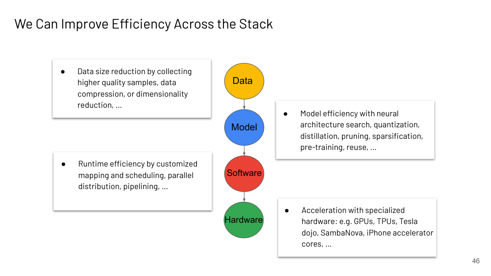
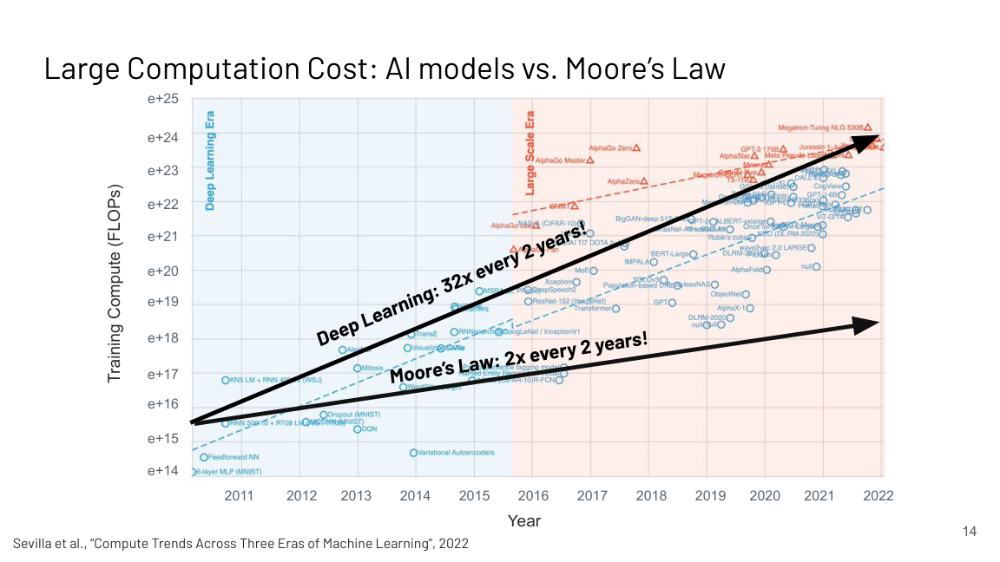
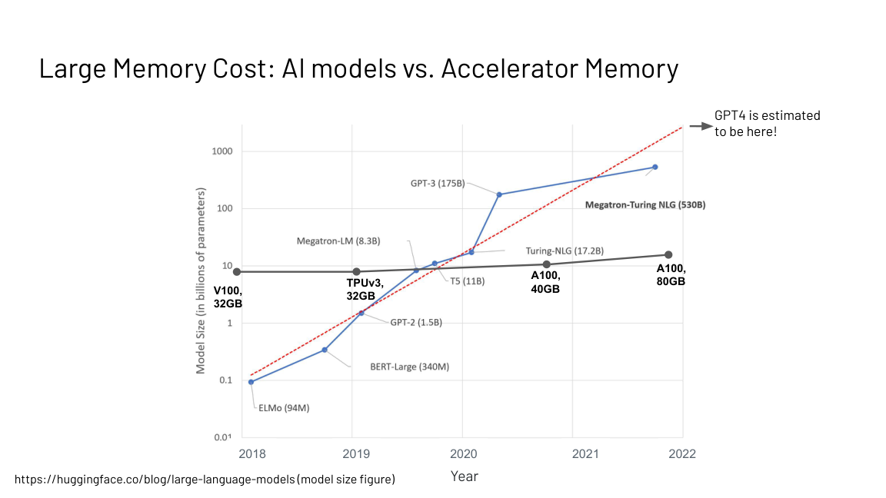
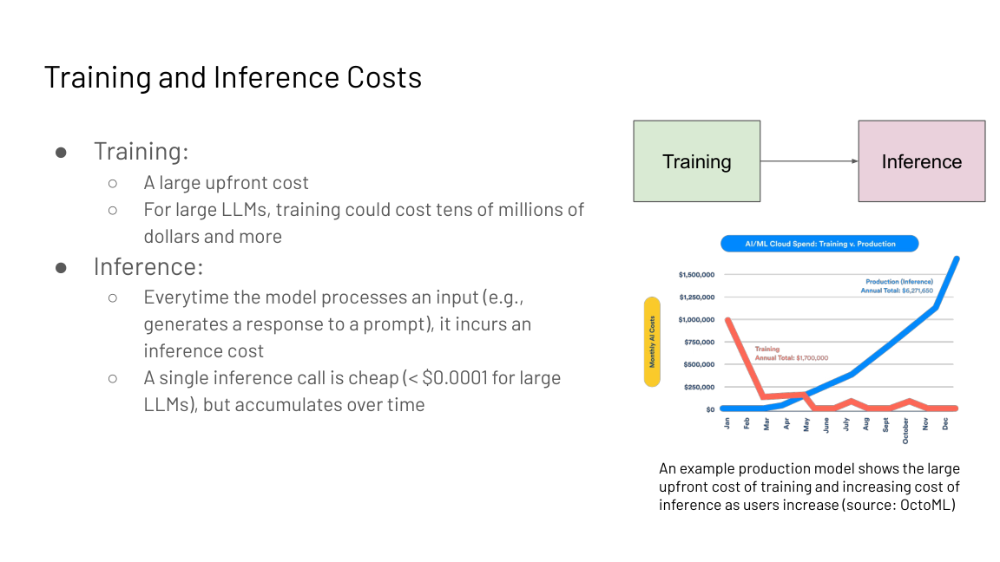
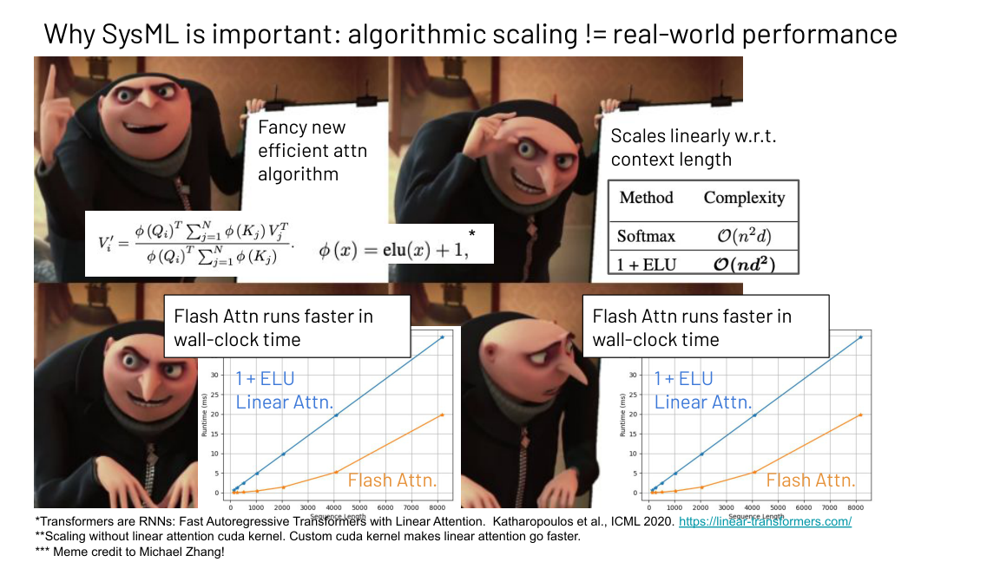
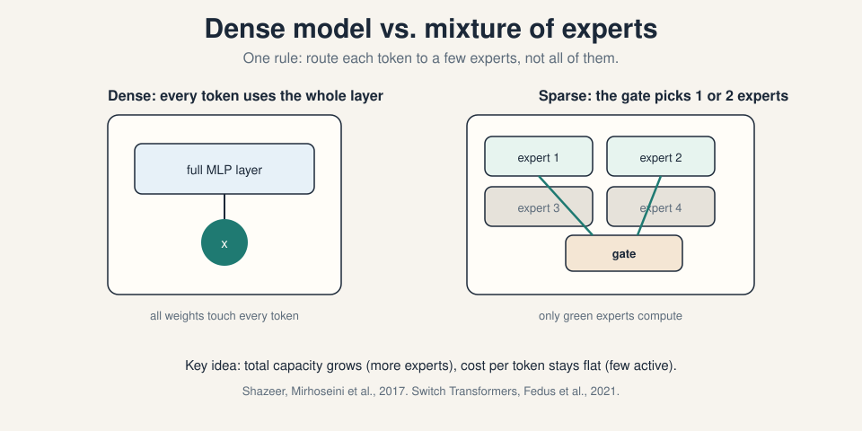
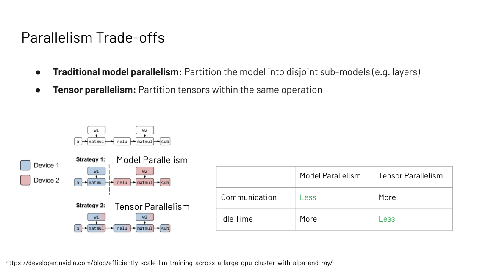

## How to read this lesson

**Level 1 (Core)** gives the economic and technical case for the course.
**Level 2 (Deep)** walks through the four evidence pillars the lecture
uses: compute trends, the memory wall, quantization and sparsity, and
hardware-aware design. Read Level 1 straight through.

Note: the slide decks shipped with the course carry Fall 2023 headers
and list Simran Arora alongside Azalia Mirhoseini as instructor. The
Fall 2024 calendar lectures are ordered below. Flagged where the two
disagree.

## Level 1: The course in one paragraph

CS229S studies the systems side of deep learning: how to train,
fine-tune, and serve large models within the limits of real hardware.
The motivation is arithmetic. Model compute demand grows far faster
than hardware improves, memory capacity lags model size, and a cheaper
algorithm on paper can lose to a hardware-aware one in wall-clock
time. The course attacks all four layers of the stack: data, model,
software, and hardware.

## Level 1: Why models keep growing

Performance keeps improving with three inputs: compute, dataset size,
and parameter count. Kaplan et al. (2020) formalized this as scaling
laws. Larger models also show emergent behavior: capabilities like
few-shot learning and chain of thought appear only past a size
threshold. Brown et al. (GPT-3, 2020) and Wei et al. (2022)
documented this. The economic result is that every lab wants bigger
models, which is what makes systems work valuable.

The pretraining recipe is next-token prediction on vast text. The raw
pretrained model then needs fine-tuning to follow instructions and to
align with human intent. Thoppilan et al. (LaMDA, 2022) is the
lecture's example of fine-tuning for dialog.

> [!QA]
> Q: Why does the field keep training larger models instead of better small ones?
> A: Two reasons. Scaling laws show smooth, predictable gains from more compute, data, and parameters, so size is a reliable lever. Emergent abilities such as few-shot learning and chain of thought appear only at large scale, so some capabilities have no small-model equivalent. Systems work exists because this appetite for scale collides with hardware limits.
> Follow-up: What breaks first as models grow?
> A: Money and memory. Training a frontier model costs tens of millions of dollars, and model size outruns accelerator memory: GPT-4-scale weights sit far above an A100's 40 or 80 GB. That is why the course opens with memory and compute, not with architectures.

## Level 1: The three pillars of the course

The lecture organizes the field into three themes.

**Efficient architectures and algorithms.** Efficient attention,
quantization, sparsity, pruning, distillation. Reduce memory
footprint, reduce compute, or both.

**Hardware understanding.** GPUs, memory hierarchies, interconnects,
compilers. You cannot optimize what you cannot measure.

**Parallelism and scheduling.** Data, tensor, and pipeline
parallelism across devices and nodes. Mapping a computation graph to
hardware is a combinatorial optimization problem.

Later lectures give each pillar its own treatment:
[L03](l03-hardware-aware-design.html) for arithmetic intensity,
[L05](l05-gpu-execution-model.html) for the GPU execution model,
[L10](l10-parallelism.html) for parallelism.

## Level 1: The efficiency stack

Four layers, each with its own levers.

**Data.** Smaller, better data. Higher quality samples, compression,
dimensionality reduction.

**Model.** Neural architecture search, quantization, distillation,
pruning, sparsification, pretraining and reuse.

**Software.** Custom mapping and scheduling, parallel distribution,
pipelining. Compilers such as XLA, MLIR, and framework stacks
(TensorFlow, JAX, PyTorch).

**Hardware.** Specialized accelerators: NVIDIA GPUs, Google TPUs,
Tesla Dojo, SambaNova, Cerebras, Graphcore, phone accelerator cores.

The FAST paper (Zhang et al., ASPLOS 2022) is the lecture's proof
that hardware-software co-optimization unlocks multi-fold gains: the
best datapath, scheduling, and fusion choices differ across vision
and language workloads, so the stack must be searched together.

## Level 2: Compute demand outruns Moore's law

Sevilla et al. (2022) plotted training compute across three eras of
machine learning. The deep learning era line rises 32x every 2 years.
Moore's law gives 2x every 2 years. The gap between demand and
hardware improvement is the entire economic reason this course
exists. If hardware kept pace, efficiency research would be a hobby.
It does not, so efficiency is a requirement.

> [!QA]
> Q: Quote the two growth rates and say why they matter together.
> A: Deep learning training compute grows 32x every 2 years; Moore's law gives roughly 2x every 2 years. The 16x gap per 2-year window compounds, so each generation of models demands far more than new hardware supplies. Every missing factor must come from better algorithms, better parallelism, or better utilization.
> Follow-up: Does this mean hardware progress is irrelevant?
> A: No. Hardware still sets the ceiling: peak FLOPs and memory bandwidth bound every roofline analysis in Lecture 3. The point is that hardware alone cannot close the gap, so systems techniques carry the rest.

## Level 2: The memory wall

Model size grows along the same steep curve, but accelerator memory
is nearly flat: V100 32 GB, TPUv3 32 GB, A100 40 or 80 GB. GPT-4
scale sits far above all of them. The lecture states the consequence
plainly: a new LLM drops, you get A100s to fine-tune it, and you hit
an out-of-memory error. That single failure mode motivates
quantization (smaller weights), parallelism (split weights across
devices), and KV cache management (Lecture 4).

Training and inference costs split differently. Training is a large
upfront cost: tens of millions of dollars for a large LLM. One
inference call is cheap, under $0.0001 for a large LLM, but it
accumulates with users. The lecture's production example (OctoML)
shows total inference cost rising steadily as the user base grows.
Design for training when the bill is upfront; design for serving
when the bill compounds.

## Level 2: Algorithmic scaling is not wall-clock speed

This is the lecture's sharpest claim, and it returns in every later
lecture. A fancy new linear attention algorithm scales as O(N) in
sequence length against standard attention's O(N squared). But
FlashAttention, a hardware-aware exact implementation, runs faster in
wall-clock time. Asymptotic complexity ignores constants and
implementation details, and those dominate on real hardware.

The rule: judge algorithms by measured runtime on the target
hardware, never by big-O alone. [L06](l06-flash-attention.html)
derives exactly why FlashAttention wins.

> [!QA]
> Q: An algorithm scales linearly while the baseline scales quadratically. Is it faster?
> A: Not necessarily. Big-O hides constants and ignores memory behavior. The lecture's example is linear attention versus FlashAttention: the linear algorithm has better asymptotics, but FlashAttention wins in wall-clock time because it is hardware-aware. Always profile on the target device.
> Follow-up: What does "hardware-aware" mean concretely here?
> A: It means the implementation accounts for the memory hierarchy: SRAM versus HBM, tiling to keep data on-chip, and fusion to avoid round trips. Those decisions live in Lectures 3, 5, and 6.

## Level 2: Quantization fits models into memory

Training and serving in 32-bit floating point is desirable for its
wide dynamic range. But 8-bit integer arithmetic sharply improves
memory and speed. The catch: naive quantization degrades accuracy
unacceptably, and it scales poorly past about 6B parameters.

Dettmers et al. (LLM.int8(), 2022) showed the fix is model-aware.
Outlier features in large transformers break naive 8-bit
quantization; an outlier-aware mixed-precision decomposition keeps
most of the matrix in INT8 and handles outliers in FP16, enabling
inference up to 175B parameters without accuracy loss.

| Approach | Bit-width | Works past 6B params | Accuracy |
|---|---|---|---|
| Naive vector-wise INT8 | 8 | No, degrades | Lost |
| Outlier-aware mixed precision | INT8 + FP16 outliers | Yes, to 175B | Kept |

The lesson: quantization is not a blunt bit-width cut. It is a
diagnosis of which values actually break, then a targeted fix. [L07](l07-memory-efficient-networks.html)
derives the classical schemes.

## Level 2: Sparsity routes around dense compute

Traditionally neural networks are dense: each input is processed by
the entire model. Mixture-of-experts (MoE) is dynamic: large weight
matrices are replaced by a mixture of smaller matrices called
experts, and a gating function routes each input to a small number
of them.

Shazeer, Mirhoseini et al. (2017) introduced the sparsely-gated MoE
layer; Fedus et al. (Switch Transformers, 2021) applied it to
transformer language models. Total capacity grows with expert count
while cost per token stays near flat. The systems cost moves to
routing, load balancing, and communication, which is why MoE is a
systems topic as much as an architecture topic.

## Level 2: Parallelism and the network you run on

Scaling is only possible with effective parallelization across many
devices. Two tradeoffs dominate.

**Model versus tensor parallelism.** Traditional model parallelism
partitions the model into disjoint sub-models, e.g. layer groups.
Tensor parallelism partitions tensors within the same operation.

Model parallelism communicates less but idles more. Tensor
parallelism idles less but communicates more, so it demands fast
interconnects. [L10](l10-parallelism.html) derives both plus pipeline
parallelism.

**Network topology.** The optimized mapping must know the hardware
it runs on. Device connections inside one machine are orders of
magnitude faster than networking between machines. This single fact
decides where each parallelism style lives: tensor parallelism
inside the node on NVLink, data parallelism across nodes on
InfiniBand.

## Level 2: Hardware efficiency, not just FLOPs

EfficientNet introduced depthwise convolutions with fewer FLOPs than
competing ResNets. But the operation took 5.00% of FLOPs and 65.30%
of runtime. Lower FLOP count, higher runtime.

| Operation | Share of FLOPs | Share of runtime |
|---|---|---|
| DepthwiseConv2D | 5.00% | 65.30% |
| Conv2D | 94.67% | 34.20% |
| Other | 0.33% | 0.50% |

The compute utilization ratio collapsed because the operation did not suit the hardware.

The general principle: FLOPs measure work, not speed. Speed is work
divided by achieved throughput, and achieved throughput depends on
memory access patterns, parallelism, and the device's strengths.
Lecture 3 makes this quantitative with arithmetic intensity and the
roofline model.

## Recap: the whole lesson on one screen

<strong>1. Compute demand grows 32x every 2 years</strong>

Deep learning training compute rises 32x per 2 years against
Moore's law 2x. The gap compounds. Efficiency research fills it.

Key: 32x vs 2x per 2 years

<strong>2. Memory lags model size</strong>

Accelerator memory sits near 32 to 80 GB while models keep
growing. Out-of-memory is the default failure, not the exception.

Key: A100 40/80 GB, TPUv3 32 GB

<strong>3. Training is upfront, inference compounds</strong>

Training costs tens of millions of dollars once. One inference
call is under $0.0001 but grows with every user.

Key: design for the bill you pay

<strong>4. Asymptotics are not wall-clock time</strong>

Linear attention wins on big-O. FlashAttention wins on the GPU.
Judge algorithms by measured runtime on target hardware.

Key: profile, never assume

<strong>5. Efficiency spans data, model, software, hardware</strong>

Each layer has its own levers: better data, quantization and
pruning, scheduling, accelerators. Co-optimize them together.

Key: FAST, ASPLOS 2022

<strong>6. MoE grows capacity without growing cost</strong>

A gate routes each token to a few experts. Total parameters
grow; active parameters per token stay flat.

Key: Shazeer, Mirhoseini et al. 2017

<strong>7. Parallelism trades communication for utilization</strong>

Model parallelism communicates less but idles more. Tensor
parallelism idles less but needs fast interconnects.

Key: know your network topology

<strong>8. SysML is the whole stack at once</strong>

Efficient architectures, hardware understanding, parallelism
and scheduling. Every later lecture picks up one thread.

Key: L03, L05, L10 next

## Official sources and further reading

**Official:**
- Course site: https://cs229s.stanford.edu/fall2024/
- Introduction slide deck (Fall 2023 headers): the source of the figures above.

**Further reading:**
- Sevilla et al., "Compute Trends Across Three Eras of Machine Learning" (2022): the source of the 32x figure.
- Kaplan et al., "Scaling Laws for Neural Language Models" (2020): why size keeps winning.
- Dettmers et al., "LLM.int8()" (2022): model-aware quantization at 175B scale.
- Shazeer, Mirhoseini et al., "Outrageously Large Neural Networks" (2017): the original MoE paper.
- Fedus et al., "Switch Transformers" (2021): MoE for transformers.
- Zhang et al., "FAST", ASPLOS 2022: full-stack hardware-software co-search.

**Caveats from these sources.** The deck headers say Fall 2023 while
the calendar is Fall 2024; lecture numbering below follows the Fall
2024 calendar. The compute-trends and memory-wall figures are
estimates, and the "GPT-4 is estimated to be here" markers are the
lecturer's placement, not confirmed model sizes. Fine-tuning as
alignment (LaMDA) is presented as motivation; the course's technical
treatment of fine-tuning is [L08](l08-finetuning-and-peft.html).

## Connections to the other courses

- **CS336 L05/L06:** the GPU memory hierarchy and kernel view behind
the hardware-efficiency claims; the device block is defined in
[L05](l05-gpu-execution-model.html) here and reused by MS&E435.
- **CS336 L07/L08:** data, tensor, and pipeline parallelism in full;
CS229S [L10](l10-parallelism.html) gives the framing and the Megatron
view.
- **CS336 L10:** inference costs and KV caching continue the
training-versus-inference cost split.
- **CS329H:** RLHF and preference modeling, the systems view of which
is [L08](l08-finetuning-and-peft.html).

> [!CHEAT]
> **Introduction cheatsheet.** SysML: efficient training, fine-tuning, deployment of deep models, mainly language models. Compute: deep learning 32x per 2 years vs Moore's law 2x. Memory: A100 40/80 GB, TPUv3 32 GB; models outgrow them. Costs: training tens of millions upfront; inference under $0.0001 per call, compounds with users. Scaling: Kaplan 2020 (compute, data, params); emergent few-shot and chain of thought. SysML pillars: efficient architectures, hardware understanding, parallelism and scheduling. Stack levers: data quality, quantization/pruning/distillation, mapping/scheduling/pipelining, accelerators. Rules: big-O is not wall-clock; FLOPs are not runtime; know your network topology.

> [!MEMORY]
> **The three gaps.** Compute demand outruns hardware. Model size outruns memory. Asymptotics outrun wall-clock. SysML closes all three.
