## The task: sequences in, sequences out

Look at what modern AI does. It summarizes long documents. It answers
questions about the world. It holds conversations on any topic. It
transcribes speech, reads medical scans, and steers robots. Different
inputs, different outputs, but one shape underneath it all: a sequence
goes in, a sequence comes out.

```ascii
input sequence                  output sequence
"The Cat in the"          -->   "Hat is a book by Dr. Seuss."
"turn off the"            -->   "lights"
```

A **sequence model** is any machine that maps an input sequence to an
output sequence. Text is the flagship case, but the same frame covers
audio waveforms, sensor readings, and medical signals. In this course
the systems treat every one of them as a tensor (a multi-dimensional
array of numbers) of shape (batch, length, dim): a stack of
sequences, each a row of token vectors.

This chapter tells one story: how we learned to build sequence models
for language, why the first serious attempt broke, and what replaced
it. Every idea is built from zero. Nothing is assumed.

## Why we predict one token at a time

A language model assigns probabilities to token sequences. Given a
vocabulary like {lights, off, the, turn}, the model might learn that
P("turn off the lights") = 0.03 and P("off turn the lights") = 0.0002.
The good ordering gets the high number. That is the whole game:
recognize which sequences look like real language.

The naive approach is to model whole sequences directly: learn
p(x1, x2, ..., xL), the joint distribution over full sequences. Three
facts kill this approach.

First, sequences have different lengths. A model that scores
5-token sequences cannot score 6-token sequences. You would need a
separate model for every length.

Second, the space explodes. With a 50,000-token vocabulary, there are
50,000^10 possible 10-token sequences. That number has 47 digits. No
table, no machine, can represent it.

Third, whole-sequence probabilities are blunt. They tell you a
sequence is unlikely on average, but they cannot tell you which word
to write next. For generation you need the next word, not a verdict
on the whole sentence.

The fix is the **chain rule** of probability. Instead of scoring the
whole sequence at once, score each token given the ones before it:

```ascii
p("turn off the lights") =
    p("turn")
  x p("off"    | "turn")
  x p("the"    | "turn off")
  x p("lights" | "turn off the")
```

Each factor is one small, answerable question: given the words so
far, what comes next? Train a model to answer that question well on
800 GB of text (the Pile corpus), and the product of its answers
scores whole sequences. This is **next-token prediction**, and every
model in this course is trained on it.

How do we know if the model is good at it? The intrinsic measure is
**perplexity**: how uncertain the model is about the true next word.
Low perplexity means the model is rarely surprised. That is all
perplexity means, and it is enough to rank models.

So the job is now precise. Build a machine that reads a sequence of
tokens and, at each position, predicts the next token. The machine
needs one ability above all: each token's representation must include
its context. The word "frame" means one thing in "The counselor
helped frame the situation" and another in "He hung the photo frame."
Same token, different meaning. The representation must carry the
surrounding words along. Call this a **contextual representation**.
Everything in this chapter serves it.

## First attempt: the recurrent neural network

Around 2016, the state of the art was the **recurrent neural
network**, the RNN. The idea is plain. Read the sequence one token at
a time, left to right. Keep notes as you go. The notes are a vector
called the **hidden state**. When a new token arrives, update the
notes: mix the old notes with the new token. When you need a
prediction, read the notes.

Here is the mechanism, with nothing hidden. Let x_t be the t-th
token's vector and h_t the hidden state after reading it. The update
is:

```ascii
h_t = tanh(W_h * h_{t-1}  +  W_x * x_t)
       ^^^^^^^^^^^^^^^^^^^    ^^^^^^^^^
       faded old notes        new token
```

W_h and W_x are learned matrices. The tanh squashes everything into
a calm range. The formula says: take the old notes, fade them a
little, add the new token, squash. That is the entire RNN.

Watch it work on a toy. Two-dimensional vectors, simple weights.
W_h halves the old notes, W_x passes the token through unchanged.

```ascii
tokens:   x1 = "the" = [1, 0]      x2 = "cat" = [0, 1]
start:    h_0 = [0, 0]

step 1:   h_1 = tanh(0.5 * [0,0] + [1,0]) = tanh([1, 0]) = [0.76, 0]
step 2:   h_2 = tanh(0.5 * [0.76,0] + [0,1]) = tanh([0.38, 1]) = [0.36, 0.76]
```

Read h_2. The second number (0.76) is "cat", fresh and strong. The
first number (0.36) is "the", faded but present. The hidden state is
doing its job: it holds the history, with recent tokens louder than
old ones.

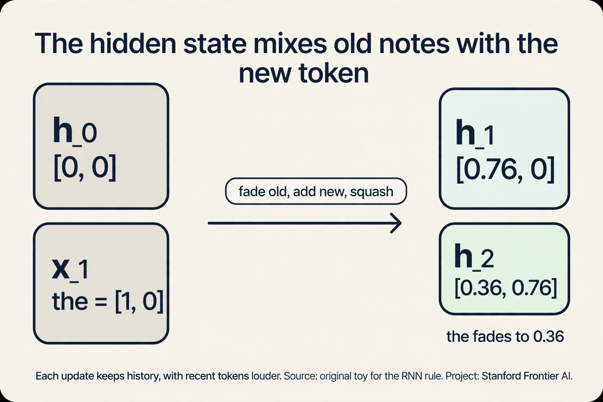

Unroll the recurrence and you see the shape of the machine:

```ascii
x1 --> [h1] --> [h2] --> [h3] --> ... --> [hN]
        |        |        |
       out1     out2     out3
```

Each box is the same update, applied again. Information flows left
to right through the chain of hidden states. To predict token 4, the
model reads h_3, which (in theory) remembers tokens 1 through 3.

This worked. RNNs powered the best translation and speech systems of
their era, where sequences were short enough that the hidden
state's fading stayed manageable. But three cracks ran through
the design, and each one mattered more as sequences got longer.

### Subchapter: backprop through time (how the RNN learns)

Training unrolls the chain and walks the error backward. The loss
at step 7 produces a correction for h_7. The chain rule carries it
to h_6, then h_5, all the way to h_1. Each backward step multiplies
by the same recurrent matrix W_h again. This is **backprop through
time**: the RNN is a deep network where depth equals sequence
length, and every layer shares the same weights.

That sharing is the whole story of the next section. One matrix,
multiplied once per step, forward and backward. If its numbers are
slightly small, the correction shrinks at every step going back. If
slightly large, it explodes. There is no middle ground that survives
a thousand multiplications.

### Subchapter: the RNN family (LSTM and GRU)

The vanilla RNN has one central flaw: every update
*overwrites*. The new hidden state is a fresh squash of old and new,
and old information must survive the squash. Two famous variants
fix this with **gates**: learned switches between 0 and 1 that
decide what to keep and what to drop.

**LSTM** (long short-term memory) adds a second track: the **cell
state** c_t, a conveyor belt that runs alongside the hidden state.
Three gates control it:

- **Forget gate** f_t: how much of the old cell to keep (0 = dump,
  1 = keep all).
- **Input gate** i_t: how much of the new candidate to write.
- **Output gate** o_t: how much of the cell to reveal as the hidden
  state.

The update: c_t = f_t x c_{t-1} + i_t x candidate_t. The key is the
**addition**. Old memory is not squashed through a matrix. It is
scaled by the forget gate and *added*. When the forget gate outputs
0.9 for the slot holding "The", six steps keep 0.9^6 = 0.53, not
0.016. The gradient (the direction and size of each correction
the error demands) gets the same highway: it flows back through
the additions unmultiplied, so it no longer vanishes. The LSTM
learns *what to remember* instead of hoping the squash preserves
it.

**GRU** (gated recurrent unit) merges the design: one **update
gate** z_t decides the blend between old state and new candidate
(h_t = z_t x h_{t-1} + (1 - z_t) x candidate), and a **reset gate**
decides how much of the past the candidate may see. No separate
cell state, fewer parameters, nearly the same power.

| Variant | Gates | Separate cell | Params vs vanilla | Fixes |
|---|---|---|---|---|
| Vanilla RNN | 0 | no | 1x | nothing; the baseline |
| LSTM | 3 (forget, input, output) | yes | ~4x | vanishing gradient via the cell highway |
| GRU | 2 (update, reset) | no | ~3x | most of it, cheaper |

Where they stand today: LSTMs still run in production speech and
on-device systems, and the gate idea (learned keep/drop switches)
lives on inside modern architectures. But gates patch the chain.
they do not delete it. The serial queue and the O(N) distance
remain. That is why the field moved on.

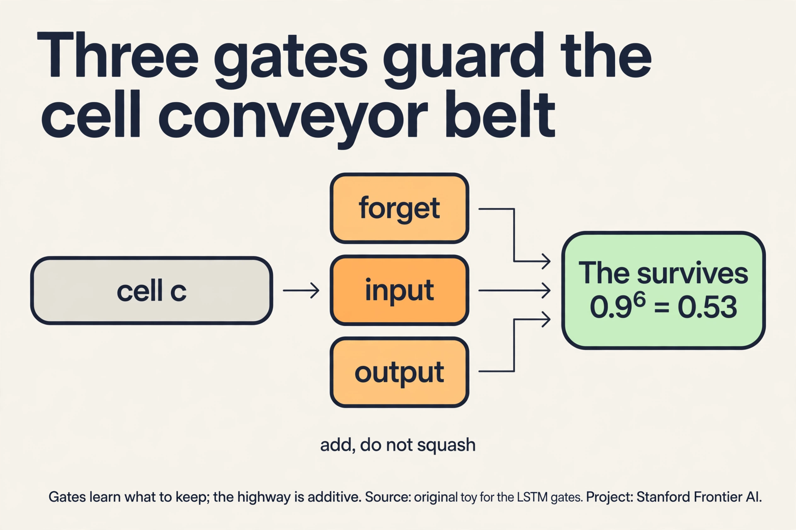

## Where the RNN breaks, part 1: long distances fade

Take the sentence "The counselor helped frame the situation." For the
model to represent "situation" well, it needs "The": the sentence
is about *the* situation, a specific one. "The" enters at step 1.
"situation" is predicted at step 7. Between them, the hidden state
updates six times, and each update fades the old notes.

Our toy fades by half each step. After six steps, "The" is
(0.5)^6 = 0.016 of its original strength. Less than two percent
survives. The model is trying to remember the start of the sentence
through six rounds of dilution. In real models the fading is learned
rather than fixed, but the pressure is the same: every token's
influence must survive every intervening update, and most of it does
not.

This is the **long interaction distance** problem. Two tokens that
belong together can sit far apart in the sequence, and the RNN forces
their interaction through a long chain of lossy steps.

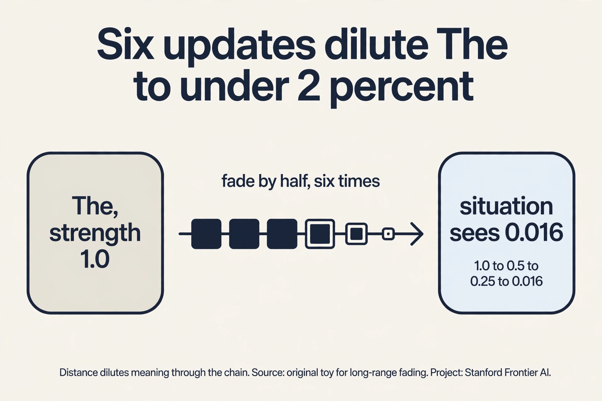

## Where the RNN breaks, part 2: training becomes unstable

To see the second crack, you need one fact about training. A neural
network learns by **backpropagation**: it makes a prediction, measures
the error, then nudges every weight a little in the direction that
would have reduced the error. The size of each nudge is the
gradient. Big gradient, big correction. Tiny gradient, the weight
barely moves.

In an RNN, the gradient for an early token must travel backward
through every timestep to reach the weights that processed it. Each
step multiplies the gradient by roughly the same number. Watch what
repeated multiplication does:

```ascii
fading weight 0.9, 10 steps:  0.9^10 = 0.35   (gradient shrinks)
growing weight 1.1, 10 steps:  1.1^10 = 2.59  (gradient explodes)
```

If the per-step multiplier is below 1, the gradient decays toward
zero as it travels back. Early tokens stop learning: the network
cannot assign them credit or blame. This is the **vanishing
gradient**. If the multiplier is above 1, the gradient grows
exponentially and training destabilizes into nonsense. This is the
**exploding gradient**. The safe corridor between them narrows as
sequences lengthen. Long sequences, the ones we care about, are
exactly the ones that break training.

Notice how this deepens the first crack. It is not just that old
information fades at inference time. The network cannot even
*learn* to preserve it, because the learning signal itself fades on
the way back.

## Where the RNN breaks, part 3: the sequence is a queue

The third crack is about speed. Look at the unrolled chain: h_5
needs h_4, which needs h_3, and so on. Step t cannot start until
step t-1 finishes. A 1,000-token sequence means 1,000 sequential
steps, no exceptions.

A modern GPU has thousands of cores built for parallel work. The RNN
gives them one step at a time and tells the rest to wait. Training on
800 GB of text becomes an exercise in patience. This **serial
bottleneck** is the crack that mattered most in practice, because
training cost, not elegance, decides which architectures survive.
The fast-to-train architecture beats the elegant-but-serial one,
every time, at scale.

Three cracks, each demonstrated: information fades over distance,
gradients vanish or explode over time, and the chain cannot be
parallelized. The field spent years patching the RNN. Then someone
asked a different question.

## The key question

What if tokens could talk to each other *directly*, skipping the
chain entirely? What if "situation" could look straight back at
"The" without passing through six rounds of dilution? That question
is the transformer.

## Attention: a lookup, not a chain

Start from the need. In "The counselor helped frame the situation",
the word "frame" needs context to mean anything. Which words matter
for it? "counselor" matters. "helped" matters. "situation" matters.
"The" matters less. So the job is: for each token, decide how much
of every other token to pull in, then mix.

The lecture's intuition is a **hash table**. Imagine every token
puts two things in the table: a **key** (a label saying what it
contains) and a **value** (the content it offers). Every token also
forms a **query** (a description of what it needs). To build the new
representation of "frame", take its query, compare it against every
key, and mix the values in proportion to the match. The most similar
keys contribute the most.

```ascii
hash table (built from the sequence):

  keys:    k_the  k_counselor  k_helped  k_frame  k_situation
  values:  v_the  v_counselor  v_helped  v_frame  v_situation

query for "frame": q_frame
  compare q_frame to each key --> similarity scores
  mix the values by those scores --> new "frame"
```

Concretely, the lecture's example: the new "frame" becomes
0.25 of "counselor" + 0.45 of "helped" + 0.30 of "situation"
(plus small bits of the rest). The weights sum to 1. "frame" now
carries its context inside its own vector. That is a contextual
representation, built without any chain.

Now watch the mechanism on a toy, by hand. Three tokens,
two-dimensional vectors. To keep the arithmetic visible, the
projections are identity (the real model learns them. The mechanism
is the same).

```ascii
tokens:   counselor = [1, 0]    helped = [0, 1]    frame = [1, 1]
query for "frame": q = [1, 1]

step 1, scores (dot products of q with each key):
  q . k_counselor = [1,1] . [1,0] = 1
  q . k_helped    = [1,1] . [0,1] = 1
  q . k_frame     = [1,1] . [1,1] = 2

step 2, softmax (turn scores into weights that sum to 1):
  e^1 = 2.72,  e^1 = 2.72,  e^2 = 7.39;  total = 12.83
  weights = [0.21, 0.21, 0.58]

step 3, mix the values:
  new "frame" = 0.21 * [1,0] + 0.21 * [0,1] + 0.58 * [1,1]
              = [0.79, 0.79]
```

Read the result. "frame" pulled 21% from "counselor", 21% from
"helped", and 58% from itself. The numbers came from the data, not
from a fixed rule: the query-key match decided the mix. That is
**attention**. Every token does this, against every other token,
simultaneously.

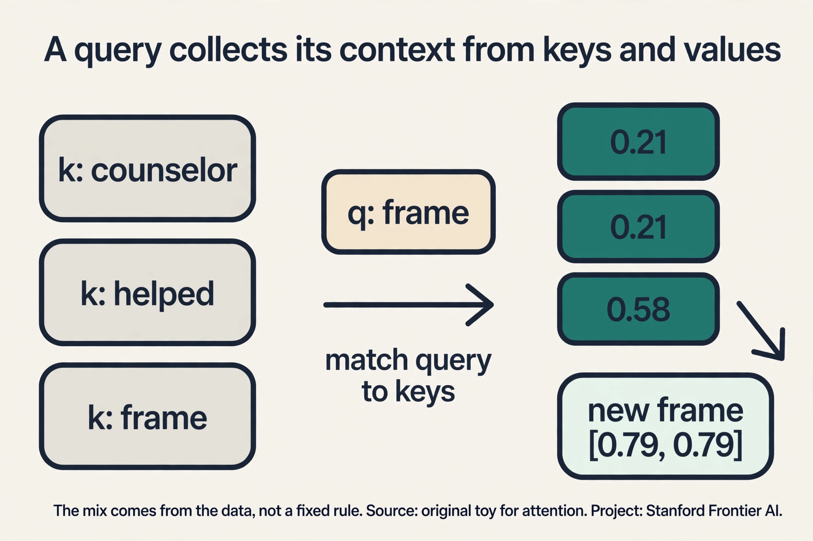

## The full computation in four steps

The toy used one query. The real operation runs all queries at once
as matrix multiplies. Let N be the sequence length and d the vector
dimension. Stack the N token vectors into an N x d matrix X.

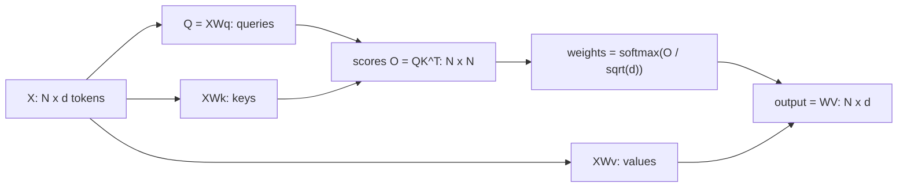

1. **Project three ways.** Multiply X by three learned matrices to
   get queries Q, keys K, values V, each N x d. Three views of the
   same tokens: what I need, what I contain, what I offer. The
   matrices Wq, Wk, Wv are learned during training, so the model
   decides for itself what "needing" and "containing" mean. Early
   in training the projections are random and the attention is
   diffuse. As training proceeds, heads specialize: one head may
   learn that verbs query their subjects, another that pronouns
   query recent nouns. The three-projection design is what makes
   this specialization possible. A single shared representation
   could not separate the two jobs.
2. **Score every pair.** O = QK^T, an N x N matrix. Entry (i, j)
   is the dot product of token i's query with token j's key: a
   raw similarity number, large when the two vectors point the
   same way. Every pair meets here, directly, in one step. There
   is no chain, no fading, no waiting. This matrix is the entire
   reason the architecture trains fast and the entire reason it
   costs O(N^2).
3. **Normalize.** Divide by sqrt(d), then softmax each row. The
   division is numerical hygiene with a real effect: dot products
   of d-dimensional vectors have variance d, so in a wide model
   (d in the thousands) raw scores spread wildly and the softmax
   saturates, one weight near 1, the rest near 0, gradients dead.
   Dividing by sqrt(d) restores variance 1 and keeps every row a
   genuine distribution: non-negative weights summing to 1. Read
   row i as "how token i distributes its attention budget."
4. **Mix.** Output = WV. Each token's new vector is the
   weight-blend of all values. The values carry the content. The
   weights decide the blend. The output has the same shape as the
   input (N x d), which is what makes stacking possible: the next
   layer consumes exactly what this layer produced.

Two properties fall out of this construction, and both are the point:

- **O(1) interaction distance.** Any two tokens meet in a single
  step through the score matrix. "The" and "situation" interact
  directly, no chain, no dilution.
- **Parallel.** The N^2 pair scores are independent matrix
  operations. A GPU computes them all at once instead of waiting
  through N sequential steps.

## Going deep: why stack layers

One attention layer gives every token one round of mixing. "frame"
now knows about "counselor" and "helped". But real models stack 12,
24, even 96 of these layers. Why?

Each layer refines the representations of the previous one. In
layer 2, a fourth token, say "them", can attend to "frame" and
inherit everything "frame" learned in layer 1: the counselor, the
helping, the framing. That is two hops of reasoning in two layers.
Deeper layers compose longer chains of indirect context: a token at
layer 24 carries traces of the whole document, gathered hop by hop.
One layer sees direct relations. The stack sees reasoning chains.

The transformer block adds one more component per layer: a
feed-forward network applied to each token on its own. If attention
is the communication step (tokens exchange information), the
feed-forward network is the computation step (each token processes
what it received). Two linear layers with a nonlinearity, no mixing
between tokens. Roughly: attention moves information, the
feed-forward net thinks about it.

But stacking 96 layers brings back an old enemy. The gradient must
travel through 96 transformations, and the same exponential math
that killed the RNN threatens the stack: 96 multiplications of
small or large numbers.

The fix is the **residual connection**. Each layer adds its
refinement to its input instead of replacing it: output = x +
layer(x). The additions give the gradient a direct highway back
through all 96 layers, untouched by the squashing inside each one.
Without residuals, deep transformers do not train. Layer
normalization sits between the blocks and keeps the activation
values in a healthy range. (CS336 L03 builds the full block from
zero. Here the point stands: stacking works because each layer
refines, and residuals keep the stack trainable.)

## Attention, in its many forms

The attention you just built is one member of a family. Same
four-step skeleton, different rules about who may look at whom.

### Subchapter: self-attention (the default)

Queries, keys, and values all come from the same sequence. Every
token looks at every token. This is what the toy computed and what
BERT uses to read a sentence in both directions. Cost: O(N^2).

### Subchapter: causal attention (the mask)

For generation, the future must not leak. Token 3 may look at
tokens 1, 2, 3, but never 4. The fix is a **mask**: before the
softmax, set every score (i, j) with j > i to negative infinity.
Softmax turns negative infinity into exactly 0, so future tokens
get zero weight. The score matrix becomes a triangle: row 1 sees 1
token, row 2 sees 2, row N sees N. This is the attention inside
every GPT-style model, and the mask is what makes the KV cache
possible (L04): when token N+1 arrives, rows 1..N never change.

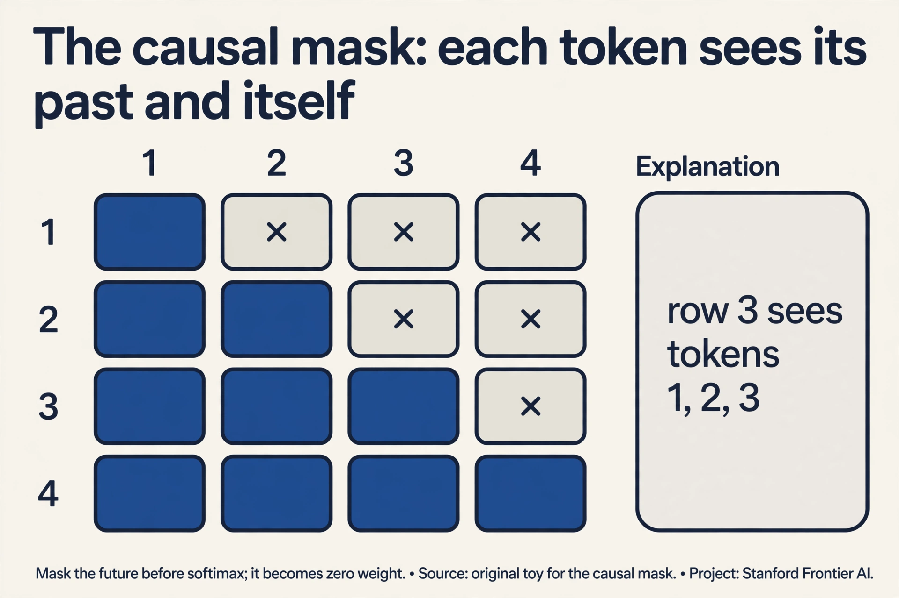

### Subchapter: cross-attention (two sequences)

Queries come from one sequence, keys and values from another. In
translation, the English decoder asks ("what should I output
next?") and the French encoder answers (keys and values from the
French sentence). Same four steps. The Q matrix and the K/V
matrices just come from different places. This is the bridge inside
every encoder-decoder model.

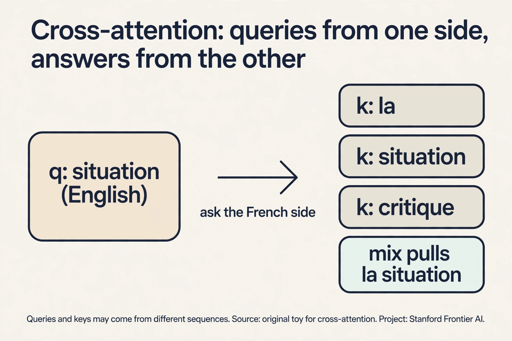

### Subchapter: sliding-window attention (Mistral)

Each token attends to the W most recent tokens instead of all N.
Cost drops from O(N^2) to O(N x W). With W = 4,096, a 32K-token
document costs 8x less than full attention. Stacked layers recover
long range indirectly: layer 2 reaches 2W back through layer 1's
windows, like a relay race. Mistral 7B made this famous. It is the
budget answer to long context.

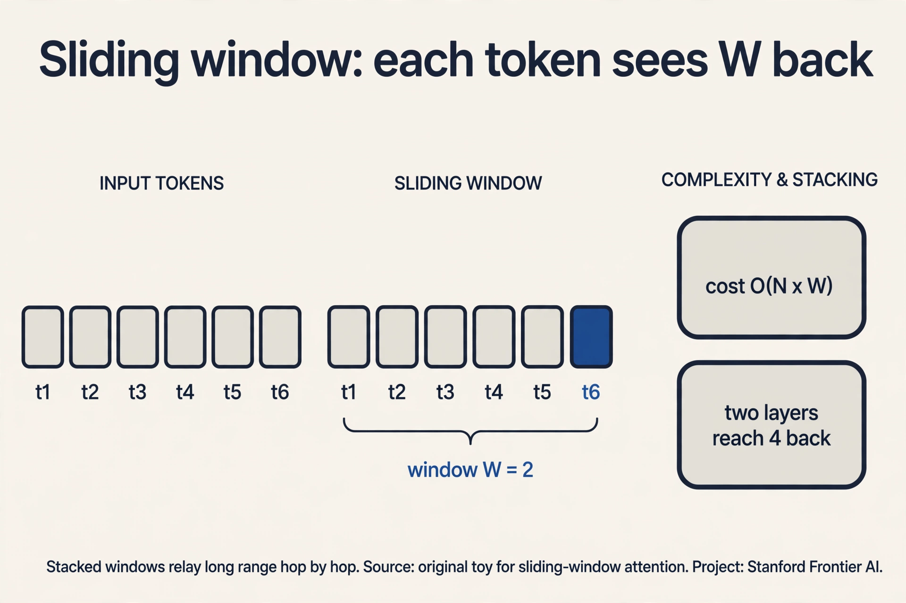

### Subchapter: multi-head attention (many relations at once)

One attention computation produces one set of weights: one way for
tokens to relate. **Multi-head** runs H independent attentions in
parallel, each with its own learned Q/K/V projections in a smaller
subspace (dimension d/H), then concatenates the H mixes and
projects back to d. In the toy, head 1 gave weights
[0.21, 0.21, 0.58]: "frame" cares mostly about itself. A second
head on the same tokens might give [0.7, 0.2, 0.1]: "frame" cares
about "counselor". Concatenated, the token carries both facts.
Trained models confirm the specialization: some heads track syntax,
some track neighboring position, some track rare words. One wide
head cannot do this: a single softmax is one vote, not several.

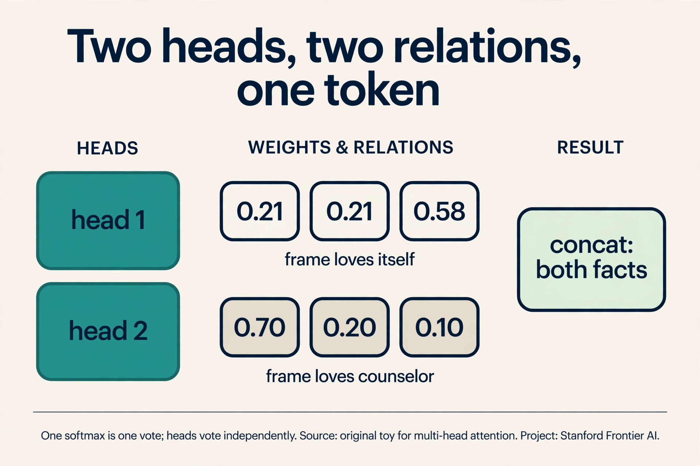

### Subchapter: position without a chain

Attention is permutation-invariant: shuffle the tokens and every
row shuffles identically. "dog bites man" and "man bites dog" give
the same scores. The RNN got order for free (position was time).
the transformer must inject it. The standard fix adds a position
signal p_i to each token before attention. The original paper used
**sinusoids** of many frequencies: each position gets a unique
wave-pattern, and a fixed offset is a rotation, so relative
distance stays expressible. Modern models use **RoPE** (rotary
position embedding: a vector scheme that marks each token's
position): it rotates each query and key by a
position-dependent angle, so the dot product itself shrinks as two
tokens drift apart. Relative distance, baked into the score.

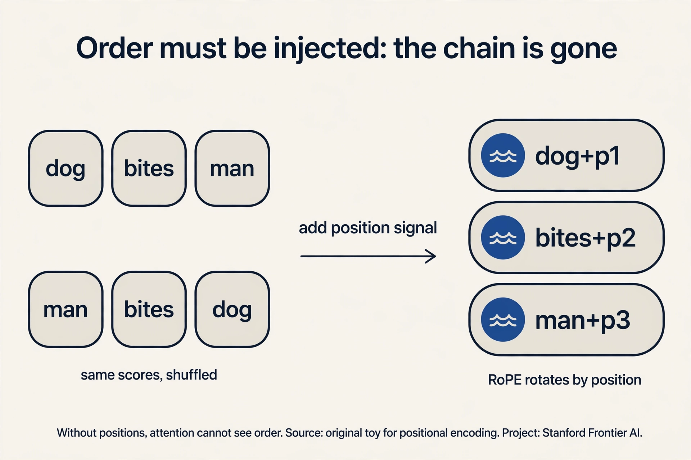

### Subchapter: linear attention and FlashAttention (the frontier)

Two more answers to the quadratic bill, in brief:

- **Linear attention** rewrites the softmax as a kernel feature
  map, which lets the sums reorder: cost O(N) instead of O(N^2).
  The price is approximation quality. L09 covers the modern
  descendants (Mamba drops attention entirely).
- **FlashAttention** keeps exact attention but tiles the
  computation so the N^2 matrix never sits in slow memory: it
  streams blocks through fast SRAM (the GPU's small on-chip memory,
  detailed in L05) and recomputes instead of
  storing. Same math, 2-4x faster, far less memory. L06 builds it
  from zero.

## Mapping back: what each property fixes

Now the story closes its loop. Each transformer property answers
one RNN crack, by name:

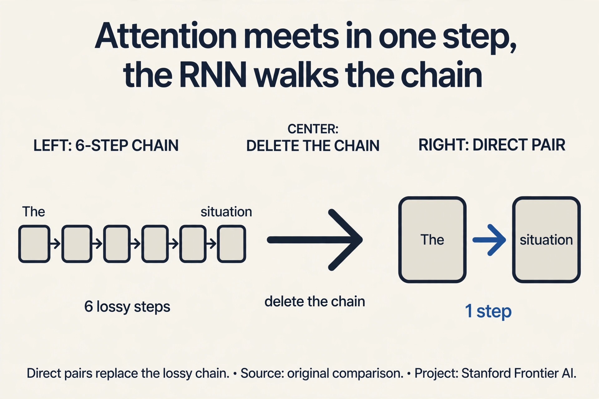

| RNN crack | Transformer answer | How |
|---|---|---|
| Long distances fade | O(1) interaction distance | Every pair meets in one step through the score matrix. No chain to dilute the signal. |
| Gradients vanish/explode | Short paths | The learning signal flows back through one attention layer, not N chained multiplications. The corridor stays wide. |
| Serial bottleneck | Parallel matrix ops | All N^2 scores compute simultaneously. Thousands of GPU cores stay busy. |

This is why the transformer won. Not because attention is
mysterious, but because it deletes the chain. Training dominates
cost at scale, and the architecture that trains in parallel on huge
data wins, even if each step costs more.

## The honest price: quadratic

Deleting the chain has a price, and it is written in the score
matrix. O is N x N: every token pairs with every token. Double the
sequence length and the work quadruples. For N = 4,096, that is
16.7 million scores per layer per attention head, most of which must
sit in memory.

This single fact, attention is quadratic in sequence length,
drives the entire rest of CS229S. Lecture 4 shows why the
autoregressive step is memory-bound. Lecture 6 (FlashAttention)
recomputes instead of storing. Lecture 9 asks whether
attention-free architectures can dodge the bill. The transformer won
training. The course is about paying for inference.

> [!QA]
> Q: Why did transformers replace RNNs?
> A: Three concrete failures. Information faded over long distances because the hidden state diluted every token through every intervening update: (0.5)^6 leaves under 2 percent. Gradients vanished or exploded because backpropagation multiplies once per timestep: 0.9^10 is 0.35, 1.1^10 is 2.59. And the chain was serial: step t waits for step t-1, leaving thousands of GPU cores idle. Attention deletes the chain: every pair of tokens meets in one step, all pairs compute in parallel, and gradient paths stay short.
> Follow-up: If attention is so much better, why does anyone still work on RNNs?
> A: The quadratic price. Attention costs O(N^2) memory and compute in sequence length, which punishes very long sequences. Recent architectures (S4, Mamba, linear attention) try to keep the RNN's linear scaling while fixing its training problems. The lecture flags this as the subject of L09.

> [!QA]
> Q: What do the query, key, and value actually mean?
> A: Three views of the same token, made by three learned projections. The key says what the token contains. The query says what the token is looking for. The value is the content the token offers if chosen. Attention compares each query against all keys, turns the matches into weights, and mixes the values by those weights. In the worked toy, "frame" with query [1,1] matched keys with scores [1,1,2], giving weights [0.21, 0.21, 0.58] and a new vector [0.79, 0.79].
> Follow-up: Why three projections instead of comparing tokens directly?
> A: Because "what I need" and "what I contain" are different jobs. A token might need context about verbs while containing noun information. Separate learned projections let the model specialize each role. With one shared representation the query and key spaces would be forced identical, which limits what matches can be expressed.

> [!QA]
> Q: Why divide by the square root of d before the softmax?
> A: Dot products grow with dimension. For random vectors of dimension d, the dot product has variance d, so scores spread wider as models get bigger. A wide-spread softmax saturates: one weight nears 1, the rest near 0, and the gradients through the tiny weights die. Dividing by sqrt(d) brings the variance back to 1 and keeps the softmax in its responsive range. It is a one-line numerical hygiene step with a real training effect.
> Follow-up: What goes wrong in practice if you forget it?
> A: In small models, little. In large models (d in the thousands), attention collapses onto a single token per query early in training and never recovers. It is one of the standard "the model trains but learns nothing" bugs.

> [!QA]
> Q: Why is attention O(N^2), and why does that matter for systems?
> A: The score matrix O = QK^T has one entry per token pair: N^2 entries. Each needs computing, and naive implementations store all of them: 16.7M floats per layer per head at N = 4,096. Memory, not arithmetic, becomes the bottleneck, because every entry must be read and written. That is why this course exists: FlashAttention, KV caching, and efficient architectures are all answers to the quadratic bill.
> Follow-up: During generation, do you recompute the whole matrix per token?
> A: No. When generating token N+1, the keys and values for tokens 1..N are unchanged, so you store them and compute only the new row. The per-step cost drops from O(N^2) to O(N). The cache itself then becomes the memory problem at long contexts, which is the subject of L04.

> [!QA]
> Q: What is multi-head attention, and why use multiple heads instead of one?
> A: One attention computation produces one set of weights: one way for the tokens to relate. Multi-head runs H independent attentions in parallel, each with its own learned Q/K/V projections, each producing its own mix, then concatenates the results and projects back to dimension d. Each head works in a smaller subspace (dimension d/H). Why: language has many relation types at once. In the toy, head 1 gave weights [0.21, 0.21, 0.58]: "frame" cares mostly about itself. A second head on the same tokens might give [0.7, 0.2, 0.1]: "frame" cares about "counselor". Concatenated, the token carries both facts. Studies of trained models confirm this specialization: some heads track syntax (subject-verb), some track position (attend to the neighbor), some track rare words. One head would have to commit to a single pattern per token per layer.
> Follow-up: Why not just make a single head wider instead?
> A: A single softmax produces one distribution per token. It must pick one relation pattern. Width does not fix that: it is one vote, not several. Multiple heads give multiple independent votes, each in its own learned subspace. The cost stays roughly the same, since each head is narrower.

> [!QA]
> Q: Attention has no notion of order. How does the transformer know "dog bites man" from "man bites dog"?
> A: It does not, until you tell it. Attention is permutation-invariant: shuffle the input rows and the queries, keys, values, scores, and outputs all shuffle identically. The same pairs produce the same scores, so "dog bites man" and "man bites dog" give the same output up to permutation. The RNN got order for free: position was time. The transformer deleted the chain, so it must inject order another way. The standard fix: add a position signal p_i to each token's embedding before attention, x_i + p_i. The original paper used sinusoids of different frequencies: each position gets a unique pattern, and shifting by a fixed offset corresponds to a rotation, so relative distances stay expressible. Modern models use rotary embeddings (RoPE), which rotate each query and key by a position-dependent angle so the dot product itself depends on relative distance. Either way, position 1 and position 3 now carry different queries, and the scores differ.
> Follow-up: Absolute or relative position: which matters more?
> A: Relative. What "frame" needs to know is that "counselor" sits two tokens back, not that it is position 7 in the document. Absolute encodings give each position an identity. Relative schemes (like RoPE) bake the distance between each pair directly into the score. That is why the field moved from absolute sinusoids to relative and rotary schemes.

> [!QA]
> Q: Walk me through the LSTM gates. Why do they fix the vanishing gradient?
> A: The LSTM keeps two tracks: the hidden state and the cell state, a conveyor belt for long-term memory. Three learned gates, each a sigmoid (an S-shaped function that
squashes any input into the 0-to-1 range), guard it. The forget gate decides how much of the old cell survives. The input gate decides how much of the new candidate gets written. The output gate decides how much of the cell becomes the visible hidden state. The cell update is c_t = f_t x c_{t-1} + i_t x candidate: old memory is scaled and *added*, not squashed through a matrix. In the toy, a forget gate of 0.9 keeps "The" at 0.9^6 = 0.53 after six steps, against 0.016 for the vanilla RNN. The gradient rides the same highway: the cell path is a chain of additions, so the error signal flows back unmultiplied instead of shrinking geometrically. The LSTM learns what to remember. The vanilla RNN hopes the squash preserves it.
> Follow-up: Then why did transformers still win?
> A: Gates patch the chain but keep it. The LSTM still reads token t after token t-1: the serial queue remains, and interaction distance is still O(N). Attention deletes the chain entirely, which buys parallelism and O(1) distance at the cost of O(N^2) memory.

> [!QA]
> Q: Your product needs 1M-token context. Walk me through the design decision.
> A: Start from the bill: full attention at N = 1M needs 10^12 score entries per layer per head. That does not fit anywhere, so full attention is out. The options from this chapter: sliding-window attention (Mistral's answer) cuts the cost to O(N x W) and recovers range through stacked layers, at the price of indirect long-range paths. GQA or MLA (Llama's and DeepSeek's answers) keep full attention but shrink what gets stored: MLA's 512-dim latent per token is the most aggressive public design. Mamba-style SSMs drop attention for O(N) recurrence. In practice the frontier answer is a hybrid: Gemini 1.5 ships 1M context on full attention plus massive scale [uncertain: Google never announced Gemini 1.5 as MoE. Its architecture is not public], DeepSeek pairs MLA with a 128K window. The interview signal: name the exact bottleneck (the N^2 score matrix and the KV cache, two different costs), then pick the tool that attacks the binding one.
> Follow-up: Which cost binds first at 1M tokens, compute or memory?
> A: Memory, twice over. The score matrix is 10^12 entries (4 TB in fp32 per layer per head: impossible), and even with FlashAttention avoiding materialization, the KV cache at 1M tokens is tens of gigabytes per layer. Compute is large but parallel. Memory capacity and bandwidth are the walls. That is why every 1M-context design in the table attacks storage first.

## Three ways to use a transformer

The same attention operation serves three setups, distinguished by
what each token is allowed to see:

- **Decoder-only** (GPT). Each token sees only the tokens before
  it. A mask enforces the left-to-right order, and the training
  objective is next-token prediction. Use the final token's
  representation to generate text. This is the language model of
  this chapter.
- **Encoder-only** (BERT). Each token sees everything, both
  directions. The training objective is span prediction: mask some
  tokens ("Dr. Seuss wrote The Cat in _ Hat") and predict them.
  Use the representations for classification or as embeddings.
  Bidirectional context, but no generation.
- **Encoder-decoder** (translation). Two stacks: the encoder reads
  the input (say, a question) with full context, the decoder
  generates the output (the answer) left to right while attending
  to the encoder. Worth it when input and output differ in kind.

The difference is only the mask and the objective. The attention
mechanism is identical.

## What is used where: the real models

Every production model is a point in the design space of this
chapter. Same four steps, different answers to three questions:
what may each token see, how is position injected, and how is the
quadratic bill paid.

| Model | Shape | Attention | Positions | The bill | Why this choice |
|---|---|---|---|---|---|
| GPT-3 / GPT-4 | decoder-only | causal multi-head | learned absolute | full O(N^2) | generation needs the mask; scale pays the bill |
| BERT | encoder-only | bidirectional | learned absolute | full O(N^2) | understanding needs both directions; no generation |
| T5 | encoder-decoder | self + cross | relative bias | full O(N^2) | input and output differ in kind; cross-attention bridges them |
| Llama 3 | decoder-only | GQA, causal | RoPE | GQA shrinks KV | open weights; grouped queries cut the cache |
| Mistral 7B | decoder-only | sliding window + GQA | RoPE | O(N x W) | long context on a budget |
| Gemini 1.5 | decoder-only [uncertain: architecture not publicly confirmed] | full attention | (not public) | scale | 1M-token context as the product feature |
| DeepSeek-V3 | decoder-only MoE | MLA | decoupled RoPE | latent KV cache | 671B params, 37B active; the cache holds a 512-dim latent, not full K/V |
| DeepSeek-R1 | decoder-only MoE | MLA | decoupled RoPE | latent KV cache | same backbone as V3; reasoning comes from RL training, not architecture |
| Mamba-2 | no attention | selective SSM | none needed | O(N) | the RNN strikes back: recurrence with learned gates, no pairs at all |

Read the table as answers to this chapter's questions. **GPT**
picks causal masking because it generates. The mask is the price of
not seeing the future. **BERT** drops the mask because it only
reads. Bidirectionality is worth losing generation. **Llama 3**
uses **GQA** (grouped-query attention): query heads share KV heads
in groups, so the KV cache shrinks by the group size with almost no
quality loss. It is the middle ground between full multi-head (big
cache) and multi-query (one KV head, weaker).

**DeepSeek-V3** goes further with **MLA** (multi-head latent
attention). Instead of caching full keys and values per head, it
compresses them into one 512-dimensional latent vector per token
and reconstructs per-head K/V on the fly during attention (the
up-projections fold into other matrices, so full K/V never
materialize). The cache holds the latent, not 128 separate
vectors: compression by rank instead of by head count. Position
uses a decoupled RoPE stream alongside the latent, because rotary
embeddings cannot survive the compression. This is the current
state of the art in paying the quadratic bill: keep the attention
math, shrink what you store.

**Mamba-2** refuses the trade entirely. No pairs, no score matrix:
a selective state-space model, which is a grown-up RNN whose gates
are input-dependent (the model learns what to keep per token,
like an LSTM whose forget gate reads the data). Time and memory
scale linearly in N. The bet: recurrence was never the problem,
*fixed* recurrence was.

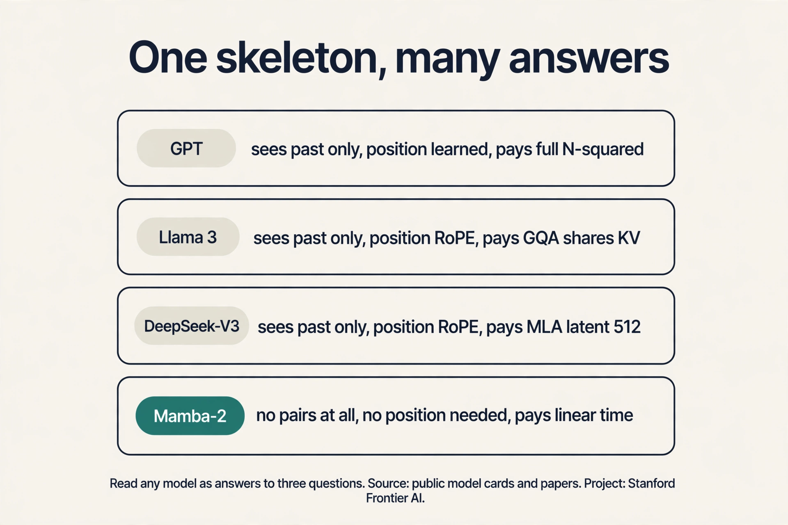

Two honest caveats. Gemini's and GPT-4's internals are not public.
The table records what their makers announced (long context) and
marks the rest unknown. And "best" depends on the job: Mamba
wins long sequences, BERT-style encoders win classification,
decoder-only wins generation. There is no universal winner, only
tradeoffs this chapter now lets you read.

## Recap: the whole lesson on one screen

The story in ten steps. Each step answers the one before it.

1. **Sequences in, sequences out.** The universal frame: text,
   audio, sensors. The job: contextual representations.
2. **One token at a time.** Whole sequences cannot be modeled
   directly (lengths vary, space explodes: 50,000^10). The chain
   rule turns it into next-token prediction.
3. **The RNN.** Read left to right, keep notes in a hidden state:
   h_t = tanh(W_h h_{t-1} + W_x x_t). Recent tokens loud, old
   tokens faded. LSTM adds gates and a cell highway (forget 0.9
   keeps "The" at 0.53, not 0.016). GRU merges the gates, cheaper.
4. **Distance fades.** "The" survives six updates at (0.5)^6 =
   under 2%. Long-range meaning dilutes through the chain.
5. **Gradients break.** Backprop multiplies per step: 0.9^10 =
   0.35 (vanishes), 1.1^10 = 2.59 (explodes). The network cannot
   learn long dependencies either.
6. **Serial stalls.** Step t waits for t-1. Thousands of GPU cores
   idle through 1,000 sequential steps.
7. **Attention deletes the chain.** Queries meet keys directly.
   values mix by match. "frame" = 0.21 counselor + 0.21 helped +
   0.58 self. O(1) distance, fully parallel, short gradient paths.
   Causal masks, cross-attention, sliding windows, and multiple
   heads are the same four steps with different rules.
8. **Position must be injected.** Attention cannot see order, so
   sinusoids or RoPE add it back. Multi-head gives each token
   several independent relations at once.
9. **The price is quadratic.** N x N scores: 16.7M entries at N =
   4,096. GQA shares KV heads, MLA compresses them to a latent,
   Mamba drops the pairs entirely.
10. **Every model is a tradeoff.** GPT generates, BERT reads, Llama
    and Mistral economize, DeepSeek compresses, Mamba recurs.
    Read any architecture as answers to this chapter's three
    questions: who sees whom, where is position, who pays.

## Official sources and further reading

**Official:**
- Intro to Sequence Modeling slide deck (CS229S, Fall 2023): the
  lecture this chapter follows, in its order.
- Vaswani et al., Attention Is All You Need (2017):
  - [the original transformer.](https://arxiv.org/abs/1706.03762)

**Further reading:**
- Stanford CS324, Introduction lecture:
  [the language modeling setup the slides cite.](https://stanford-cs324.github.io/winter2022/lectures/introduction/).
- The Pile (Gao et al., 2020): the 800 GB corpus named in the
  lecture.

**Caveats from these sources.** The three RNN challenges motivated
the transformer, but RNN research continued: S4, Mamba, linear
attention, and gated linear attention all attack the same cracks
from the recurrent side (L09). The hash-table intuition is a
teaching model: real keys and values are learned projections, not
literal table entries. The O(1) interaction claim is about path
length, not cost: the path is short but the step itself is
quadratic.

## Go deeper

<div style="position:relative;padding-bottom:56.25%;height:0;overflow:hidden;max-width:100%;margin:16px 0;">
<iframe style="position:absolute;top:0;left:0;width:100%;height:100%;" src="https://www.youtube-nocookie.com/embed/eMlx5fFNoYc" title="Attention in transformers, step-by-step | Deep Learning Chapter 6" frameborder="0" allow="accelerometer; autoplay; clipboard-write; encrypted-media; gyroscope; picture-in-picture" allowfullscreen></iframe>
</div>

- Attention in transformers, step-by-step (3Blue1Brown): https://www.youtube.com/watch?v=eMlx5fFNoYc
- Vaswani et al., Attention Is All You Need (2017): https://arxiv.org/abs/1706.03762
- The Annotated Transformer (Harvard NLP, attention from scratch in code): https://nlp.seas.harvard.edu/annotated-transformer/
- Stanford CS324, Introduction lecture (the language modeling setup the slides cite): https://stanford-cs324.github.io/winter2022/lectures/introduction/

## Connections to the other courses

- **CS336 L03:** builds the transformer block in full: residual
  stream, layer norm, multi-head attention, the MLP. Read it next.
- **CS224N:** the same attention story from the NLP side, with
  machine translation as the driving example.
- **CS229S L04/L06:** the systems answer to the quadratic price:
  KV caching and FlashAttention.
- **CS229S L09:** the RNN strikes back: S4, Mamba, and whether
  attention-free architectures change the tradeoff table.

## Coverage map

Every lecture concept mapped to the line that teaches it. File:
l02-sequence-models.md.

| Lecture concept | Anchor | Line |
|---|---|---|
| Sequence model (sequences in, sequences out) | "sequence model" | 39 |
| Next-token prediction (chain rule) | "chain rule" | 75 |
| Perplexity | "perplexity" | 93 |
| RNN (hidden state update) | "recurrent neural network" | 106 |
| RNN toy (fade by half) | "hidden state" | 111 |
| Backprop through time | "backprop through time" | 164 |
| LSTM gates and cell highway | "LSTM" | 179 |
| GRU (update/reset gates) | "GRU" | 207 |
| Long interaction distance (fade crack) | "long interaction distance" | 243 |
| Vanishing / exploding gradients | "vanishing" | 270 |
| Serial bottleneck (GPU cores idle) | "the sequence is a queue" | 282 |
| The key question (direct token talk) | "key question" | 302 |
| Attention as hash-table lookup | "hash table" | 317 |
| Attention toy (softmax by hand) | "softmax" | 356 |
| Four-step matrix computation | "mermaid" | 379 |
| Position encoding (sinusoids, RoPE) | "RoPE" | 540 |
| Causal attention (mask) | "causal" | 480 |
| Cross-attention (two sequences) | "cross-attention" | 493 |
| Sliding-window attention (Mistral) | "sliding-window" | 504 |
| Multi-head attention | "multi-head" | 515 |
| Linear attention vs FlashAttention | "linear attention" | 548 |
