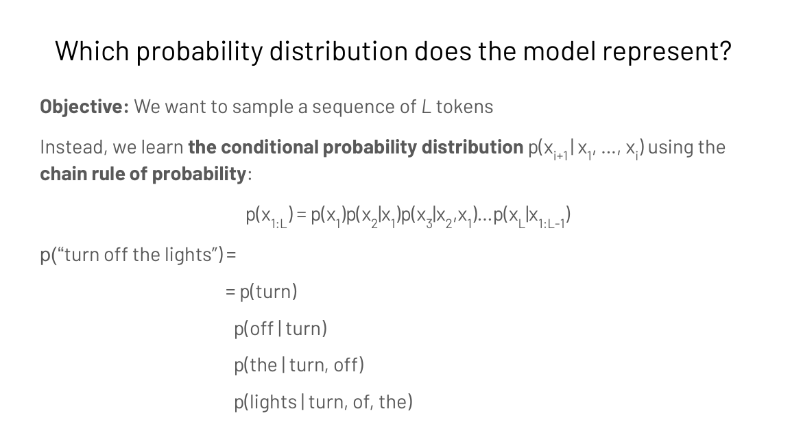
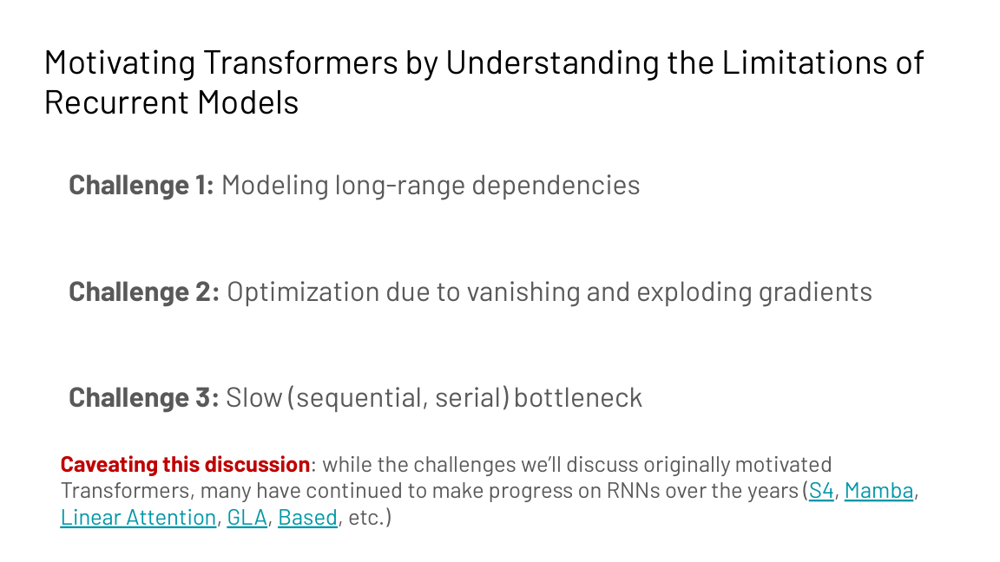
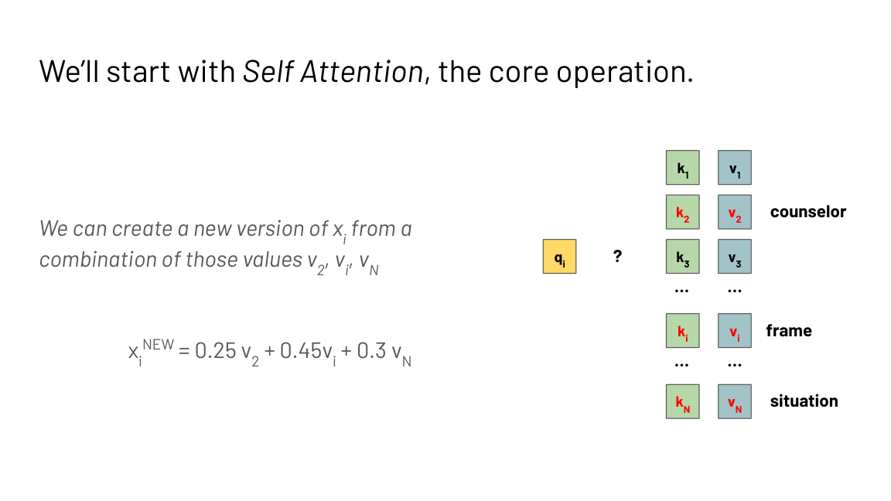
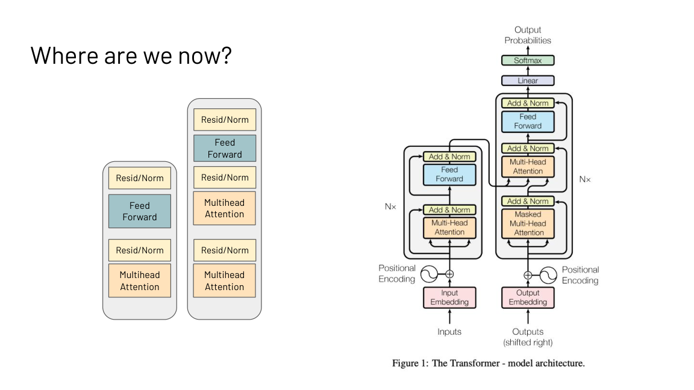
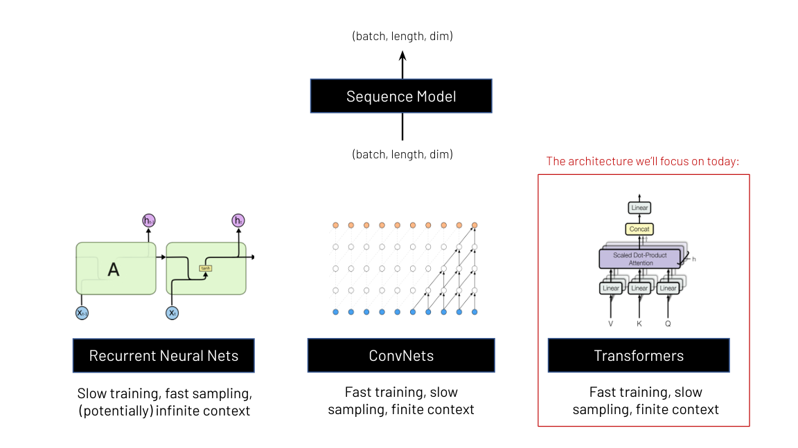

## How to read this lesson

This is a **bridge lesson**. The transformer is derived from scratch
in [CS336 L03](../cs336/l03-architecture.html) and in CS224N. This
lecture gives the CS229S framing: why sequence models matter for
systems, what the transformer replaced, and the block diagram every
later lecture in this course optimizes. Read Level 1, then follow the
links for depth.

## Level 1: Sequence models map sequences to sequences

A sequence model takes an input sequence and produces an output
sequence. Text to text is the flagship: "The Cat in the" goes in,
"Hat is a book by Dr. Seuss" comes out. But the same frame covers
audio, sensor data, medical signals, and images. The systems in this
course treat all of them as (batch, length, dim) tensors.

A language model is a compact probability distribution over token
sequences. For vocabulary V = {lights, off, the, turn}, the model
might learn P("turn off the lights") = 0.03 and P("off turn the
lights") = 0.0002.

Modeling the joint distribution directly fails: sequences have
varying lengths, the space of possible sequences explodes, and
average-case probabilities are imprecise. Instead the model learns
the conditional distribution with the chain rule:

p(x1..xL) = p(x1) p(x2|x1) p(x3|x1,x2) ... p(xL|x1..xL-1)

Each factor is one next-token prediction. Training on large corpora
such as the Pile (800 GB of diverse text) teaches the model these
conditionals. Perplexity is the intrinsic evaluation: how uncertain
is the model about the true next word.

> [!QA]
> Q: Why factor the distribution with the chain rule instead of modeling whole sequences?
> A: Three failures of the joint approach. Sequences have varying lengths, so one fixed model cannot cover them. The number of possible sequences explodes with length, so the space cannot be represented. And joint probabilities average over sequences instead of picking the best continuation. The chain rule turns one impossible problem into many small next-token predictions, which is exactly what the hardware in later lectures is tuned to compute.
> Follow-up: Where does this factorization show up in systems?
> A: In autoregressive decoding. Each factor p(xi | x1..xi-1) is one model call that reads the whole prefix. Lecture 4 shows why that call is memory bound and how KV caching removes the repeated work.

## Level 1: Three architecture families

 interface. Source: Stanford slides.")

All three families share the interface: (batch, length, dim) in,
(batch, length, dim) out. They differ in the training versus
inference tradeoff.

| Family | Training | Inference | Context |
|---|---|---|---|
| Recurrent nets | Slow (serial) | Fast | Finite, compressed into state |
| ConvNets | Fast | Slow sampling | Finite |
| Transformers | Fast (parallel) | Slow sampling | Finite, full look-back |

Transformers won because training dominates cost: fast parallel
training on huge data beats elegant serial inference. The systems
course then spends its energy fixing the slow-inference column.
[L09](l09-efficient-architectures.html) revisits this table when
asking whether attention-free architectures can change it.

## Level 1: What the transformer replaced

Recurrent neural networks were the state of the art around 2016. The
idea: compress the history of all seen tokens into a hidden state,
update it each timestep, generate outputs from it. Three challenges
motivated the transformer.

**Challenge 1: long interaction distances.** In "The counselor
helped frame the situation", the word "The" passes through many
timesteps before reaching "situation". Distant tokens interact only
through a long chain of state updates.

**Challenge 2: vanishing and exploding gradients.** Backpropagation
multiplies through every timestep. Large values explode the
gradient and destabilize training; small values shrink it toward
zero and the network stops learning.

**Challenge 3: serial bottleneck.** Timestep t must finish before
timestep t+1 starts. No parallelization across the sequence.

The lecture notes that RNN research continued (S4, Mamba, linear
attention), which is the subject of [L09](l09-efficient-architectures.html).

## Level 1: Attention as a hash-table lookup

The key idea of attention: all tokens interact with all other
tokens' representations. The lecture's intuition is a hash table.
Every token xi becomes a key ki and a value vi. Each token also
becomes a query qi that looks up the table: compare the query to all
keys, take the most similar values, mix them.

Concretely, for the word "frame" in "The counselor helped frame the
situation", the query for "frame" might return 0.25 of "counselor",
0.45 of "helped", 0.30 of "situation". The new representation is
the weighted mix. Attention supplies the weights. This is the
contextual representation: "frame" now carries its context.

The full computation, in four steps:

 interaction distance and parallelizability. Source: Stanford slides.")

1. Transform each token three ways: qi = xi Wq, ki = xi Wk,
   vi = xi Wv.
2. Score every pair: O = Q K^T, an N by N matrix.
3. Normalize rows: S = Softmax(O / sqrt(d)).
4. Mix values: output = S V.

Two properties made this a systems success. Maximum interaction
distance is O(1) instead of O(n): any two tokens meet directly.
And the pairwise interactions compute in parallel, which is why
transformers train fast on GPUs. The price is the N by N matrix:
quadratic memory and compute, the target of Lectures 3 and 6.

Multi-head attention splits the d dimensions across h heads, so each
head attends over d/h dimensions. Different heads learn different
interaction patterns. The feed-forward network then applies
nonlinearity, since attention alone only takes weighted averages.
Residual connections, layer normalization, and scaled dot products
keep training stable. Position encodings (absolute, Alibi, rotary)
tell attention which token sits where.

## Level 1: Three ways to use a transformer

**Decoder-only.** Uses the final representation to generate text.
Training objective: next-token prediction. Reads left to right.
Example: GPT. This is the architecture the whole course optimizes.

**Encoder-only.** Uses the final representation for classification or
embeddings. Training objective: span prediction (mask words, predict
them). Reads bidirectionally. Example: BERT.

**Encoder-decoder.** Two stacks: one reads the input, one generates
the output. Useful when inputs and generations differ in kind, e.g.
questions versus answers.

Pretrained models learn from next-token or span prediction on the
open web. Fine-tuning then adapts them to instructions and human
preferences, which is [L08](l08-finetuning-and-peft.html).

> [!QA]
> Q: Why does this systems course care mostly about decoder-only models?
> A: Because generation is the expensive workload. Decoder-only models generate token by token, and each step is a full model pass over a growing prefix. That is the memory-bound, latency-sensitive pattern that KV caching, batching, and speculative decoding in Lecture 4 exist to fix. Encoders do one forward pass; there is far less to optimize.
> Follow-up: What is the one systems fact about the transformer block to carry forward?
> A: Every token attends to every other token, which costs O(N squared) in the sequence length. That single cost drives the memory hierarchy work in Lecture 3, the FlashAttention derivation in Lecture 6, and the attention-free architectures in Lecture 9.

## Recap: the whole lesson on one screen

<strong>1. Language models factor with the chain rule</strong>

One impossible joint distribution becomes many small next-token
predictions. Each prediction is one model call over the prefix.

Key: p(x1..xL) as a product of conditionals

<strong>2. Three families, one interface</strong>

RNNs, ConvNets, and transformers all map (batch, length, dim) to
(batch, length, dim). They differ in training versus inference
speed.

Key: transformers won on parallel training

<strong>3. RNNs failed on distance, gradients, and serialism</strong>

Long interaction distances, vanishing and exploding gradients,
and a timestep bottleneck. Attention answers all three.

Key: O(n) interaction distance in RNNs

<strong>4. Attention is a differentiable hash table</strong>

Queries look up keys, values mix by similarity. The result is a
contextual representation of each token.

Key: xi_new = weighted mix of values

<strong>5. Four steps, one quadratic matrix</strong>

Project to Q, K, V. Score QK^T. Softmax. Mix V. The N by N
matrix costs O(N squared): the target of Lectures 3 and 6.

Key: S = Softmax(QK^T / sqrt(d))

<strong>6. The block: attention plus feed-forward</strong>

Multi-head attention mixes tokens. The MLP adds nonlinearity.
Residuals, norms, and scaling keep training stable.

Key: this block is what we optimize

<strong>7. Decoder-only, encoder-only, encoder-decoder</strong>

Generate text, classify text, or translate between kinds of
text. This course optimizes decoder-only generation.

Key: GPT vs BERT vs seq2seq

<strong>8. Pretrain, then fine-tune</strong>

Next-token prediction on the web teaches the base model.
Fine-tuning teaches instructions and human preferences.

Key: L08 covers fine-tuning systems

## Official sources and further reading

**Official:**
- Intro to Sequence Modeling slide deck (Fall 2023 headers).

**Further reading:**
- Vaswani et al., "Attention Is All You Need" (2017): the original transformer paper.
- [CS336 L03](../cs336/l03-architecture.html): the transformer derived from scratch with executable code.
- CS224N: the full NLP treatment of attention and transformers.
- Brown et al., "Language Models are Few-Shot Learners" (2020): what scale unlocked.

**Caveats from these sources.** The slide deck is the Fall 2023
version; the lecture order follows the Fall 2024 calendar. Some
slides (e.g. "Created by genmo.ai") are generated illustrations,
not data. Position encoding research (absolute, Alibi, rotary) is
mentioned as active; the lecture does not endorse one.

## Connections to the other courses

- **CS336 L03:** the transformer from scratch. Read it for the full derivation.
- **CS224N:** attention, transformers, and their NLP history in depth.
- **CS229S L04:** autoregressive decoding as a systems workload.
- **CS229S L06:** why the N by N attention matrix must go.
- **CS229S L09:** the RNN strikes back: S4, Mamba, and linear attention.
- **CS336 L15:** post-training: what fine-tuning does to the model.

> [!CHEAT]
> **Sequence models cheatsheet.** Sequence model: input sequence to output sequence. LM: compact distribution over token sequences; chain rule p(x1..xL) = product of conditionals. Perplexity: uncertainty about the true next word. Families: RNN (slow train, fast infer), ConvNet, transformer (fast train, slow sampling). RNN failures: long distances, vanishing/exploding gradients, serial bottleneck. Attention: qi looks up kj, mixes vj; O = QK^T (N by N); S = Softmax(O/sqrt(d)); out = S V. O(1) interaction distance, parallelizable, O(N^2) cost. Multi-head: h heads over d/h dims. Block: attention + MLP + residual + norm. Uses: decoder-only (generate), encoder-only (classify), encoder-decoder (translate). Pretrain on web, fine-tune for instructions.

> [!MEMORY]
> **Attention in one line.** Every token asks every other token how much it matters, then becomes the weighted average of the answers.
