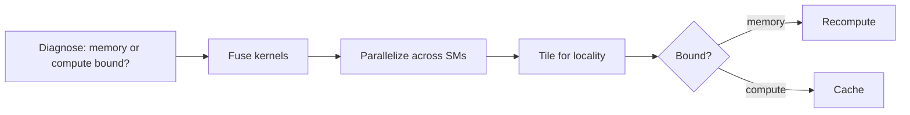

## How to read this lesson

**Level 1 (Core)** teaches the one question that organizes the whole
course: is this workload memory bound or compute bound, and what do
you do about it. **Level 2 (Deep)** works the numbers by hand:
matmul arithmetic intensity, the roofline, tiling variants, and the
six performance principles. Deep GPU mechanics live in
[CS336 L05](../cs336/l05-gpus.html); kernel programming in
[CS336 L06](../cs336/l06-triton-kernels.html). This lecture is the
CS229S framing and the decision procedure.

## Level 1: Big-O does not run your code

An algorithm can be asymptotically better and still slower. Strassen
matrix multiplication beats naive multiplication in big-O, but
constants and implementation details decide real runtime. The
lecture's example is linear attention: O(N) complexity, yet
FlashAttention's hardware-aware O(N squared) implementation wins in
wall-clock time.

Hardware utilization is the missing metric. We know the device's
theoretical peak compute and peak memory bandwidth. The fraction of
peak an implementation actually reaches tells us what to fix.

## Level 1: The two numbers that matter

Everything a processor does is three steps: move data from memory to
the processor, compute, move results back. Two hardware properties
bound this loop.

**Memory bandwidth.** Items moved per second. A toy processor moves
4 items per second.

**Compute bandwidth.** Operations done per second. The toy processor
does 8 ops per second.


Define Tmem as time spent on memory and Tmath as time spent on math.
With perfect overlap, total time is max(Tmem, Tmath). The longer one
is the bottleneck. If Tmath is longer, the program is compute bound.
If Tmem is longer, it is memory bound.

> [!QA]
> Q: What decides whether a program is memory bound or compute bound?
> A: Compare Tmath, the time the math takes, against Tmem, the time the data movement takes. Total time is the max of the two when they overlap. Whichever is longer names the bottleneck. This single comparison drives every optimization decision in the course.
> Follow-up: Why assume compute and memory overlap?
> A: Modern GPUs pipeline memory transfers with computation, so the two hide behind each other. The max formula is the ideal; real systems approach it with pipelining, which is one of the six principles below.

## Level 1: Work the toy by hand

Toy processor: 8 ops/s compute, 4 items/s memory. The algorithm
loads 8 items, computes 1 op per item, writes 8 items back.

Time: 2 s load, 2 s compute with stalls, 2 s write. At steady state
4 items arrive per second and the processor does 4 ops per second
out of a possible 8. Result: 50% compute utilization, 100% memory
utilization. Memory bound.

Now double the compute to 16 ops/s. Total time is unchanged: 25%
compute utilization, 100% memory utilization. Faster math bought
nothing.

Now instead double the memory bandwidth to 8 items/s. Total time
drops 25%: 1 s load, 1 s compute, 1 s write. 100% utilization of
both. Memory was the bottleneck, so bandwidth was the fix.


Flip the algorithm: load 4 items, compute 4 ops per item. Now the
processor needs 16 ops per second but can do 8. Compute bound.
Doubling compute to 16 ops/s cuts total time; doubling bandwidth
would not. The lesson: first diagnose, then spend.

## Level 1: Arithmetic intensity

The diagnosis needs a number. **Arithmetic intensity** is total
operations divided by total bytes moved:

AI = (total FLOPs) / (bytes read + bytes written)

Each device has a **ridge**: peak FLOPs divided by peak bandwidth.
The A100 does 312 TFLOPS in FP16 and moves 1,935 GB/s:

ridge = 312e12 / 1935e9 = 161 FLOPs per byte

If your algorithm's AI is below 161, it is memory bound on an
A100. Above 161, compute bound. The ridge is a property of the
hardware, not of your code.


> [!QA]
> Q: Define arithmetic intensity and the ridge, with the A100 numbers.
> A: Arithmetic intensity is total FLOPs divided by total bytes moved between memory and processor. The ridge is the device's peak FLOPs divided by its peak memory bandwidth: 312 TFLOPS over 1,935 GB/s equals 161 FLOPs per byte on an A100. Below the ridge you are memory bound; above it, compute bound.
> Follow-up: An algorithm has AI 100 on an A100. Do you optimize its math or its memory access?
> A: Its memory access. AI 100 sits below the ridge of 161, so the bottleneck is data movement. Faster math cannot help until the bytes per operation drop.

## Level 1: The roofline


The roofline plots performance against arithmetic intensity. The
memory roof slopes up on the left; the compute roof is flat on the
right. Your algorithm is a point. Left of the ridge: buy bandwidth,
fuse kernels, tile better. Right of the ridge: buy compute, use
tensor cores.

## Level 1: Six principles for high performance


1. **Fusion.** Do composite operations on data already in the
   processor. Save trips to and from memory. Critical for I/O bound
   ops. FlashAttention is fusion applied to attention.
2. **Parallelization.** Expose enough work to saturate every
   parallel unit. An A100 has 108 SMs; a matmul needs at least 108
   output items to keep them all busy.
3. **Blocking and tiling.** Assign tiles of work to units to exploit
   locality. Tiles fit in fast on-chip memory.
4. **Caching versus recomputation.** Cache when compute bound;
   recompute when memory bound. Extra math is free if memory is the
   bottleneck.
5. **Pipelining.** Overlap computation with memory reads and writes
   to avoid stalls.
6. **Hardware-specific optimizations.** Intrinsics, tensor cores,
   new instructions.



## Level 2: The GPU memory hierarchy


CPUs devote most transistors to caching and flow control: they run
a few tens of threads with minimum latency. GPUs devote most
transistors to data processing: thousands of threads in parallel
with higher throughput. Deep learning is matrix multiplication, so
the GPU's transistor budget matches the workload.

One A100 GPU holds four pools. Registers: 256 KB per SM, private to
threads. Shared memory: 192 KB per SM, visible to a thread block.
L2 cache: 40 MB. HBM device memory: 40 GB at about 2 TB/s. Speed
rises as you go up; capacity rises as you go down. Every
optimization in this course is a decision about which pool holds
which data. [L05](l05-gpu-execution-model.html) defines the
device block from these pools; MS&E435 reuses it.

Threads organize into blocks, blocks into a grid. The hardware
distributes blocks to SMs with free capacity. Inside an SM, threads
execute in groups of 32 called **warps** under SIMT: single
instruction, multiple threads. One instruction unit drives many
processors in lockstep.

## Level 2: Matmul arithmetic intensity, worked

C = A B with A N by K, B K by M, C N by M. Each of the NM entries
is a dot product of K multiplies and K adds: 2K FLOPs. Total:
2MNK FLOPs.

Memory in FP16 (2 bytes per value): read A (NK), read B (KM), write
C (NM). Total bytes: 2(KM + NK + NM).

AI = 2MNK / 2(KM + NK + NM)


Two cases against the A100 ridge of 161.

Case 1: M = K = 8192, N = 128. AI = 124.1. Below 161: memory
bound. This is the small-batch inference regime.

Case 2: M = K = N = 8192. AI = 2730.6. Above 161: compute bound.
This is the large training regime.

Same operation, different shapes, different bottleneck. Shape is
part of the diagnosis.

> [!QA]
> Q: Work out whether a 8192-by-8192 matmul with batch 128 is memory or compute bound on an A100.
> A: FLOPs are 2MNK and bytes are 2(KM + NK + NM) in FP16, giving AI = 124.1 FLOPs per byte. The A100 ridge is 161. Since 124.1 is below 161, the operation is memory bound. Growing N to 8192 raises AI to 2730.6, flipping it to compute bound. The same kernel changes bottleneck with shape.
> Follow-up: Why does inference usually land memory bound?
> A: Inference runs small batches, so N is small and the bytes of the weight matrices dominate the FLOPs. Training runs large batches with large N, pushing AI above the ridge. This is why inference optimization is mostly a memory-bandwidth game, as Lecture 4 shows.

## Level 2: Tiling raises arithmetic intensity

Naive matmul: each thread computes one output element. It reads a
row of A and a column of B (2K values) and writes 1 value. Bytes:
2(2K + 1). AI = 2K / 2(2K + 1), which approaches 0.5. Terrible:
every element reloads its inputs.

1D tiling: each thread computes 2 outputs, reusing one row of A
across 2 columns of B. FLOPs double to 4K; bytes grow only to
2(3K + 2). AI improves.

2D tiling: each thread computes a 2 by 2 tile. FLOPs 8K, bytes
2(4K + 8). AI improves again.

The pattern: reuse data already on-chip before it goes back to
HBM. Tiling is the mechanism behind FlashAttention's speed in
[L06](l06-flash-attention.html).

```ascii
naive : thread -> 1 output | reads row A + col B (2K) | writes 1
1D    : thread -> 2 outputs | reads row A + 2 cols B (3K) | writes 2
2D    : thread -> 2x2 tile  | reads 2 rows A + 2 cols B (4K) | writes 4
rule  : share inputs across outputs on-chip; AI rises with reuse
```

## Level 2: Caching versus recomputation, previewed

Autoregressive generation predicts one token, appends it, and
repeats. The keys and values of earlier tokens never change, so
recomputing them every step is wasted work: cache them. That is KV
caching, derived with full numbers in [L04](l04-transformer-performance.html).

The general rule from the slides: for compute-bound workloads,
caching wins; for memory-bound workloads, recomputation wins,
because the extra math is free when memory is the bottleneck.

| Regime | Store intermediates | Or recompute |
|---|---|---|
| Compute bound | Yes: math is the limit | No |
| Memory bound | No: traffic is the limit | Yes: math is free |

FlashAttention's backward pass recomputes the attention matrix
instead of storing it for exactly this reason.

## Recap: the whole lesson on one screen

<div class="recap-grid">
<div class="recap-card">

<div class="rc-body">
<strong>1. Time is max of memory and math</strong>
<p>Move data, compute, move back. Tmem versus Tmath decides the
bottleneck. The longer one wins, and only it is worth fixing.</p>
<p class="rc-num">Key: total = max(Tmem, Tmath)</p>
</div>
</div>
<div class="recap-card">

<div class="rc-body">
<strong>2. Diagnose before you optimize</strong>
<p>Doubling compute on a memory-bound kernel changes nothing.
Doubling bandwidth cuts time. The toy proves it by hand.</p>
<p class="rc-num">Key: fix the bottleneck, not the hobby</p>
</div>
</div>
<div class="recap-card">

<div class="rc-body">
<strong>3. Arithmetic intensity is the diagnosis</strong>
<p>FLOPs per byte. Below the device ridge you are memory bound;
above it, compute bound. A100 ridge: 161 FLOPs/byte.</p>
<p class="rc-num">Key: AI = FLOPs / bytes</p>
</div>
</div>
<div class="recap-card">

<div class="rc-body">
<strong>4. The roofline makes it visual</strong>
<p>Memory roof slopes up left of the ridge; compute roof is flat
right of it. Place your algorithm, then read the prescription.</p>
<p class="rc-num">Key: left of ridge buys bandwidth</p>
</div>
</div>
<div class="recap-card">

<div class="rc-body">
<strong>5. The GPU is a memory hierarchy</strong>
<p>Registers, shared memory, L2, HBM: faster upward, larger
downward. Every optimization is a placement decision.</p>
<p class="rc-num">Key: 256 KB / 192 KB / 40 MB / 40 GB</p>
</div>
</div>
<div class="recap-card">

<div class="rc-body">
<strong>6. Shape decides the bottleneck</strong>
<p>Same matmul: AI 124 with N=128 (memory bound), AI 2731 with
N=8192 (compute bound). Inference is usually the first case.</p>
<p class="rc-num">Key: 124 vs 2731 vs ridge 161</p>
</div>
</div>
<div class="recap-card">

<div class="rc-body">
<strong>7. Six principles fix the bottleneck</strong>
<p>Fusion, parallelization, tiling, caching versus recompute,
pipelining, hardware-specific tricks. Diagnose first, then pick.</p>
<p class="rc-num">Key: one prescription per bottleneck</p>
</div>
</div>
<div class="recap-card">

<div class="rc-body">
<strong>8. Tiling reuses data on-chip</strong>
<p>Naive matmul reloads inputs per output. Tiles share rows and
columns in fast memory. Arithmetic intensity rises with reuse.</p>
<p class="rc-num">Key: reuse is the whole game</p>
</div>
</div>
</div>

## Official sources and further reading

**Official:**
- Hardware-Aware Algorithm Design slide deck (Fall 2023 headers).
- NVIDIA CUDA C++ Programming Guide: SIMT, warps, thread blocks.
- NVIDIA Ampere Architecture In-Depth: A100 specs.

**Further reading:**
- [CS336 L05](../cs336/l05-gpus.html): GPU architecture in full.
- [CS336 L06](../cs336/l06-triton-kernels.html): writing kernels.
- Williams et al., "Roofline: An Insightful Visual Performance Model": the original roofline paper.

**Caveats from these sources.** A100 figures (312 TFLOPS FP16,
1,935 GB/s) are the dense specs from the slides; sparse tensor-core
throughput is higher. The toy overlap model (total = max) is ideal;
real kernels approach it but add launch and synchronization costs.
Tiling AI formulas in the slides carry "!!" emphasis marks; the
algebra above follows the slide expressions.

## Connections to the other courses

- **CS336 L05:** the full GPU architecture treatment; this lecture is its decision procedure.
- **CS336 L06:** Triton kernels: tiling and fusion in code.
- **CS229S L05:** the device block, defined from the memory hierarchy here.
- **CS229S L06:** FlashAttention as fusion plus tiling plus recompute.
- **CS229S L04:** KV caching as the caching-versus-recompute decision.

> [!CHEAT]
> **Hardware-aware design cheatsheet.** Two properties: memory bandwidth (items/s), compute bandwidth (ops/s). Time = max(Tmem, Tmath); Tmath = ops / compute BW, Tmem = bytes / memory BW. Compute bound: Tmath > Tmem. Memory bound: Tmem > Tmath. AI = FLOPs / bytes. Ridge = peak FLOPs / peak BW; A100 = 312 TFLOPS / 1935 GB/s = 161. Matmul: FLOPs 2MNK, bytes 2(KM+NK+NM) in FP16. N=128: AI 124, memory bound. N=8192: AI 2731, compute bound. GPU pools (A100): registers 256 KB/SM, shared 192 KB/SM, L2 40 MB, HBM 40 GB. Warps: 32 threads, SIMT. A100: 108 SMs. Six principles: fuse, parallelize, tile, cache-or-recompute, pipeline, hardware tricks. Memory bound: recompute, buy bandwidth. Compute bound: cache, buy FLOPs.

> [!MEMORY]
> **The ridge rule.** Below 161, move less. Above 161, compute more. Diagnose first.
