## The question: why is this kernel slow?

Your model is slow. You open a profiler, find the slowest kernel,
and rewrite it with a better asymptotic algorithm. It runs
slower. This happens constantly in ML systems, and this lecture
explains why.

The standard way to judge an algorithm is big-O: Strassen matrix
multiplication is O(N^2.8074) against naive O(N^3), so Strassen
should win. But big-O ignores two things: the constants, which
can dominate at real problem sizes, and implementation details,
which matter enormously on real hardware. An asymptotically
better algorithm can lose if it is not well suited to the
machine.

The lecture's Exhibit A is the meme from Lecture 1. A fancy new
linear attention algorithm scales as O(N) in sequence length
against standard attention's O(N squared). On paper it wins.
FlashAttention, a hardware-aware implementation of the exact
O(N squared) algorithm, runs faster in wall-clock time. The
constants and the memory behavior decided. The missing metric
is **hardware utilization**: the fraction of the device's
theoretical peak that an implementation actually reaches. This
lecture builds the tools to compute it.

## A toy processor

What happens inside a processor is conceptually simple. Move
items from memory to the processor. Perform some computation.
Move the results back. Two hardware properties bound this loop,
and they are properties of the hardware, not of your algorithm.

**Memory bandwidth**: the maximum number of items moved per
second. Our toy processor moves 4 items per second.

**Compute bandwidth**: the maximum number of operations done
per second. The toy processor does 8 operations per second.

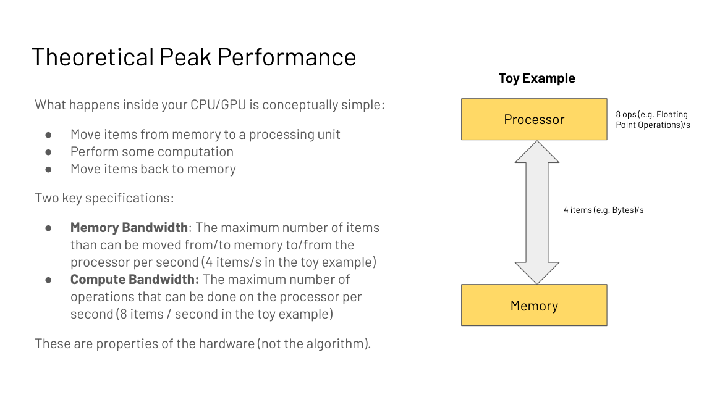

Define two times. **Tmem** is time spent on memory:
(bytes accessed) / (memory bandwidth). **Tmath** is time spent
on math: (operations) / (compute bandwidth). If memory and
compute overlap perfectly, total time is max(Tmem, Tmath). The
longer one is the bottleneck. If Tmath is longer, the program is
**compute bound**. If Tmem is longer, it is **memory bound**.
That single comparison drives every optimization decision in
this course.

Now watch the toy work. The algorithm loads 8 items, computes 1
operation per item, and writes 8 items back. Load takes 2
seconds at 4 items/s. Compute plus stalls takes 2 seconds.
Write takes 2 seconds. At steady state, 4 items arrive per
second and the processor does 4 ops per second out of a
possible 8. Result: 50% compute utilization, 100% memory
utilization. Memory bound.

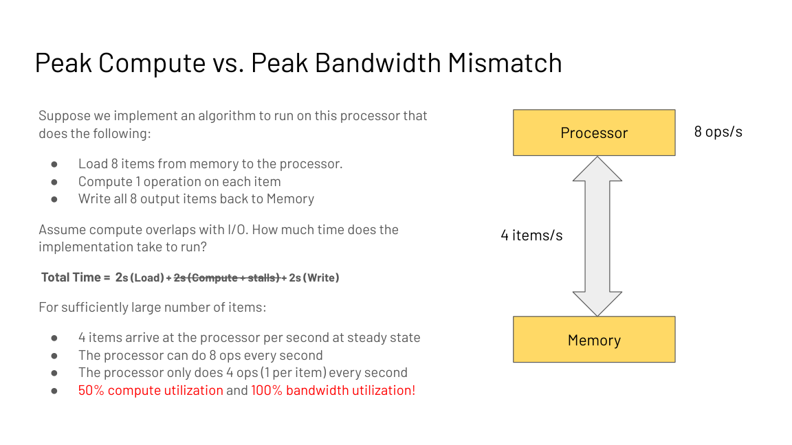

The diagnosis dictates the fix. Double the compute speed to 16
ops/s. Total time is unchanged: 25% compute utilization, 100%
memory utilization. Faster math bought nothing. Now instead
double the memory bandwidth to 8 items/s. The stages fall to 1
second each: 100% utilization of both, and the total time
falls. Memory was the bottleneck, so bandwidth was the fix.

Flip the algorithm: load 4 items, compute 4 operations per
item. Now the processor needs 16 ops per second but can do 8.
Compute bound. Doubling compute to 16 ops/s cuts the total
time. Doubling bandwidth would not. The lesson of the toy:
diagnose first, then spend.

## The key question

The toy gives the procedure, but nobody wants to simulate
processors by hand. What is the one number that diagnoses any
algorithm on any device? The answer is arithmetic intensity.

## Arithmetic intensity and the ridge

The answer is a ratio. **Arithmetic intensity** (AI) is total operations divided by
total bytes moved:

```
AI = (total FLOPs) / (bytes read + bytes written)
```

Each device has a **ridge**: peak FLOPs divided by peak
bandwidth. The A100 does 312 TFLOPS (trillion floating-point operations
per second) in FP16 and moves 1,935 GB/s:

```
ridge = 312e12 / 1935e9 = 161 FLOPs per byte
```

If your algorithm's AI is below 161, it is memory bound on an
A100. Above 161, compute bound. The ridge is a property of the
hardware, not of your code.

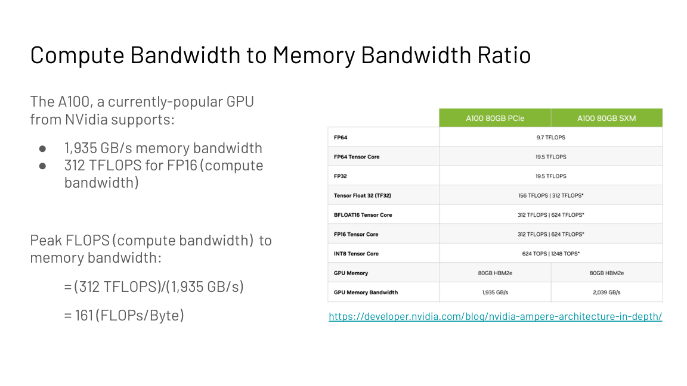

The **roofline** plots achievable performance against
arithmetic intensity. The memory roof slopes up on the left.
The compute roof is flat on the right. Your algorithm is a
point on this plot. Left of the ridge: buy bandwidth, fuse
kernels, tile better. Right of the ridge: buy compute, use
tensor cores (specialized matrix-multiply units in the GPU,
detailed in subchapter 6 below).

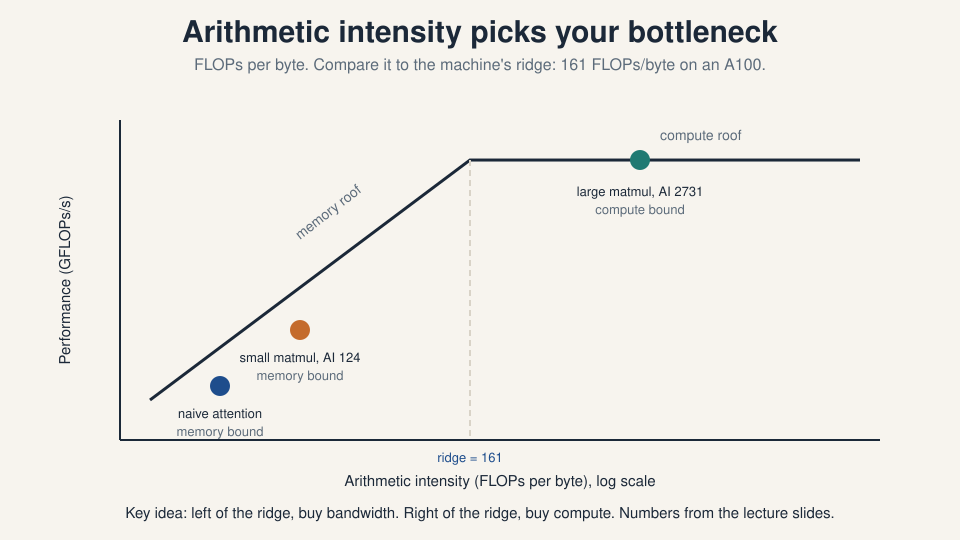

### Subchapter: the ridge moves with the chip

The ridge is hardware, so it moves with the generation. Compute
it for the current fleet from public dense specs:

| Chip | Peak FP16 | Bandwidth | Ridge |
|---|---|---|---|
| A100 | 312 TFLOPS | 1,935 GB/s | 161 |
| H100 | 989 TFLOPS | 3,350 GB/s | 295 |
| H200 | 989 TFLOPS | 4,800 GB/s | 206 |
| B200 | 2,250 TFLOPS | 8,000 GB/s | 281 |
| B200, FP8 | 4,500 TFLOPS | 8,000 GB/s | 562 |

Read the trend. Compute outran bandwidth from A100 to H100, so
the ridge rose from 161 to 295. H200 kept H100's compute and
raised bandwidth, so the ridge fell to 206: a friendlier chip for
memory-bound inference. B200 in FP8 pushes the ridge to 562.

A kernel with AI 200 is compute bound on an A100 (200 > 161)
and memory bound on an H100 (200 < 295). The same code flips its
bottleneck when the chip changes. Diagnose on the chip you run,
not the chip the paper used.

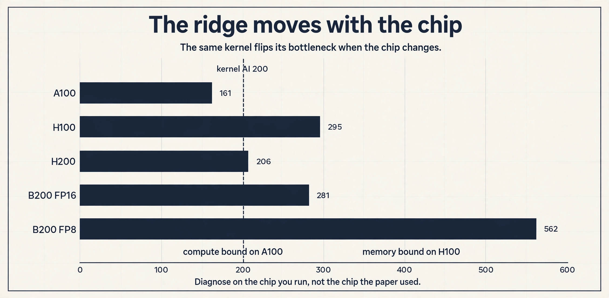

## Worked: matrix multiplication

C = A B with A N by K, B K by M, C N by M. Each of the NM
entries is a dot product: K multiplies and K adds, so 2K
FLOPs. Total: 2MNK FLOPs. Memory in FP16 (2 bytes per value):
read A (NK), read B (KM), write C (NM). Total bytes:
2(KM + NK + NM).

```
AI = 2MNK / 2(KM + NK + NM)
```

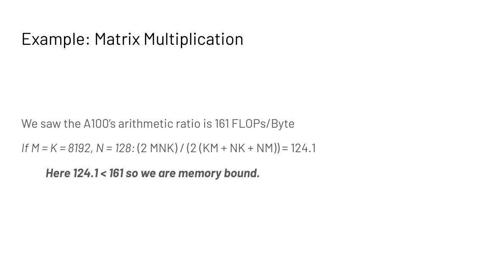

Two cases against the A100 ridge of 161. With M = K = 8192 and
N = 128, AI = 124.1. Below the ridge: memory bound. This is
the small-batch inference regime. With M = K = N = 8192,
AI = 2730.6. Above the ridge: compute bound. This is the
large training regime. Same operation, different shapes,
different bottleneck. Shape is part of the diagnosis.

## Six principles for high performance

The lecture gives six principles, one per bottleneck, each with a
concrete mechanism.

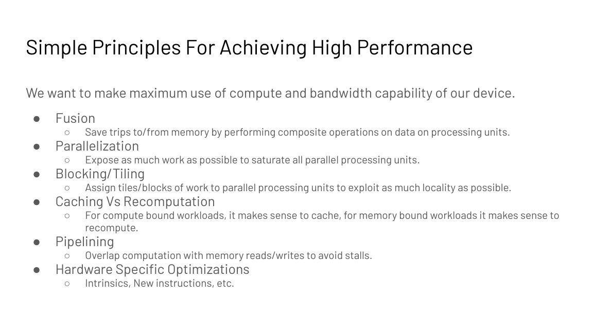

### Subchapter: 1. fusion, keep the intermediate on-chip

Perform composite operations on data already in the processor.
Save trips to and from memory. If a kernel applies f then g to
the same data, fuse them so the intermediate never goes back to
HBM (high-bandwidth memory: the GPU's large off-chip DRAM,
detailed in the memory-hierarchy section below). Critical for
I/O-bound operations. FlashAttention is this
principle applied to attention (L06).

The toy: two kernels, f then g, on 1 MB of data. Unfused: read
1 MB, apply f, write 1 MB to HBM, read 1 MB, apply g, write
1 MB. Four trips, 4 MB of traffic. Fused: read 1 MB, apply f,
apply g on-chip, write 1 MB. Two trips, 2 MB of traffic. The
math is identical. The traffic halves. For a memory-bound
pipeline, runtime halves with it.

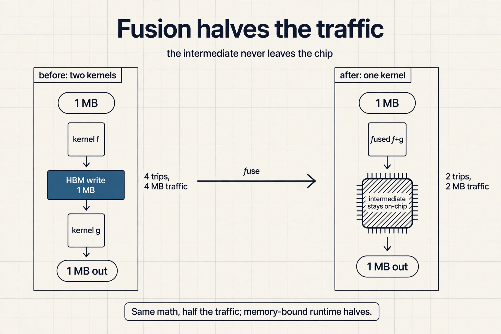

### Subchapter: 2. parallelization, feed all 108 SMs

Expose enough work to saturate every parallel unit. An A100 has
108 streaming multiprocessors (SMs). A matmul needs at least 108
output tiles to keep them all busy. Fewer tiles means idle
silicon.

The wave math: launch 100 thread blocks on 108 SMs and 8 SMs sit
idle, one wave at 93 percent utilization. Launch 216 blocks and
each SM takes 2, two full waves, 100 percent. Launch 150 and you
get one full wave plus 42 stragglers: the second wave costs a
full wave of time for 42 blocks of work. This is wave
quantization, and it is why tile counts are tuned to multiples
of the SM count. The same kernel at 150 blocks can run slower
than at 108.

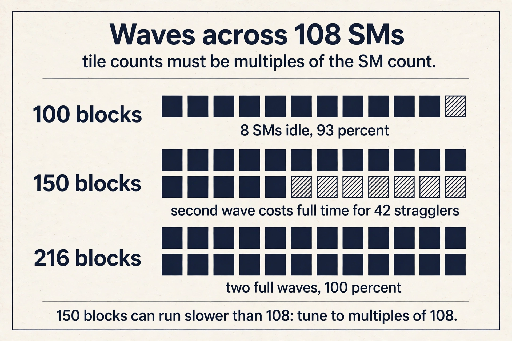

### Subchapter: 3. tiling, share inputs on-chip

Assign tiles of work to units to exploit locality. Tiles fit in
fast on-chip memory. Worked on matmul: in the naive version each
thread computes one output, reads a row of A and a column of B
(2K values), and writes 1 value. AI approaches 0.5 for large K.
With 1D tiling, each thread computes 2 outputs, reusing one row
of A across 2 columns of B: AI approaches 0.67. With 2D tiling,
each thread computes a 2 by 2 tile: AI approaches 1.0. The
pattern: reuse data already on-chip before it goes back to HBM.

```ascii
naive : thread -> 1 output   | reads row A + col B (2K)  | writes 1
1D    : thread -> 2 outputs  | reads row A + 2 cols (3K) | writes 2
2D    : thread -> 2x2 tile   | reads 2 rows + 2 cols (4K)| writes 4
rule  : share inputs across outputs on-chip, AI rises with reuse
```

The rule in one line: share inputs across outputs on-chip, and
AI rises with reuse. Real kernels tile to the SRAM size, not to
2 by 2: a 128 by 128 tile reuses each loaded value 128 times,
and AI climbs into the hundreds. The worked example shows the
mechanism. The tile size sets the scale.

> [!QA]
> Q: Walk me through a roofline diagnosis on a B200 for a kernel with AI 400.
> A: Step 1: the ridge. B200 does 2,250 TFLOPS FP16 over 8,000 GB/s: ridge = 281 FLOPs per byte. Step 2: compare. AI 400 is above 281, so the kernel is compute bound on a B200. Step 3: prescribe. Optimize the math: tensor cores, FP8, better tiling. Buying bandwidth would not help. Step 4: sanity check. The same kernel on an H100 (ridge 295) is also compute bound. But a kernel with AI 200 is compute bound on the A100 (ridge 161) and memory bound on the H100: the diagnosis travels with the chip.
> Follow-up: The B200 in FP8 has ridge 562. Why does lower precision raise the ridge?
> A: FP8 doubles the FLOPs (4,500 vs 2,250 TFLOPS) while bandwidth stays 8,000 GB/s. The ridge is their ratio, so it doubles to 562. Lower precision makes more kernels memory bound, because each byte now feeds twice the math. This is why FP8 inference is a bandwidth game.

> [!QA]
> Q: Your 70B model's decode is slow on an H200. Diagnose and fix it, with numbers.
> A: Decode at batch 1 has AI around 2 FLOPs per byte: each token streams the full weights once for a couple of FLOPs per byte. The H200 ridge is 206. AI 2 is far below, so decode is memory bound. The fixes all attack bytes: quantize weights to INT4 (70B goes from 140 GB to 35 GB, and each token streams 4x fewer bytes), batch requests (batch 32 raises AI toward the ridge), and shrink the KV cache (GQA, quantization, eviction). Do not optimize the math: the FLOPs are not the bottleneck.
> Follow-up: Why does batching help a memory-bound decode?
> A: The weights are read once per batch, not once per token. With batch 32, one weight read serves 32 tokens worth of math: AI rises 32x. The same bytes feed more FLOPs. Batching is the cheapest way to climb toward the ridge.

> [!QA]
> Q: When is recomputation the wrong call?
> A: When the recompute is asymptotically heavier than the store. KV caching is the case: recomputing keys and values each step would redo O(N) attention work per token, growing quadratically over the sequence. Storing them costs O(N) bytes per layer once. The bytes are cheap next to the FLOPs, even on the memory-bound side of the ridge. The rule "recompute when memory bound" holds only when the extra math is small: compare the FLOPs of recompute against the bytes of the store, at your precision, on your chip.
> Follow-up: FlashAttention's backward pass recomputes the N by N matrix. Why does that not violate the rule?
> A: Because the store would cost N squared bytes of HBM traffic and the recompute replays cheap on-chip math from a small cached state. The FLOPs are free on the memory-bound side, and the bytes saved are quadratic. The comparison favors recompute by the same logic that favors caching for the KV case.

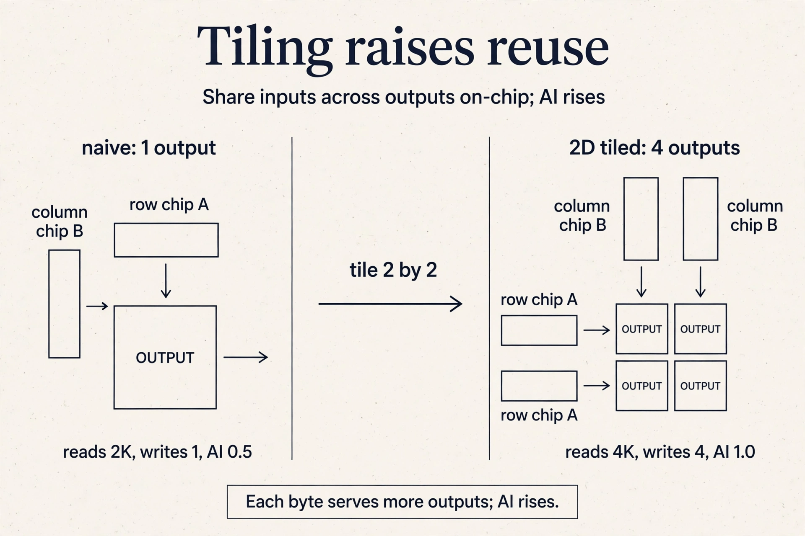

### Subchapter: 4. caching versus recomputation, the decision rule

For compute-bound workloads, cache intermediates. For
memory-bound workloads, recompute them: the extra math is free
when memory is the bottleneck.

Two worked cases from this course. Autoregressive generation:
predicting one token, appending it, and repeating would recompute
keys and values for the whole prefix every step. But past keys
and values never change, so they are cached: KV caching (L04).
The workload is memory bound, yet caching wins here, because the
recompute would redo O(N) attention work per step. The rule has
an exception when recompute is not cheap.

FlashAttention's backward pass: recompute the attention matrix
from a small cached state instead of storing it (L06). The
matrix is N by N. Storing it costs N squared bytes of traffic,
and the workload is memory bound. Recompute wins.

The decision rule: compare the bytes of storing against the
FLOPs of recomputing, on your side of the ridge. Memory bound:
bytes are dear, FLOPs are free, recompute. Compute bound: FLOPs
are dear, bytes are cheap, cache. The exception: when the
recompute itself is asymptotically heavier, cache anyway.

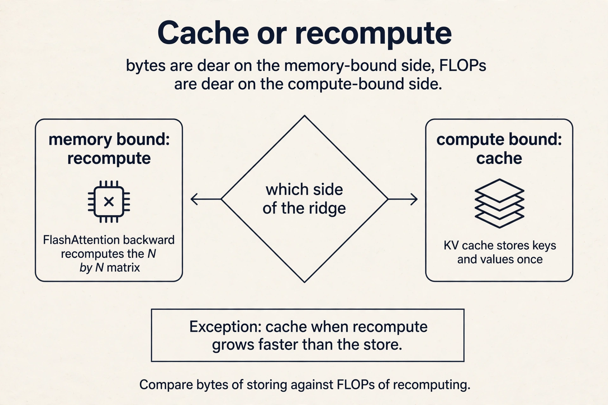

### Subchapter: 5. pipelining, hide behind the max

Overlap computation with memory reads and writes to avoid
stalls. This is the assumption behind the max(Tmem, Tmath)
model: the two hide behind each other.

The toy: a kernel reads 1 MB (1 ms) then computes (1 ms).
Serial: 2 ms per tile. Pipelined: while the compute units work
on tile 1, the memory units fetch tile 2. Steady state: 1 ms per
tile. The max formula is the pipelined time, not the serial
time. Double buffering is the mechanism: two tiles on-chip, one
computing, one loading. Without it you pay the sum. With it you
pay the max.

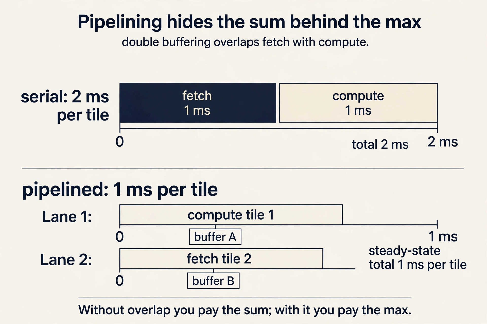

### Subchapter: 6. tensor cores, 16 by 16 in silicon

Intrinsics, tensor cores, new instructions. The lecture's
tensor-core example: modern GPUs multiply 16 by 16 tiles
natively, and launching them costs time, so tile sizes should
keep them busy. This is the same reuse story as tiling, stated
in silicon.

The numbers: an A100 tensor core reaches 312 TFLOPS in FP16. Its
plain CUDA cores reach about 19.5 TFLOPS in FP32. The 16x gap is
why matmuls target tensor cores and why tile dimensions are
multiples of 16. A kernel tiled to 13 by 13 pads to 16 and
wastes the padding: utilization leaks at the edges.
Hardware-specific means: know the native tile, tile to it.

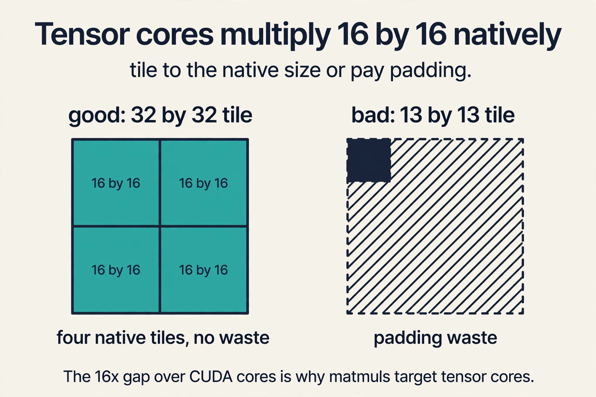


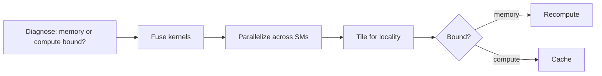

## Where the memory lives

One fact underlies tiling, fusion, and caching: the GPU is a
memory hierarchy, not one pool. On an A100: registers, 256 KB
per SM, private to threads. Shared memory, 192 KB per SM,
visible to a thread block. L2 cache, 40 MB. HBM device memory,
40 GB at about 1.6 TB/s. Speed rises as you go up. Capacity
rises as you go down.

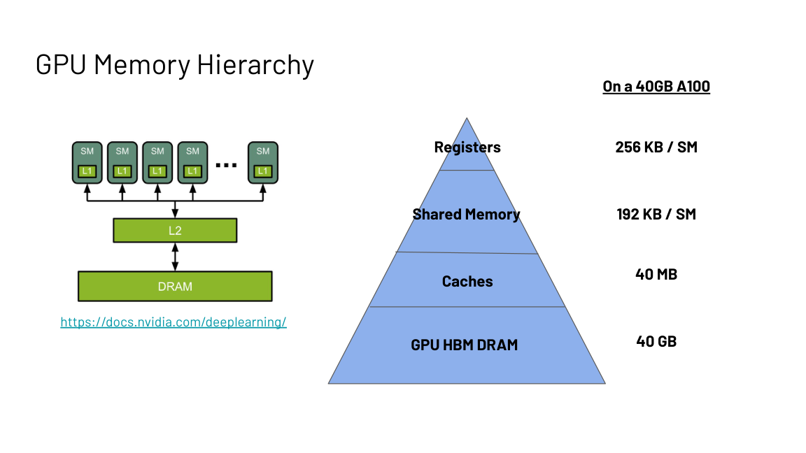

Every optimization in this course is a decision about which
pool holds which data. Keep the hot tiles in SRAM and
registers. Keep the model in HBM. Never pay for a round trip
you can avoid. L05 defines this hierarchy as the **device
block** and shows how code actually executes on it.

## What is used where: real chips and real kernels

Every fast kernel in production is a point in this chapter's
design space. Facts as of October 2026.

| System | Principles it embodies | Why |
|---|---|---|
| FlashAttention | fusion, tiling, recompute | exact attention with O(N) memory traffic; public |
| vLLM (PagedAttention) | memory-hierarchy placement | KV cache in non-contiguous blocks; public paper 2023 |
| TensorRT-LLM | fusion, tensor cores | NVIDIA's inference compiler; fuses whole transformer blocks |
| DeepSeek DeepGEMM | hardware-specific, FP8 | open-source FP8 GEMM tuned for Hopper; public |
| PyTorch torch.compile | fusion | fuses pointwise ops automatically via Triton |
| cuBLAS | tiling, tensor cores | NVIDIA's matmul; the roofline-optimal baseline |

Read any of them as answers to two questions: which side of the
ridge does it live on, and which principle moved it there.

## Mapping back: each principle answers one bottleneck

| Bottleneck | Principles that fix it |
|---|---|
| Memory bound (AI below the ridge) | Fusion, tiling, recomputation: move less, reuse more |
| Compute bound (AI above the ridge) | Caching, tensor cores, more math per byte |
| Idle hardware (too little work) | Parallelization: at least 108 outputs on an A100 |
| Stalls (memory and compute serialized) | Pipelining: overlap to approach max(Tmem, Tmath) |

## The honest price

The roofline is a model, and models have limits. The max()
formula assumes perfect overlap. Real kernels add launch and
synchronization costs. The ridge is hardware-specific: the
A100's 161 does not transfer to other chips. And the
diagnosis is per shape, not per operation: the same matmul
flips from memory bound to compute bound as N grows from 128
to 8192. Diagnose the workload you actually run, on the
device you actually run it on.

> [!QA]
> Q: What decides whether a program is memory bound or compute bound?
> A: Compare Tmath, the time the math takes, against Tmem, the time the data movement takes. Total time is the max of the two when they overlap. Whichever is longer names the bottleneck. This single comparison drives every optimization decision in the course.
> Follow-up: Why assume compute and memory overlap?
> A: Modern GPUs pipeline memory transfers with computation, so the two hide behind each other. The max formula is the ideal. Real systems approach it with pipelining, which is one of the six principles.

> [!QA]
> Q: Define arithmetic intensity and the ridge, with the A100 numbers.
> A: Arithmetic intensity is total FLOPs divided by total bytes moved between memory and processor. The ridge is the device's peak FLOPs divided by its peak memory bandwidth: 312 TFLOPS over 1,935 GB/s equals 161 FLOPs per byte on an A100. Below the ridge you are memory bound. Above it, compute bound.
> Follow-up: An algorithm has AI 100 on an A100. Do you optimize its math or its memory access?
> A: Its memory access. AI 100 sits below the ridge of 161, so the bottleneck is data movement. Faster math cannot help until the bytes per operation drop.

> [!QA]
> Q: Work out whether an 8192-by-8192 matmul with batch 128 is memory or compute bound on an A100.
> A: FLOPs are 2MNK and bytes are 2(KM + NK + NM) in FP16, giving AI = 124.1 FLOPs per byte. The A100 ridge is 161. Since 124.1 is below 161, the operation is memory bound. Growing N to 8192 raises AI to 2730.6, flipping it to compute bound. The same kernel changes bottleneck with shape.
> Follow-up: Why does inference usually land memory bound?
> A: Inference runs small batches, so N is small and the bytes of the weight matrices dominate the FLOPs. Training runs large batches with large N, pushing AI above the ridge. This is why inference optimization is mostly a memory-bandwidth game, as Lecture 4 shows.

> [!QA]
> Q: Tiling raised matmul arithmetic intensity from 0.5 to 1.0 in the worked example. What physically changed?
> A: Data reuse. The naive thread loads 2K values per output element computed. The 2D-tiled thread loads 4K values but computes 4 outputs, sharing rows and columns in fast on-chip memory. Nothing about the math changed. The bytes per operation fell because each loaded byte served more outputs.
>
> Follow-up: Why did the intensity only double instead of jumping far higher? Because the 2D tile is small: 2 by 2. Each loaded byte serves only 2 outputs. Bigger tiles raise the reuse ratio, and the A100-sized tiles in real kernels push intensity orders of magnitude higher. The worked example shows the mechanism. The tile size sets the scale.

## Recap: the whole lesson on one screen

The story in eight steps. Each step answers the one before it.

1. **Big-O does not run your code.** Strassen beats naive
   multiplication asymptotically. Constants and
   implementation decide real runtime. Hardware utilization
   is the missing metric.
2. **The toy processor.** Move data, compute, move back.
   Total time is max(Tmem, Tmath). The longer one is the
   bottleneck, and only it is worth fixing.
3. **Diagnose before you optimize.** Doubling compute on a
   memory-bound kernel changes nothing (the toy proves it).
   Doubling bandwidth cuts the time. Fix the bottleneck, not
   the hobby.
4. **Arithmetic intensity is the diagnosis.** FLOPs per
   byte. Below the device ridge you are memory bound. Above
   it, compute bound. A100 ridge: 161 FLOPs/byte.
5. **The roofline makes it visual.** Memory roof slopes up
   left of the ridge. Compute roof is flat right of it.
   Place your algorithm, then read the prescription.
6. **Shape decides the bottleneck.** Same matmul: AI 124
   with N=128 (memory bound), AI 2731 with N=8192 (compute
   bound). Inference is usually the first case.
7. **Six principles fix the bottleneck.** Fusion,
   parallelization, tiling, caching versus recompute,
   pipelining, hardware-specific tricks. One prescription
   per bottleneck.
8. **The GPU is a memory hierarchy.** Registers, shared
   memory, L2, HBM: faster upward, larger downward. Every
   optimization is a placement decision.

## Official sources and further reading

**Official:**
- Hardware-Aware Algorithm Design slide deck (Fall 2023
  headers).
- NVIDIA CUDA C++ Programming Guide: SIMT, warps, thread
  blocks.
- NVIDIA Ampere Architecture In-Depth: A100 specs.

**Further reading:**
- Williams et al., "Roofline: An Insightful Visual
  Performance Model": the original roofline paper.

**Caveats from these sources.** A100 figures (312 TFLOPS
FP16, 1,935 GB/s) are the dense specs from the slides.
sparse tensor-core throughput is higher. The toy overlap
model (total = max) is ideal. Real kernels approach it but
add launch and synchronization costs. The tiling AI limits
(0.5, 0.67, 1.0) follow the slide expressions for large K.

## Go deeper

<div style="position:relative;padding-bottom:56.25%;height:0;overflow:hidden;max-width:100%;margin:16px 0;">
<iframe style="position:absolute;top:0;left:0;width:100%;height:100%;" src="https://www.youtube-nocookie.com/embed/DfnV32AmtlE" title="The Memory Wall Explained (Roofline Model)" frameborder="0" allow="accelerometer; autoplay; clipboard-write; encrypted-media; gyroscope; picture-in-picture" allowfullscreen></iframe>
</div>

- The Memory Wall Explained: Why Peak FLOPs Do Not Predict Real Performance: https://www.youtube.com/watch?v=DfnV32AmtlE
- How is hardware reshaping LLM design (roofline, memory wall, inference engines): https://www.youtube.com/watch?v=BSzhrZOp2x8
- Roofline analysis on Apple Silicon GPUs (worked, with code): https://github.com/wangkuiyi/wangkuiyi.github.io/blob/HEAD/roofline.md
- NVIDIA CUDA C++ Programming Guide: https://docs.nvidia.com/cuda/cuda-c-programming-guide/index.html
- NVIDIA Ampere Architecture In-Depth: https://developer.nvidia.com/blog/nvidia-ampere-architecture-in-depth/

## Connections to the other courses

- **CS336 L05:** the full GPU architecture treatment. This
  lecture is its decision procedure.
- **CS336 L06:** Triton kernels: tiling and fusion in code.
- **CS229S L05:** the device block: the hierarchy here,
  defined as the machine's three shells.
- **CS229S L06:** FlashAttention as fusion plus tiling plus
  recompute.
- **CS229S L04:** KV caching as the caching-versus-recompute
  decision.

## Coverage map

Every lecture concept mapped to the line that teaches it. File:
l03-hardware-aware-design.md.

| Lecture concept | Anchor | Line |
|---|---|---|
| Big-O vs wall-clock (Strassen, attention meme) | "hardware utilization" | 49 |
| Toy processor (Tmem vs Tmath) | "toy processor" | 53 |
| Memory bound vs compute bound | "compute bound" / "memory bound" | 73 |
| The key question (one diagnosis number) | "key question" | 100 |
| Arithmetic intensity (FLOPs per byte) | "Arithmetic intensity" | 108 |
| The ridge (A100 = 161 FLOPs/byte) | "ridge" | 106 |
| Roofline plot (two roofs) | "plots achievable performance" | 129 |
| Ridge across chips (A100/H100/H200/B200) | ridge table | 144 |
| Worked matmul AI (124 vs 2731) | "matmul AI" | 176 |
| Six principles (one per bottleneck) | "Six principles" | 185 |
| Principle 1: fusion | "never goes back to" | 196 |
| Principle 2: parallelization (108 SMs) | "parallelization" | 190 |
| Principle 3: tiling (0.5 to 1.0 AI) | "3. tiling" | 229 |
| Principle 4: caching vs recompute | "caching versus recomputation" | 273 |
| Principle 5: pipelining (max not sum) | "the two hide behind each other" | 304 |
| Principle 6: tensor cores (16x16) | "multiply 16 by 16" | 319 |
| GPU memory hierarchy (A100 pools) | "memory hierarchy" | 347 |
| Honest price (roofline limits) | "honest price" | 387 |
