## The question: what does one step cost?

Lecture 1 split the bill into training and inference. This
lecture prices each one. Training first: you run one training
step on a transformer. How many operations did that cost? The
answer requires rebuilding, from zero, the algorithm training
is made of.

## First attempt: backpropagation by hand

Training has one goal: minimize the **loss**, a number measuring how wrong
the model's predictions are. The **gradient** of the loss
measures sensitivity: how much the loss changes when a
parameter wiggles. Each training step moves every parameter a
little in the direction that lowers the loss. Computing all
those sensitivities is **backpropagation**: the chain rule
applied to the computation graph.

Watch it on a toy. The loss is L(w1, w2, w3) = 2 (w1 w2) w3,
with intermediates u = w1 w2, v = 2u, L = v w3. Set w1 = 2,
w2 = 5, w3 = 3. Forward pass, left to right: u = 10, v = 20,
L = 60.

Backward pass, right to left. The local derivatives at the
forward values: dL/dv = w3 = 3, dL/dw3 = v = 20, dv/du = 2,
du/dw1 = w2 = 5, du/dw2 = w1 = 2. Chain them: dL/dw1 =
(dL/dv)(dv/du)(du/dw1) = 3 x 2 x 5 = 30. Similarly dL/dw2 =
12 and dL/dw3 = 20. Update: w1 = w1 - lr x 30, and so on.

Two systems facts fall out of the toy.

**Reuse.** dL/dv appears in both dL/dw1 and dL/dw2. An
efficient backprop reuses intermediate derivatives instead of
recomputing them for every parameter.

**Storage.** To compute dL/dw3 = v, you need v, a value from
the forward pass. Keeping activations around for the backward
pass makes backpropagation memory-intensive. This storage
cost is why activation checkpointing exists.

## Count the FLOPs

Now count a middle MLP (multilayer perceptron) layer with batch B,
hidden dimension H, output N. Forward: B x H x N multiply-adds, each counting
twice (multiply plus add), so 2BHN FLOPs. The rule of thumb:
forward FLOPs are about **2 x B x (number of parameters)**.

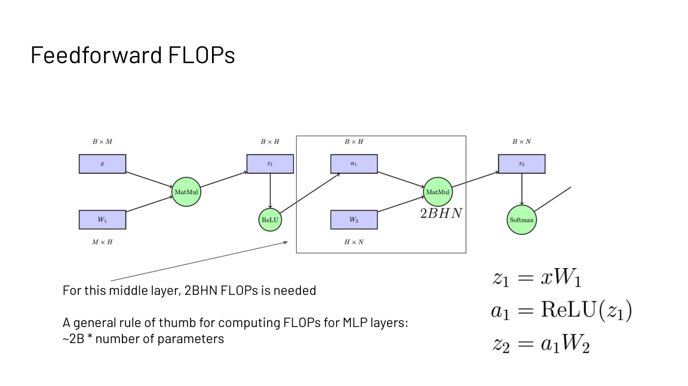

The backward pass needs two more matmuls per layer.
dL/dW2 = a1^T dL/dz2 costs 2HBN FLOPs, and dL/da1 = dL/dz2
W2^T costs 2BHN, plus the gradient through the nonlinearity.
Total: 4BHN, about twice the forward pass. And backprop must
cache a1, the layer input, to reuse it: the memory cost from
the toy, now quantified.

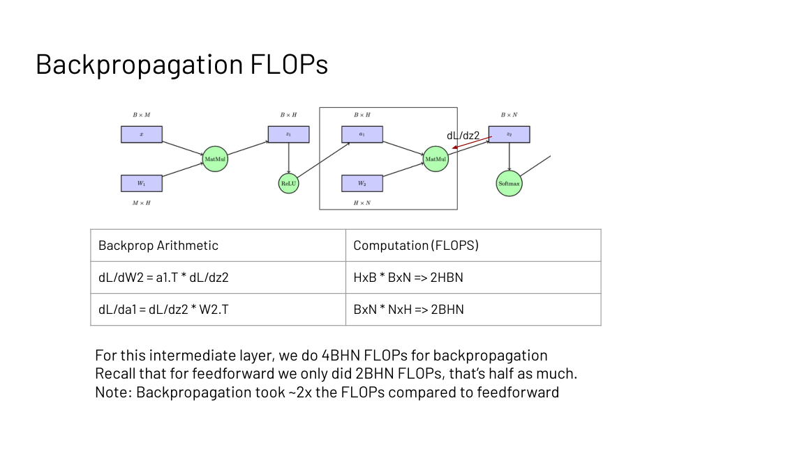

So one training step costs about 3x one forward pass: 1x
forward, 2x backward, plus the activation storage. Training
is expensive, and now you can say exactly how expensive per
layer.

### Subchapter: the 6N rule, worked on a 7B model

Forward is 2N FLOPs per token, backward is 4N, so one training
step costs 6N FLOPs per token, where N is the parameter count.
For a 7B model: 6 x 7e9 = 4.2e10 FLOPs per token. Train on 1
trillion tokens: 4.2e22 FLOPs total.

On one H100 (989 TFLOPS): 4.2e22 / 989e12 = 4.25e7 seconds, or
492 days. On 1,000 H100s at 50 percent utilization: about 1 day.
This is the 6ND estimate from the scaling-laws literature, and
it is how labs size training runs: parameters times tokens
times 6, divided by achieved throughput.

## Where inference breaks: the repeated work

Training is the upfront bill. Inference is the compounding
one, and it breaks in a different place. Generation is
**autoregressive**: predict one token, append it, repeat.
Each step attends over the whole sequence so far. Without
caching, the per-token attention FLOPs are: computing K and V
for the full sequence, 2 x (2Nd^2), computing Q for the
current token, 2d^2, the score multiply QK^T, 2Nd, and the
softmax-weighted mix with V, 2Nd. Every step recomputes the
keys and values of every earlier token.

### Subchapter: the wasted-FLOPs bill, worked

Take N = 1024, d = 2048, one layer. Without the cache, each
token recomputes K and V for the whole prefix: 2 x (2Nd^2) =
4 x 1024 x 2048^2 = 1.7e10 FLOPs per layer. Over 24 layers:
4.1e11 FLOPs per token, thrown away.

With the cache, each token computes K, Q, V for itself only:
3 x (2d^2) = 2.5e7 per layer, plus the 2Nd score and mix:
8.4e6. Per layer about 3.4e7. Over 24 layers about 8.1e8.
The ratio: 4.1e11 / 8.1e8 = 511. Caching cuts per-token
attention FLOPs by about 500x at this length, and the factor
grows with N.

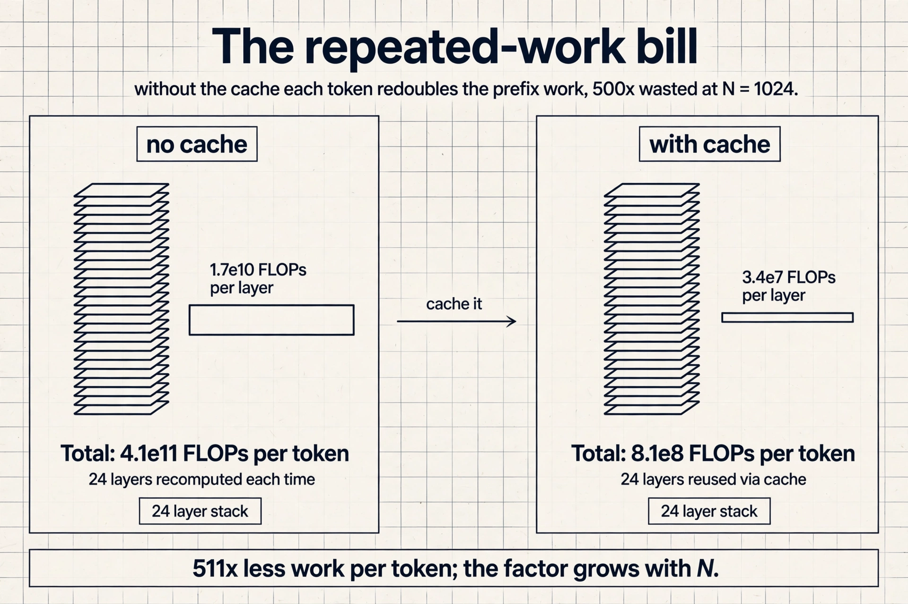

## The key question

What in that repeated work never changes? The keys and
values of earlier tokens depend only on the tokens before
them. Once computed, they are final. So why recompute them?
Cache them.

**KV caching** keeps the keys and values of all past tokens.
For each new token: compute K, Q, V for the current token
only, 3 x (2d^2), score against the cached keys, 2Nd, and mix
the cached values, 2Nd. The cache grows by one entry per
step, and the 2 x (2Nd^2) term disappears.

The stored object is the **KV block**: per token, per layer,
a key vector and a value vector, each of dimension dmodel
(the model's vector width).
In FP16 that is 2 x 2 x nlayers x dmodel bytes per token.

### Subchapter: the KV block, byte by byte

Read the formula as four choices. 2 for K and V: every token
stores both. 2 bytes: FP16 per number. nlayers: every layer
keeps its own. dmodel: the vector width. For the 7B example:
2 x 2 x 24 x 2048 = 196,608 bytes, about 192 KB per token.
Times 130k tokens: 25.6 GB, which is the 26 GB of headroom
from the capacity calculation. The formula closes the loop.

Now a 70B model (80 layers, dmodel 8192): 2 x 2 x 80 x 8192 =
2.6 MB per token. At 32K context that is 84 GB of cache,
against 140 GB of weights. The cache is no longer a rounding
error. It is the second weight matrix. This is why every
frontier model since Llama 2 uses grouped-query attention:
with 8 KV heads instead of 64, the bill falls 8x to 0.3 MB per
token.

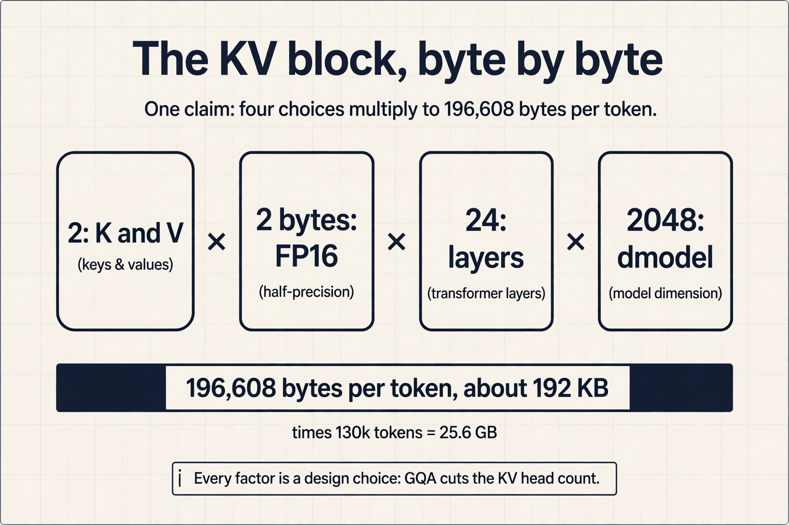


## When does caching win? Work the ratio

Caching trades memory traffic for saved compute. The lecture
works the tradeoff on an A100 (312e12 FLOPs/s compute, 1.5e12
bytes/s memory in the slides' numbers). Computing K and V for
one token costs (2 x nlayers x 2 x dmodel^2) / 312e12 seconds.
Reading them from HBM instead costs (2 x 2 x nlayers x
dmodel^2) / 1.5e12 seconds. The ratio Tmem / Tmath at dmodel
2048 is 312e12 / 1.5e12 = 208.

```
Tmath(1 token) = (2 x L x 2 x d^2) / 312e12
Tmem(1 token)  = (2 x 2 x L x d^2) / 1.5e12
Tmem / Tmath   = 312e12 / 1.5e12 = 208   (d = 2048)
```

Computing one token's KV costs the same time as the memory
traffic of 208 tokens. Below 208 you are memory bound. Above,
compute bound. And here the Lecture 3 rule returns: KV
caching makes sense when you are compute bound, because then
the extra memory traffic is the cheaper side. If you are not
compute bound, extra computation is free, so recomputation
can beat caching. The same ridge logic, applied to the cache.

### Subchapter: the 208 is the ridge in disguise

Look at the ratio again: Tmem / Tmath = 312e12 / 1.5e12 = 208.
The L and the d canceled out. What remains is peak FLOPs over
bandwidth: the ridge from Lecture 3, computed with the slides'
1.5 TB/s bandwidth instead of the 1,935 GB/s spec (which gives
161). Two bandwidth numbers, same conclusion: below the line
you are memory bound.

What moves the line: precision and bandwidth. In FP8 the bytes
halve while peak FLOPs double, so the ridge doubles: more
kernels land memory bound. On an H200 the extra bandwidth
lowers the ridge to 206: fewer kernels land memory bound.
The 208 is not a constant of nature. It is one chip, one
precision, one bandwidth number.

## How many tokens fit on one GPU

Worked from the slides. An A100 with 40 GB, a 7B-parameter
model with 24 layers and dmodel 2048, sequence length 1024.

1. Weights: 7e9 x 2 bytes = 14 GB.
2. Leftover for KV cache: 40 - 14 = 26 GB.
3. Per token: 2 x 2 x 24 x 2048 = 200k bytes = 0.0002 GB.
4. Capacity: 26 / 0.0002 = 130k tokens.
5. Batch size at 1024 tokens each: 130k / 1024 = 128.

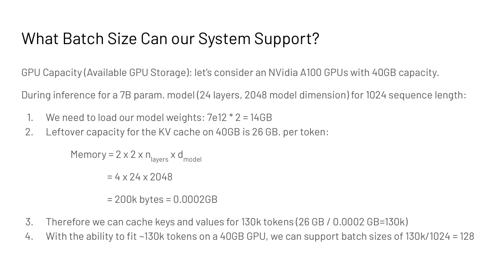

Memory, not compute, sets the serving batch size. This is the
calculation behind every serving-system capacity plan.

## Decoding is memory bound

Now the per-token cost without the cache story. Decoding with
GPT-2-XL (1.5B parameters, 48 layers) at batch 1: repeat 48
times per token, load about 24 MB for attention and about 41
MB for the MLP per layer. Over 3 GB of memory traffic per
token, to produce 2 bytes of output. Arithmetic intensity is
about 2 x batch: tiny.

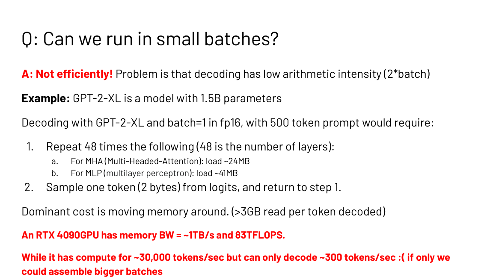

An RTX 4090 (about 1 TB/s memory bandwidth, 83 TFLOPS) has
the compute for roughly 30,000 tokens per second but decodes
only about 300. The bandwidth caps it. Small batches spend
all their time loading weights and process little data. Large
batches raise the FLOP count without re-reading weights,
moving toward the compute-bound regime. Batching is the
first serving optimization because it amortizes the weight
reads.

Three words the lecture separates carefully. **Latency** is
time per item: what interactive users feel. **Throughput** is
items per second: what batch pipelines maximize. **Bandwidth**
is the hardware property: the ceiling neither can exceed. Do
Do not trade one vocabulary for another in an interview.

### Subchapter: prefill and decode live on opposite sides

**Prefill** processes the whole prompt at once: N tokens
through every layer in parallel. The matmuls are N by d by d,
data reuse is high, AI sits far above the ridge. Compute bound.

**Decode** generates one token at a time. Each step streams
the full weights for a single vector-matrix multiply per
layer: AI is about 2 FLOPs per byte, far below the ridge.
Memory bound.

Same model, same chip, opposite regimes. This is why serving
systems split the two phases: prefill wants FLOPs, decode
wants bandwidth, and optimizing one phase can hurt the other.
Batching helps decode (more tokens per weight read) but does
little for prefill (already compute bound).

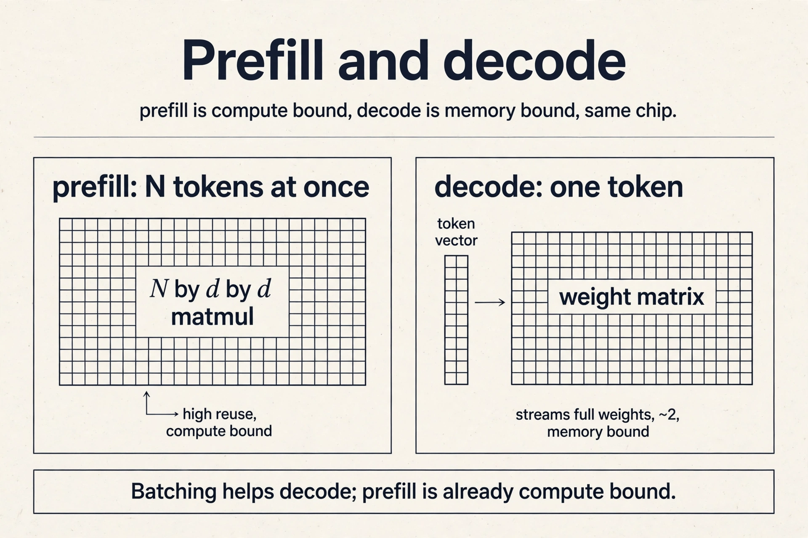

## The key question, again

Decoding is memory bound, so extra compute is nearly free.
The lecture asks the branch-prediction question: if compute
is free, why not guess the next few tokens and check them
all at once?

**Speculative decoding** does exactly that. Run the prompt
through the model once (prefill), saving the KV cache. Then
loop: draft K tokens cheaply, run the big model on prompt
plus drafts in one parallel batch, check agreement token by
token, accept the longest agreeing prefix plus one fresh
token. Right guesses are free tokens. Wrong guesses cost
almost nothing, because the verification batch was memory
bound anyway. Usually 10 to 100 guesses per batch, depending
on hardware.

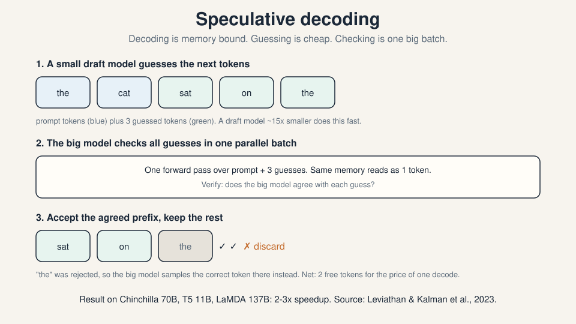

Results: 2 to 3x speedup on Chinchilla 70B, T5 11B, and LaMDA
137B (Leviathan and Kalman et al., 2023, and Chen et al., 2023).

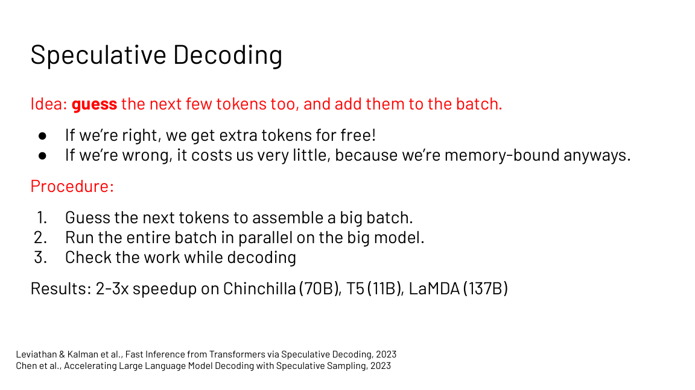

Three ways to draft. **Smaller draft model**: a small model
trained on the same data guesses the tokens. Transformers are
well calibrated, so agreement is good. The sweet spot is a
draft about 15x smaller than the main model. Costs: another
model to manage, imperfect agreement, extra memory. **Medusa
heads**: train extra heads that predict the token after next,
and the one after that, directly. Nearly free at inference,
easy to train and deploy. But it approximates a joint
distribution with a mean-field factorization, so guesses
degrade fast: good for about 2x, unlikely to reach 4x.
**Lossy optimization**: make the model itself fast and
reckless with INT4 quantization, skipped layers, skipped
heads, early exit. No extra model, highly correlated with
the full model, but complicated code. Probably
underexplored.

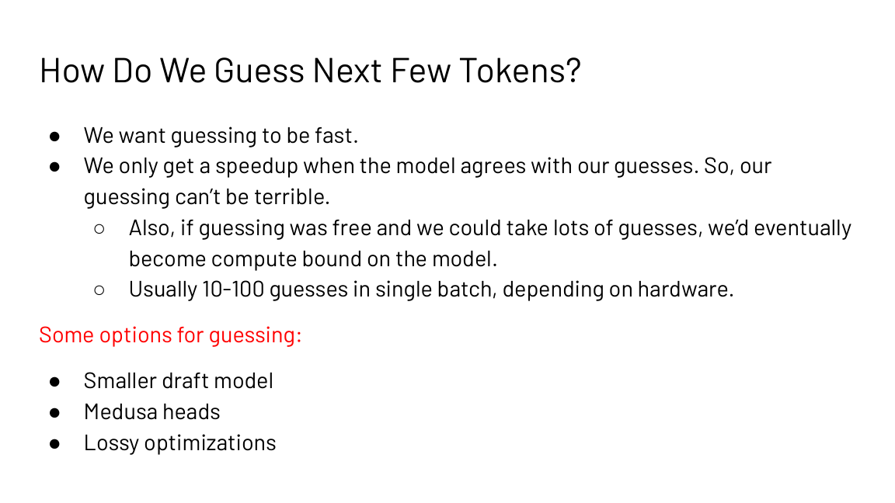

### Subchapter: the acceptance math

The speedup is decided by one number: the acceptance rate
alpha, the probability each drafted token survives
verification. With draft length K, the expected tokens per
target forward pass are (1 - alpha^(K+1)) / (1 - alpha).

Work it: K = 5, alpha = 0.8. 0.8^6 = 0.262. (1 - 0.262) /
0.2 = 3.69. Each verification batch yields about 3.7 tokens
for the price of one, before draft cost. If the draft costs
a third of a target step, the net is about 2.8x. This is the
2 to 3x in the results slide, derived, not quoted.

Now break it: alpha = 0.3, K = 5. (1 - 0.3^6) / 0.7 = 1.43.
Barely better than 1. A disagreeing draft is a tax, not a
trick. And if the batch is large, verification itself leaves
the memory-bound regime, and the "free" compute was never
free.

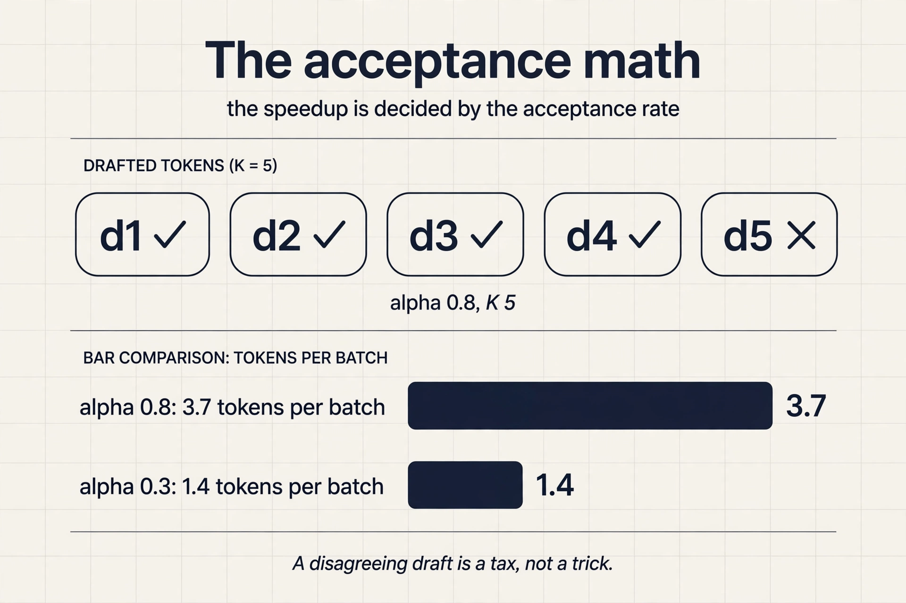

### Subchapter: EAGLE and MTP, the 2024-2026 drafts

The draft strategies above are the 2023 answers. Two newer
ones ship in production as of October 2026.

**EAGLE** drafts from the target's own hidden states instead
of a separate small model: a tiny autoregressive head reads
what the big model already computed. EAGLE-3 fuses features
from several layers and is merged into SGLang and vLLM. The
draft agrees more because it sees the target's thoughts.

**MTP** (multi-token prediction): DeepSeek-V3 trains extra
modules to predict 2 tokens ahead, and at inference those
modules draft for speculative decoding. The draft is part of
the model, not a second model. Public in the V3 paper
(December 2024).

Both move the draft inside the target. The agreement rate
rises because the guesser and the checker share a brain.

## What is used where: real serving stacks

The ridge logic of this chapter runs every production
serving stack. Facts as of October 2026.

| Stack | What it uses | Why |
|---|---|---|
| vLLM | PagedAttention, speculative decoding with draft models and EAGLE | public; the default open serving stack |
| SGLang | RadixAttention, EAGLE-3 speculative decoding | public; prefix caching plus drafting |
| TensorRT-LLM | KV cache reuse, speculative decoding | public; NVIDIA's inference compiler |
| DeepSeek (V3/V4) | MTP modules double as speculative drafts | public in the V3 paper |
| llama.cpp / Ollama | quantized serving, speculative decoding | public; local inference |

Every row is the same two decisions: where the KV cache lives,
and where the guesses come from. The stacks differ in how they
answer, not in what they ask.

## Mapping back: one rule, three applications

Lecture 3's ridge logic prices everything in this chapter:

| Decision | Ridge reading |
|---|---|
| Cache KV or recompute it | Cache when compute bound; recompute when memory bound |
| Batch bigger or serve faster | Batching amortizes weight reads: small batches are memory bound |
| Draft and verify | Decoding is memory bound, so verification compute is nearly free |

## The honest price

The KV cache costs HBM: at long contexts it is the memory
problem, not the solution. Speculative decoding's speedup is
capped by draft agreement: wrong guesses still cost a full
batch for one token. And guessing cannot be free forever:
with enough guesses the verification batch becomes compute
bound and the trick stops paying. Every win in this chapter
is a trade against the memory roof.

> [!QA]
> Q: How many FLOPs does training cost relative to one forward pass?
> A: About 3x per step: 1x for the forward pass plus 2x for the backward pass. The lecture's MLP accounting gives 2BHN forward and 4BHN backward per layer. The backward pass also forces you to store activations, which is the memory cost of training.
> Follow-up: Why does the backward pass need the activations at all?
> A: The chain rule multiplies upstream gradients by local derivatives evaluated at the forward values. For dL/dW2 = a1^T dL/dz2 you need a1, the layer input. Without storing it you must recompute it. Storage versus recomputation is the same tradeoff as KV caching below.

> [!QA]
> Q: A 7B model on a 40 GB A100 serves 1024-token sequences. What batch size fits?
> A: Weights take 14 GB, leaving 26 GB. Each token's KV cache costs 2 x 2 x 24 x 2048 = 200k bytes, so 26 GB holds about 130k tokens. At 1024 tokens per sequence that is batch size 128. The limit is HBM capacity, not FLOPs.
> Follow-up: What changes first if you double the sequence length?
> A: The KV cache per sequence doubles, so the batch size halves to 64. Longer contexts trade directly against concurrency on fixed memory.

> [!QA]
> Q: Explain speculative decoding and when it helps.
> A: A small draft model guesses the next few tokens. The big model verifies all guesses in one parallel forward pass, which costs about the same as one decode step because decoding is memory bound. Agreed tokens are accepted for free. The first disagreement is resampled. It helps exactly when decoding is memory bound with small batches: the verification batch soaks up idle compute. Reported speedups are 2 to 3x on 11B to 137B models.
> Follow-up: What limits the speedup?
> A: Draft agreement. If guesses are usually wrong, verification still costs a full batch and yields one token. Guessing also cannot be free: a bigger draft model agrees more but costs more per guess. The optimum the slides cite is a draft about 15x smaller than the main model.

> [!QA]
> Q: When does KV caching win, and when does recomputation win?
> A: KV caching wins when you are compute bound: the extra HBM traffic of reading the cache is the cheaper side. Recomputation wins when you are memory bound: then extra math is free and storing more state only adds traffic. The Tmem/Tmath ratio of 208 at dmodel 2048 on an A100 is the lecture's worked decision line.
> Follow-up: What is the difference between latency, throughput, and bandwidth?
> A: Latency is time per item, what interactive users feel. Throughput is items per second, what batch pipelines maximize. Bandwidth is the hardware's property: the ceiling neither can exceed. Small-batch decoding has terrible throughput at fixed latency because bandwidth caps it.

> [!QA]
> Q: Walk me through the KV cache byte math for a 70B model. When does the cache rival the weights?
> A: Take 80 layers and dmodel 8192. Per token: 2 (K and V) x 2 bytes (FP16) x 80 x 8192 = 2.6 MB. At 32K context: 2.6 MB x 32,768 = 84 GB of cache, against 140 GB of weights. The cache is 60 percent of the weights. At 128K context it is 336 GB: the cache dwarfs the model. This is why long-context serving is a cache problem first. With grouped-query attention at 8 KV heads instead of 64, the per-token bill falls 8x to 0.3 MB, and 32K context costs 10 GB.
> Follow-up: Why did the 7B example in the lecture not have this problem?
> A: Scale. 192 KB per token times 130k tokens is 26 GB: the cache fit the leftover HBM. The cache grows with layers times width times context, while weights are fixed. Longer contexts and bigger models flip which one binds.

> [!QA]
> Q: Why is prefill compute bound while decode is memory bound on the same chip?
> A: Prefill feeds N prompt tokens through every layer at once. The matmuls are N by d by d with high data reuse: arithmetic intensity sits far above the ridge. Decode generates one token per step, streaming the full weight matrices for a single vector-matrix multiply per layer: about 2 FLOPs per byte, far below the ridge. Same model, same chip, opposite regimes. That is why batching helps decode (more tokens per weight read) and barely helps prefill (already compute bound).
> Follow-up: If decode is memory bound, why does anyone run it at batch 1?
> A: Latency. Batch 1 gives the fastest time to the first token for one user. Throughput wants big batches. Interactive latency wants small ones. The serving tradeoff is latency versus throughput, priced in bandwidth.

> [!QA]
> Q: Applied design: your speculative decoding gives 1.1x instead of the promised 2-3x. Diagnose it.
> A: Check three suspects in order. First, the acceptance rate: log it. If alpha is 0.3 with K = 5, the math gives 1.4 tokens per batch before draft cost: the draft disagrees too often. Fix the draft (better draft model, EAGLE-style, or shorter K). Second, the batch size: if verification runs at large batch, it is no longer memory bound, so the "free" compute was never free. Third, the draft cost: a draft 15x smaller is the cited sweet spot. A heavier draft eats the winnings. The interview signal: quote the acceptance formula, then name which input broke.
> Follow-up: The acceptance rate is 0.85 but speedup is still 1.2x. What now?
> A: Then the draft is too expensive or the batch too large. At alpha 0.85 and K = 5 the math promises about 4.2 tokens per batch. If reality says 1.2x, the verification batch is compute bound (batch too big) or the draft costs nearly a full target step. Profile the draft-to-target cost ratio next.

## Recap: the whole lesson on one screen

The story in eight steps. Each step answers the one before it.

1. **One training step costs 3x a forward pass.** Backprop
   on the toy graph: forward 60, gradients 30/12/20 by the
   chain rule. Reuse intermediates. Store activations.
2. **Forward is 2 x batch x params.** 2BHN per MLP layer.
   Backward is 4BHN: two more matmuls, twice the forward
   FLOPs, plus activation storage.
3. **Autoregressive decoding repeats work.** Each step
   recomputes K and V for the whole prefix: 2 x (2Nd^2)
   per token, wasted.
4. **Past keys and values never change.** Cache them: the
   KV block, 2 x 2 x nlayers x dmodel bytes per token in
   FP16. Per token the cost falls to 3 x (2d^2) plus the
   2Nd score and mix.
5. **The 208 ratio decides.** On an A100, computing one
   token's KV costs the memory time of 208 tokens. Cache
   when compute bound. Recompute when memory bound.
6. **Memory sets the batch size.** 7B on 40 GB: 14 GB
   weights, 130k cacheable tokens, batch 128 at length
   1024. HBM capacity is the serving limit.
7. **Decoding is memory bound.** Over 3 GB read per
   GPT-2-XL token. The RTX 4090 could compute 30,000
   tokens/s but decodes 300. Batching amortizes the reads.
8. **Guess when compute is free.** Speculative decoding:
   draft K tokens, verify in one batch, accept the agreed
   prefix. 2 to 3x faster, capped by draft agreement.

## Official sources and further reading

**Official:**
- Analyzing the Performance of Transformers slide deck
  (Fall 2023 headers).
- Carol Chen, "Transformer Inference Arithmetic" (2022):
  the Tmem/Tmath 208 derivation.

**Further reading:**
- Leviathan, Kalman et al., "Fast Inference from
  Transformers via Speculative Decoding" (2023).
- Chen et al., "Accelerating Large Language Model Decoding
  with Speculative Sampling" (2023).
- FasterDecoding/Medusa (GitHub): the Medusa heads
  implementation.

**Caveats from these sources.** The A100 memory bandwidth
in the KV-caching derivation is 1.5e12 bytes/s in the
slides (1.5 TB/s) versus 1,935 GB/s in Lecture 3's spec
slide. Both orderings give the same conclusion (memory
bound at small batch). The 208 ratio assumes dmodel 2048.
The 130k-token capacity ignores attention workspace and
fragmentation. Medusa's 2x cap and the 15x draft size are
empirical rules from the slides, not theorems.

## Go deeper

<div style="position:relative;padding-bottom:56.25%;height:0;overflow:hidden;max-width:100%;margin:16px 0;">
<iframe style="position:absolute;top:0;left:0;width:100%;height:100%;" src="https://www.youtube-nocookie.com/embed/emZxqRScfc0" title="Build KV Cache Layer From Scratch" frameborder="0" allow="accelerometer; autoplay; clipboard-write; encrypted-media; gyroscope; picture-in-picture" allowfullscreen></iframe>
</div>

- Build KV Cache Layer From Scratch (20x speedup, memory math): https://www.youtube.com/watch?v=emZxqRScfc0
- KV Cache: The Invisible Trick Behind Every LLM: https://www.youtube.com/watch?v=tGp6Ns9GtSU
- Speculative Decoding: How a Dumb Model Makes LLMs 3x Faster: https://www.youtube.com/watch?v=YFwsSaWerDY
- Speculative decoding explained: draft models, acceptance rate: https://www.youtube.com/watch?v=jAvqmEHvwUU
- Fast Inference from Transformers via Speculative Decoding (Leviathan et al.): https://arxiv.org/abs/2211.17192
- Accelerating LLM Decoding with Speculative Sampling (Chen et al.): https://arxiv.org/abs/2302.01318
- Transformer Inference Arithmetic (Carol Chen): https://blog.eleuther.ai/transformer-math/

## Connections to the other courses

- **CS336 L10:** KV caching and inference systems in full.
  the KV cache figure is shared.
- **CS336 L02:** FLOP counting and the backward-pass 2x
  rule, from scratch.
- **CS229S L03:** arithmetic intensity and the ridge. The
  208 ratio is that machinery.
- **CS229S L06:** FlashAttention attacks the same
  memory-bound attention.
- **CS229S L07:** quantization shrinks the weights that
  decoding keeps re-reading.
