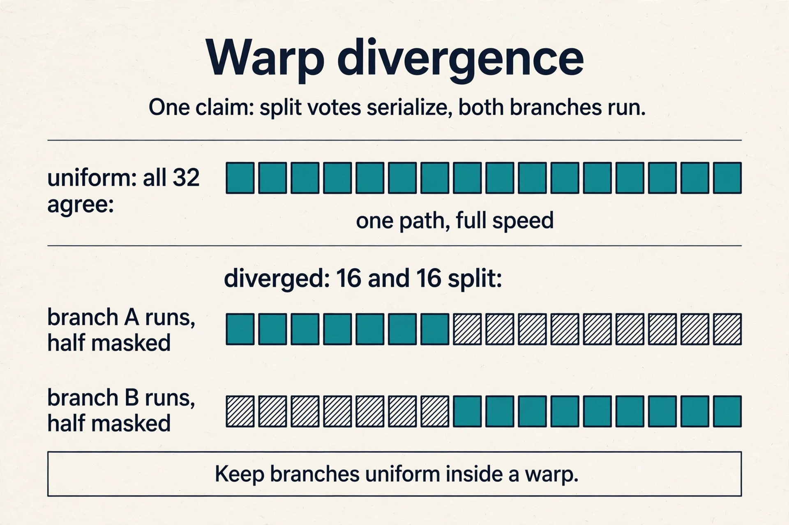
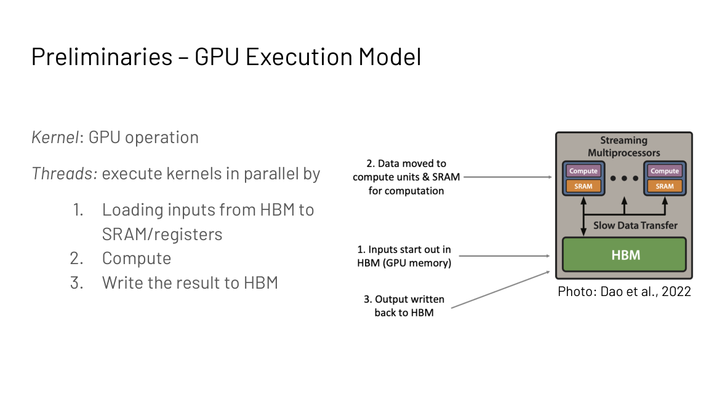
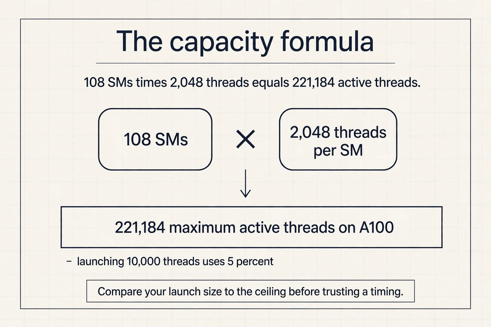
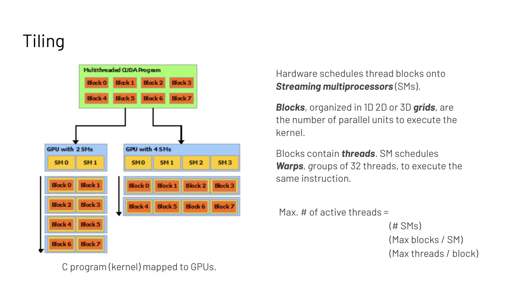
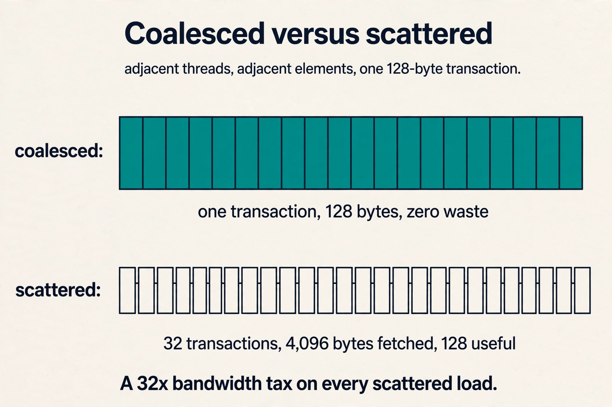
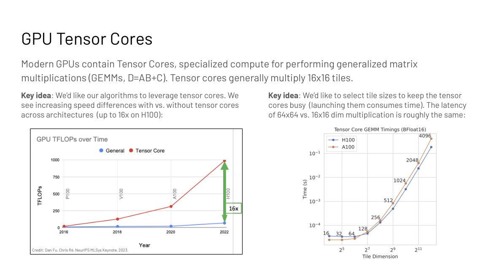
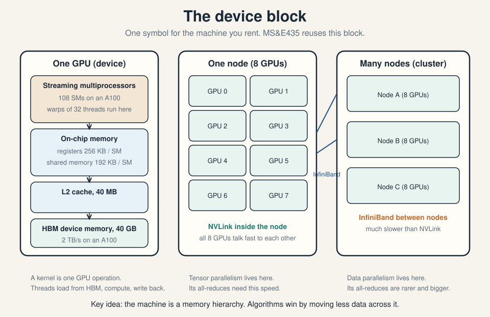
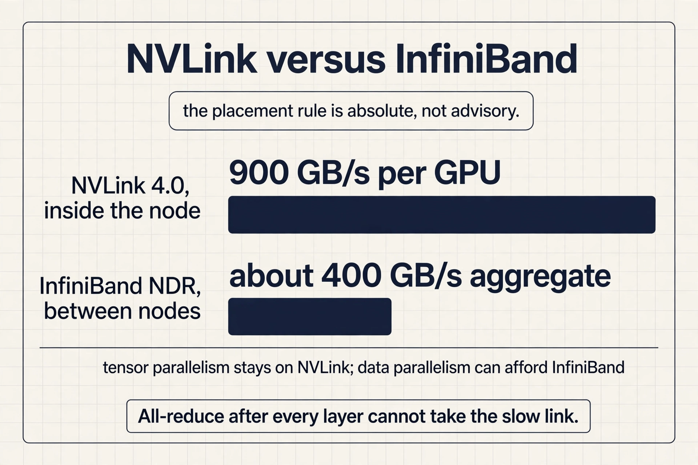

## The question: where does the code actually run?

Lecture 3 gave the diagnosis: memory bound or compute bound,
and six principles to fix it. But fusion, tiling, and caching
are not abstract. They are decisions about a real machine.
This lecture builds that machine from zero, so every
principle gets an address.

Start with the smallest unit of GPU work. A **kernel** is one
GPU operation. Threads execute it in parallel in three steps:
load inputs from HBM into fast on-chip memory (SRAM) and registers, compute, write
the result back to HBM. That is the entire execution model in
one sentence, and the Lecture 3 vocabulary now has a home:
**memory bound** means the threads spend their time on the
load and write steps relative to the compute step.
**Compute bound** means they spend it on arithmetic.

## How a kernel runs

A kernel launches a **grid** of **blocks**. The hardware
enumerates the blocks and distributes them to streaming
multiprocessors (SMs) with free execution capacity. Multiple
blocks can run concurrently on one SM. The threads of a block
also execute concurrently on that SM. Scale the machine from
2 SMs to 4 and the same grid simply spreads wider: the
programming model does not change.

Inside the SM, threads execute in groups of 32 called
**warps** under **SIMT**: single instruction, multiple
threads. One instruction unit drives many processors in
lockstep, each on different data. This is why GPUs have
thousands of threads but feel like one program: the warp is
the unit of execution.

### Subchapter: what SIMT forbids

One instruction drives 32 threads. If all 32 take the same
branch, the warp runs at full speed. If 16 take branch A and
16 take branch B, the warp runs branch A with half its lanes
masked off, then branch B with the other half masked off.
Both paths cost time; only one lane's work is real at any
moment. This is **warp divergence**: the 2x penalty for a
split vote.

The rule: keep branches uniform inside a warp. Sort work so
threads in one warp decide the same way. Attention masks are
fine; data-dependent early exits per token are not.





The capacity formula follows. Maximum active threads = (number
of SMs) x (max blocks per SM) x (max threads per block).
Expose at least this much work or SMs sit idle. This is the
parallelization principle from Lecture 3, stated in hardware
terms.

### Subchapter: the capacity formula, worked

On an A100: 108 SMs, up to 2,048 resident threads per SM.
Maximum active threads = 108 x 2,048 = 221,184. A kernel that
launches 10,000 threads uses 5 percent of the machine; the
other 95 percent of the SMs sit idle while one finishes.

The number to remember is not 221,184. It is the habit:
compare your launch size to the machine's resident-thread
ceiling before you trust any timing. A kernel that looks
compute bound at 10 percent occupancy is lying to you.



```ascii
grid    : [block 0][block 1][block 2]...
             |         |         |
SMs     :  SM A      SM B      SM C      <- blocks land where free
threads :  warp = 32 threads, one instruction, lockstep
```

## The three memories a thread sees

A thread can read from three places, and the choice is the
whole game of GPU programming.

**Global memory.** Visible to all threads. Slow: it is HBM.

**Shared memory.** Visible to threads of the same block. One
thread can pull in data that many threads need, avoiding
duplicate reads.

**Registers.** Private to each thread. Fastest.

| Memory | Visible to | Speed | Use for |
|---|---|---|---|
| Global (HBM) | All threads | Slow | Model weights, large tensors |
| Shared | One block | Fast | Tiles shared by block threads |
| Registers | One thread | Fastest | Per-thread accumulators |

Two rules make loading efficient. **Coalesced access:** the
hardware fetches memory in contiguous chunks, so threads in
the same warp must touch adjacent elements, or most of each
fetched chunk is wasted and effective bandwidth collapses.
**Tiling:** partition the data into subsets that fit in
shared memory, then compute on each tile independently.

The slides' tiling example makes it concrete. Four threads
multiply matrices. Their accessed elements overlap. If the
threads load independently, the overlapping elements are
fetched four times. If they collaborate through shared
memory, one load serves all four: half the memory accesses
disappear. Tiling is Lecture 3's matmul tiling, now stated as
a programming pattern: share inputs across outputs on-chip.



### Subchapter: the coalescing math

The hardware moves memory in 128-byte transactions. 32
threads in a warp each wanting 4 bytes (one FP32) touch 128
bytes total: exactly one transaction, zero waste. That is
coalesced access.

Now scatter them: each thread touches a 4-byte element in a
different 128-byte segment. The hardware issues 32
transactions of 128 bytes each: 4,096 bytes fetched for 128
useful. A 32x bandwidth tax, paid on every load. This is why
"adjacent threads touch adjacent elements" is the first rule
of GPU programming, and why a transpose of the data layout
can fix a kernel that profiling says is memory bound.



## The key question

The GPU also carries specialized math units. A general kernel
treats every operation the same, but the silicon does not.
How do we feed the fast path? The answer is tensor cores.

**Tensor cores** are specialized units for generalized matrix
multiplication, D = AB + C. They natively multiply 16 by 16
tiles. The speed gap with versus without tensor cores reaches
16x on H100 (Fu and Re, MLSys keynote 2023). Two consequences
follow.

First, express algorithms as large matmuls so tensor cores
can take them. An algorithm written as small elementwise ops
never touches the fast path.

Second, choose tile sizes that keep tensor cores busy.
Launching them costs time, and the latency of a 64 by 64
multiply is roughly the same as a 16 by 16 one. Small tiles
pay the launch cost for little work. Large tiles amortize
it. This is the hardware-specific optimization principle from
Lecture 3, and it explains a FlashAttention design choice in
the next lecture: tile sizes are chosen for the hardware's
fast path, not for the algorithm's elegance.



### Subchapter: the 16x gap, worked

On H100, FP16 tensor throughput is 989 TFLOPS; the plain CUDA
cores do about 67 TFLOPS of FP32. The ratio is 14.8x, the
slides' "up to 16x". A kernel written as elementwise ops sees
67 TFLOPS of a 989-TFLOPS chip: 7 percent of the machine.

The gap is not free. Tensor cores need 16 by 16 aligned
tiles and large batches to stay fed; small tiles pay the
launch cost for little work. The hardware-specific principle
is a budget: express the work as big matmuls, or accept that
you bought 7 percent of your GPU.

## The device block

The machine is now fully specified, and the lecture
consolidates it into one symbol: the **device block**, three
shells of memory hierarchy.

**One GPU (device).** Streaming multiprocessors do the math:
108 SMs on an A100. Next to them the four pools from Lecture
3: registers (256 KB per SM), shared memory (192 KB per SM),
L2 cache (40 MB), HBM device memory (40 GB at about 2 TB/s).
A kernel loads from HBM, computes on-chip, writes back.

**One node.** Eight GPUs connected by NVLink, a very high
bandwidth link inside the server. Communication within the
node is fast.

**One cluster.** Many nodes connected by InfiniBand, which is
much slower than NVLink. Communication across nodes is the
expensive move.



### Subchapter: NVLink versus InfiniBand, in numbers

H100 NVLink 4.0 gives about 900 GB/s bidirectional per GPU.
Eight GPUs in a node share this fabric: all-reduce across
the node moves gigabytes in milliseconds. InfiniBand NDR
gives 400 Gb/s, or 50 GB/s, per port; a node with 8 rails
reaches about 400 GB/s aggregate, and that bandwidth is
shared, contended, and higher latency.

Roughly: NVLink is 2x the per-node InfiniBand bandwidth and
an order of magnitude lower latency. This is why the
placement rule is absolute, not advisory. Tensor parallelism
all-reduces after every layer: it cannot afford the
inter-node trip, so it stays on NVLink. Data parallelism
synchronizes once per step: it can afford InfiniBand.



The placement rule follows from Lecture 1: intra-node links
are orders of magnitude faster than inter-node networking.
Communication-heavy patterns live inside the node. Rarer,
larger patterns span the cluster. Lecture 10 derives the
mapping: tensor parallelism stays on NVLink, data
parallelism spans InfiniBand.

## Caching versus recompute in the backward pass

One last principle gets its hardware address. Training's
backward pass needs intermediate values from the forward
pass, which adds reads and writes. If the workload is memory
bound and the recomputation is cheap relative to memory, skip
storing the intermediates and recompute them during the
backward pass.

| Regime | Forward intermediates | Why |
|---|---|---|
| Compute bound | Store them | Math is the limit; traffic is affordable |
| Memory bound | Recompute them | Traffic is the limit; math is free |

This is the Lecture 3 rule, applied to training.
FlashAttention's backward pass (next lecture) recomputes the
attention matrix from the stored softmax normalization
vectors instead of keeping the full N by N matrix: more
FLOPs, less HBM traffic, a winning trade under a memory
roof.

### Subchapter: the backward trade, quantified

At N = 8192, the N by N attention matrix in FP16 is 8192^2 x
2 bytes = 134 MB per head per layer. Storing it for the
backward pass means writing 134 MB and reading it back: 268
MB of HBM traffic per head. The softmax normalization
vectors are O(N): 8192 x 2 bytes = 16 KB. Recomputing the
matrix from 16 KB costs one extra forward pass of attention
math but deletes 268 MB of traffic. Under a memory roof,
that trade wins by a factor of thousands.

## What is used where: real hardware and real stacks

The execution model is NVIDIA CUDA, because the frontier
models train on NVIDIA GPUs as of October 2026. The same
ideas recur everywhere else with different names.

| Hardware or stack | What it uses | Why it matters |
|---|---|---|
| NVIDIA H100/B200 | CUDA warps of 32, tensor cores, NVLink | the machine this lecture describes |
| AMD MI300X | CDNA wavefronts of 64, Infinity Fabric | warp is 64 wide; same SIMT idea |
| Groq LPU | deterministic dataflow, no warps | a different execution model entirely |
| Cerebras WSE | wafer-scale, on-chip SRAM | memory hierarchy flattened |
| Triton | tile-based kernels in Python | vLLM, Inductor, and FlashAttention-3 ship Triton kernels |
| ThunderKittens | CUDA templates for AI kernels | the FlashAttention-3 implementation |

Frontier training (GPT, Gemini, Llama, DeepSeek) runs on
NVIDIA GPUs with CUDA, NCCL collectives, and kernels written
in CUDA, Triton, or CUTLASS. Inference stacks add their own:
vLLM and SGLang ship hand-tuned kernels for attention and
quantization. The warp size and the link speeds change across
vendors; the hierarchy (fast small memories near the math,
slow big memory far away) does not.

## Mapping back: every principle has an address

| Lecture 3 principle | Where it lives on the device block |
|---|---|
| Fusion | One kernel: load once, compute f then g, write once |
| Parallelization | Enough blocks to fill all 108 SMs |
| Tiling | Shared-memory tiles; threads collaborate |
| Caching vs recompute | HBM traffic versus on-chip math |
| Pipelining | Overlap the load, compute, and write steps |
| Hardware-specific | 16 by 16 tensor-core tiles, big batches |

## The honest price

The details here are NVIDIA CUDA specifics: warps of 32,
coalescing rules, the shared-memory programming model. Other
accelerators differ in detail but not in spirit: fast small
memories near the math, slow big memory far away, fast links
inside the box and slow links between boxes. The numbers are
A100/H100 generation (108 SMs, 40 GB HBM, up to 16x
tensor-core speedup). Newer GPUs differ. The 8-GPUs-per-node
layout is the standard NVIDIA DGX/HGX server configuration the course
assumes.

> [!QA]
> Q: What is the device block?
> A: The three-shell symbol for the machine: one GPU (108 SMs, registers, shared memory, L2, 40 GB HBM), one node (8 GPUs on NVLink), and one cluster (nodes on InfiniBand). A kernel is one GPU operation that loads from HBM, computes on-chip, and writes back. The symbol is defined in this lecture and reused by MS&E435.
> Follow-up: Why does the hierarchy decide the parallelism strategy?
> A: Because communication cost follows the hierarchy. Tensor parallelism all-reduces after every attention and MLP block, so it needs NVLink speed and stays inside one node. Data parallelism synchronizes once per step, so it can afford InfiniBand across nodes.

> [!QA]
> Q: What is tiling and why does it cut memory traffic?
> A: Tiling partitions data into subsets that fit in shared memory, then computes on each tile independently. Threads in a block collaborate: one thread's load serves many threads' compute, instead of every thread loading its own copy. The slides' matmul example saves half the memory accesses this way.
> Follow-up: What breaks if threads in a warp access scattered addresses?
> A: Coalescing breaks. The hardware fetches memory in contiguous chunks, so scattered accesses waste most of each fetched chunk. Adjacent threads must touch adjacent elements or effective bandwidth collapses.

> [!QA]
> Q: Why do tensor cores want large tiles?
> A: They natively multiply 16 by 16 tiles, and launching them costs time: a 64 by 64 multiply has roughly the same latency as a 16 by 16 one. Large tiles amortize the fixed launch cost over more work. Small tiles pay the launch and leave the fast path underused.
> Follow-up: What should an algorithm designer do about this?
express the work as large matrix multiplications so tensor cores can take it, and size tiles for the hardware's fast path rather than the algorithm's elegance. This is the hardware-specific optimization principle from Lecture 3.

> [!QA]
> Q: Walk me through a kernel launch, from the CPU call to threads running.
> A: The CPU launches a kernel with a grid size: say 1,000 blocks of 256 threads. The hardware enumerates the 1,000 blocks and assigns them to SMs with free capacity; on an A100 with 108 SMs, each SM takes several blocks. Inside one SM, the 256 threads of a block are grouped into 8 warps of 32. Each warp executes in lockstep under SIMT: one instruction, 32 data items. Threads load from HBM into registers and shared memory, compute, and write back. When a block finishes, its SM picks up the next waiting block. The program never names an SM; the hardware schedules.
> Follow-up: What happens if you launch only 4 blocks of 256 threads?
> A: Four SMs get one block each; the other 104 SMs sit idle. You used 1,024 threads against a 221,184-thread ceiling. Throughput is roughly 100x below the machine's capacity, no matter how good the kernel code is.

> [!QA]
> Q: 32 threads in a warp each read one FP32 from scattered addresses. How much bandwidth is wasted?
> A: Each thread's 4-byte read falls in a different 128-byte segment, so the hardware issues 32 transactions of 128 bytes: 4,096 bytes fetched for 128 useful. 97 percent is waste. Rearrange the data so adjacent threads touch adjacent elements and the same 32 reads become one 128-byte transaction: zero waste. This is the coalescing rule as arithmetic.
> Follow-up: Does the same rule apply to writes?
> A: Yes. Stores go through the same transaction mechanism. Scattered writes waste the same factor, and partially written segments force read-modify-write cycles. Coalesce both directions.

> [!QA]
> Q: What is warp divergence, and what does it cost?
> A: Under SIMT one instruction drives 32 threads. If 16 threads take branch A and 16 take branch B, the warp executes A with half its lanes masked, then B with the other half masked. Both paths cost full time; each lane is productive only half the time. Cost: up to 2x for a two-way split, more for deeper nesting. Fix it by keeping branches uniform inside a warp: sort or bucket work so each warp votes the same way.
> Follow-up: Why are attention masks fine but per-token early exits not?
> A: An attention mask is the same branch decision for every thread in the warp: no divergence. A per-token early exit makes each thread decide differently from its data: the warp splits and pays both paths. Uniform control flow is free; data-dependent control flow is not.

> [!QA]
> Q: Applied design: your kernel reaches 10 percent of peak memory bandwidth. Diagnose it.
> A: Check three suspects in order. First, coalescing: profile the achieved versus requested bytes; scattered access shows up as a large gap. Second, occupancy: count launched threads against the 221,184-thread ceiling on A100; too few threads starves the memory system. Third, the access pattern: strided or unaligned reads waste transactions even when coalesced in spirit. The interview signal: quote the 128-byte transaction and the capacity formula, then name which one the profiler implicates.
> Follow-up: Coalescing is clean and occupancy is full, but bandwidth is still 30 percent. What next?
> A: Then the pattern is the problem: bank conflicts in shared memory, or reads too small to fill transactions. Widen the per-thread access (vectorized loads of 4 or 8 elements) and check shared-memory bank conflicts with the profiler's counters.

## Recap: the whole lesson on one screen

The story in eight steps. Each step answers the one before it.

1. **A kernel loads, computes, writes.** One GPU operation:
   threads load from HBM to SRAM and registers, compute,
   write back. Memory bound or compute bound is now a fact
   about these three steps.
2. **Blocks map to SMs.** Grids of blocks land on SMs with
   free capacity. Multiple blocks per SM; threads of a
   block run concurrently on one SM.
3. **Warps execute in lockstep.** 32 threads, one
   instruction, many data: SIMT. Expose enough threads or
   SMs idle. Max threads = SMs x blocks x threads.
4. **Threads see three memories.** Global (all threads,
   slow), shared (one block, collaborative), registers (one
   thread, fastest). Place data by sharing pattern.
5. **Coalesce, then tile.** Adjacent threads touch adjacent
   elements. Partition into shared-memory tiles; threads
   collaborate on overlapping inputs. Half the loads
   disappear.
6. **Tensor cores want big tiles.** 16 by 16 native GEMM
   tiles, up to 16x faster on H100. Launch cost is flat, so
   large tiles amortize it. Express work as big matmuls.
7. **The device block has three shells.** One GPU (SMs and
   four pools), one node (8 GPUs, NVLink), one cluster
   (nodes, InfiniBand). Defined here, reused by MS&E435.
8. **Recompute when memory bound.** Skip storing forward
   intermediates; recompute them backward. More FLOPs,
   less HBM traffic: the winning trade under a memory
   roof.

## Official sources and further reading

**Official:**
- Hardware Aware Algorithm Design slide deck, GPU
  execution model sections (Fall 2023 headers).

**Further reading:**
- NVIDIA CUDA C++ Programming Guide: the authoritative
  execution model.
- Dan Fu and Chris Re, NeurIPS MLSys keynote 2023: tensor
  core utilization.

**Caveats from these sources.** SM counts, memory sizes,
and the 16x tensor-core figure are A100/H100 generation
numbers from the slides; newer GPUs differ. The
8-GPUs-per-node layout is the standard DGX/HGX
configuration the course assumes. Coalescing and tiling
rules are NVIDIA CUDA specifics; other accelerators differ
in detail but not in spirit.

## Go deeper

<div style="position:relative;padding-bottom:56.25%;height:0;overflow:hidden;max-width:100%;margin:16px 0;">
<iframe style="position:absolute;top:0;left:0;width:100%;height:100%;" src="https://www.youtube-nocookie.com/embed/LSy37D8-8KA" title="CUDA Explained" frameborder="0" allow="accelerometer; autoplay; clipboard-write; encrypted-media; gyroscope; picture-in-picture" allowfullscreen></iframe>
</div>

- CUDA Explained - Why are GPUs so powerful: https://www.youtube.com/watch?v=LSy37D8-8KA
- CUDA Crash Course: warps, blocks, and memory: https://www.youtube.com/watch?v=XAX_z5zZJ7s
- GPU MODE: the lecture series that teaches GPU programming from zero: https://www.youtube.com/@GPUMODE
- NVIDIA CUDA C++ Programming Guide: https://docs.nvidia.com/cuda/cuda-c-programming-guide/
- OpenAI Triton: tile-based GPU kernels in Python: https://triton-lang.org/

## Connections to the other courses

- **MS&E435:** reuses the device block defined here. Do not
  redefine it; link here.
- **CS336 L06:** kernel programming: this lecture's
  patterns in code.
- **CS336 L07:** interconnects and collectives in full.
- **CS229S L03:** the six principles; this lecture is their
  hardware substrate.
- **CS229S L06:** FlashAttention uses every pattern on this
  page.
