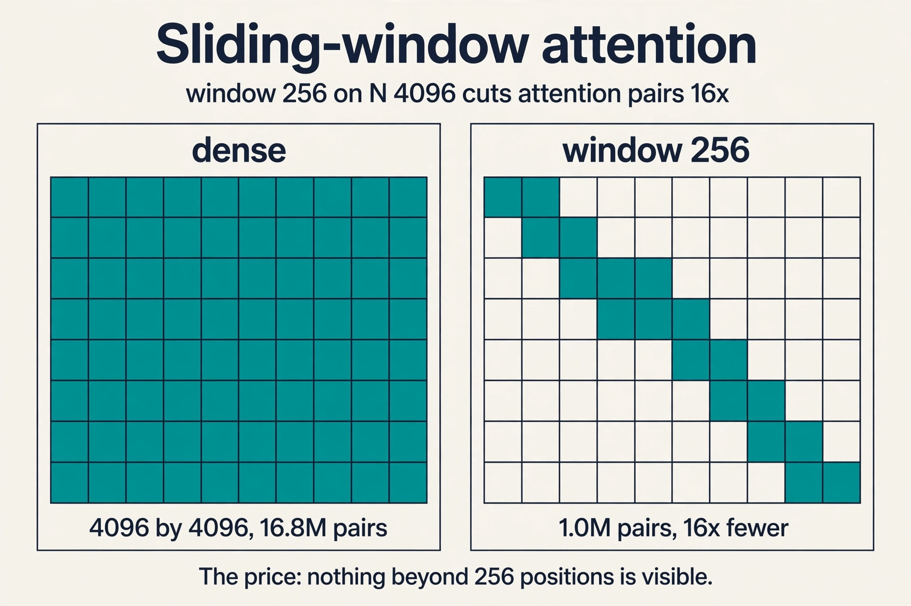
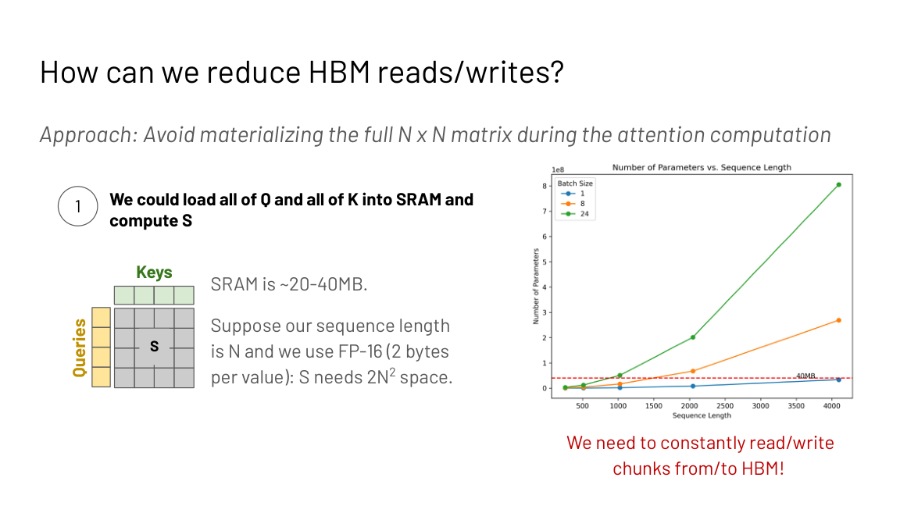
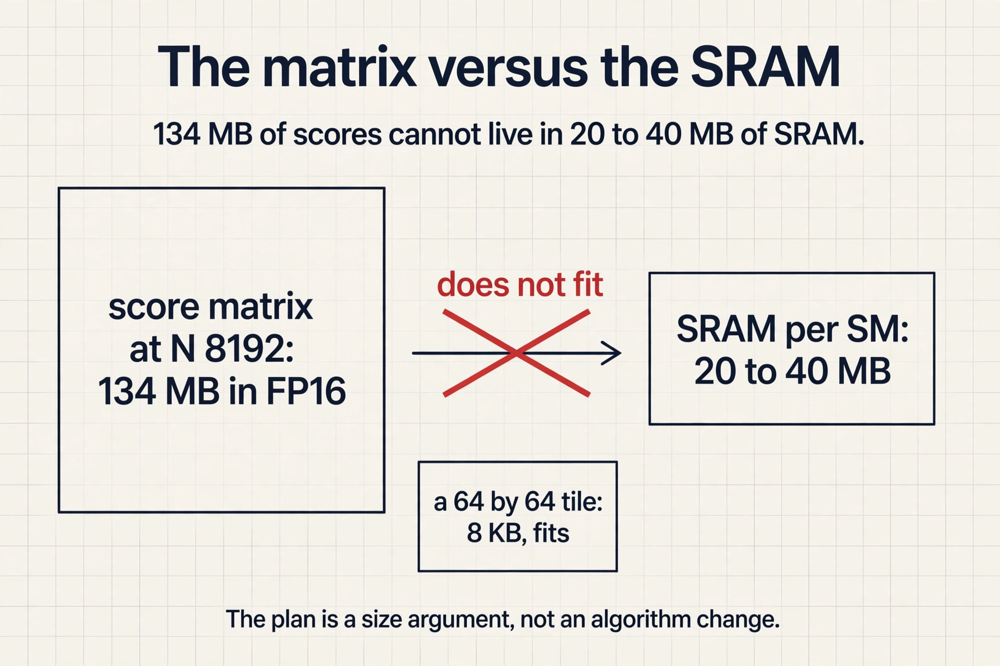
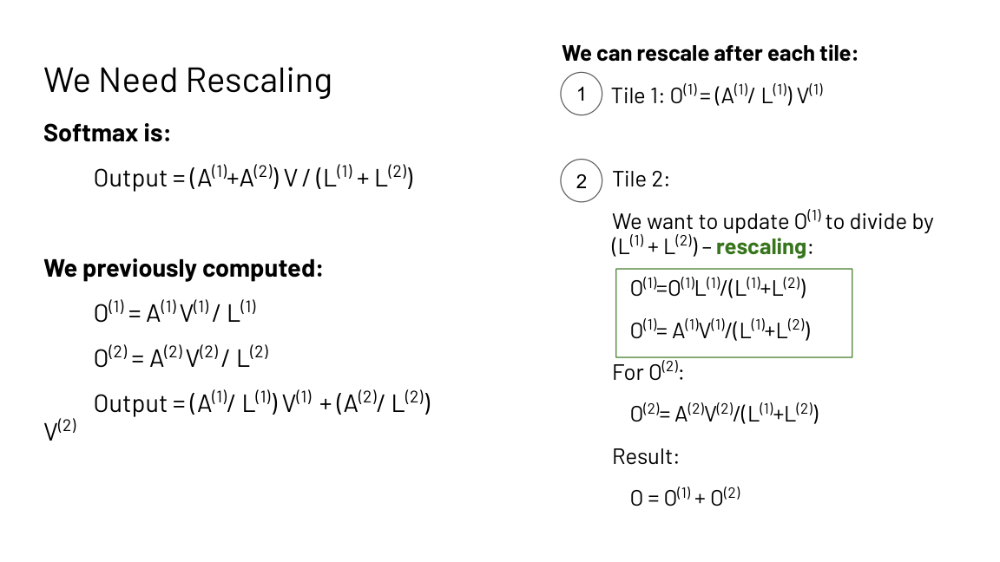
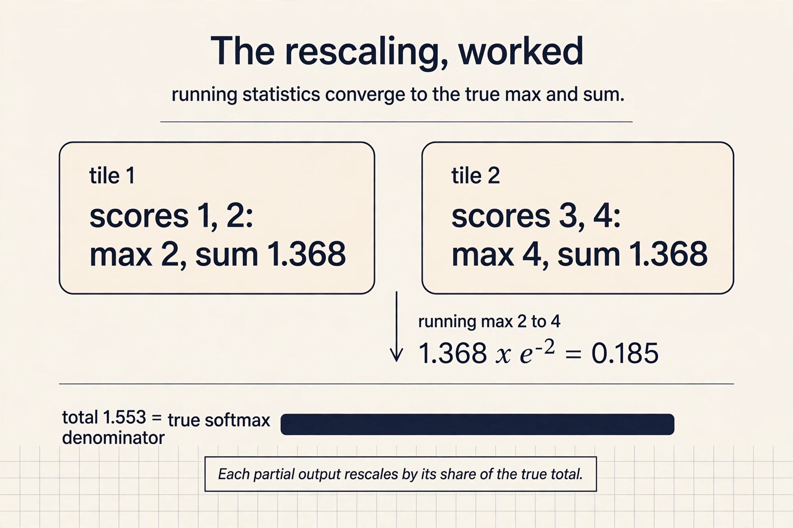
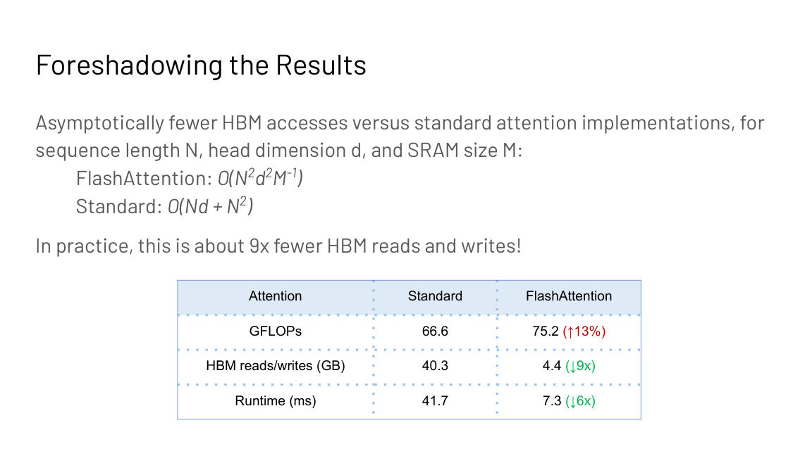
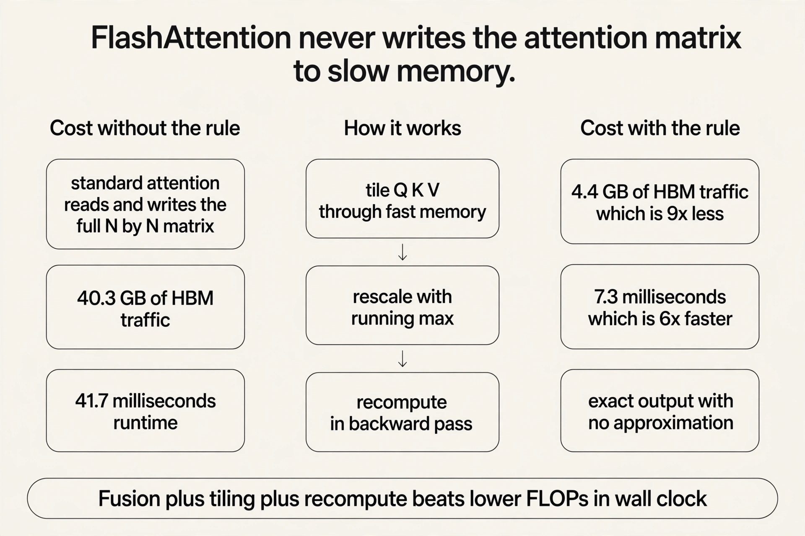
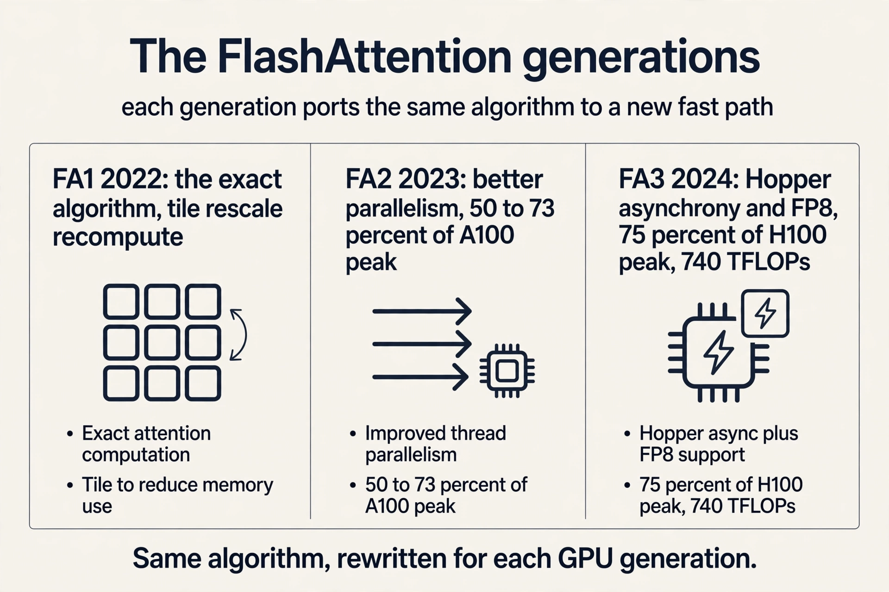

## The problem: attention does not scale

Q, K, V are N by D. The score matrix S = QK^T is N by N.
Attention memory and compute scale as O(N squared) in
sequence length in standard implementations. The lecture's
motivation is concrete: hundreds of thousands of words in a
math textbook, thousands of timesteps per second of raw
audio, 3.2 billion nucleotide pairs in the human genome with
interactions spanning 100k+ positions. Long sequences are
not a luxury. They are the data.

## First attempt: change the algorithm

Before FlashAttention, the field modified the algorithm to
dodge the quadratic. The survey (Tay et al., 2022) groups the
attempts into three families, each with a mechanism and a
price.

**Sparse attention** computes attention over a subset of
token pairs. Sparse Transformers (Child et al., 2019) use
local windows: O(n sqrt(n)) memory and compute empirically.
BigBird (Zaheer et al., 2021) gets O(n) inner products by
combining windowed local attention (language has locality of
reference) with global tokens that attend to everything and
random attention that shrinks the average distance between
nodes. The fixed patterns are sliding window, dilated,
global, blocked, and random.

**Low-rank attention** projects the matrices to smaller
dimensions. Linformer reduces the N by N score matrix toward
k by k. The price is causality: the projection mixes future
into past, which is hard to maintain for autoregressive
modeling.

**Kernel attention** replaces the similarity without the
full N^2 d cost and without the softmax. The linear
transformer (Katharopoulos et al., 2020) writes sim(qi, kj)
as f(qi) f(kj) with an elementwise feature map like 1 +
ELU. Without the exp, the associative property of matrix
multiplication regroups the computation into linear time.

### Subchapter: the linear transformer regroup

Standard attention computes (QK^T)V: the N by N score matrix
first, then the mix. With sim(qi, kj) = f(qi) f(kj), the
scores factor, and associativity regroups: Q(K^T V). Now K^T
V is d by d, computed once, and Q multiplies it: O(N d^2),
linear in N.

The toy: N = 4096, d = 64. Standard: 4096^2 = 16.8M score
entries. Regrouped: 64^2 = 4,096 entries for K^T V. But the
slides' warning bites here: without the exp, quality drops,
and without a custom kernel the wall-clock can lose to
FlashAttention anyway. Asymptotics are not runtime.

Each family, built and priced:

| Family | Mechanism | Price |
|---|---|---|
| Sparse | Attend to a token subset (windows, global, random) | Quality loss on long range |
| Low rank | Project N by N toward k by k | Causality hard to keep |
| Kernel | Replace similarity, drop the softmax | Needs a custom CUDA kernel to win in wall-clock |

### Subchapter: sparse attention, worked

Sliding-window attention with N = 4096 and window 256: each
token attends to 256 neighbors instead of 4096. Attention
pairs fall from 16.8M to 1.0M: a 16x cut. The price is
visible: anything beyond 256 positions is invisible unless
information hops window to window through layers.

BigBird adds two ingredients to recover long range. Global
tokens attend to everything (cost O(N) each), and random
attention pairs shrink the average graph distance between
any two tokens. The inner products stay O(N). The slides'
observation stands: Mistral 7B pairs FlashAttention with
sparsity ideas, and the combination beats either alone.



## Where the first attempt breaks

All three trade quality for efficiency. The Pile perplexity
plots in the slides show the gap: approximate models sit
above exact ones. And the Lecture 1 meme returns: the
linear-attention family wins on asymptotics, but without a
custom CUDA kernel it loses in wall-clock to a
hardware-aware exact implementation. The field had accepted
the tradeoff as law: faster attention means approximate
attention.

## The key question

Is there a fast *exact* attention algorithm? What if the
quality-efficiency tradeoff was never a law of nature, but a
systems problem? The lecture profiles standard attention
before answering, because the profile decides the fix.

## Profiling: the cost is traffic, not FLOPs

A kernel is compute plus reads and writes. torch.profiler on
standard attention shows the steps: read Q and K, write
QK^T, read and write for masking, read and write for
dropout, read and write for softmax, read V, write the
multiply by V. The sizes (2 bytes per value): 2 x N x
D x B for the projections, N x N x B for the score matrix
and its passes. The FLOPs: QK^T costs 2 x B x N x N x D,
softmax 2 x B x N x N, multiply by V 2 x B x N x N x D.

The pattern: a series of very low-compute operations like
masking, dropout, and softmax, each with reads and writes
before and after. Fix d = 768 and grow N: the ops-per-byte
ratio falls below the A100 ridge of 161. Standard attention
is memory bound, and longer sequences make it worse. Note
the scope: this analysis covers attention, not the
feed-forward matmuls, which are compute bound at large
batch.

### Subchapter: the matmuls are innocent

Notice what the profile accuses. QK^T and the multiply by V
are dense matmuls: high arithmetic intensity, tensor-core
friendly. They are not the problem. The problem is the five
elementwise passes around the N by N matrix: masking,
dropout, softmax, each reading and writing the full matrix
for a handful of FLOPs per byte. Fusion deletes the passes;
tiling deletes the matrix. FlashAttention keeps the matmuls
and deletes everything around them. The fix targets the
traffic, not the math.

## The plan: never materialize the N by N matrix

SRAM is about 20 to 40 MB. The score matrix S needs 2N^2
bytes in FP16. At long sequences it does not fit, so the
standard implementation constantly reads and writes chunks
to and from HBM. The plan: load Q and K in tiles, compute
block outputs in SRAM, aggregate. Avoid reading and writing
the attention matrix to and from HBM entirely.



### Subchapter: the matrix versus the SRAM

At N = 8192, the score matrix in FP16 needs 2 x 8192^2 =
134 MB. SRAM per SM is 20 to 40 MB. The matrix does not fit:
four copies over. At N = 16,384 it needs 536 MB. The tiles
do fit: a 64 by 64 tile of scores is 8 KB. FlashAttention's
plan is a size argument. Nothing about the algorithm
changed; the matrix simply cannot live where the math
happens, so it never gets built.



Tiling the matmuls is easy. The obstacle is the softmax,
which normalizes over the full row. With only tiles in hand,
the row sum is unknown. So the naive tiled output has the
wrong denominator: each tile normalized by its own partial
sum instead of the true total.

## The fix: online rescaling

Split the row into two tiles with partial sums L(1) and
L(2). The true output is

```
output = (A(1) + A(2)) V / (L(1) + L(2))
```

Compute per-tile outputs O(1) = A(1)V(1)/L(1) and
O(2) = A(2)V(2)/L(2), then rescale: multiply O(1) by
L(1)/(L(1)+L(2)) so its denominator becomes the true total,
and likewise for O(2). Add them. The result is exactly
standard attention. No approximation.



### Subchapter: the rescaling, worked with numbers

One row, two tiles. Tile 1 scores [1, 2], tile 2 scores
[3, 4]. True softmax: max 4, L = e^-3 + e^-2 + e^-1 + 1 =
0.0498 + 0.1353 + 0.3679 + 1 = 1.553.

Tiled: tile 1 computes max 2, L(1) = e^-1 + 1 = 1.368. Tile
2 computes max 4, L(2) = e^-1 + 1 = 1.368. Running max
becomes 4; rescale tile 1's sum by e^(2-4) = 0.1353:
1.368 x 0.1353 = 0.185. Add tile 2's 1.368: total 1.553.
The running statistics converge to the true max and the
true sum, tile by tile. Each tile's partial output gets the
same rescale, so the final output equals the full-row
softmax exactly.



Numerical stability needs the same trick for the max.
Stable softmax subtracts the row max, but the max is also a
whole-row quantity. Maintain a running max m(x) across
tiles: tile 1 computes e^(x1 - max(x1)), then rescale by
e^(max(x1) - m(x)) to get e^(x1 - m(x)). The algebra cancels
to the exact stable softmax. Two running statistics per row,
L and m, are all the whole-row state the tiles need.

## The backward pass: recompute, do not store

Training needs the attention matrix again in the backward
pass, but the forward pass never wrote it. The lecture's
answer is Lecture 3's rule: the workload is memory bound, so
recompute. Cache the L and M rescaling vectors (size N each)
and recompute the attention tiles from the inputs in SRAM
during the backward pass. Storing two vectors of size N
beats storing an N by N matrix.

, recompute the N by N tiles backward. Source: Stanford slides.")

## The results

Asymptotic HBM accesses: FlashAttention O(N^2 d^2 M^-1)
for SRAM size M, versus O(Nd + N^2) standard. In practice
about 9x fewer HBM reads and writes.



| Metric | Standard | FlashAttention |
|---|---|---|
| GFLOPs | 66.6 | 75.2 (up 13%) |
| HBM reads/writes | 40.3 GB | 4.4 GB (down 9x) |
| Runtime | 41.7 ms | 7.3 ms (down 6x) |

More FLOPs, far less time. The lecture's takeaway, stated as
a rule: lower FLOPs do not imply wall-clock speedup.
Downstream: 15% faster than the MLPerf 1.1 BERT training
record, 3x faster than HuggingFace at 1k sequence length,
2.4 to 2.8x faster training on Long-Range Arena with no
quality drop, and the first transformer above random chance
on Path-X and Path-256.



FlashAttention-2 fixes the remaining limitation: suboptimal
work partitioning between blocks and warps caused excess
reads and writes. It uses CUTLASS 3 primitives for memory
management and parallelizes over more dimensions: sequence
length, batch size, and attention heads.

### Subchapter: FlashAttention-3, the Hopper version

FlashAttention-2 reached only about 35 percent of H100 peak:
it could not use Hopper's new hardware. FlashAttention-3
(July 2024, arXiv 2407.08608) is written for Hopper, with
three new ideas.

**Warp specialization.** Some warps only load data; others
only compute. Loads and math overlap instead of alternating.

**Ping-pong scheduling.** Softmax uses the slow exponential
unit while matmuls use tensor cores. FA3 interleaves two
warpgroups so one runs softmax while the other runs its
GEMM.

**FP8 with incoherent processing.** Q and K are multiplied
by a random Hadamard matrix before quantizing, spreading
outliers across dimensions. Error is 2.6x lower than baseline
FP8 attention.

Results: up to 740 TFLOPs/s in FP16 (75 percent of H100
peak), about 1.5 to 2x faster than FA2, and close to 1.2
PFLOPs/s in FP8. Each FlashAttention generation is a new
answer to the same question: what does this GPU's fast path
look like?



And the approximations are not dead. Mistral 7B combined
FlashAttention with sparsity ideas, and the slides report
two observations: FlashAttention alone is more memory
efficient than the approximate Linformer, and FlashAttention
plus sparsity gives the fastest runtimes. Exactness and
approximation stack: try the exact hardware-aware version
first, combine after.

## What is used where: real stacks and real models

FlashAttention is infrastructure now. Facts as of October
2026.

| Stack | What ships | Status |
|---|---|---|
| PyTorch (SDPA) | FlashAttention-2 as a backend for scaled_dot_product_attention | public |
| HuggingFace transformers | FA2 integration for supported models | public |
| vLLM, SGLang | FA2/FA3 kernels for prefill and decode | public |
| TensorRT-LLM | fused attention kernels | public |
| xFormers | memory-efficient attention | public |

On the model side: the slides report Mistral 7B combined
FlashAttention with sparsity ideas. Which exact attention
kernel GPT-5 or Gemini 3 uses internally is not public;
vendors do not disclose kernel choices. [uncertain] whether
any frontier lab trains without some FlashAttention
generation: the 6x gap is too large to leave on the table,
but the internals are proprietary.

## Mapping back: three principles, one system

| Lecture 3/5 principle | FlashAttention's use |
|---|---|
| Fusion | One kernel from QKV to output: no round trips for scores, mask, softmax |
| Tiling | Q, K, V tiles through SRAM; the N by N matrix never exists |
| Caching vs recompute | Cache L and M (size N); recompute tiles backward: math is free when memory bound |

## The honest price

FlashAttention does 13% more FLOPs than standard attention.
It is still O(N squared) in compute: the quadratic is
dodged in memory traffic, not in arithmetic. It is tuned
for the SRAM sizes and tensor cores of its GPU generation.
The benchmark numbers (9x, 6x, 41.7 ms) are 2022 A100
measurements, and newer GPUs and FlashAttention-3 change
the constants. Exactness costs nothing in quality, which is
the point, but it does not repeal the quadratic.

> [!QA]
> Q: How does FlashAttention compute an exact softmax without the full row in memory?
> A: It processes the row in tiles and keeps two running statistics: the sum of exponentials L and the running max m. Each tile's partial output is rescaled by its share of the running totals, so after the last tile the denominator and the max equal the whole-row values. The output is bit-for-bit standard attention; tiling changes the order of operations, not the result.
> Follow-up: Why does the backward pass not need the N by N matrix either?
> A: It recomputes the attention tiles from the stored inputs plus the cached L and M vectors, which are only size N. Recomputation adds about 13% more FLOPs but removes the giant read-write of the score matrix. Since the workload is memory bound, trading FLOPs for bandwidth wins: 6x faster runtime in the slides' benchmark.

> [!QA]
> Q: Why was standard attention memory bound in the first place?
> A: The profile shows the cost is reads and writes around the N by N score matrix, not the FLOPs: read Q and K, write QK^T, read/write passes for masking, dropout, and softmax, read V, write the output. With d = 768 fixed and N growing, the ops-per-byte ratio falls below the A100 ridge of 161. The math is cheap; the traffic is the bill.
> Follow-up: Does this analysis apply to the feed-forward blocks too?
> A: No. The slides scope it to attention explicitly. The feed-forward matmuls are compute bound at large batch: their arithmetic intensity is high. That is why the course optimizes attention and the MLP with different tools.

> [!QA]
> Q: When would you choose an approximate attention over FlashAttention?
> A: When the approximation's inductive bias helps or when even tiled exact attention is too slow at your sequence length. But the lecture's ordering matters: try the exact hardware-aware implementation first, because approximations trade quality for speed while FlashAttention keeps full quality. Combine them only after the exact baseline is in place.
> Follow-up: What is the interview one-liner for FlashAttention?
> A: It never materializes the N by N attention matrix: it tiles Q, K, V through SRAM, tracks running softmax statistics per tile, and recomputes tiles in the backward pass. Exact output, 9x less HBM traffic, 6x faster.

> [!QA]
> Q: Walk me through the online softmax rescaling with numbers.
> A: One row, two tiles: scores [1, 2] and [3, 4]. Tile 1 computes its local max 2 and sum e^(1-2) + e^(2-2) = 1.368. Tile 2 computes max 4 and sum 1.368. The running max becomes 4, so tile 1's sum is rescaled by e^(2-4) = 0.1353: 1.368 x 0.1353 = 0.185. Add tile 2's 1.368: 1.553. The true full-row values are max 4 and sum 1.553: the running statistics converge exactly. Each tile's partial output O(i) gets multiplied by L(i) / L(total), so every tile's denominator becomes the true total. Tiling changes the order of operations, never the result.
> Follow-up: Why track the running max at all, instead of only the running sum?
> A: Numerical stability. Without subtracting the max, e^x overflows for large scores. The max is a whole-row quantity like the sum, so it gets the same online treatment: keep the running max, rescale earlier tiles' exponentials by e^(old max - new max) when it moves. Both statistics cost O(1) per row.

> [!QA]
> Q: Why is FlashAttention still O(N squared) in compute?
> A: It computes every one of the N^2 attention scores; it just never stores them all at once. The tiles cover the full matrix, so the arithmetic is unchanged: O(N^2 d). What changed is the memory traffic: O(N^2 d^2 / M) HBM accesses instead of O(Nd + N^2). The quadratic is dodged in traffic, not in math. At extreme N the FLOPs themselves become the wall, and that is when sparse or linear attention returns to the table.
> Follow-up: If it is still quadratic, why did it unlock long context?
> A: Because the binding constraint at 8K to 128K was memory traffic, not FLOPs. Deleting 9x of the traffic moved the wall from memory to compute. Long context became a compute problem, which is the cheaper kind: you can buy more FLOPs with more GPUs, but you cannot buy your way out of traffic per GPU.

> [!QA]
> Q: What did FlashAttention-2 fix over FlashAttention-1?
> A: Work partitioning. FA1 left parallelism on the table: it parallelized over batch and heads but scheduled sequence-length work suboptimally, causing excess reads and writes. FA2 parallelizes over sequence length too, uses CUTLASS 3 primitives for memory management, and trims the non-matmul overhead like rescaling. Result on A100: 50 to 73 percent of peak versus 25 to 40 percent for FA1, roughly doubling training throughput. FA3 then did the same for Hopper: warp specialization, ping-pong scheduling, FP8, reaching 75 percent of H100 peak.
> Follow-up: Why does each GPU generation need a new FlashAttention?
> A: Because each generation's fast path is different: new async copy engines, new matrix instructions, new precisions. The algorithm (tile, rescale, recompute) is stable; the implementation must be rewritten for the new hardware's strengths. FlashAttention is a hardware port as much as an algorithm.

> [!QA]
> Q: Applied design: training uses FA2 but attention is still the bottleneck at 64K context. What do you try?
> A: First confirm the profile: at 64K with FA2, is attention traffic-bound or compute-bound? If traffic-bound, upgrade to FA3 on Hopper: 1.5 to 2x from asynchrony and FP8. If compute-bound, the quadratic itself is the wall: reduce it with grouped-query attention (fewer KV heads), context parallelism across GPUs (split the sequence), or sparsity on top of FlashAttention, which the slides show gives the fastest runtimes. The interview signal: name the regime first, then pick the tool for that regime.
> Follow-up: Why is context parallelism the last resort?
> A: Because it communicates: splitting the sequence across GPUs means every attention layer exchanges KV tiles over the interconnect. It converts a local compute problem into a network problem. Cheaper fixes (FA3, GQA, sparsity) stay inside the GPU.

## Recap: the whole lesson on one screen

The story in eight steps. Each step answers the one before it.

1. **Attention is quadratic.** N by N scores: O(N squared)
   memory and compute. Long sequences (books, audio,
   genomes) need better.
2. **The field approximated first.** Sparse (windows),
   low-rank (projections), kernel (feature maps): each
   dodges the quadratic and each pays in quality or in
   wall-clock reality.
3. **Is exact speed possible?** The key question: maybe
   the tradeoff was a systems problem, not a law.
4. **Profile before fixing.** The cost is reads and
   writes around the score matrix, not FLOPs. With d=768,
   growing N falls below the 161 ridge: memory bound.
5. **Never write the N by N matrix.** Tile Q, K, V
   through SRAM. HBM accesses fall toward O(N^2 d^2
   M^-1): about 9x fewer in practice.
6. **Rescale tiles to an exact softmax.** Track running
   sum L and running max m per tile. Rescale each partial
   output by its share of the true totals. Exact output.
7. **Recompute the backward pass.** Cache L and M (size
   N), recompute tiles from inputs. 13% more FLOPs buys
   9x less traffic. Memory bound means math is free.
8. **6x faster with more FLOPs.** 75.2 vs 66.6 GFLOPs,
   4.4 vs 40.3 GB traffic, 7.3 vs 41.7 ms. Lower FLOPs
   do not imply wall-clock speedup.

## Official sources and further reading

**Official:**
- Hardware Aware Algorithm Design slide deck, attention
  sections (Fall 2023 headers).

**Further reading:**
- Dao et al., "FlashAttention" (NeurIPS 2022): the full
  derivation.
- Dao, "FlashAttention-2" (2023): better parallelism and
  work partitioning.
- Tay et al., "Efficient Transformers: A Survey" (2022):
  the approximation taxonomy.

**Caveats from these sources.** Benchmark numbers (9x, 6x,
41.7 ms) are from the 2022 paper's A100 measurements.
Newer GPUs and FlashAttention-3 change the constants. The
O(N^2 d^2 M^-1) bound assumes SRAM size M. Sparse and
low-rank quality gaps are dataset-dependent. The Pile
perplexity plots are one data point.

## Go deeper

<div style="position:relative;padding-bottom:56.25%;height:0;overflow:hidden;max-width:100%;margin:16px 0;">
<iframe style="position:absolute;top:0;left:0;width:100%;height:100%;" src="https://www.youtube-nocookie.com/embed/9vcsZK3a76w" title="FlashAttention Explained" frameborder="0" allow="accelerometer; autoplay; clipboard-write; encrypted-media; gyroscope; picture-in-picture" allowfullscreen></iframe>
</div>

- FlashAttention Explained: The Secret Behind Fast LLMs: https://www.youtube.com/watch?v=9vcsZK3a76w
- FlashAttention: fast and memory-efficient exact attention: https://www.youtube.com/watch?v=Q63CLQ3r-b4
- Visual Intuition for Flash Attention: https://www.youtube.com/watch?v=coc0PollSXo
- Flash Attention 3 and ThunderKittens: https://www.youtube.com/watch?v=gMOAud7hZg4
- FlashAttention (Dao et al., NeurIPS 2022): https://arxiv.org/abs/2205.14135
- FlashAttention-2 (Dao, 2023): https://arxiv.org/abs/2307.08691
- FlashAttention-3 (Shah et al., 2024): https://arxiv.org/abs/2407.08608
- Efficient Transformers: A Survey (Tay et al.): https://arxiv.org/abs/2009.06732

## Connections to the other courses

- **CS229S L03:** fusion, tiling, and recompute: the
  principles FlashAttention instantiates.
- **CS229S L05:** SRAM versus HBM, warps, tensor cores:
  the hardware it targets.
- **CS229S L09:** attention-free architectures: the other
  answer to O(N squared).
- **CS336 L04:** linear attention and MoE in full.
- **CS336 L10:** the same memory-bound attention at
  inference time.
