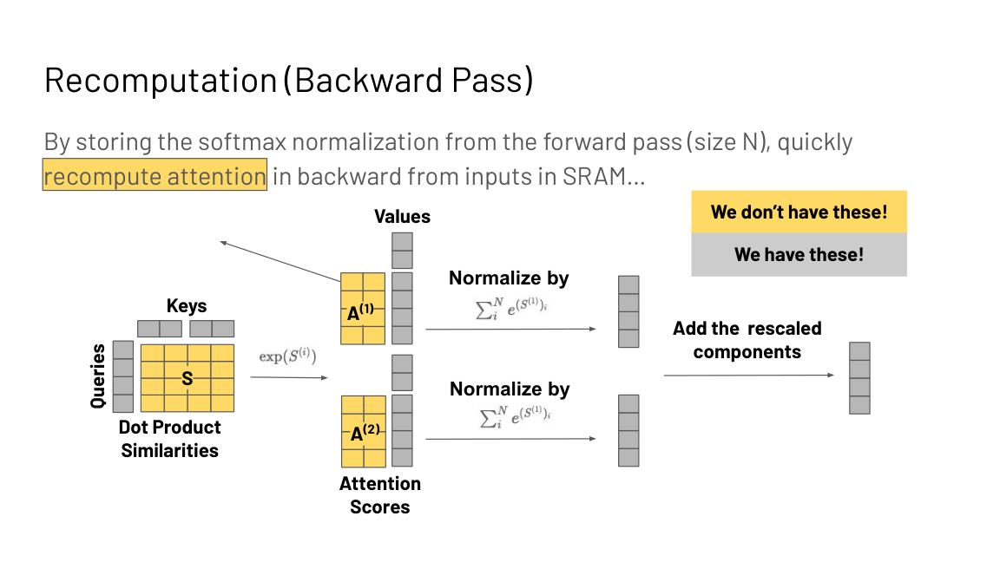

## How to read this lesson

**Level 1 (Core)** profiles standard attention, shows it is memory
bound, and derives FlashAttention's three ideas: tiling, online
softmax rescaling, and backward recompute. **Level 2 (Deep)** covers
the approximation families the field tried first (sparse, low-rank,
kernel) and FlashAttention-2's improvements. Linear attention as an
architecture continues in [CS336 L04](../cs336/l04-linear-attention-moe.html).

## Level 1: Standard attention is quadratic and memory bound

Q, K, V are N by D. The score matrix S = QK^T is N by N. Both
memory and compute scale as O(N squared) in sequence length in
standard implementations.

Profiling with torch.profiler shows why the constant factors hurt.
Each step reads and writes around the N by N matrix: read Q and K,
write QK^T, read and write for masking, dropout, and softmax, read
V, write the output. The FLOPs are modest (matmuls plus an
elementwise softmax); the memory accesses are massive.

Fix d = 768 and grow N. The attention op's FLOPs-per-byte ratio
falls below the A100 ridge of 161. Standard attention is memory
bound, and longer sequences make it worse. Note the scope: this
analysis covers attention, not the feed-forward matmuls, which are
compute bound at large batch.

## Level 1: The core obstacle is the softmax

Tiling the matmuls is easy: load tiles of Q and K into SRAM,
compute block scores, never write the full matrix. The obstacle is
the softmax, which normalizes over the full row. With only tiles in
hand, the row sum is unknown.

The fix is online rescaling. Split the row into two tiles with
partial sums L(1) and L(2). The true output is

output = (A(1) + A(2)) V / (L(1) + L(2))

Compute per-tile outputs O(1) = A(1)V(1)/L(1) and
O(2) = A(2)V(2)/L(2), then rescale: multiply O(1) by
L(1)/(L(1)+L(2)) so its denominator becomes the true total, and
likewise for O(2). Add them. The result is exactly standard
attention. No approximation.

Numerical stability needs the same trick for the max. Stable
softmax subtracts the row max, but the max is also a whole-row
quantity. Maintain a running max m(x) across tiles and rescale each
tile's exponentials by the ratio of the tile max to the running
max. The algebra cancels to the exact stable softmax.

> [!QA]
> Q: How does FlashAttention compute an exact softmax without the full row in memory?
> A: It processes the row in tiles and keeps two running statistics: the sum of exponentials L and the running max m. Each tile's partial output is rescaled by its share of the running totals, so after the last tile the denominator and the max equal the whole-row values. The output is bit-for-bit standard attention; tiling changes the order of operations, not the result.
> Follow-up: Why does the backward pass not need the N by N matrix either?
> A: It recomputes the attention tiles from the stored inputs plus the cached L and M vectors, which are only size N. Recomputation adds about 13% more FLOPs but removes the giant read-write of the score matrix. Since the workload is memory bound, trading FLOPs for bandwidth wins: 6x faster runtime in the slides' benchmark.

## Level 1: The results

Asymptotic HBM accesses: FlashAttention O(N^2 d^2 M^-1) for SRAM
size M, versus O(Nd + N^2) standard. In practice about 9x fewer HBM
reads and writes.

| Metric | Standard | FlashAttention |
|---|---|---|
| GFLOPs | 66.6 | 75.2 (up 13%) |
| HBM reads/writes | 40.3 GB | 4.4 GB (down 9x) |
| Runtime | 41.7 ms | 7.3 ms (down 6x) |

More FLOPs, far less time. The lecture's takeaway: lower FLOPs do
not imply wall-clock speedup. Downstream: 15% faster than the
MLPerf 1.1 BERT training record, 3x faster than HuggingFace at 1k
sequence length, 2.4 to 2.8x faster training on Long-Range Arena
with no quality drop, and the first transformer above random chance
on Path-X and Path-256.

The backward pass recomputes the attention matrix from inputs in
SRAM using the cached L (normalization) and M (running max)
vectors. Storing two vectors of size N beats storing an N by N
matrix.

, recompute the N by N tiles backward. Source: Stanford slides.")

FlashAttention-2 improves work partitioning across blocks and
warps, which was causing excess reads and writes. It uses CUTLASS 3
primitives for memory management and parallelizes over more
dimensions: sequence length, batch size, and attention heads.

## Level 1: Where it sits among the options

Mistral 7B combined FlashAttention with sparsity ideas. Two
observations from the slides: FlashAttention alone is more memory
efficient than the approximate Linformer, and FlashAttention plus
sparsity gives the fastest runtimes. Exactness and approximation
stack.

> [!QA]
> Q: When would you choose an approximate attention over FlashAttention?
> A: When the approximation's inductive bias helps or when even tiled exact attention is too slow at your sequence length. But the lecture's ordering matters: try the exact hardware-aware implementation first, because approximations trade quality for speed while FlashAttention keeps full quality. Combine them only after the exact baseline is in place.
> Follow-up: What is the interview one-liner for FlashAttention?
> A: It never materializes the N by N attention matrix: it tiles Q, K, V through SRAM, tracks running softmax statistics per tile, and recomputes tiles in the backward pass. Exact output, 9x less HBM traffic, 6x faster.

## Level 2: The approximation families

Before FlashAttention, the field modified the algorithm to dodge
the quadratic. Three families, from Tay et al.'s 2022 survey.

| Family | Idea | Example | Price |
|---|---|---|---|
| Sparse | Attend to a token subset | BigBird O(n) | Quality loss on long range |
| Low rank | Project to smaller dims | Linformer | Causality hard to keep |
| Kernel | Replace similarity, drop softmax | Linear transformer | Needs a custom CUDA kernel |

**Sparse.** Compute attention over a subset of token pairs. Sparse
Transformers (Child et al., 2019) use local windows: O(n sqrt(n))
empirically. BigBird (Zaheer et al., 2021) combines windowed local
attention with global tokens and random attention for O(n) inner
products. Common fixed patterns: sliding window, dilated, global,
blocked, random. Language has locality of reference, which is why
windows work at all.

**Low rank.** Project to smaller dimensions. Linformer reduces the
N by N matrix toward k by k. The cost is causality: the projection
mixes future into past, which is hard to maintain for autoregressive
modeling.

**Kernel.** Replace the similarity without the full N^2 d cost and
without the softmax. The linear transformer (Katharopoulos et al.,
2020) writes sim(qi, kj) as f(qi) f(kj) with an elementwise feature
map like 1 + ELU. Without the exp, the associative property of
matrix multiplication regroups the computation into linear time.
The price, per Lecture 1's meme: without a custom CUDA kernel it
loses in wall-clock to FlashAttention anyway.

All three trade quality for efficiency. The Pile perplexity plots
in the slides show the gap. FlashAttention's contribution was
showing the tradeoff was optional: exactness at speed was a
systems problem, not an algorithmic one.

## Recap: the whole lesson on one screen

<strong>1. Standard attention is memory bound</strong>

N by N scores, O(N squared) memory and compute. Profiling shows
the cost is reads and writes around the matrix, not the FLOPs.

Key: falls below the 161 ridge

<strong>2. Never write the N by N matrix</strong>

Tile Q, K, V through SRAM. HBM accesses drop from O(Nd + N^2)
toward O(N^2 d^2 M^-1). About 9x fewer in practice.

Key: the matrix is the enemy

<strong>3. Rescale tiles to an exact softmax</strong>

Track running sum L and running max m per tile. Rescale each
partial output by its share of the true totals. Exact output.

Key: O = O(1) + O(2), rescaled

<strong>4. Recompute the backward pass</strong>

Cache L and M (size N), recompute tiles from inputs. 13% more
FLOPs buys 9x less traffic. Memory bound means math is free.

Key: store N, not N squared

<strong>5. 6x faster with more FLOPs</strong>

75.2 vs 66.6 GFLOPs, 4.4 vs 40.3 GB traffic, 7.3 vs 41.7 ms.
Lower FLOPs do not imply wall-clock speedup.

Key: 9x traffic, 6x speed

<strong>6. Exactness keeps quality</strong>

2.4 to 2.8x faster Long-Range Arena training, first
above-chance Path-X. No approximation means no quality tax.

Key: exact beats approximate

<strong>7. Sparse, low-rank, kernel came first</strong>

Windows, projections, feature maps: all trade quality for
speed. Useful, but try the exact hardware-aware version first.

Key: Tay et al. 2022 survey

<strong>8. Three ideas, one system</strong>

Fusion avoids round trips, tiling keeps data on-chip,
recompute trades FLOPs for bandwidth. The Lecture 3 principles,
applied.

Key: IO-awareness wins

## Official sources and further reading

**Official:**
- Hardware Aware Algorithm Design slide deck, attention sections (Fall 2023 headers).

**Further reading:**
- Dao et al., "FlashAttention" (NeurIPS 2022): the full derivation.
- Dao, "FlashAttention-2" (2023): better parallelism and work partitioning.
- Tay et al., "Efficient Transformers: A Survey" (2022): the approximation taxonomy.
- [CS336 L04](../cs336/l04-linear-attention-moe.html): linear attention as architecture.

**Caveats from these sources.** Benchmark numbers (9x, 6x, 41.7
ms) are from the 2022 paper's A100 measurements; newer GPUs and
FlashAttention-3 change the constants. The O(N^2 d^2 M^-1) bound
assumes SRAM size M. Sparse and low-rank quality gaps are
dataset-dependent; the Pile perplexity plots are one data point.

## Connections to the other courses

- **CS229S L03:** fusion, tiling, and recompute: the principles FlashAttention instantiates.
- **CS229S L05:** SRAM versus HBM, warps, tensor cores: the hardware it targets.
- **CS229S L09:** attention-free architectures: the other answer to O(N squared).
- **CS336 L04:** linear attention and MoE in full.
- **CS336 L10:** the same memory-bound attention at inference time.

> [!CHEAT]
> **Efficient attention cheatsheet.** Standard: O(N^2) memory and compute; memory bound (below 161 ridge). Families: sparse (windows, BigBird O(n)), low-rank (Linformer, causality hard), kernel (linear transformer, no softmax, needs custom kernel). FlashAttention: tile QKV through SRAM, never materialize N x N; online softmax via running L and m; backward recomputes from cached L, M (size N). HBM: O(N^2 d^2 M^-1) vs O(Nd + N^2); 9x less traffic, 13% more FLOPs, 6x faster. Results: MLPerf BERT record +15%, 3x vs HF at 1k, LRA 2.4-2.8x, Path-X solved. FA-2: CUTLASS 3, parallelize over seq/batch/heads. Rule: exact hardware-aware first, approximations second.

> [!MEMORY]
> **FlashAttention in one line.** Tile the math, rescale the softmax online, recompute backward: exact attention at a ninth of the memory traffic.
