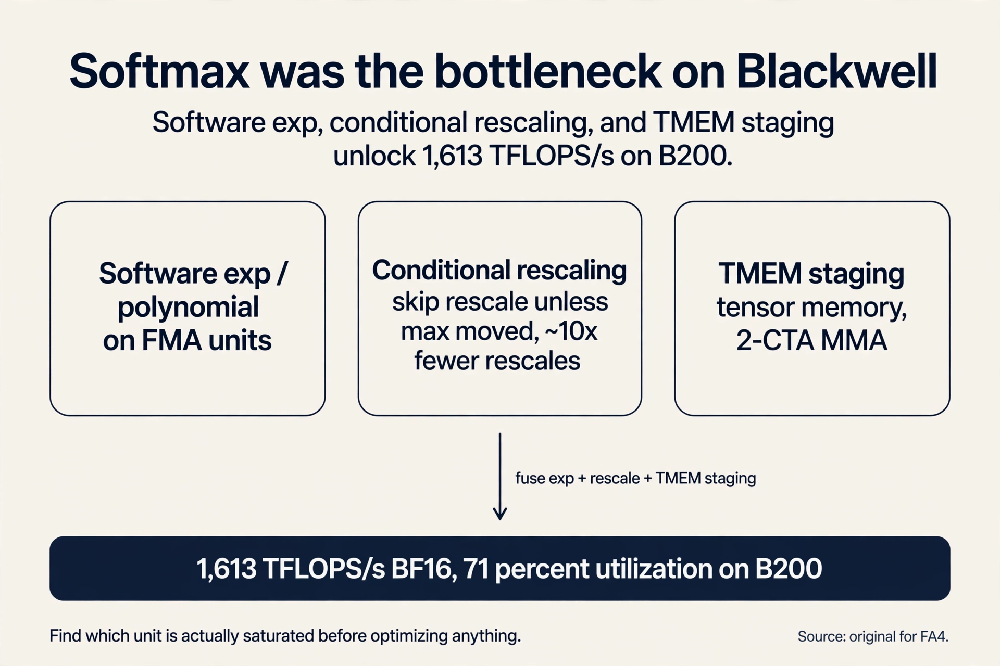

### Coverage and sourcing

This lesson follows the attention sections of the CS229S
"Hardware Aware Algorithm Design" slide deck (Fall 2024
offering, Fall 2023 headers), taught by Azalia Mirhoseini.
The deck's attention arc runs: the quadratic problem,
three approximation families, the memory-bound profile,
FlashAttention's tiling and online softmax, the recompute
backward pass, benchmark results, and FlashAttention-2.
The lesson adds the post-deck history, each fact dated and
sourced: Flash-Decoding (2023), FlashAttention-3 (July
2024), and FlashAttention-4 (MLSys 2026, October 2026
updates throughout). Benchmark numbers are the papers'
own, measured on the GPUs of their year. Where a fact is
not public, it is marked [uncertain], never asserted.

## The problem: attention does not scale

Q, K, V are N by D. N is the sequence length: how many
tokens the model looks at. D is the head dimension: the
size of each token's vector. The score matrix S = QK^T is
N by N: one score for every pair of tokens. Attention
memory and compute scale as O(N squared) in sequence
length in standard implementations. Double the sequence,
quadruple the cost.

The lecture's motivation is concrete, not asymptotic.
Hundreds of thousands of words in a math textbook, with
dependencies across chapters. Thousands of timesteps per
second of raw audio: one minute of 16 kHz audio is nearly
a million timesteps. 3.2 billion nucleotide pairs in the
human genome, with interactions spanning 100k+ positions.
Long sequences are not a luxury. They are the data.

Work the genome case. N = 100,000. The score matrix is
10^10 entries. In FP16 at 2 bytes each, that is 20 GB for
one head, one layer, one sequence. A 96-layer model needs
it 96 times over. The matrix does not fit. The quadratic
is a wall, and the data lives on the other side.

## First attempt: change the algorithm

Before FlashAttention, the field modified the algorithm
to dodge the quadratic. The survey (Tay et al., 2022)
groups the attempts into three families. Each family gets
its mechanism, its worked number, and its price below.

### Subchapter: sparse attention, worked

**Sparse attention** computes attention over a subset of
token pairs. The full N by N grid is mostly skipped.

Sparse Transformers (Child et al., 2019) use local
windows: each token attends to its neighbors. Work the
scaling. N = 4096, window 256. Each token attends to 256
neighbors instead of 4096. Attention pairs fall from 16.8M
to 1.0M: a 16x cut. The mechanism is a sliding window:
position i looks at positions i-128 through i+128.

The price is visible in the same numbers. Anything beyond
256 positions is invisible in one layer, unless
information hops window to window through stacked layers.
Long-range dependency now costs depth: the model needs
enough layers for the hops to cross the distance.

BigBird (Zaheer et al., 2021) recovers long range with
two more ingredients. **Global tokens** attend to
everything: a handful of positions (say 64) get full
N-length attention, costing O(N) each. **Random attention**
adds random pairs, which shrinks the average graph
distance between any two tokens: any token reaches any
other in a few hops. The inner products stay O(N).

The fixed patterns the slides name: sliding window,
dilated (windows with gaps, so the reach grows without
more pairs), global, blocked, and random. Sparse
Transformer with a strided pattern reaches O(n sqrt(n)):
at n = 4096, that is 4096 x 64 = 262,144 pairs, a 64x cut
from 16.8M.


### Subchapter: low-rank attention and the causality price

**Low-rank attention** projects the matrices to smaller
dimensions. Linformer projects the N by N score matrix
toward k by k, with k much smaller than N. The attention
cost falls from O(N^2) to O(Nk).

The price is causality. An **autoregressive** model
predicts each token from the tokens before it: position i
may not see position i+1. The Linformer projection mixes
the whole sequence into the low-rank factors, including
the future into the past. For bidirectional encoders that
is fine. For autoregressive generation it breaks the
causal mask, and repairing it is hard: the projection
would need to be recomputed per position. The lecture's
one-line verdict: the price is causality, hard to maintain
for autoregressive modeling.

### Subchapter: kernel attention and the linear transformer regroup

**Kernel attention** replaces the similarity function
without the full N^2 d cost and without the softmax. The
linear transformer (Katharopoulos et al., 2020) writes
the similarity as sim(qi, kj) = f(qi) f(kj), with an
elementwise feature map like 1 + ELU. **ELU** is the
exponential linear unit: an activation function that is
the identity for positive inputs and a smooth curve for
negatives. The map f keeps the values positive so the
similarity stays a valid weight.

Without the exp, the associative property of matrix
multiplication regroups the computation. Standard
attention computes (QK^T)V: the N by N score matrix first,
then the mix. With sim(qi, kj) = f(qi) f(kj), the scores
factor, and associativity regroups: Q(K^T V). Now K^T V
is d by d, computed once, and Q multiplies it: O(N d^2),
linear in N.

The toy: N = 4096, d = 64. Standard: 4096^2 = 16.8M
score entries. Regrouped: 64^2 = 4,096 entries for K^T V.
The matrix that cost 16.8M entries now costs 4,096.

But the slides' warning bites here. Without the exp,
quality drops: the softmax's sharp selection is part of
what makes attention work. And without a custom kernel,
the wall-clock can lose to FlashAttention anyway.
Asymptotics are not runtime. A linear algorithm with bad
memory access loses to a quadratic algorithm with good
memory access. That sentence is the whole lecture in
advance.

Each family, built and priced:

| Family | Mechanism | Price |
|---|---|---|
| Sparse | Attend to a token subset (windows, global, random) | Quality loss on long range; depth pays for hops |
| Low rank | Project N by N toward k by k | Causality hard to keep for autoregressive models |
| Kernel | Replace similarity, drop the softmax | Quality drop without exp; needs a custom CUDA kernel to win in wall-clock |

## Where the first attempt breaks

All three trade quality for efficiency. The Pile
perplexity plots in the slides show the gap: approximate
models sit above exact ones. **Perplexity** measures how
surprised a model is by held-out text: lower is better.
The approximations are more surprised. The gap is the
price, plotted.

And the Lecture 1 meme returns. As you learned in CS229S
L01, paper speed is not wall-clock speed: the linear
attention family wins on asymptotics, but without a
custom CUDA kernel it loses in wall-clock to a
hardware-aware exact implementation. The field had
accepted the tradeoff as law: faster attention means
approximate attention.

## The key question

Is there a fast *exact* attention algorithm? What if the
quality-efficiency tradeoff was never a law of nature, but
a systems problem? The lecture profiles standard
attention before answering, because the profile decides
the fix.

## Profiling: the cost is traffic, not FLOPs

A kernel is compute plus reads and writes. torch.profiler
on standard attention shows the steps: read Q and K, write
QK^T, read and write for masking, read and write for
dropout, read and write for softmax, read V, write the
multiply by V. The sizes (2 bytes per value): 2 x N x
D x B for the projections, N x N x B for the score matrix
and its passes. The FLOPs: QK^T costs 2 x B x N x N x D,
softmax 2 x B x N x N, multiply by V 2 x B x N x N x D.

The pattern: a series of very low-compute operations like
masking, dropout, and softmax, each with reads and writes
before and after. Fix d = 768 and grow N: the ops-per-byte
ratio falls below the A100 ridge of 161. **Arithmetic
intensity** is FLOPs per byte moved. The **ridge** is the
ratio where a chip switches from memory bound to compute
bound, defined in L03. Below 161 ops per byte, the A100
spends its time waiting on memory. Standard attention is
memory bound, and longer sequences make it worse. Note
the scope: this analysis covers attention, not the
feed-forward matmuls, which are compute bound at large
batch.

### Subchapter: the matmuls are innocent

Notice what the profile accuses. QK^T and the multiply by
V are dense matmuls: high arithmetic intensity,
tensor-core friendly. They are not the problem. The
problem is the five elementwise passes around the N by N
matrix: masking, dropout, softmax, each reading and
writing the full matrix for a handful of FLOPs per byte.
Fusion deletes the passes. Tiling deletes the matrix.
FlashAttention keeps the matmuls and deletes everything
around them. The fix targets the traffic, not the math.

## The plan: never materialize the N by N matrix

**SRAM** is the fast on-chip memory: about 20 to 40 MB
per GPU, shared across the streaming multiprocessors. The
score matrix S needs 2N^2 bytes in FP16. At long
sequences it does not fit, so the standard implementation
constantly reads and writes chunks to and from HBM, the
big slow off-chip memory. The plan: load Q and K in
tiles, compute block outputs in SRAM, aggregate. Avoid
reading and writing the attention matrix to and from HBM
entirely.


### Subchapter: the matrix versus the SRAM

At N = 8192, the score matrix in FP16 needs 2 x 8192^2 =
134 MB. SRAM is 20 to 40 MB. The matrix does not fit:
four copies over. At N = 16,384 it needs 537 MB. The
tiles do fit: a 64 by 64 tile of scores is 8 KB. That is
the whole plan as a size argument. Nothing about the
algorithm changed. The matrix simply cannot live where
the math happens, so it never gets built.


Tiling the matmuls is easy. The obstacle is the softmax,
which normalizes over the full row. With only tiles in
hand, the row sum is unknown. So the naive tiled output
has the wrong denominator: each tile normalized by its
own partial sum instead of the true total.

## The fix: online rescaling

Split the row into two tiles with partial sums L(1) and
L(2). The true output is

```
output = (A(1) + A(2)) V / (L(1) + L(2))
```

Compute per-tile outputs O(1) = A(1)V(1)/L(1) and
O(2) = A(2)V(2)/L(2), then rescale: multiply O(1) by
L(1)/(L(1)+L(2)) so its denominator becomes the true
total, and likewise for O(2). Add them. The result is
exactly standard attention. No approximation.


### Subchapter: the rescaling, worked with numbers

One row, two tiles. Tile 1 scores [1, 2], tile 2 scores
[3, 4]. True softmax: max 4, L = e^-3 + e^-2 + e^-1 + 1 =
0.0498 + 0.1353 + 0.3679 + 1 = 1.553.

Tiled: tile 1 computes max 2, L(1) = e^-1 + 1 = 1.368.
Tile 2 computes max 4, L(2) = e^-1 + 1 = 1.368. Running
max becomes 4. Rescale tile 1's sum by e^(2-4) = 0.1353:
1.368 x 0.1353 = 0.185. Add tile 2's 1.368: total 1.553.
The running statistics converge to the true max and the
true sum, tile by tile. Each tile's partial output gets
the same rescale, so the final output equals the
full-row softmax exactly.


### Subchapter: the running max, and why it cannot be skipped

Numerical stability needs the same trick for the max.
Stable softmax subtracts the row max, but the max is also
a whole-row quantity. Without subtracting it, e^x
overflows for large scores: e^100 is not representable.
Maintain a running max m(x) across tiles: tile 1 computes
e^(x1 - max(x1)), then rescale by e^(max(x1) - m(x)) to
get e^(x1 - m(x)). The algebra cancels to the exact stable
softmax. Two running statistics per row, L and m, are all
the whole-row state the tiles need. Each costs O(1) per
row. The N by N matrix cost O(N^2). That is the trade in
one line.

## The backward pass: recompute, do not store

Training needs the attention matrix again in the backward
pass, but the forward pass never wrote it. The lecture's
answer is Lecture 3's rule: the workload is memory bound,
so recompute. As you learned in CS229S L03, when memory
traffic is the bottleneck, extra arithmetic is nearly
free. Cache the L and M rescaling vectors (size N each)
and recompute the attention tiles from the inputs in SRAM
during the backward pass. Storing two vectors of size N
beats storing an N by N matrix.

The recompute is exact for the same reason the forward
pass is exact: the tiles, the running statistics, and the
rescaling reproduce the full-row computation. The
backward pass re-derives the scores from Q, K, and the
cached statistics, applies the chain rule per tile, and
accumulates the gradients. Nothing is approximated. The
price is paid in FLOPs, and FLOPs are the cheap currency
here.

, recompute the N by N tiles backward. Source: Stanford slides. Project: Stanford Frontier AI.")

## The results

Asymptotic HBM accesses: FlashAttention O(N^2 d^2 M^-1)
for SRAM size M, versus O(Nd + N^2) standard. In practice
about 9x fewer HBM reads and writes.


| Metric | Standard | FlashAttention |
|---|---|---|
| GFLOPs | 66.6 | 75.2 (up 13%) |
| HBM reads/writes | 40.3 GB | 4.4 GB (down 9x) |
| Runtime | 41.7 ms | 7.3 ms (down 6x) |

More FLOPs, far less time. The lecture's takeaway, stated
as a rule: lower FLOPs do not imply wall-clock speedup.
Downstream: 15% faster than the MLPerf 1.1 BERT training
record, 3x faster than HuggingFace at 1k sequence length,
2.4 to 2.8x faster training on Long-Range Arena with no
quality drop, and the first transformer above random
chance on Path-X and Path-256.


## FlashAttention-2: better parallelism

FlashAttention-2 fixes the remaining limitation:
suboptimal work partitioning between blocks and warps
caused excess reads and writes. **Warps** are groups of 32
threads that execute together, defined in L05. FA1
parallelized over batch and heads but scheduled
sequence-length work suboptimally. FA2 parallelizes over
the sequence length too, uses CUTLASS 3 primitives for
memory management, and trims the non-matmul overhead like
rescaling.

The measured effect on A100: 50 to 73 percent of peak
throughput versus 25 to 40 percent for FA1. Roughly double
the training throughput from scheduling alone. Same
algorithm. Better mapping to the hardware.

### Subchapter: Flash-Decoding, the inference twin

FlashAttention targeted training: long sequences, big
batches, the forward and backward passes. **Decoding**,
generating one token at a time, has a different shape.
As you learned in CS229S L04, decoding is memory bound:
each step reads the whole KV cache to produce one token.

Flash-Decoding (2023) ports the tiling idea to decode.
The query is one token, but the keys and values are the
whole cache. Split the KV cache across streaming
multiprocessors, compute partial attention per split with
the same online-softmax rescaling, then combine. The
parallelism that FA2 added over the sequence length
becomes parallelism over the cache. Reported: up to 8x
faster long-context decoding. Training and inference got
their own FlashAttention, because their bottlenecks
differ.

## FlashAttention-3: the Hopper version

FlashAttention-2 reached only about 35 percent of H100
peak: it could not use Hopper's new hardware.
FlashAttention-3 (July 2024, arXiv 2407.08608) is written
for Hopper, with three new ideas.

**Warp specialization.** Some warps only load data. Others
only compute. Loads and math overlap instead of
alternating. Hopper's asynchronous copy engines make this
possible: the hardware can move the next tile while the
tensor cores chew the current one.

**Ping-pong scheduling.** Softmax uses the slow
exponential unit while matmuls use tensor cores. FA3
interleaves two warpgroups so one runs softmax while the
other runs its GEMM (general matrix multiply: one dense
matrix-matrix product). Neither unit idles.

**FP8 with incoherent processing.** Q and K are multiplied
by a random Hadamard matrix before quantizing, spreading
outliers across dimensions. A **Hadamard matrix** is an
orthogonal matrix of +1 and -1 entries: multiplying by it
rotates the vector so no single coordinate carries an
outlier. Error is 2.6x lower than baseline FP8 attention.

Results: up to 740 TFLOPs/s in FP16 (75 percent of H100
peak), about 1.5 to 2x faster than FA2, and close to 1.2
PFLOPs/s in FP8. Each FlashAttention generation is a new
answer to the same question: what does this GPU's fast
path look like?


## FlashAttention-4: the Blackwell version

By 2026 the bottleneck had moved again. The B200 roughly
doubled tensor-core throughput over Hopper, but the
exponential unit and the shared-memory bandwidth did not
keep pace. Matmuls were no longer the slow part. Softmax
was. FlashAttention-4 (MLSys 2026, arXiv 2603.05451)
is built around that imbalance.

**Software exponentials.** Part of the exp work moves off
the dedicated special-function unit onto the regular FMA
(fused multiply-add) units, computed as a polynomial.
Both units run at once.
The special-function unit stops being the single choke
point.

**Conditional rescaling.** Online softmax normally
rescales the accumulator every time the running max goes
up. FA4 skips the rescale unless the max moved enough to
threaten numerical stability. Rescaling falls about 10x.
Most tiles never trigger it.

**Tensor memory and 2-CTA MMA.** Blackwell added tensor
memory (TMEM), a new fast storage between registers and
shared memory. FA4 stages operands through it and uses
two cooperative thread arrays per matrix multiply,
taking pressure off shared memory, especially in the
backward pass.

**Written in CuTe-DSL (Python).** FA1 through FA3 were
C++ template metaprogramming: powerful, unreadable, slow
to compile. FA4 is written in NVIDIA's CuTe domain
specific language embedded in Python. It compiles 20 to
30x faster. The algorithm did not change. The cost of
iterating on it collapsed.

Results on B200 in BF16 (brain floating point 16:
a 16-bit format that keeps FP32's dynamic range with
less precision): up to 1,613 TFLOPs/s, 71 percent
utilization, 1.3x faster than cuDNN 9.13 and 2.7x faster
than Triton. Meta then extended FA4 with end-to-end MXFP8
block-scaled precision for forward and backward,
reporting 2.85 PFLOPs/s forward and about 2.0 PFLOPs/s
backward on LLM shapes (PyTorch engineering blog,
September 16, 2026), already running in production to
train Meta's ads models. Four papers, one habit: find
which unit is actually saturated before optimizing
anything.



### Subchapter: the pattern across four generations

Each generation answered a new hardware imbalance with
the same algorithm. FA1 (2022, A100): the N by N matrix
never leaves SRAM. FA2 (2023, A100): schedule the work
better, 25-40 percent of peak becomes 50-73 percent. FA3
(2024, H100): overlap loads and math, interleave softmax
with GEMMs, quantize to FP8. FA4 (2026, B200): the
matmuls outran everything else, so move softmax off the
choke point. The lesson for interviews: name the
bottleneck first, then the mechanism. The mechanism is
always a response to a measurement.

And the approximations are not dead. Mistral 7B combined
FlashAttention with sparsity ideas, and the slides report
two observations: FlashAttention alone is more memory
efficient than the approximate Linformer, and
FlashAttention plus sparsity gives the fastest runtimes.
Exactness and approximation stack: try the exact
hardware-aware version first, combine after.

## What is used where: real stacks and real models

FlashAttention is infrastructure now. Facts as of October
2026.

| Stack | What ships | Status |
|---|---|---|
| PyTorch (SDPA) | FlashAttention-2/3 as a backend for scaled_dot_product_attention | public |
| HuggingFace transformers | FA2 integration for supported models | public |
| vLLM, SGLang | FA2/FA3/FA4 kernels for prefill and decode; SGLang exposes `--attention-backend fa4` | public |
| TensorRT-LLM | fused attention kernels | public |
| xFormers | memory-efficient attention | public |
| FlashInfer | FA4 MoE FP4 kernels on Blackwell (`VLLM_USE_FLASHINFER_MOE_FP4=1`) | public |
| DeepSeek FlashMLA | custom MLA kernel for DeepSeek-V2/V3 inference | public (open source) |

On the model side: the slides report Mistral 7B combined
FlashAttention with sparsity ideas. Llama 4 (April 2025)
trains with modern fused attention throughout
[uncertain: Meta has not disclosed the exact attention
kernel]. Which
exact attention kernel GPT-5, GPT-6, or Gemini 3 uses
internally is not public. Vendors do not disclose kernel
choices. [uncertain] whether any frontier lab trains
without some FlashAttention generation: the 6x gap is too
large to leave on the table, but the internals are
proprietary.

## Mapping back: three principles, one system

| Lecture 3/5 principle | FlashAttention's use |
|---|---|
| Fusion | One kernel from QKV to output: no round trips for scores, mask, softmax |
| Tiling | Q, K, V tiles through SRAM; the N by N matrix never exists |
| Caching vs recompute | Cache L and M (size N); recompute tiles backward: math is free when memory bound |

## The honest price

FlashAttention does 13% more FLOPs than standard
attention. It is still O(N squared) in compute: the
quadratic is dodged in memory traffic, not in arithmetic.
It is tuned for the SRAM sizes and tensor cores of its
GPU generation, which is why each generation needs a
rewrite. The benchmark numbers (9x, 6x, 41.7 ms) are 2022
A100 measurements, and newer GPUs and FA3/FA4 change the
constants. Exactness costs nothing in quality, which is
the point, but it does not repeal the quadratic. At
extreme N the FLOPs themselves become the wall, and that
is when sparse attention, linear attention, or
DeepSeek-V3.2-style learned sparse attention returns to
the table.

## Coverage map: every lecture claim and where it lives

| Lecture claim | Covered in | File line |
|---|---|---|
| Attention memory and compute scale as O(N^2) in N | The problem: attention does not scale | L53 |
| Long-sequence motivation: textbooks, audio, 3.2B genome pairs, 100k+ interactions | The problem: attention does not scale | L53 |
| Three approximation families: sparse, low-rank, kernel (Tay et al. survey) | First attempt: change the algorithm | L77 |
| Sparse attention: local windows, O(n sqrt(n)); BigBird windows plus global plus random, O(n) | sparse attention, worked | L84 |
| Low-rank attention: Linformer projects toward k by k; causality price | low-rank attention and the causality price | L119 |
| Kernel attention: linear transformer, sim as f(qi)f(kj), Q(K^T V) regroup, O(N d^2) | kernel attention and the linear transformer regroup | L137 |
| Approximations trade quality: Pile perplexity gap; wall-clock needs custom kernels | Where the first attempt breaks | L178 |
| Key question: fast exact attention; profile before fixing | The key question | L195 |
| torch.profiler cost breakdown; memory bound below the 161 ridge at d=768 | Profiling: the cost is traffic, not FLOPs | L203 |
| Matmuls innocent; elementwise passes guilty; fusion and tiling delete them | the matmuls are innocent | L227 |
| Plan: tile Q and K through SRAM, never materialize N by N | The plan: never materialize the N by N matrix | L239 |
| SRAM fit: 134 MB at N=8192 vs 20-40 MB SRAM; 8 KB tiles | the matrix versus the SRAM | L253 |
| Online rescaling: per-tile outputs rescaled by L(i)/(L(1)+L(2)); exact | The fix: online rescaling | L271 |
| Rescaling worked: 1.368 and 1.368 rescale to 1.553 | the rescaling, worked with numbers | L288 |
| Running max m for numerical stability; two O(1) statistics per row | the running max, and why it cannot be skipped | L305 |
| Backward pass: cache L and M (size N), recompute tiles; memory-bound rule | The backward pass: recompute, do not store | L319 |
| Results: 75.2 vs 66.6 GFLOPs, 4.4 vs 40.3 GB, 7.3 vs 41.7 ms; downstream wins | The results | L342 |
| FA2: sequence-length parallelism, CUTLASS 3, 50-73% of A100 peak | FlashAttention-2: better parallelism | L366 |
| Flash-Decoding (2023): split KV cache, up to 8x long-context decode (Oct 2026 update) | Flash-Decoding, the inference twin | L383 |
| FA3 (2024): warp specialization, ping-pong, FP8 incoherent processing, 740 TFLOPs/s | FlashAttention-3: the Hopper version | L402 |
| FA4 (2026): software exp, conditional rescaling, TMEM, CuTe-DSL, 1,613 TFLOPs/s (Oct 2026 update) | FlashAttention-4: the Blackwell version | L436 |
| One algorithm, four hardware ports; name the bottleneck first | the pattern across four generations | L487 |
| Mistral 7B: FA plus sparsity fastest; exact plus approximate stack | the pattern across four generations | L487 |
| Real stacks: PyTorch SDPA, HF, vLLM/SGLang, TRT-LLM, xFormers, FlashInfer, FlashMLA (Oct 2026) | What is used where | L508 |
| Fusion, tiling, recompute mapped to L03/L05 principles | Mapping back | L535 |
| Honest price: 13% more FLOPs, still O(N^2) compute, per-generation tuning | The honest price | L543 |

> [!QA]
> Q: How does FlashAttention compute an exact softmax without the full row in memory?
> A: It processes the row in tiles and keeps two running statistics: the sum of exponentials L and the running max m. Each tile's partial output is rescaled by its share of the running totals, so after the last tile the denominator and the max equal the whole-row values. The output is bit-for-bit standard attention. Tiling changes the order of operations, not the result.
> Follow-up: Why does the backward pass not need the N by N matrix either?
> A: It recomputes the attention tiles from the stored inputs plus the cached L and M vectors, which are only size N. Recomputation adds about 13% more FLOPs but removes the giant read-write of the score matrix. Since the workload is memory bound, trading FLOPs for bandwidth wins: 6x faster runtime in the paper's benchmark.

> [!QA]
> Q: Why was standard attention memory bound in the first place?
> A: The profile shows the cost is reads and writes around the N by N score matrix, not the FLOPs: read Q and K, write QK^T, read/write passes for masking, dropout, and softmax, read V, write the output. With d = 768 fixed and N growing, the ops-per-byte ratio falls below the A100 ridge of 161. The math is cheap. The traffic is the bill.
> Follow-up: Does this analysis apply to the feed-forward blocks too?
> A: No. The lecture scopes it to attention explicitly. The feed-forward matmuls are compute bound at large batch: their arithmetic intensity is high. That is why the course optimizes attention and the MLP with different tools.

> [!QA]
> Q: When would you choose an approximate attention over FlashAttention?
> A: When the approximation's inductive bias (its
> built-in assumption about the data's structure) helps
> or when even tiled exact attention is too slow at your
> sequence length. But the lecture's ordering matters: try the exact hardware-aware implementation first, because approximations trade quality for speed while FlashAttention keeps full quality. Combine them only after the exact baseline is in place.
> Follow-up: What is the interview one-liner for FlashAttention?
> A: It never materializes the N by N attention matrix: it tiles Q, K, V through SRAM, tracks running softmax statistics per tile, and recomputes tiles in the backward pass. Exact output, 9x less HBM traffic, 6x faster.

> [!QA]
> Q: Walk me through the online softmax rescaling with numbers.
> A: One row, two tiles: scores [1, 2] and [3, 4]. Tile 1 computes its local max 2 and sum e^(1-2) + e^(2-2) = 1.368. Tile 2 computes max 4 and sum 1.368. The running max becomes 4, so tile 1's sum is rescaled by e^(2-4) = 0.1353: 1.368 x 0.1353 = 0.185. Add tile 2's 1.368: 1.553. The true full-row values are max 4 and sum 1.553: the running statistics converge exactly. Each tile's partial output O(i) gets multiplied by L(i) / L(total), so every tile's denominator becomes the true total. Tiling changes the order of operations, never the result.
> Follow-up: Why track the running max at all, instead of only the running sum?
> A: Numerical stability. Without subtracting the max, e^x overflows for large scores. The max is a whole-row quantity like the sum, so it gets the same online treatment: keep the running max, rescale earlier tiles' exponentials by e^(old max - new max) when it moves. Both statistics cost O(1) per row.

> [!QA]
> Q: Why is FlashAttention still O(N squared) in compute?
> A: It computes every one of the N^2 attention scores. It just never stores them all at once. The tiles cover the full matrix, so the arithmetic is unchanged: O(N^2 d). What changed is the memory traffic: O(N^2 d^2 / M) HBM accesses instead of O(Nd + N^2). The quadratic is dodged in traffic, not in math. At extreme N the FLOPs themselves become the wall, and that is when sparse or linear attention returns to the table.
> Follow-up: If it is still quadratic, why did it make long context practical?
> A: Because the binding constraint at 8K to 128K was memory traffic, not FLOPs. Deleting 9x of the traffic moved the wall from memory to compute. Long context became a compute problem, which is the cheaper kind: you can buy more FLOPs with more GPUs, but you cannot buy your way out of traffic per GPU.

> [!QA]
> Q: What did FlashAttention-2 fix over FlashAttention-1?
> A: Work partitioning. FA1 left parallelism on the table: it parallelized over batch and heads but scheduled sequence-length work suboptimally, causing excess reads and writes. FA2 parallelizes over sequence length too, uses CUTLASS 3 primitives for memory management, and trims the non-matmul overhead like rescaling. Result on A100: 50 to 73 percent of peak versus 25 to 40 percent for FA1, roughly doubling training throughput. FA3 then did the same for Hopper: warp specialization, ping-pong scheduling, FP8, reaching 75 percent of H100 peak.
> Follow-up: Why does each GPU generation need a new FlashAttention?
> A: Because each generation's fast path is different: new async copy engines, new matrix instructions, new precisions. The algorithm (tile, rescale, recompute) is stable. The implementation must be rewritten for the new hardware's strengths. FlashAttention is a hardware port as much as an algorithm.

> [!QA]
> Q: What did FlashAttention-4 change for Blackwell, and why was softmax the target?
> A: On the B200, tensor-core throughput roughly doubled over Hopper while the exponential unit and shared-memory bandwidth did not keep pace, so softmax became the bottleneck instead of the matmuls. FA4 moves part of the exp onto the regular FMA units as a polynomial, skips the online-softmax rescale unless the running max moved enough to threaten stability (about 10x fewer rescales), stages operands through Blackwell's tensor memory with 2-CTA MMA, and is written in CuTe-DSL Python so it compiles 20 to 30x faster than the C++ template versions. Result: 1,613 TFLOPs/s in BF16 on B200, 71 percent utilization.
> Follow-up: Why rewrite in CuTe-DSL instead of staying in C++?
> A: Iteration speed. Each GPU generation needs a new FlashAttention, and C++ template metaprogramming made every rewrite slow to write and slow to compile. The Python-embedded DSL keeps the performance (it still generates the same class of kernels) while cutting compile time 20 to 30x, so the next hardware port starts faster.

> [!QA]
> Q: Applied design: training uses FA2 but attention is still the bottleneck at 64K context. What do you try?
> A: First confirm the profile: at 64K with FA2, is attention traffic-bound or compute-bound? If traffic-bound, upgrade to FA3 on Hopper or FA4 on Blackwell: 1.5 to 2x from asynchrony, and more from FP8 or MXFP8. If compute-bound, the quadratic itself is the wall: reduce it with grouped-query attention (fewer KV heads), context parallelism across GPUs (split the sequence), or sparsity on top of FlashAttention, which the slides show gives the fastest runtimes. The interview signal: name the regime first, then pick the tool for that regime.
> Follow-up: Why is context parallelism the last resort?
> A: Because of this lesson's rule: name the bottleneck
> first, then pick the mechanism for that regime. FA3/FA4
> attack HBM traffic, which this lesson measured. GQA
> attacks KV-cache traffic, which the lesson names.
> Context parallelism splits the sequence across GPUs,
> and the lesson establishes that decoding reads the
> whole KV cache: every attention layer must then fetch
> cache shards from other GPUs over the interconnect.
> That network cost is a new bottleneck the lesson never
> profiles, so it stays the last resort.

## Recap: the whole lesson on one screen

The story in ten steps. Each step answers the one before it.

1. **Attention is quadratic.** N by N scores: O(N squared)
   memory and compute. Long sequences (books, audio,
   genomes) need better.
2. **The field approximated first.** Sparse (windows),
   low-rank (projections), kernel (feature maps): each
   dodges the quadratic and each pays in quality or in
   wall-clock reality.
3. **Is exact speed possible?** The key question: maybe
   the tradeoff was a systems problem, not a law.
4. **Profile before fixing.** The cost is reads and
   writes around the score matrix, not FLOPs. With d=768,
   growing N falls below the 161 ridge: memory bound.
5. **Never write the N by N matrix.** Tile Q, K, V
   through SRAM. HBM accesses fall toward O(N^2 d^2
   M^-1): about 9x fewer in practice.
6. **Rescale tiles to an exact softmax.** Track running
   sum L and running max m per tile. Rescale each partial
   output by its share of the true totals. Exact output.
7. **Recompute the backward pass.** Cache L and M (size
   N), recompute tiles from inputs. 13% more FLOPs buys
   9x less traffic. Memory bound means math is free.
8. **6x faster with more FLOPs.** 75.2 vs 66.6 GFLOPs,
   4.4 vs 40.3 GB traffic, 7.3 vs 41.7 ms. Lower FLOPs
   do not imply wall-clock speedup.
9. **One algorithm, four hardware ports.** FA2: better
   parallelism. Flash-Decoding: the inference twin, up
   to 8x on long-context decode. FA3: Hopper asynchrony
   and FP8, 740 TFLOPs/s. FA4: Blackwell, softmax off
   the choke point, 1,613 TFLOPs/s.
10. **Name the bottleneck first.** Every generation
    answered a new imbalance with the same algorithm.
    The mechanism is always a response to a measurement.

## Go deeper

<div style="position:relative;padding-bottom:56.25%;height:0;overflow:hidden;max-width:100%;margin:16px 0;">
<iframe style="position:absolute;top:0;left:0;width:100%;height:100%;" src="https://www.youtube-nocookie.com/embed/9vcsZK3a76w" title="FlashAttention Explained" frameborder="0" allow="accelerometer; autoplay; clipboard-write; encrypted-media; gyroscope; picture-in-picture" allowfullscreen></iframe>
</div>

- FlashAttention Explained: The Secret Behind Fast LLMs: https://www.youtube.com/watch?v=9vcsZK3a76w
- FlashAttention Explained: Never Write the N x N Matrix: https://www.youtube.com/watch?v=Q63CLQ3r-b4
- PyTorch Attention Profiling: FlashAttention, SDPA and cuDNN GPU Performance: https://www.youtube.com/watch?v=4XddvBNJ7tM
- Flash Attention 3 and ThunderKittens (Tri Dao, Stanford MLSys): https://www.youtube.com/watch?v=gMOAud7hZg4
- FlashAttention (Dao et al., NeurIPS 2022): https://arxiv.org/abs/2205.14135
- FlashAttention-2 (Dao, 2023): https://arxiv.org/abs/2307.08691
- FlashAttention-3 (Shah et al., 2024): https://arxiv.org/abs/2407.08608
- FlashAttention-4 (Zadouri et al., MLSys 2026): https://arxiv.org/abs/2603.05451
- Efficient Transformers: A Survey (Tay et al.): https://arxiv.org/abs/2009.06732

## Official sources and further reading

**Official:**
- Hardware Aware Algorithm Design slide deck, attention
  sections (Fall 2023 headers).

**Further reading:**
- Dao et al., "FlashAttention" (NeurIPS 2022): the full
  derivation.
- Dao, "FlashAttention-2" (2023): better parallelism and
  work partitioning.
- Shah et al., "FlashAttention-3" (2024): asynchrony and
  FP8 for Hopper.
- Zadouri et al., "FlashAttention-4" (MLSys 2026): the
  Blackwell rewrite.
- Tay et al., "Efficient Transformers: A Survey" (2022):
  the approximation taxonomy.

**Caveats from these sources.** Benchmark numbers (9x, 6x,
41.7 ms) are from the 2022 paper's A100 measurements.
FA3's 740 TFLOPs/s is H100. FA4's 1,613 TFLOPs/s is B200
BF16. Newer GPUs change the constants. The O(N^2 d^2
M^-1) bound assumes SRAM size M. Sparse and low-rank
quality gaps are dataset-dependent. The Pile perplexity
plots are one data point.

## Connections to the other courses

- **CS229S L03:** fusion, tiling, and recompute: the
  principles FlashAttention instantiates.
- **CS229S L05:** SRAM versus HBM, warps, tensor cores:
  the hardware it targets.
- **CS229S L09:** attention-free architectures: the other
  answer to O(N squared).
- **CS229S L10:** context parallelism: splitting the
  sequence when one GPU's SRAM is not enough.
- **CS229 L15:** GQA, MQA, MLA: shrink the KV traffic
  that FlashAttention moves.
- **CS336 L04:** linear attention and MoE in full.
- **CS336 L10:** the same memory-bound attention at
  inference time.
