## The problem: the model does not fit

Lecture 5 taught reducing memory *accesses*. This lecture
reduces the memory *required*. The difference matters on
small devices. Microcontrollers have 3x less memory than
mobile phones, and widely used vision models exceed the
microcontroller memory limit by up to 100x for ResNet-50
(Lin, 2020). A model that cannot fit cannot run, no matter
how clever the kernel. Three classical methods shrink it:
prune weights away, spend fewer bits per weight, or teach a
small model what the big one knows.

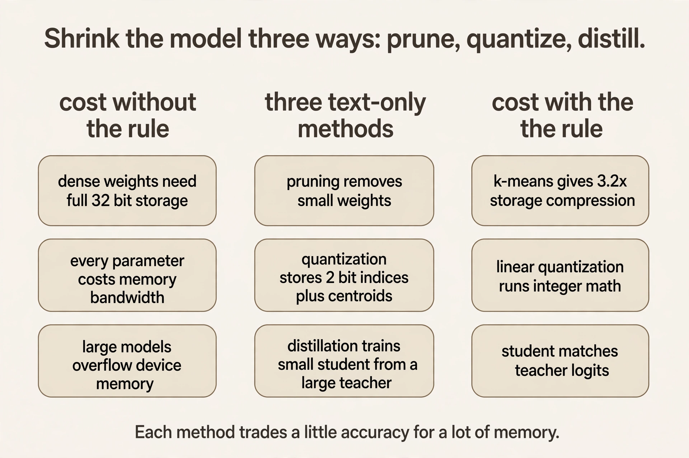

## First method: pruning

Start from the weights. **Pruning** discards a subset of parameters after training.
The result is a sparse network. Formally: given original
weights W, find pruned weights Wp minimizing the loss
L(x; Wp) subject to ||Wp||_0 < T, where ||.||_0 counts
nonzeros and T is the target parameter count. An ideal
pruning process accelerates training or inference on real
hardware, retains accuracy, and generalizes across models.

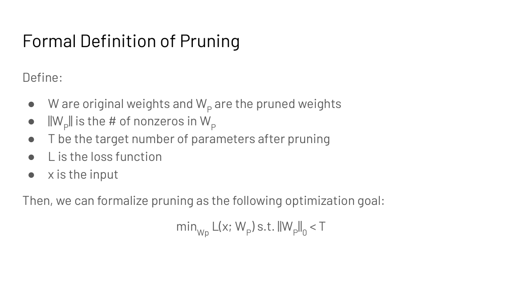

Watch the selection rule on a toy. Input X = [x1, x2, x3],
weights W = [5, 0.3, -0.4], ReLU activation. The neuron
computes Y = ReLU(5 x1 + 0.3 x2 - 0.4 x3). **Magnitude
pruning** keeps weights with large absolute values: 5 stays,
0.3 and -0.4 go. Coarse-grained magnitude pruning works on
rows: keep rows whose sums of absolute values are large.
**Regression-based pruning** (He et al., 2017) is smarter:
pick rows to minimize the layer-output reconstruction
error ||Z - Zhat||_F^2 subject to a nonzero budget, then
relearn the remaining weights. Direct one-shot pruning is
hard. Iterative prune-and-fine-tune works better (Han et
al., 2015).

### Subchapter: why iterative beats one-shot

One-shot pruning removes 90 percent of the weights in a
single cut. The network's structure collapses: too many
co-adapted weights vanish at once, and fine-tuning cannot
find its way back. Iterative pruning removes a slice, lets
the network heal, and repeats.

The arithmetic: to keep 10 percent after 5 rounds, keep
0.1^0.2 = 0.63 per round. Prune 37 percent, fine-tune,
repeat five times. Each round's cut is small enough that
the surviving weights re-learn their roles. The schedule is
the method: gentle cuts compound to the same 90 percent
that one brutal cut destroys.

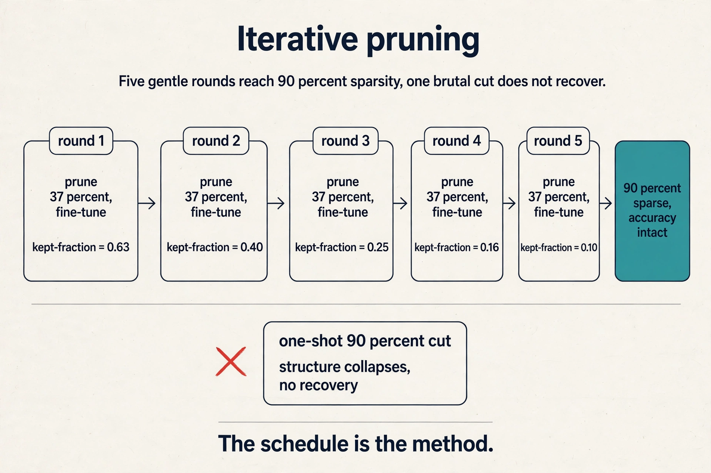

## Where naive pruning breaks: the pattern

Removing weights is not enough. The *pattern* of what
remains decides whether hardware gets faster.

**Unstructured** (fine-grained) pruning removes individual
weights: higher accuracy, but the surviving nonzeros scatter
randomly, so you still read and write every memory block to
find them. **Structured** (coarse-grained) pruning removes
whole rows, channels, or blocks: lower accuracy, but memory
access stays regular and hardware stays fast. Reading random
locations is the slowest access pattern on a GPU. Sequential
reads are the fastest. Unstructured sparsity pays the random
price.

The hardware compromise is **2:4 structured sparsity**: in
every contiguous group of 4 values, exactly 2 are zero.
NVIDIA Ampere's sparse tensor cores exploit this pattern:
regular enough for low metadata overhead, and 50% of
weights disappear while accuracy holds.

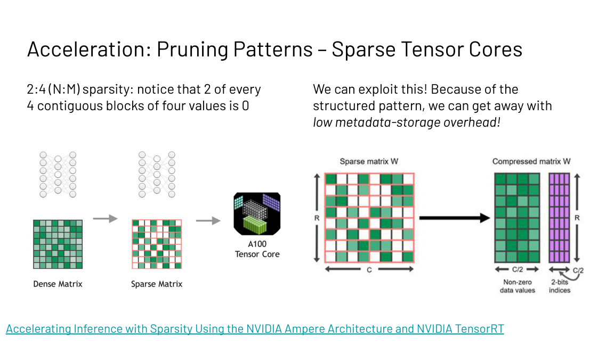

### Subchapter: the 2:4 pattern, worked

Four contiguous weights: [a, 0, b, 0]. Store a and b plus 2
bits of metadata saying which two survived. Half the
weights are gone; the metadata is 2 bits per group of 4
values, or 0.5 bits per weight: negligible. Ampere's sparse
tensor cores skip the zeros in hardware and run the sparse
GEMM at up to 2x the dense throughput.

The constraint is exact: exactly 2 zeros in every group of
4, no exceptions. The pattern is regular enough that the
hardware can plan around it. This is the compromise the
lecture names: unstructured sparsity is accurate but
unusable, structured blocks are usable but coarse, and 2:4
is the point the hardware chose to accelerate.

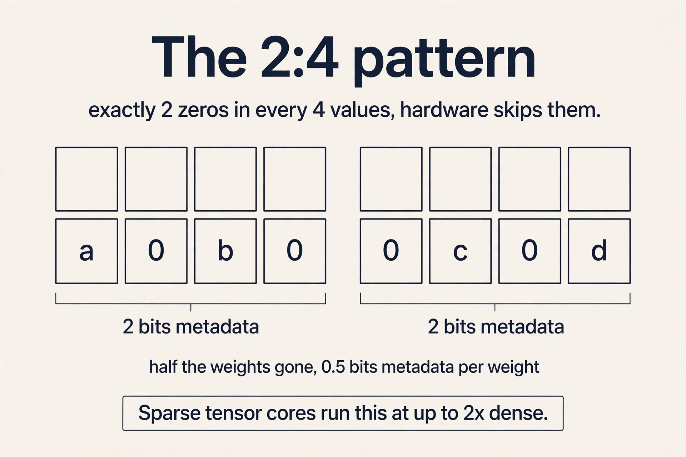

The interview point: sparsity only speeds up inference if
the pattern matches what the hardware accelerates. One
global sparsity number is also wrong: layers differ, so
**sensitivity analysis** prunes each layer at increasing
ratios in magnitude order and measures accuracy. Early
layers tend to be sensitive. Fully connected layers tend
not to be. Per-layer numbers are right.

## The key question

Pruning removes weights. But the weights that remain are
still 32-bit floats. What if the numbers themselves used
fewer bits?

## How numbers live in bits

The operation is simple. **Quantization** maps values from a large set to a smaller
set. The **quantization error** is |true value - quantized
value|. The economic case is two lines:

```
Storage = number of parameters x bits per parameter
Add cost: O(N) in bit-width N | Multiply cost: O(N^2)
```

Halving the bits halves the storage and quarters the
multiply cost. Before quantizing, the lecture rebuilds how
numbers live in bits, because the bit layout is the thing
being changed.

**Integers.** Unsigned n-bit: 0 to 2^n - 1. Signed: one bit
for sign. Two layouts: sign-magnitude (a sign bit plus
magnitude) and two's complement (negation by bit-flip plus
one). The slides show -70 as 10111010 in two's complement
against sign-magnitude's 11000110.

**Fixed point.** A fixed split between integer and fraction
bits. The slides' 8-bit example with 4 fraction bits reads
-4.375.

**Floating point (IEEE 754).** Value = (-1)^sign x (1 +
fraction) x 2^(exponent - bias). The exponent buys
**dynamic range**: the gap between the largest and smallest
representable values. Bias (127 for FP32's 8-bit exponent)
shifts the exponent range to cover small values.

Worked FP32 example from the slides: exponent bits sum to
120, bias 127, fraction 2^-2 = 0.25. Value = 1.25 x
2^(120-127) = 1.25 x 2^-7 = 0.0097656.

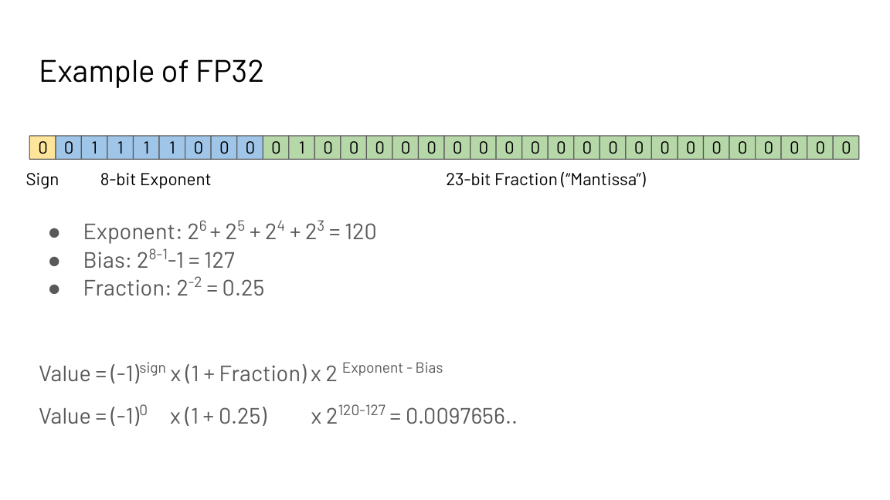

Edge cases: exponent all zeros gives subnormals (value =
(-1)^sign x fraction x 2^(1-127)). All-ones exponent with
zero fraction is infinity. A nonzero fraction is NaN. You
cannot represent infinitely small values: the format has a
floor.

**FP16 versus BF16.** FP16: 5 exponent bits, 10 fraction
bits. BF16: 8 exponent bits, 7 fraction bits. BF16 trades
precision for dynamic range, which stabilizes training:
gradients span many orders of magnitude, and range matters
more than fine resolution. This is why BF16 is the default
training format.

## Second method, part 1: k-means quantization

Han et al., Deep Compression (ICLR 2016 best paper). The
inference procedure:

1. Cluster the FP32 weight values into S clusters.
2. Store per weight a log2(S)-bit cluster index, plus the
   S FP32 centroids.
3. At compute time, reconstruct weights through the index
   map. Computation stays FP32.

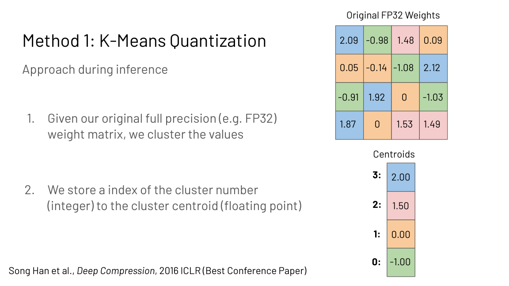

Work the storage. For a D by D FP32 matrix: 32 x D^2 bits
originally. After: log2(S) x D^2 index bits + S x 32
centroid bits. At D = 4, S = 4: 64 bytes become 20 bytes,
3.2x compression, and the ratio improves as S stays small
relative to D.

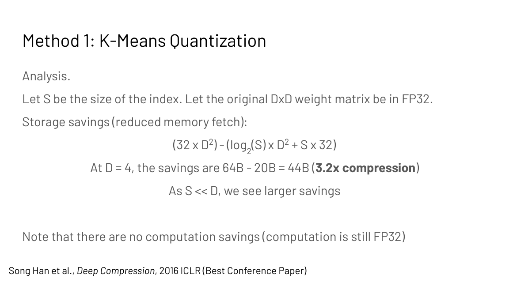

There are no compute savings: the math is still FP32.
Fine-tuning trains the shared centroids, not individual
weights: dL/dCk sums dL/dWij over all weights assigned to
centroid k, then the centroid updates by gradient descent.
Huffman coding on the indices exploits nonuniform cluster
frequencies for 20%+ further savings on AlexNet's last
layer.

## Second method, part 2: linear quantization

Jacob et al. (2017). Map real values r to integers q with a
scale S and zero-point Z:

```
r = S (q - Z)
```

Given rmin and rmax from the weight matrix and qmin, qmax
from the bit-width (for N bits, -2^(N-1) to 2^(N-1) - 1),
solve the two equations rmax = S(qmax - Z) and rmin =
S(qmin - Z) for S and Z. The slides' 2-bit example maps
weights like 2.09 to integer 1 with S = 1.07.

Integer-only matmul follows by substitution. With Y =
Sy(qY - ZY), W = Sw(qW - Zw), X = Sx(qX - Zx):

```
qY = (Sw Sx / Sy) (qW - Zw)(qX - Zx) + Zy
```

All integer math, with one rescale to N bits. Weights and
compute are both integer: storage and speed improve
together.

### Subchapter: what breaks at LLM scale

Naive quantization works on small models and breaks past
about 6B parameters. The cause: outlier features. A few
feature dimensions (about 0.1 percent) develop values tens
of times larger than the rest. One scale factor cannot
cover both the outliers and the normal values: either the
outliers clip or the normal values quantize to noise.

LLM.int8() (Dettmers et al., 2022) splits the problem:
compute the 0.1 percent of outlier dimensions in FP16 and
quantize the rest to INT8. At dmodel 4096, that is about 4
dimensions in FP16 and 4092 in INT8. The memory savings
survive; the accuracy survives.

 keeps them in FP16 and quantizes the rest. Shell 5. Source: original toy for the outlier split. Project: Stanford Frontier AI.")

### Subchapter: the LLM quantization family

Three methods dominate LLM deployment as of October 2026,
each answering the outlier problem differently.

**GPTQ** quantizes to 3-4 bits in one shot after training,
using second-order (Hessian) information to choose rounding
that hurts least. Fast to apply, no retraining.

**AWQ** (activation-aware) protects the weights that matter:
it scales up the 1 percent of salient weights before
quantizing, so their rounding error shrinks. Better accuracy
than GPTQ at 4 bits on most models.

**FP8** skips post-training quantization entirely: train or
serve in FP8 from the start. DeepSeek-V3 trained in FP8
natively. The format matches Hopper's tensor cores, so the
math is fast as well as small.

The choice: GPTQ for a quick one-shot shrink, AWQ for the
best 4-bit accuracy, FP8 when the hardware and the training
stack support it end to end.

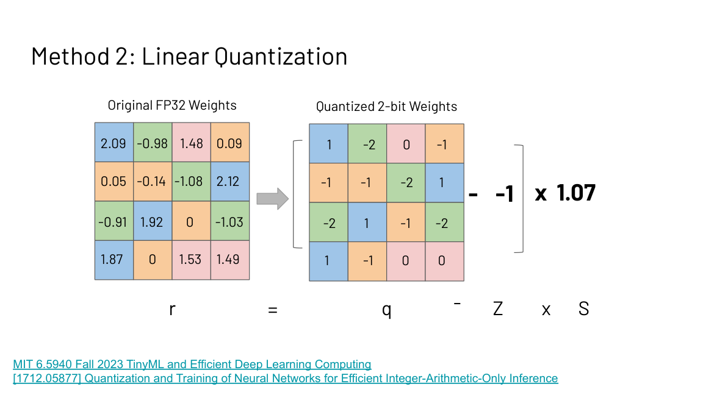

## The key question, again

Pruning removes weights. Quantization shrinks the numbers.
Both keep the same architecture. What if we change the
model itself: keep the knowledge, shrink the network?

## Third method: knowledge distillation

Small models are wanted (phones, IoT, laptops) but hard to
train: they underfit. **Distillation** trains a small
**student** against a large **teacher** that already learned
well. The design space aligns student and teacher on:
output logits (Hinton et al., 2014), intermediate weights,
intermediate features, gradients of feature maps, or
sparsity patterns.

Logits matching, worked. Teacher says plane 5, car 1:
softmax gives 0.982 and 0.017. Student says plane 3, car 2:
0.731 and 0.269. The distillation loss (cross-entropy
E(-pt log ps) or L2 on probabilities) pulls the student's
distribution toward the teacher's. The student learns the
teacher's uncertainty, not just the hard label: that dark
knowledge is the point.

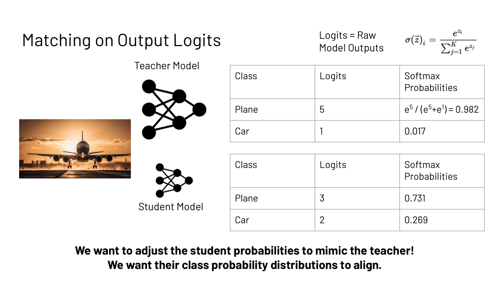

### Subchapter: the temperature knob

The lecture's worked example uses plain softmax. Hinton's
full method adds a temperature T: p_i = exp(z_i / T) /
sum(exp(z_j / T)). Higher T softens the distribution and
reveals more dark knowledge.

Teacher logits plane 5, car 1. At T = 1: 0.982 and 0.017,
nearly a hard label. At T = 5: exp(1) = 2.718, exp(0.2) =
1.221, giving 0.690 and 0.310. The student now sees that
the teacher finds the car 31 percent plausible, not 2
percent. Train the student against the softened targets at
high T, then run it at T = 1. The temperature is the
bandwidth of the knowledge transfer.

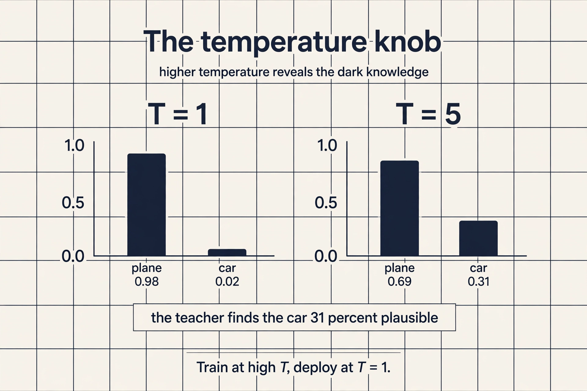

## What is used where: real deployments

Shrinking runs production inference. Facts as of October
2026.

| Deployment | Method | Why |
|---|---|---|
| llama.cpp / Ollama | GGUF quants (Q4_K_M and friends) | local inference on laptops |
| vLLM | AWQ, GPTQ, FP8 serving | public; quantized serving at scale |
| DeepSeek-V3 | native FP8 training | public in the V3 paper |
| Apple on-device models | INT4/INT8 quantization | public; phones cannot hold FP16 70B |
| DeepSeek-R1 distills | reasoning distilled into Qwen2.5 and Llama 3 | public in the R1 report |
| SparseGPT / Wanda | one-shot LLM pruning | public research; rare in production |

Two honest notes. Pruning at LLM scale is mostly research:
SparseGPT and Wanda are public papers, but production
serving shrinks with quantization, not pruning. And which
quant a frontier vendor uses internally (GPT, Gemini) is
not public; the table lists what is.

## Mapping back: three cuts, one smaller model

| Method | What shrinks | What you keep |
|---|---|---|
| Pruning | Parameter count | Accuracy via iterative retraining and per-layer ratios |
| K-means quantization | Storage bits | Compute in FP32 (no speed gain) |
| Linear quantization | Storage bits and math | Integer arithmetic end to end |
| Distillation | The whole model | The teacher's knowledge as soft targets |

The Deep Compression results show the combination beats
either alone: pruning and quantization compose. For each
method, accuracy falls as compression rises. That curve is
the price of every cut.

## The honest price

Every shrink trades accuracy for memory. Unstructured
pruning without hardware support saves nothing at runtime.
2:4 sparsity needs Ampere-or-newer sparse tensor cores and
matching kernels. Naive quantization breaks at LLM scale:
outlier features past 6B parameters need model-aware fixes
like LLM.int8(). Distillation needs a teacher worth
imitating and a student architecture that can absorb the
lessons.

> [!NOTE]
> The Fall 2024 calendar lists "Butterfly and Monarch
> matrices" under this lecture's sparsity topics. The
> shipped deck does not contain them. [uncertain]: treat
> any claim about them as unverified until checked against
> the 2024 lecture recording.

> [!QA]
> Q: Why does unstructured pruning often fail to speed up inference?
> A: Because the surviving weights scatter randomly across memory. The hardware still reads and writes every block to find the nonzeros, so the memory traffic barely drops. Structured patterns like 2:4 N:M keep accesses regular, which is what sparse tensor cores need. Accuracy favors fine-grained; speed favors structured.
> Follow-up: How do you pick the sparsity ratio per layer?
> A: Sensitivity analysis: prune each layer at increasing ratios in magnitude order and measure accuracy. Layers have different sensitivity, with early layers usually more fragile. Assign aggressive ratios only where accuracy survives.

> [!QA]
> Q: Work out the k-means storage saving for a 4x4 FP32 matrix with 4 clusters.
> A: Original: 32 bits x 16 weights = 64 bytes. After: each weight stores a 2-bit cluster index (log2 4), so 16 x 2 bits = 4 bytes, plus 4 FP32 centroids = 16 bytes. Total 20 bytes. Saving: 64 - 20 = 44 bytes, 3.2x compression. Compute is unchanged because weights reconstruct to FP32 before the matmul.
> Follow-up: When would you prefer linear quantization instead?
> A: When you also want faster math. K-means only shrinks storage; the compute stays floating point. Linear quantization maps values to integers with a scale and zero-point, so the matmul itself runs in integer arithmetic.

> [!QA]
> Q: Decode the FP32 bit pattern in the slides' worked example.
> A: Sign bit 0, exponent bits summing to 120, fraction 2^-2 = 0.25. Value = (-1)^0 x (1 + 0.25) x 2^(120-127) = 1.25 x 2^-7 = 0.0097656. The 8 exponent bits with bias 127 buy the dynamic range; the 23 fraction bits buy the precision.
> Follow-up: Why is BF16 the default training format instead of FP16?
> A: BF16 keeps 8 exponent bits like FP32 and cuts the fraction to 7, trading precision for dynamic range. Gradients span many orders of magnitude during training, so range matters more than fine resolution. FP16's 5 exponent bits overflow and underflow more easily.

> [!QA]
> Q: What is the student actually learning in knowledge distillation?
> A: The teacher's uncertainty, not just its labels. Matching the full probability distribution (0.982/0.017 versus 0.731/0.269 in the worked example) teaches the student which confusions are reasonable. The distillation loss, cross-entropy E(-pt log ps) or L2 on probabilities, pulls the student's distribution toward the teacher's.
> Follow-up: Why not just train the small model on the labels directly?
> A: Small models underfit: they cannot find the good solutions on their own from hard labels. The teacher's soft targets carry far more information per example about the function's shape, which is what makes the small model trainable.

> [!QA]
> Q: Walk me through magnitude pruning versus regression pruning on the toy.
> A: Toy: X = [x1, x2, x3], W = [5, 0.3, -0.4], Y = ReLU(5 x1 + 0.3 x2 - 0.4 x3). Magnitude pruning looks only at |W|: 5 stays, 0.3 and -0.4 go. It never asks what the weights do. Regression pruning (He et al., 2017) asks what the layer output does: pick rows to minimize ||Z - Zhat||_F^2, the reconstruction error of the layer output, subject to the nonzero budget. A small weight that the output depends on survives; a large weight the output ignores does not. Then relearn the remaining weights. Magnitude is a weight statistic; regression is an output statistic. The output statistic wins.
> Follow-up: Why iterate instead of pruning once to the target?
> A: Because each cut destroys co-adapted structure. Pruning 37 percent and fine-tuning lets the survivors re-learn their roles; repeating five times reaches 90 percent sparsity with accuracy intact. One 90 percent cut removes too much structure at once and fine-tuning cannot recover. The schedule is the method.

> [!QA]
> Q: What does the temperature do in distillation?
> A: It controls how much dark knowledge the teacher reveals. With logits plane 5, car 1: at T = 1 the targets are 0.982 and 0.017, nearly a hard label. At T = 5 they are 0.690 and 0.310: the student learns the teacher finds the car 31 percent plausible. Higher temperature means softer targets and more information per example about the decision boundary. Train at high T, deploy at T = 1.
> Follow-up: Can the temperature be too high?
> A: Yes. As T grows, the distribution flattens toward uniform and the teacher's ranking information washes out. The temperature is tuned, not maximized: enough softness to reveal confusions, not so much that everything looks equally plausible.

> [!QA]
> Q: Applied design: serve a 70B model on one 80 GB GPU. Pick your cuts.
> A: The weights in FP16 are 140 GB: they do not fit, so quantization is mandatory. INT4 (GPTQ or AWQ) brings weights to 35 GB, leaving 45 GB for the KV cache and activations. Check the cache budget: at 0.5 MB per token (GQA 70B), 45 GB holds 90k tokens of context. If the workload needs longer context, the choices are a smaller model, a bigger GPU, or offloading. Pruning does not help here: it saves parameters, not the serving path, and 2:4 needs kernel support. Distillation changes the model: a distilled 8B in FP16 is 16 GB and fits trivially, but it is a different model with different quality.
> Follow-up: Why INT4 and not INT8?
> A: INT8 weights are 70 GB: they fit, but leave only 10 GB for cache and activations, capping context at about 20k tokens. INT4 doubles the headroom. The cost is accuracy: 4-bit needs AWQ or GPTQ done well, and some tasks degrade. The design answer names the tradeoff: context length and quality, priced in bits per weight.

## Recap: the whole lesson on one screen

The story in eight steps. Each step answers the one before it.

1. **The model does not fit.** Microcontrollers have 3x
   less memory than phones; ResNet-50 exceeds their limit
   by up to 100x. Shrink the memory required, not just the
   accesses.
2. **Pruning removes weights.** Minimize loss subject to a
   nonzero budget. Magnitude keeps large weights
   (W = [5, 0.3, -0.4] keeps 5); regression picks rows by
   reconstruction error; iterative beats one-shot.
3. **Patterns decide sparsity value.** Unstructured
   pruning is accurate but scatters memory access. 2:4
   structured sparsity matches Ampere tensor cores: 50%
   fewer weights, real speedup.
4. **Numbers live in bits.** Integers, fixed point,
   FP32: (-1)^s (1+f) 2^(e-127). The worked value is
   0.0097656. BF16 trades precision for range and trains
   stably.
5. **K-means shrinks storage, not compute.** Cluster
   weights, store log2(S)-bit indices plus centroids.
   4x4 FP32 with 4 clusters: 64 to 20 bytes, 3.2x. Math
   stays FP32.
6. **Linear quantization runs integer math.** r = S(q -
   Z). Solve S, Z from the ranges. The matmul becomes
   qY = (SwSx/Sy)(qW-Zw)(qX-Zx) + Zy: all integer.
7. **Distillation teaches uncertainty.** The student
   matches the teacher's probability distribution, not
   just labels. Align on logits, features, or gradients.
8. **Cuts compose; accuracy pays.** Pruning plus
   quantization beats either alone. Every method trades a
   little accuracy for a lot of memory.

## Official sources and further reading

**Official:**
- Memory-Efficient Neural Networks slide deck (Fall 2023
  headers).
- MIT 6.5940 TinyML (Song Han): the lecture's stated
  inspiration.

**Further reading:**
- Han et al., "Deep Compression" (ICLR 2016): k-means
  plus pruning plus Huffman.
- Jacob et al., "Quantization and Training of Neural
  Networks for Efficient Integer-Arithmetic-Only
  Inference" (2017).
- Dettmers et al., "LLM.int8()" (2022): what breaks at
  LLM scale and the outlier fix.
- Xiao et al., "SmoothQuant" (2022): the deck's motivating
  LLM quantization figure.

**Caveats from these sources.** The deck's quantization
examples are small-matrix illustrations; LLM-scale
behavior adds outlier features that break naive schemes
(see LLM.int8()). The 2:4 sparsity speedup needs
Ampere-or-newer sparse tensor cores and matching kernels;
unstructured sparsity rarely speeds up dense GEMM.
Butterfly and Monarch matrices are calendar-listed but not
in the shipped deck: [uncertain].

## Go deeper

<div style="position:relative;padding-bottom:56.25%;height:0;overflow:hidden;max-width:100%;margin:16px 0;">
<iframe style="position:absolute;top:0;left:0;width:100%;height:100%;" src="https://www.youtube-nocookie.com/embed/1JWnEze9V5g" title="Quantization for LLMs" frameborder="0" allow="accelerometer; autoplay; clipboard-write; encrypted-media; gyroscope; picture-in-picture" allowfullscreen></iframe>
</div>

- Quantization Explained: reducing LLM size without losing accuracy: https://www.youtube.com/watch?v=1JWnEze9V5g
- LLM quantization methods compared (GGUF, GPTQ, AWQ): https://www.youtube.com/watch?v=WmvZwR4rKJg
- Deep Compression (Han et al., ICLR 2016): https://arxiv.org/abs/1510.00149
- Quantization and Training of Neural Networks (Jacob et al.): https://arxiv.org/abs/1712.05877
- LLM.int8(): 8-bit Matrix Multiplication for Transformers at Scale: https://arxiv.org/abs/2208.07339
- Distilling the Knowledge in a Neural Network (Hinton et al.): https://arxiv.org/abs/1503.02531

## Connections to the other courses

- **CS336 L02:** the precision ladder (FP32 to FP4) and
  what each format costs.
- **CS229S L04:** quantization shrinks the weights that
  memory-bound decoding re-reads.
- **CS229S L08:** LoRA as an alternative to full
  fine-tuning memory cost.
- **CS229S L01:** the memory wall: why shrinking matters
  at all.
