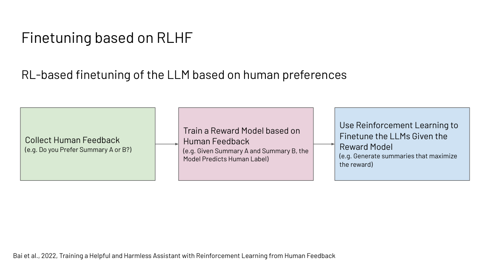
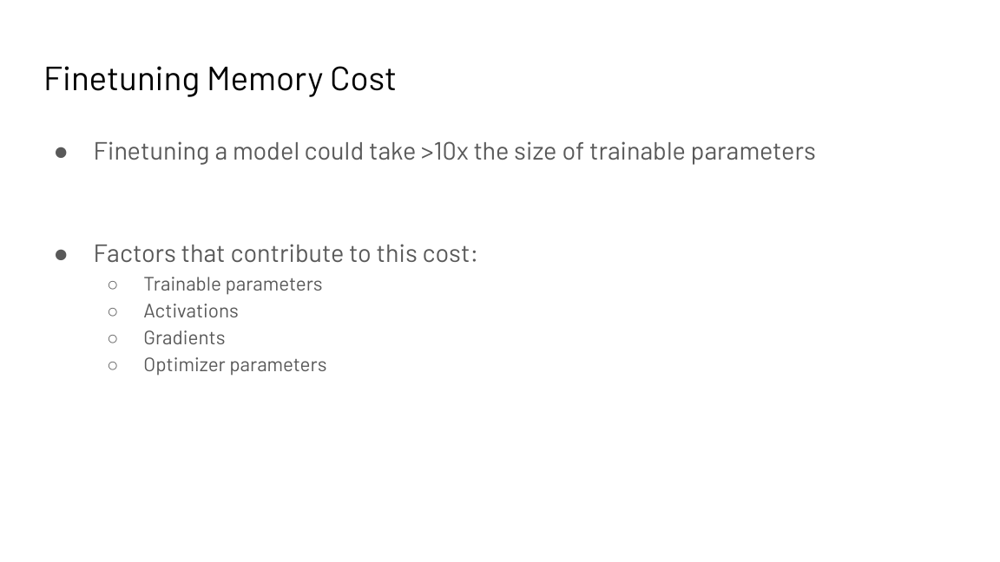
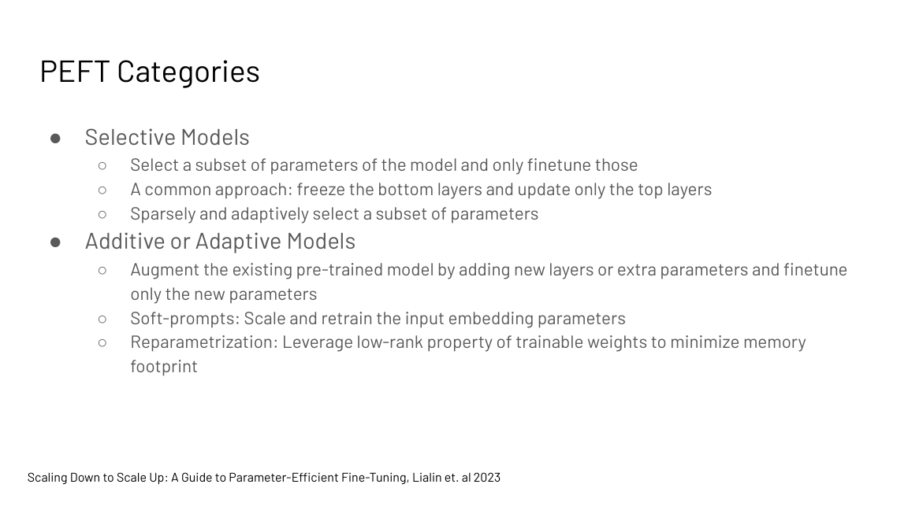
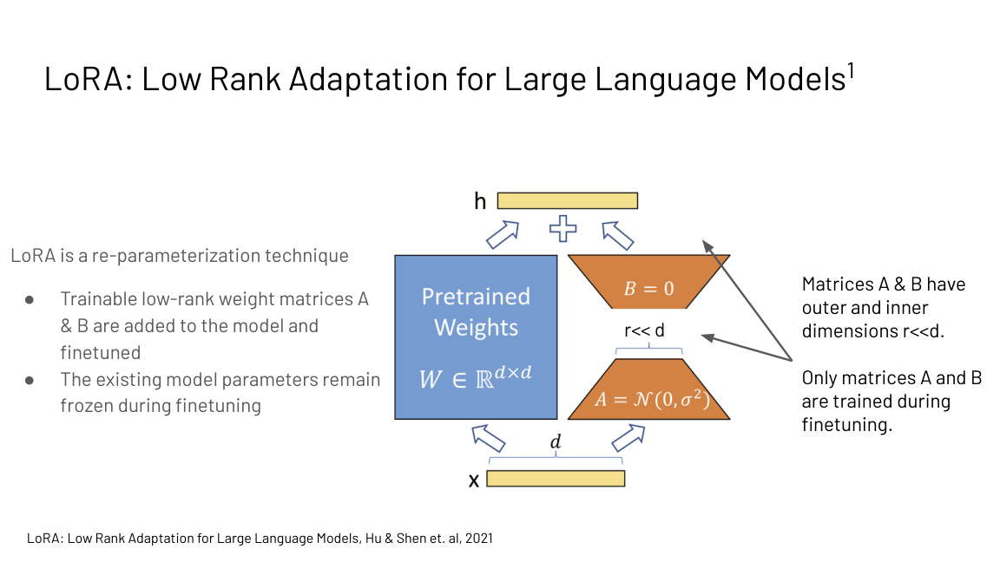
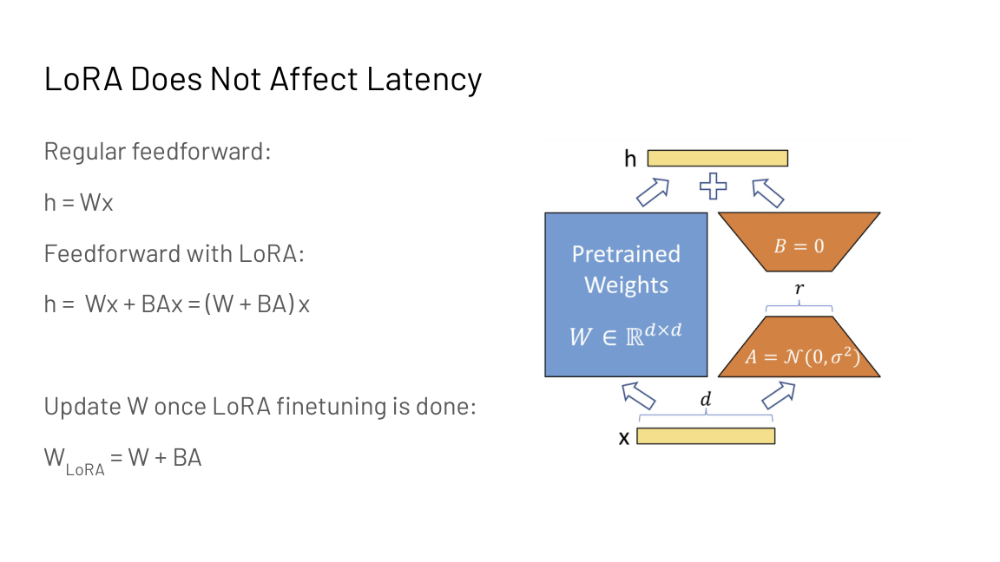

## How to read this lesson

**Level 1 (Core)** follows the lecture's arc: base models need
fine-tuning to be useful, RLHF and Constitutional AI supply the
fine-tuning, and PEFT supplies the systems answer to its cost.
**Level 2 (Deep)** derives LoRA's merge math and the PEFT
taxonomy. The alignment theory continues in [CS329H](../cs329h/)
(preference pairs) and [CS336 L15](../cs336/l15-post-training.html);
this lecture is the systems framing.

## Level 1: Base models do not follow instructions

A pretrained LLM predicts the next token on web text. Ask it to
translate "cheese" to French and it may continue the prompt with
more translation examples instead of answering. It completes; it
does not follow instructions.

| Model | Prompt "Translate cheese to French" | Behavior |
|---|---|---|
| Base (pretrained) | Continues with more examples | Completes the text |
| Instruction-tuned | Answers: "fromage" | Follows the instruction |

Instruction tuning fixes this. Take the pretrained model and
fine-tune it on collections of tasks, up to millions of tokens
against trillions of pretraining tokens. The tuned model gains
zero-shot and few-shot performance and becomes more useful,
harmless, and truthful. Every commercial assistant (GPT-4, Claude,
Bard) is extensively fine-tuned this way.

Instruction data comes from three sources: human workers writing
QA, style transfer, and summarization examples; templates over
existing labeled data; and AI-generated data from an already
instruction-tuned model.

## Level 1: RLHF in three steps

Instruction tuning is supervised. Reinforcement learning goes
further: reward the model for useful and safe samples and optimize
the reward directly.



1. **Collect human preferences.** Humans rank model outputs by
   usefulness, harmfulness, and truthfulness (Stiennon et al.,
   2020). The key trick from Christiano et al. (2017): train on
   preferences, not demonstrations. Ranking two summaries is far
   cheaper than writing one, and they needed labels on under 1% of
   interactions.
2. **Train a reward model.** A model that predicts the human label:
   given summaries A and B, which would a human prefer?
3. **RL-fine-tune the LLM.** Generate samples that maximize the
   reward model's score.

RLHF drastically improves scaling on summarization and on code
tasks (Bai et al., 2022). But it is not itself scalable: human
labels are costly and slow, and optimizing against human raters can
produce evasive responses that trade helpfulness for harmlessness.

## Level 1: Constitutional AI replaces labels with principles

Constitutional AI (Bai et al., 2022, used in Claude) replaces tens
of thousands of human labels with about ten human-written
principles: a constitution describing desired behavior. Humans
write the constitution; AI does the rest.

Phase 1, supervised: the model critiques its own responses against
the constitution ("identify specific ways this response is
harmful...") and revises them. Fine-tune on the revisions.
Harmlessness rises with more revisions while helpfulness dips;
the sum improves monotonically.

Phase 2, RLAIF: train a preference model on the phase-1 model's
responses judged against the constitution, then RL-fine-tune the
LLM to maximize that AI preference model. No humans in the loop.

Why it matters: higher-quality supervision (AI already beats humans
at judging in some domains), more transparency (the constitution is
inspectable), scalability (AI labels in parallel), and cost. On the
scaling plots it matches or beats RLHF for helpfulness and
harmlessness, especially with chain-of-thought judging.

The full development flow: pretrain unsupervised, prompt
(zero/few-shot, chain-of-thought), instruction-tune supervised,
RLHF or RLAIF, evaluate on downstream tasks. Fine-tuning quality
also rises with more tasks, larger models, and chain-of-thought in
the tuning mix (Chung et al., 2022).

> [!QA]
> Q: Contrast RLHF and Constitutional AI in one breath each.
> A: RLHF trains a reward model on human preference rankings, then RL-optimizes the LLM against it; it works but needs costly human labels. Constitutional AI replaces the labels with a short human-written constitution: the model critiques and revises its own outputs against the principles, then a preference model trained on AI judgments drives the RL step. Same three-stage shape, AI feedback instead of human feedback.
> Follow-up: Why is AI feedback higher quality than human feedback in some cases?
> A: Because the AI judge can already surpass humans on the task being judged, as in games or specialized domains, and it applies the constitution consistently at scale. Humans are expensive, slow, and inconsistent. The risk is that the AI judge's blind spots become the model's blind spots, which is why the constitution stays human-written.

## Level 1: Fine-tuning is a systems problem

Two costs motivate parameter-efficient fine-tuning.

**Cost.** Fine-tuning memory can exceed 10x the trainable
parameters: the parameters themselves, activations, gradients, and
optimizer state (Adam keeps fp32 copies, momentum, and variance).
A 7B model at full fine-tune needs far more than 14 GB.



**Deployability.** A separate full-size model per task is
prohibitive to store and serve. Ten tasks means ten models.

PEFT's key idea: fine-tune a small number of parameters instead of
all of them. Cost falls, the base model's capabilities stay intact
(less forgetting), and per-task artifacts shrink to megabytes.

## Level 1: The PEFT taxonomy



**Selective.** Tune a subset of existing parameters. Common:
freeze the bottom layers, update only the top layers. Or select
sparsely and adaptively.

**Additive or adaptive.** Add new parameters and tune only those.
Soft prompts: trainable embeddings prepended to the input.
Reparametrization: exploit low-rank structure of the updates to
minimize the footprint.

**Hybrid.** Combine the above.

## Level 1: Soft prompts

Prompt tuning (Lester et al., 2021): prepend m tunable tokens to
the input embeddings. Each prompt token has a learnable embedding;
the base model stays frozen. The tuned parameters are a single
m by e matrix, where e is the embedding size. Backprop trains only
the soft prompt.

```
P_theta_p(Y | p1, ..., pm, x1, ..., xt)
theta_p : m x e matrix (m prompt tokens, e embedding size)
```

Model tuning trains one full model per task. Prompt tuning trains
one tiny prompt per task on one frozen model. P-Tuning v2 extends
prompts to deeper layers with reparametrization, matching
fine-tuning across scales on many tasks. LLaMA-Adapter prepends
trainable prompts with zero-init gating: the attention scores
split into adapter and text parts, and a learnable gate g starting
at zero scales the adapter's contribution up gradually, so the
model starts from its pretrained behavior and absorbs instructions
over training.

## Level 1: LoRA

LoRA (Hu et al., 2021) is reparametrization: add trainable
low-rank matrices A and B to a frozen weight, with inner
dimension r much smaller than d. Only A and B train.



The forward pass: h = Wx + BAx = (W + BA)x. After fine-tuning,
merge once: W_LoRA = W + BA. Merged, inference is exactly one
matmul: **LoRA adds zero latency**. Per task, swap in that task's
(A, B) pair; the base model never changes.



Applied to transformers, LoRA targets the self-attention weights;
Wq and Wv work best empirically. Rank r is tuned per task, and
small r suffices for many tasks. The systems win is deployability:
one frozen base model plus tiny per-task adapters, switchable at
request time.

> [!QA]
> Q: Why does LoRA add no inference latency?
> A: Because the adapter merges into the weights. During training the layer computes h = Wx + BAx, but after fine-tuning you add BA into W once: W_LoRA = W + BA. Inference then runs a single matmul with the merged weight, exactly as fast as the original model. The adapter exists only at training and storage time.
> Follow-up: A team serves 50 fine-tuned variants of one 7B model. Compare full fine-tuning versus LoRA storage.
> A: Full fine-tuning stores 50 copies of 14 GB: 700 GB. LoRA stores one 14 GB base plus 50 adapters of a few megabytes each: roughly 14 GB total. Serving can also batch requests across tasks on the shared base and swap adapters per request.

## Recap: the whole lesson on one screen

<div class="recap-grid">
<div class="recap-card">

<div class="rc-body">
<strong>1. Base models complete; assistants follow</strong>
<p>Pretraining teaches next-token prediction. Instruction tuning
on task collections teaches following instructions.</p>
<p class="rc-num">Key: trillions pretrain, millions tune</p>
</div>
</div>
<div class="recap-card">

<div class="rc-body">
<strong>2. RLHF: preferences, reward, optimize</strong>
<p>Humans rank outputs. A reward model learns the ranking. RL
maximizes the reward. Preferences beat demonstrations on cost.</p>
<p class="rc-num">Key: under 1% labeled</p>
</div>
</div>
<div class="recap-card">

<div class="rc-body">
<strong>3. Constitutional AI swaps labels for principles</strong>
<p>Ten human principles replace ten thousand labels. Self-critique
plus revisions, then RLAIF. Scalable, inspectable, cheap.</p>
<p class="rc-num">Key: AI feedback, human constitution</p>
</div>
</div>
<div class="recap-card">

<div class="rc-body">
<strong>4. Fine-tuning costs over 10x the weights</strong>
<p>Parameters plus activations plus gradients plus optimizer
state. And one full model per task is undeployable.</p>
<p class="rc-num">Key: memory is the tax</p>
</div>
</div>
<div class="recap-card">

<div class="rc-body">
<strong>5. PEFT tunes a few parameters</strong>
<p>Selective (subset of weights), additive (soft prompts,
adapters), reparametrization (low-rank). Or hybrids.</p>
<p class="rc-num">Key: small updates, kept capabilities</p>
</div>
</div>
<div class="recap-card">

<div class="rc-body">
<strong>6. Soft prompts: train the input</strong>
<p>Prepend m tunable embeddings; freeze the model. One m-by-e
matrix per task. P-Tuning v2 and LLaMA-Adapter extend it.</p>
<p class="rc-num">Key: one frozen model, many prompts</p>
</div>
</div>
<div class="recap-card">

<div class="rc-body">
<strong>7. LoRA: low-rank updates, zero latency</strong>
<p>Train A and B with r much smaller than d; merge into W after.
Applies best to Wq and Wv. Swap adapters per task.</p>
<p class="rc-num">Key: W_LoRA = W + BA</p>
</div>
</div>
<div class="recap-card">

<div class="rc-body">
<strong>8. The merge is the trick</strong>
<p>h = Wx + BAx becomes one matmul. Training-time structure,
inference-time invisibility. That is why LoRA won.</p>
<p class="rc-num">Key: merge once, serve fast</p>
</div>
</div>
</div>

## Official sources and further reading

**Official:**
- Fine-tuning Large Language Models slide deck (Fall 2023 headers).

**Further reading:**
- Bai et al., "Training a Helpful and Harmless Assistant with RLHF" (2022).
- Bai et al., "Constitutional AI: Harmlessness from AI Feedback" (2022).
- Hu et al., "LoRA" (2021).
- Lester et al., "The Power of Scale for Parameter-Efficient Prompt Tuning" (2021).
- Lialin et al., "Scaling Down to Scale Up" (2023): the PEFT survey behind the taxonomy.
- [CS336 L15](../cs336/l15-post-training.html): post-training in full.
- [CS329H](../cs329h/): preference pairs and alignment theory.

**Caveats from these sources.** The "10x" fine-tuning memory
figure is an order-of-magnitude rule; exact ratios depend on
optimizer, precision, and activation checkpointing. LoRA's "Wq and
Wv best" is empirical on the paper's tasks. Constitutional AI's
scaling plots compare specific model sizes; the harmlessness-helpfulness
tradeoff shape is the finding that holds.

## Connections to the other courses

- **CS336 L15:** post-training: instruction tuning and RLHF derived in full.
- **CS329H:** preference pairs: the alignment object, defined there and reused in RLHF.
- **CS229S L07:** quantization as an orthogonal shrink for fine-tuned models.
- **CS229S L10:** FSDP and ZeRO: the distributed-systems answer to the same memory tax.

> [!CHEAT]
> **Fine-tuning cheatsheet.** Base model: completes, does not follow instructions. Instruction tuning: fine-tune on task collections (millions of tokens); improves zero/few-shot, usefulness, harmlessness, truthfulness. Data: human, template, AI-generated. RLHF: 1) human preference ranks, 2) reward model, 3) RL optimize. Christiano 2017: <1% labels. Not scalable: costly, evasive. Constitutional AI: ~10 principles replace ~10k labels; phase 1 SL on self-critique+revisions; phase 2 RLAIF on AI preference model. Flow: pretrain -> prompt -> instruct-tune -> RLHF/RLAIF -> eval. PEFT: fine-tune few params; memory >10x trainable (params+activations+grads+optimizer). Selective / additive-adaptive / hybrid. Prompt tuning: m tunable tokens, m-by-e matrix, frozen base. LLaMA-Adapter: zero-init gate on adapter attention. LoRA: h=Wx+BAx=(W+BA)x; merge W_LoRA=W+BA; r<<d; Wq,Wv best; zero inference latency; swap adapters per task.

> [!MEMORY]
> **Adaptation in one line.** Teach the model to follow instructions with feedback, then teach it cheaply by training almost nothing.
