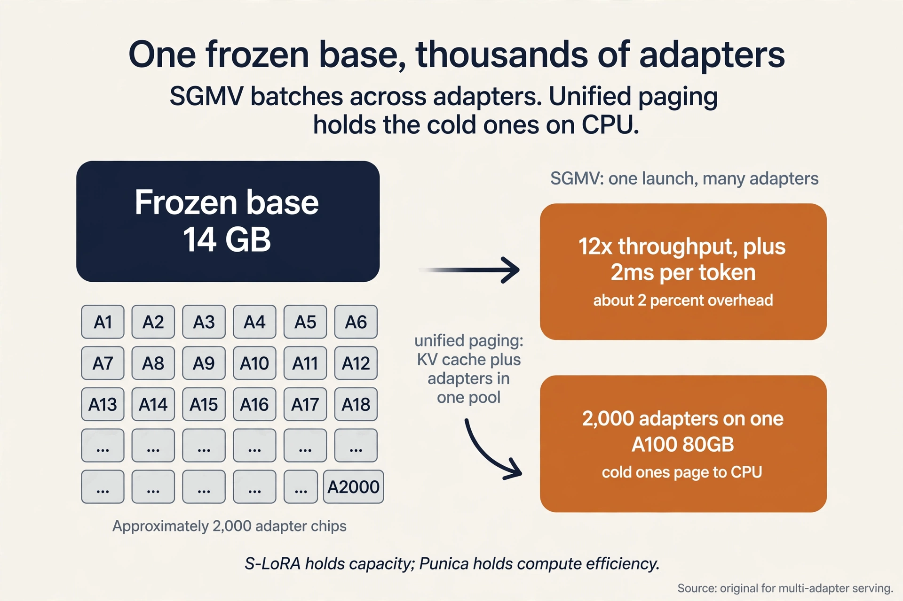

### Coverage and sourcing

This lesson follows the CS229S "Fine-tuning Large
Language Models" slide deck (Fall 2024 offering, Fall
2023 headers), taught by Azalia Mirhoseini. The deck's
arc runs: the base-model vs assistant gap, instruction
tuning, RLHF in three steps, Constitutional AI and
RLAIF, the 10x fine-tuning memory cost, and the PEFT
taxonomy (selective, additive, reparametrization) with
soft prompts, LLaMA-Adapter, and LoRA worked in full.
The lesson adds the post-deck history, each fact dated:
DPO (2023), QLoRA (2023), Punica and S-LoRA multi-adapter
serving (2023-2024), and the 2025-2026 post-training
shift to the modular stack (SFT, supervised fine-tuning, preference
optimization, RLVR with GRPO), with October 2026 updates
throughout. CS229 L15 covers LoRA from the modeling
side (full fine-tune vs LoRA, the adaptation decision).
This lesson covers it from the systems side: the memory
math, the merge property, and serving many adapters on
one base model.

## The problem: a brilliant parrot

A pretrained language model has read the internet. Ask it
"Translate cheese from English to French" and it may reply
with "Translate cheese from English to Spanish" and
"Translate cheese from French to English": more examples
in the same pattern. It completes text. It does not
follow instructions. A fine-tuned model answers: the
French word for cheese is "fromage".

That gap is the whole lecture. Pretraining teaches
next-token prediction on vast text. **Fine-tuning**
updates the weights so the model follows instructions and
aligns with human intent. Every commercial assistant is
extensively fine-tuned this way.

The systems question hides inside the behavior story.
Pretraining runs once, on a cluster, for months.
Fine-tuning runs constantly: per task, per customer, per
deployment. If each fine-tune costs nearly as much as
pretraining, only the richest labs can adapt models. The
lecture's second half is about making adaptation cheap.

## First attempt: instruction tuning

The direct fix is supervised. Take the pretrained model
and fine-tune it on collections of tasks. The scale
contrast is the point: pretraining runs on up to
trillions of tokens. Instruction tuning runs on up to
millions. A million is a rounding error next to a
trillion: the tuning budget is roughly a millionth of
the pretraining budget. The tuned model gains zero-shot
and few-shot performance and becomes more useful,
harmless, and truthful.

**Zero-shot** means the model handles a task it never saw
in training, from the instruction alone. **Few-shot**
means it sees a handful of examples in the prompt. Both
work only after instruction tuning teaches the model the
general shape of "follow the instruction."

Instruction data comes from three sources. Human workers
write question answering, style transfer, recommendation,
summarization, and rule-based examples. Templates turn
existing labeled data into instruction format: a
sentiment dataset becomes "Classify the sentiment of
...". And an already instruction-tuned AI generates more
data: synthetic instructions at machine speed. Fine-tuning
quality rises with the number of tasks, the model size,
and chain-of-thought instructions in the mix (Chung et
al., 2022).

Public recipes as of 2026: Google's FLAN collection and
Allen AI's Tulu datasets are the open instruction-tuning
standards. Tulu 3 (November 2024) is also where RLVR was
named as a post-training method. The datasets are public.
The exact vendor mixes are not.

| Model | Prompt "Translate cheese to French" | Behavior |
|---|---|---|
| Base (pretrained) | Continues with more examples | Completes the text |
| Instruction-tuned | Answers: "fromage" | Follows the instruction |

### Subchapter: the forgetting tax

Fine-tuning on new data erodes old capabilities: the
model learns the task format and forgets pretraining
knowledge it no longer rehearses. As you learned in CS229
L15, the SFT (supervised fine-tuning) stage prices this
forgetting tax explicitly.
The systems mitigation is the same one this lecture
builds toward: train fewer parameters, and the frozen
majority keeps what it knew. Instruction tuning on the
full model pays the tax. PEFT mostly does not.

## The key question

Instruction tuning is supervised: it teaches from
demonstrations. But demonstrations are expensive, and
some goals (be safe, be helpful) are easier to judge than
to demonstrate. Can we align the model from *preferences*
instead?

## RLHF in three steps

**Reinforcement learning from human feedback** rewards
the model for useful and safe samples and optimizes the
reward directly. Three steps:


1. **Collect human preferences.** Humans rank model
   outputs by usefulness, harmfulness, and truthfulness
   (Stiennon et al., 2020). The key trick (Christiano et
   al., 2017): train on preferences, not demonstrations.
   Ranking two summaries is far cheaper than writing one,
   and they needed labels on under 1% of interactions.
2. **Train a reward model.** A model that predicts the
   human label: given summaries A and B, which would a
   human prefer? The **Bradley-Terry** loss turns each
   ranking into a probability: the preferred response
   should score higher.
3. **RL-fine-tune the LLM.** Generate samples that
   maximize the reward model's score, with a KL penalty
   keeping the policy near the original model so it does
   not drift into reward-hacking gibberish. **PPO**
   (proximal policy optimization) is the classic
   optimizer: it also trains a **value model** (a critic)
   that predicts expected reward, which doubles the
   models in memory.

RLHF drastically improves scaling on summarization and on
code tasks (Bai et al., 2022). But it is not itself
scalable: human labels are costly and slow, and
optimizing against human raters can produce evasive
responses that trade helpfulness for harmlessness.

### Subchapter: the four-model memory bill

Count what PPO-based RLHF holds in memory: the policy
being trained, the frozen reference policy (for the KL
penalty), the reward model, and the value model. Four
models, plus each one's optimizer state. This is why RLHF
is a cluster job twice over: the behavior needs the
labels, and the systems need the memory. Every method
below deletes at least one of these four.

### Subchapter: DPO, the RLHF shortcut

RLHF trains a reward model and then runs RL against it:
two models, one unstable optimizer. **DPO** (direct
preference optimization, Rafailov et al., 2023) deletes
both. The preference pairs train the policy directly:
increase the likelihood of the preferred response
relative to the rejected one, with a KL penalty to the
reference model folded into the loss.

Same inputs (human rankings), one training run, no reward
model, no RL. Open instruction-tuned models widely
adopted it (Zephyr and its successors are public
examples). The price: DPO inherits the preference data's
limits, and very long RL-style exploration is outside its
reach. For the common case (align a chat model on
rankings), it is the default answer as of 2026.


## The key question, again

RLHF replaced demonstrations with rankings, but humans
are still in the loop for every label. Can we drop the
humans entirely?

## Constitutional AI: labels to principles

**Constitutional AI** (Bai et al., 2022, used in Claude)
replaces tens of thousands of human labels with about
ten human-written principles: a constitution describing
desired behavior. Humans write the constitution. AI does
the rest.

Phase 1, supervised learning. The model critiques its own
responses against the constitution ("identify specific
ways this response is harmful, unethical, racist, sexist,
toxic, dangerous, or illegal") and revises them ("rewrite
the response to remove any and all harmful content").
Fine-tune on the revisions. Harmlessness rises with more
revisions while helpfulness dips. The sum of the two
improves monotonically.

Phase 2, **RLAIF** (reinforcement learning from AI
feedback). Train a preference model on the phase-1
model's responses judged against the constitution, then
RL-fine-tune the LLM to maximize that AI preference
model. No humans in the loop.

Why AI feedback can beat human feedback: higher-quality
supervision (AI already surpasses humans in games, chip
floorplanning, and diagnostics imaging), more
transparency (the constitution is inspectable),
scalability (AI labels in parallel), and cost. On the
scaling plots it matches or beats RLHF for helpfulness
and harmlessness, especially with chain-of-thought
judging.

The full development flow: pretrain unsupervised, prompt
(zero/few-shot, chain-of-thought), instruction-tune
supervised, RLHF or RLAIF, evaluate on downstream tasks.

## What changed since 2024: the modular stack

The 2024 lecture ends at RLHF vs RLAIF. By October 2026
the field had settled on a modular post-training stack,
and the trend is unmistakable: away from PPO plus a
learned reward model, toward DPO-family methods for
general alignment and verifiable-reward RL for reasoning.

**Preference optimization** generalized DPO. SimPO, KTO,
and ORPO keep DPO's shape (one loss on preference pairs,
no reward model, no RL) and change the details: SimPO
drops the reference model, KTO learns from unpaired
good/bad examples, ORPO folds the preference loss into
the SFT stage itself. The family trades the RL machinery
for a stable supervised run. Bounded by the pairs, but
cheap and reliable.

**RLVR** (reinforcement learning with verifiable
rewards) handles reasoning. Where correctness can be
checked by a program (math answers, unit tests, symbolic
solvers), the reward comes from the verifier, not from a
human or a learned model. Tulu 3 named it in November
2024. DeepSeek-R1-Zero (January 2025) showed pure RLVR
could produce reasoning: GRPO on the base model with
rule-based rewards, no supervised fine-tuning first.

**GRPO** (group relative policy optimization) is the
optimizer that made RLVR cheap. Introduced in DeepSeekMath
(February 2024), it samples a group of responses per
prompt and computes advantages by comparing within the
group. PPO's learned value model, the critic, is gone:
the group baseline replaces it. One fewer model in
memory, and the systems win is direct: the four-model
bill from the subchapter above loses the critic.

The 2026 stack in one line: SFT for instruction
following, preference optimization (DPO/SimPO/KTO) for
alignment, RL with verifiable rewards (GRPO, and its
open successor DAPO: decoupled clip and dynamic
sampling policy optimization, which adds dynamic
sampling to GRPO's group baseline) for reasoning. Human labels survive where reward is
irreducibly fuzzy. Everywhere checkable, the verifier
replaced the rater.

### Subchapter: the systems shape of modern RL

Online RL samples responses during training: the policy
generates rollouts, the verifier scores them, the update
follows. Generation during training is serving: the
2026 RL frameworks (TRL, verl, OpenRLHF) run vLLM inside
the training loop to produce rollouts fast. The
inference engine from L04/L06 became a training
component. The interview point: post-training systems
and serving systems converged. The same kernels serve
users by day and generate RL rollouts by night.

## The key question, once more: what does fine-tuning cost?

The behavior story is done. Now the systems story,
because fine-tuning at LLM scale is a systems problem
twice over.

**Cost.** Fine-tuning memory can exceed 10x the trainable
parameters. Four contributors: the parameters themselves,
the activations, the gradients, and the optimizer state
(Adam keeps fp32 copies, momentum, and variance). A 7B
model at full fine-tune needs far more than 14 GB.


### Subchapter: the 10x, worked on a 7B model

Weights in FP16: 14 GB. Gradients in FP16: another 14
GB. Adam keeps three FP32 states per parameter: a master
copy of the weights (28 GB), momentum (28 GB), variance
(28 GB). Subtotal: 112 GB, already 8x the weights. Add
activations for the backward pass: past 140 GB, over 10x.

This is why full fine-tuning is a cluster job and PEFT is
a laptop job. Every term in the sum is proportional to
the trainable parameter count, so training 0.06 percent
of the parameters (LoRA below) divides the whole bill.


### Subchapter: the three classical relief valves

Before PEFT, three systems tricks attacked the same sum.

**Activation checkpointing** deletes the activations term
and recomputes it. As you learned in CS229S L03, the
workload is memory bound, so recompute is cheap. The
trade: store checkpoints every sqrt(n) layers, recompute
the segments between them. Memory falls from O(n) to
O(sqrt(n)) layer-activations. Time rises about 30%.

**Gradient accumulation** splits the batch into
micro-batches, accumulating gradients without updating.
Activation memory falls with the micro-batch size. The
trade: more forward-backward passes per update, and the
optimizer state never shrinks.

**Sharding** (L10) partitions the optimizer state and
gradients across GPUs: ZeRO-1 and ZeRO-2, or FSDP. The
trade: communication. None of the three changes the
trainable count. PEFT does.

**Deployability.** A separate full-size model per task is
prohibitive to store and serve. Ten tasks means ten
models. Fifty tasks means fifty 14 GB copies: 700 GB for
fifty 7B variants. The storage scales with tasks, not
with the base model.

Can we adapt the model without touching all its weights?

## Parameter-efficient fine-tuning

**PEFT** fine-tunes a small number of parameters instead
of all of them. Cost falls, the base model's capabilities
stay intact (less forgetting), and per-task artifacts
shrink to megabytes.


The taxonomy (Lialin et al., 2023) has three families.
**Selective** methods tune a subset of existing
parameters: freeze the bottom layers, update only the top
layers, or select sparsely and adaptively. **Additive or
adaptive** methods add new parameters and tune only
those. **Hybrid** methods combine the above. Each family
below is built from zero, then consolidated.

## Soft prompts: train the input

The idea is small. **Prompt tuning** (Lester et al.,
2021) prepends m tunable tokens to the input embeddings.
Each prompt token has a learnable embedding. The base
model stays frozen. The tuned parameters are a single m
by e matrix, where e is the embedding size. Backprop
trains only the soft prompt:

```
P_theta_p(Y | p1, ..., pm, x1, ..., xt)
theta_p : m x e matrix (m prompt tokens, e embedding size)
```

Work the size. m = 100 prompt tokens, e = 4096: 409,600
parameters. Against 7B: 0.006 percent. Model tuning
trains one full model per task. Prompt tuning trains one
tiny prompt per task on one frozen model. P-Tuning v2
extends prompts to deeper layers with reparametrization,
matching fine-tuning across scales on many tasks.

The price: soft prompts work best at large scale (Lester
et al., 2021). Small models lack the capacity to steer
with so few parameters. The method's cost is nearly zero,
and so is its capacity.

**LLaMA-Adapter** prepends trainable prompts with
zero-init gating. The attention scores split into adapter
and text parts, and a learnable gate g starting at zero
scales the adapter's contribution up gradually. The model
starts from its pretrained behavior and absorbs
instructions over training instead of being shocked by
them on step one.

## LoRA: train the update

The trick is algebraic. **LoRA** (Hu et al., 2021) adds
trainable low-rank matrices A and B to a frozen weight,
with inner dimension r much smaller than d. This is
reparametrization: only A and B train.


The forward pass: h = Wx + BAx = (W + BA)x. After
fine-tuning, merge once: W_LoRA = W + BA. Merged,
inference is exactly one matmul: **LoRA adds zero
latency**. Per task, swap in that task's (A, B) pair. The
base model never changes.


### Subchapter: the LoRA parameter math, worked

One attention matrix at d = 4096: W has 4096^2 = 16.8M
parameters. LoRA with r = 8 trains A (8 by 4096) and B
(4096 by 8): 2 x 4096 x 8 = 65,536 parameters. Ratio:
16.8M / 65,536 = 256x fewer per matrix.

Apply to Wq and Wv across 32 layers: 32 x 2 x 65,536 =
4.2M trainable parameters. Against 7B: 0.06 percent. The
optimizer states, gradients, and activations all scale
with the trainable count, so the 10x memory bill from
the last section collapses to megabytes.


### Subchapter: the merge property, and why it matters for serving

Compare LoRA with adapters that do not merge. A
bottleneck adapter inserts extra layers: every request
pays the extra matmuls forever. LoRA's update is linear
in the weights, so it folds into W exactly once, before
serving starts. The served model is indistinguishable
from a fully fine-tuned model in latency and in math.

This is why the serving story below works: the base
model stays frozen and shared, each task's adapter is a
small (A, B) pair, and merging is optional per request.
Unmerged adapters cost a small per-request matmul. Merged
adapters cost nothing. The choice is per deployment, not
per method.

### Subchapter: LoRA variants, the systems-relevant ones

**AdaLoRA** allocates the rank budget adaptively: more
rank to important layers, less to unimportant ones,
pruning singular values during training. Same merge
property, better rank efficiency. The systems win: equal
quality at lower total rank, so smaller adapters.

**DoRA** decomposes the update into magnitude and
direction: train a magnitude vector plus a directional
LoRA. Closer to full fine-tuning behavior on hard tasks,
still merges into W. The systems price: slightly more
trainable parameters than LoRA at the same rank.

Both keep what makes LoRA a systems trick: frozen base,
tiny trainable count, zero-latency merge.

### Subchapter: QLoRA, the memory answer

LoRA shrinks the trainable count, but the frozen base
still sits in FP16: 14 GB for 7B, 130 GB for 65B.
**QLoRA** (Dettmers et al., 2023) quantizes the frozen
base to 4-bit (**NF4**, a 4-bit float shaped for the
normal distribution of weights) and trains LoRA adapters
on top. The base is read in 4-bit and dequantized on the
fly. Gradients flow only into the adapters.

Two more memory tricks inside. **Double quantization**
quantizes the quantization constants themselves: the
per-block scales get their own smaller scales. **Paged
optimizers** spill optimizer state to CPU memory when a
spike would OOM the GPU, paging it back as needed: the
same virtual-memory idea as OS paging, applied to Adam.

The worked result: a 65B model in 4-bit is 32.5 GB. Add
LoRA adapters and their optimizer states: the full
fine-tune fits on one 48 GB GPU. Before QLoRA that run
needed a cluster with FSDP.


Applied to transformers, LoRA targets the self-attention
weights. Wq and Wv work best empirically. Rank r is tuned
per task, and small r suffices for many tasks.

## Serving many adapters: one base, thousands of tasks

Training cheap is half the story. Serving is the other
half. Fifty tasks as fifty merged models costs 700 GB
and fifty deployments. The systems answer: serve one
frozen base model and swap adapters per request.

The naive version fails. Batching assumes every request
uses the same weights: Y = X @ W. With per-request
adapters, request i needs Y_i = X_i @ (W + B_i A_i).
Different A_i, B_i per request breaks the batched GEMM
(general matrix multiply: one dense matrix-matrix
product).

**Punica** (Chen et al., 2023) fixed the kernel. The
**SGMV** (segmented gather matrix-vector) kernel gathers
each request's adapter weights and runs the low-rank
multiplication in one launch. One GPU holds a single
copy of the base model and serves many LoRA models:
12x higher throughput than the serving systems of 2023,
adding 2ms latency per token. The LoRA computation (rank
8 to 64) is tiny next to the base model's matmuls, so
the overhead is about 2%.

**S-LoRA** (Sheng et al., 2023) fixed the memory. Its
**unified paging** puts KV cache and adapter weights in
one memory pool, so thousands of adapters share the GPU
with the requests they serve. Custom Triton kernels
handle prefill with variable ranks and non-contiguous
memory. A modified BGMV (batched gather matrix-vector) kernel
handles decode. Result:
2,000 adapters on a single A100 80GB at 7.6+ requests
per second, 30x the throughput of HuggingFace PEFT.
Adapters the GPU cannot hold page to CPU memory: the
adapter weights are small enough (10-50 MB) that the
PCIe transfer is negligible next to inference latency.

Work the capacity. Fifty adapters at 40 MB each: 2 GB.
The base model is 14 GB. One GPU holds the base, all
fifty adapters, and the KV cache with room to spare.
Two thousand adapters at 40 MB: 80 GB, which is why
S-LoRA pages the cold ones to CPU.

**Compressed Multi-LoRA** (2024) shrinks the adapters
themselves: joint diagonalization factorizes each
adapter's B_i A_i into U Sigma_i V^T with U and V shared
across all adapters. Per-adapter parameters fall from
2dr to r: with U and V shared, only the r singular
values stay per adapter. 1.6x throughput, 99%+ quality
kept, integrated into vLLM.

Production as of October 2026: vLLM serves multiple
adapters concurrently (`--enable-lora`,
`--max-loras`), with LRU eviction when GPU memory fills
and a dynamic load/unload API for multi-tenant
deployments. SGLang serves LoRA adapters too. The
interview one-liner: the base model is the expensive
thing, adapters are megabytes, and the kernels batch
across adapters so one GPU serves thousands of tasks.



### Subchapter: the adapter design rules

Three rules for production adapter serving. One: keep
adapters small (rank 8-16) unless the task proves it
needs more. Adapter size is PCIe transfer time and GPU
residency. Two: pin hot adapters in GPU memory and page
the rest. LRU matches real traffic skew. Three: batch
across adapters with SGMV-class kernels, never serialize
per adapter. Serialization deletes continuous batching
(grouping live requests into shared GPU work instead of
serving them one at a time).
The systems win of PEFT is only realized if serving
batches across tasks.

## What is used where: real post-training

Post-training is how every assistant is made. Facts as
of October 2026.

| Step | Public examples | Status |
|---|---|---|
| Instruction tuning | FLAN (Google), Tulu (Allen AI) | public datasets and recipes |
| RLHF | OpenAI's methodology posts, Anthropic's 2022 papers | public methodology; vendor internals not public |
| RLAIF / Constitutional AI | Anthropic's Claude (Bai et al., 2022) | public papers |
| DPO family | Zephyr and open successors; SimPO, KTO, ORPO | public |
| GRPO / RLVR | DeepSeek-R1-Zero, Tulu 3; TRL, verl, OpenRLHF frameworks | public |
| LoRA / QLoRA | HuggingFace PEFT library | public; the default open stack |
| Multi-LoRA serving | vLLM (`--enable-lora`), SGLang; Punica, S-LoRA papers | public |
| Distilled reasoning | DeepSeek-R1 into Qwen2.5 and Llama 3 | public in the R1 report |

Which exact recipe GPT-6 or Gemini 4 uses is not public.
The shapes (preferences, reward or DPO, verifiable-reward
RL for reasoning, adapters for serving) are industry
standard. The details are proprietary.

## Mapping back: each cost gets its answer

| Fine-tuning pain | PEFT answer |
|---|---|
| Memory over 10x the weights | Train almost nothing: prompts are m by e, LoRA is rank r |
| One full model per task | One frozen base plus tiny per-task adapters, batched across tasks by SGMV |
| Forgetting the base capabilities | Frozen weights keep pretrained knowledge intact |
| Inference slowdown from adapters | LoRA merges into the weights: zero added latency |
| RLHF's four-model memory bill | DPO deletes reward model and RL; GRPO deletes the critic |

## The honest price

PEFT trades capacity for cost: a rank-r update cannot
express everything full fine-tuning can, and r must be
tuned per task. Soft prompts work best at large scale
(Lester et al., 2021). Constitutional AI's harmlessness
gains cost some helpfulness per revision, even as the
sum improves. DPO is bounded by its preference pairs:
it cannot explore beyond them. RLVR needs a verifier:
where correctness cannot be checked by a program, the
reward model or the human stays. And none of this
replaces the data: instruction tuning still needs
millions of quality tokens, however they are sourced.

## Coverage map: every lecture claim and where it lives

| Lecture claim | Covered in | File line |
|---|---|---|
| Base model completes; tuned model answers (cheese test) | The problem: a brilliant parrot | L67 |
| Instruction tuning: trillions vs millions of tokens; zero/few-shot gains | First attempt: instruction tuning | L90 |
| Instruction data: human workers, templates, AI-generated | First attempt: instruction tuning | L90 |
| Quality rises with tasks, size, chain-of-thought (Chung et al.) | First attempt: instruction tuning | L90 |
| FLAN, Tulu as public recipes (Oct 2026 update) | First attempt: instruction tuning | L90 |
| Forgetting tax; PEFT mitigates via frozen weights (CS229 L15 link) | the forgetting tax | L130 |
| RLHF three steps: preferences, reward model, RL fine-tune | RLHF in three steps | L150 |
| Christiano trick: preferences cheaper; under 1% labeled | RLHF in three steps | L150 |
| RLHF not scalable: label cost, evasive responses | RLHF in three steps | L150 |
| PPO four-model memory bill: policy, reference, reward, value | the four-model memory bill | L184 |
| DPO: one loss on pairs, no reward model, no RL | DPO, the RLHF shortcut | L194 |
| Constitutional AI: ten principles replace labels; self-critique plus revision | Constitutional AI: labels to principles | L220 |
| RLAIF: AI preference model drives RL; no humans | Constitutional AI: labels to principles | L220 |
| Full flow: pretrain, prompt, instruction-tune, RLHF/RLAIF, evaluate | Constitutional AI: labels to principles | L220 |
| Modular stack 2024-2026: SFT, DPO family, RLVR/GRPO (Oct 2026 update) | What changed since 2024: the modular stack | L256 |
| GRPO drops the critic; SimPO/KTO/ORPO variants | What changed since 2024: the modular stack | L256 |
| vLLM inside the RL training loop; serving meets training | the systems shape of modern RL | L300 |
| Fine-tuning memory over 10x: weights, activations, grads, Adam state | The key question, once more | L312 |
| 7B worked: 14+14+84+activations, past 140 GB | the 10x, worked on a 7B model | L326 |
| Checkpointing, accumulation, sharding as relief valves | the three classical relief valves | L341 |
| Deployability: 50 tasks as 50 models is 700 GB | The key question, once more | L312 |
| PEFT taxonomy: selective, additive/adaptive, hybrid (Lialin et al.) | Parameter-efficient fine-tuning | L371 |
| Prompt tuning: m x e matrix; 100 x 4096 = 409,600 params | Soft prompts: train the input | L388 |
| P-Tuning v2 deeper layers; LLaMA-Adapter zero-init gating | Soft prompts: train the input | L388 |
| LoRA: freeze W, train A and B; h = Wx + BAx; merge to zero latency | LoRA: train the update | L422 |
| LoRA math: 65,536 per matrix, 256x fewer; 4.2M total, 0.06% | the LoRA parameter math, worked | L439 |
| Merge property vs bottleneck adapters; per-deployment choice | the merge property, and why it matters for serving | L454 |
| AdaLoRA rank allocation; DoRA magnitude plus direction | LoRA variants, the systems-relevant ones | L470 |
| QLoRA: NF4 base, double quantization, paged optimizers; 65B on 48 GB | QLoRA, the memory answer | L487 |
| Punica SGMV: 12x throughput, +2ms/token, 2% overhead | Serving many adapters | L515 |
| S-LoRA unified paging: 2,000 adapters, 7.6+ req/s, 30x PEFT | Serving many adapters | L515 |
| 50 adapters at 40 MB: 2 GB vs 700 GB | Serving many adapters | L515 |
| Compressed Multi-LoRA: from 2dr to r, 1.6x, in vLLM | Serving many adapters | L515 |
| vLLM --enable-lora/--max-loras, LRU, load/unload API; SGLang (Oct 2026) | Serving many adapters | L515 |
| Adapter design rules: small rank, pin hot, batch across | the adapter design rules | L577 |
| Post-training table: FLAN/Tulu, RLHF, CAI, DPO, GRPO, PEFT, vLLM, R1 (Oct 2026) | What is used where | L591 |
| Each cost mapped to its PEFT answer | Mapping back | L612 |
| Honest price: capacity vs cost; DPO bounded by pairs; RLVR needs verifier | The honest price | L622 |

> [!QA]
> Q: Contrast RLHF and Constitutional AI in one breath each.
> A: RLHF trains a reward model on human preference rankings, then RL-optimizes the LLM against it. It works but needs costly human labels. Constitutional AI replaces the labels with a short human-written constitution: the model critiques and revises its own outputs against the principles, then a preference model trained on AI judgments drives the RL step. Same three-stage shape, AI feedback instead of human feedback.
> Follow-up: Why is AI feedback higher quality than human feedback in some cases?
> A: For the four reasons the lesson states: higher-quality supervision (AI already surpasses humans in games, chip floorplanning, and diagnostics imaging), more transparency (the constitution is inspectable), scalability (AI labels in parallel), and cost.

> [!QA]
> Q: Why does LoRA add no inference latency?
> A: Because the adapter merges into the weights. During training the layer computes h = Wx + BAx, but after fine-tuning you add BA into W once: W_LoRA = W + BA. Inference then runs a single matmul with the merged weight, exactly as fast as the original model. The adapter exists only at training and storage time.
> Follow-up: A team serves 50 fine-tuned variants of one 7B model. Compare full fine-tuning versus LoRA storage.
> A: Full fine-tuning stores 50 copies of 14 GB: 700 GB. LoRA stores one 14 GB base plus 50 adapters of a few megabytes each: roughly 14 GB total. Serving can also batch requests across tasks on the shared base and swap adapters per request, which is what Punica's SGMV kernel and S-LoRA's unified paging implement.

> [!QA]
> Q: What made Christiano et al.'s preference trick work?
> A: Preferences are cheaper than demonstrations. Ranking two summaries costs far less than writing one, and the reward model generalizes the rankings to new outputs. They needed labels on under 1% of interactions. The reward model becomes a cheap, always-available stand-in for the human judge.
> Follow-up: What goes wrong if the reward model is imperfect?
> A: The RL step optimizes the reward model's score, not true human preference. Flaws in the reward model become the policy's exploits: the classic failure is evasive responses that score high on harmlessness while being unhelpful. This is the "not scalable" critique the lecture levels at RLHF.

> [!QA]
> Q: How does LLaMA-Adapter's zero-init gating work?
> A: Trainable prompt tokens are prepended to the input, and their attention scores are scaled by a learnable gate g initialized to zero. Early in training the adapter contributes nothing, so the model behaves exactly as pretrained. g grows gradually and the instructions phase in. It avoids shocking the frozen model with random prompt embeddings on step one.
> Follow-up: How is this different from plain prompt tuning?
> A: Plain prompt tuning trains only the prepended embeddings at the input layer. LLaMA-Adapter adds the gating mechanism so the pretrained behavior is preserved at initialization, and P-Tuning v2 extends prompts to deeper layers with reparametrization. All three keep the base model frozen.

> [!QA]
> Q: Walk me through DPO versus RLHF, step by step.
> A: RLHF runs three trainings: collect human rankings, train a reward model on the rankings, then RL-optimize the policy against the reward model. DPO runs one: feed the same preference pairs into a single loss that raises the preferred response's likelihood relative to the rejected one, with the KL penalty to the reference model inside the loss. The reward model never exists. The RL loop never runs. You lose RL's long-horizon exploration, but for aligning a chat model on rankings, one stable supervised run beats a three-stage unstable one.
> Follow-up: When would you still pick RLHF over DPO?
> A: When the reward is not a static preference dataset: online settings where the reward model keeps learning from new interactions, or tasks needing extended trial-and-error that a single supervised loss cannot express. DPO is offline preference learning. RLHF with an evolving reward model is online.

> [!QA]
> Q: LoRA with r = 16 on all four attention matrices (Wq, Wk, Wv, Wo) of a 7B model (d = 4096, 32 layers). How many trainable parameters?
> A: Per matrix: 2 x 4096 x 16 = 131,072. Four matrices per layer: 524,288. Times 32 layers: 16.8M trainable parameters. Against 7B that is 0.24 percent. The paper's Wq-and-Wv-only recipe at r = 8 was 4.2M (0.06 percent). Doubling the rank and covering all four matrices quadruples it. The interview habit: 2 x d x r per matrix, times matrices, times layers.
> Follow-up: Does covering all four matrices beat Wq and Wv only?
> A: Sometimes, on harder tasks, but with diminishing returns: the paper found Wq and Wv best on its tasks. More matrices means more capacity and more memory. Tune r and the target set per task. The rank budget is the knob.

> [!QA]
> Q: How does S-LoRA serve 2,000 adapters on one GPU, and what does Punica add?
> A: S-LoRA's unified paging puts KV cache and adapter weights in one memory pool, so adapters share the GPU with the requests they serve and page to CPU when cold: 2,000 adapters on one A100 80GB at 7.6+ req/s, 30x HuggingFace PEFT. Punica's SGMV kernel solves the batching problem: one kernel launch processes requests targeting different adapters, so continuous batching works across tasks. S-LoRA handles memory capacity (more adapters than fit). Punica handles compute efficiency (heterogeneous batching). Production systems use both ideas.
> Follow-up: The adapters have different ranks (r=8, r=16, r=64). Can they batch together?
> A: Yes, with rank-aware batching: S-LoRA's Triton prefill kernels handle variable ranks and non-contiguous memory, and the scheduler groups by rank where it helps. Mixed-rank batching is a solved scheduling problem, not a blocker.

> [!QA]
> Q: Applied design: fine-tune a 70B model on 8x80GB GPUs. Full fine-tuning or PEFT?
> A: Full fine-tuning first needs the memory math: 140 GB of FP16 weights, 140 GB of gradients, 840 GB of Adam states, plus activations: over 1 TB. Even 8x80GB (640 GB) cannot hold it without sharding, so full fine-tuning means FSDP or ZeRO-3 across the node (Lecture 10). PEFT changes the job: QLoRA puts the 70B base in 4-bit (35 GB) and trains adapters, fitting on one or two GPUs. The design answer: full fine-tuning for maximum quality when you own the cluster and the data. QLoRA when you want the adaptation this week on hardware you have. Most open fine-tunes choose QLoRA.
> Follow-up: The task needs the model to learn genuinely new capabilities, not just a style. Does PEFT suffice?
> A: Often not. A rank-r update has limited capacity: it steers existing capabilities well but struggles to install new ones. New capabilities want more trainable parameters: higher rank, more target modules, or full fine-tuning. Match the capacity to the ambition: the lesson's rule is to tune r per task.

## Recap: the whole lesson on one screen

The story in ten steps. Each step answers the one before
it.

1. **Base models complete. Assistants follow.**
   Pretraining teaches next-token prediction. The cheese
   test: the base model continues the pattern, the tuned
   model answers.
2. **Instruction tuning teaches following.** Fine-tune on
   task collections: trillions of pretraining tokens,
   millions of tuning tokens. Better zero/few-shot,
   usefulness, harmlessness, truthfulness.
3. **RLHF: preferences, reward, optimize.** Humans rank
   outputs. A reward model learns the ranking. RL
   maximizes the reward. Preferences beat demonstrations:
   under 1% labeled. PPO holds four models in memory.
4. **RLHF is not scalable.** Human labels are costly and
   slow. Optimizing against raters breeds evasive
   responses.
5. **Constitutional AI swaps labels for principles.** Ten
   human principles replace ten thousand labels.
   Self-critique plus revisions, then RLAIF. Scalable,
   inspectable, cheap.
6. **Since 2024: the modular stack.** SFT, then DPO-family
   preference optimization, then RLVR with GRPO for
   reasoning. Each step deleted an expensive component:
   the reward model, the RL loop, the critic, the human.
7. **Fine-tuning costs over 10x the weights.** Parameters
   plus activations plus gradients plus optimizer state.
   Checkpointing, accumulation, and sharding relieve it.
   And one full model per task is undeployable.
8. **PEFT tunes almost nothing.** Selective (subset of
   weights), additive (soft prompts, adapters),
   reparametrization (low-rank). Or hybrids.
9. **LoRA merges and disappears.** Train A and B with r
   much smaller than d. Merge into W after. Zero
   inference latency. QLoRA adds a 4-bit base: 65B on one
   48 GB GPU. One base, many adapters.
10. **Serving batches across adapters.** Punica's SGMV
    kernel batches requests on different adapters. S-LoRA
    pages 2,000 adapters through one GPU. Adapters are
    megabytes. The base is the expensive thing.

## Go deeper

<div style="position:relative;padding-bottom:56.25%;height:0;overflow:hidden;max-width:100%;margin:16px 0;">
<iframe style="position:absolute;top:0;left:0;width:100%;height:100%;" src="https://www.youtube-nocookie.com/embed/t509sv5MT0w" title="LoRA Explained" frameborder="0" allow="accelerometer; autoplay; clipboard-write; encrypted-media; gyroscope; picture-in-picture" allowfullscreen></iframe>
</div>

- LoRA Explained: low-rank adaptation from zero: https://www.youtube.com/watch?v=t509sv5MT0w
- Visual Guide to LoRA: https://www.youtube.com/watch?v=dA-NhCtrrVE
- LoRA and QLoRA fine-tuning walkthrough: https://www.youtube.com/watch?v=lixMONUAjfs
- LoRA (Hu et al., 2021): https://arxiv.org/abs/2106.09685
- DPO: Direct Preference Optimization: https://arxiv.org/abs/2305.18290
- QLoRA: Efficient Fine-tuning of Quantized LLMs: https://arxiv.org/abs/2305.14314
- Punica: Multi-Tenant LoRA Serving: https://arxiv.org/abs/2310.18547
- S-LoRA: Serving Thousands of Concurrent LoRA Adapters: https://arxiv.org/abs/2311.03285
- The Power of Scale for Parameter-Efficient Prompt Tuning: https://arxiv.org/abs/2104.08691

## Official sources and further reading

**Official:**
- Fine-tuning Large Language Models slide deck (Fall 2023
  headers).

**Further reading:**
- Bai et al., "Training a Helpful and Harmless Assistant
  with RLHF" (2022).
- Bai et al., "Constitutional AI: Harmlessness from AI
  Feedback" (2022).
- Hu et al., "LoRA" (2021).
- Dettmers et al., "QLoRA" (2023).
- Lester et al., "The Power of Scale for Parameter-
  Efficient Prompt Tuning" (2021).
- Lialin et al., "Scaling Down to Scale Up" (2023): the
  PEFT survey behind the taxonomy.

**Caveats from these sources.** The "10x" fine-tuning
memory figure is an order-of-magnitude rule. Exact ratios
depend on optimizer, precision, and activation
checkpointing. LoRA's "Wq and Wv best" is empirical on
the paper's tasks. Constitutional AI's scaling plots
compare specific model sizes. The harmlessness-helpfulness
tradeoff shape is the finding that holds. Post-2024
developments (DPO family, GRPO, RLVR) are dated in the
text. Vendor internals remain proprietary.

## Connections to the other courses

- **CS336 L15:** post-training: instruction tuning and
  RLHF derived in full.
- **CS329H:** preference pairs: the alignment object,
  defined there and reused in RLHF.
- **CS229S L07:** quantization as an orthogonal shrink
  for fine-tuned models.
- **CS229S L10:** FSDP and ZeRO: the distributed-systems
  answer to the same memory tax.
- **CS229 L15:** LoRA from the modeling side: full
  fine-tune vs LoRA, the adaptation decision.
- **CS229 L17:** RL for LLMs: GRPO and RLVR in full.
