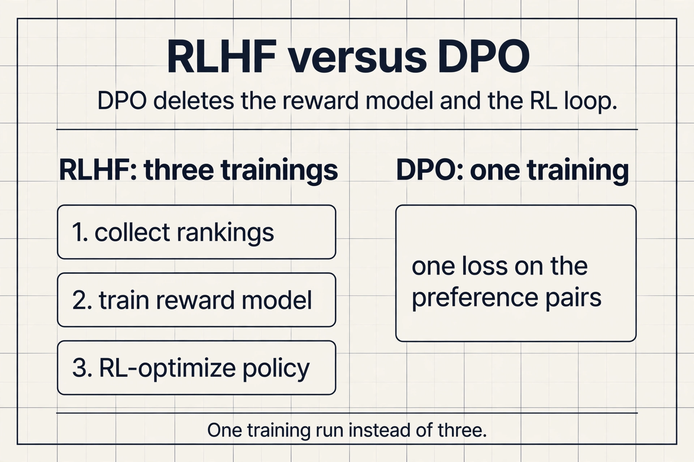
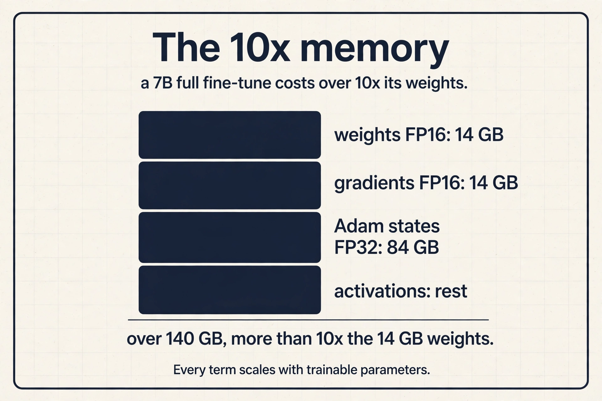
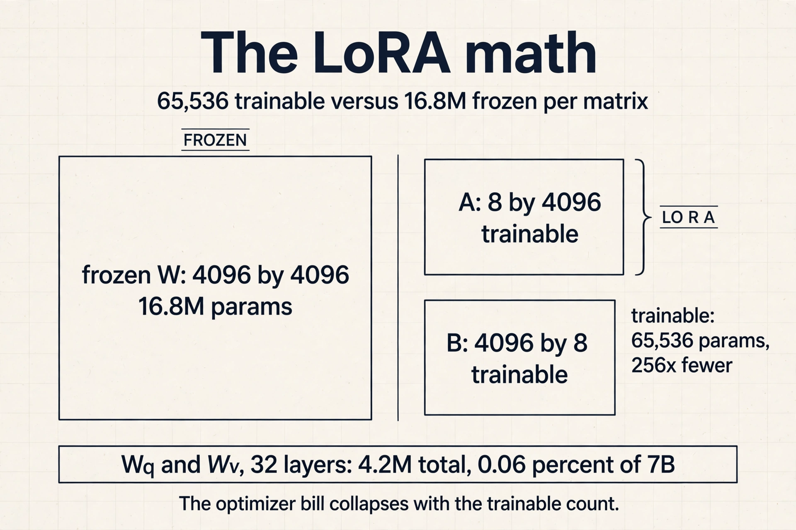
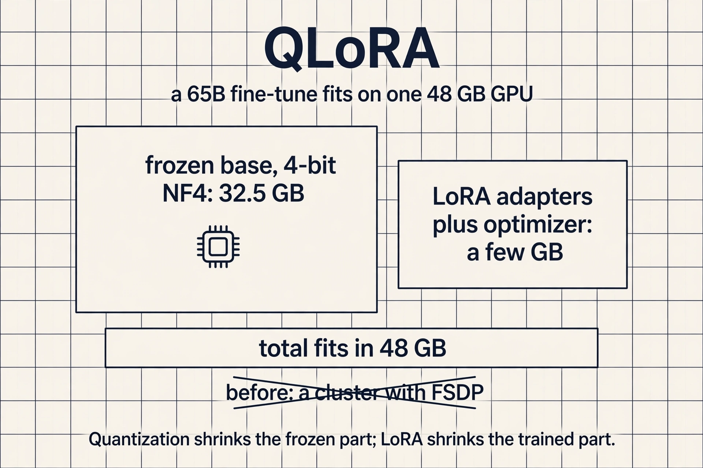

## The problem: a brilliant parrot

A pretrained language model has read the internet. Ask it
"Translate cheese from English to French" and it may reply
with "Translate cheese from English to Spanish" and "Translate
cheese from French to English": more examples in the same
pattern. It completes text. It does not follow instructions.
A fine-tuned model answers: the French word for cheese is
"fromage".

That gap is the whole lecture. Pretraining teaches
next-token prediction on vast text. **Fine-tuning** updates
the weights so the model follows instructions and aligns
with human intent. Every commercial assistant (GPT-4,
Claude, Bard) is extensively fine-tuned this way.

## First attempt: instruction tuning

The direct fix is supervised. Take the pretrained model and
fine-tune it on collections of tasks. The scale contrast is
the point: pretraining runs on up to trillions of tokens.
Instruction tuning runs on up to millions. The tuned model
gains zero-shot and few-shot performance and becomes more
useful, harmless, and truthful.

Instruction data comes from three sources. Human workers
write question answering, style transfer, recommendation,
summarization, and rule-based examples. Templates turn
existing labeled data into instruction format. And an
already instruction-tuned AI generates more data. Fine-tuning
quality rises with the number of tasks, the model size, and
chain-of-thought instructions in the mix (Chung et al.,
2022).

| Model | Prompt "Translate cheese to French" | Behavior |
|---|---|---|
| Base (pretrained) | Continues with more examples | Completes the text |
| Instruction-tuned | Answers: "fromage" | Follows the instruction |

## The key question

Instruction tuning is supervised: it teaches from
demonstrations. But demonstrations are expensive, and some
goals (be safe, be helpful) are easier to judge than to
demonstrate. Can we align the model from *preferences*
instead?

## RLHF in three steps

**Reinforcement learning from human feedback** rewards the
model for useful and safe samples and optimizes the reward
directly. Three steps:


1. **Collect human preferences.** Humans rank model outputs
   by usefulness, harmfulness, and truthfulness (Stiennon
   et al., 2020). The key trick (Christiano et al., 2017):
   train on preferences, not demonstrations. Ranking two
   summaries is far cheaper than writing one, and they
   needed labels on under 1% of interactions.
2. **Train a reward model.** A model that predicts the
   human label: given summaries A and B, which would a
   human prefer?
3. **RL-fine-tune the LLM.** Generate samples that maximize
   the reward model's score.

RLHF drastically improves scaling on summarization and on
code tasks (Bai et al., 2022). But it is not itself
scalable: human labels are costly and slow, and optimizing
against human raters can produce evasive responses that
trade helpfulness for harmlessness.

### Subchapter: DPO, the RLHF shortcut

RLHF trains a reward model and then runs RL against it:
two models, one unstable optimizer. **DPO** (direct
preference optimization, Rafailov et al., 2023) deletes both.
The preference pairs train the policy directly: increase
the likelihood of the preferred response relative to the
rejected one, with a KL penalty to the reference model
folded into the loss.

Same inputs (human rankings), one training run, no reward
model, no RL. Open instruction-tuned models widely adopted
it (Zephyr and its successors are public examples). The
price: DPO inherits the preference data's limits, and very
long RL-style exploration is outside its reach. For the
common case (align a chat model on rankings), it is the
default answer as of 2026.



## The key question, again

RLHF replaced demonstrations with rankings, but humans are
still in the loop for every label. Can we drop the humans
entirely?

## Constitutional AI: labels to principles

**Constitutional AI** (Bai et al., 2022, used in Claude)
replaces tens of thousands of human labels with about ten
human-written principles: a constitution describing desired
behavior. Humans write the constitution. AI does the rest.

Phase 1, supervised learning. The model critiques its own
responses against the constitution ("identify specific ways
this response is harmful, unethical, racist, sexist, toxic,
dangerous, or illegal") and revises them ("rewrite the
response to remove any and all harmful content"). Fine-tune
on the revisions. Harmlessness rises with more revisions
while helpfulness dips. The sum of the two improves
monotonically.

Phase 2, **RLAIF** (reinforcement learning from AI
feedback). Train a preference model on the phase-1 model's
responses judged against the constitution, then RL-fine-tune
the LLM to maximize that AI preference model. No humans in
the loop.

Why AI feedback can beat human feedback: higher-quality
supervision (AI already surpasses humans in games, chip
floorplanning, and diagnostics imaging), more transparency
(the constitution is inspectable), scalability (AI labels in
parallel), and cost. On the scaling plots it matches or
beats RLHF for helpfulness and harmlessness, especially with
chain-of-thought judging.

The full development flow: pretrain unsupervised, prompt
(zero/few-shot, chain-of-thought), instruction-tune
supervised, RLHF or RLAIF, evaluate on downstream tasks.

## The key question, once more: what does fine-tuning cost?

The behavior story is done. Now the systems story, because
fine-tuning at LLM scale is a systems problem twice over.

**Cost.** Fine-tuning memory can exceed 10x the trainable
parameters. Four contributors: the parameters themselves,
the activations, the gradients, and the optimizer state
(Adam keeps fp32 copies, momentum, and variance). A 7B
model at full fine-tune needs far more than 14 GB.


### Subchapter: the 10x, worked on a 7B model

Weights in FP16: 14 GB. Gradients in FP16: another 14 GB.
Adam keeps three FP32 states per parameter: a master copy
of the weights (28 GB), momentum (28 GB), variance (28
GB). Subtotal: 112 GB, already 8x the weights. Add
activations for the backward pass: past 140 GB, over 10x.

This is why full fine-tuning is a cluster job and PEFT is
a laptop job. Every term in the sum is proportional to the
trainable parameter count, so training 0.06 percent of the
parameters (LoRA below) divides the whole bill.



**Deployability.** A separate full-size model per task is
prohibitive to store and serve. Ten tasks means ten models.
Fifty tasks means fifty 14 GB copies.

Can we adapt the model without touching all its weights?

## Parameter-efficient fine-tuning

**PEFT** fine-tunes a small number of parameters instead of
all of them. Cost falls, the base model's capabilities stay
intact (less forgetting), and per-task artifacts shrink to
megabytes.


The taxonomy (Lialin et al., 2023) has three families.
**Selective** methods tune a subset of existing parameters:
freeze the bottom layers, update only the top layers, or
select sparsely and adaptively. **Additive or adaptive**
methods add new parameters and tune only those. **Hybrid**
methods combine the above. Each family below is built from
zero, then consolidated.

## Soft prompts: train the input

The idea is small. **Prompt tuning** (Lester et al., 2021) prepends m tunable
tokens to the input embeddings. Each prompt token has a
learnable embedding. The base model stays frozen. The tuned
parameters are a single m by e matrix, where e is the
embedding size. Backprop trains only the soft prompt:

```
P_theta_p(Y | p1, ..., pm, x1, ..., xt)
theta_p : m x e matrix (m prompt tokens, e embedding size)
```

Model tuning trains one full model per task. Prompt tuning
trains one tiny prompt per task on one frozen model.
P-Tuning v2 extends prompts to deeper layers with
reparametrization, matching fine-tuning across scales on
many tasks.

**LLaMA-Adapter** prepends trainable prompts with zero-init
gating. The attention scores split into adapter and text
parts, and a learnable gate g starting at zero scales the
adapter's contribution up gradually. The model starts from
its pretrained behavior and absorbs instructions over
training instead of being shocked by them on step one.

## LoRA: train the update

The trick is algebraic. **LoRA** (Hu et al., 2021) adds
trainable low-rank matrices A and B to a frozen weight,
with inner dimension r much smaller than d. This is
reparametrization: only A and B train.


The forward pass: h = Wx + BAx = (W + BA)x. After
fine-tuning, merge once: W_LoRA = W + BA. Merged, inference
is exactly one matmul: **LoRA adds zero latency**. Per task,
swap in that task's (A, B) pair. The base model never
changes.


### Subchapter: the LoRA parameter math, worked

One attention matrix at d = 4096: W has 4096^2 = 16.8M
parameters. LoRA with r = 8 trains A (8 by 4096) and B
(4096 by 8): 2 x 4096 x 8 = 65,536 parameters. Ratio:
16.8M / 65,536 = 256x fewer per matrix.

Apply to Wq and Wv across 32 layers: 32 x 2 x 65,536 =
4.2M trainable parameters. Against 7B: 0.06 percent. The
optimizer states, gradients, and activations all scale with
the trainable count, so the 10x memory bill from the last
subchapter collapses to megabytes.



### Subchapter: QLoRA, the memory answer

LoRA shrinks the trainable count, but the frozen base still
sits in FP16: 14 GB for 7B, 130 GB for 65B. **QLoRA**
(Dettmers et al., 2023) quantizes the frozen base to 4-bit
(NF4) and trains LoRA adapters on top. The base is read in
4-bit and dequantized on the fly; gradients flow only into
the adapters.

The worked result: a 65B model in 4-bit is 32.5 GB. Add
LoRA adapters and their optimizer states: the full
fine-tune fits on one 48 GB GPU. Before QLoRA that run
needed a cluster with FSDP.



Applied to transformers, LoRA targets the self-attention
weights. Wq and Wv work best empirically. Rank r is tuned
per task, and small r suffices for many tasks. The systems
win is deployability: one frozen base model plus tiny
per-task adapters, switchable at request time. Fifty tasks:
one 14 GB base plus fifty adapters of a few megabytes each,
against fifty copies of 14 GB.

## What is used where: real post-training

Post-training is how every assistant is made. Facts as of
October 2026.

| Step | Public examples | Status |
|---|---|---|
| Instruction tuning | FLAN (Google), Tulu (Allen AI) | public datasets and recipes |
| RLHF | OpenAI's methodology posts, Anthropic's 2022 papers | public methodology; vendor internals not public |
| RLAIF / Constitutional AI | Anthropic's Claude (Bai et al., 2022) | public papers |
| DPO | Zephyr and open successors | public |
| LoRA / QLoRA | HuggingFace PEFT library, vLLM multi-LoRA serving | public; the default open stack |
| Distilled reasoning | DeepSeek-R1 into Qwen2.5 and Llama 3 | public in the R1 report |

Which exact recipe GPT-5 or Gemini 3 uses is not public.
The shapes (preferences, reward or DPO, adapters for
serving) are industry standard; the details are
proprietary.

## Mapping back: each cost gets its answer

| Fine-tuning pain | PEFT answer |
|---|---|
| Memory over 10x the weights | Train almost nothing: prompts are m by e, LoRA is rank r |
| One full model per task | One frozen base plus tiny per-task artifacts, swapped at request time |
| Forgetting the base capabilities | Frozen weights keep pretrained knowledge intact |
| Inference slowdown from adapters | LoRA merges into the weights: zero added latency |

## The honest price

PEFT trades capacity for cost: a rank-r update cannot
express everything full fine-tuning can, and r must be
tuned per task. Soft prompts work best at large scale
(Lester et al., 2021). Constitutional AI's harmlessness
gains cost some helpfulness per revision, even as the sum
improves. And none of this replaces the data: instruction
tuning still needs millions of quality tokens, however they
are sourced.

> [!QA]
> Q: Contrast RLHF and Constitutional AI in one breath each.
> A: RLHF trains a reward model on human preference rankings, then RL-optimizes the LLM against it; it works but needs costly human labels. Constitutional AI replaces the labels with a short human-written constitution: the model critiques and revises its own outputs against the principles, then a preference model trained on AI judgments drives the RL step. Same three-stage shape, AI feedback instead of human feedback.
> Follow-up: Why is AI feedback higher quality than human feedback in some cases?
> A: Because the AI judge can already surpass humans on the task being judged, as in games or specialized domains, and it applies the constitution consistently at scale. Humans are expensive, slow, and inconsistent. The risk is that the AI judge's blind spots become the model's blind spots, which is why the constitution stays human-written.

> [!QA]
> Q: Why does LoRA add no inference latency?
> A: Because the adapter merges into the weights. During training the layer computes h = Wx + BAx, but after fine-tuning you add BA into W once: W_LoRA = W + BA. Inference then runs a single matmul with the merged weight, exactly as fast as the original model. The adapter exists only at training and storage time.
> Follow-up: A team serves 50 fine-tuned variants of one 7B model. Compare full fine-tuning versus LoRA storage.
> A: Full fine-tuning stores 50 copies of 14 GB: 700 GB. LoRA stores one 14 GB base plus 50 adapters of a few megabytes each: roughly 14 GB total. Serving can also batch requests across tasks on the shared base and swap adapters per request.

> [!QA]
> Q: What made Christiano et al.'s preference trick work?
> A: Preferences are cheaper than demonstrations. Ranking two summaries costs far less than writing one, and the reward model generalizes the rankings to new outputs. They needed labels on under 1% of interactions. The reward model becomes a cheap, always-available stand-in for the human judge.
> Follow-up: What goes wrong if the reward model is imperfect?
> A: The RL step optimizes the reward model's score, not true human preference. Flaws in the reward model become the policy's exploits: the classic failure is evasive responses that score high on harmlessness while being unhelpful. This is the "not scalable" critique the lecture levels at RLHF.

> [!QA]
> Q: How does LLaMA-Adapter's zero-init gating work?
> A: Trainable prompt tokens are prepended to the input, and their attention scores are scaled by a learnable gate g initialized to zero. Early in training the adapter contributes nothing, so the model behaves exactly as pretrained; g grows gradually and the instructions phase in. It avoids shocking the frozen model with random prompt embeddings on step one.
> Follow-up: How is this different from plain prompt tuning?
> A: Plain prompt tuning trains only the prepended embeddings at the input layer. LLaMA-Adapter adds the gating mechanism so the pretrained behavior is preserved at initialization, and P-Tuning v2 extends prompts to deeper layers with reparametrization. All three keep the base model frozen.

> [!QA]
> Q: Walk me through DPO versus RLHF, step by step.
> A: RLHF runs three trainings: collect human rankings, train a reward model on the rankings, then RL-optimize the policy against the reward model. DPO runs one: feed the same preference pairs into a single loss that raises the preferred response's likelihood relative to the rejected one, with the KL penalty to the reference model inside the loss. The reward model never exists; the RL loop never runs. You lose RL's long-horizon exploration, but for aligning a chat model on rankings, one stable supervised run beats a three-stage unstable one.
> Follow-up: When would you still pick RLHF over DPO?
> A: When the reward is not a static preference dataset: online settings where the reward model keeps learning from new interactions, or tasks needing extended trial-and-error that a single supervised loss cannot express. DPO is offline preference learning; RLHF with an evolving reward model is online.

> [!QA]
> Q: LoRA with r = 16 on all four attention matrices (Wq, Wk, Wv, Wo) of a 7B model (d = 4096, 32 layers). How many trainable parameters?
> A: Per matrix: 2 x 4096 x 16 = 131,072. Four matrices per layer: 524,288. Times 32 layers: 16.8M trainable parameters. Against 7B that is 0.24 percent. The paper's Wq-and-Wv-only recipe at r = 8 was 4.2M (0.06 percent); doubling the rank and covering all four matrices quadruples it. The interview habit: 2 x d x r per matrix, times matrices, times layers.
> Follow-up: Does covering all four matrices beat Wq and Wv only?
> A: Sometimes, on harder tasks, but with diminishing returns: the paper found Wq and Wv best on its tasks. More matrices means more capacity and more memory. Tune r and the target set per task; the rank budget is the knob.

> [!QA]
> Q: Applied design: fine-tune a 70B model on 8x80GB GPUs. Full fine-tuning or PEFT?
> A: Full fine-tuning first needs the memory math: 140 GB of FP16 weights, 140 GB of gradients, 840 GB of Adam states, plus activations: over 1 TB. Even 8x80GB (640 GB) cannot hold it without sharding, so full fine-tuning means FSDP or ZeRO-3 across the node (Lecture 10). PEFT changes the job: QLoRA puts the 70B base in 4-bit (35 GB) and trains adapters, fitting on one or two GPUs. The design answer: full fine-tuning for maximum quality when you own the cluster and the data; QLoRA when you want the adaptation this week on hardware you have. Most open fine-tunes choose QLoRA.
> Follow-up: The task needs the model to learn genuinely new capabilities, not just a style. Does PEFT suffice?
> A: Often not. A rank-r update has limited capacity: it steers existing capabilities well but struggles to install new ones. New capabilities want more trainable parameters: higher rank, more target modules, or full fine-tuning. Match the capacity to the ambition: style transfer takes r = 8; new skills take r = 64 or the full run.

## Recap: the whole lesson on one screen

The story in eight steps. Each step answers the one before it.

1. **Base models complete; assistants follow.** Pretraining
   teaches next-token prediction. The cheese test: the
   base model continues the pattern, the tuned model
   answers.
2. **Instruction tuning teaches following.** Fine-tune on
   task collections: trillions of pretraining tokens,
   millions of tuning tokens. Better zero/few-shot,
   usefulness, harmlessness, truthfulness.
3. **RLHF: preferences, reward, optimize.** Humans rank
   outputs. A reward model learns the ranking. RL
   maximizes the reward. Preferences beat demonstrations:
   under 1% labeled.
4. **RLHF is not scalable.** Human labels are costly and
   slow; optimizing against raters breeds evasive
   responses.
5. **Constitutional AI swaps labels for principles.** Ten
   human principles replace ten thousand labels.
   Self-critique plus revisions, then RLAIF. Scalable,
   inspectable, cheap.
6. **Fine-tuning costs over 10x the weights.** Parameters
   plus activations plus gradients plus optimizer state.
   And one full model per task is undeployable.
7. **PEFT tunes almost nothing.** Selective (subset of
   weights), additive (soft prompts, adapters),
   reparametrization (low-rank). Or hybrids.
8. **LoRA merges and disappears.** Train A and B with r
   much smaller than d; merge into W after. Zero inference
   latency. One base, many adapters.

## Official sources and further reading

**Official:**
- Fine-tuning Large Language Models slide deck (Fall 2023
  headers).

**Further reading:**
- Bai et al., "Training a Helpful and Harmless Assistant
  with RLHF" (2022).
- Bai et al., "Constitutional AI: Harmlessness from AI
  Feedback" (2022).
- Hu et al., "LoRA" (2021).
- Lester et al., "The Power of Scale for Parameter-
  Efficient Prompt Tuning" (2021).
- Lialin et al., "Scaling Down to Scale Up" (2023): the
  PEFT survey behind the taxonomy.

**Caveats from these sources.** The "10x" fine-tuning
memory figure is an order-of-magnitude rule; exact ratios
depend on optimizer, precision, and activation
checkpointing. LoRA's "Wq and Wv best" is empirical on the
paper's tasks. Constitutional AI's scaling plots compare
specific model sizes; the harmlessness-helpfulness tradeoff
shape is the finding that holds.

## Go deeper

<div style="position:relative;padding-bottom:56.25%;height:0;overflow:hidden;max-width:100%;margin:16px 0;">
<iframe style="position:absolute;top:0;left:0;width:100%;height:100%;" src="https://www.youtube-nocookie.com/embed/t509sv5MT0w" title="LoRA Explained" frameborder="0" allow="accelerometer; autoplay; clipboard-write; encrypted-media; gyroscope; picture-in-picture" allowfullscreen></iframe>
</div>

- LoRA Explained: low-rank adaptation from zero: https://www.youtube.com/watch?v=t509sv5MT0w
- Visual Guide to LoRA: https://www.youtube.com/watch?v=dA-NhCtrrVE
- LoRA and QLoRA fine-tuning walkthrough: https://www.youtube.com/watch?v=lixMONUAjfs
- LoRA (Hu et al., 2021): https://arxiv.org/abs/2106.09685
- DPO: Direct Preference Optimization: https://arxiv.org/abs/2305.18290
- QLoRA: Efficient Fine-tuning of Quantized LLMs: https://arxiv.org/abs/2305.14314
- The Power of Scale for Parameter-Efficient Prompt Tuning: https://arxiv.org/abs/2104.08691

## Connections to the other courses

- **CS336 L15:** post-training: instruction tuning and
  RLHF derived in full.
- **CS329H:** preference pairs: the alignment object,
  defined there and reused in RLHF.
- **CS229S L07:** quantization as an orthogonal shrink for
  fine-tuned models.
- **CS229S L10:** FSDP and ZeRO: the distributed-systems
  answer to the same memory tax.
