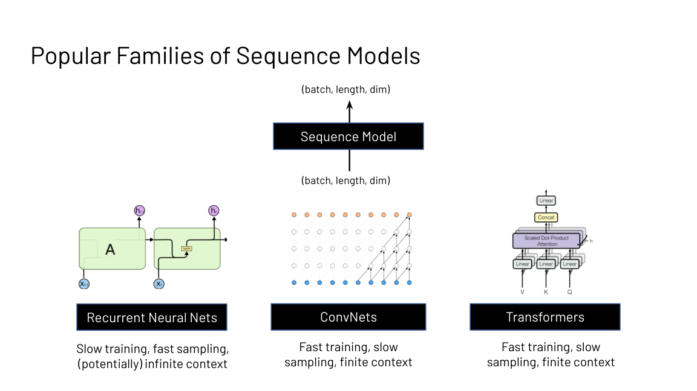
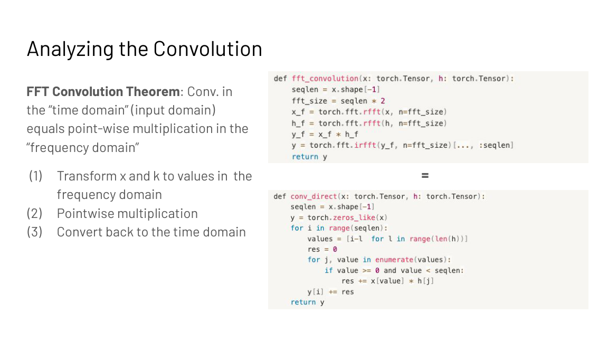
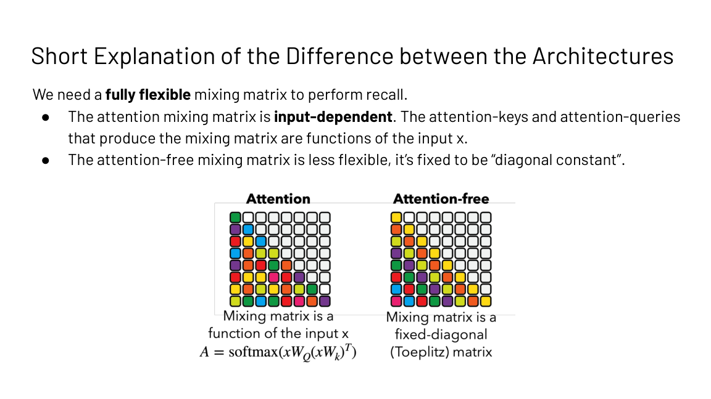
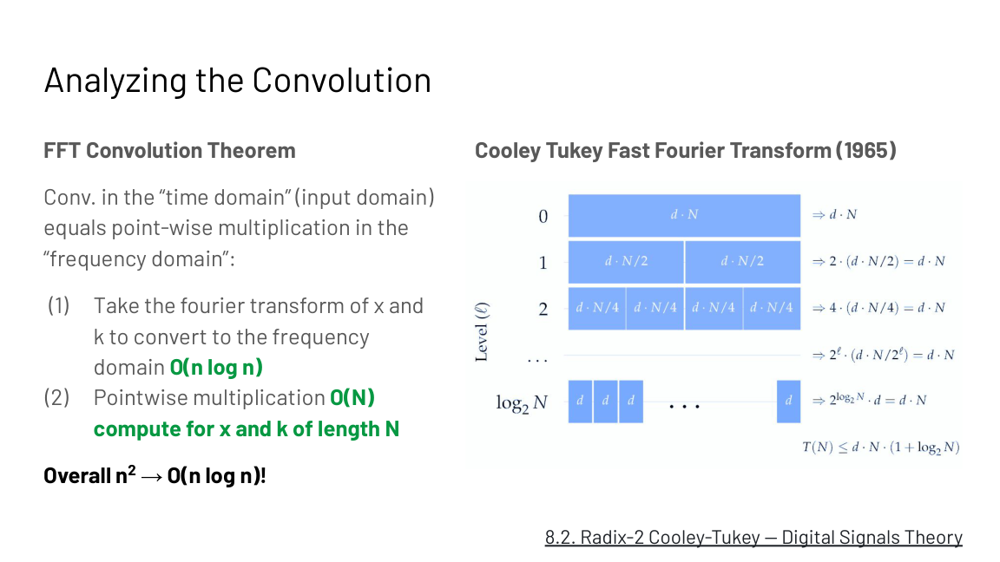
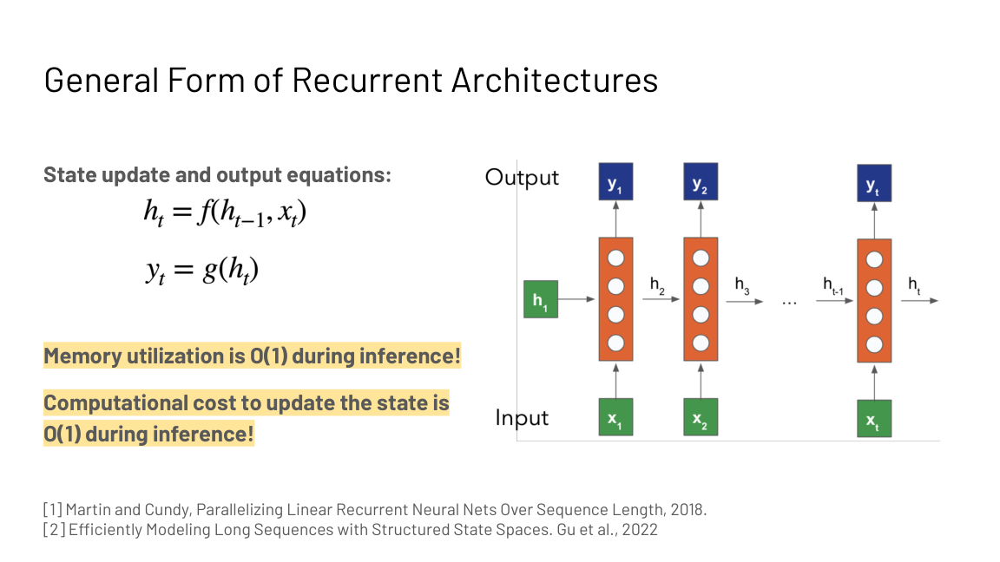
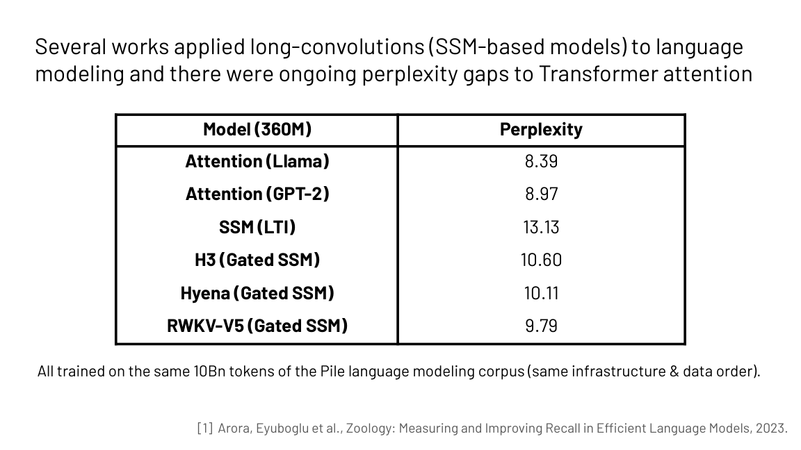

## How to read this lesson

**Level 1 (Core)** builds the three sequence primitives, derives
the FFT speedup, and explains the recall gap that separates
attention from its rivals. **Level 2 (Deep)** covers S4's
breakthrough and the design direction it opened. Linear attention
as a trained architecture continues in
[CS336 L04](../cs336/l04-linear-attention-moe.html).

## Level 1: Three primitives, three tradeoffs



| Family | Training | Sampling | Context |
|---|---|---|---|
| Recurrent nets | Slow (serial) | Fast, O(1) per step | Potentially infinite |
| ConvNets | Fast (parallel) | Slow | Finite |
| Transformers | Fast (parallel) | Slow, O(N) look-back | Finite |

Transformers dominate language, but their training is O(N squared)
and generation needs a full look-back: O(N) memory and compute per
step. The lecture asks whether new primitives can keep the fast
training while fixing the scaling.

## Level 1: Convolutions mix with a kernel

A convolution mixes the input sequence according to weights in a
filter (kernel) vector: each output is a dot product of the kernel
against a window of the input. An edge-detector kernel like
[-1, 2, -1] and an identity kernel [1, 0, 0] show how the kernel
chooses the mixing.

```ascii
input  : ... x0 x1 x2 x3 x4 ...
kernel : [-1, 2, -1]          <- edge detector
output : ... y1 y2 y3 ...
y2 = -x1 + 2*x2 - x3          <- dot product at each position
```

**Long convolutions** set kernel size equal to input size: every
output sees the whole sequence. Two details matter. The Fourier
transform is circular, so naive long convolution wraps samples
around the ends. For causal modeling (early tokens cannot see
later ones), pad with kernel_size - 1 zeros.

Naive long convolution costs O(N squared): N outputs, each a dot
product of N terms. If attention is also O(N squared), why bother?
Because of the FFT.

## Level 1: The FFT convolution theorem

**Convolution in the time domain equals pointwise multiplication
in the frequency domain.**



1. Fourier-transform the input x and the kernel k.
2. Multiply pointwise: O(N).
3. Inverse-transform back.

A naive Fourier transform is itself O(n squared): n outputs, each
a sum of n terms. The Cooley-Tukey Fast Fourier Transform (1965)
computes it in O(n log n). Total: n^2 becomes O(n log n).

 per transform falls to O(n log n) with Cooley-Tukey. Source: Stanford slides.")

The FFT is the core primitive that makes convolution-based
sequence models fast. It is exact, not approximate: the theorem is
an equality.

> [!QA]
> Q: Why is a long convolution worth doing if it is O(N squared) like attention?
> A: Because the FFT convolution theorem turns it into O(N log N). Transform both signals to the frequency domain with the Cooley-Tukey FFT, multiply pointwise, transform back. Attention has no such exact speedup: its only exact fix is the systems engineering of FlashAttention. The convolution's structure admits a faster algorithm.
> Follow-up: What breaks if you forget causality in a long convolution?
> A: The Fourier transform is circular, so samples wrap around the ends and early outputs see late inputs. For autoregressive modeling that leaks the future. Pad with kernel_size - 1 zeros to restore causality.

## Level 1: Linear recurrences are convolutions

A recurrent net keeps a fixed-size state, updates it per token,
and generates from it. General form: a state-update equation and
an output equation. Inference costs O(1) memory and O(1) compute
per step: the state is fixed size no matter how long the sequence
gets.

 memory and compute per inference step. Source: Stanford slides.")

The catch is training: nonlinear recurrences serialize across
timesteps. But if the recurrence is **linear** (and time
invariant), the computation parallelizes across the sequence
(Martin and Cundy, 2018). Regrouping the terms shows why: a
linear time-invariant recurrence unrolls into a convolution of the
input with a kernel derived from the recurrence weights. Train it
as a convolution (fast, parallel, FFT), run it as a recurrence
(fast, O(1) sampling). That duality is the whole trick behind S4.

## Level 1: S4 broke the long-range benchmarks

Efficient transformers struggled on the Long Range Arena (Tay et
al., 2020), the standard long-context suite. In 2022, S4 (Gu et
al.), which generalizes linear time-invariant recurrences with
structured state spaces, solved the failure tasks to near-perfect
accuracy, including Path-X. It also reached state of the art on
audio generation and time-series modeling.

Applied to language modeling, gaps remained. At 360M parameters on
10B Pile tokens:

 8.39 vs SSM variants 9.79-13.13 at 360M scale. Source: Stanford slides, Zoology 2023.")

Attention (Llama-style) reached 8.39 perplexity; the SSM variants
sat between 9.79 and 13.13. Something about language resisted the
convolutional answer.

## Level 1: The recall gap

Zoology (Arora, Eyuboglu et al., 2023) diagnosed the gap with a
behavior called **recall**: grounding the next prediction in
information from the context. Synthetic form: given mappings like
"C 8" and "A 3" earlier in the sequence, predict the value for a
recall key. Real form: "A door panel blew off a 737 Max 9 during
an Alaska Airlines flight" requires "Max" and "Airlines" to
interact across distance.

Compare the sequence mixers: each takes input embeddings and
outputs a mixed sequence, i.e. applies a mixing matrix. The
attention mixing matrix is **input-dependent**: queries and keys
are functions of the input x, so the mixing adapts to content.
The attention-free mixing matrix is **diagonal-constant**: fixed,
independent of the input. Recall needs a fully flexible mixing
matrix, and only the input-dependent one qualifies.



The lecture's two conclusions. First, measure efficiency on the
task, not just the sequence length: convolutions are O(N log N)
but attention is more efficient at recall. Second, do error
analysis on your architectures: the gated convolutions' recall
failure was found by looking at what they predicted wrong, not by
staring at complexity bounds.

> [!QA]
> Q: Why do convolutional sequence models struggle with recall while attention handles it?
> A: Recall needs the mixing between tokens to depend on the content: which earlier token matters depends on what the tokens say. Attention's mixing matrix is built from input-dependent queries and keys, so it adapts per example. A convolution's mixing matrix is diagonal-constant, fixed regardless of input. No fixed mixing pattern can route arbitrary content-based lookups, so perplexity gaps persist even though convolutions scale better asymptotically.
> Follow-up: What architecture direction does this suggest?
> A: Keep the sub-quadratic scaling but make the mixing input-dependent. That is exactly Mamba's selective state spaces and gated linear attention: the recurrence or convolution weights become functions of the input, recovering the flexibility that recall needs while keeping linear-time scaling.

## Level 2: Building the new architectures

The design target is now explicit: (1) computational and memory
efficiency, sub-quadratic in sequence length, and (2)
input-dependent sequence mixing, for recall. Mamba (Gu and Dao,
2023) makes the state-space parameters selective, i.e. input
dependent. Gated linear attention and Based push the same
direction from the linear-attention side.

The lecture closes with three open jobs. First, the same legwork
that trained transformers well (width, depth, hyperparameters)
must be repeated for the new models. Second, the new primitives
(FFT, parallel scans) need the efficient implementations that
transformers already enjoy. Third, keep measuring behavior, not
just complexity: modalities beyond language are still open
country.

## Recap: the whole lesson on one screen

<div class="recap-grid">
<div class="recap-card">

<div class="rc-body">
<strong>1. Three primitives, three tradeoffs</strong>
<p>RNNs train slow and sample fast. Transformers train fast and
sample slow. ConvNets sit between. Pick your bottleneck.</p>
<p class="rc-num">Key: training vs sampling vs context</p>
</div>
</div>
<div class="recap-card">

<div class="rc-body">
<strong>2. Convolution equals frequency multiply</strong>
<p>FFT both signals, multiply pointwise, inverse FFT. Exact, not
approximate. Pad kernel_size - 1 zeros for causality.</p>
<p class="rc-num">Key: time conv = frequency product</p>
</div>
</div>
<div class="recap-card">

<div class="rc-body">
<strong>3. Cooley-Tukey makes it O(n log n)</strong>
<p>The naive transform is O(n squared). The 1965 FFT drops it to
O(n log n). Long convolutions become genuinely cheap.</p>
<p class="rc-num">Key: n^2 to n log n</p>
</div>
</div>
<div class="recap-card">

<div class="rc-body">
<strong>4. Recurrences sample in O(1)</strong>
<p>Fixed-size state means fixed memory and compute per step, at
any length. Training serializes unless the recurrence is linear.</p>
<p class="rc-num">Key: O(1) per step, any length</p>
</div>
</div>
<div class="recap-card">

<div class="rc-body">
<strong>5. Linear recurrences are convolutions</strong>
<p>Unroll a linear time-invariant recurrence and regroup: it is a
convolution. Train parallel, sample recurrent. S4 exploits both.</p>
<p class="rc-num">Key: one math, two modes</p>
</div>
</div>
<div class="recap-card">

<div class="rc-body">
<strong>6. S4 won long-range, lagged language</strong>
<p>Near-perfect Long-Range Arena including Path-X. But at 360M
scale, attention hit 8.39 perplexity versus 9.79 to 13.13.</p>
<p class="rc-num">Key: benchmarks diverge by task</p>
</div>
</div>
<div class="recap-card">

<div class="rc-body">
<strong>7. Recall needs input-dependent mixing</strong>
<p>Attention adapts its mixing to content; convolutions use a
fixed diagonal-constant pattern. Content lookup needs the former.</p>
<p class="rc-num">Key: flexibility beats asymptotics</p>
</div>
</div>
<div class="recap-card">

<div class="rc-body">
<strong>8. Sub-quadratic plus selective</strong>
<p>Mamba, gated linear attention, Based: keep linear scaling, make
mixing input-dependent. Measure behavior, not just complexity.</p>
<p class="rc-num">Key: efficiency at the task</p>
</div>
</div>
</div>

## Official sources and further reading

**Official:**
- Designing Efficient Architectures slide deck (Fall 2023 headers).

**Further reading:**
- Gu et al., "Efficiently Modeling Long Sequences with Structured State Spaces" (2022): S4.
- Arora, Eyuboglu et al., "Zoology" (2023): the recall diagnosis.
- Gu and Dao, "Mamba" (2023): selective state spaces.
- [CS336 L04](../cs336/l04-linear-attention-moe.html): linear attention trained at scale.

**Caveats from these sources.** The perplexity table is one
controlled comparison (360M params, 10B Pile tokens, same
infrastructure); rankings shift with scale and data. The
RNN/ConvNet/Transformer tradeoff table simplifies: modern hybrids
blur every column. The FFT causality discussion assumes the
circular transform; implementations vary in padding convention.

## Connections to the other courses

- **CS336 L04:** linear attention and MoE: the architecture the kernel idea became.
- **CS229S L02:** the RNN challenges that motivated transformers; this lecture revisits them.
- **CS229S L06:** the other answer to O(N squared): exact attention done right.
- **CS229S L05:** FFT and parallel scans as new primitives needing efficient kernels.

> [!CHEAT]
> **Attention-free cheatsheet.** Families: RNN (slow train, fast O(1) sample, infinite context), ConvNet, transformer (fast train, slow sample, finite). Long conv: kernel = input size; circular wrap; pad kernel_size-1 for causality; naive O(N^2). FFT theorem: time conv = pointwise frequency multiply; Cooley-Tukey 1965: O(n log n). RNN: state update + output eqs; O(1) mem/compute per step. Linear recurrence: parallelizable across timesteps; regroups to convolution; train as conv, sample as recurrence. S4 2022: solved LRA/Path-X; SoTA audio/time-series. LM gaps at 360M/10B tokens: attn 8.39, SSMs 9.79-13.13. Recall: content lookup; attention mixing input-dependent, conv mixing diagonal-constant. Direction: sub-quadratic + input-dependent (Mamba selective SSM, GLA, Based). Measure task efficiency, not asymptotics.

> [!MEMORY]
> **The recall rule.** Fast mixing is useless if it cannot look up what matters. Make the mixing depend on the input.
