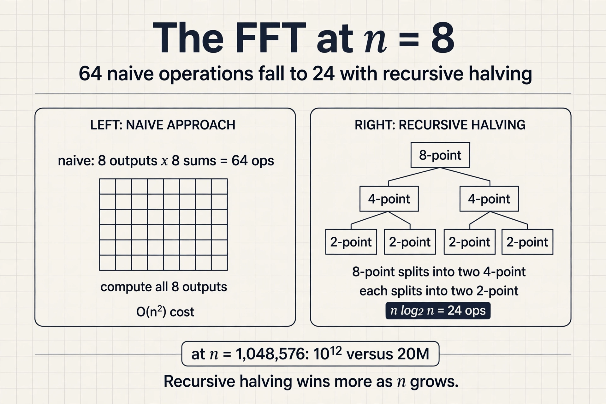
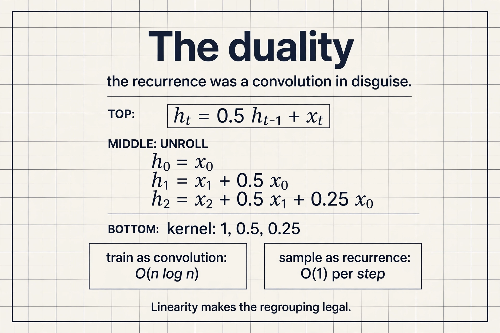
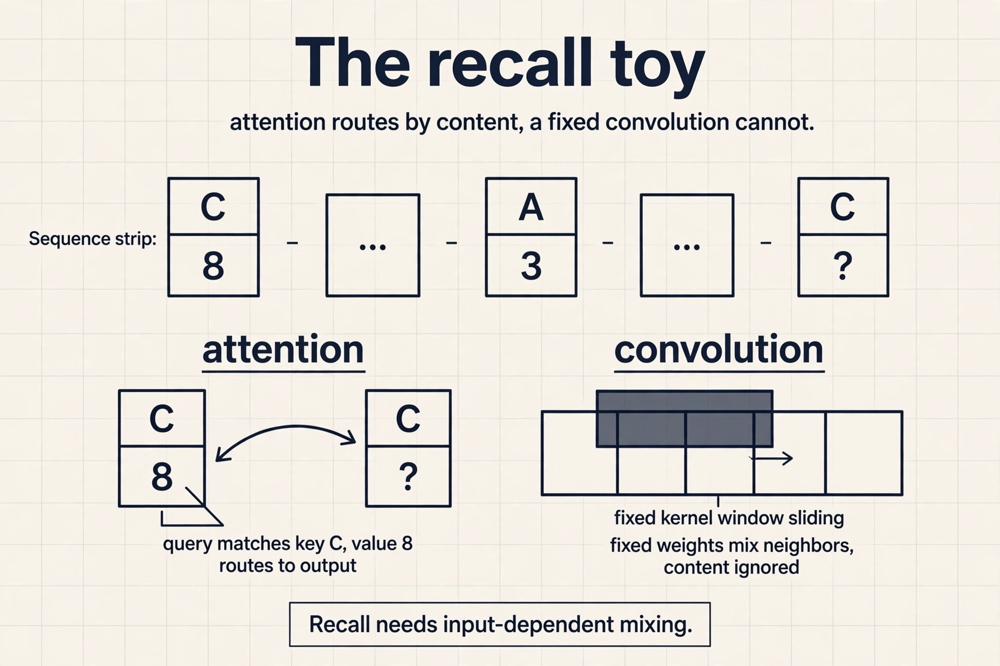
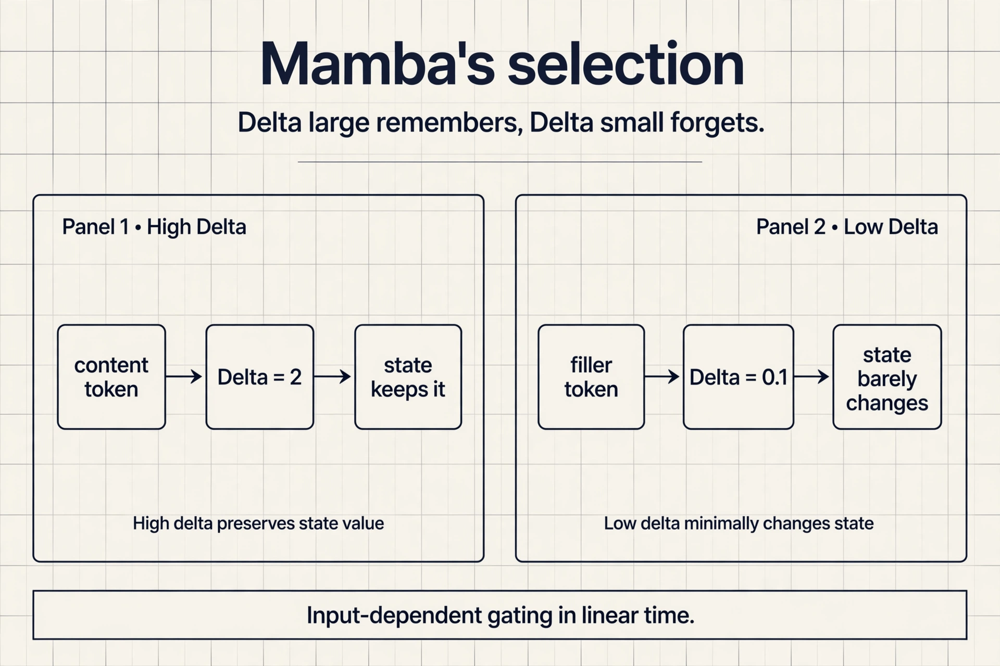

## The problem: the quadratic is still there

FlashAttention made attention exact and fast, but the
compute is still O(N squared). The lecture's long-sequence
cases have not gone away: hundreds of thousands of words in
a math textbook with dependencies across chapters, raw
audio at thousands of timesteps per second, genomes with
interactions spanning 100k+ nucleotides. Can we design
architectures that scale sub-quadratically in sequence
length?

## Two older primitives

Before answering, the lecture rebuilds the two sequence
primitives that predate the transformer, because the new
architectures are built from them.

A **convolution** mixes the input sequence according to
weights in a filter vector called the **kernel**: each
output is a dot product of the kernel against a window of
the input. The kernel chooses the mixing. An edge-detector
kernel [-1, 2, -1] responds to changes. An identity kernel
[1, 0, 0] passes the signal through.

```ascii
input  : ... x0 x1 x2 x3 x4 ...
kernel : [-1, 2, -1]          <- edge detector
output : ... y1 y2 y3 ...
y2 = -x1 + 2*x2 - x3          <- dot product at each position
```

A **long convolution** sets kernel size equal to input
size: every output sees the whole sequence. Two details
matter. The Fourier transform is circular, built from
periodic sines and cosines, so naive long convolution wraps
samples around the ends: what falls off one end reappears
at the other. For causal modeling, where early tokens
cannot see later ones, pad with kernel_size - 1 zeros.

A **recurrent network** captures the history of all
previously seen tokens in a fixed-size **state**: a state
update equation and an output equation. Inference costs
O(1) memory and O(1) compute per step, because the state
is fixed size no matter how long the sequence gets.

 memory and compute per inference step. Source: Stanford slides.")

But Lecture 2 named the three recurrent challenges:
long-range dependencies fade, gradients vanish or explode,
and training serializes across timesteps.

Each primitive, priced:

| Family | Training | Sampling | Context |
|---|---|---|---|
| Recurrent nets | Slow (serial) | Fast, O(1) per step | Potentially infinite |
| ConvNets | Fast (parallel) | Slow | Finite |
| Transformers | Fast (parallel) | Slow, O(N) look-back | Finite |

## The key question

A naive long convolution costs O(N squared): N outputs,
each a dot product of N terms. If attention is also O(N
squared), why bother with convolutions? The answer is a
theorem.

## The FFT convolution theorem

**Convolution in the time domain equals pointwise
multiplication in the frequency domain.** Three steps:

1. Fourier-transform the input x and the kernel k.
2. Multiply pointwise: O(N).
3. Inverse-transform back.


A naive Fourier transform is itself O(n squared): n
outputs, each a sum of n terms. The Cooley-Tukey Fast
Fourier Transform (1965) computes it in O(n log n). Total:
n^2 becomes O(n log n).

 per transform falls to O(n log n) with Cooley-Tukey. Source: Stanford slides.")

### Subchapter: the FFT, worked on n = 8

A naive Fourier transform at n = 8: 8 outputs, each a sum
of 8 terms, 64 operations. Cooley-Tukey splits the 8-point
transform into two 4-point transforms plus 8 butterfly
combines: 2 x 16 + 8 = 40, then the 4-point transforms
split again, down to n log2 n = 24 operations. The trick is
recursive halving: even and odd samples separate, the
transform runs on each half, and the halves recombine with
twiddle factors.

At n = 1,048,576 the gap is the point: naive needs 10^12
operations, Cooley-Tukey needs 20M. Every log factor the
problem grows, the FFT wins by more.



The FFT is the core primitive that makes
convolution-based sequence models fast. It is exact, not
approximate: the theorem is an equality. Attention has no
such exact speedup. Its only exact fix was the systems
engineering of FlashAttention.

## Linear recurrences are convolutions

Now the recurrence's training problem. If the state update
f() has nonlinearities, timesteps depend on each other
sequentially. But if f() is **linear** (and time invariant),
the computation parallelizes across the sequence (Martin
and Cundy, 2018). Regrouping the terms shows why: a linear
time-invariant recurrence unrolls into a convolution of
the input with a kernel derived from the recurrence
weights. Train it as a convolution (fast, parallel, FFT),
run it as a recurrence (fast, O(1) sampling). That duality
is the whole trick behind S4.

**S4** (Gu et al., 2022) generalizes linear time-invariant
recurrences with structured state spaces. The efficient
transformers had struggled on the Long Range Arena (Tay et
al., 2020), the standard long-context suite. In 2022, S4
solved those failure tasks to near-perfect accuracy,
including Path-X. It also reached state of the art on
audio generation and time-series modeling. Sub-quadratic
sequence modeling had its breakthrough.

### Subchapter: the duality, worked

Recurrence: h_t = 0.5 h_{t-1} + x_t. Unroll it: h_0 = x_0,
h_1 = x_1 + 0.5 x_0, h_2 = x_2 + 0.5 x_1 + 0.25 x_0. Every
output is a dot product of the input with a kernel of
decaying powers: [1, 0.5, 0.25, ...]. The recurrence was a
convolution in disguise. The recurrence weights chose the
kernel.

Train with the FFT as a convolution: all timesteps in
parallel, O(n log n). Sample as the recurrence: one state
update per step, O(1). The duality is exact because the
recurrence is linear: no nonlinearity couples the
timesteps, so regrouping the terms is legal. Add a
nonlinearity and the disguise fails. Training serializes
again.



## Where it breaks: language

Applied to language modeling, gaps remained. At 360M
parameters on the same 10B Pile tokens, same
infrastructure, same data order:

 8.39 vs SSM variants 9.79-13.13 at 360M scale. Source: Stanford slides, Zoology 2023.")

Attention (Llama-style) reached 8.39 perplexity. GPT-2
style reached 8.97. The state space model (SSM) variants sat between 9.79 and 13.13.
Something about language resisted the convolutional
answer.

## The key question, again

What does language need that long convolutions lack?
Zoology (Arora, Eyuboglu et al., 2023) diagnosed it with a
behavior called **recall**: grounding the next prediction
in information from the context. Synthetic form: given
mappings like "C 8" and "A 3" earlier in the sequence,
predict the value for a recall key. Real form: "A door
panel blew off a 737 Max 9 during an Alaska Airlines
flight" requires "Max" and "Airlines" to interact across
distance.

Compare the **sequence mixers**: each takes input
embeddings and outputs a mixed sequence, i.e. applies a
mixing matrix. The attention mixing matrix is
**input-dependent**: the queries and keys that produce it
are functions of the input x, so the mixing adapts to
content. The attention-free mixing matrix is
**diagonal-constant**: fixed, independent of the input.
Recall needs a fully flexible mixing matrix, and only the
input-dependent one qualifies.


### Subchapter: the recall toy, worked

Sequence: "C 8 ... A 3 ... what is the value of C?"
Attention answers it: the query built from "C?" matches
the key built from "C" at position 1, the mixing matrix
puts weight 1 on position 1, and the value 8 routes to the
output. The routing decision depends on the content: the
query and key are functions of the input tokens.

A convolution cannot do this. Its mixing matrix is
diagonal-constant: position i always mixes position i - k
with weight w_k, whatever the tokens say. No fixed pattern
of weights can route "the value that followed the recalled
key" for arbitrary keys. The failure is structural, not a
matter of more parameters.



The lecture's two conclusions. First, measure efficiency on
the task, not just the sequence length: convolutions are
O(N log N) but attention is more efficient at recall.
Second, do error analysis on your architectures: the gated
convolutions' recall failure was found by looking at what
they predicted wrong, not by staring at complexity bounds.

## Building the new architectures

The design target is now explicit: (1) computational and
memory efficiency, sub-quadratic in sequence length, and
(2) input-dependent sequence mixing, for recall. **Mamba**
(Gu and Dao, 2023) makes the state-space parameters
selective, i.e. input dependent. Gated linear attention and
Based push the same direction from the linear-attention
side. Keep the sub-quadratic scaling, and make the mixing
depend on the input.

### Subchapter: Mamba's selection, worked

In S4 the recurrence h_t = A h_{t-1} + B x_t uses fixed A
and B: the state decays and absorbs at the same rate for
every token. Mamba makes the step size Delta, the input
matrix B, and the output matrix C functions of the input
token.

The worked meaning: Delta = 2 means the state keeps
almost everything from this token (remember it). Delta =
0.1 means the state barely updates (forget it). The model
learns to set Delta large on content tokens and small on
filler. Selectivity is the input-dependent gate the
recall diagnosis demanded, and the recurrence still runs
in linear time with O(1) state per step.

**Mamba-2** (Dao and Gu, 2024) added state-space duality:
the selective SSM computes the same operation as a
restricted linear attention, so its kernels reuse the
matrix-multiply hardware GPUs are built for. Same idea,
faster execution.



## What is used where: real models, 2026

Pure transformers still dominate, but selective
state-space layers are shipping in production. Facts as
of October 2026, from public releases and the Mamba
project's adoption list.

| Model | Architecture | Source |
|---|---|---|
| AI21 Jamba (398B) | Mamba + attention hybrid | public |
| NVIDIA Nemotron-H (8B, 47B, 56B) | Mamba-2 + attention + MoE hybrid | public |
| TII Falcon-H1 (34B) | Mamba-2 hybrid | public |
| IBM Granite 4.0 | Mamba-2 + transformer, 9:1 ratio | public, Apache 2.0 |
| IBM Bamba (9B) | SSM + transformer | public |
| TII Falcon-Mamba (7B) | pure Mamba | public |
| Mistral Codestral Mamba (7B) | pure Mamba | public |
| Microsoft Samba (4B) | Mamba + sliding-window attention | public |
| Tencent Hunyuan-TurboS (560B) | hybrid | public |

The 2026 pattern: hybrids won. Builders use recurrent
state-space layers for cheap long-sequence processing and
keep attention where direct token access matters. Pure
Mamba models exist (Falcon-Mamba, Codestral Mamba), but
the production default is the mix. Frontier-lab internals
beyond these releases are not public.

## Mapping back: each primitive answers one pain

| Pain | Primitive that answers it |
|---|---|
| Training must be parallel | Long convolutions via the FFT: O(n log n), exact |
| Sampling must be cheap | Linear recurrences: O(1) memory and compute per step |
| Language needs content lookup | Input-dependent mixing: selective state spaces, gated linear attention |

## The honest price

The lecture closes with three open jobs, and they are all
legwork. First, the same tuning that trained transformers
well (width, depth, hyperparameters) must be repeated for
the new models. Second, the new primitives (FFT, parallel
scans) need the efficient implementations that transformers
already enjoy. Third, keep measuring behavior, not just
complexity: modalities beyond language are still open
country. Six years of transformer tuning do not transfer
for free.

> [!QA]
> Q: Why is a long convolution worth doing if it is O(N squared) like attention?
> A: Because the FFT convolution theorem turns it into O(N log N). Transform both signals to the frequency domain with the Cooley-Tukey FFT, multiply pointwise, transform back. Attention has no such exact speedup: its only exact fix is the systems engineering of FlashAttention. The convolution's structure admits a faster algorithm.
> Follow-up: What breaks if you forget causality in a long convolution?
> A: The Fourier transform is circular, so samples wrap around the ends and early outputs see late inputs. For autoregressive modeling that leaks the future. Pad with kernel_size - 1 zeros to restore causality.

> [!QA]
> Q: How can a recurrence train in parallel if it is defined sequentially?
> A: Only if it is linear and time invariant. Then regrouping the terms shows the unrolled recurrence is a convolution of the input with a kernel derived from the recurrence weights. Train it as a convolution with the FFT, run it as a recurrence for O(1) sampling. Nonlinear recurrences keep the serial dependency and cannot use this trick.
> Follow-up: What did S4 actually achieve?
> A: It solved the Long Range Arena failure tasks to near-perfect accuracy including Path-X, and reached state of the art on audio generation and time-series modeling. It was the first sub-quadratic architecture to beat efficient transformers where they were weakest: very long contexts.

> [!QA]
> Q: Why do convolutional sequence models struggle with recall while attention handles it?
> A: Recall needs the mixing between tokens to depend on the content: which earlier token matters depends on what the tokens say. Attention's mixing matrix is built from input-dependent queries and keys, so it adapts per example. A convolution's mixing matrix is diagonal-constant, fixed regardless of input. No fixed mixing pattern can route arbitrary content-based lookups, so perplexity gaps persist even though convolutions scale better asymptotically.
> Follow-up: What architecture direction does this suggest?
> A: Keep the sub-quadratic scaling but make the mixing input-dependent. That is exactly Mamba's selective state spaces and gated linear attention: the recurrence or convolution weights become functions of the input, recovering the flexibility that recall needs while keeping linear-time scaling.

> [!QA]
> Q: Walk me through the FFT convolution theorem on a toy.
> A: Input [1, 2, 3, 4], kernel [1, 1]: naive time-domain convolution computes each output as a dot product, O(n^2). The theorem: transform both signals to the frequency domain with the FFT (O(n log n) each), multiply pointwise (O(n)), inverse-transform back (O(n log n)). The result equals the naive convolution exactly: it is a theorem, not an approximation. The speedup comes from the structure of convolution, which attention lacks.
> Follow-up: Why is it exact?
> A: Because the theorem is an equality about what convolution means in frequency space, not a numerical shortcut. Every step (FFT, pointwise multiply, inverse FFT) is exact arithmetic up to floating-point rounding. Sparsity and low-rank methods trade accuracy for speed. The FFT does not.

> [!QA]
> Q: Why does selectivity fix recall?
> A: Because selectivity makes the mixing input-dependent. In Mamba, Delta, B, and C are functions of the current token: the model sets Delta large on the token it must remember later and small on filler. The state update then routes content the way attention's query-key matching does, while staying a linear recurrence. Zoology's diagnosis was that recall needs input-dependent mixing. Selectivity is the SSM version of it.
> Follow-up: If selectivity recovers attention's flexibility, why is Mamba still linear time?
> A: Because the state stays fixed-size: selectivity changes which information enters the state, not the state's size. Attention's cost comes from comparing every token against every past token. The selective recurrence updates one fixed state per step. Content-dependent routing without the pairwise matrix.

> [!QA]
> Q: Worked: unroll h_t = 0.5 h_{t-1} + x_t for three steps and name the kernel.
> A: h_0 = x_0. h_1 = x_1 + 0.5 x_0. h_2 = x_2 + 0.5 x_1 + 0.25 x_0. The kernel is [1, 0.5, 0.25]: powers of the decay 0.5. In general, h_t = a h_{t-1} + b x_t unrolls to the kernel [b, ab, a^2 b, ...]. The recurrence's weights chose the convolution's kernel: that is the duality in one line.
> Follow-up: What breaks if the update is h_t = tanh(0.5 h_{t-1} + x_t)?
> A: The tanh couples the timesteps nonlinearly, so regrouping the terms into a convolution is no longer legal. Training serializes across timesteps again: the exact failure mode of classical RNNs that the linear trick escapes.

> [!QA]
> Q: Applied design: you need 1M-token context on a fixed memory budget. Attention, S4, or Mamba? Pick and defend.
> A: Pure attention is out: the KV cache at 1M tokens is terabytes, and prefill is quadratic. S4 trains and samples cheaply but its fixed mixing fails content lookup, so any task needing recall from the context breaks. Mamba (or a hybrid) is the pick: linear-time scaling, O(1) state per step, and selective mixing that handles recall. For exact copying or citation over the full 1M, add a few attention layers: that is why production hybrids (Jamba, Nemotron-H, Granite 4.0) exist. The design answer prices each option in the two currencies that matter: memory and recall.
> Follow-up: The workload is verbatim citation from the context. Does that change the pick?
> A: Yes. SSMs compress history into a fixed state and can lose fine-grained detail. Transformers keep every token addressable. For verbatim citation, keep attention (possibly with retrieval over the context) and pay the memory cost, or use a hybrid weighted toward attention. Match the architecture to the task's hardest demand.

## Recap: the whole lesson on one screen

The story in eight steps. Each step answers the one before it.

1. **The quadratic is still there.** FlashAttention is
   exact but O(N squared) in compute. Books, audio, and
   genomes need sub-quadratic.
2. **Two older primitives.** Convolutions mix by kernel
   ([-1, 2, -1] detects edges). Recurrences keep a
   fixed-size state with O(1) sampling. Each has a price.
3. **Why bother with O(N squared) convolutions?** The
   key question: attention is quadratic too.
4. **The FFT theorem answers.** Time-domain convolution
   equals frequency-domain pointwise multiplication.
   Cooley-Tukey (1965) makes it O(n log n). Exact.
5. **Linear recurrences are convolutions.** Unroll and
   regroup: train parallel as a convolution, sample
   recurrent in O(1). S4 solved Long-Range Arena and
   Path-X.
6. **Language resisted.** At 360M scale: attention 8.39
   perplexity versus 9.79 to 13.13 for SSM variants.
   Something was missing.
7. **Recall needs input-dependent mixing.** Attention
   adapts its mixing matrix to content. Convolutional
   mixing is diagonal-constant. Content lookup needs the
   former.
8. **Sub-quadratic plus selective.** Mamba, gated linear
   attention, Based: keep linear scaling, make mixing
   input-dependent. Measure task efficiency, not
   asymptotics.

## Official sources and further reading

**Official:**
- Designing Efficient Architectures slide deck (Fall 2023
  headers).

**Further reading:**
- Gu et al., "Efficiently Modeling Long Sequences with
  Structured State Spaces" (2022): S4.
- Arora, Eyuboglu et al., "Zoology" (2023): the recall
  diagnosis.
- Gu and Dao, "Mamba" (2023): selective state spaces.

**Caveats from these sources.** The perplexity table is
one controlled comparison (360M params, 10B Pile tokens,
same infrastructure). Rankings shift with scale and data.
The RNN/ConvNet/Transformer tradeoff table simplifies:
modern hybrids blur every column. The FFT causality
discussion assumes the circular transform.
implementations vary in padding convention.

## Go deeper

<div style="position:relative;padding-bottom:56.25%;height:0;overflow:hidden;max-width:100%;margin:16px 0;">
<iframe style="position:absolute;top:0;left:0;width:100%;height:100%;" src="https://www.youtube-nocookie.com/embed/9dSkvxS2EB0" title="Mamba Explained" frameborder="0" allow="accelerometer; autoplay; clipboard-write; encrypted-media; gyroscope; picture-in-picture" allowfullscreen></iframe>
</div>

- Mamba explained: selective state spaces from zero: https://www.youtube.com/watch?v=9dSkvxS2EB0
- Mamba and state space models visual guide: https://www.youtube.com/watch?v=8Q_tqwpTpVU
- S4: Efficiently Modeling Long Sequences with Structured State Spaces: https://arxiv.org/abs/2111.00396
- Mamba: Linear-Time Sequence Modeling with Selective State Spaces: https://arxiv.org/abs/2312.00752
- Zoology: Measuring and Improving Recall in Efficient Language Models: https://arxiv.org/abs/2312.05482
- Where Mamba is used today (2026 survey): https://www.turingpost.com/p/mamba

## Connections to the other courses

- **CS336 L04:** linear attention and MoE: the
  architecture the kernel idea became.
- **CS229S L02:** the RNN challenges that motivated
  transformers. This lecture revisits them.
- **CS229S L06:** the other answer to O(N squared): exact
  attention done right.
- **CS229S L05:** FFT and parallel scans as new primitives
  needing efficient kernels.
