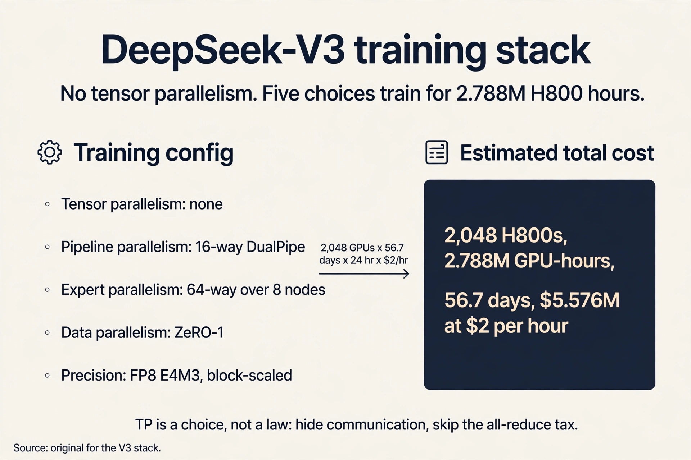

### Coverage and sourcing

This lesson follows the CS229S "Designing Efficient
Architectures" slide deck (Fall 2024 offering, Fall 2023
headers), taught by Azalia Mirhoseini. The deck's arc
runs: the two older primitives (convolution,
recurrence), the FFT convolution theorem, linear
recurrences as convolutions, S4, the language perplexity
gap, Zoology's recall diagnosis, and Mamba's selective
answer. The lesson adds the post-deck history, each fact
dated: Mamba-2's state-space duality (2024), the 2025-2026
hybrid wave (Granite 4.0, Nemotron-H, Falcon-H1,
Qwen3-Next, Kimi-Linear, Mamba-3), and the systems side
of mixture-of-experts (expert parallelism, all-to-all
dispatch, DeepSeek-V3's training stack), with October
2026 updates throughout. CS229 L15 covers MoE and LoRA
from the modeling side (routing, load-balance loss,
fine-grained experts, the adaptation decision). This
lesson covers them from the systems side: what expert
parallelism costs, why V3 trains with no tensor
parallelism, and how the memory math works.

## The problem: the quadratic is still there

FlashAttention made attention exact and fast, but the
compute is still O(N squared). The lecture's
long-sequence cases have not gone away: hundreds of
thousands of words in a math textbook with dependencies
across chapters, raw audio at thousands of timesteps per
second, genomes with interactions spanning 100k+
nucleotides. Can we design architectures that scale
sub-quadratically in sequence length?

Note the honesty of the question. It does not ask for a
faster attention. It asks whether attention is the right
primitive at all.

## Two older primitives

Before answering, the lecture rebuilds the two sequence
primitives that predate the transformer, because the new
architectures are built from them.

A **convolution** mixes the input sequence according to
weights in a filter vector called the **kernel**: each
output is a dot product of the kernel against a window
of the input. The kernel chooses the mixing. An
edge-detector kernel [-1, 2, -1] responds to changes. An
identity kernel [1, 0, 0] passes the signal through.

```ascii
input  : ... x0 x1 x2 x3 x4 ...
kernel : [-1, 2, -1]          <- edge detector
output : ... y1 y2 y3 ...
y2 = -x1 + 2*x2 - x3          <- dot product at each position
```

A **long convolution** sets kernel size equal to input
size: every output sees the whole sequence. Two details
matter. The Fourier transform is circular, built from
periodic sines and cosines, so naive long convolution
wraps samples around the ends: what falls off one end
reappears at the other. For causal modeling, where early
tokens cannot see later ones, pad with kernel_size - 1
zeros.

A **recurrent network** captures the history of all
previously seen tokens in a fixed-size **state**: a state
update equation and an output equation. Inference costs
O(1) memory and O(1) compute per step, because the state
is fixed size no matter how long the sequence gets.

 memory and compute per inference step. Source: Stanford slides. Project: Stanford Frontier AI.")

But Lecture 2 named the three recurrent challenges:
long-range dependencies fade, gradients vanish or explode,
and training serializes across timesteps. As you learned
in CS229S L02, the RNN's state is a bottleneck: every
past token must squeeze through a fixed-size vector, and
the serial chain makes training slow and unstable.

Each primitive, priced:

| Family | Training | Sampling | Context |
|---|---|---|---|
| Recurrent nets | Slow (serial) | Fast, O(1) per step | Potentially infinite |
| ConvNets | Fast (parallel) | Slow | Finite |
| Transformers | Fast (parallel) | Slow, O(N) look-back | Finite |

### Subchapter: the state bottleneck, priced

The RNN state is fixed at size d. Every token the model
ever saw must be represented in those d numbers. At
sequence length 100,000 and d = 4096, the compression
ratio is 100,000 tokens into 4,096 numbers: about 24
tokens per number. Information is lost by construction.
Attention keeps every token addressable at O(N) memory
per step. The tradeoff the whole lecture navigates:
fixed memory with lossy compression, or full memory with
exact lookup.

## The key question

A naive long convolution costs O(N squared): N outputs,
each a dot product of N terms. If attention is also O(N
squared), why bother with convolutions? The answer is a
theorem.

## The FFT convolution theorem

**Convolution in the time domain equals pointwise
multiplication in the frequency domain.** Three steps:

1. Fourier-transform the input x and the kernel k.
2. Multiply pointwise: O(N).
3. Inverse-transform back.


A naive Fourier transform is itself O(n squared): n
outputs, each a sum of n terms. The Cooley-Tukey Fast
Fourier Transform (1965) computes it in O(n log n).
Total: n^2 becomes O(n log n).

 per transform falls to O(n log n) with Cooley-Tukey. Source: Stanford slides. Project: Stanford Frontier AI.")

### Subchapter: the FFT, worked on n = 8

A naive Fourier transform at n = 8: 8 outputs, each a sum
of 8 terms, 64 operations. Cooley-Tukey splits the
8-point transform into two 4-point transforms plus 8
butterfly combines: 2 x 16 + 8 = 40, then the 4-point
transforms split again, down to n log2 n = 24
operations. The trick is recursive halving: even and odd
samples separate, the transform runs on each half, and
the halves recombine with twiddle factors. **Twiddle
factors** are the complex roots of unity that weight the
recombination: the rotation each half needs to align with
the full transform.

At n = 1,048,576 the gap is the point: naive needs 10^12
operations, Cooley-Tukey needs 21M. Every log factor the
problem grows, the FFT wins by more.


The FFT is the core primitive that makes
convolution-based sequence models fast. It is exact, not
approximate: the theorem is an equality. Attention has no
such exact speedup. Its only exact fix was the systems
engineering of FlashAttention.

## Linear recurrences are convolutions

Now the recurrence's training problem. If the state
update f() has nonlinearities, timesteps depend on each
other sequentially. But if f() is **linear** (and time
invariant), the computation parallelizes across the
sequence (Martin and Cundy, 2018). Regrouping the terms
shows why: a linear time-invariant recurrence unrolls
into a convolution of the input with a kernel derived
from the recurrence weights. Train it as a convolution
(fast, parallel, FFT), run it as a recurrence (fast, O(1)
sampling). That duality is the whole trick behind S4.

**S4** (Gu et al., 2022) generalizes linear
time-invariant recurrences with structured state spaces.
The efficient transformers had struggled on the Long
Range Arena (Tay et al., 2020), the standard long-context
suite. In 2022, S4 solved those failure tasks to
near-perfect accuracy, including Path-X. It also reached
state of the art on audio generation and time-series
modeling. Sub-quadratic sequence modeling had its
breakthrough.

### Subchapter: the duality, worked

Recurrence: h_t = 0.5 h_{t-1} + x_t. Unroll it: h_0 =
x_0, h_1 = x_1 + 0.5 x_0, h_2 = x_2 + 0.5 x_1 + 0.25
x_0. Every output is a dot product of the input with a
kernel of decaying powers: [1, 0.5, 0.25, ...]. The
recurrence was a convolution in disguise. The recurrence
weights chose the kernel.

Train with the FFT as a convolution: all timesteps in
parallel, O(n log n). Sample as the recurrence: one
state update per step, O(1). The duality is exact
because the recurrence is linear: no nonlinearity couples
the timesteps, so regrouping the terms is legal. Add a
nonlinearity and the disguise fails. Training serializes
again.


### Subchapter: what S4 added over a plain linear recurrence

A plain linear recurrence forgets exponentially: the
kernel [1, 0.5, 0.25, ...] decays, so distant tokens
vanish. S4's contribution is the state-space structure:
the A matrix is initialized from HiPPO theory, which
derives the optimal way to compress history into a fixed
state. **HiPPO** (high-order polynomial projection
operators) frames memorization as function approximation:
the state holds the coefficients of the best polynomial
fit to the history so far. The kernel stops being naive
exponential decay and becomes a structured memory. That
is why S4 solved Path-X where plain recurrences failed:
the memory was designed, not decayed.

## Where it breaks: language

Applied to language modeling, gaps remained. At 360M
parameters on the same 10B Pile tokens, same
infrastructure, same data order:

 8.39 vs SSM variants 9.79-13.13 at 360M scale. Source: Stanford slides, Zoology 2023. Project: Stanford Frontier AI.")

Attention (Llama-style) reached 8.39 perplexity. GPT-2
style reached 8.97. The state space model (SSM) variants
sat between 9.79 and 13.13. Something about language
resisted the convolutional answer.

## The key question, again

What does language need that long convolutions lack?
Zoology (Arora, Eyuboglu et al., 2023) diagnosed it with
a behavior called **recall**: grounding the next
prediction in information from the context. Synthetic
form: given mappings like "C 8" and "A 3" earlier in the
sequence, predict the value for a recall key. Real form:
"A door panel blew off a 737 Max 9 during an Alaska
Airlines flight" requires "Max" and "Airlines" to
interact across distance.

Compare the **sequence mixers**: each takes input
embeddings and outputs a mixed sequence, i.e. applies a
mixing matrix. The attention mixing matrix is
**input-dependent**: the queries and keys that produce it
are functions of the input x, so the mixing adapts to
content. The attention-free mixing matrix is
**diagonal-constant**: fixed, independent of the input.
Recall needs a fully flexible mixing matrix, and only
the input-dependent one qualifies.


### Subchapter: the recall toy, worked

Sequence: "C 8 ... A 3 ... what is the value of C?"
Attention answers it: the query built from "C?" matches
the key built from "C" at position 1, the mixing matrix
puts weight 1 on position 1, and the value 8 routes to
the output. The routing decision depends on the content:
the query and key are functions of the input tokens.

A convolution cannot do this. Its mixing matrix is
diagonal-constant: position i always mixes position i -
k with weight w_k, whatever the tokens say. No fixed
pattern of weights can route "the value that followed
the recalled key" for arbitrary keys. The failure is
structural, not a matter of more parameters.


The lecture's two conclusions. First, measure efficiency
on the task, not just the sequence length: convolutions
are O(N log N) but attention is more efficient at
recall. Second, do error analysis on your architectures:
the gated convolutions' recall failure was found by
looking at what they predicted wrong, not by staring at
complexity bounds.

## Building the new architectures

The design target is now explicit: (1) computational and
memory efficiency, sub-quadratic in sequence length, and
(2) input-dependent sequence mixing, for recall.
**Mamba** (Gu and Dao, 2023) makes the state-space
parameters selective, i.e. input dependent. Gated linear
attention and Based push the same direction from the
linear-attention side. Keep the sub-quadratic scaling,
and make the mixing depend on the input.

### Subchapter: Mamba's selection, worked

In S4 the recurrence h_t = A h_{t-1} + B x_t uses fixed A
and B: the state decays and absorbs at the same rate for
every token. Mamba makes the step size Delta, the input
matrix B, and the output matrix C functions of the input
token.

The worked meaning: Delta = 2 means the state keeps
almost everything from this token (remember it). Delta =
0.1 means the state barely updates (forget it). The
model learns to set Delta large on content tokens and
small on filler. Selectivity is the input-dependent gate
the recall diagnosis demanded, and the recurrence still
runs in linear time with O(1) state per step.


### Subchapter: Mamba-2 and the hardware problem

Selectivity broke the convolution duality: with
input-dependent A and B, the recurrence is no longer
time-invariant, so the FFT trick does not apply.
Training a selective recurrence naively serializes.

**Mamba-2** (Dao and Gu, 2024) solved it with
**state-space duality**: the selective SSM computes the
same operation as a restricted linear attention. The
recurrence becomes a masked matrix multiply, which is
what GPUs are built for. Same idea, hardware-friendly
execution. The systems lesson: the algorithm follows the
hardware. When selectivity killed the FFT path, the
answer was a new duality to the matmul path, not a
faster serial scan.

**Mamba-3** (March 2026) continued the line as a pure
selective state-space model. The frontier pattern by
then was set: pure SSMs exist, but production runs
hybrids.

### Subchapter: the linear-attention cousins

The same diagnosis produced a second family from the
linear-attention side. **Gated DeltaNet** adds gating
and delta-rule updates to linear attention: the state
updates by forgetting old content and writing new
content, both input-dependent. Qwen3-Next ships Gated
DeltaNet layers alongside gated attention. **Kimi-Linear**
(October 2025) pairs KDA (Kimi delta attention) with MLA
and was the first linear-attention model to beat full
attention in fair iso-recipe comparisons. MiniMax-M1
ships lightning attention.

The hardware trick they share is the **chunkwise
parallel form**: process the sequence in chunks,
compute intra-chunk attention exactly, and carry a
recurrent state between chunks. Training parallelizes
over chunks. Inference carries O(1) state. SGLang ships
linear-attention kernel backends (GDN, KDA) for these
models. The family keeps growing because the recipe
works: sub-quadratic scaling plus input-dependent
mixing, with a hardware path for both.

## The systems side of MoE: scale parameters, not compute

The lecture's architectures scale the sequence dimension.
Mixture-of-experts scales the parameter dimension, and
its problems are systems problems. As you learned in
CS229 L15, MoE routes each token to a few expert
networks: DeepSeek-V3 activates 37B of 671B parameters
per token, 5.5 percent. The modeling side (routing,
load-balance loss, fine-grained experts) lives in CS229
L15. This section is the systems side: what it costs to
train and serve that routing.

### Subchapter: expert parallelism and the all-to-all

**Expert parallelism** places different experts on
different GPUs. A token routed to experts on another GPU
must travel: its activations are sent over the
interconnect, the expert computes, the results return.
That exchange is an **all-to-all** collective: every GPU
sends a slice to every other GPU. It is the MoE analog
of the all-reduce in data parallelism, and it is the
dominant communication cost of MoE training.

DeepSeek-V3 trains with 64-way expert parallelism over
8 nodes: 8 expert-parallel GPUs per node, experts spread
across the cluster. The all-to-all crosses node
boundaries over InfiniBand. The systems question is how
much traffic each token generates.

### Subchapter: node-limited routing, worked

V3 routes each token to 8 of 256 experts. Unconstrained,
those 8 experts could sit on 8 different nodes: 8
cross-node transfers per token per MoE layer, times 58
MoE layers. **Node-limited routing** caps it: each
token's experts may span at most M = 4 nodes. The router
picks experts within the node budget.

The traffic math: without the cap, worst case 8 nodes
touched per token. With M = 4, at most 4. The cap halves
the worst-case cross-node fan-out. Combined with
DeepEP's custom all-to-all kernels (built to saturate
both InfiniBand and NVLink), the paper reports
near-zero all-to-all overhead: as the model scales, the
computation-to-communication ratio is held constant, so
fine-grained experts stay affordable.

### Subchapter: fine-grained experts and their systems price

V3 uses 256 small experts (intermediate dim 2048) plus 1
shared expert, top-8 routing. Compare 8 large experts:
fewer experts means coarser specialization but less
routing traffic. Fine-grained experts specialize better
(the modeling win from CS229 L15), but each token
touches 8 experts instead of 1 or 2, multiplying the
all-to-all volume.

The systems price of granularity is communication.
V3's answer is the stack above: node-limited routing
bounds the fan-out, DeepEP kernels saturate the links,
and DualPipe (below) overlaps the exchange with
computation. Granularity is affordable only with the
full systems stack beneath it.

### Subchapter: the load-balance problem, systems view

If the router sends most tokens to a few experts, those
GPUs drown while others idle. The classic fix is an
auxiliary load-balance loss, but it trades quality for
balance. V3's **auxiliary-loss-free** strategy adjusts a
per-expert bias from observed utilization: over-used
experts get their bias lowered, under-used get it
raised. No loss term, no quality tradeoff. The systems
view: balance is a scheduling problem, and V3 schedules
with biases instead of paying in the loss.

**Token dropping** is the backstop: each expert has a
capacity factor, and tokens beyond capacity are dropped
(skipped). Dropping bounds the worst-case compute per
expert. The price is lost information. The design rule:
set capacity from the balance statistics, not from hope.

### Subchapter: MLA plus MoE, the memory math

V3 pairs MoE with multi-head latent attention. MLA
compresses the KV cache into a 512-dim latent per layer
instead of full key/value heads. Per token: 512 x 61
layers x 2 bytes = 62,464 bytes, about 61 KB. At 128K
context: about 8.2 GB.

The counterfactual: with ordinary multi-head attention
(61 layers, 32,768 cached numbers per layer), each token
would cost about 4.0 MB. At 128K context: 524 GB. MLA
cuts the cache roughly 65x. MoE cuts the active
parameters 18x (671B to 37B). The two multiply: the
model is big in total parameters and small in both
active compute and cache. That is the systems shape of
V3.

### Subchapter: DualPipe, the pipeline answer

V3 trains with 16-way pipeline parallelism and no tensor
parallelism: unusual for a 671B model, and deliberate.
Tensor parallelism all-reduces after every block. V3
avoids it entirely. **DualPipe** is the pipeline
schedule that makes this work: it duplicates the
pipeline stages so that computation and communication
overlap, shrinking the bubble toward zero.

The standard pipeline bubble (L10) wastes (p-1)/(m+p-1)
of device time on fill and drain. DualPipe feeds
micro-batches from both ends of the pipeline, so the
fill of one direction overlaps the drain of the other,
and the all-to-all exchange hides inside the overlapped
compute. The paper's claim: near-zero pipeline bubble
with most communication hidden. Data parallelism uses
ZeRO-1 underneath.

The full V3 training stack in one table:

| Choice | Value | Why |
|---|---|---|
| Tensor parallelism | none | DualPipe plus DeepEP remove the need; TP's per-block all-reduces avoided |
| Pipeline parallelism | 16-way, DualPipe | near-zero bubble, overlapped comm |
| Expert parallelism | 64-way over 8 nodes | experts spread; all-to-all via DeepEP |
| Data parallelism | ZeRO-1 | optimizer state sharded |
| Precision | FP8 E4M3, block-scaled | 1x128 activation tiles, 128x128 weight blocks |
| Scale | 2,048 H800s, 2.788M GPU-hours | 56.7 days; $5.576M at $2/hr |



## What is used where: real models, 2026

Pure transformers still dominate, but selective
state-space layers and MoE are shipping in production.
Facts as of October 2026, from public releases.

Notation: XB-AYB = X billion total parameters, Y billion
active per token.

| Model | Architecture | Source |
|---|---|---|
| AI21 Jamba (398B) | Mamba + attention hybrid | [public, Aug 2025](https://openrouter.ai/ai21/jamba-large-1.7) |
| NVIDIA Nemotron-H (8B, 47B, 56B) | Mamba-2 + attention + MoE hybrid | [public, Jun 2025](https://huggingface.co/nvidia/Nemotron-H-8B-Reasoning-128K-FP8) |
| TII Falcon-H1 (34B) | Mamba-2 hybrid | [public, May 2025](https://cryptokorner.com/technology-innovation-institute-tii-releases-falcon-h1-hybrid-transformer-ssm-language-models-for-scalable-multilingual-and-long-context-understanding/) |
| IBM Granite 4.0 | Mamba-2 + transformer, 9:1 ratio | [public, Oct 2025, Apache 2.0](https://oneyearago.ai/news/2025-10-02-ibm-granite-4-hybrid-mamba/) |
| IBM Bamba (9B) | SSM + transformer | [public, Dec 2024](https://github.com/huggingface/blog/blob/HEAD/bamba.md) |
| TII Falcon-Mamba (7B) | pure Mamba | [public, Aug 2024](https://huggingface.co/docs/transformers/v4.45.1/model_doc/falcon_mamba) |
| Mistral Codestral Mamba (7B) | pure Mamba | [public, Jul 2024](https://aiinovationhub.com/mistral-codestral-mamba-7b-ai-model/) |
| Microsoft Samba (4B) | Mamba + sliding-window attention | [public, Jun 2024 (paper reports 3.8B)](https://huggingface.co/papers/2406.07522) |
| Mamba-3 | pure selective SSM | [public, Mar 2026](https://www.turingpost.com/p/mamba) |
| Qwen3-Next (80B-A3B) | Gated DeltaNet + gated attention | [public, Sep 2025](https://blockchain.news/ainews/alibaba-releases-qwen3-next-80b-a3b-advanced-80b-parameter-mixture-of-experts-ai-model-for-long-context-inference) |
| Kimi-Linear (48B-A3B) | KDA + MLA linear attention | [public, Oct 2025](https://www.worldprogramming.org/posts/kimi-linear-an-expressive-efficient-attention-architecture-2025-ojglam) |
| MiniMax-M1 | lightning attention hybrid | [public, Jun 2025](https://huggingface.co/papers/2506.13585) |
| DeepSeek-V3 (671B-A37B) | MoE + MLA, aux-loss-free routing | [public, Dec 2024](https://arxiv.org/abs/2412.19437) |
| DeepSeek-V3.2 (671B-A37B) | MoE + DeepSeek Sparse Attention | [public, Dec 2025](https://github.com/alkinun/speck/blob/HEAD/research/literature/21_deepseek_v3_2.md) |
| DeepSeek-V4 Pro (1.6T-A49B) | MoE | [public, Aug 2026](https://www.yottalabs.ai/post/deepseek-v4-release-date-specs-how-to-access-2026) |
| Llama 4 Scout (109B-A17B) | MoE, 16 experts | [public, Apr 2025](https://github.com/zucchini-nlp/transformers/blob/HEAD/docs/source/en/model_doc/llama4.md) |
| Llama 4 Maverick (400B-A17B) | MoE, 128 experts | [public, Apr 2025](https://github.com/zucchini-nlp/transformers/blob/HEAD/docs/source/en/model_doc/llama4.md) |
| Qwen3.5-35B-A3B | Gated DeltaNet + MoE hybrid | [public, Feb 2026](https://github.com/99sono/dockerbuildfiles/blob/HEAD/inference-containers/ai-labs/alibaba-qwen.md) |
| Mistral Large 3 (675B-A41B) | MoE | [public, Dec 2025](https://intuitionlabs.ai/articles/mistral-large-3-moe-llm-explained) |
| Mistral Small 4 (119B-A6B) | MoE, 128 experts 4 active | [public, Mar 2026](https://awesomeagents.ai/news/mistral-small-4-moe-apache-configurable-reasoning/) |
| GPT-OSS 120B (117B-A5.1B) | MoE, MXFP4-native | [public, Aug 2025](https://www.neowin.net/news/openai-finally-releases-its-open-weight-models-optimized-for-laptops-and-smartphones/) |
| Kimi K2.x (~1T) | MoE | [public, Jan 2026 (K2.5: 1T/32B)](https://github.com/vincentxuu/quidproquo/blob/HEAD/references/open-source-llm-landscape-2026-03.md) |

The 2026 pattern: hybrids won. Builders use recurrent
or linear state-space layers for cheap long-sequence
processing and keep attention where direct token access
matters, and they use MoE to scale parameters without
scaling compute. Pure Mamba models exist (Falcon-Mamba,
Codestral Mamba, Mamba-3), but the production default is
the mix. Frontier-lab internals beyond these releases
are not public.

## Mapping back: each primitive answers one pain

| Pain | Primitive that answers it |
|---|---|
| Training must be parallel | Long convolutions via the FFT: O(n log n), exact |
| Sampling must be cheap | Linear recurrences: O(1) memory and compute per step |
| Language needs content lookup | Input-dependent mixing: selective state spaces, gated linear attention |
| Parameters must scale without compute | MoE: 37B active of 671B; expert parallelism spreads the rest |
| MoE communication must not dominate | Node-limited routing, DeepEP kernels, DualPipe overlap |
| Cache must fit long context | MLA: 61 KB per token vs 4.0 MB hypothetical MHA |

## The honest price

The lecture closes with three open jobs, and they are
all legwork. First, the same tuning that trained
transformers well (width, depth, hyperparameters) must
be repeated for the new models. Second, the new
primitives (FFT, parallel scans, chunkwise forms) need
the efficient implementations that transformers already
enjoy. Third, keep measuring behavior, not just
complexity: modalities beyond language are still open
country. Six years of transformer tuning do not transfer
for free.

MoE's own price: routing is a systems tax. Expert
parallelism communicates every layer, load imbalance
idles GPUs, and fine-grained experts multiply the
all-to-all. V3 shows the tax is payable with the full
stack (node-limited routing, DeepEP, DualPipe), but the
stack is the price of admission. And DeepSeek-V3.2's
sparse attention (December 2025) hints at the next turn:
learned sparsity on top of the MoE transformer, cutting
long-context inference cost about 50 percent.

## Coverage map: every lecture claim and where it lives

| Lecture claim | Covered in | File line |
|---|---|---|
| Quadratic still there after FlashAttention; books, audio, genomes | The problem: the quadratic is still there | L59 |
| Convolution: kernel mixes windows; [-1,2,-1] edge detector; long conv | Two older primitives | L74 |
| Circular FFT wraps ends; pad kernel_size-1 zeros for causality | Two older primitives | L74 |
| RNN: fixed-size state, O(1) inference; three challenges from L02 | Two older primitives | L74 |
| State bottleneck priced: 100k tokens into 4,096 numbers | the state bottleneck, priced | L126 |
| Primitive tradeoff table: recurrent, convnet, transformer | Two older primitives | L74 |
| FFT theorem: time convolution equals frequency pointwise multiply | The FFT convolution theorem | L145 |
| Cooley-Tukey O(n log n); n=8 worked 64 to 24; n=1M 10^12 to 21M | the FFT, worked on n = 8 | L163 |
| Linear time-invariant recurrences unroll to convolutions (Martin and Cundy) | Linear recurrences are convolutions | L189 |
| Duality worked: h_t unrolls to kernel [1, 0.5, 0.25] | the duality, worked | L212 |
| S4: structured state spaces; solved Long Range Arena and Path-X | Linear recurrences are convolutions | L189 |
| S4's HiPPO-structured state vs naive exponential decay | what S4 added over a plain linear recurrence | L231 |
| Language gap: 8.39 vs 9.79-13.13 perplexity at 360M | Where it breaks: language | L246 |
| Recall: input-dependent vs diagonal-constant mixing matrices | The key question, again | L259 |
| Recall toy: attention routes 8 by content; convolution cannot | the recall toy, worked | L283 |
| Measure task efficiency; error analysis over complexity bounds | The key question, again | L259 |
| Design target: sub-quadratic plus input-dependent mixing | Building the new architectures | L309 |
| Mamba: Delta, B, C input-dependent; Delta=2 remembers, 0.1 forgets | Mamba's selection, worked | L320 |
| Mamba-2 state-space duality: selective SSM as restricted linear attention | Mamba-2 and the hardware problem | L338 |
| Mamba-3 pure SSM, Mar 2026 (Oct 2026 update) | Mamba-2 and the hardware problem | L338 |
| Gated DeltaNet, Kimi-Linear KDA+MLA, chunkwise parallel form, SGLang backends | the linear-attention cousins | L360 |
| MoE systems: 37B active of 671B, 5.5%; modeling side in CS229 L15 | The systems side of MoE | L383 |
| Expert parallelism: all-to-all dispatch; V3 64-way over 8 nodes | expert parallelism and the all-to-all | L395 |
| Node-limited routing M=4; halves worst-case fan-out; DeepEP near-zero overhead | node-limited routing, worked | L412 |
| Fine-grained experts 256x2048 top-8; granularity priced in communication | fine-grained experts and their systems price | L430 |
| Aux-loss-free bias routing; token dropping and capacity factor | the load-balance problem, systems view | L447 |
| MLA+MoE: 61 KB/token vs 4.0 MB MHA; 128K is 8.2 GB vs 524 GB | MLA plus MoE, the memory math | L465 |
| DualPipe: 16-way PP, no TP, near-zero bubble; ZeRO-1 DP | DualPipe, the pipeline answer | L482 |
| V3 stack table: 2,048 H800s, 2.788M hours, 56.7 days, $5.576M | DualPipe, the pipeline answer | L482 |
| Hybrids table 2026: Jamba, Nemotron-H, Falcon-H1, Granite, Mamba-3, Qwen3-Next, Kimi, V3/V4, Llama 4, Mistral, GPT-OSS, K2 (Oct 2026) | What is used where | L514 |
| Primitives mapped to pains; MoE and MLA rows | Mapping back | L557 |
| Honest price: retuning, kernels, behavior measurement; MoE routing tax; V3.2 sparse attention | The honest price | L568 |

> [!QA]
> Q: Why is a long convolution worth doing if it is O(N squared) like attention?
> A: Because the FFT convolution theorem turns it into O(N log N). Transform both signals to the frequency domain with the Cooley-Tukey FFT, multiply pointwise, transform back. Attention has no such exact speedup: its only exact fix is the systems engineering of FlashAttention. The convolution's structure admits a faster algorithm.
> Follow-up: What breaks if you forget causality in a long convolution?
> A: The Fourier transform is circular, so samples wrap around the ends and early outputs see late inputs. For autoregressive modeling that leaks the future. Pad with kernel_size - 1 zeros to restore causality.

> [!QA]
> Q: How can a recurrence train in parallel if it is defined sequentially?
> A: Only if it is linear and time invariant. Then regrouping the terms shows the unrolled recurrence is a convolution of the input with a kernel derived from the recurrence weights. Train it as a convolution with the FFT, run it as a recurrence for O(1) sampling. Nonlinear recurrences keep the serial dependency and cannot use this trick.
> Follow-up: What did S4 actually achieve?
> A: It solved the Long Range Arena failure tasks to near-perfect accuracy including Path-X, and reached state of the art on audio generation and time-series modeling. It was the first sub-quadratic architecture to beat efficient transformers where they were weakest: very long contexts. The HiPPO-structured state is why: designed memory, not exponential decay.

> [!QA]
> Q: Why do convolutional sequence models struggle with recall while attention handles it?
> A: Recall needs the mixing between tokens to depend on the content: which earlier token matters depends on what the tokens say. Attention's mixing matrix is built from input-dependent queries and keys, so it adapts per example. A convolution's mixing matrix is diagonal-constant, fixed regardless of input. No fixed mixing pattern can route arbitrary content-based lookups, so perplexity gaps persist even though convolutions scale better asymptotically.
> Follow-up: What architecture direction does this suggest?
> A: Keep the sub-quadratic scaling but make the mixing input-dependent. That is exactly Mamba's selective state spaces and gated linear attention: the recurrence or convolution weights become functions of the input, recovering the flexibility that recall needs while keeping linear-time scaling.

> [!QA]
> Q: Walk me through the FFT convolution theorem on a toy.
> A: Input [1, 2, 3, 4], kernel [1, 1]: naive time-domain convolution computes each output as a dot product, O(n^2). The theorem: transform both signals to the frequency domain with the FFT (O(n log n) each), multiply pointwise (O(n)), inverse-transform back (O(n log n)). The result equals the naive convolution exactly: it is a theorem, not an approximation. The speedup comes from the structure of convolution, which attention lacks.
> Follow-up: Why is it exact?
> A: Because the theorem is an equality about what convolution means in frequency space, not a numerical shortcut. Every step (FFT, pointwise multiply, inverse FFT) is exact arithmetic up to floating-point rounding. Sparsity and low-rank methods trade accuracy for speed. The FFT does not.

> [!QA]
> Q: Why does selectivity fix recall?
> A: Because selectivity makes the mixing input-dependent. In Mamba, Delta, B, and C are functions of the current token: the model sets Delta large on the token it must remember later and small on filler. The state update then routes content the way attention's query-key matching does, while staying a linear recurrence. Zoology's diagnosis was that recall needs input-dependent mixing. Selectivity is the SSM version of it.
> Follow-up: If selectivity recovers attention's flexibility, why is Mamba still linear time?
> A: Because the state stays fixed-size: selectivity changes which information enters the state, not the state's size. Attention's cost comes from comparing every token against every past token. The selective recurrence updates one fixed state per step. Content-dependent routing without the pairwise matrix.

> [!QA]
> Q: Worked: unroll h_t = 0.5 h_{t-1} + x_t for three steps and name the kernel.
> A: h_0 = x_0. h_1 = x_1 + 0.5 x_0. h_2 = x_2 + 0.5 x_1 + 0.25 x_0. The kernel is [1, 0.5, 0.25]: powers of the decay 0.5. In general, h_t = a h_{t-1} + b x_t unrolls to the kernel [b, ab, a^2 b, ...]. The recurrence's weights chose the convolution's kernel: that is the duality in one line.
> Follow-up: What breaks if the update is h_t = tanh(0.5 h_{t-1} + x_t)?
> A: The tanh couples the timesteps nonlinearly, so regrouping the terms into a convolution is no longer legal. Training serializes across timesteps again: the exact failure mode of classical RNNs that the linear trick escapes.

> [!QA]
> Q: Why does DeepSeek-V3 train with no tensor parallelism, and what replaces it?
> A: Tensor parallelism all-reduces after every attention and MLP block, and V3's designers judged that tax too high at 671B scale. Two replacements: 16-way pipeline parallelism with the DualPipe schedule (near-zero bubble, communication overlapped with compute) handles the layer dimension, and 64-way expert parallelism with DeepEP's all-to-all kernels handles the MoE dimension. ZeRO-1 shards the optimizer state underneath. The lesson: TP is a choice, not a law. If the pipeline and expert schedules hide their communication, the per-block all-reduces are pure overhead.
> Follow-up: What is node-limited routing, and what does it buy?
> A: Each token's 8 experts may span at most M = 4 nodes, instead of scattering across up to 8. It halves the worst-case cross-node fan-out per token per MoE layer. Combined with DeepEP kernels that saturate InfiniBand and NVLink, the all-to-all overhead approaches zero. It is a routing constraint that buys a communication bound.

> [!QA]
> Q: Applied design: you need 1M-token context on a fixed memory budget. Attention, S4, or Mamba? Pick and defend.
> A: Pure attention is out: the KV cache at 1M tokens is terabytes, and prefill is quadratic. S4 trains and samples cheaply but its fixed mixing fails content lookup, so any task needing recall from the context breaks. Mamba (or a hybrid) is the pick: linear-time scaling, O(1) state per step, and selective mixing that handles recall. For exact copying or citation over the full 1M, add a few attention layers: that is why production hybrids (Jamba, Nemotron-H, Granite 4.0) exist. The design answer prices each option in the two currencies that matter: memory and recall.
> Follow-up: The workload is verbatim citation from the context. Does that change the pick?
> A: Yes. SSMs compress history into a fixed state and can lose fine-grained detail. Transformers keep every token addressable. For verbatim citation, keep attention (possibly with retrieval over the context) and pay the memory cost, or use a hybrid weighted toward attention. Match the architecture to the task's hardest demand.

## Recap: the whole lesson on one screen

The story in ten steps. Each step answers the one before
it.

1. **The quadratic is still there.** FlashAttention is
   exact but O(N squared) in compute. Books, audio, and
   genomes need sub-quadratic.
2. **Two older primitives.** Convolutions mix by kernel
   ([-1, 2, -1] detects edges). Recurrences keep a
   fixed-size state with O(1) sampling. Each has a price:
   the state compresses 100k tokens into 4,096 numbers.
3. **Why bother with O(N squared) convolutions?** The
   key question: attention is quadratic too.
4. **The FFT theorem answers.** Time-domain convolution
   equals frequency-domain pointwise multiplication.
   Cooley-Tukey (1965) makes it O(n log n). Exact.
5. **Linear recurrences are convolutions.** Unroll and
   regroup: train parallel as a convolution, sample
   recurrent in O(1). S4's HiPPO-structured state solved
   Long-Range Arena and Path-X.
6. **Language resisted.** At 360M scale: attention 8.39
   perplexity versus 9.79 to 13.13 for SSM variants.
   Something was missing.
7. **Recall needs input-dependent mixing.** Attention
   adapts its mixing matrix to content. Convolutional
   mixing is diagonal-constant. Content lookup needs the
   former.
8. **Sub-quadratic plus selective.** Mamba, Mamba-2's
   duality, gated linear attention, Gated DeltaNet:
   keep linear scaling, make mixing input-dependent.
   Measure task efficiency, not asymptotics.
9. **MoE scales parameters, not compute.** 37B active of
   671B. Expert parallelism communicates every layer:
   node-limited routing, DeepEP kernels, DualPipe
   overlap, aux-loss-free balance. V3 trains with no
   tensor parallelism: 2.788M H800 hours, $5.576M.
10. **Hybrids won.** Attention where lookup matters,
    state spaces where sequences are long, MoE where
    parameters must scale. Measure behavior, not
    complexity.

## Go deeper

<div style="position:relative;padding-bottom:56.25%;height:0;overflow:hidden;max-width:100%;margin:16px 0;">
<iframe style="position:absolute;top:0;left:0;width:100%;height:100%;" src="https://www.youtube-nocookie.com/embed/9dSkvxS2EB0" title="Mamba Explained" frameborder="0" allow="accelerometer; autoplay; clipboard-write; encrypted-media; gyroscope; picture-in-picture" allowfullscreen></iframe>
</div>

- Mamba explained: selective state spaces from zero: https://www.youtube.com/watch?v=9dSkvxS2EB0
- Mamba and state space models visual guide: https://www.youtube.com/watch?v=8Q_tqwpTpVU
- S4: Efficiently Modeling Long Sequences with Structured State Spaces: https://arxiv.org/abs/2111.00396
- Mamba: Linear-Time Sequence Modeling with Selective State Spaces: https://arxiv.org/abs/2312.00752
- Mamba-2: Transformers are SSMs (state space duality): https://arxiv.org/abs/2408.00790
- Zoology: Measuring and Improving Recall in Efficient Language Models: https://arxiv.org/abs/2312.05482
- DeepSeek-V3 Technical Report: https://arxiv.org/abs/2412.19437
- Where Mamba is used today (2026 survey): https://www.turingpost.com/p/mamba

## Official sources and further reading

**Official:**
- Designing Efficient Architectures slide deck (Fall 2023
  headers).

**Further reading:**
- Gu et al., "Efficiently Modeling Long Sequences with
  Structured State Spaces" (2022): S4.
- Arora, Eyuboglu et al., "Zoology" (2023): the recall
  diagnosis.
- Gu and Dao, "Mamba" (2023): selective state spaces.
- Dao and Gu, "Transformers are SSMs" (2024): Mamba-2.
- DeepSeek-AI, "DeepSeek-V3 Technical Report" (2024):
  the MoE systems stack.

**Caveats from these sources.** The perplexity table is
one controlled comparison (360M params, 10B Pile tokens,
same infrastructure). Rankings shift with scale and data.
The RNN/ConvNet/Transformer tradeoff table simplifies:
modern hybrids blur every column. The FFT causality
discussion assumes the circular transform.
Implementations vary in padding convention. V3's
training numbers (2.788M H800 hours, $5.576M at $2/hr)
are the paper's own. The dollar figure excludes prior
research.

## Connections to the other courses

- **CS336 L04:** linear attention and MoE: the
  architecture the kernel idea became.
- **CS229S L02:** the RNN challenges that motivated
  transformers. This lecture revisits them.
- **CS229S L06:** the other answer to O(N squared):
  exact attention done right.
- **CS229S L05:** FFT and parallel scans as new
  primitives needing efficient kernels.
- **CS229S L10:** expert, pipeline, and context
  parallelism: where the V3 stack is derived.
- **CS229 L15:** MoE from the modeling side: routing,
  load balance, fine-grained experts.
