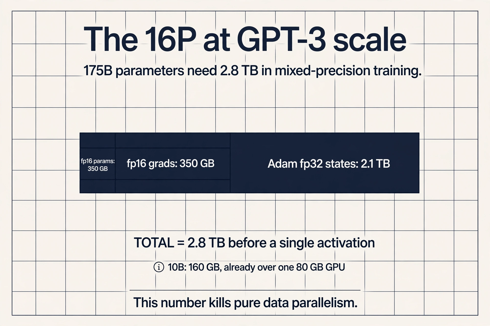
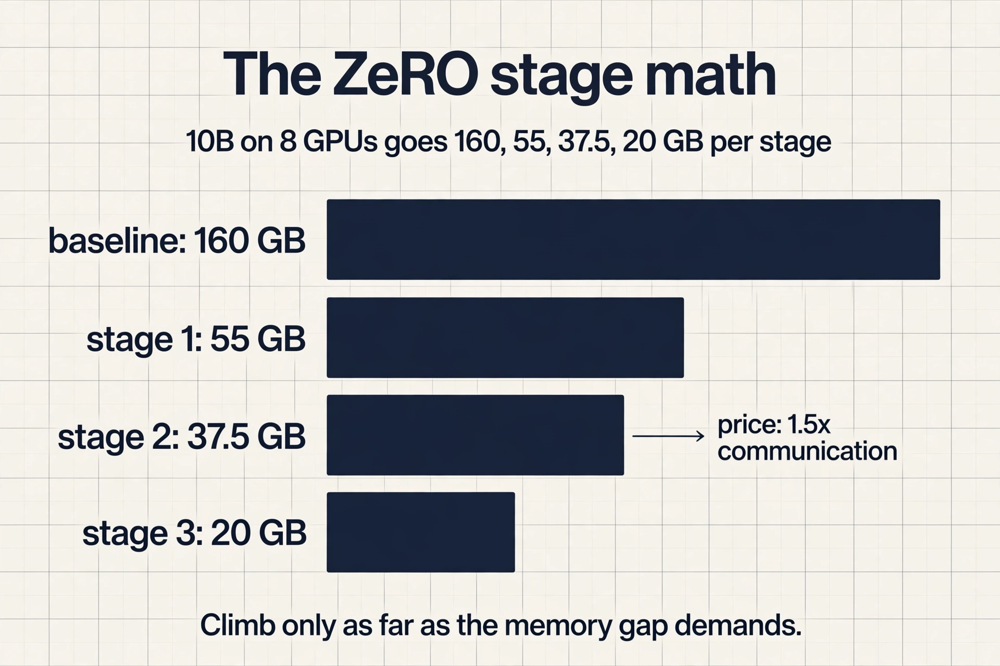
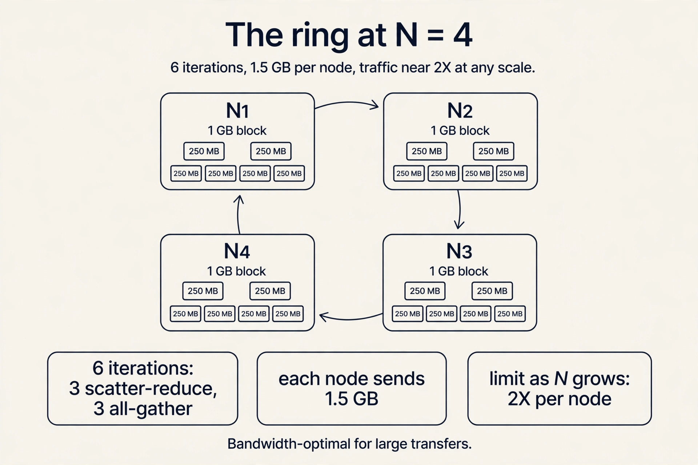
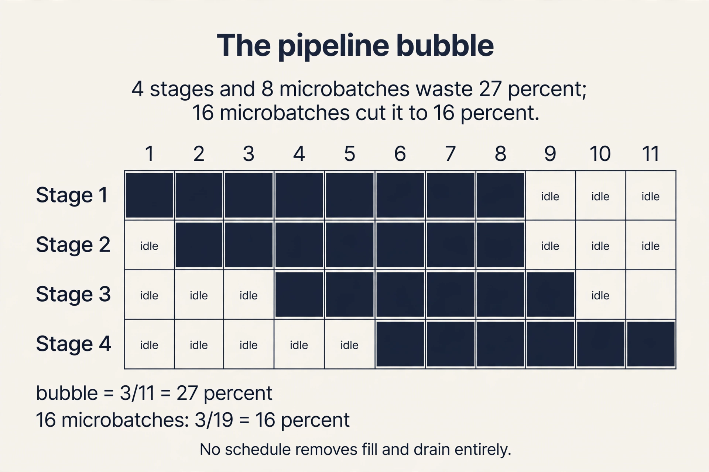

## The problem: one GPU is not enough

Two curves collide. GPU FLOPS double roughly every 2.5
years, but LLMs grow about 10x bigger every year (Epoch AI,
Megatron-Turing NLG 530B). A single device cannot hold the
weights, the activations, the gradients, and the optimizer
state, and even when it can, one device is too slow. The
only way forward is to split the work across many GPUs.
This lecture derives the three ways to split it, the math
that forces the choice, and the rules for combining them.

Two challenges dominate every distributed design:
minimize **communication overhead** (time sending data
between GPUs) and minimize **synchronization overhead**
(dependencies that stop GPUs from working independently).
Everything below is a tradeoff between these two.

## First attempt: split the data

Computation partitions along two axes: the input **data**
or the model **parameters**. The simplest split is the
data.

**Data parallelism**: partition the input data, replicate
the model weights. Four GPUs and batch 64: each GPU takes
16 examples. Forward and backward run independently per
GPU. Each produces its own gradients for its own
sub-batch. At the end of the backward pass, the gradients
are aggregated across all GPUs and averaged. The GPUs
share their gradients with an **all-reduce** operation.


Pros: the most direct throughput lever, since the global
batch grows with each GPU, and easy to implement (PyTorch
native support). Narayanan walks the tradeoffs on real
clusters [06:26](ts:06:26).

## Where it breaks: the memory wall

Data parallelism has a hard requirement: the model,
activations, gradients, and optimizer state must fit on
one GPU. GPT-3 cannot run on pure data parallelism on an
80 GB GPU. And every weight synchronizes every step, so it
is communication-intensive.

Work the memory math for P parameters in mixed-precision
training:


### Subchapter: the 16P, worked at GPT-3 scale

P = 175B. fp16 parameters: 350 GB. fp16 gradients: 350
GB. Adam's three fp32 states: 3 x 700 GB = 2.1 TB. Total:
2.8 TB, before a single activation. The lecture's 10B
worked example (160 GB) already exceeds an 80 GB GPU; at
175B the bill is 35 GPUs of memory for one replica.



- fp16 parameters: 2P bytes
- fp16 gradients: 2P bytes
- Adam state: fp32 parameters 4P, momentum 4P, variance 4P
- Total: 16P bytes, before activations

A 10B-parameter model needs 160 GB for parameters and
optimizer state alone. No single GPU holds that. Data
parallelism replicates all of it on every GPU, which is
pure redundancy: each GPU only needs its share.

## The key question

What if each GPU held only its share of the 16P bytes?
**ZeRO** (Zero Redundancy Optimizer) removes the
replication in three stages.


**Stage 1: optimizer state partitioning.** Group the
optimizer states into Nd equal partitions. Each data
parallel process updates only its partition, then
all-gathers (each GPU collects the full set of) the updated
parameters at the end of each step. Memory per GPU: 4P + 12P/Nd.

**Stage 2: plus gradient partitioning.** Each process
only needs the reduced gradients for its own parameter
partition: 2P bytes of gradients become 2P/Nd. Memory per
GPU: 2P + 14P/Nd, about 2P.

**Stage 3: plus parameter partitioning.** Do not store all
parameters on all processes. Fetch (all-gather) the ones
needed for the forward and backward pass. Memory per GPU:
16P/Nd. The price: about 1.5x more communication volume.

| Stage | Partitions | Memory per GPU |
|---|---|---|
| Baseline | none | 16P |
| 1 | optimizer state | 4P + 12P/Nd |
| 2 | + gradients | 2P + 14P/Nd (about 2P) |
| 3 | + parameters | 16P/Nd |

PyTorch **FSDP** (Fully Sharded Data Parallel) implements
ZeRO-style sharding as a module wrapper: wrap the model,
and sharding, gathering, and reduction happen underneath.

### Subchapter: the ZeRO stages, worked

10B parameters on Nd = 8 data-parallel GPUs. Baseline
16P: 160 GB per GPU, fits nowhere.

Stage 1: 4P + 12P/8 = 40 + 15 = 55 GB per GPU. Fits on an
80 GB GPU with room for activations.

Stage 2: 2P + 14P/8 = 20 + 17.5 = 37.5 GB per GPU. More
headroom for longer sequences.

Stage 3: 16P/8 = 20 GB per GPU. The price: every step
all-gathers the full parameters, about 1.5x the
communication volume.

The ladder is the lesson: each stage halves the memory
roughly, and each stage costs bandwidth. Climb only as far
as the memory gap demands.



```python
from torch.distributed.fsdp import FullyShardedDataParallel as FSDP
sharded_module = FSDP(module)   # ZeRO-style sharding under the hood
```

Match the stage to the memory gap, not the maximum: the
extra all-gathers cost bandwidth, so if the model fits
with stage 1 or 2, the lower stages communicate less.

## The collective everything stands on

Data parallelism averages gradients with an all-reduce:
every GPU ends up with the sum (then the mean) of all
GPUs' gradients. The **ring all-reduce** runs in 2(N-1)
iterations for N GPUs. Each GPU splits its data into N
fragments. The first N-1 iterations accumulate received
values, the next N-1 propagate the completed sums.

 iterations; each node sends 2(N-1)X/N bytes. Bandwidth-optimal. Source: Stanford slides, Patarasuk and Yuan.")

### Subchapter: the ring, worked on N = 4

Four GPUs, gradients X = 1 GB. Each GPU splits its 1 GB
into 4 fragments of 250 MB. Iterations: 2 x (4-1) = 6:
three scatter-reduce rounds accumulate the sums, three
all-gather rounds propagate them. Each node sends 2 x 3 x
1/4 = 1.5 GB total. At 100 GB/s NVLink that is 15 ms of
wire time, and it stays near 2X no matter how many nodes
join: per-node traffic approaches 2X as N grows.

The latency caveat lives in the iteration count: 2(N-1)
rounds of small messages pay latency, not bandwidth. The
ring is optimal for large transfers (gradient sync); small
messages want fewer, fatter hops.



Efficiency: each node sends 2(N-1) x X/N bytes for data of
size X, so communication time is 2(N-1)X / (N x B) at
bandwidth B. As N grows, per-node traffic approaches 2X:
independent of GPU count. That is why the ring is
bandwidth-optimal, and why data parallelism scales to many
nodes.

## The key question, again

ZeRO shrinks the per-GPU memory, but the full model still
passes through every GPU's hands. What if the weights
themselves must be split?

**Model parallelism** replicates the input data and
partitions the model weights. Two flavors. **Vertical
slicing** places subsets of layers on different GPUs. Each
GPU waits for the previous stage's activations, so devices
sit idle most of the time (PipeDream). **Horizontal
slicing** shards within the operation instead.

For transformers, the horizontal style is Megatron
**tensor parallelism**: shard the self-attention and MLP
weights across GPUs, with an all-reduce after every
attention and MLP block to resynchronize. Pros: per-GPU
memory falls, and utilization stays high compared to
vertical slicing. Cons: the all-reduces are extremely
frequent, so throughput demands very fast interconnects,
and the synchronization ops must be added manually to the
attention module.

Narayanan's rule from the talk: tensor parallelism becomes
very unwieldy across nodes [14:48](ts:14:48). Within a
server, 8 GPUs connect over NVLink at very high bandwidth
[15:01](ts:15:01). Across servers, even InfiniBand is much
slower [15:09](ts:15:09). So tensor parallelism lives
inside the node, and its communication never crosses the
slow links. The device block from L05 is the map. This is
the route.


## The key question, once more

Tensor parallelism solved the memory problem but demands
fast networking. What if you have many servers, or one
server without fast interconnects? Revisit vertical
slicing, but fix the idleness with pipelining.

**Pipeline parallelism** splits each batch into
**microbatches** and injects several into the pipeline at
once. While stage 2 processes microbatch 1, stage 1
processes microbatch 2. Idle time shrinks.


### Subchapter: the bubble, worked

Four pipeline stages, eight microbatches. The pipeline
fills for 3 steps and drains for 3 steps: total steps 8 +
4 - 1 = 11, idle steps 3. Bubble fraction: (p - 1) / (m +
p - 1) = 3/11 = 27 percent of the GPUs' time wasted.

Double the microbatches to 16: bubble 3/19 = 16 percent.
The cost: smaller microbatches mean lower arithmetic
intensity. This is the knob the lecture names: microbatch
size trades bubble size against compute efficiency, and no
schedule removes the fill and drain entirely.



Two tuning knobs. **Microbatch size**: larger means higher
arithmetic intensity, but smaller means smaller pipeline
bubbles. **Schedule**: which microbatch runs where and
when. GPipe runs all forwards then all backwards. **1F1B**
(one forward, one backward) interleaves them and shrinks
both the bubble and the activation memory.


Narayanan's talk shows an **interleaved** variant: device
1 holds layers 1 and 5, device 2 holds layers 2 and 6, and
so on, so each device does two phases of forward passes
per microbatch [24:07](ts:24:07). More stages per device
means less idle time at the cost of more point-to-point
messages. TeraPipe extends the idea to the sequence
dimension: split the sequence itself into subsequences
processed incrementally per stage.

Pros: per-GPU memory falls. Communication is
point-to-point sends, not all-reduces. Cons: bubbles never
fully vanish. Scheduling microbatches concurrently is
genuinely hard to implement.

## What is used where: real training stacks

Distributed training is how every large model is built.
Facts as of October 2026.

| Stack | Parallelism | Source |
|---|---|---|
| Megatron-LM (NVIDIA) | tensor + pipeline + data (PTD) | public |
| DeepSpeed ZeRO (Microsoft) | ZeRO stages 1-3, ZeRO-Infinity | public |
| PyTorch FSDP (Meta) | ZeRO-3 style sharding | public |
| DeepSeek-V3 | DualPipe pipeline + FP8 | public in the V3 paper |
| vLLM / TensorRT-LLM | tensor parallelism for serving | public |

The pattern: PTD everywhere at scale, FSDP as the default
open fine-tuning path, DualPipe as the newest public
pipeline schedule. Exact parallelism plans inside frontier
labs (GPT, Gemini) are not public.

## Mapping back: the decision table

All three techniques are now built. The lecture's summary
places each one where its tradeoff wins:


| Situation | Choice | Why |
|---|---|---|
| Weights and activations fit on one GPU | Data parallelism | Simplest, most direct throughput lever |
| They do not fit, but one fast node is available | Tensor parallelism (NVLink) | Frequent all-reduces need the fast links |
| They do not fit, many nodes or slow interconnect | Pipeline parallelism | Point-to-point sends, no all-reduces |

In practice, combine: data plus tensor plus pipeline
(**PTD** or 3D parallelism) scales to thousands of GPUs
(DeepSpeed, Megatron-LM). The strategy space grows
combinatorially and experiments at scale are slow and
expensive, so **Alpa** (Zheng et al., OSDI 2022) automates
the search: it treats inter-operator parallelism
(pipeline) and intra-operator parallelism (data, tensor)
separately and picks the optimal combination for a given
model and cluster.

## The honest price

Every split pays in communication or synchronization.
Data parallelism synchronizes every weight every step.
Tensor parallelism all-reduces after every block and dies
on slow networks. Pipeline parallelism never fully kills
the bubble and is hard to implement. The 16P figure
excludes activations, which vary with sequence length and
checkpointing. And the strategy space is combinatorial:
Alpa exists because no human tunes thousand-GPU
parallelism by hand.

> [!QA]
> Q: A 10B-parameter model trains in mixed precision with Adam. How much memory do the parameters and optimizer state need, and what does ZeRO stage 3 change?
> A: Baseline: 2P for fp16 params, 2P for fp16 grads, and 12P for fp32 params, momentum, and variance: 16P total, or 160 GB for 10B params. That fits on no single GPU. ZeRO stage 3 partitions parameters, gradients, and optimizer state across Nd data-parallel GPUs, cutting per-GPU memory to 16P/Nd at the cost of about 1.5x more communication for parameter gathering.
> Follow-up: Why not always use stage 3?
> A: Because the extra all-gathers cost bandwidth and can expose communication on the critical path. If the model fits with stage 1 or 2, the lower stages communicate less. Match the stage to the memory gap, not the maximum.

> [!QA]
> Q: Why is ring all-reduce bandwidth-optimal?
> A: Each of N nodes sends 2(N-1) x X/N bytes for data of size X, so communication time is 2(N-1)X / (N x B). As N grows, per-node traffic approaches 2X: independent of GPU count. Adding GPUs never increases any single node's traffic, which is why data parallelism scales to many nodes.
> Follow-up: What does bandwidth-optimal not guarantee?
> A: Low latency. The ring needs 2(N-1) iterations, so small messages still pay the per-iteration latency. Bandwidth-optimality is about large transfers, which is the gradient-sync regime.

> [!QA]
> Q: You have 64 GPUs across 8 nodes with NVLink inside nodes and InfiniBand between them, training a model that needs 16 GPUs worth of memory. Sketch the parallelism plan.
> A: Use all three. Tensor parallelism within each node (up to 8 ways) for the frequent attention and MLP all-reduces over NVLink. Pipeline parallelism across nodes for the layer stages, with microbatches sized to keep bubbles small. Data parallelism across the remaining replicas for throughput, with ZeRO stage 1 or 2 to fit optimizer state. This is PTD parallelism: each style lives where the network makes it cheap.
> Follow-up: What breaks if you run tensor parallelism across nodes instead?
> A: Throughput collapses. Tensor parallelism all-reduces after every attention and MLP block, and InfiniBand is much slower than NVLink. The GPUs would stall on communication constantly. Narayanan's talk makes this the cardinal rule: keep tensor parallelism inside the node.

> [!QA]
> Q: How do microbatches and the 1F1B schedule fight the pipeline bubble?
> A: Microbatches keep every stage fed: while stage 2 processes microbatch 1, stage 1 processes microbatch 2, so idle time shrinks to the fill and drain phases. 1F1B interleaves one forward and one backward per microbatch instead of running all forwards then all backwards, which shrinks the bubble further and cuts the activation memory that GPipe's schedule holds.
> Follow-up: Why not make microbatches tiny to kill the bubble entirely?
> A: Smaller microbatches mean lower arithmetic intensity: the math gets less efficient per byte moved. The microbatch size trades bubble size against compute efficiency, and the schedule trades implementation complexity against both.

> [!QA]
> Q: Walk me through ZeRO stages 1 to 3 on a 10B model across 8 GPUs.
> A: Baseline 16P = 160 GB per GPU: fits nowhere. Stage 1 partitions the 12P optimizer state: 4P + 12P/8 = 40 + 15 = 55 GB per GPU. Stage 2 also partitions the 2P gradients: 2P + 14P/8 = 20 + 17.5 = 37.5 GB. Stage 3 partitions the 2P parameters too: 16P/8 = 20 GB per GPU, with about 1.5x more communication for the parameter all-gathers. Each stage roughly halves the memory and costs bandwidth: stop at the stage that fits.
> Follow-up: Where does FSDP sit on this ladder?
> A: FSDP is ZeRO-3-style: it shards parameters, gradients, and optimizer state across the data-parallel group. Use it when stage 3 is the answer; for stage 1 or 2, lighter sharding (or DeepSpeed ZeRO-1/2) communicates less.

> [!QA]
> Q: Ring all-reduce, N = 16, X = 4 GB. How much does each node send, and how many iterations?
> A: Iterations: 2 x 15 = 30. Per node: 2 x 15 x 4/16 = 7.5 GB. Note the limit: as N grows the per-node traffic approaches 2X = 8 GB regardless of GPU count. That is the bandwidth-optimality claim in numbers: doubling the cluster never doubles anyone's traffic.
> Follow-up: The gradients are 4 MB instead of 4 GB. Does the ring still win?
> A: Not necessarily. Thirty iterations of small messages pay latency each round, and the latency term dominates at small sizes. Bandwidth-optimality is about large transfers; for tiny messages, tree or hierarchical all-reduce with fewer hops can win.

> [!QA]
> Q: Applied design: train a 70B model on 64 H100s (8 nodes of 8). Plan the parallelism.
> A: First the memory: 16P = 1.12 TB, so pure data parallelism is out. Tensor parallelism: 8 ways within each node over NVLink, the frequent per-block all-reduces stay on the fast links. Pipeline parallelism: 8 stages across the 8 nodes, point-to-point sends over InfiniBand, microbatches sized so the bubble stays under 20 percent. Data parallelism: the remaining factor (64 / 8 / 8 = 1 here, so grow tensor or pipeline first; with more GPUs, data parallel across replicas with ZeRO-1 for the optimizer state). The cardinal rules: tensor never crosses nodes, pipeline crosses cheaply, data scales throughput.
> Follow-up: The run is communication-bound on the tensor all-reduces. What do you change?
> A: Reduce the tensor-parallel degree (fewer all-reduce participants per block) and shift the split toward pipeline or data parallelism, or enable sequence parallelism (sharding activations along the sequence dimension) to cut the per-block traffic. Measure first: the all-reduce time per block against the compute time per block tells you which knob pays.

## Recap: the whole lesson on one screen

The story in eight steps. Each step answers the one before it.

1. **One GPU is not enough.** Models grow 10x per year;
   GPU FLOPS double every 2.5 years. Split the work, and
   minimize communication and synchronization overhead.
2. **Split the data first.** Data parallelism: 4 GPUs,
   batch 64, 16 examples each, weights replicated,
   gradients averaged by all-reduce.
3. **Training needs 16P bytes.** 2P params, 2P grads, 12P
   Adam state in mixed precision. 10B params need 160 GB:
   no single GPU.
4. **ZeRO partitions the redundancy.** Stage 1:
   optimizer state (4P + 12P/Nd). Stage 2: plus
   gradients (2P + 14P/Nd). Stage 3: plus parameters
   (16P/Nd) for 1.5x communication. FSDP wraps it.
5. **Ring all-reduce is bandwidth-optimal.** 2(N-1)
   iterations; per-node traffic approaches 2X regardless
   of GPU count. The collective data parallelism stands
   on.
6. **Split the model next.** Tensor parallelism shards
   attention and MLP weights Megatron-style, all-reduces
   per block. It needs NVLink speed: never span nodes.
7. **Pipeline when the network is slow.** Stages hold
   layer groups; microbatches flow through. 1F1B and
   interleaved schedules shrink the bubble. Only
   point-to-point messages.
8. **Combine and automate.** Fits: data. One fast node:
   tensor. Many nodes: pipeline. PTD at thousand-GPU
   scale; Alpa searches the combinatorial space.

## Official sources and further reading

**Official:**
- Parallelism Fundamentals slide deck (Fall 2023
  headers).
- Deepak Narayanan talk (YouTube, JA1l96tjrs4): the
  practitioner view.
- Course text narayanan-parallelism.txt: talk notes.

**Further reading:**
- Rajbhandari et al., "ZeRO" (2019).
- Shoeybi et al., "Megatron-LM" (2019).
- Narayanan et al., "PipeDream" (SOSP 2019) and
  "Memory-Efficient Pipeline Parallelism" (2021).
- Zheng et al., "Alpa" (OSDI 2022).

**Caveats from these sources.** The "10x per year" model
growth and "2.5 year" GPU doubling are trend estimates
from the slides, not laws. The 16P figure excludes
activations, which vary with sequence length and
checkpointing. The 1.5x stage-3 communication factor is
from the ZeRO paper's analysis. Talk timestamps point to
the auto-captioned YouTube video; wording is the
speaker's paraphrase, verified against the cleaned
captions.

## Go deeper

<div style="position:relative;padding-bottom:56.25%;height:0;overflow:hidden;max-width:100%;margin:16px 0;">
<iframe style="position:absolute;top:0;left:0;width:100%;height:100%;" src="https://www.youtube-nocookie.com/embed/JA1l96tjrs4" title="Deepak Narayanan: Training Large Language Models at Scale" frameborder="0" allow="accelerometer; autoplay; clipboard-write; encrypted-media; gyroscope; picture-in-picture" allowfullscreen></iframe>
</div>

- Deepak Narayanan: Training Large Language Models at Scale (assigned talk): https://www.youtube.com/watch?v=JA1l96tjrs4
- ZeRO: Memory Optimizations Toward Training Trillion Parameter Models: https://arxiv.org/abs/1910.02054
- Megatron-LM: Training Multi-Billion Parameter Language Models: https://arxiv.org/abs/1909.08053
- Alpa: Automating Inter- and Intra-Operator Parallelism: https://arxiv.org/abs/2201.12023
- DeepSpeed ZeRO documentation: https://www.deepspeed.ai/tutorials/zero/

## Connections to the other courses

- **CS336 L07/L08:** data, tensor, pipeline, and 4D/5D
  parallelism derived in full.
- **CS229S L05:** the device block: the map these
  strategies route over.
- **CS229S L03:** communication versus computation: the
  same bottleneck lens at cluster scale.
- **CS229S L08:** FSDP/ZeRO as the distributed answer to
  fine-tuning memory cost.
