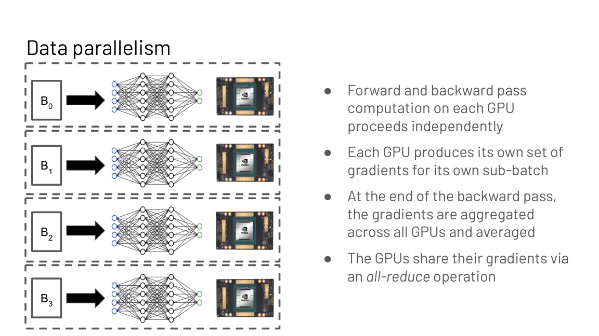
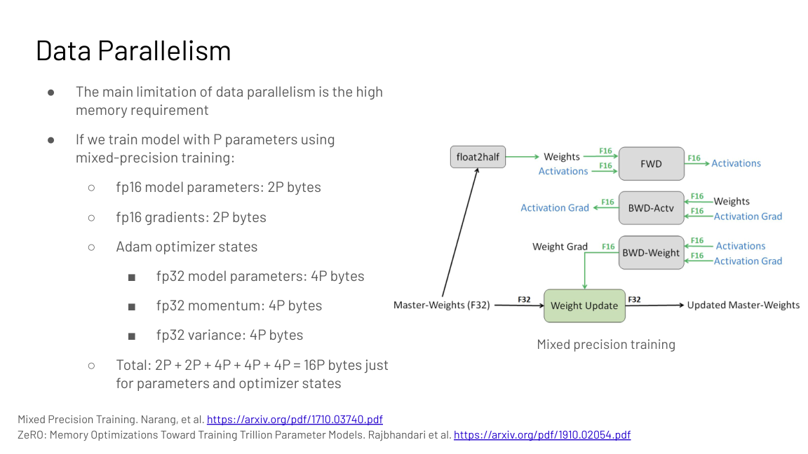
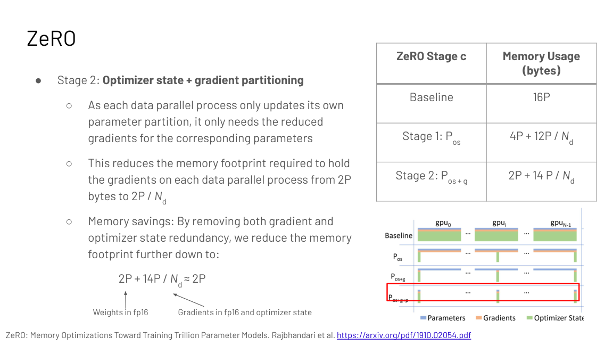
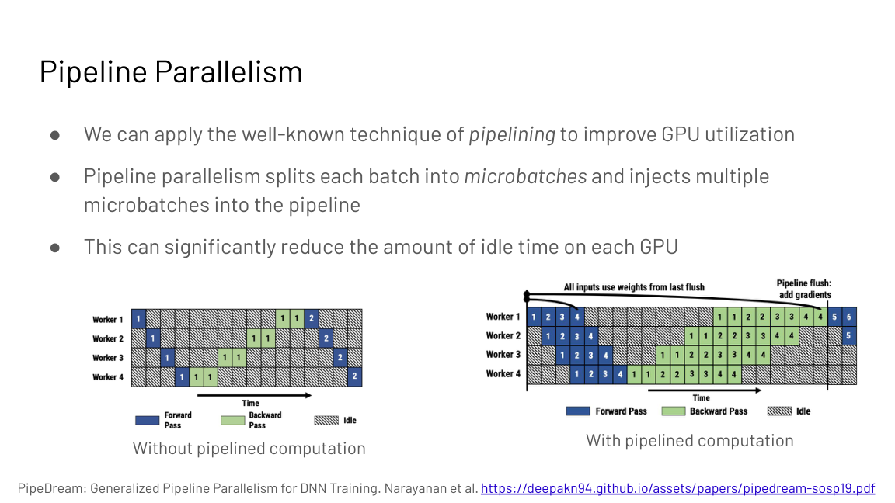
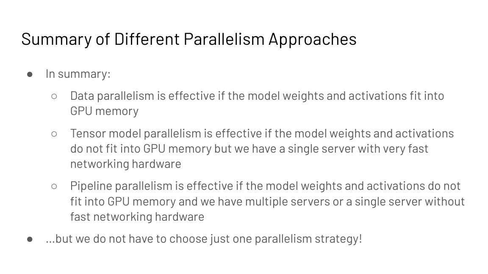
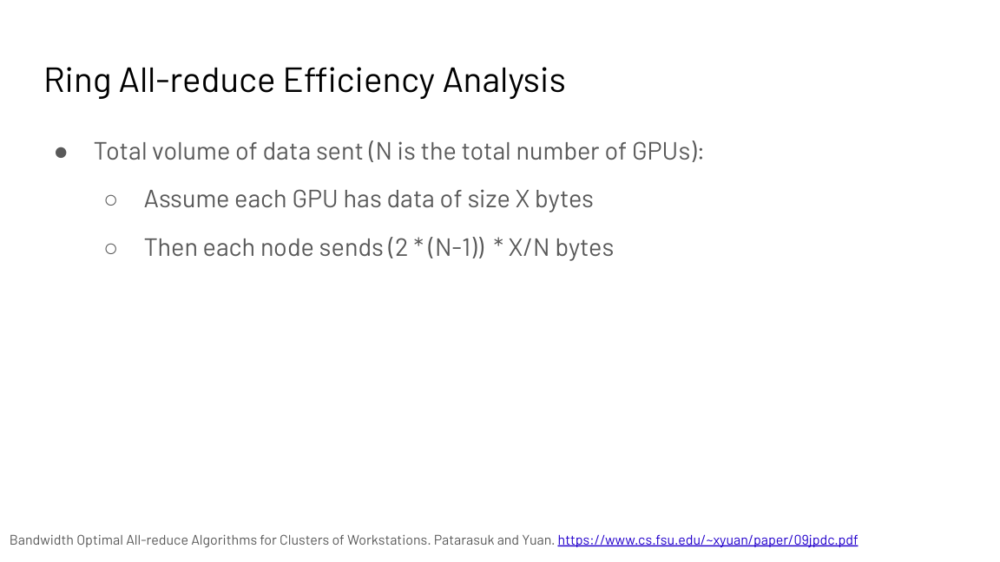

## How to read this lesson

This is a **bridge lesson**. The deep mechanics of each parallelism
style live in [CS336 L07](../cs336/l07-parallelism.html) and
[CS336 L08](../cs336/l08-4d-parallelism.html): collectives,
topology, and the torch.distributed model. This lecture gives the
CS229S framing: the memory math that forces distribution, the
three-way decision table, and Deepak Narayanan's practitioner view
from the NVIDIA Megatron-LM team. Follow the links for depth;
read here for decisions.

## Level 1: Why parallelism is mandatory

Two curves collide. GPU FLOPS double roughly every 2.5 years, but
LLMs grow about 10x bigger every year (Epoch AI; Megatron-Turing
NLG 530B). A single device cannot hold the weights, the
activations, the gradients, and the optimizer state, and even when
it can, one device is too slow.

| Curve | Rate | Source |
|---|---|---|
| GPU FLOPS | 2x every ~2.5 years | Epoch AI price-performance |
| LLM size | ~10x every year | Megatron-Turing NLG 530B era |

Two challenges then dominate distributed design: minimize
**communication overhead** (time sending data between GPUs) and
minimize **synchronization overhead** (dependencies that stop GPUs
from working independently). Everything below is a tradeoff between
these two.

## Level 1: Two axes, three techniques

Computation partitions along two axes: the input **data** or the
model **parameters**.

- **Data parallelism.** Partition the input data, replicate the
  model weights. Four GPUs and batch 64: each GPU takes 16
  examples. Forward and backward run independently per GPU; at the
  end, gradients are averaged across GPUs with an **all-reduce**.
- **Model (tensor) parallelism.** Partition the model weights,
  replicate the input data. Two flavors: vertical slicing (layers
  per GPU) and horizontal sharding (split within an operation).
- **Pipeline parallelism.** Partition the weights across space
  (stages hold layer groups) and the data across time (the batch
  splits into microbatches flowing through stages).

The three compose: data plus tensor plus pipeline (PTD or 3D
parallelism) scales to thousands of GPUs. Narayanan's talk walks
the combinations on real clusters [06:26](ts:06:26).

## Level 1: Data parallelism and its memory wall

Pros: the most direct throughput lever (global batch grows per
GPU), and easy to implement (PyTorch native support).

Cons: the model, activations, gradients, and optimizer state must
fit on one GPU, and every weight synchronizes every step. GPT-3
cannot run on pure data parallelism on an 80 GB GPU.

The memory math, for P parameters in mixed precision:

- fp16 parameters: 2P bytes
- fp16 gradients: 2P bytes
- Adam state: fp32 parameters 4P, momentum 4P, variance 4P
- Total: 16P bytes before activations

**ZeRO** (Zero Redundancy Optimizer) removes the redundancy: data
parallelism replicates all of this on every GPU, but each GPU only
needs its share.

| Stage | Partitions | Memory per GPU |
|---|---|---|
| Baseline | none | 16P |
| 1 | optimizer state | 4P + 12P/Nd |
| 2 | + gradients | 2P + 14P/Nd (about 2P) |
| 3 | + parameters | 16P/Nd |

Stage 3 fetches (all-gathers) parameters as needed for forward and
backward, trading about 1.5x more communication for memory
proportional to 1/Nd. PyTorch **FSDP** (Fully Sharded Data
Parallel) implements ZeRO-style sharding as a module wrapper:
wrap the model, and sharding, gathering, and reduction happen
underneath.

> [!QA]
> Q: A 10B-parameter model trains in mixed precision with Adam. How much memory do the parameters and optimizer state need, and what does ZeRO stage 3 change?
> A: Baseline: 2P for fp16 params, 2P for fp16 grads, and 12P for fp32 params, momentum, and variance: 16P total, or 160 GB for 10B params. That fits on no single GPU. ZeRO stage 3 partitions parameters, gradients, and optimizer state across Nd data-parallel GPUs, cutting per-GPU memory to 16P/Nd at the cost of about 1.5x more communication for parameter gathering.
> Follow-up: Why not always use stage 3?
> A: Because the extra all-gathers cost bandwidth and can expose communication on the critical path. If the model fits with stage 1 or 2, the lower stages communicate less. Match the stage to the memory gap, not the maximum.

## Level 1: All-reduce, the workhorse collective

Data parallelism averages gradients with an all-reduce: every GPU
ends up with the sum (then the mean) of all GPUs' gradients. The
**ring all-reduce** runs in 2(N-1) iterations for N GPUs. Each
GPU splits its data into N fragments and, per iteration, sends
fragments to peers: the first N-1 iterations accumulate received
values, the next N-1 propagate the completed sums.

 iterations; each node sends 2(N-1)X/N bytes. Bandwidth-optimal. Source: Stanford slides, Patarasuk and Yuan.")

Efficiency: each node sends 2(N-1) x X/N bytes for data of size
X, so communication time is 2(N-1)X / (N x B) at bandwidth B. As N
grows, per-node traffic approaches 2X: independent of GPU count.
That is why the ring is bandwidth-optimal and why data
parallelism scales to many nodes.

## Level 1: Tensor parallelism and where it lives

Vertical slicing (layers per GPU) idles devices: each GPU waits
for the previous stage's activations. Horizontal slicing shards
within the operation: for transformers, the Megatron style shards
the self-attention and MLP weights across GPUs, with an all-reduce
after every attention and MLP block to resynchronize.

Pros: per-GPU memory falls; utilization stays high. Cons: the
all-reduces are extremely frequent, so throughput demands very
fast interconnects; and the synchronization ops must be added
manually to the attention module.

Narayanan's rule from the talk: tensor parallelism is unwieldy
across nodes [14:48](ts:14:48). Within a server, 8 GPUs connect
over NVLink at very high bandwidth; across servers, even
InfiniBand is much slower [14:52](ts:14:52). So tensor parallelism
lives inside the node, and its communication never crosses the
slow links. The device block from
[L05](l05-gpu-execution-model.html) is the map; this is the route.

## Level 1: Pipeline parallelism and the bubble

Revisit vertical slicing, but fix the idleness with pipelining:
split each batch into **microbatches** and inject several into the
pipeline at once. While stage 2 processes microbatch 1, stage 1
processes microbatch 2. Idle time shrinks.

Two tuning knobs. **Microbatch size**: larger means higher
arithmetic intensity but bigger pipeline bubbles; smaller means
smaller bubbles but less efficient math. **Schedule**: which
microbatch runs where and when. GPipe runs all forwards then all
backwards; **1F1B** (one forward, one backward) interleaves them
and shrinks the bubble and the activation memory.

Narayanan's talk shows an **interleaved** variant: device 1 holds
layers 1 and 5, device 2 holds 2 and 6, and so on, so each device
does two phases of forward passes per microbatch [24:07](ts:24:07).
More stages per device means less idle time at the cost of more
point-to-point messages. TeraPipe extends the idea to the sequence
dimension: split the sequence itself into subsequences processed
incrementally per stage.

Pros: per-GPU memory falls; communication is point-to-point sends,
not all-reduces. Cons: bubbles never fully vanish; scheduling
microbatches concurrently is genuinely hard to implement.

## Level 1: The decision table

| Situation | Choice |
|---|---|
| Weights and activations fit on one GPU | Data parallelism |
| They do not fit, but one fast node is available | Tensor parallelism (NVLink) |
| They do not fit, many nodes or slow interconnect | Pipeline parallelism |

In practice, combine: PTD (pipeline, tensor, data) parallelism
trains thousand-GPU models (DeepSpeed, Megatron-LM). The strategy
space grows combinatorially and experiments at scale are slow and
expensive, so **Alpa** (Zheng et al., OSDI 2022) automates the
search: it treats inter-operator parallelism (pipeline) and
intra-operator parallelism (data, tensor) separately and picks the
optimal combination for a given model and cluster.

> [!QA]
> Q: You have 64 GPUs across 8 nodes with NVLink inside nodes and InfiniBand between them, training a model that needs 16 GPUs worth of memory. Sketch the parallelism plan.
> A: Use all three. Tensor parallelism within each node (up to 8 ways) for the frequent attention and MLP all-reduces over NVLink. Pipeline parallelism across nodes for the layer stages, with microbatches sized to keep bubbles small. Data parallelism across the remaining replicas for throughput, with ZeRO stage 1 or 2 to fit optimizer state. This is PTD parallelism: each style lives where the network makes it cheap.
> Follow-up: What breaks if you run tensor parallelism across nodes instead?
> A: Throughput collapses. Tensor parallelism all-reduces after every attention and MLP block, and InfiniBand is much slower than NVLink. The GPUs would stall on communication constantly. Narayanan's talk makes this the cardinal rule: keep tensor parallelism inside the node.

## Recap: the whole lesson on one screen

<strong>1. Partition data or parameters</strong>

Data parallel: split the batch, copy the model. Tensor/model
parallel: split the model, copy the data. Pipeline: split layers
in space, batches in time.

Key: two axes, three techniques

<strong>2. Training needs 16P bytes</strong>

2P params, 2P grads, 12P Adam state in mixed precision. That is
why single-GPU training dies long before inference does.

Key: 16P before activations

<strong>3. ZeRO partitions the redundancy</strong>

Stage 1: optimizer state. Stage 2: plus gradients. Stage 3:
plus parameters, down to 16P/Nd for 1.5x communication. FSDP
wraps it.

Key: 16P to 16P/Nd

<strong>4. Ring all-reduce is bandwidth-optimal</strong>

2(N-1) iterations; per-node traffic approaches 2X regardless
of GPU count. The collective data parallelism stands on.

Key: 2(N-1)X/(NB) seconds

<strong>5. Tensor parallelism lives in the node</strong>

Shard attention and MLP weights Megatron-style; all-reduce
after each block. Needs NVLink speed: never span nodes with it.

Key: inside NVLink only

<strong>6. Pipeline parallelism beats idleness with microbatches</strong>

Stages hold layer groups; microbatches flow through. 1F1B and
interleaved schedules shrink the bubble. Only point-to-point
messages.

Key: microbatches fill bubbles

<strong>7. Match the strategy to the constraint</strong>

Fits: data parallel. One fast node: tensor. Many nodes or slow
net: pipeline. Combine all three (PTD) at thousand-GPU scale.

Key: topology decides

<strong>8. Automate the search with Alpa</strong>

The strategy space is combinatorial and experiments are
expensive. Alpa searches inter- and intra-operator parallelism
for your model and cluster.

Key: Zheng et al., OSDI 2022

## Official sources and further reading

**Official:**
- Parallelism Fundamentals slide deck (Fall 2023 headers).
- Deepak Narayanan talk (YouTube, JA1l96tjrs4): the practitioner view.
- Course text narayanan-parallelism.txt: talk notes.

**Further reading:**
- Rajbhandari et al., "ZeRO" (2019).
- Shoeybi et al., "Megatron-LM" (2019).
- Narayanan et al., "PipeDream" (SOSP 2019) and "Memory-Efficient Pipeline Parallelism" (2021).
- Zheng et al., "Alpa" (OSDI 2022).
- [CS336 L07](../cs336/l07-parallelism.html) and [CS336 L08](../cs336/l08-4d-parallelism.html): the deep mechanics.

**Caveats from these sources.** The "10x per year" model growth
and "2.5 year" GPU doubling are trend estimates from the slides,
not laws. The 16P figure excludes activations, which vary with
sequence length and checkpointing. The 1.5x stage-3 communication
factor is from the ZeRO paper's analysis. Talk timestamps point
to the auto-captioned YouTube video; wording is the speaker's
paraphrase.

## Connections to the other courses

- **CS336 L07/L08:** data, tensor, pipeline, and 4D/5D parallelism derived in full.
- **CS229S L05:** the device block: the map these strategies route over.
- **CS229S L03:** communication versus computation: the same bottleneck lens at cluster scale.
- **CS229S L08:** FSDP/ZeRO as the distributed answer to fine-tuning memory cost.

> [!CHEAT]
> **Parallelism cheatsheet.** Why: models 10x/yr, GPUs 2x/2.5yr. Minimize communication + synchronization overhead. Data: split batch, replicate weights, all-reduce grads. Tensor: split weights (Megatron: shard attn+MLP, all-reduce per block), replicate data. Pipeline: stages hold layers, microbatches flow; 1F1B and interleaved cut bubbles. Memory: 16P bytes mixed-precision Adam (2P+2P+12P). ZeRO: S1 4P+12P/Nd, S2 2P+14P/Nd, S3 16P/Nd (1.5x comm). FSDP = ZeRO as API. Ring all-reduce: 2(N-1) iters, 2(N-1)X/(NB) s, bandwidth-optimal. Tensor inside node (NVLink); data/pipeline across (InfiniBand). Decision: fits->data; one fast node->tensor; many nodes->pipeline. PTD combines; Alpa automates.

> [!MEMORY]
> **Parallelism in one line.** Split what does not fit, copy what is cheap to sync, and keep the chattiest pattern on the fastest wires.
