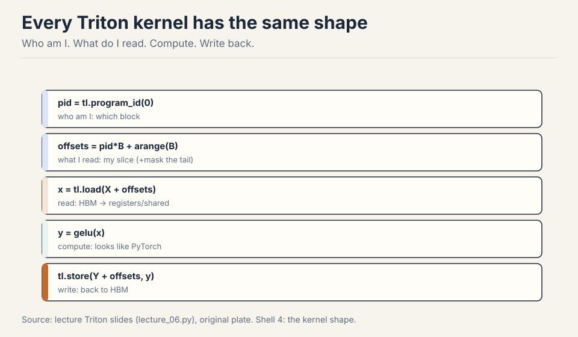
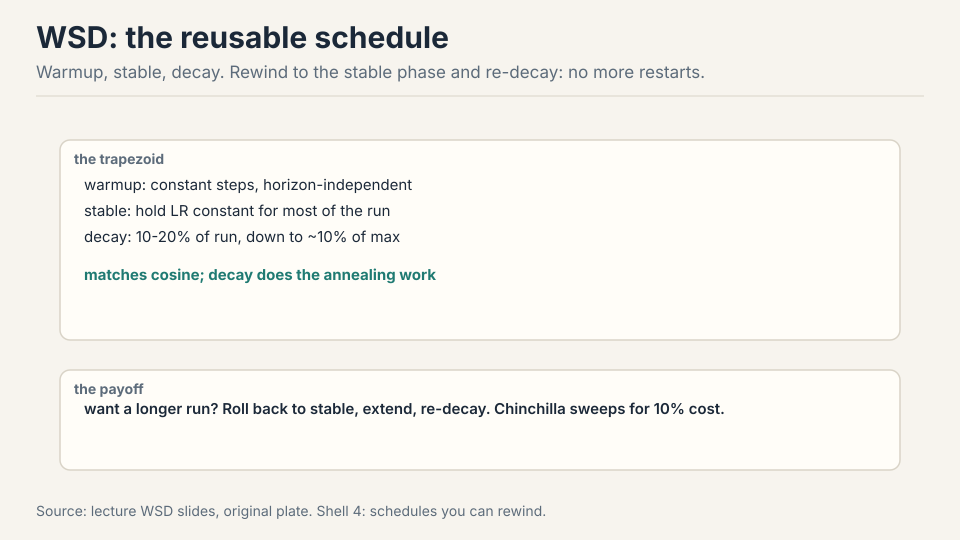
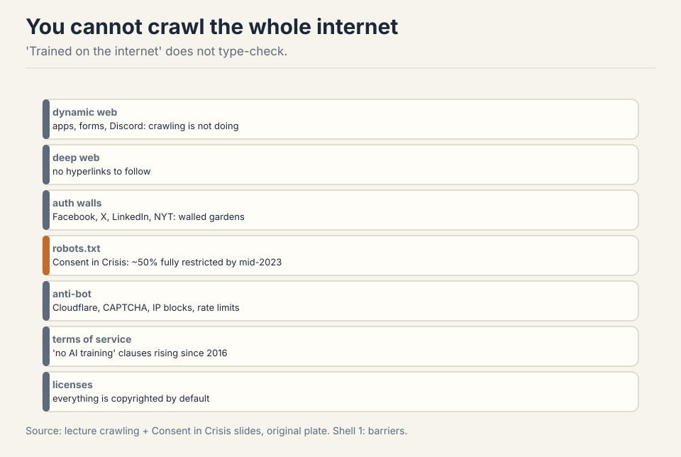
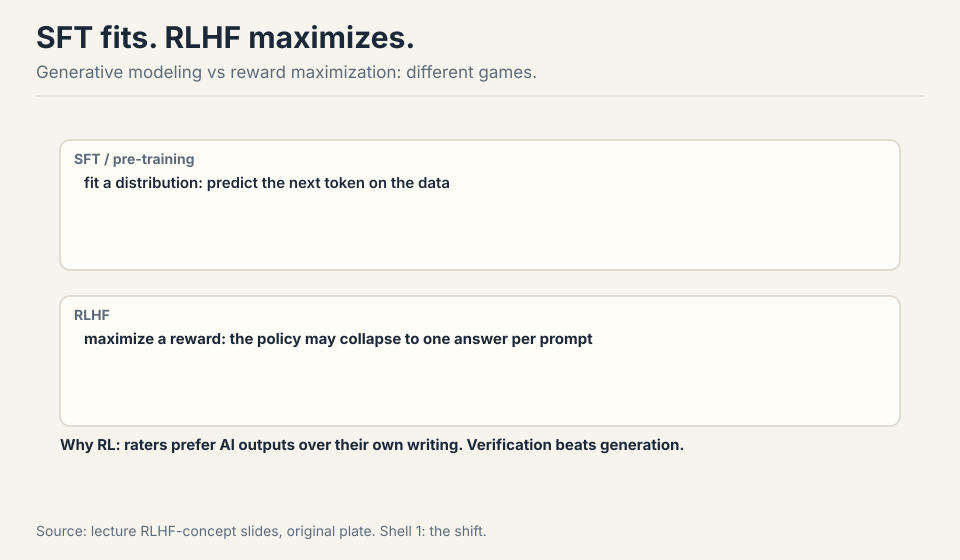
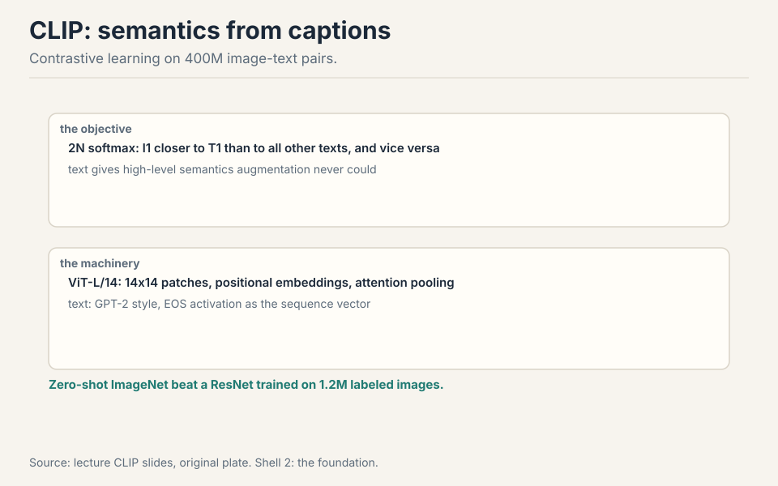
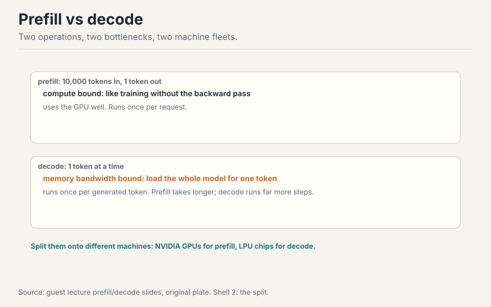

30 minutes · interview speed

This page tells the whole story fast. Each section gives you the working
version: enough to answer interview questions with confidence. Links at
the end of each section take you into the full lesson when you want the
derivations, the figures, and the follow-ups.

### 1. A language model predicts the next token

Take any sentence. A language model looks at the words so far and assigns
a probability to every possible next word. "The cat sat on the" gives
high probability to "mat", low probability to "xylophone".

The chain rule turns this small trick into a full sentence model. The
probability of a whole sentence is the product of each word's probability
given all the words before it. Train the model to maximize this product
over billions of sentences, and it learns grammar, facts, and style as a
side effect of prediction.

<figure class="crash-fig"><figcaption>Raw text becomes IDs, IDs become vectors, the model scores the next token.</figcaption></figure>

This is the one idea everything else hangs on. If an interviewer asks
"what is a language model", start here, then add the pipeline below.

<ul class="crash-links">
<li><a href="l01-tokenization.html">Lecture 1: the full derivation</a> (chain rule, probability setup)</li>
</ul>

### 2. The pipeline: text to IDs to vectors to text

Raw text cannot enter a neural network. Numbers can. So the first stage
is tokenization: chop text into pieces, map each piece to an integer ID.
The second stage is embedding: each ID indexes one row of a learned
matrix, turning the integer into a vector of thousands of numbers. The
model then scores every possible next token. The winner decodes back to
text.

Two facts about this pipeline show up in interviews constantly. First,
the tokenizer is fixed before training starts. Every ID points at a
learned row. Swap the tokenizer and the IDs point at wrong rows: the
model breaks. Second, everything downstream is counted in tokens, not
words. Context windows, pricing, and speed all run on tokens.

<figure class="crash-fig"><figcaption>Tokenize, embed, score, decode.</figcaption></figure>

<ul class="crash-links">
<li><a href="l01-tokenization.html">Lecture 1: pipeline and embedding interface</a></li>
</ul>

### 3. Characters are too fine, words are too coarse

The first tokenizers used characters. Twenty-six letters plus symbols:
a tiny vocabulary that never fails on new text. The price is length.
"Hello" becomes 5 tokens, and attention costs grow quadratically with
length, so long sequences get expensive fast.

Word tokenizers went the other way. One token per word gives clean
linguistic units, but English has 170,000+ words and new ones appear
daily. Any word outside the vocabulary is an "unknown" token, and the
model learns nothing about it. For an open vocabulary, word-level is
dead.

<figure class="crash-fig"><figcaption>Words become tokens. Unknown words become a problem.</figcaption></figure>

<ul class="crash-links">
<li><a href="l01-tokenization.html">Lecture 1: char-level vs word-level trade-offs</a></li>
</ul>

### 4. BPE: merge what appears together

Byte-pair encoding takes the middle path. Start with single characters.
Count which adjacent pairs appear most often in a large corpus. Merge the
winner into a single token. Repeat tens of thousands of times. Common
words like "the" become one token. Rare words stay split into pieces.
Nothing is ever unknown: any text reduces to characters in the worst
case.

<figure class="crash-fig"><figcaption>Frequent pairs merge into single tokens.</figcaption></figure>

Training is the counting step. Inference is simpler: walk the text left
to right, always take the longest vocabulary entry that matches. This
greedy longest-match is fast but not optimal. A global optimizer would
sometimes split words differently. In practice nobody pays that cost.

<figure class="crash-fig"><figcaption>How BPE segments a sentence.</figcaption></figure>

<ul class="crash-links">
<li><a href="l01-tokenization.html">Lecture 1: BPE training and inference, with the interactive lab</a></li>
</ul>

### 5. Fertility: the number that sets your bill

Fertility is tokens per word. English sits near 1.3. Some languages need
3 or more tokens for the same word, because the training corpus was
mostly English and the vocabulary reflects it. This is corpus bias, and
it has teeth: you pay per token, and the context window counts tokens.
A language with 3x fertility costs 3x more and fits 3x less text in
context.

<figure class="crash-fig"><figcaption>Same meaning, different token counts.</figcaption></figure>

Interviewers love this topic because it connects a low-level detail to
money and product quality. Know the definition, know the English number,
know why it varies.

<ul class="crash-links">
<li><a href="l01-tokenization.html">Lecture 1: fertility, cost, and multilingual impact</a></li>
</ul>

### 6. Token IDs become vectors

The last step before the network: each integer ID indexes one row of the
embedding matrix. Token 1169 becomes a vector of, say, 12,288 learned
numbers. The mapping is lossless: the same text always produces the same
IDs, so nothing is lost in translation.

<figure class="crash-fig"><figcaption>Integer IDs index rows of the embedding matrix.</figcaption></figure>

The matrix is huge. 50,000 vocabulary entries times 12,288 dimensions is
over 600 million parameters before the model does anything at all. This
is why vocabulary size is a real design decision, not a footnote.

<ul class="crash-links">
<li><a href="l01-tokenization.html">Lecture 1: the embedding interface</a></li>
</ul>

### 7. Tokenization sets three bills

Everything downstream of the tokenizer runs on tokens, and that fact
sets three bills. Context: the window counts tokens, so a 4,096-token
window holds about 3,000 English words but far fewer words in a
high-fertility language. Money: pricing is per token, so fertility
multiplies the invoice directly. Speed: attention costs grow
quadratically in tokens, so long token sequences are expensive twice
over.

<figure class="crash-fig"><figcaption>Five stages. Tokenization is the first, and every later stage counts in tokens.</figcaption></figure>

This is why tokenizer choice is a product decision, not a detail.
Pick the vocabulary, and you pick the cost structure of everything
after it.

<ul class="crash-links">
<li><a href="l01-tokenization.html">Lecture 1: the full tokenization lesson</a></li>
</ul>

### 8. Resource accounting: FLOPs, bytes, and the roofline

Training a model costs 6ND FLOPs: six times params times tokens.
Backward is twice forward. The number everyone quotes is MFU: model
FLOPs utilization, actual throughput divided by the GPU's promise.
0.5 is good. 0.1 is broken.

Memory is elements times bytes. bf16 is the sweet spot for weights
and activations. fp32 stays for optimizer states. AdamW costs about
12 bytes per param. The roofline says: if your arithmetic intensity
(FLOPs per byte moved) sits below the knee, you are memory-bound and
shrinking the model is pointless. Buy bandwidth instead.

<figure class="crash-fig"><figcaption>Intensity below the knee means bandwidth-bound.</figcaption></figure>

Interviewers ask this to check whether you can size a training run.
Know 6ND, know MFU, know where the bottleneck is.

<ul class="crash-links">
<li><a href="l02-resource-accounting.html">Lecture 2: resource accounting</a></li>
</ul>

### 9. The modern transformer: prenorm, GLU, RoPE

Three changes define the modern block. Prenorm: normalization sits
outside the residual stream, so gradients flow straight through.
SwiGLU: a gated MLP that is smaller per parameter but stronger.
RoPE: rotary position embeddings that multiply by position instead
of adding it, giving relative positions for free.

Dropping biases, using RMSNorm, and shrinking the feed-forward dim
by two-thirds are all free or near-free wins. Serial blocks beat
parallel ones. Stability tools (z-loss, QK norm, soft capping) keep
the softmax from exploding at scale.

<figure class="crash-fig"><figcaption>Prenorm keeps gradients clean.</figcaption></figure>

<ul class="crash-links">
<li><a href="l03-architecture.html">Lecture 3: the modern architecture</a></li>
</ul>

### 10. Linear attention and mixture of experts

Attention costs O(n^2) in sequence length. Linear attention drops
the softmax and re-associates the math: Q(K'V) instead of (QK')V.
That turns n^2 d into n d^2. Mamba-2 and gated delta nets make the
forget gate input-dependent. Hybrids mix a few full attention layers
with many linear ones.

MoE splits the feed-forward layer into experts and routes each token
to a few of them. Parameters grow. FLOPs per token stay flat. The
hard parts are routing (top-K token choice) and load balance (an
auxiliary loss keeps experts even, because dead experts are wasted
money).

<figure class="crash-fig"><figcaption>More parameters, same FLOPs per token.</figcaption></figure>

<ul class="crash-links">
<li><a href="l04-linear-attention-moe.html">Lecture 4: linear attention and MoE</a></li>
</ul>

### 11. GPUs: the memory hierarchy decides everything

A GPU has 108-ish streaming multiprocessors running thousands of
threads. The memory hierarchy is the whole game: registers at ~1
cycle, shared memory at 20-30, HBM an order of magnitude slower,
and interconnects slower still. SRAM is a hundred times more
expensive than DRAM, so there is almost no SRAM.

Three programming rules: fuse kernels (read once, write once),
coalesce memory (128-byte bursts on the major axis), and tile loops
to fit SRAM. Low precision halves the bytes moved. Wave
quantization: if your work is not divisible by the SM count, some
SMs idle while others finish. The mystery plot is divisibility.

<figure class="crash-fig"><figcaption>Registers to HBM: the ladder you program against.</figcaption></figure>

<ul class="crash-links">
<li><a href="l05-gpus.html">Lecture 5: how GPUs work</a></li>
</ul>

### 12. Triton kernels: write the inner loop

Triton compiles Python-ish code into GPU kernels. The mental model:
a grid of blocks, each block on one SM, threads in warps of 32
lockstep. Shared memory per block, registers per thread. Occupancy
is how many warps stay alive to hide HBM latency. It is capped by
registers and the 64-warp limit.

Rules that win: warm up and repeat when benchmarking. Fused beats
naive (the GeLU race). Tile matmuls with accumulation in shared
memory. Swizzle to dodge bank conflicts. Kernel names encode the
library, architecture, dtype, and tile sizes, so learn to read them.

<figure class="crash-fig"><figcaption>Fusion wins: read once, compute, write once.</figcaption></figure>

<ul class="crash-links">
<li><a href="l06-triton-kernels.html">Lecture 6: benchmarking, profiling, Triton</a></li>
</ul>

### 13. Parallelism: data, tensor, pipeline

One GPU cannot hold a big model or finish it fast enough. Three
classical splits. Data parallel: split the batch, all-reduce the
gradients. Tensor parallel: split each matrix, all-gather forward
and reduce-scatter backward, needs NVLink speed. Pipeline parallel:
split layers across GPUs, feed micro-batches to kill the bubble.

The interconnect ladder: HBM at 8 TB/s, NVLink at 1.8 TB/s,
InfiniBand across nodes, Ethernet last. RDMA lets GPUs talk without
the CPU. NCCL turns collectives into packets. Match the split to the
bandwidth: tensor parallelism dies on slow links.

<figure class="crash-fig"><figcaption>Split rows, all-reduce gradients, one line of code.</figcaption></figure>

<ul class="crash-links">
<li><a href="l07-parallelism.html">Lecture 7: parallelism</a></li>
</ul>

### 14. 4D parallelism at scale

At frontier scale you use all four dimensions at once: data, tensor,
pipeline, and context (sequence) parallelism, plus expert
parallelism for MoE. ZeRO shards the optimizer states, gradients,
and finally the parameters themselves across data-parallel ranks.
the extra communication is hidden under compute overlap.

The prescription order: fit the model in memory first (ZeRO-3),
then cut the batch at the critical batch size, then add pipeline
with enough micro-batches to hide bubbles, then tensor parallel
within a node only. For MoE, prefer expert parallelism over tensor
parallelism. Context parallel (ring attention) handles million-token
sequences.

<figure class="crash-fig"><figcaption>The order: fit memory, batch, pipeline, tensor.</figcaption></figure>

<ul class="crash-links">
<li><a href="l08-4d-parallelism.html">Lecture 8: 4D parallelism</a></li>
</ul>

### 15. Scaling laws: predict, then spend

On log-log axes, loss versus compute is a straight line: a power
law. That lets you train small, fit the line, and extrapolate to
big. Kaplan said parameters scale like N^0.27. Chinchilla corrected
it to N^0.5: about 20 tokens per parameter. Overtraining small
models is a real deployment strategy, not a mistake.

Three ways to fit: the envelope over all runs, IsoFLOP slices at
fixed compute (the default), or parametric fits. Data mixtures move
the intercept, not the slope. Four epochs of repetition are safe.
Fit on perplexity, but verify on downstream tasks.

<figure class="crash-fig"><figcaption>Chinchilla: 20 tokens per parameter.</figcaption></figure>

<ul class="crash-links">
<li><a href="l09-scaling-laws.html">Lecture 9: scaling laws</a></li>
</ul>

### 16. Inference: prefill is compute, decode is memory

Generation splits into two phases. Prefill processes the prompt in
parallel: compute-bound, like training. Decode generates one token
at a time and reloads the whole model for each one: memory-bandwidth
bound. The KV cache is what makes this affordable: store past keys
and values instead of recomputing them.

The cache formula: batch times sequence times layers times KV heads
times head dim, times 2 bytes, times 2 for K and V. Shrink it with
GQA (fewer KV heads), MLA (compress to a latent), or sliding
windows. Speculative decoding drafts K tokens with a small model
and verifies them in parallel with the big one.

<figure class="crash-fig"><figcaption>Store keys and values. Never recompute.</figcaption></figure>

<ul class="crash-links">
<li><a href="l10-inference.html">Lecture 10: inference</a></li>
</ul>

### 17. Advanced scaling: muP, WSD, and optimizer honesty

muP (maximal update parametrization) makes the optimal learning
rate stable across model widths, so hyperparameters tuned small
transfer to big. The WSD schedule (warmup, stable, decay in the last
10-20 percent) lets you reuse one training run at multiple token
budgets by rewinding and re-decaying.

Two philosophies: stabilize (muP, careful parametrization) versus
fit (DeepSeek's empirical sweeps). Optimizer claims need honest
baselines: watch the compute-times-Chinchilla ratio, tune the
baseline as hard as the new method. Muon (momentum plus
Newton-Schultz orthogonalization) is the current challenger.

<figure class="crash-fig"><figcaption>Warmup, stable, decay. Rewind and re-decay to change budgets.</figcaption></figure>

<ul class="crash-links">
<li><a href="l11-scaling-advanced.html">Lecture 11: advanced scaling</a></li>
</ul>

### 18. Evaluation: from perplexity to agents

Perplexity is mass on test text. The best possible model hits the
data's entropy. It catches cheap wins (boring tokens) but misses
what users feel. Exams (MMLU, GPQA, Humanity's Last Exam) saturate
in sequence: 90s, 94, 64.7. Chat evaluation went to pairwise ELO
arenas and LLM judges with debiasing. Agents get real tasks:
SWE-bench (93 percent verified), terminal benchmarks, cyber ranges.

Two warnings. The scaffold is half the score: the same model with a
better tooling wins. And contamination is everywhere: assume the
model has seen the test unless the benchmark is private and recent.

<figure class="crash-fig"><figcaption>Mass on test text. Best equals entropy.</figcaption></figure>

<ul class="crash-links">
<li><a href="l12-evaluation.html">Lecture 12: evaluation</a></li>
</ul>

### 19. Training data: the secret sauce

Data is the most secretive part of frontier models. The web is
crawled (Common Crawl, monthly since 2007, ~300B pages), but half of
it sits behind robots.txt, logins, and anti-bot systems. Copyright
covers everything by default. Training is argued as fair use, while
pirating the data (Anthropic's $1.5B settlement) is not.

Quality lives in pockets: Wikipedia (poisonable), GitHub (permissive
licenses only), arXiv (LaTeX source). History runs from BERT's
documents to GPT-2's Reddit links to classifier-filtered web dumps.
Rules versus classifiers is the eternal filter debate: rules are
legible, classifiers learn the taste.

<figure class="crash-fig"><figcaption>The web is half closed before you start.</figcaption></figure>

<ul class="crash-links">
<li><a href="l13-training-data.html">Lecture 13: training data</a></li>
</ul>

### 20. The data pipeline: dedupe and mix

Raw web text is unusable. Transform it (HTML to text, tables are
hard, PDFs are rare and valuable), filter it (fastText linear or
KenLM generative classifiers. The threshold depends on your token
budget), then dedupe it: exact spans (C4 removed 3-sentence
repeats) and near-dupes via MinHash LSH, where collision probability
equals Jaccard similarity.

Mixing is a distribution over sources, and the 50-epoch trap says
small high-quality sources get over-repeated. UniMax caps
repetition. RegMix replaces gut-feel mixing with a regression: train
small proxy models on candidate mixes, fit, optimize, scale up.

<figure class="crash-fig"><figcaption>Exact spans and near-dupes both go.</figcaption></figure>

<ul class="crash-links">
<li><a href="l14-data-pipeline.html">Lecture 14: the data pipeline</a></li>
</ul>

### 21. Post-training: SFT plus RLHF

GPT-3 to ChatGPT was two steps: supervised fine-tuning on
demonstrations, then RL from human feedback. SFT data evolved from
FLAN to self-instruct to synthetic distillation (Alpaca, Vicuna) to
agentic tool-call traces. The pitfalls: style is not capability,
tail knowledge hallucinates, and RL recalibrates.

RLHF: sample responses, have humans rank them, train a reward
model, optimize with PPO plus a KL penalty against drift. Safety
took only hundreds of examples for Llama 2. Annotation is the
hidden labor: experts cost $100-plus per hour, demographics
transfer, and formatting is easier to judge than factuality.

<figure class="crash-fig"><figcaption>Sample, rank, reward model, PPO with KL.</figcaption></figure>

<ul class="crash-links">
<li><a href="l15-post-training.html">Lecture 15: post-training</a></li>
</ul>

### 22. RLVR: verifiable rewards

RLHF over-optimizes learned rewards. The model games the judge.
RLVR (RL with verifiable rewards) uses rewards you can check: math
answers, unit tests. Compute keeps helping because the reward
cannot be fooled.

PPO is REINFORCE plus clipping plus 37 implementation details.
GRPO drops the value network and z-scores advantages within each
sampled group, fitting on one page. R1-Zero trained a base model
with GRPO on accuracy plus format only and matched o1-style
reasoning. The production recipe: long chain-of-thought SFT, then
RL, then distill the traces into smaller models.

<figure class="crash-fig"><figcaption>Group z-score advantages. No value network.</figcaption></figure>

<ul class="crash-links">
<li><a href="l16-rlvr.html">Lecture 16: RLVR</a></li>
</ul>

### 23. Multimodality: tokenize everything

The omni-model goal: any modality in, any out. Transformers speak
tokens, so images must become tokens. CLIP did it with contrastive
learning on 400M image-text pairs: 2N-way softmax, ViT-L/14, and
text supplying semantics that augmentation never could. Zero-shot
ImageNet beat a supervised ResNet. SigLIP replaced the softmax with
binary sigmoid loss, decoupling batch size and training 5 days on 32
TPUv4s versus 10 days on 256 TPUv3s.

LLaVA stitched CLIP to Vicuna with a projector: align the projector
first, then fine-tune. AnyRes crops images instead of downsampling
them, and modalities transfer (OCR plus multi-image reasoning
combines). The Qwen-VL lineage added dynamic resolution, M-RoPE over
height-width-time, and DeepStack fusion. Chameleon's elegant
alternative, discrete tokens via VQ-VAE, lost detail and stability.

<figure class="crash-fig"><figcaption>Contrastive image-text learning. Text gives semantics.</figcaption></figure>

<ul class="crash-links">
<li><a href="l17-multimodality.html">Lecture 17: multimodality</a></li>
</ul>

### 24. Serving inference: the other half of the model

A guest lecture on what happens after training. The token's life:
schedule the request, check the KV cache (radix-tree prefix
sharing), run prefill (compute-bound, once) then decode
(memory-bound, per token), sample and repeat. Prefill and decode
run on different fleets. LPU chips and Cerebras target decode.

Continuous batching admits and evicts requests per step. KV memory
is the hard limit. Cache-aware routing splits fresh requests (book
pastes) from warm conversations for 40 percent faster serving.
Megakernels fuse a whole layer into one kernel and overlap every
load, reaching 72 percent of peak bandwidth. Parcae loops
transformer blocks with the spectral radius under 1, trading
parameters for flops.

<figure class="crash-fig"><figcaption>Compute-bound once, memory-bound forever.</figcaption></figure>

<ul class="crash-links">
<li><a href="l18-inference.html">Lecture 18: serving inference (guest)</a></li>
</ul>

### 25. Rapid-fire: say the answer before you read it

**What is a language model?** It assigns probabilities to next tokens.
The chain rule extends this to whole sentences.

**Why not characters?** Sequences get 4-5x longer, and attention costs
grow quadratically. Too slow.

**Why not words?** Open vocabulary. New words become unknowns. Dead end.

**How does BPE train?** Count adjacent pairs in a corpus, merge the most
frequent, repeat ~50k times.

**How does BPE tokenize new text?** Greedy longest match, left to right.

**What is fertility?** Tokens per word. Sets cost and context usage.

**Why does the tokenizer stay fixed?** IDs index learned embedding rows.
New IDs point at wrong rows. The model breaks.

**What is wrong with number tokenization?** "123" and "124" can split
differently. Hurts arithmetic. Known limitation.

**How would you improve tokenizers?** Lower fertility for non-English
languages, better code and math handling, tokenizer-aware training.

**What does 6ND mean?** Training FLOPs: six times params times tokens.
Backward is twice forward.

**What is MFU?** Model FLOPs utilization: actual versus promised
throughput. 0.5 is good. 0.1 is broken.

**Why bf16 for weights but fp32 for optimizer states?** bf16 has range
but less precision. The optimizer needs precision to accumulate small
updates.

**Prenorm or postnorm?** Prenorm. Gradients flow straight through the
residual stream.

**Why does RoPE multiply instead of add?** Rotation by position gives
relative positions by construction.

**What does linear attention change?** Drop softmax, re-associate:
n^2 d becomes n d^2. Trade exactness for speed.

**Why is MoE cheap per token?** Route each token to a few experts.
Parameters grow, FLOPs per token stay flat.

**What kills naive MoE training?** Load imbalance. Dead experts are
wasted money. An auxiliary loss keeps them even.

**What is the GPU memory hierarchy?** Registers (~1 cycle), shared
memory, HBM, then interconnects. SRAM is 100x the cost of DRAM.

**Why fuse kernels?** Read once, write once. Memory traffic dominates.

**What is occupancy?** Live warps per SM hiding HBM latency. Capped
by registers and the 64-warp limit.

**Three splits of parallelism?** Data (batch, all-reduce grads),
tensor (matrices, NVLink only), pipeline (layers, micro-batches kill
bubbles).

**What does ZeRO shard?** Optimizer states, then grads, then params.
Communication hides under compute overlap.

**Kaplan or Chinchilla?** Chinchilla: ~20 tokens per parameter. Overtrain
small models for deployment.

**How do you fit a scaling law?** Log-log line. IsoFLOP slices at fixed
compute are the default.

**Prefill or decode: which is memory-bound?** Decode. One token per full
model load.

**What is the KV cache?** Stored keys and values. Naive recompute is
cubic. Caching makes generation affordable.

**How do you shrink the KV cache?** GQA, MLA compression, sliding
window, KV quantization.

**muP in one line?** Parametrize so the optimal learning rate transfers
across widths.

**What is WSD?** Warmup, stable, decay in the last 10-20 percent.
Rewind and re-decay to change token budgets.

**What beats perplexity?** Nothing for training. Everything for users:
exams, arenas, agent benchmarks.

**Why does MMLU saturate?** Exams fall in sequence: MMLU, MMLU-Pro,
GPQA, Humanity's Last Exam. Contamination speeds it up.

**What is the scaffold warning?** The scaffold is half the score.
Same model, better tooling, better number.

**What is the 50-epoch trap?** Small quality sources get over-repeated
in the mix. UniMax caps repetition.

**MinHash LSH in one line?** Collision probability equals Jaccard
similarity. Bands of rows make the S-curve.

**What made ChatGPT?** SFT on demonstrations plus RLHF: sample, rank,
reward model, PPO with KL.

**Why is safety cheap?** Hundreds of well-chosen examples fix refusal
behavior surgically.

**RLVR over RLHF: why?** Verifiable rewards (math, tests) cannot be
gamed. Compute keeps helping.

**GRPO versus PPO?** GRPO z-scores advantages within a group. No value
network. One page.

**What was R1-Zero?** Base model plus GRPO on accuracy and format only.
Reasoning emerged.

**CLIP in one line?** 2N-way contrastive on 400M image-text pairs.
Text supplies the semantics.

**SigLIP over CLIP: why?** Binary sigmoid loss. Batch size decoupled
from the loss. 5 days versus 10.

**LLaVA in one line?** CLIP plus a projector plus Vicuna. Align the
projector, then fine-tune.

**Why AnyRes?** Crop instead of downsample. 336x336 cannot read a
document.

**What is M-RoPE?** RoPE over height, width, and time, concatenated.

**Prefill versus decode fleets?** Split them. LPU chips and Cerebras
target decode.

**What is cache-aware routing?** Fresh requests and warm conversations
never share GPUs. 40 percent faster.

**Megakernels in one line?** Fuse the whole layer into one kernel.
Overlap every load. 72 percent of peak bandwidth.

**Parcae in one line?** Loop transformer blocks with spectral radius
under 1. Flops without parameters.

**What is the std-0 trap?** In GRPO, groups where all rollouts agree
have std near 0. Dividing by it explodes the update on groups with
no learning signal.

**What does Dr. GRPO delete?** The std normalization and the length
normalization. Advantages become reward minus group mean.

**Work the decode tax.** 70B params in bf16 is 140 GB. One decode step
loads all 140 GB for one token. At 3.3 TB/s that is 42 ms per token.

**When does disaggregation hurt?** When traffic is uniform. The
routing and KV transfer are pure cost with no bimodal mix to exploit.

**Why is resolution a token purchase?** A 1344px document page costs
9,792 image tokens (16 crops plus 1 overview at 576 each). The context
window is the bottleneck, not the encoder.

**CLIP vs SigLIP loss?** CLIP: softmax over the batch, the batch is the
objective. SigLIP: per-pair sigmoid, batch-size independent.

**What is M-RoPE?** RoPE over height, width, and time, concatenated.
Position gets three axes.

**muP in one line?** Parametrize so the optimal learning rate transfers
across widths.

**What is the 50-epoch trap?** Small high-quality sources get
over-repeated in the mix. Cap them with UniMax.

**Why did DeepSeek drop process supervision?** Outcome supervision was
enough and scaled better. Cheapest supervision that works wins.

**What is cache-aware routing?** Route low cache-hit requests to a cold
prefill pool, warm ones to a warm pool. Two lines of code, 40 percent
faster.

**Batch 17 and the megakernel?** The schedule is hand-tuned per batch
size. A new size means retuning from scratch.

**RLVR over RLHF: why?** Verifiable rewards (math, tests) cannot be
gamed the way learned rewards can. Compute keeps helping.

**The reward-hacking lesson?** The agent optimizes the reward, not the
task. Every reward needs an adversary.

### 26. One-glance tables

**Key formulas**

| Formula | Meaning | Where |
|---|---|---|
| 6ND | Training FLOPs: 6 x params x tokens | L02 |
| 2BDK | One matmul's FLOPs | L02 |
| 12 B/param | AdamW memory per parameter | L02 |
| 2BDL | Activation memory (approx) | L02 |
| O(n^2 d) -> O(n d^2) | Linear attention savings | L04 |
| 20 tok/param | Chinchilla-optimal data ratio | L09 |
| B*S*layers*KVheads*H*2*2B | KV cache bytes | L10 |
| P(collision) = Jaccard | MinHash LSH guarantee | L14 |
| (1/b)^(1/r) | LSH S-curve threshold | L14 |

**Numbers that answer interviews**

| Number | Fact |
|---|---|
| 42 ms | Per-token decode latency, 70B bf16 on H100 |
| 140 GB | Weights loaded per decode step (70B bf16) |
| 295 | H100 roofline knee (FLOPs/byte) |
| 0.5 / 0.1 | MFU: good / broken |
| 9,792 | Image tokens for one 1344px document page |
| 32,768 | CLIP batch size (the loss is the batch) |
| 5 vs 10 days | SigLIP vs CLIP training (32 vs 256 TPUs) |
| 40% | Cache-aware routing speedup |
| 72% | Megakernel peak H100 bandwidth |
| 70.6% | Qwen3-Coder SWE-bench at 3B active |
| $1.5B | Anthropic piracy settlement (pirating != fair use) |
| 4 epochs | Safe data repetition limit |

**What is used where**

| Model | Attention | Position | Norm | Activation | Notes |
|---|---|---|---|---|---|
| Llama 3 | GQA (8 KV heads) | RoPE (base 500k) | RMSNorm | SwiGLU | tiktoken BPE 128K |
| DeepSeek-V3 | MLA | Decoupled RoPE | RMSNorm | SwiGLU MoE | 256 experts, top-8 |
| Gemma 2 | GQA (groups=2), SWA | RoPE | RMSNorm sandwich | GeGLU | Softcap 50/30 |
| Qwen3-235B | GQA (64Q/4KV) | RoPE (theta 1e6) | RMSNorm, QK-norm | SwiGLU MoE | 128 experts top-8 |
| Kimi K2 | MLA | RoPE | RMSNorm | SwiGLU MoE | 384 experts top-8 |

### 27. Memory aids

**Mnemonics**

- **6ND** = "six end": six times params times tokens. Training FLOPs.
- **BREAD** = the serving stack: **B**atch (continuous), **R**adix (prefix
  sharing), **E**vict (LRU tiers), **A**mplify (speculative),
  **D**isaggregate (fleets).
- **FROZEN BRIDGE**: LLaVA = freeze both ends, train the bridge.
- **MEDIUM**: Kimi's curriculum trains on the medium-difficulty middle.
- **The reward is the ceiling**: RLVR in one line.

**Never-confuse pairs**

- **FLOPs vs FLOP/s**: work vs speed. Time = FLOPs / FLOP/s.
- **Prefill vs decode**: compute-bound once vs memory-bound per token.
- **PPO vs GRPO**: value network + clipping vs group baseline, no critic.
- **SFT vs RL**: imitate demonstrations vs optimize a reward.
- **CLIP vs SigLIP**: softmax over batch vs per-pair sigmoid.
- **Dedup vs decontaminate**: repeats within train vs test inside train.
- **Data vs tensor parallel**: split batch vs split matrices.

**If-this-then-that**

- If decode is slow, buy bandwidth. If prefill is slow, buy compute.
- If the batch is the objective, batch size is not a hyperparameter.
- If all rollouts agree, the advantage is 0. No update.
- If the mix is bimodal, disaggregate. If uniform, do not.
- If the context is long, compress the KV cache before adding GPUs.
- If the reward is learnable, expect over-optimization.
- If resolution matters, budget tokens first: 9,792 per page.
- If the mix has small quality sources, cap repetition (UniMax).

<ul class="crash-links">
<li><a href="cheatsheet.html">CS336 Cheatsheet: every number on one page</a></li>
</ul>

