## How to read this lesson

This lesson has two levels. **Level 1 (Core)** contains what you need to
understand everything that follows in all 12 courses. **Level 2 (Deep)**
contains what you need for correct, interview-grade understanding. Read
Level 1 straight through. Return to Level 2 when you want depth.

No prerequisites are assumed. Every term is defined at first use.

## Level 1: Definition of language modeling

The model must score sentences. "The cat sat" should get a high
number. "Cat the sat the" should get a low one. A **language model**
is the machine that assigns these numbers: a probability distribution
over sequences of tokens.

Given a sequence, it assigns a probability to each possible next
token.

Formally, for tokens x_1 through x_n, the model defines P(x_1, ..., x_n).
By the chain rule, this equals the product of P(x_t | x_1, ..., x_{t-1})
over all positions t. Training means learning these conditional
distributions from data.

The definition raises the first question of the course. What is a token?
The answer is tokenization, derived below.

## Level 1: The language modeling pipeline

Building a language model requires five stages in order.

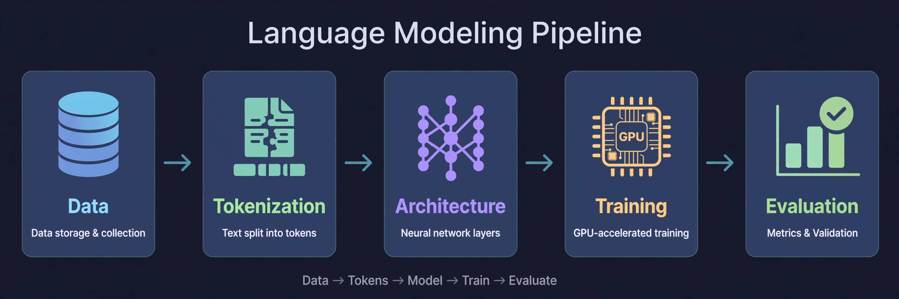

**Data.** The training corpus determines model behavior. Data reflects
the desired capabilities. Large datasets require active curation.

**Tokenization.** Raw text becomes integer sequences. Derived in full
below.

**Architecture.** The transformer maps token sequences to predictions.

**Training.** Optimization over billions of parameters. Learning rate
schedules and batch sizes determine stability.

**Evaluation.** Perplexity measures prediction quality on held-out text.
Benchmarks test specific capabilities.

Two concerns span all stages. **Systems:** data movement dominates GPU
cost. **Scaling laws:** hyperparameters must adapt as compute grows.

> [!QA]
> Q: What are the five stages of building a language model?
> A: Data collection, tokenization, architecture, training, and evaluation. Data determines the ceiling of model quality. Tokenization converts text to integers. Architecture is the transformer. Training optimizes billions of parameters. Evaluation uses perplexity and benchmarks. Systems engineering and scaling laws cut across all five stages.
> Follow-up: Which stage matters most for final quality?
> A: Data. The corpus sets the upper bound on what the model can learn. Architecture and training determine how close the model comes to that bound. A common interview trap is to overemphasize architecture. In practice, data quality moves results more than architectural tweaks. Frontier labs invest heavily in data pipelines for this reason.

## Level 1: Tokenization, the problem

The model computes on integers. Text is not integers. Something must
convert between the two, and the conversion must be exact: decode what
you encoded and you get the input back, character for character. That
something is **tokenization**.

It performs encoding (text to integers) and decoding (integers to
text). The mapping must be invertible: decoding an encoding returns
the input exactly.

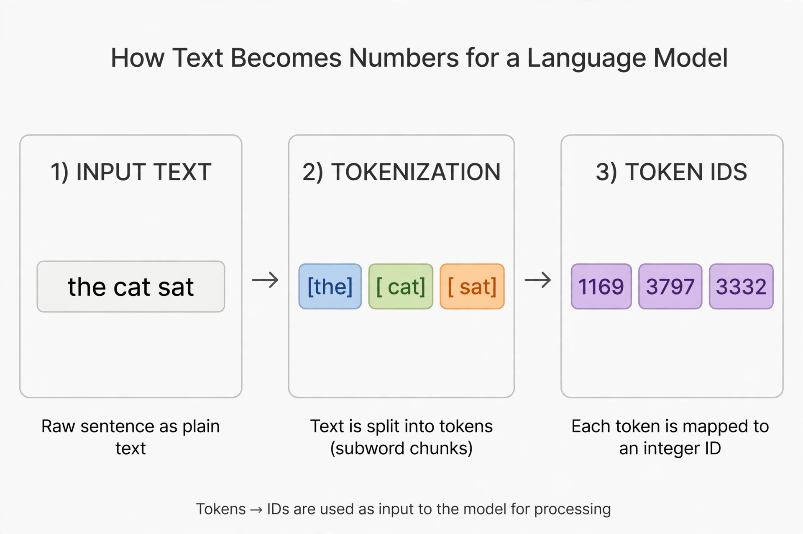

The design question: what should one integer represent? Try it yourself.

<div class="tok-lab">
  <div class="tok-lab-head">Tokenization Lab: type text, click a scheme, click any token to inspect it</div>
  <input class="tok-input" id="tokInput" type="text" value="the cat sat on the mat" maxlength="120" spellcheck="false">
  <div class="tok-tabs">
    <button class="tok-tab active" data-scheme="bpe">Subword (BPE)</button>
    <button class="tok-tab" data-scheme="word">Word</button>
    <button class="tok-tab" data-scheme="char">Character</button>
  </div>
  <div class="tok-out" id="tokOut"></div>
  <div class="tok-stats" id="tokStats"></div>
  <div class="tok-detail" id="tokDetail">Click any token to inspect it.</div>
</div>
<script>
(function () {
  var BPE = [" the"," cat"," sat"," on"," mat","he","at","on","th","s","a","e","t"," ","c","m","o","n","h","r","u","i"];
  var ids = {}; var nxt = 1000;
  function tokId(t) { if (!(t in ids)) ids[t] = nxt++; return ids[t]; }
  function bpeSplit(s) {
    var out = [], i = 0;
    while (i < s.length) {
      var best = null;
      for (var k = 0; k < BPE.length; k++) {
        var v = BPE[k];
        if (s.substr(i, v.length) === v && (!best || v.length > best.length)) best = v;
      }
      if (!best) best = s[i];
      out.push(best); i += best.length;
    }
    return out;
  }
  var input = document.getElementById('tokInput');
  var outEl = document.getElementById('tokOut');
  var statsEl = document.getElementById('tokStats');
  var detailEl = document.getElementById('tokDetail');
  var scheme = 'bpe';
  function esc(s) { return s.replace(/&/g,'&amp;').replace(/</g,'&lt;'); }
  function render() {
    var s = input.value || "";
    var toks = scheme === 'char' ? s.split('') : scheme === 'word' ? s.split(/(\s+)/).filter(function(x){return x.length;}) : bpeSplit(s);
    outEl.innerHTML = '';
    toks.forEach(function (t) {
      var b = document.createElement('button');
      b.className = 'tok';
      b.textContent = t === ' ' ? '\u2423' : t;
      b.onclick = function () {
        detailEl.innerHTML = '<strong>Token:</strong> ' + esc(JSON.stringify(t)) +
          ' &nbsp; <strong>ID:</strong> ' + tokId(t) +
          ' &nbsp; <strong>Characters:</strong> ' + t.length +
          ' &nbsp; <strong>Scheme:</strong> ' + scheme;
      };
      outEl.appendChild(b);
    });
    var words = s.trim() ? s.trim().split(/\s+/).length : 0;
    statsEl.textContent = toks.length + ' tokens | ' + words + ' words | fertility ' +
      (words ? (toks.length / words).toFixed(2) : '0') + ' tokens per word';
  }
  document.querySelectorAll('.tok-tab').forEach(function (tab) {
    tab.onclick = function () {
      document.querySelectorAll('.tok-tab').forEach(function (t) { t.classList.remove('active'); });
      tab.classList.add('active'); scheme = tab.dataset.scheme; render();
    };
  });
  input.addEventListener('input', render);
  render();
})();
</script>

## Level 1: Character-level tokenization

Each character maps to one integer. Vocabulary: approximately 100 entries.
The mapping is trivial.

It fails on sequence length. "the cat sat on the mat" is 22 characters,
hence 22 integers. A 4,096 integer window holds about 186 such sentences.
Subword schemes fit four times more text in the same window.

```ascii
text :  t h e   c a t   s a t   o n   t h e   m a t
ints :  20 8 5 0 3 1 20 0 19 1 20 0 15 14 0 20 8 5 0 13 1 20
count:  22 integers for 6 words. Fertility 3.7.
```

The model must also learn spelling before meaning, which wastes capacity.

> [!QA]
> Q: Why not tokenize by character?
> A: Sequences grow 4 to 5 times longer than subwords, which shrinks the effective context window proportionally. The model must learn orthography before semantics, wasting capacity on a solved problem. No frontier model uses character tokenization in production.
> Follow-up: When would characters be preferable?
> A: When spelling is the signal: typo correction, rare scripts, or character-level adversarial robustness. Some research models use bytes for these tasks. In production, the context cost dominates, so subwords win.

## Level 1: Word-level tokenization

Each word maps to one integer. Sequences are short. Each integer carries
meaning.

It fails on vocabulary size. English plus names, typos, and code exceeds
one million words. Each entry needs a learned representation. Rare words
get no training signal.

Related forms share nothing: "run" and "running" are unrelated integers.
New words have no integer at all.

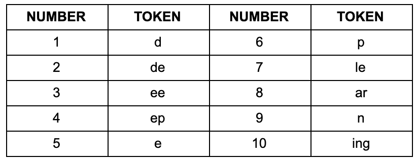

> [!QA]
> Q: Why did the field abandon word tokenization?
> A: Three failures. Vocabulary exceeds one million, which costs memory and starves rare words. Morphological variants share no representation, so learning does not transfer. Out-of-vocabulary words collapse to an unknown token, destroying information.
> Follow-up: How bad is the vocabulary problem in numbers?
> A: A BPE vocabulary holds about 50,000 entries. A word vocabulary for English plus code exceeds 1,000,000, a 20 to 1 ratio. Most word entries would appear a handful of times in training, so their representations stay near random. The embedding matrix alone would dominate model memory.

## Level 1: Subword tokenization

Split words into frequent chunks. "running" becomes ["run", "ning"].
Common words stay whole. Rare words split into known pieces.

```ascii
running  ->  [run][ning]        rare word, two chunks
the      ->  [the]              frequent word, one chunk
runningly -> [run][ning][ly]    unknown word, still representable
```

Vocabulary stays near 50,000. Sequences stay short. Related forms share
chunks, so learning transfers.

The algorithm is byte pair encoding (BPE). It learns chunks by merging
frequent pairs.

> [!QA]
> Q: What is a subword?
> A: A character sequence between a character and a word, learned from corpus statistics. Frequent words remain whole. Rare words decompose into reusable pieces. Vocabulary lands near 50,000 entries.
> Follow-up: What decides the split points?
> A: BPE training counts adjacent pairs across the corpus and merges the most frequent ones. Split points fall where pairs are rare. The procedure is deterministic given the corpus and merge count.

### Subchapter: the subword family (BPE, WordPiece, Unigram)

BPE is one of three subword recipes. All three split rare words into
reusable pieces. They differ in how they learn the piece set.

**BPE** grows the vocabulary. Start from bytes. Merge the most frequent
adjacent pair. Repeat until the target size. The rule is frequency: the
pair that appears most wins. "th" and "he" merge early in English. Rare
pairs never merge.

**WordPiece** also grows the vocabulary. It starts from characters, but
the merge rule is different: merge the pair that most increases the
training data's likelihood, not the pair with the highest count. A pair
that appears often but is predictable scores lower than its raw count
suggests. BERT ships WordPiece with a 30,522 vocabulary. Its "##" prefix
marks pieces that continue a word: "unhappiness" becomes "un",
"##happi", "##ness".

**Unigram** goes the other way. It starts with a huge vocabulary (all
frequent substrings) and prunes: fit a unigram language model, drop the
pieces whose removal hurts the total likelihood least, repeat until the
target size. The segmentation is probabilistic: the same word can split
in several ways, and the tokenizer picks the most likely one. T5 uses
SentencePiece Unigram with a 32,000 vocabulary.

Why did BPE win the LLM era? Three reasons. It is byte-level, so no
unknown token exists. It is deterministic, so train and inference always
agree. And it is simple to implement at scale, which matters when you
retrain tokenizers on terabytes of new data. WordPiece stays strong in
encoder models (the BERT family). Unigram stays strong where
probabilistic segmentation helps, like multilingual T5.

Worked toy. Corpus: "low lower lowest". BPE counts pairs: "lo" appears 3
times, "ow" appears 3 times. Say "lo" merges first, then "low". The
vocabulary gains "lo", then "low". WordPiece scores pairs by likelihood
lift, not count: merging "lo" + "w" into "low" explains "low", "lower",
"lowest" in one piece, so its likelihood jump is large and it merges
early. Unigram starts with every substring, then prunes pieces like
"lowes" whose removal barely changes the likelihood. Same corpus, three
different vocabularies. Three different splits of "lowest".

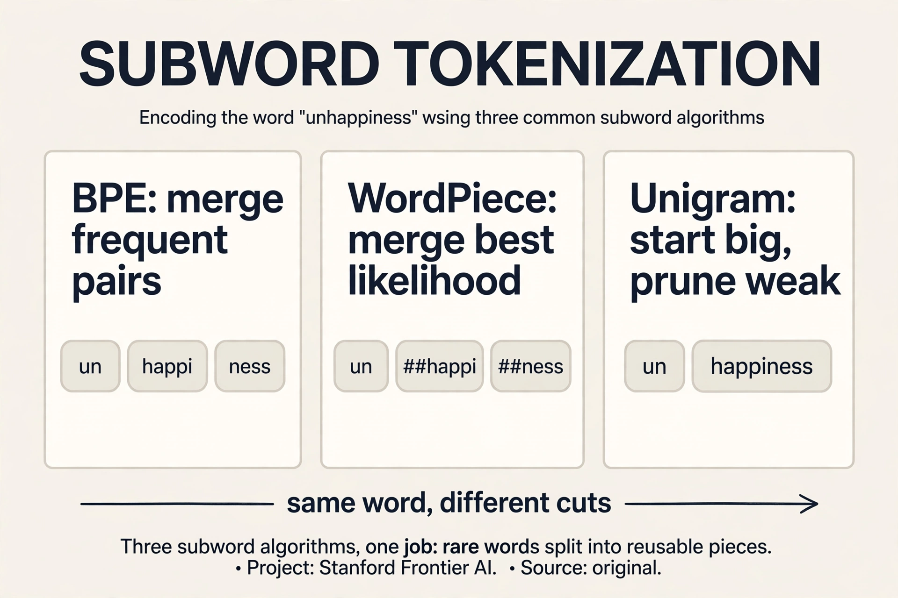

> [!QA]
> Q: Walk me through how BPE encodes a word it has never seen.
> A: Take "unfamiliarity" with a trained BPE vocabulary. The encoder walks left to right and applies greedy longest match against the fixed merge list. Suppose the vocabulary contains "un", "fam", "ili", "ar", "ity". Position 0: "un" matches, the longest match, since "unf" is not in the vocabulary. Position 2: "fam" matches. Position 5: "ili". Position 8: "ar". Position 10: "ity". Output: ["un", "fam", "ili", "ar", "ity"]. The word never appeared in training, yet every piece did, so the model receives five known IDs instead of one unknown token. That is the whole point of subwords: represent anything with pieces.
> Follow-up: Why greedy longest match instead of trying all splits and picking the best?
> A: Speed. Greedy matching is linear in text length. Searching all splits is exponential, and the gain is small: BPE merges were learned greedily too, so the vocabulary is shaped to make greedy splits good. The interview signal is the tradeoff: near-optimal correctness at linear cost.

## Level 1: BPE training

Start with 256 byte tokens. Repeat: find the most frequent adjacent pair,
merge it into a new token. Stop at the target vocabulary size.

Worked example on "lower":

Start: l, o, w, e, r. Merge (l,o) to "lo". Merge (lo,w) to "low". Merge
(e,r) to "er". Result: [low, er].

!anim[assets/anim/bpe-merges.mp4 "The merge sequence. The highlighted pair merges at each step."]

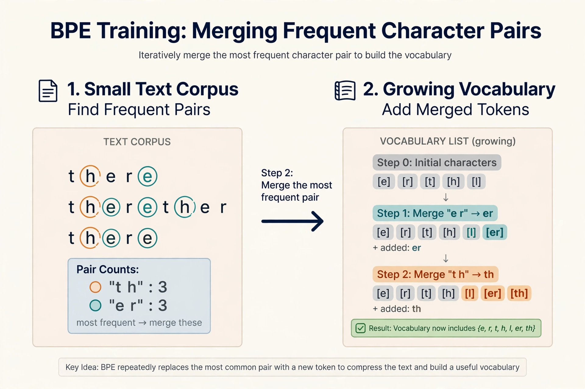

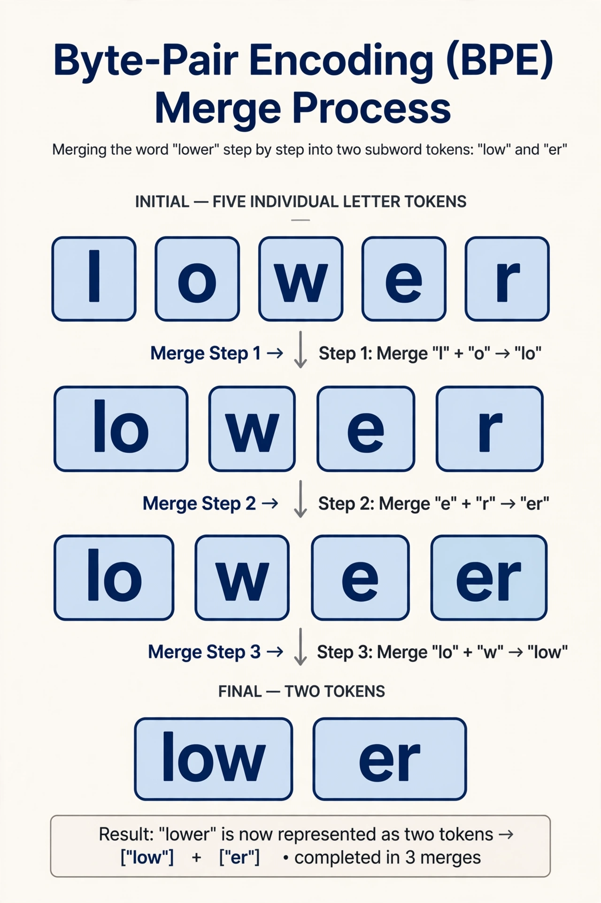


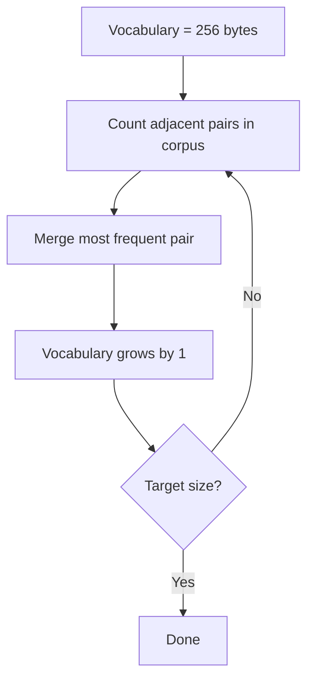

## Level 1: BPE inference

Training runs once. Inference applies the vocabulary to new text with
greedy longest match: at each position, take the longest matching token.

"lowest" with vocabulary containing "low" and "er" becomes [low, e, s, t].
Deterministic: same input always gives same output.

```ascii
lowest :  [low][e][s][t]
pos 0 : longest match at "low..." is "low" (3 chars), not "lo" (2)
pos 3 : "er" is in vocab but "est" is not; greedy takes "e"
```

> [!QA]
> Q: Distinguish BPE training from inference.
> A: Training learns the vocabulary by merging frequent pairs over a corpus, once, offline. Inference segments new text with greedy longest match against the fixed vocabulary, on every input, online. Training is expensive. Inference is fast.
> Follow-up: Why must inference be deterministic?
> A: The model was trained on specific segmentations. If inference produced different splits, the model would see token sequences it never trained on, and predictions would degrade. Determinism guarantees train-inference consistency.

## Level 2: Byte-level initialization

BPE starts from 256 bytes, not characters. Every Unicode string is a byte
sequence, so any text is representable. No unknown token exists. The worst
case falls back to single bytes.

```ascii
"caf\u00e9" as UTF-8 bytes: [99][97][102][195][169]
```

Cost: multi-byte characters split into 2 to 4 tokens. Non-English text
has higher fertility: more tokens per word, higher cost, shorter effective
context.

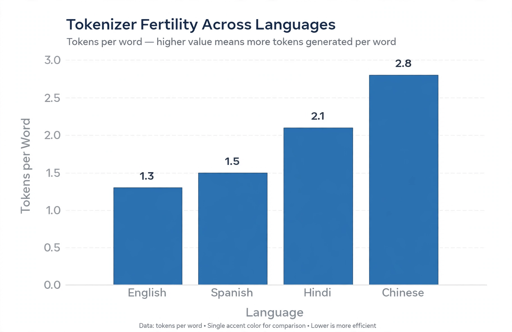

> [!QA]
> Q: Why bytes instead of characters?
> A: Bytes guarantee universal coverage with zero unknown tokens. Characters would need an unknown token for unseen scripts. The tradeoff is fertility: rare characters split into multiple byte tokens.
> Follow-up: How does this affect multilingual deployment?
> A: Languages with multi-byte scripts consume 2 to 3 times more tokens per word than English. This triples inference cost and shrinks effective context for those languages. Fertility measurement is standard when selecting tokenizers. Some labs train language-specific tokenizers to reduce this gap.

### Subchapter: fertility, measured and priced

Fertility is tokens per word. It is the number that turns a tokenizer
into a bill.

The lesson states English near 1.3. Work out what that buys. A 4,096
token context window holds about 3,150 English words (4,096 / 1.3). The
same window in a language with fertility 3 holds about 1,365 words. The
model reads less than half the document. Nothing about the model
changed. Only the tokenizer's fertility changed.

Price follows the same math. At $2.50 per million tokens, a 1 million
word English corpus costs about 1.3M tokens, so $3.25. The same corpus
at fertility 3 costs 3M tokens, so $7.50. The non-English user pays 2.3
times more for the same meaning.

Two levers reduce fertility. A bigger vocabulary covers more multi-byte
sequences directly: Llama 3's jump from 32K to 128K raised English
compression from 3.17 to 3.94 characters per token (per the Llama 3
report). And tokenizer training data that includes the language:
DeepSeek-V3 modified its pretokenizer and training data explicitly for
multilingual compression efficiency. Both levers cost embedding memory:
128K entries times 4,096 dims is 524M parameters in the embedding table
alone, against 131M at 32K. That is a 400M parameter price for better
compression.

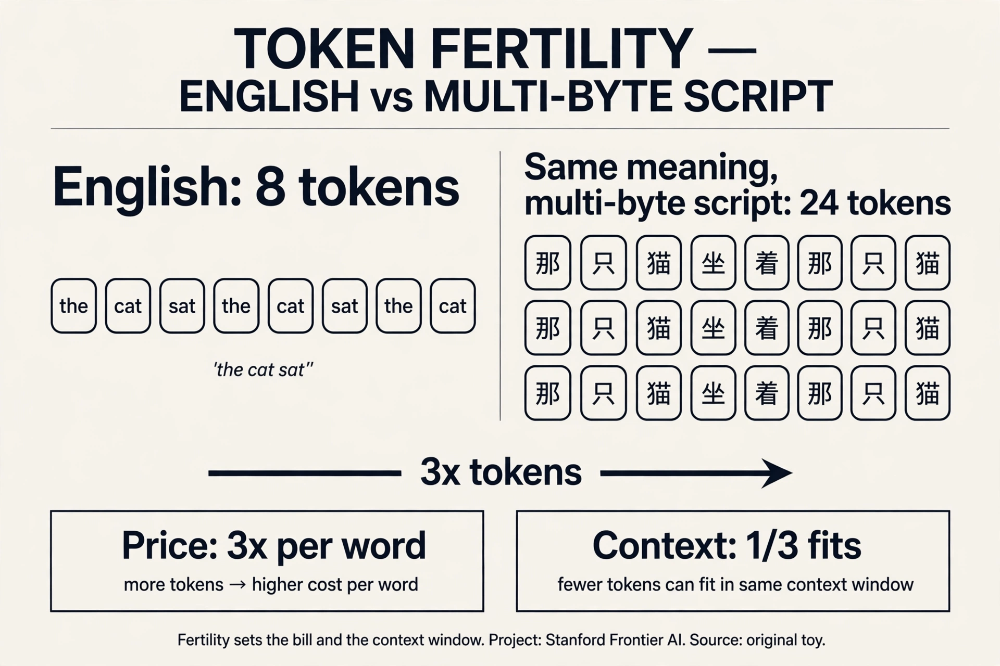

## Level 2: The embedding interface

Each integer indexes a row of the embedding matrix. Token 1169 becomes a
vector, for example 12,288 numbers. That vector enters the network.

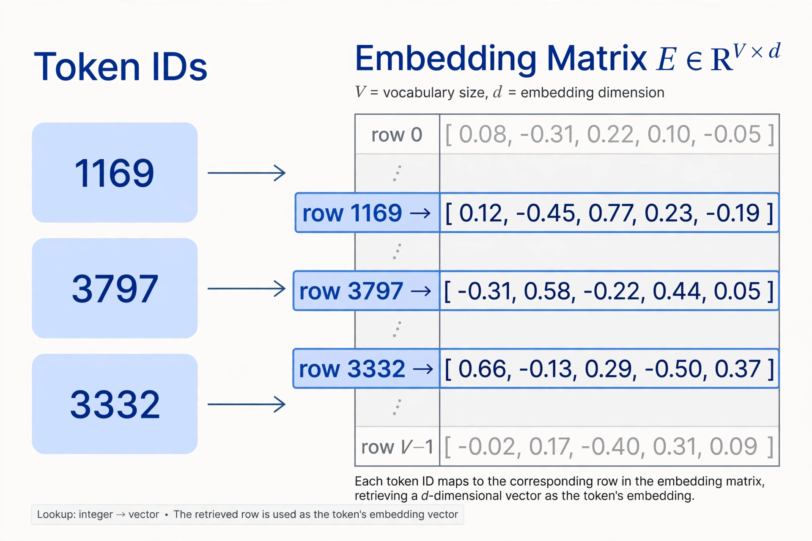

Two invariants. The mapping is lossless. The tokenizer is fixed before
training. Replacing it invalidates the model.

> [!QA]
> Q: Why does tokenization matter in frontier-lab interviews?
> A: It controls cost and context. Pricing is per token, so fertility sets inference expense. Context windows count tokens, so the tokenizer decides how much text fits. Multilingual quality, code handling, and prompt injection surfaces all run through tokenization.
> Follow-up: What would you change about current tokenizers?
> A: Three directions are active. Lower fertility for non-English languages. Better handling of code and math, where current tokenizers split numbers awkwardly. And tokenizer-aware training, where the model learns with knowledge of merge structure. Each is a research area with interview relevance.

### Subchapter: what is used where (production tokenizers)

Every frontier lab ships a subword tokenizer. Only the recipe and the
size differ.

| Model | Tokenizer | Vocab | Source |
|---|---|---|---|
| GPT-4 / GPT-3.5 | tiktoken cl100k_base, byte-level BPE | 100K | OpenAI tiktoken |
| GPT-4o | tiktoken o200k_base, byte-level BPE | 200K | OpenAI tiktoken |
| Llama 3 | tiktoken-derived byte-level BPE, 28K added tokens | 128K | Llama 3 paper |
| Llama 2 | SentencePiece BPE | 32K | Llama 2 paper |
| Mistral 7B | SentencePiece BPE | 32K | Mistral release docs |
| DeepSeek-V3 | byte-level BPE, custom pretokenizer | 128K | DeepSeek-V3 tech report |
| Qwen 2.5 | byte-level BPE | 151,646 | Qwen 2.5 release |
| Gemma 2 | SentencePiece | 256K | Gemma 2 model card |
| BERT | WordPiece | 30,522 | BERT paper |
| T5 | SentencePiece Unigram | 32K | T5 paper |
| Claude | not public | unknown | Anthropic has not published it |

Read the trend. Vocabularies grew: 32K in 2022, 100K to 256K in
2024-2025. The growth buys compression: Llama 3's 128K improved English
compression from 3.17 to 3.94 characters per token over Llama 2's 32K.
The cost is embedding memory: 524M parameters for a 128K by 4096 table.
The field moved from SentencePiece blobs to tiktoken-style byte-level
BPE with merges baked into tokenizer.json. Byte-level won because
multilingual coverage with zero unknown tokens beats everything else at
scale.

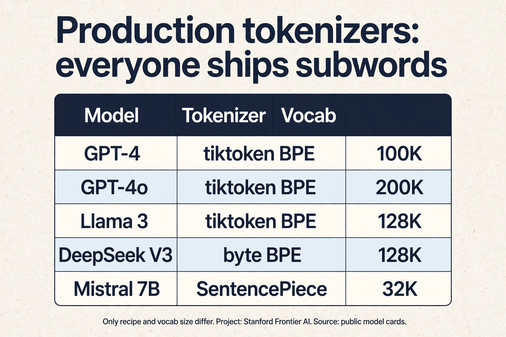

## Recap: the whole lesson on one screen

Eight ideas carry this lecture. Read each card. Say the core sentence out
loud. If you can, you own the lesson.

<div class="recap-grid">
<div class="recap-card">

<div class="rc-body">
<strong>1. Language modeling predicts the next token</strong>
<p>A language model assigns a probability to every possible next token.
The chain rule turns a whole sentence into a product of these small
predictions.</p>
<p class="rc-num">Key: p(x1..xn) = product of p(xi | x1..xi-1)</p>
</div>
</div>
<div class="recap-card">

<div class="rc-body">
<strong>2. The pipeline has four stages</strong>
<p>Raw text becomes integer IDs. IDs become vectors. The model scores the
next token. The winner decodes back to text. Tokenization is the first
stage, and every later stage depends on it.</p>
<p class="rc-num">Key: text to IDs to vectors to scores to text</p>
</div>
</div>
<div class="recap-card">

<div class="rc-body">
<strong>3. Characters are too fine, words are too coarse</strong>
<p>Character tokens make sequences very long. Word tokens make the
vocabulary huge and break on new words. Both extremes cost you something
real: speed or coverage.</p>
<p class="rc-num">Key: 26 letters vs 170,000+ English words</p>
</div>
</div>
<div class="recap-card">

<div class="rc-body">
<strong>4. BPE merges frequent pairs</strong>
<p>Byte-pair encoding starts from single characters. It counts which pairs
sit together most often and merges the winner into one token. Repeat.
Common words become single tokens. Rare words stay split.</p>
<p class="rc-num">Key: GPT models use about 50,000 merges</p>
</div>
</div>
<div class="recap-card">

<div class="rc-body">
<strong>5. The vocabulary comes from data, not from a dictionary</strong>
<p>Training counts pairs across a large corpus. The most frequent pairs
become tokens. The corpus decides the vocabulary, so a mostly-English
corpus gives English-friendly tokens and punishes other languages.</p>
<p class="rc-num">Key: dominant language in data wins the vocabulary</p>
</div>
</div>
<div class="recap-card">

<div class="rc-body">
<strong>6. Inference is greedy longest-match</strong>
<p>At inference time the tokenizer walks the text and takes the longest
vocabulary entry that matches. It is fast and simple. It is not optimal:
a global optimizer would sometimes split words differently.</p>
<p class="rc-num">Key: greedy, not optimal</p>
</div>
</div>
<div class="recap-card">

<div class="rc-body">
<strong>7. Fertility sets cost and context</strong>
<p>Fertility is tokens per word. English sits near 1.3. Some languages
need 3 or more. You pay per token and your context window counts tokens,
so fertility decides both your bill and how much text fits.</p>
<p class="rc-num">Key: tokens per word. English ~1.3</p>
</div>
</div>
<div class="recap-card">

<div class="rc-body">
<strong>8. Token IDs index the embedding matrix</strong>
<p>Each integer ID picks one row of a learned matrix. That row is a vector,
thousands of numbers wide. The mapping is lossless: the same text always
gives the same IDs.</p>
<p class="rc-num">Key: 50k vocab x 12k dims is a huge matrix</p>
</div>
</div>
</div>

## Official sources and further reading

**Official:**
- Hugging Face LLM Course, Chapter 2: the canonical visual introduction.
- Karpathy, "Let's build the GPT Tokenizer": builds BPE from scratch in code.
- Sennrich et al. (2016): the original subword paper for translation.
- tiktoken repository: OpenAI's production tokenizer.

**Further reading:**
- Hugging Face tokenizers documentation: implementation details and speed benchmarks.
- "Tokenizers: How machines read" (FloydHub): the word-level visual used above.

**Caveats from these sources.** BPE is greedy, not optimal: longest match
can split words in ways a global optimizer would avoid. Tokenizer training
data biases the vocabulary toward the dominant language of the corpus.
Numbers tokenize inconsistently: "123" may split differently from "124",
which hurts arithmetic. These are known limitations, not bugs.

## Connections to the other courses

- **CS224N:** word vectors assumed word tokens. Subwords changed the input representation.
- **CS336 later lectures:** the embedding matrix size depends on vocabulary. Inference cost scales with fertility.
- **CS329A:** test-time compute counts tokens. Verification granularity interacts with token splits.
- **Math foundations (new):** probability distributions in the definition require measure theory. The chain rule is proved there.

> [!CHEAT]
> **Tokenization cheatsheet.** Definition: probability distribution over token sequences, chain rule factorization. Pipeline: data, tokenization, architecture, training, evaluation. Granularities: characters (vocab 100, 5x too long), words (vocab 1M+, no sharing), subwords (vocab 50K, best of both). BPE: 256 bytes, merge frequent pairs, 50K target. Inference: greedy longest match, deterministic. Bytes: universal coverage, fertility cost for non-English. Invariants: lossless, fixed before training.

> [!MEMORY]
> **BPE as compression.** Frequent patterns earn short codes. Merge order is a frequency ranking. Count pairs, merge the winner, repeat 50,000 times.
