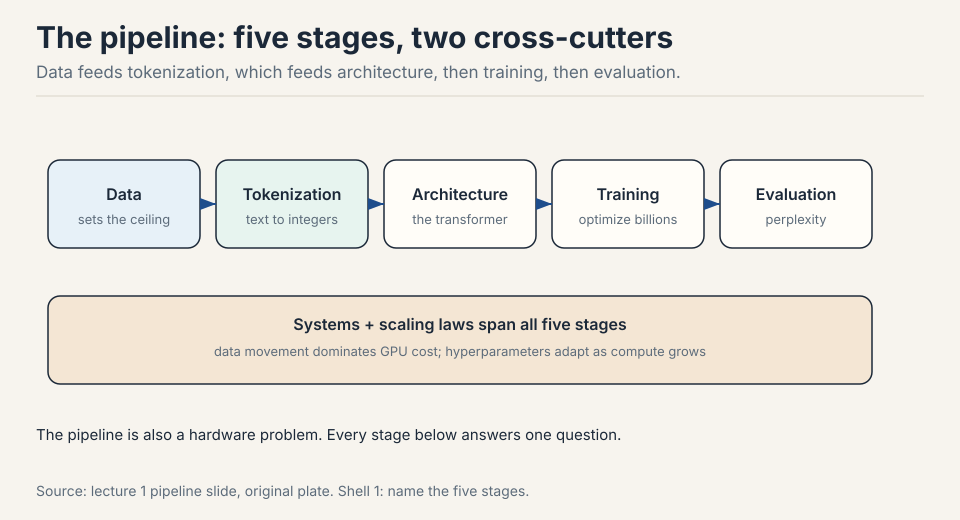
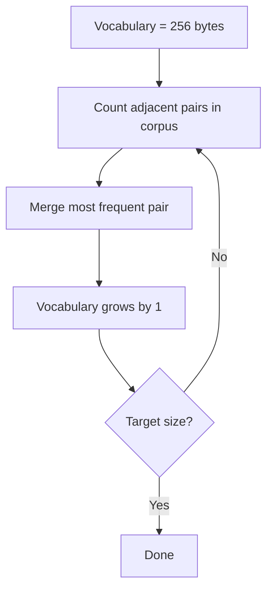
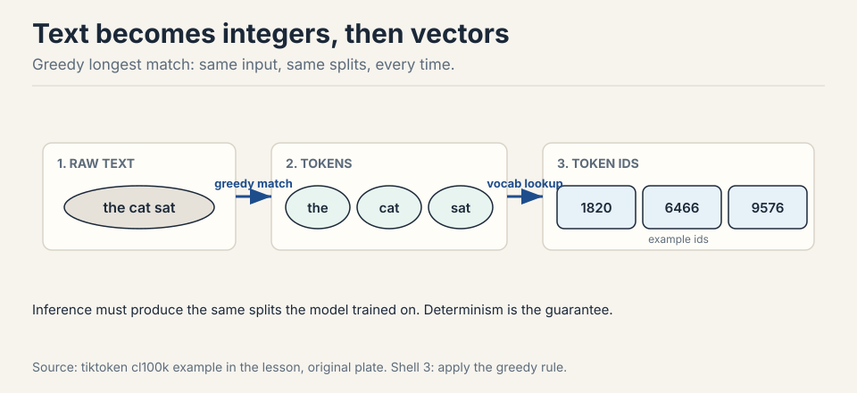
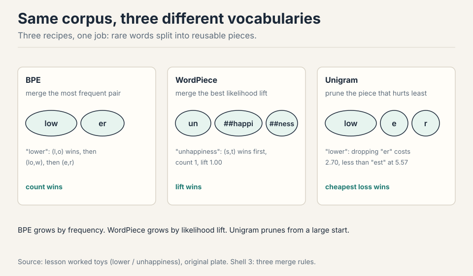
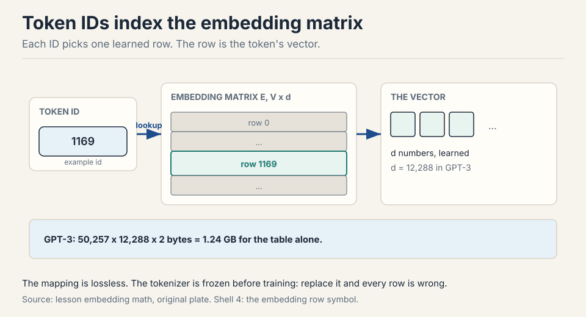
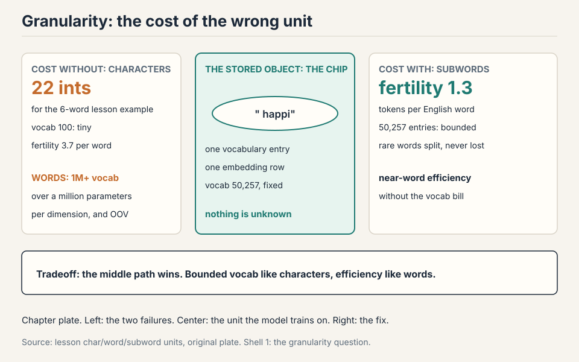
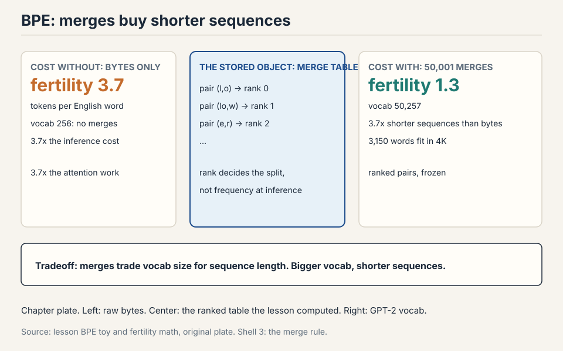
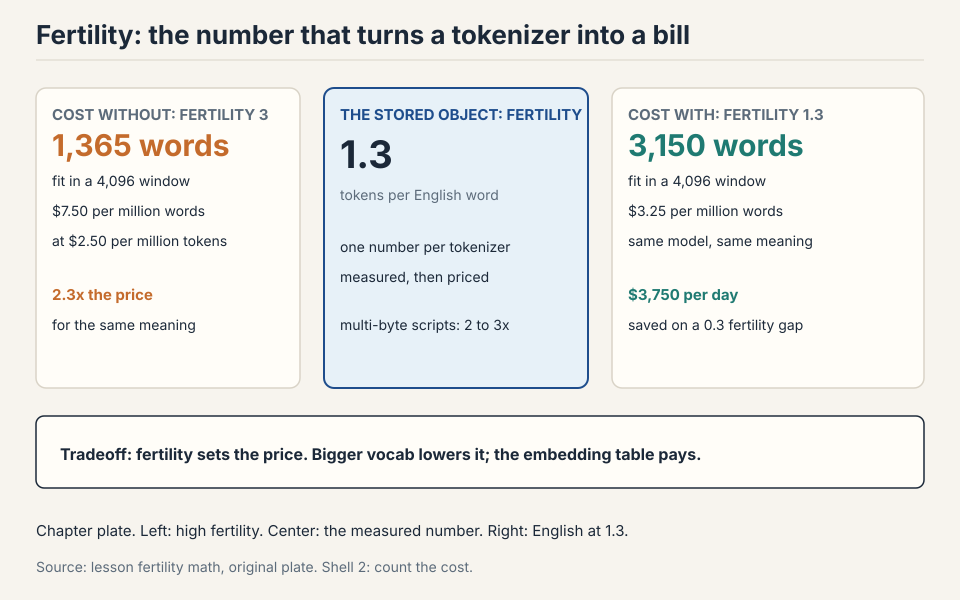
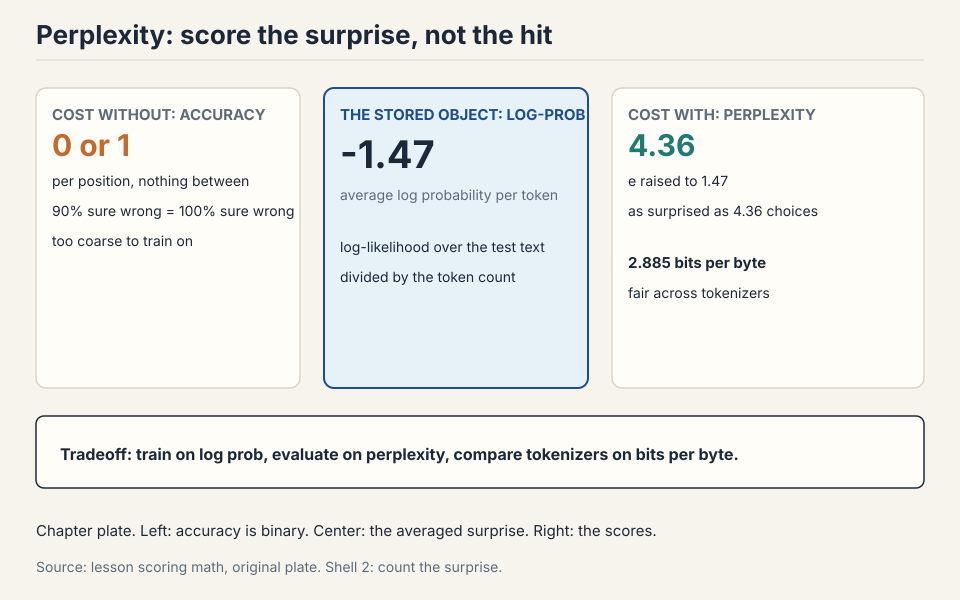

## How to read this lesson

No prerequisites are assumed. Every term is defined at first use.
Read straight through. The chapter builds one question at a time, and
each answer becomes the tool the next section needs.

## The problem: score every sentence

The model must score sentences. "The cat sat" should get a high
number. "Cat the sat the" should get a low one. A **language model**
is the machine that assigns these numbers: a probability distribution
over sequences of tokens.

Given a sequence, it assigns a probability to each possible next
token. Formally, for tokens x_1 through x_n, the model defines
P(x_1, ..., x_n). By the **chain rule**, this equals the product of
P(x_t | x_1, ..., x_{t-1}) over all positions t. The chain rule is the
rule from probability that breaks a joint probability into a product
of conditionals: the probability of the whole sequence is the
probability of the first token, times the probability of the second
given the first, times the probability of the third given the first
two, and so on. Training means learning these conditional
distributions from data.

The definition raises the first question of the course. What is a
token? The chip computes on numbers. Text is not numbers. The answer
is tokenization, and the chapter derives it below.

## The pipeline: five stages, two cross-cutters

Building a language model requires five stages in order.



### Subchapter: data sets the ceiling

The training corpus determines model behavior. Data reflects the
desired capabilities. Large datasets require active curation. A model
trained on code writes code. A model trained on one language speaks
that language. The stage that decides what the model can learn is the
first one.

### Subchapter: tokenization converts text to integers

Raw text becomes integer sequences. This is the stage the chapter
derives in full. Every later stage depends on the choices made here.

### Subchapter: architecture maps sequences to predictions

The transformer maps token sequences to next-token predictions. It is
the subject of the next two lectures.

### Subchapter: training optimizes billions of parameters

Optimization over billions of parameters. Learning rate schedules and
batch sizes determine stability. This is where the compute budget
burns.

### Subchapter: evaluation measures what survived

**Perplexity** measures prediction quality on held-out text: how
surprised the model is by text it has not seen. Low perplexity means
the model assigned high probability to the actual next tokens.
Benchmarks test specific capabilities beyond raw prediction.

### Subchapter: two concerns span all stages

**Systems:** data movement dominates GPU cost. The pipeline is also a
hardware problem. **Scaling laws:** hyperparameters must adapt as
compute grows. Both concerns cut across all five stages and return in
every later lecture.

> [!QA]
> Q: What are the five stages of building a language model?
> A: Data collection, tokenization, architecture, training, and evaluation. Data determines the ceiling of model quality. Tokenization converts text to integers. Architecture is the transformer. Training optimizes billions of parameters. Evaluation uses perplexity and benchmarks. Systems engineering and scaling laws cut across all five stages.
> Follow-up: Which stage matters most for final quality?
> A: Data. The corpus sets the upper bound on what the model can learn. Architecture and training determine how close the model comes to that bound. A common interview trap is to overemphasize architecture. In practice, data quality moves results more than architectural tweaks. Frontier labs invest heavily in data pipelines for this reason.

## First attempt: character-level tokenization

The model computes on integers. Text is not integers. Something must
convert between the two, and the conversion must be exact: decode what
you encoded and you get the input back, character for character. That
something is **tokenization**. It performs encoding (text to integers)
and decoding (integers to text). The mapping must be invertible.

The simplest idea: give each character its own integer. "a" becomes
97, "b" becomes 98, in the familiar ASCII table. The mapping is
trivial. The vocabulary holds about 100 entries.

It fails on sequence length. "the cat sat on the mat" is 22
characters, hence 22 integers. A 4,096-integer window holds about 186
such sentences. The model must also learn spelling before meaning,
which wastes capacity on a solved problem.

**Fertility** is tokens per word. Watch it in the figure: 22 integers
for 6 words gives 22/6 = 3.7.

```ascii
text :  t h e   c a t   s a t   o n   t h e   m a t
ints :  20 8 5 0 3 1 20 0 19 1 20 0 15 14 0 20 8 5 0 13 1 20
count:  22 integers for 6 words. Fertility 3.7.
```

The window
is fixed. Every character token is a slot that cannot hold meaning.

> [!QA]
> Q: Why not tokenize by character?
> A: Sequences grow 4 to 5 times longer than subwords, which shrinks the effective context window proportionally. The model must learn orthography before semantics, wasting capacity on a solved problem. No frontier model uses character tokenization in production.
> Follow-up: When would characters be preferable?
> A: When spelling is the signal: typo correction, rare scripts, or character-level adversarial robustness. Some research models use bytes for these tasks. In production, the context cost dominates, so subwords win.

### Subchapter: try it yourself

<div class="tok-lab">
  <div class="tok-lab-head">Tokenization Lab: type text, click a scheme (BPE = byte pair encoding, defined below), click any token to inspect it</div>
  <input class="tok-input" id="tokInput" type="text" value="the cat sat on the mat" maxlength="120" spellcheck="false">
  <div class="tok-tabs">
    <button class="tok-tab active" data-scheme="bpe">Subword (BPE)</button>
    <button class="tok-tab" data-scheme="word">Word</button>
    <button class="tok-tab" data-scheme="char">Character</button>
  </div>
  <div class="tok-out" id="tokOut"></div>
  <div class="tok-stats" id="tokStats"></div>
  <div class="tok-detail" id="tokDetail">Click any token to inspect it.</div>
</div>
<script>
(function () {
  var BPE = [" the"," cat"," sat"," on"," mat","he","at","on","th","s","a","e","t"," ","c","m","o","n","h","r","u","i"];
  var ids = {}; var nxt = 1000;
  function tokId(t) { if (!(t in ids)) ids[t] = nxt++; return ids[t]; }
  function bpeSplit(s) {
    var out = [], i = 0;
    while (i < s.length) {
      var best = null;
      for (var k = 0; k < BPE.length; k++) {
        var v = BPE[k];
        if (s.substr(i, v.length) === v && (!best || v.length > best.length)) best = v;
      }
      if (!best) best = s[i];
      out.push(best); i += best.length;
    }
    return out;
  }
  var input = document.getElementById('tokInput');
  var outEl = document.getElementById('tokOut');
  var statsEl = document.getElementById('tokStats');
  var detailEl = document.getElementById('tokDetail');
  var scheme = 'bpe';
  function esc(s) { return s.replace(/&/g,'&amp;').replace(/</g,'&lt;'); }
  function render() {
    var s = input.value || "";
    var toks = scheme === 'char' ? s.split('') : scheme === 'word' ? s.split(/(\s+)/).filter(function(x){return x.length;}) : bpeSplit(s);
    outEl.innerHTML = '';
    toks.forEach(function (t) {
      var b = document.createElement('button');
      b.className = 'tok';
      b.textContent = t === ' ' ? '\u2423' : t;
      b.onclick = function () {
        detailEl.innerHTML = '<strong>Token:</strong> ' + esc(JSON.stringify(t)) +
          ' &nbsp; <strong>ID:</strong> ' + tokId(t) +
          ' &nbsp; <strong>Characters:</strong> ' + t.length +
          ' &nbsp; <strong>Scheme:</strong> ' + scheme;
      };
      outEl.appendChild(b);
    });
    var words = s.trim() ? s.trim().split(/\s+/).length : 0;
    statsEl.textContent = toks.length + ' tokens | ' + words + ' words | fertility ' +
      (words ? (toks.length / words).toFixed(2) : '0') + ' tokens per word';
  }
  document.querySelectorAll('.tok-tab').forEach(function (tab) {
    tab.onclick = function () {
      document.querySelectorAll('.tok-tab').forEach(function (t) { t.classList.remove('active'); });
      tab.classList.add('active'); scheme = tab.dataset.scheme; render();
    };
  });
  input.addEventListener('input', render);
  render();
})();
</script>

Type a sentence and switch schemes. Watch the fertility number move.
That number is the whole chapter in one demo.

## Second attempt: word-level tokenization

The other extreme: give each word its own integer. Sequences are
short. Each integer carries meaning. "the cat sat" is 3 integers.

It fails on vocabulary size. English plus names, typos, and code
exceeds one million words. Each entry needs a learned representation.
Rare words get no training signal. Work the memory: one million
entries at 4,096 dims in bf16 is 8.2 GB just for the embedding table
(one learned vector per vocabulary entry),
against 0.4 GB for a 50,000-entry table. And most of those million
entries appear a handful of times in training, so their vectors stay
near random.

Related forms share nothing: "run" and "running" are unrelated
integers. New words have no integer at all: they collapse to one
unknown token, and all information about them is destroyed. That
failure has a name: the **out-of-vocabulary** problem.


> [!QA]
> Q: Why did the field abandon word tokenization?
> A: Three failures. Vocabulary exceeds one million, which costs memory and starves rare words. Morphological variants share no representation, so learning does not transfer. Out-of-vocabulary words collapse to an unknown token, destroying information.
> Follow-up: How bad is the vocabulary problem in numbers?
> A: A BPE vocabulary holds about 50,000 entries. A word vocabulary for English plus code exceeds 1,000,000, a 20 to 1 ratio. Most word entries would appear a handful of times in training, so their representations stay near random. The embedding matrix alone would dominate model memory.

## The key question

Characters are too fine: the vocabulary is tiny but the sequences are
too long. Words are too coarse: the sequences are short but the
vocabulary is unbounded and new words destroy information. What if the
unit could be something between the two: frequent words stay whole,
rare words split into reusable pieces, and nothing is ever unknown?

## The idea: subword tokenization

Split words into frequent chunks. "running" becomes ["run", "ning"].
Common words stay whole. Rare words split into known pieces.

```ascii
running   ->  [run][ning]        rare word, two chunks
the       ->  [the]              frequent word, one chunk
runningly ->  [run][ning][ly]    unknown word, still representable
```

Vocabulary stays near 50,000. Sequences stay short. Related forms
share chunks, so learning transfers. The algorithm that learns the
chunks is **byte pair encoding** (BPE): it merges frequent pairs,
step by step, until the vocabulary reaches its target size.

> [!QA]
> Q: What is a subword?
> A: A character sequence between a character and a word, learned from corpus statistics. Frequent words remain whole. Rare words decompose into reusable pieces. Vocabulary lands near 50,000 entries.
> Follow-up: What decides the split points?
> A: BPE training counts adjacent pairs across the corpus and merges the most frequent ones. Split points fall where pairs are rare. The procedure is deterministic given the corpus and merge count.

### Subchapter: BPE training, by hand

Training runs once, offline. The input is a corpus. The output is a
vocabulary. The rule: start from 256 byte tokens, find the most
frequent adjacent pair, merge it into a new token, repeat until the
vocabulary reaches the target size.

Work it on the word "lower", target 2 merges.

```ascii
start:   [l][o][w][e][r]            count pairs: (l,o)=1 (o,w)=1 (w,e)=1 (e,r)=1
merge 1: pick (l,o), the winner ->  [lo][w][e][r]
merge 2: pick (lo,w)        ->      [low][e][r]
merge 3: pick (e,r)         ->      [low][er]
```

In a real corpus, the pair counts come from millions of words, and
"th" might merge before "lo". The mechanism is identical: count,
merge the winner, repeat. GPT-2's vocabulary ran 50,257 entries: 256
bytes plus 50,001 merges. Each merge is one learned fact about which
letters like to sit together.

!anim[assets/anim/bpe-merges.mp4 "Shell 3. The merge sequence. The highlighted pair merges at each step. Source: lesson BPE toy."]




### Subchapter: BPE inference, by hand

Training runs once. Inference applies the vocabulary to new text, on
every input, online. The rule is **greedy longest match**: at each
position, take the longest vocabulary entry that matches.

"lowest" with a vocabulary containing "low", "lo", "o", "w", "e",
"s", "t":

```ascii
lowest
pos 0: candidates "lo", "low". Longest match: "low" (3 chars).
pos 3: candidates "e", "es". Only "e" matches alone.
pos 4: "s" matches. pos 5: "t" matches.
result: [low][e][s][t]
```

Note what happened at position 3. The vocabulary also contains "er",
but "est" is not an entry and greedy takes one character at a time
when no multi-character entry matches. Deterministic: the same input
always gives the same output. That determinism matters: the model was
trained on specific segmentations, and inference must produce the
same splits.

> [!QA]
> Q: Distinguish BPE training from inference.
> A: Training learns the vocabulary by merging frequent pairs over a corpus, once, offline. Inference segments new text with greedy longest match against the fixed vocabulary, on every input, online. Training is expensive. Inference is fast.
> Follow-up: Why must inference be deterministic?
> A: The model was trained on specific segmentations. If inference produced different splits, the model would see token sequences it never trained on, and predictions would degrade. Determinism guarantees train-inference consistency.



### Subchapter: the pretokenizer splits before BPE sees the text

BPE never sees raw text. First, a **pretokenizer** splits the text
with a regex, and BPE merges only inside each piece, never across
piece boundaries. This is the detail that decides how numbers, code,
and punctuation tokenize.

GPT-2's regex is the famous one. It splits on: contractions ("'s",
"'t"), letters, digits, and punctuation runs. The practical effect:
"Hello, world!" becomes ["Hello", ",", " world", "!"] before BPE
starts. Merges can turn " world" into one token, but no merge will
ever join the comma to "Hello". Spaces attach to the start of words,
not the end: the token is " world" with a leading space, not "world".

Why this matters in interviews: the pretokenizer is why "123456" does
not become one token even when digits are frequent. The regex splits
digit runs into groups (GPT-2: up to 3 digits), so the model sees
["123"]["456"], never ["123456"]. Ask an interviewer why the model
fails at arithmetic on long numbers, and the answer starts here.

### Subchapter: special tokens are not BPE tokens

The vocabulary carries reserved entries that never come from text.
They are structural markers the training pipeline needs.

```ascii
<|endoftext|>   marks a document boundary in pretraining data
<|im_start|>    opens a chat message block in instruction tuning
<|im_end|>      closes it
<bos> <eos>     begin and end of sequence (older convention)
<pad>           fills batches to equal length
```

These tokens are added to the vocabulary after training, and the
embedding matrix grows to hold them. A 50,257-entry GPT-2 vocabulary
is 50,000 merges plus 256 bytes plus 1 special token. The tokenizer
never splits them, never merges across them. They are atomic.

The chat template is the consumer: it wraps user and assistant
messages in these markers before encoding. The model learns that
text after <|im_start|>assistant is its own output. Change the
template and you change what the model generates, without touching a
single weight.

## The subword family: BPE, WordPiece, Unigram

BPE is one of three subword recipes. All three split rare words into
reusable pieces. They differ in how they learn the piece set.

### Subchapter: BPE grows by frequency

Start from bytes. Merge the most frequent adjacent pair. Repeat until
the target size. The rule is frequency: the pair that appears most
wins. "th" and "he" merge early in English. Rare pairs never merge.

### Subchapter: WordPiece grows by likelihood lift

Also starts from characters, but the merge rule differs: merge the
pair that most increases the training data's likelihood, not the pair
with the highest count. A pair that appears often but is predictable
scores lower than its raw count suggests. BERT ships WordPiece with a
30,522 vocabulary. Its "##" prefix marks pieces that continue a word:
"unhappiness" becomes "un", "##happi", "##ness".

Work the scoring on the toy corpus "low lower lowest". WordPiece
scores a pair by count(pair) divided by count(first) times
count(second): how much more often the pair occurs than chance
predicts. Pair counts: (l,o) 3, (o,w) 3, (w,e) 2, (e,r) 1, (e,s) 1,
(s,t) 1. Letter counts: l 3, o 3, w 3, e 2, r 1, s 1, t 1. Scores:
(l,o) = 3/(3x3) = 0.33, (o,w) = 0.33, (w,e) = 2/(3x2) = 0.33,
(e,r) = 1/(2x1) = 0.50, (e,s) = 0.50, (s,t) = 1/(1x1) = 1.00. The
winner is (s,t) with count 1: s and t never appear apart, so their
pairing is certain. (l,o) appears 3 times, but its letters are
common alone, so its lift is only 0.33. BPE would merge (l,o)
first. WordPiece merges (s,t) first. Same corpus, different first
merge, different vocabulary.

### Subchapter: Unigram prunes from a large start

Goes the other way. Starts with a huge vocabulary (all frequent
substrings) and prunes: fit a unigram language model, drop the pieces
whose removal hurts the total likelihood least, repeat until the
target size. The segmentation is probabilistic: the same word can
split in several ways, and the tokenizer picks the most likely one.
T5 uses SentencePiece Unigram with a 32,000 vocabulary.

Work one pruning round on "low lower lowest". Suppose the current
best split is [low][low][er][low][est]. Piece counts: low 3, er 1,
est 1, total 5. Log-likelihood: 3 x ln(3/5) + 2 x ln(1/5) = -4.75.
Candidate one: drop "er". "lower" resplits as [low][e][r]. New
counts: low 3, est 1, e 1, r 1, total 6. New log-likelihood:
3 x ln(3/6) + 3 x ln(1/6) = -7.45. Cost of dropping "er": 2.70.
Candidate two: drop "est". "lowest" resplits as [low][e][s][t].
New counts: low 3, er 1, e 1, s 1, t 1, total 7. New
log-likelihood: 3 x ln(3/7) + 4 x ln(1/7) = -10.33. Cost of
dropping "est": 5.57. Dropping "er" hurts less, so "er" goes first.
The rule is exact: prune the piece with the smallest likelihood
cost, repeat until the target size.

### Subchapter: same corpus, three different vocabularies

Worked toy. Corpus: "low lower lowest". BPE counts pairs: "lo"
appears 3 times, "ow" appears 3 times. Say "lo" merges first, then
"low". The vocabulary gains "lo", then "low". WordPiece scores pairs
by likelihood lift, not count: merging "lo" + "w" into "low" explains
"low", "lower", "lowest" in one piece, so its likelihood jump is
large and it merges early. Unigram starts with every substring, then
prunes pieces like "lowes" whose removal barely changes the
likelihood. Same corpus, three different vocabularies. Three
different splits of "lowest".

### Subchapter: why BPE won the LLM era

Three reasons. It is byte-level, so no unknown token exists. It is
deterministic, so train and inference always agree. And it is simple
to implement at scale, which matters when you retrain tokenizers on
terabytes of new data. WordPiece stays strong in encoder models (the
BERT family). Unigram stays strong where probabilistic segmentation
helps, like multilingual T5.



> [!QA]
> Q: Walk me through how BPE encodes a word it has never seen.
> A: Take "unfamiliarity" with a trained BPE vocabulary. The encoder walks left to right and applies greedy longest match against the fixed merge list. Suppose the vocabulary contains "un", "fam", "ili", "ar", "ity". Position 0: "un" matches, the longest match, since "unf" is not in the vocabulary. Position 2: "fam" matches. Position 5: "ili". Position 8: "ar". Position 10: "ity". Output: ["un", "fam", "ili", "ar", "ity"]. The word never appeared in training, yet every piece did, so the model receives five known IDs instead of one unknown token. That is the whole point of subwords: represent anything with pieces.
> Follow-up: Why greedy longest match instead of trying all splits and picking the best?
> A: Speed. Greedy matching is linear in text length. Searching all splits is exponential, and the gain is small: BPE merges were learned greedily too, so the vocabulary is shaped to make greedy splits good. The interview signal is the tradeoff: near-optimal correctness at linear cost.

### Subchapter: SentencePiece is a wrapper, not an algorithm

**SentencePiece** treats the input as a raw stream of Unicode
characters, including whitespace. No pre-tokenization step. No
language-specific rules about word boundaries. This makes it
genuinely language-agnostic: it works on Chinese, Japanese, Thai,
and other languages where spaces do not separate words. It supports
two algorithms: BPE mode (same merge logic, applied to raw character
sequences) and Unigram mode. Llama 1 and 2 used SentencePiece BPE.
Gemma uses SentencePiece. The space becomes a regular character in
the stream, often rendered as "▁".

The field later moved back to explicit pretokenizers
(tiktoken-style) for the biggest models, because byte-level BPE with
a good regex beat the no-pretokenization design on compression. The
pendulum: no rules, then rules again, each time with numbers to
justify the swing.

## Byte-level initialization: the unknown token dies

BPE starts from 256 bytes, not characters. Every Unicode string is a
byte sequence, so any text is representable. No unknown token exists.
The worst case falls back to single bytes.

```ascii
"café" as UTF-8 bytes: [99][97][102][195][169]
```

Cost: multi-byte characters split into 2 to 4 tokens. Non-English
text has higher fertility: more tokens per word, higher cost, shorter
effective context.

Fertility by language class, from the numbers the lesson computed:

| Language class | Fertility | Why |
|---|---|---|
| English | ~1.3 | single-byte heavy, the lecture's figure |
| Multi-byte scripts | 2 to 3x English (2.6 to 3.9) | each character splits into 2 to 4 tokens |

The six-tokenizer measured table below confirms the spread on real configs.

> [!QA]
> Q: Why bytes instead of characters?
> A: Bytes guarantee universal coverage with zero unknown tokens. Characters would need an unknown token for unseen scripts. The tradeoff is fertility: rare characters split into multiple byte tokens.
> Follow-up: How does this affect multilingual deployment?
> A: Languages with multi-byte scripts consume 2 to 3 times more tokens per word than English. This triples inference cost and shrinks effective context for those languages. Fertility measurement is standard when selecting tokenizers. Some labs train language-specific tokenizers to reduce this gap.

### Subchapter: fertility, measured and priced

Fertility is tokens per word. It is the number that turns a tokenizer
into a bill.

The lecture states English near 1.3. Work out what that buys. A 4,096
token context window holds about 3,150 English words (4,096 / 1.3).
The same window in a language with fertility 3 holds about 1,365
words. The model reads less than half the document. Nothing about the
model changed. Only the tokenizer's fertility changed.

Price follows the same math. At $2.50 per million tokens, a 1 million
word English corpus costs about 1.3M tokens, so $3.25. The same
corpus at fertility 3 costs 3M tokens, so $7.50. The non-English user
pays 2.3 times more for the same meaning.

Two levers reduce fertility. A bigger vocabulary covers more
multi-byte sequences directly: Llama 3's jump from 32K to 128K raised
English compression from 3.17 to 3.94 characters per token (per the
Llama 3 report). And tokenizer training data that includes the
language: DeepSeek-V3 modified its pretokenizer and training data
explicitly for multilingual compression efficiency. Both levers cost
embedding memory: 128,256 entries times 4,096 dims is 525M parameters in
the embedding table alone, against 131M at 32K. That is a 394M
parameter price for better compression.


### Subchapter: numbers are tokenized badly on purpose

Ask a model for 12345 + 67890 and watch it struggle. Part of the
reason is the tokenizer. The pretokenizer splits digit runs into
small groups, so "12345" is never one token. Worse, the grouping is
not aligned to place value: "123" may tokenize as ["1","23"] while
"124" becomes ["12","4"]. The model must do arithmetic on chunks that
do not respect the number system.

Work the failure. "100" and "101" differ in one digit but share no
token boundary. The embedding vectors for the chunks carry no
arithmetic structure. The model learns addition the hard way: by
memorizing patterns across misaligned chunks. This is a known
limitation of BPE on numbers, not a bug anyone plans to fix soon,
because the pretokenizer's digit splitting also keeps the vocabulary
small.

### Subchapter: the GPT-2 regex, piece by piece

The pretokenizer is a regex with named pieces. Walk each piece.

```ascii
'(?:[sdmt]|ll|ve|re)      contractions: 's 't 'm 'd 'll 've 're
| ?\p{L}+                 letters, optional leading space
| ?\p{N}+                 digits, optional leading space
| ?[^\s\p{L}\p{N}]+       punctuation runs, optional leading space
| \s+(?!\S)               trailing whitespace
| \s+                     other whitespace
```

The `?` before each piece is the space-attaching rule: a leading
space joins the following characters. " world" is one piece. "world "
is two pieces ("world" plus a space piece). This is why decoded text
restores spaces exactly: the space lives inside the token, never
between tokens.

The contraction piece exists because "'t" in "don't" should stay
together: without it, BPE might merge "don" + "'t" weirdly or split
"n't" into pieces the model sees rarely. The regex author decided
contractions are frequent enough to deserve their own split rule.
That decision is baked into every GPT-2-family tokenizer forever.

### Subchapter: worked on a real sentence

Run "Don't stop believin'! 123 go." through the pieces.

```ascii
input:   Don't stop believin'! 123 go.
pieces:  ["Don", "'t", " stop", " believin", "'", "!", " 123", " go", "."]
```

"Don't" splits into "Don" and "'t" by the contraction rule. "believin'"
splits into " believin" and "'" because the trailing apostrophe is not
a contraction piece. "! 123" splits into "!" and " 123": punctuation
runs and digit runs are separate pieces, and the digit piece keeps its
leading space. No BPE merge can ever cross these boundaries. If the
vocabulary contains " stop", encoding emits one token for it. If not,
greedy longest match falls back to smaller pieces.

### Subchapter: why spaces attach to the front

Two designs existed. SentencePiece attaches spaces to the front of
pieces as "▁" (a visible marker): "▁world". Tiktoken attaches a real
space: " world". Both agree on the direction: spaces lead, never
trail.

The reason is decoding. Concatenating leading-space tokens
reproduces the original spacing exactly: " the" + " cat" = " the
cat". Trailing-space tokens would force the decoder to guess whether
the last space belongs to the word: "the " + "cat " decodes to
"the cat " with a dangling space. Leading spaces make the round
trip exact with zero bookkeeping. One small decision, made once in
the regex, removes a whole class of bugs.

### Subchapter: tiktoken, the production implementation

**tiktoken** is OpenAI's tokenizer library: a Rust core with Python
bindings. The core data structure is the **mergeable ranks** table:
every token maps to a rank, and lower rank means earlier merge, which
means the token wins greedy matching.

Encoding in tiktoken is byte-pair encoding by rank, not by the
textbook merge loop. The algorithm: split the text into pieces with
the regex, convert each piece to bytes, then repeatedly merge the
adjacent pair whose merged token has the lowest rank. This is the
same result as applying merges in training order, but it runs in one
pass over the rank table instead of replaying 50,000 merge steps.

The Python is tiny because the Rust does the work:

```python
import tiktoken
enc = tiktoken.get_encoding("cl100k_base")
ids = enc.encode("the cat sat")   # [1820, 6466, 9576] style output
text = enc.decode(ids)            # "the cat sat", exact round trip
```

Two facts matter for interviews. The encoding is cached per regex
piece, so repeated text encodes fast. And `encode` has a
`disallowed_special` guard: special tokens in user input raise an
error by default, because a user who can inject <|endoftext|> can
break document boundaries. That guard is a security feature, not a
convenience.

### Subchapter: batching turns tokens into training tensors

Training does not see sentences. It sees a batch: a rectangle of
integers, all rows the same length. Three mechanics make the
rectangle.

**Padding.** Short rows get pad tokens appended until they match the
longest row. The pad token is a special token with its own ID. The
model must learn to ignore it.

**Truncation.** Long rows get cut to the maximum length. The cut side
matters: for generation you truncate the left (keep the recent
tokens), for classification you truncate the right (keep the start).

**Attention masks.** A second rectangle of 0s and 1s marks which
positions are real. The loss function multiplies by the mask, so pad
positions contribute zero gradient. Without the mask, the model
would learn to predict padding, which is the most common token in
every batch.

### Subchapter: worked, three sentences into one batch

```ascii
s1: "the cat sat"          -> [1820, 6466, 9576]
s2: "dogs bark loudly"     -> [ 921,  402, 8812]
s3: "hi"                   -> [  55]
pad id: 0. max len: 3.

input_ids:
  [1820, 6466, 9576]
  [ 921,  402, 8812]
  [  55,    0,    0]
attention_mask:
  [1, 1, 1]
  [1, 1, 1]
  [1, 0, 0]
```

Row 3 is one real token and two pads. The mask zeroes the pads in
the loss. The model computes over the full rectangle (GPUs like
rectangles), but learns only from the masked positions. This is the
input format every training loop in the course will use.

### Subchapter: fertility measured across six tokenizers

Claims about fertility need measurement. One public experiment (August
2026) encoded one fixed corpus with six public tokenizer artifacts:
English prose, Python source, Chinese, and Arabic texts, about 100k
characters each. Tokens per 1,000 characters; lower means more text
per token.

| Tokenizer (vocab) | English | Python | Chinese | Arabic |
|---|---|---|---|---|
| Mistral v0.1 (32k) | 289.2 | 260.3 | 1,233.5 | 864.5 |
| Gemma 2 (256k) | 262.8 | 239.7 | 808.3 | 339.8 |
| DeepSeek-V3 (129k) | 262.2 | 213.7 | 722.1 | 351.3 |
| Mistral Tekken (131k) | 261.2 | 208.0 | 1,018.2 | 286.7 |
| Qwen2.5 (152k) | 255.5 | 197.5 | 795.2 | 375.5 |
| GLM-4 (151k) | 255.3 | 197.4 | 814.0 | 401.8 |

Source: public experiment, August 2026, six HF tokenizer artifacts,
identical byte sequences.

### Subchapter: read the fertility table

Three readings. First, the 32k Mistral v0.1 is the worst on every
column: small vocabularies lose everywhere, and Chinese at 1,233
tokens per 1k characters is the fertility disaster the byte-level
section warned about. Second, Tekken (131k) beats DeepSeek-V3 (129k)
on English and Python but loses badly on Chinese (1,018 vs 722):
vocabulary size is not the whole story, the training data behind the
merges matters as much. Third, Qwen2.5 and GLM-4 lead overall
because their tokenizers were trained on multilingual corpora with
large vocabs: the 151k entries went to the languages that needed
them.

The interview reading: when someone says "tokenizer X is better",
ask for this table. Fertility is measurable, per language, per
domain. Opinions about tokenizers are cheap. Token counts are not.

### Subchapter: the vocabulary tax curve

Bigger vocabularies compress better but cost embedding memory. Work
the curve at d_model = 4,096, bf16.

```ascii
vocab    embed params    embed memory    English chars/token
32K      131M            262 MB          ~3.2 (Llama 2 era)
100K     410M            819 MB          ~3.6 (GPT-4 era)
128,256  525M            1.05 GB         ~3.9 (Llama 3)
256K     1.05B           2.10 GB         ~4.2 (Gemma 2)
```

Each doubling of the vocabulary buys roughly 10 to 15 percent more
compression and costs a doubling of the embedding table. The curve
bends: past 128K, the compression gains flatten while the memory
keeps doubling. The 50K to 128K range is where most labs landed,
because the embedding table stays under 10 percent of a mid-size
model's parameters there.

At the small-model end the tax dominates. A 1B-parameter model with
a 256K vocabulary carries 1.05B embedding parameters: the tokenizer
is bigger than the network. Small models use small vocabularies for
this reason, not because small vocabs tokenize better.

### Subchapter: tokenizer choice at serving scale

Serving bills per token. The tokenizer decides how many tokens each
request costs. Run the serving math for a chat product at $2.50 per
million tokens, 10M requests per day, 500 words per request.

```ascii
fertility 1.3:  10M x 500 x 1.3 = 6.5B tokens/day = $16,250/day
fertility 1.6:  10M x 500 x 1.6 = 8.0B tokens/day = $20,000/day
difference: $3,750/day = $1.37M/year
```

A 0.3 fertility gap between two candidate tokenizers is worth over
a million dollars a year at this scale. This is why labs retrain
tokenizers when they change their data mix: the vocabulary is a
cost lever, not just a modeling choice. The retraining cost (days of
data work) pays back in weeks of serving.

The same math runs in reverse for context windows. A 128K-token
window at fertility 1.3 holds 98K words. At fertility 3 it holds
43K words. The product's headline number (128K context) is fixed.
The usable document size is not. Fertility is the quiet multiplier
behind every context claim.

## Perplexity: the score the pipeline optimizes

Evaluation is the last pipeline stage, and it has one number. The
lecture names it: perplexity. Build it from zero.

### Subchapter: from probability to surprise

The model assigns a probability to each token it reads. Take the
sentence "the cat sat". Suppose the model assigns:

```ascii
P(the | <start>)      = 0.10
P(cat | the)          = 0.40
P(sat | the cat)      = 0.30
```

The sentence probability is the product: 0.10 x 0.40 x 0.30 =
0.012. **Perplexity** turns this product into a per-token number:
take the negative average log probability, then exponentiate.

```ascii
avg log prob = (ln 0.10 + ln 0.40 + ln 0.30) / 3
             = (-2.30 - 0.92 - 1.20) / 3 = -1.47
perplexity   = e^1.47 = 4.36
```

Read 4.36 as: on average, the model was as surprised as if it had
been choosing uniformly among 4.36 tokens. Lower is better. A
perplexity of 1 means perfect prediction. A perplexity equal to the
vocabulary size means the model learned nothing.

### Subchapter: why perplexity and not accuracy

Next-token accuracy asks: did the model pick the single most likely
token? Perplexity asks: how much probability did it give the true
token? Accuracy is binary and coarse. A model that gives the true
token probability 0.49 and a wrong token 0.51 scores zero accuracy
but excellent perplexity. During training, the loss is the negative
log probability, which is exactly log perplexity. The training
objective and the evaluation metric are the same number in two
clothes.

### Subchapter: bits per byte, the fair comparison

Perplexity depends on the tokenizer: a model with a 256K vocabulary
faces a harder prediction problem per token than one with a 32K
vocabulary, so raw perplexities do not compare across tokenizers.
**Bits per byte** fixes the normalizer. Convert the total log loss
to bits, divide by the number of bytes in the text. Bytes are fixed
no matter which tokenizer you use, and modern tokenizers are
complete (nothing is dropped), so the comparison is fair. The
lecture's side note makes this the always-valid metric for comparing
models with different tokenizers.

Work it. A 1,000-byte document, total negative log likelihood 2,000
nats. In bits: 2,000 / ln 2 = 2,885 bits. Bits per byte: 2.885.
A model at 1.0 bits per byte compresses text to one bit per byte:
that is the compression view of language modeling. Better models are
better compressors, measured in the same units no matter the
tokenizer.

## When tokenizers break models

The tokenizer is fixed before training. Its mistakes are permanent.
Three failure modes are worth knowing by name.

### Subchapter: glitch tokens

Some tokens appear in the vocabulary but almost never in training
data. The classic example: " SolidGoldMagikarp" in GPT-2 and GPT-3
tokenizers, a token that came from a Reddit username in the training
corpus. Its embedding vector barely moved during training: it sits
near its random initialization while every other vector learned
something.

Prompt the model to repeat the token and it behaves erratically:
hallucinations, loops, refusals. The mechanism is simple. The model
has no meaningful representation for the token, so its activations
land in a region of vector space the model never learned to handle.
The fix is boring: filter tokens by training frequency when building
the vocabulary, or delete them after. The interview point: rare
tokens are not just wasteful, they are attack surface.

### Subchapter: token healing at boundaries

Prompts rarely start at token boundaries. A prompt ending in "hel"
plus a completion starting with "lo" is one token "hello" in the
vocabulary, but the model sees [..., "hel"] and must continue.
Naive generation picks the next token from "hel", and the true
continuation "lo" never gets its fair probability: the model is
forced down the wrong segmentation.

**Token healing** fixes it: back up one token before generating, so
the model re-segments "hel" + "lo" correctly. Without healing, every
prompt boundary is a small distribution shift. With healing, the
model always generates from a clean segmentation. Serving systems
implement this silently. Know it exists.

### Subchapter: the training-serving skew

The model trains on document chunks cut at fixed token positions.
Those cuts land mid-word: a chunk can start with "ning]" and the
model learns to continue from broken segmentations. At serving time,
prompts also start mid-word. The skew is mild because both sides see
broken boundaries, but it is real: the first token of every chunk is
predicted from a context that starts mid-word, which never happens
in natural text.

Labs handle this by starting chunks at document boundaries when
possible and accepting the small skew otherwise. The lesson: the
tokenizer does not just encode text, it defines what "a training
example" is. Every choice in this chapter echoes through the whole
pipeline.

## Training a tokenizer at scale

The chapter's BPE toy used one word. Production trains on terabytes.
Four decisions carry the process.

### Subchapter: sample the corpus, do not use all of it

Counting pairs over 15 trillion tokens is wasteful: the frequent
pairs stabilize early. Sample a few hundred gigabytes, stratified by
language and domain, and train on the sample. The merge order from
the sample matches the full corpus for the pairs that matter (the
first 50,000 merges). Rare pairs differ, but rare pairs barely
affect fertility.

### Subchapter: deduplicate before counting

The pair counts are frequencies, and duplicated text inflates them.
A corpus with the same boilerplate on every page teaches the
tokenizer that the boilerplate's pairs are the most frequent in the
language. Deduplicate at the document level before training. The
tokenizer inherits every bias of its input: garbage in, garbage
merges.

### Subchapter: the memory of the merge table

Naive BPE is O(n^2): after each merge, rescan the corpus for the
new most frequent pair. Production implementations use a priority
queue over pair counts with lazy updates: each merge touches only
the pairs adjacent to the merged positions. The 50,257 merges of
GPT-2's vocabulary train in minutes on one machine, not days. The
algorithm is the same. The data structure is the whole difference.

### Subchapter: freeze it, then never touch it

Once training starts, the tokenizer is frozen. Changing one merge
changes every downstream token ID, which invalidates the embedding
matrix and every checkpoint. Labs version tokenizers like APIs:
v1, v2, v3, each tied to the model generation that trained on it.
A model card that does not name its tokenizer version is hiding a
reproducibility gap.

## What is used where: the production tokenizer census

Every frontier lab ships a subword tokenizer. Only the recipe and the
size differ. Facts verified against public model cards and reports
as of October 2026.

| Model | Tokenizer | Vocab | Source |
|---|---|---|---|
| GPT-2 | tiktoken gpt2, byte-level BPE | 50,257 | OpenAI tiktoken |
| GPT-3 | tiktoken p50k_base, byte-level BPE | 50,257 | OpenAI tiktoken |
| GPT-4 | tiktoken cl100k_base, byte-level BPE | 100,256 | OpenAI tiktoken |
| GPT-4o | tiktoken o200k_base, byte-level BPE | 200,019 | OpenAI tiktoken |
| GPT-5 | o200k_harmony variant [uncertain] | unknown | not public |
| Llama 1/2 | SentencePiece BPE + byte fallback | 32,000 | Llama 1/2 papers |
| Llama 3 | tiktoken-style byte-level BPE, 28K multilingual tokens added | 128,256 | Llama 3 paper, model card |
| Mistral 7B v0.1/v0.2, Mixtral 8x7B | SentencePiece BPE | 32,000 | Mistral release docs |
| Mistral v0.3+, Nemo, Tekken | byte-level BPE, tiktoken-derived | 131,072 | Mistral docs (2^17) |
| DeepSeek-V3/R1 | byte-level BPE, custom multilingual pretokenizer | 128,000 | DeepSeek-V3 tech report |
| Qwen 2.5 | byte-level BPE, tiktoken-style | 151,936 | Qwen 2.5 release |
| Gemma 2 | SentencePiece BPE | 256,000 | Gemma 2 model card |
| Phi-4 | tiktoken-style | 100,000 | Microsoft release |
| Cohere Command R | Cohere custom | 256,000 | Cohere docs |
| BERT | WordPiece | 30,522 | BERT paper |
| T5 | SentencePiece Unigram | 32,000 | T5 paper |
| mT5 | SentencePiece Unigram | 250,100 | mT5 paper |
| Claude | not public | unknown | Anthropic has not published it |

Read the trend. Vocabularies grew: 32K in 2022, 100K to 256K in
2024-2025. The growth buys compression: Llama 3's 128K improved
English compression from 3.17 to 3.94 characters per token over
Llama 2's 32K. The cost is embedding memory: 525M parameters for a
128,256 by 4,096 table. The field moved from SentencePiece blobs to
tiktoken-style byte-level BPE with merges baked into tokenizer.json.
Byte-level won because multilingual coverage with zero unknown tokens
beats everything else at scale.

The census table above is the current figure.

> [!QA]
> Q: Why does tokenization matter in frontier-lab interviews?
> A: It controls cost and context. Pricing is per token, so fertility sets inference expense. Context windows count tokens, so the tokenizer decides how much text fits. Multilingual quality, code handling, and prompt injection surfaces all run through tokenization.
> Follow-up: What would you change about current tokenizers?
> A: Three directions are active. Lower fertility for non-English languages. Better handling of code and math, where current tokenizers split numbers awkwardly. And tokenizer-aware training, where the model learns with knowledge of merge structure. Each is a research area with interview relevance.

## The embedding interface: integers become vectors

Each integer indexes a row of the embedding matrix. Token 1169 becomes
a vector, for example 12,288 numbers. That vector enters the network.



Two invariants. The mapping is lossless: decode(encode(text)) equals
text, always. The tokenizer is fixed before training: replacing it
invalidates every learned row of the embedding matrix. A model
trained with tokenizer A cannot read tokens from tokenizer B. This is
why labs treat the tokenizer as a frozen API once training starts.

Work the matrix cost. Vocab 50,257 at dim 12,288 (GPT-3): 50,257 x
12,288 x 2 bytes (bf16) = 1.24 GB. Vocab 128,256 at dim 4,096
(Llama 3 8B): 1.05 GB. The embedding table is a real fraction of a
small model's memory, and it scales with vocabulary, not with depth.

> [!QA]
> Q: Your chat template wraps each message in special tokens. How many tokens does a short conversation cost before the model says a word?
> A: Count it. A typical template adds <|im_start|>user, the message, <|im_end|>, then <|im_start|>assistant, <|im_end|> per turn: about 8 special tokens per message plus the content. Three turns of short messages at fertility 1.3: roughly 60 content tokens plus 24 template tokens. The template is 30 percent of the bill on short chats. At scale this is why serving teams strip templates to the minimum: every fixed token is pure overhead on every request.
> Follow-up: Could you drop the special tokens and use plain text markers like "User:" instead?
> A: You could, and some systems do. The price is ambiguity: the model can generate "User:" itself, and then the parser cannot tell where the message ends. Special tokens are atomic and unambiguous: they never appear in normal text, so the parser is exact. The template tokens are the cost of a clean protocol.

> [!QA]
> Q: Your training batch pads every row to the longest. Why not just use the mask and skip padding?
> A: Because GPUs compute rectangles. A ragged batch of different-length rows cannot run as one matmul. Padding makes the rectangle. The mask makes the padding harmless: loss times mask means pad positions contribute zero gradient. The compute on pads is wasted FLOPs, which is why data loaders sort by length into buckets: rows in one batch are similar length, so the padding waste stays small.
> Follow-up: What goes wrong if the mask has a bug and pads leak into the loss?
> A: The model learns to predict padding. Pad is the most frequent token in every batch, so the model assigns it high probability everywhere. Generation degrades: the model emits pads mid-sentence. This is a real failure mode in custom training loops, and the symptom (pads in output) points straight at the mask.

## Mapping back: what each idea fixes

| Pain | Fix | How |
|---|---|---|
| Text is not numbers | Tokenization | Invertible map from text to integers. |
| Characters too fine | Subwords | Frequent chunks merge: short sequences, small vocab. |
| Words too coarse | Subwords | Rare words split into pieces: nothing is unknown. |
| New scripts, new words | Byte-level init | 256 bytes cover everything. Worst case is byte fallback. |
| Training vs inference drift | Deterministic inference | Greedy longest match: same input, same splits. |
| Structure needs markers | Special tokens | Atomic reserved entries for chat and documents. |
| Numbers split badly | Known limitation | Pretokenizer digit groups trade vocab size for arithmetic pain. |
| Fertility sets cost | Bigger vocab + multilingual data | 128K Llama 3: 3.17 to 3.94 chars per token. Price: 525M embed params. |

## The honest price

The tokenizer is a compression scheme designed for English text on
the internet. Everything else pays a tax. Non-English languages pay
2 to 3 times the tokens per word. Numbers pay in arithmetic
capability. Code pays in split identifiers. The tokenizer is fixed
before training, so every one of these taxes compounds for the
model's whole life.

The deeper price: the tokenizer decides what the model can see.
Merges are learned from a corpus, and the corpus reflects its
dominant language. A mostly-English corpus gives English-friendly
tokens. The bias is silent: no error is raised, the model just sees
fewer words of Swahili per context window. Fertility measurement is
the standard defense. Run it before you pick a tokenizer.









## Recap: the whole lesson on one screen

Eight ideas carry this lecture. Read each card. Say the core sentence
out loud. If you can, you own the lesson.

<div class="recap-grid">
<div class="recap-card">

<div class="rc-body">
<strong>1. Language modeling predicts the next token</strong>
<p>A language model assigns a probability to every possible next token.
The chain rule turns a whole sentence into a product of these small
predictions.</p>
<p class="rc-num">Key: p(x1..xn) = product of p(xi | x1..xi-1)</p>
</div>
</div>
<div class="recap-card">

<div class="rc-body">
<strong>2. Text becomes integers, then vectors</strong>
<p>Raw text is cut into token pieces by greedy longest match. Each piece looks up an integer ID. Each ID indexes a learned vector. The same text always gives the same IDs.</p>
<p class="rc-num">Key: text to IDs to vectors to scores to text</p>
</div>
</div>
<div class="recap-card">

<div class="rc-body">
<strong>3. Characters are too fine, words are too coarse</strong>
<p>Character tokens make sequences very long. Word tokens make the
vocabulary huge and break on new words. Both extremes cost you
something real: speed or coverage.</p>
<p class="rc-num">Key: ~100 byte-level entries vs 1,000,000+ word forms</p>
</div>
</div>
<div class="recap-card">

<div class="rc-body">
<strong>4. BPE merges frequent pairs</strong>
<p>Byte-pair encoding starts from 256 bytes. It counts which pairs sit
together most often and merges the winner into one token. Repeat to the
target size. Common words become single tokens.</p>
<p class="rc-num">Key: 256 bytes + merges = vocab</p>
</div>
</div>
<div class="recap-card">

<div class="rc-body">
<strong>5. The vocabulary comes from data, not from a dictionary</strong>
<p>Training counts pairs across a large corpus. The most frequent pairs
become tokens. The corpus decides the vocabulary, so a mostly-English
corpus gives English-friendly tokens and punishes other languages.</p>
<p class="rc-num">Key: dominant language in data wins the vocabulary</p>
</div>
</div>
<div class="recap-card">

<div class="rc-body">
<strong>6. Inference is greedy longest-match</strong>
<p>At inference time the tokenizer walks the text and takes the longest
vocabulary entry that matches. It is fast and simple. It is not
optimal: a global optimizer would sometimes split words differently.</p>
<p class="rc-num">Key: greedy, not optimal</p>
</div>
</div>
<div class="recap-card">

<div class="rc-body">
<strong>7. Fertility sets cost and context</strong>
<p>Fertility is tokens per word. English sits near 1.3. Some languages
need 3 or more. You pay per token and your context window counts
tokens, so fertility decides both your bill and how much text fits.</p>
<p class="rc-num">Key: tokens per word. English ~1.3</p>
</div>
</div>
<div class="recap-card">

<div class="rc-body">
<strong>8. Token IDs index the embedding matrix</strong>
<p>Each integer ID picks one row of a learned matrix. That row is a
vector, thousands of numbers wide. The mapping is lossless: the same
text always gives the same IDs.</p>
<p class="rc-num">Key: 128,256 vocab x 4k dims = 525M params</p>
</div>
</div>
</div>

## Go deeper

<div style="position:relative;padding-bottom:56.25%;height:0;overflow:hidden;max-width:100%;margin:16px 0;">
<iframe style="position:absolute;top:0;left:0;width:100%;height:100%;" src="https://www.youtube-nocookie.com/embed/JuoVZkPBiKk" title="Stanford CS336 Spring 2026 Lecture 1: Overview, Tokenization" frameborder="0" allow="accelerometer; autoplay; clipboard-write; encrypted-media; gyroscope; picture-in-picture" allowfullscreen></iframe>
</div>
- Lecture 1, the session this chapter follows (the embed above): https://www.youtube.com/watch?v=JuoVZkPBiKk

<div style="position:relative;padding-bottom:56.25%;height:0;overflow:hidden;max-width:100%;margin:16px 0;">
<iframe style="position:absolute;top:0;left:0;width:100%;height:100%;" src="https://www.youtube-nocookie.com/embed/zduSFxRajkE" title="Karpathy: Let's build the GPT Tokenizer" frameborder="0" allow="accelerometer; autoplay; clipboard-write; encrypted-media; gyroscope; picture-in-picture" allowfullscreen></iframe>
</div>
- Karpathy, Let's build the GPT Tokenizer (the embed above): https://www.youtube.com/watch?v=zduSFxRajkE
- Sennrich et al., Neural Machine Translation of Rare Words with Subword Units: https://arxiv.org/abs/1508.07909
- tiktoken, OpenAI's production tokenizer: https://github.com/openai/tiktoken
- Hugging Face tokenizers documentation: https://github.com/huggingface/tokenizers
- Karpathy, minBPE: minimal BPE from scratch: https://github.com/karpathy/minbpe
- Hugging Face LLM Course, Chapter 2: tokenization: https://huggingface.co/learn/llm-course/en/chapter2/4

## Official sources and further reading

**Official:**
- Hugging Face LLM Course, Chapter 2: the canonical visual introduction.
- Karpathy, "Let's build the GPT Tokenizer": builds BPE from scratch in code.
- Sennrich et al. (2016): the original subword paper for translation.
- tiktoken repository: OpenAI's production tokenizer.

**Further reading:**
- Hugging Face tokenizers documentation: implementation details and speed benchmarks.
- Kudo and Richardson, SentencePiece: https://arxiv.org/abs/1808.06226

**Caveats from these sources.** BPE is greedy, not optimal: longest
match can split words in ways a global optimizer would avoid.
Tokenizer training data biases the vocabulary toward the dominant
language of the corpus. Numbers tokenize inconsistently: "123" may
split differently from "124", which hurts arithmetic. These are known
limitations, not bugs. GPT-5 tokenizer details are not public.

## Connections to the other courses

- **CS224N:** word vectors assumed word tokens. Subwords changed the input representation.
- **CS336 later lectures:** the embedding matrix size depends on vocabulary. Inference cost scales with fertility.
- **CS329A:** test-time compute counts tokens. Verification granularity interacts with token splits.
- **Math foundations (new):** probability distributions in the definition require measure theory. The chain rule is proved there.

> [!CHEAT]
> **Tokenization cheatsheet.** Definition: probability distribution over token sequences, chain rule factorization. Pipeline: data, tokenization, architecture, training, evaluation. Granularities: characters (vocab 100, 5x too long), words (vocab 1M+, no sharing), subwords (vocab 50K, best of both). BPE: 256 bytes, merge frequent pairs, 50K target. Pretokenizer: regex splits first, merges never cross boundaries. Inference: greedy longest match, deterministic. Special tokens: atomic reserved entries for chat and documents. Bytes: universal coverage, fertility cost for non-English. Invariants: lossless, fixed before training.

> [!MEMORY]
> **BPE as compression.** Frequent patterns earn short codes. Merge order is a frequency ranking. Count pairs, merge the winner, repeat 50,000 times.

## Coverage map: every lecture claim, mapped

Each row ties a claim from Lecture 1 (transcript `sources/cs336/text/lec01.txt`,
video JuoVZkPBiKk) to the section that covers it.

| Session claim | Covered in | File line |
|---|---|---|
| Language model = probability distribution over token sequences | The problem: score every sentence | 44 |
| Chain rule factorization of the joint probability | The problem: score every sentence | 44 |
| Five-stage pipeline: data, tokenization, architecture, training, evaluation | The pipeline: five stages, two cross-cutters | 66 |
| Systems and scaling laws span all five stages | two concerns span all stages | 66 |
| Tokenization must be invertible (lossless) | First attempt | 116 |
| Character-level: tiny vocab, sequences too long | First attempt: character-level tokenization | 116 |
| Fertility as tokens per word | First attempt (worked ascii) | 116 |
| Word-level: short sequences, unbounded vocab, OOV | Second attempt: word-level tokenization | 223 |
| Morphological variants share nothing | Second attempt | 223 |
| Subwords: frequent chunks, rare words split | The idea: subword tokenization | 258 |
| BPE training: 256 bytes, merge most frequent pair, repeat | BPE training, by hand | 280 |
| BPE inference: greedy longest match, deterministic | BPE inference, by hand | 320 |
| Pretokenizer regex splits before BPE; merges never cross | the pretokenizer splits before BPE sees the text | 350 |
| GPT-2 regex pieces and space-attaching rule | the GPT-2 regex, piece by piece | 563 |
| Special tokens are atomic, added after training | special tokens are not BPE tokens | 370 |
| Chat templates consume special tokens | special tokens are not BPE tokens | 370 |
| WordPiece: merge by likelihood lift, ## continuation | WordPiece grows by likelihood lift | 405 |
| Unigram: prune from a large start, probabilistic splits | Unigram prunes from a large start | 427 |
| Same corpus gives three different vocabularies | same corpus, three different vocabularies | 449 |
| SentencePiece is a wrapper over BPE/Unigram | SentencePiece is a wrapper, not an algorithm | 478 |
| Byte-level init kills the unknown token | Byte-level initialization | 496 |
| Fertility priced: window size and dollars per million tokens | fertility, measured and priced | 518 |
| Six-tokenizer fertility measurements (En/Zh/Python/Arabic) | fertility measured across six tokenizers | 693 |
| Numbers tokenize badly; digit groups break arithmetic | numbers are tokenized badly on purpose | 546 |
| Vocabulary tax curve: compression vs embedding memory | the vocabulary tax curve | 730 |
| Serving-scale cost of a 0.3 fertility gap | tokenizer choice at serving scale | 755 |
| Perplexity defined and worked on a toy sentence | Perplexity: the score the pipeline optimizes | 779 |
| Bits per byte as the fair cross-tokenizer metric | bits per byte, the fair comparison | 821 |
| Glitch tokens: rare tokens, erratic behavior | glitch tokens | 845 |
| Token healing at prompt boundaries | token healing at boundaries | 862 |
| Training-serving skew from fixed chunk cuts | the training-serving skew | 877 |
| Tokenizer training at scale: sampling, dedup, priority queue | Training a tokenizer at scale | 893 |
| Tokenizer frozen before training; versioned like an API | freeze it, then never touch it | 925 |
| Production census: GPT-2/3/4/4o, Llama, Mistral, DeepSeek, Qwen, Gemma | What is used where | 934 |
| Embedding matrix: IDs index learned rows; size math | The embedding interface | 978 |
| Batching: padding, truncation, attention masks | Batching turns tokens into training tensors | 650 |
| tiktoken: mergeable ranks, disallowed_special guard | tiktoken, the production implementation | 620 |
