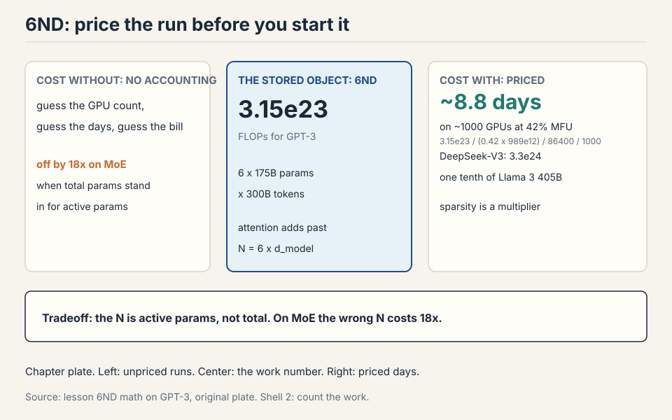
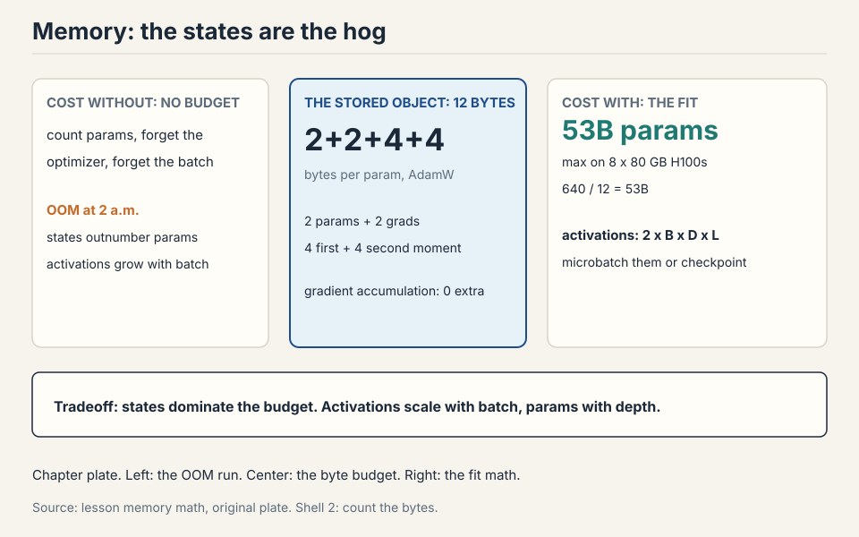
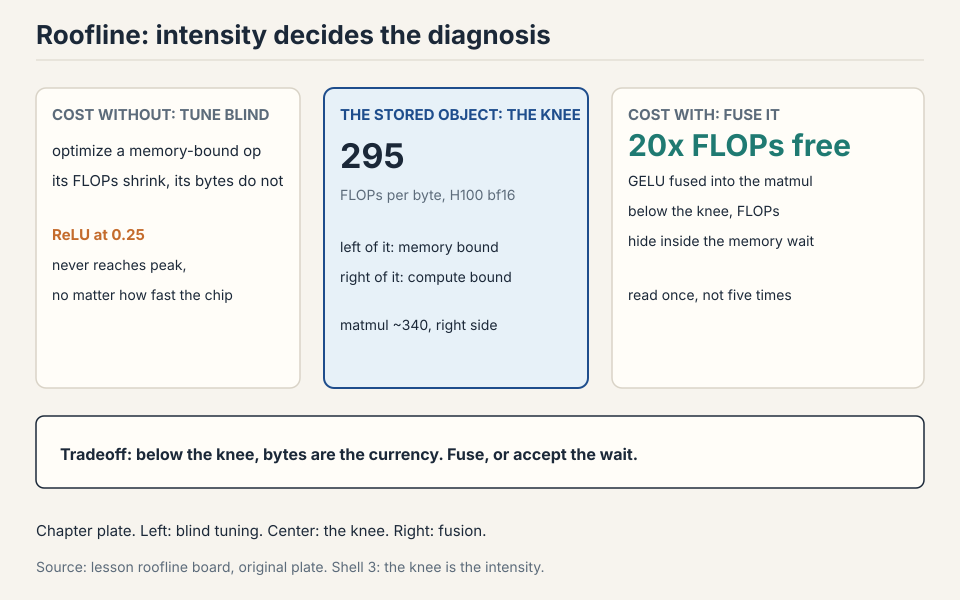

## How to read this lesson

No prerequisites are assumed. Every term is defined at first use.
This chapter builds the measurement system for training: how to price
a run in FLOPs, how to check the price against the hardware, and how
to fit the run in memory. Every later lecture spends the budget this
chapter defines.

## Two questions open the lecture

The professor walked in with news. The Marin project had finished a
1e23 FLOP training run, and the final loss landed within 0.05 of what
the scaling-law fits had predicted before the run started. The
forecast matched the outcome. That is what good accounting buys: you
price the run before you pay for it.

Then he posed two questions. Every tool in this chapter exists to
answer them.

**Question 1.** How long to train a 70B parameter model on 15T tokens
on 1024 H100s? Answer: 143 days.

**Question 2.** What is the largest model you can train on 8 H100s
with AdamW? Answer: about 53B parameters.

The goal of the course is plain: train the best model possible given a
finite set of resources. Resources mean compute and memory. Data is not
the limit here. Before you can optimize efficiency, you must measure
it.

## First attempt: count the arithmetic

Start with the pieces. Everything in training is a **tensor**: a grid
of numbers with any number of dimensions. Parameters are tensors.
Gradients are tensors. Optimizer states are tensors. Data and
activations are tensors.

### Subchapter: memory of one tensor

Memory for one tensor is simple: number of elements times bytes per
element. A 4x8 matrix in float32 holds 32 elements at 4 bytes each:
128 bytes. One matrix in GPT-3's feedforward layer is about 2.3 GB.
Tensors get big fast.

Work a real one. GPT-3's first feedforward matrix is 12,288 by
49,152. Elements: 12,288 x 49,152 = 603,979,776. In fp32: 2.4 GB.
In bf16: 1.2 GB. One matrix, one layer, over a gigabyte. A 96-layer
model holds 96 of them.

### Subchapter: FLOPs is work, FLOP/s is speed

A **FLOP** is one floating-point operation: an addition, a
multiplication, one unit of math. FLOP/s is hardware speed: how many
of those the chip does per second. The pet peeve: FLOPs with a
lowercase s is work done. FLOP/s is speed. GPT-3 took about 3.15e23
FLOPs of work. The H100 promises 989 TFLOP/s of speed in dense bf16.
Time equals work divided by speed.


### Subchapter: the matmul dominates everything

The dominant op is the matrix multiply. A matmul of B x D by D x K
costs 2 x B x D x K FLOPs. Each output entry needs D multiplications
and D-1 additions. Round D-1 to D: 2 FLOPs per triple. Elementwise
ops cost just the matrix size: addition on m x n costs mn FLOPs. No
other op rivals matmul at large sizes, so accounting focuses on
matmuls.

Work it on a real layer. Batch 2M tokens, d_model 4,096, ff dim
16,384. The up-projection: 2 x 2e6 x 4,096 x 16,384 = 2.68e14 FLOPs.
One matmul, one step, 2.68e14 operations. The elementwise GELU on the
same activations: 2e6 x 16,384 = 3.3e10 FLOPs. The matmul is about
8,192 times bigger. Eight thousand, not eight million. This is why the chapter counts matmuls and
ignores almost everything else.

### Subchapter: reframe as tokens times parameters

Reframe the matmul cost. B is the number of data points. D x K is the
parameter count. The forward pass of one linear layer costs 2 x
tokens x parameters. Hold that shape. It grows into the 6ND rule.

### Subchapter: the naive recipe

So the naive recipe for Question 1: total FLOPs = 6 x parameters x
tokens (the 6 comes from forward plus backward, derived below). Look
up the H100 speed on the spec sheet. Multiply by a utilization
factor. Divide. Done.

Benchmarking honesty: GPUs run asynchronously. Wrap timing with
`torch.cuda.synchronize()` before and after, average several runs, or
your numbers are fiction.

## Where the naive recipe breaks

The recipe works on paper and fails in four specific ways. Each one
has numbers.

### Break 1: the wrong precision corrupts everything

A float32 number has 32 bits: 1 sign bit, 8 exponent bits, 23 mantissa
bits. The exponent sets dynamic range: how big and how small the
numbers can be. The mantissa sets resolution: how finely they are
spaced.

Cut the bits in half and you get float16: 1 sign, 5 exponent, 10
mantissa. The 5-bit exponent kills dynamic range. The value 1e-8
rounds to zero. Gradients in training routinely hit 1e-8. Train in
fp16 and you get underflow, overflow, and NaNs. The arithmetic is fast
but the answers are garbage.

**bf16** was built in 2018 to fix this. Same 16 bits, different
split: 1 sign, 8 exponent, 7 mantissa. The exponent keeps fp32's 8
bits, so bf16 has fp32's full dynamic range with worse resolution.
Deep learning tolerates sloppy resolution: gradients are noisy
anyway. It does not tolerate overflow. bf16 is the sweet spot.

**Precision ladder: fewer bits, same range, less resolution.** bf16 keeps
fp32's exponent. That is the whole trick.

| Format | Bits | Sign+exp+mantissa | Verdict | Bytes |
|---|---|---|---|---|
| fp32 | 32 | 1+8+23 | safe default | 4 |
| fp16 | 16 | 1+5+10 | underflows: 1e-8 rounds to 0 | 2 |
| bf16 | 16 | 1+8+7 | sweet spot for training | 2 |
| fp8 | 8 | E4M3 / E5M2 | two variants, range vs precision | 1 |
| nvfp4 | 4 | block-scaled | Nemotron 3 Super trained in it | 0.5 |

### Subchapter: the fp8 two-format problem

Below bf16, the frontier keeps pushing. **fp8** has no single format:
**E4M3** (4 exponent bits, 3 mantissa) favors range, **E5M2**
favors precision. You pick per tensor: weights and activations
usually take E4M3, gradients take E5M2 because they need the range.
The framework does this choosing for you (NVIDIA's Transformer
Engine), but the choice exists and it matters.

Work the ranges. E4M3 maxes near 448. E5M2 maxes near 57,344. A
gradient of 1,000 fits in E5M2 and overflows E4M3. An activation of
0.001 fits both. Pick wrong and you get silent overflow: the numbers
look fine until the loss explodes. This is why mixed-precision
libraries expose per-tensor format overrides.

### Subchapter: the 4-bit frontier

**NVFP4** uses 4 bits per value with a per-block scale factor, so
neighbors share dynamic range. With 16 values per block and an 8-bit
scale, the effective cost is about 4.5 bits per value. DeepSeek-V3
trained natively in FP8 with tile-wise and block-wise quantization
(its technical report, Section 3). Nemotron 3 Super trained in fp4.
One-bit training has no credible result yet: the working recipe is
train in bf16, then quantize to 1-2 bits after.

The pattern across the ladder: each halving of the bits needs a new
trick to survive. fp16 died on range. bf16 fixed range by stealing
mantissa bits. fp8 needs two formats. fp4 needs block scales. The
tricks are the price of the bits.

### Subchapter: mixed precision, the standard recipe

Mixed precision is standard practice. Use bf16 for parameters,
activations, and gradients. Use fp32 for optimizer states: the
optimizer squares gradients and keeps running averages across
thousands of steps, and those tiny accumulated numbers underflow in
bf16. PyTorch AMP wraps your code and casts automatically: matmuls
go to bf16, exponentiation stays fp32.

Work why the optimizer needs fp32. Adam's second moment is a running
average of squared gradients. A gradient of 1e-4 squares to 1e-8.
bf16's smallest normal value is about 1e-38, so 1e-8 fits, but the
running average mixes 1e-8 updates into a 1.0-scale accumulator, and
bf16's 7 mantissa bits cannot resolve the addition: the update
rounds to zero and the state freezes. fp32's 23 mantissa bits resolve
it. The states are not the compute bottleneck, so paying 4 or 8
bytes per parameter there buys stability cheaply.

> [!QA]
> Q: Why is bf16 preferred over fp16 for training?
> A: bf16 keeps the 8-bit exponent of fp32, so it has the same dynamic range: no underflow of small gradients, no overflow of large activations. fp16 has only 5 exponent bits, so values like 1e-8 round to zero and training produces NaNs. Deep learning needs range more than resolution, because gradients are noisy anyway. That single bit-budget trade is why bf16 won.
> Follow-up: Why do optimizer states stay in fp32?
> A: The optimizer squares gradients and keeps running averages across steps. Those are tiny numbers accumulated over thousands of updates. In bf16 the squares underflow and the averages lose the signal. The states are not the compute bottleneck, so paying 4 or 8 bytes per parameter there buys stability cheaply.

### Break 2: the spec sheet lies, and you never reach it

The H100 lists 1979 TFLOP/s. The footnote says that number assumes
sparsity. Dense math, the kind training actually does, runs at half:
989 TFLOP/s. Always read the footnote.

And you never get the full 989. **Model FLOPs Utilization**, MFU, is
actual FLOP/s divided by spec-sheet FLOP/s. An MFU of 0.5 on a real
model is good. A pure matmul can reach 0.8. An MFU of 0.1 means
something is broken and you should fix it. You never exceed 1.0.

### Subchapter: the 143-day calculation, every step

Now answer Question 1 with the corrections in place.

```ascii
work:  6 x 70e9 params x 15e12 tokens = 6.3e24 FLOPs
speed: 1024 GPUs x 989e12 FLOP/s x 0.5 MFU = 5.07e17 FLOP/s
per day: 5.07e17 x 86400 = 4.38e22 FLOPs/day
days:  6.3e24 / 4.38e22 = 143.8 days
```

Read each line. The work comes from 6ND, derived below. The speed
halves the spec sheet (dense, not sparse) and multiplies by 0.5 MFU.
The division gives 143 days. Change the MFU to 0.4 and the answer
becomes 179 days. The estimate is only as good as the MFU guess,
which is why the chapter teaches you to measure MFU instead of
assuming it.

### Subchapter: what MFU numbers look like in public

Published runs rarely report MFU directly, but the arithmetic
checks. DeepSeek-V3: 2.788M H800-hours on 14.8T tokens with 37B
active parameters. Capacity: 2.788e6 x 3,600 x 989e12 = 9.9e24
FLOPs. Estimated work: 6 x 37e9 x 14.8e12 = 3.3e24. Ratio: about
one third. A real frontier run sustained roughly 0.33 of dense
peak, and that is a good number.

The lesson: when a lab announces a training run, run this check.
Capacity from GPU-hours and the spec sheet. Work from 6ND with the
active parameter count. The ratio tells you whether the run was
efficient or whether the announcement is hiding a slowdown.

### Break 3: moving data costs more than computing

Here is the break that reshapes everything. Hardware is two boxes:
HBM memory and the compute chip. Every op reads tensors from HBM,
computes, and writes back. Total time is the slower of move time and
compute time.

### Subchapter: ReLU, worked to the microsecond

Worked example: ReLU on a 1M-element bf16 vector. Bytes moved: read
2 bytes per element, write 2 bytes per element, 4 MB total. FLOPs:
1M comparisons. Move time: 4e6 bytes / 3.3e12 bytes/s = about 1
microsecond. Compute time: 1e6 / 989e12 = about 1 nanosecond. The op
spends its life waiting for bits. The compute is free by comparison.


### Subchapter: arithmetic intensity, the one ratio

**Arithmetic intensity** is FLOPs divided by bytes moved. The H100's
own intensity: 989e12 / 3.3e12 = about 295. An op with intensity
below 295 is memory bound: the chip waits on data. Above 295,
compute bound.

| Op | Bytes | FLOPs | Intensity | Bound by |
|---|---|---|---|---|
| ReLU | 4n | n | 0.25 | memory |
| GELU | 4n | 20n | 5 | memory |
| Softmax (row) | 6n | 5n | 0.83 | memory |
| LayerNorm | 8n | 5n | 0.63 | memory |
| Dot product | 4n | 2n | 0.5 | memory |
| Matvec | 2n^2 | 2n^2 | ~0.5 | memory |
| Matmul | 6n^2 | 2n^3 | n/3 ~ 340 | compute |

GELU does 20x the work of ReLU per element, yet runs no slower:
both are memory bound, so the extra FLOPs are free. Matmul is the
only compute-bound op here, because it does n^3 work on n^2 bytes.
Intensity grows with matrix size, which is why large batches and
large matrices saturate GPUs.

> [!QA]
> Q: Your training run reports MFU 0.15. What do you check first?
> A: Memory bottlenecks. Low MFU with high FLOP counts means the GPUs wait on data movement instead of computing. Check arithmetic intensity of your ops, batch sizes, and whether small elementwise ops dominate the profile. Compute the intensity, compare to 295, and find the memory-bound ops.
> Follow-up: Why can a run with huge FLOP counts still have low MFU?
> A: Because MFU divides actual throughput by peak throughput. If every op is memory bound, the chip spends its time waiting for HBM and the achieved FLOP/s sits far below peak. The fix is not more FLOPs but higher intensity: bigger matmuls, larger batches, fewer elementwise passes.

### Subchapter: the inference foreshadow

The intensity table already predicts the inference lecture.
Generating one token at a time is a matrix-vector product, hence
memory bound. Training processes whole sequences at once, hence
compute bound. Same hardware, same model, different regime: the
batch size flips the intensity. Remember this when the inference
lecture prices decode.

### Break 4: the memory budget decides what fits

Question 2 is a memory question. Four residents live in GPU memory
during training.


| Resident | Bytes | Notes |
|---|---|---|
| Parameters | 2 x P | bf16 |
| Gradients | 2 x P | bf16, one copy of params |
| Activations | 2 x B x D x L | bf16, scales with batch |
| Optimizer (Adam) | 8 x P | fp32: 4 for m, 4 for v |

AdaGrad keeps one fp32 state per parameter: 4 bytes. Adam keeps two:
8 bytes. Optimizer states are the capacity hog: they decide whether
the model fits, even though they barely affect step speed.

### Subchapter: the 53B calculation, every step

```ascii
memory:  8 H100s x 80 GB = 640 GB
per param: 2 (params) + 2 (grads) + 8 (Adam m, v) = 12 bytes
max params: 640e9 / 12 = 53.3e9
```

About 53B parameters with AdamW. The quiz answer falls out directly.
Note what it excludes: activations, which depend on batch size and
sequence length. The 53B is the ceiling before activations. Real
fits are smaller.

### Subchapter: the optimizer zoo, by bytes per parameter

Not every optimizer costs 12 bytes. The choice moves the memory
ceiling.

```ascii
SGD:              2 + 2 + 0 = 4 bytes/param    (no state)
AdaGrad:          2 + 2 + 4 = 8 bytes/param    (one fp32 state)
Adam/AdamW:       2 + 2 + 8 = 12 bytes/param   (two fp32 states)
8-bit Adam:       2 + 2 + 2 = 6 bytes/param    (states quantized)
Adafactor:        2 + 2 + ~1 = ~5 bytes/param  (factored 2nd moment)
```

8-bit Adam (bitsandbytes) quantizes the m and v states to 8 bits
each with block-wise scales: 12 bytes becomes 6, and the model that
fit at 53B now fits at 106B. Adafactor goes further by factoring
the second moment into row and column vectors: the state is O(d)
instead of O(d^2) per matrix. The lecture's 12-byte figure is the
standard. The zoo is how you move the ceiling without buying GPUs.

> [!QA]
> Q: You have 8 H100s and want to train the biggest model possible. Walk me through the memory math.
> A: Start with the per-parameter budget. AdamW in mixed precision: 2 bytes for bf16 params, 2 for bf16 grads, 4 for fp32 first moment, 4 for fp32 second moment: 12 bytes per parameter. 8 H100s give 640 GB. 640e9 / 12 = 53.3B parameters. That is the ceiling before activations. Then check activations: 2 x batch x d_model x layers bytes in bf16, and shrink the batch or add checkpointing until it fits. If 53B is not enough, switch to 8-bit Adam (6 bytes/param, ceiling doubles to 106B) or shard the optimizer states across GPUs, which the parallelism lectures cover.
> Follow-up: Why not just use SGD at 4 bytes per parameter?
> A: Because the optimizer affects convergence, not just memory. Adam's adaptive steps train transformers far better than SGD in practice: the per-parameter learning rates handle the wildly different gradient scales across layers. The memory is the price of the convergence. Nobody trains frontier models with SGD to save 8 bytes per parameter.

## The key question

The naive recipe counts arithmetic and assumes the chip delivers it.
But the ReLU example shows the chip waiting a thousand times longer
than it computes. What if the measurement system tracked data
movement with the same care it tracks FLOPs? That question gives the
roofline.

## The roofline: one plot, one diagnosis

Plot intensity on the x-axis and realized FLOP/s on the y-axis. Each
accelerator is a roofline: a rising ramp capped by its peak FLOP/s.


Ops left of the knee never reach the peak, no matter how well
written. ReLU sits at 0.25, GELU at 5, both deep in memory-bound
territory. Matmul at about 340 sits right of the knee and can
saturate the chip. This plot is the diagnostic: compute your op's
intensity, find it on the x-axis, read your ceiling. If you sit left
of 295, no amount of kernel tuning gets you to peak. You must change
the op or its shape.

### Subchapter: the knee moves with the chip

The knee is peak FLOPs divided by bandwidth. Compute it per chip.

```ascii
H100: 989e12 / 3.35e12  = 295
H200: 989e12 / 4.80e12  = 206
B200: ~4.5e15 / 8.0e12   = ~562  (FP8 dense, vendor spec)
```

The H200's extra bandwidth moves the knee left: more ops become
compute bound on the H200 than on the H100. The B200's enormous FP8
peak moves the knee far right: at low precision, almost everything
is memory bound on Blackwell. The roofline is per-chip. Carry the
right knee or the diagnosis is wrong.

### Subchapter: the roofline as a debugging workflow

The lecture's debugging order, made explicit:

1. Profile one step. Find the op eating the most time.
2. Compute its intensity: FLOPs divided by bytes moved.
3. Find it on the roofline. Read the ceiling.
4. If the op sits left of the knee, do not tune it. Fuse it into a
   neighbor or delete it.
5. If it sits right of the knee and underperforms, tune it: the
   headroom is real.

The most common mistake is step 4 in reverse: teams fuse and tile a
memory-bound elementwise op, gain nothing, and miss the real fix.
The roofline exists to prevent exactly that.

## The 6ND rule, derived

Now derive the number that prices Question 1. Zoom into one linear
layer. Forward: h2 = h1 @ w2. The backward pass computes two
gradients.

```ascii
forward:  h2[batch, out] = sum_in h1[batch, in] * w2[in, out]
backward: dh1[batch, in]  = sum_out dh2[batch, out] * w2[in, out]
          dw2[in, out]    = sum_batch dh2[batch, out] * h1[batch, in]
```

Each backward line is a matmul over the same three dimensions, so
each costs the same as the forward. Two of them: the backward pass
is exactly 2x the forward pass.


Total: 2ND forward + 4ND backward = 6ND FLOPs per training step,
where N is parameters and D is tokens. This holds for transformers
too, as long as context length stays modest: with very long contexts
the n^2 attention term needs separate accounting.

> [!QA]
> Q: Derive the 6 in the 6ND rule.
> A: One linear layer forward costs 2 FLOPs per parameter per token: one multiply and one add. The backward pass computes two gradients, each a matmul over the same dimensions, so it costs 2 x 2 = 4 FLOPs per parameter per token. Add forward and backward: 2 + 4 = 6. The rule counts multiply-adds across all parameters and all tokens in the batch.
> Follow-up: When does 6ND underestimate?
> A: When attention dominates: its cost grows with sequence length squared, which 6ND ignores. For long-context training you add the attention term separately. It also ignores the optimizer step and elementwise ops, but those are small next to the matmuls.

### Subchapter: when 6ND breaks (the attention term)

The 6ND rule counts parameters, not pairs. The attention score matrix
costs extra: QK^T and the value mix each cost 2N^2 d per layer for N
tokens of width d. Forward plus backward triples it: about 12Nd extra
FLOPs per token per layer.

Compare with the parameter work: roughly 72d^2 FLOPs per token per
layer (6 times about 12d^2 parameters per layer). The ratio is 12Nd /
72d^2 = N / (6d). Worked numbers for d = 4,096:

- N = 4,096: ratio = 4,096 / 24,576 = 0.17. Attention adds 17% on top
  of 6ND. The lecture's caveat holds: 6ND is fine here.
- N = 32,768: ratio = 1.33. Attention costs more than all the
  parameters combined. 6ND now misses half the bill.
- N = 131,072: ratio = 5.3. Attention is 5 times the parameter work.
  6ND misses most of the bill.

The crossover sits near N = 6 times d_model. For a d = 4,096 model
that is about 24K tokens. Below it, 6ND prices the run. Above it,
add the attention term. Long-context training budgets and all
long-context inference budgets must carry the N^2 term.


### Subchapter: 6ND on the three public runs

Apply the rule to three announced runs. The table reads the press
releases through the chapter's lens.

| Run | Params (active) | Tokens | 6ND work | Reported GPU-hours |
|---|---|---|---|---|
| GPT-3 | 175B | 300B | 3.15e23 (paper) | not public |
| Llama 3 405B | 405B | 15.6T | 3.8e25 | 30.8M H100-hours |
| DeepSeek-V3 | 37B active of 671B | 14.8T | 3.3e24 | 2.788M H800-hours |

Check Llama 3 405B. Capacity: 30.8e6 x 3,600 x 989e12 = 1.1e26.
Work: 3.8e25. Ratio: 0.35. Another frontier run at about one third
of dense peak. The pattern holds: sustained MFU near 0.3 to 0.5 is
what good looks like.

The lesson of the table: DeepSeek-V3 reached frontier tier at
roughly one tenth the FLOPs of Llama 3 405B (3.3e24 vs 3.8e25). MoE
sparsity is a cost multiplier, not an architecture footnote. The
active parameter count is the N in 6ND, not the total. Get that
wrong and the estimate is off by 18x.

The figure for the three public runs is the markdown table in the "6ND on the three public runs" subchapter above.

## Two memory tricks that change the budget

Activations scale with batch size: 2 x B x D x L bytes. Large batches
stabilize training up to a critical batch size, but they may not fit
in memory. Two tricks buy back the budget.

### Subchapter: gradient accumulation, worked

**Gradient accumulation** splits the batch into microbatches. Run one
microbatch, add its gradients without zeroing, repeat, and step the
optimizer every B/microbatch steps. Effective batch size B with the
activation memory of one microbatch. Zero extra compute.

Work it. Target batch: 4M tokens. GPU fits 0.5M tokens of
activations. Accumulation steps: 4M / 0.5M = 8. Run 8 microbatches,
summing gradients each time. Step the optimizer once. The math is
identical to one 4M-token batch: gradients are linear, so summing 8
microbatch gradients equals the full-batch gradient. The price is
wall-clock: 8 forward-backward passes before one optimizer step,
which is the same compute as the full batch would have been. The win
is memory: activations never exceed 0.5M tokens.

### Subchapter: activation checkpointing, worked

**Activation checkpointing** attacks depth instead of batch. Training
stores every layer's activations for the backward pass.
Checkpointing stores only a subset and recomputes the rest during
backward.


The trade: memory down, compute up. Store nothing and recompute costs
O(L^2). The sweet spot stores every sqrt(L)-th layer: O(sqrt(L))
memory and O(sqrt(L)) extra compute. In PyTorch, wrap a block with
`torch.utils.checkpoint`: the block runs forward without saving
intermediates, then recomputes them on the backward pass.

Work it on 64 layers. Store every 8th layer: 8 checkpoints. Memory:
8 layers of activations instead of 64, an 8x cut. Recompute: each
backward segment replays at most 8 layers, so the extra compute is
about 8/64 = 12.5 percent of the forward pass per segment, roughly
30 percent of a step overall. The chapter's number.

> [!QA]
> Q: When do you reach for gradient accumulation vs activation checkpointing?
> A: Gradient accumulation when the batch does not fit: it cuts activation memory by the accumulation factor with zero extra compute, but it does not change per-layer memory. Activation checkpointing when depth does not fit: it cuts activation memory to O(sqrt(L)) at the cost of about 30% extra compute from recomputation. Use both when both batch and depth are large. Neither reduces parameter or optimizer memory: that needs sharding or offloading, covered in the parallelism lectures.
> Follow-up: Why sqrt(L) spacing for checkpoints?
> A: Store nothing and recompute everything and the backward pass costs O(L^2): each layer's recompute replays the whole chain. Store every k-th layer and the cost is L/k memory plus k recompute per layer. Minimizing the sum gives k = sqrt(L): O(sqrt(L)) memory and O(sqrt(L)) extra compute. It is the balance point.

## einops: names instead of indices

One tool for reading the code you will write. `x.transpose(-2, -1)`
forces you to track what -2 and -1 mean. einops names the dimensions
instead.

### Subchapter: einsum, the named contraction

einsum is generalized matrix multiplication with bookkeeping. Name
each dimension. Dimensions that appear on both inputs but not the
output get summed out.

```ascii
shapes:  x is 3 x 4,  y is 4 x 3
index soup:  z[i,j] = sum_k x[i,k] * y[k,j]   # what is k?
named:       x[seq1, hidden] * y[hidden, seq2] -> z[seq1, seq2]
```

The named version needs no transpose: the names do the work.

### Subchapter: the attention einsums

The attention you will write in the next lecture is three einsums.
With batch b, heads h, query positions q, key positions k, head dim
d:

```ascii
scores:  q[b, h, q, d] * k[b, h, k, d] -> s[b, h, q, k]
output:  s[b, h, q, k] * v[b, h, k, d] -> o[b, h, q, d]
```

Read the first: the d dims match on both inputs and vanish from the
output, so d is summed out. The q and k dims survive: the output is
the score matrix. No transpose call, no dim arguments, no bug where
-2 meant the wrong axis. The names are the documentation.

### Subchapter: rearrange and reduce

With batches, heads, and sequences stacked, `...` absorbs the batch
dimensions you do not want to name. `reduce` generalizes sum, mean,
max, min over named dimensions. `rearrange` splits or merges
dimensions, for example splitting a width-8 dimension into 2 heads x
4 hidden before a per-head operation.

```ascii
rearrange:  x[batch, seq, (heads * dim)] -> x[batch, seq, heads, dim]
```

The head split for multi-head attention is one rearrange. The
alternative is view plus transpose plus a comment explaining the
comment. Names win.

> [!QA]
> Q: What does einops buy you over raw PyTorch index ops?
> A: Correctness and readability, not speed: it compiles to the same primitives. Named dimensions make the contraction pattern explicit, so transpose bugs and wrong-axis reductions become visible. In attention code with batch, head, and sequence dimensions, that clarity prevents the most common shape bugs.
> Follow-up: When would you not use einops?
> A: In the innermost hot loop where you need a fused kernel anyway, you write the kernel directly. einops is for model code, where clarity dominates and the ops lower to the same cuBLAS calls.

## The batch size question

The chapter's tricks assume a batch. But how big should the batch be?
Too small and the GPUs idle: the matmuls are too thin to saturate.
Too large and you waste compute: beyond a point, doubling the batch
barely reduces the steps needed.

### Subchapter: the critical batch size

The **critical batch size** is the point where doubling the batch
stops halving the steps to the same loss. Below it, bigger batches
train faster in wall-clock: the same number of steps, each step
covering more data. Above it, bigger batches just burn FLOPs: the
steps do not fall, so the extra data per step is wasted.

Work it. Suppose 1M-token batches need 100K steps. 2M-token batches
need 55K steps: not half, because the extra data has diminishing
returns. 4M-token batches need 45K steps. The critical batch size is
near 2M here: the 1M to 2M doubling bought real speed, the 2M to 4M
doubling bought little. GPT-3 used about 3.2M tokens per batch.
Llama 3 used up to 16M. The number grows with model size: bigger
models have larger critical batch sizes.

### Subchapter: batch size meets the memory budget

The batch sets the activation memory: 2 x B x D x L bytes in bf16.
Work it for a 70B-class model: B = 4M tokens, D = 8,192, L = 80.

```ascii
activations = 2 x 4e6 x 8192 x 80 = 5.2e15 bytes = 5.2 PB
```

That does not fit anywhere. This is why the chapter's two tricks
exist: gradient accumulation splits the 4M into microbatches that
fit, and checkpointing cuts the per-microbatch depth cost. The
batch size you want (past critical) and the batch size that fits
are different numbers. The tricks bridge them.

### Subchapter: gradient noise and why big batches work at all

Why does any of this work? The gradient from one batch is a noisy
estimate of the true gradient. Bigger batches average more samples,
so the estimate is cleaner. The **gradient noise scale** measures
how much noise: when the noise is large relative to the signal,
bigger batches help a lot. When the noise is small, they do not.

Early in training, gradients are noisy and big batches help. Late
in training, the model is near a minimum, gradients are small and
clean, and batch size matters less. Some labs grow the batch size
during training: start small, end large. The schedule follows the
noise.

## Communication: the tax the 143 days ignored

The 143-day estimate assumed each GPU computes independently. Real
training synchronizes gradients across all 1024 GPUs every step.
That synchronization is an **all-reduce**: every GPU sends its
gradients, receives everyone else's sum, and the result is identical
everywhere.

### Subchapter: the all-reduce cost, worked

A 70B model in bf16 has 140 GB of gradients. The all-reduce moves
about 2x the gradient size per GPU (send plus receive): 280 GB per
step per GPU. NVLink, NVIDIA's GPU-to-GPU interconnect, moves
900 GB/s inside a node. Between nodes, InfiniBand, the
high-speed fabric that links nodes together, moves about
50 GB/s per GPU.

```ascii
intra-node:  280 GB / 900 GB/s  = 0.31 s per step
inter-node:  280 GB / 50 GB/s   = 5.6 s per step
```

A training step's compute is a few seconds. The communication is a
similar size. This is why the 143-day estimate is optimistic: with
communication, the real number is higher. Overlapping
communication with the backward pass (start the all-reduce for
early layers while later layers still compute gradients) hides much
of it, but never all.

### Subchapter: why the tax grows with GPUs

Double the GPUs and the per-GPU compute halves, but the all-reduce
volume stays the same: every GPU still moves 280 GB. Past a point,
adding GPUs adds communication without adding speed. The scaling
efficiency (speedup divided by GPU count) falls. This is the force
behind the parallelism lectures: tensor parallelism keeps the
all-reduce inside fast NVLink, pipeline parallelism cuts the
gradient volume per stage. The 143 days assumed perfect scaling.
Perfect scaling does not exist.

## MFU killers: the checklist

MFU 0.5 is good. When it reads 0.2, run this list in order.

### Subchapter: killer 1, the dataloader starves the GPU

The GPU computes in milliseconds. The dataloader reads from disk,
decompresses, tokenizes, and batches on the CPU. If the CPU cannot
feed batches fast enough, the GPU idles between steps. The symptom:
GPU utilization oscillates, high then zero. The fix: more data
workers, pinned memory, prefetching. Profile the step time with and
without the dataloader: if removing it doubles speed, the feeder is
the bottleneck, not the model.

### Subchapter: killer 2, the batch is too thin

Small batches make thin matmuls. A matmul of 512 x 4,096 x 4,096
has intensity 512/3 = 170: left of the 295 knee, memory bound. The
same op at batch 4,096 has intensity 1,365: compute bound. The
arithmetic is identical per token. The intensity is not. Thin
batches are the most common MFU killer in fine-tuning, where batch
sizes are small and nobody retunes.

### Subchapter: killer 3, CPU-side overhead

Every kernel launch crosses from Python to the GPU driver. Ten
thousand tiny kernels per step means ten thousand crossings. The
GPU finishes each kernel in microseconds and waits for the next
launch command. The symptom: the profiler shows gaps between
kernels. The fix: torch.compile fuses the kernels (fewer
launches), or CUDA graphs replay the whole step as one launch.
Eager PyTorch with small ops is the classic shape of this failure.

### Subchapter: killer 4, communication without overlap

The all-reduce from the previous section, run naively: compute the
full backward pass, then communicate, then step. The GPUs sit idle
during the communication. The fix is overlap: bucket the gradients
and all-reduce each bucket as soon as its backward pass finishes.
PyTorch DDP does this by default. Custom training loops sometimes
do not. Check that overlap is actually on before blaming the
network.

## What is used where: the precision census

Every frontier lab trains in mixed precision. The recipe converged,
with one frontier pushing further. Facts verified against public
papers as of October 2026.

| Lab / model | Compute precision | Optimizer states | Notes | Source |
|---|---|---|---|---|
| Industry standard | bf16 | fp32 | the default since 2021 | lecture 2; mixed-precision literature |
| DeepSeek-V3 | FP8 (E4M3/E5M2), tile + block scales | fp32 [uncertain] | native FP8 training, 2.788M H800-hours | DeepSeek-V3 technical report, Section 3 |
| Nemotron 3 Super | fp4 (NVFP4) | [uncertain] | per-block scales, lecture-cited | lecture 2 |
| Inference standard | fp8 / int8 / fp4 weights | n/a | post-training quantization | lecture 2; quantization literature |

Read it. Training converged on bf16 compute with fp32 states: the
chapter's recipe is the industry's recipe. DeepSeek-V3 is the
outlier that made FP8 training work at scale, with fine-grained
quantization (tile-wise for activations, block-wise for weights) to
survive the range problems. The 4-bit frontier is training, not
just inference, as of 2026.

> [!QA]
> Q: Walk me through diagnosing a slow training step with the roofline, numbers included.
> A: Profile one step and find the dominant op. Say the profile shows GELU taking 40% of step time. Compute its intensity: GELU moves 4n bytes and does 20n FLOPs, so intensity is 5. The H100 knee is 295. Intensity 5 sits far left: memory bound. The ceiling is bandwidth times intensity: 3.3e12 x 5 = 16.5 TFLOP/s, a tiny fraction of the 989 peak. No kernel rewrite fixes that. The op must be fused into a neighbor or deleted. Compare with the matmul at intensity about 340: its ceiling is the 989 peak, so if the matmul underperforms, tuning actually pays. The workflow: compute intensity, find the position on the roofline, read the ceiling, then decide whether to tune the op or change the math.
> Follow-up: What is the single most common roofline mistake?
> A: Optimizing the arithmetic of a memory-bound op. Teams fuse and tile an elementwise op sitting at intensity 5, gain nothing, and miss the real fix: fewer passes over the data. Fuse it into the neighboring matmul or remove it.

> [!QA]
> Q: Your lab has 64 H100s for 30 days. Roughly what is the biggest model you can train?
> A: Budget first. 64 GPUs x 30 days x 86,400 seconds x 989e12 FLOP/s x 0.5 MFU = 8.2e22 FLOPs. Now invert 6ND. Pick 20 tokens per parameter, the Chinchilla-ish optimum: N = sqrt(8.2e22 / 120) = sqrt(6.8e20) = 2.6e10. About 26B parameters on 520B tokens. Check memory: 12 bytes x 26e9 = 312 GB across 64 GPUs, about 5 GB per GPU. That fits easily with room for activations. The interview signal: quote the budget, state the MFU and token assumptions, invert the rule, then check memory. Anyone who skips the memory check is guessing.
> Follow-up: Why 20 tokens per parameter?
> A: The Chinchilla optimum is roughly 20 tokens per parameter for compute-optimal training. Spending the budget there gives the best model for the FLOPs. Train longer on fewer parameters only when inference cost dominates, which is a serving decision, not a training one.

## Mapping back: the tools answer the two questions

| Question | Tool | The correction it adds |
|---|---|---|
| 143 days to train 70B | 6ND | Prices the work: 2 forward + 4 backward per parameter per token. |
| 143 days | Dense spec 989 TFLOP/s | Halve the 1979 number: the footnote assumes sparsity. |
| 143 days | MFU ~0.5 | You never reach spec. Real models get half. |
| Why MFU is low | Intensity vs 295 | Left of the knee: memory bound. No kernel fix reaches peak. |
| 53B on 8 H100s | 12 bytes per param | 2 params + 2 grads + 8 Adam states. 640 GB / 12 = 53B. |
| Batch too big | Gradient accumulation | Microbatches, same effective batch, zero extra compute. |
| Depth too deep | Checkpointing | Store sqrt(L), recompute the rest, ~30% extra compute. |
| Attention at long context | N/(6d) correction | Below 6x d_model, 6ND holds. Above, add the term. |

## The honest price

Every number in this chapter is a back-of-the-envelope. The 143-day
estimate ignores communication overhead and assumes a flat 0.5 MFU.
Real runs vary. The 53B figure excludes activations, which depend on
batch size and sequence length. 6ND ignores attention's n^2 term: it
underestimates long-context training. Mixed precision details (which
ops stay fp32) are handled by AMP heuristics, not derived here.

The deeper price: this chapter prices training. Inference is a
different economy. Training is compute bound (whole sequences at
once). Inference is memory bound (one token at a time, a
matrix-vector product). The intensity table already shows why: a
matvec sits at intensity ~0.5, far left of the knee. The inference
lecture spends a full chapter on that world.







## Recap: the whole lesson on one screen

The story in eight steps. Each step answers the one before it.

1. **Two questions.** 143 days to train 70B on 1024 H100s. 53B max on
   8 H100s with AdamW. Every tool below exists to answer them.
2. **Count the arithmetic.** Tensors: elements x bytes. Matmul: 2BDK
   FLOPs. FLOPs is work, FLOP/s is speed. Time = work / speed.
3. **Precision can corrupt.** fp16 underflows: 5 exponent bits, 1e-8
   rounds to zero, NaNs. bf16 keeps fp32's 8-bit exponent: same range,
   16 bits, the sweet spot. fp8 needs two formats. fp4 needs block
   scales.
4. **The spec lies.** 1979 TFLOP/s assumes sparsity. Dense is 989.
   MFU: actual over promised. 0.5 is good, 0.1 is broken. DeepSeek-V3
   and Llama 3 405B both sustained about one third.
5. **Movement dominates.** ReLU on 1M values: 1 microsecond moving, 1
   nanosecond computing. Intensity = FLOPs / bytes. The H100 knee is
   295. GELU's extra FLOPs are free.
6. **Backward is 2x forward.** Two gradients per layer, each a matmul
   over the same dimensions. Total: 6ND. The price of every training
   run. Add the attention term past N = 6 x d_model.
7. **Memory decides what fits.** AdamW: 2 + 2 + 4 + 4 = 12 bytes per
   parameter. Optimizer states are the capacity hog. The zoo (8-bit
   Adam, Adafactor) moves the ceiling.
8. **Two tricks buy budget.** Gradient accumulation: microbatches, zero
   extra compute. Checkpointing: store sqrt(L), recompute the rest,
   ~30% extra compute. einops names the dims so the code stays
   correct.

## Go deeper

<div style="position:relative;padding-bottom:56.25%;height:0;overflow:hidden;max-width:100%;margin:16px 0;">
<iframe style="position:absolute;top:0;left:0;width:100%;height:100%;" src="https://www.youtube-nocookie.com/embed/kuYAsz7zspQ" title="Stanford CS336 Spring 2026 Lecture 2: Resource Accounting" frameborder="0" allow="accelerometer; autoplay; clipboard-write; encrypted-media; gyroscope; picture-in-picture" allowfullscreen></iframe>
</div>
- Lecture 2, the session this chapter follows (the embed above): https://www.youtube.com/watch?v=kuYAsz7zspQ

<div style="position:relative;padding-bottom:56.25%;height:0;overflow:hidden;max-width:100%;margin:16px 0;">
<iframe style="position:absolute;top:0;left:0;width:100%;height:100%;" src="https://www.youtube-nocookie.com/embed/DfnV32AmtlE" title="The Memory Wall Explained (Roofline Model)" frameborder="0" allow="accelerometer; autoplay; clipboard-write; encrypted-media; gyroscope; picture-in-picture" allowfullscreen></iframe>
</div>
- The Memory Wall Explained, Roofline Model (the embed above): https://www.youtube.com/watch?v=DfnV32AmtlE
- Williams et al., Roofline: An Insightful Visual Performance Model: https://people.eecs.berkeley.edu/~kubitron/cs252/handouts/papers/RooflineVyNoYellow.pdf
- Micikevicius et al., Mixed Precision Training: https://arxiv.org/abs/1710.03740
- Kaplan et al., Scaling Laws for Neural Language Models: https://arxiv.org/abs/2001.08361
- einops documentation and tutorials: https://einops.rocks/

## Official sources and further reading

**Official:**
- Lecture 2 video and executable code (lecture_02.py): all numbers
  above are computed live in the notebook.
- einops tutorial: the named-dimension system used in the lecture.

**Further reading:**
- Williams et al., Roofline (2009): the visual performance model
  behind the intensity analysis.
- NVIDIA H100 spec sheet: the 1979 TFLOP/s figure and its sparsity
  footnote: https://www.nvidia.com/en-us/data-center/h100/
- DeepSeek-V3 Technical Report, Section 3: native FP8 training: https://arxiv.org/abs/2412.19437

**Caveats from these sources.** The 143-day estimate ignores
communication overhead and assumes a flat 0.5 MFU. Real runs vary. The
53B figure excludes activations, which depend on batch size and
sequence length. 6ND ignores attention's n^2 term: it underestimates
long-context training. Mixed precision details (which ops stay fp32)
are handled by AMP heuristics, not derived here. B200 FP8 numbers are
vendor specs, not measured.

## Connections to the other courses

- **CS229:** the loss chip is defined there. Here it becomes the work
  unit that 6ND prices.
- **CS336 later lectures:** 6ND prices every scaling-law fit. The
  intensity table returns in the inference lecture. The 12-bytes budget
  gets sharded by the parallelism lectures.
- **CS229S:** the device block and memory hierarchy here become the
  multi-GPU topology there.
- **CS329A:** test-time compute is priced in FLOPs with the same
  accounting.

> [!CHEAT]
> **Resource accounting cheatsheet.** Tensors: elements x bytes. Matmul: 2BDK FLOPs. Precision: bf16 compute, fp32 states, fp8 two formats, fp4 block scales. MFU: actual/spec, 0.5 good, 0.1 broken. Intensity: FLOPs/bytes, H100 knee 295. Roofline: find op, read ceiling, fuse or tune. 6ND: 2 forward + 4 backward. Attention correction: N/(6d), add term past 6x d_model. Memory: 12 bytes/param AdamW, 53B on 8 H100s. Tricks: accumulation (batch), checkpointing (depth, sqrt(L)). einops: name dims, einsum contracts.

> [!MEMORY]
> **The two questions.** 143 days for 70B on 1024 H100s. 53B max on 8 H100s. Every tool in the chapter answers one of them.

## Coverage map: every lecture claim, mapped

Each row ties a claim from Lecture 2 (transcript `sources/cs336/text/lec02.txt`,
video kuYAsz7zspQ) to the section that covers it.

| Session claim | Covered in | File line |
|---|---|---|
| Marin 1e23 FLOP run matched scaling-law forecast within 0.05 | Two questions open the lecture | 43 |
| Q1: 70B on 15T tokens, 1024 H100s = 143 days | Two questions open the lecture | 43 |
| Q2: largest model on 8 H100s with AdamW = 53B | Two questions open the lecture | 43 |
| Tensors: params, grads, optimizer states, activations | First attempt: count the arithmetic | 65 |
| Tensor memory = elements x bytes; GPT-3 FF matrix 2.3 GB | memory of one tensor | 72 |
| FLOP vs FLOP/s; GPT-3 3.15e23 FLOPs; H100 989 TFLOP/s dense | FLOPs is work, FLOP/s is speed | 84 |
| Matmul 2BDK FLOPs; elementwise ops cost mn | the matmul dominates everything | 95 |
| Forward of one layer = 2 x tokens x parameters | reframe as tokens times parameters | 111 |
| Benchmark honesty: cuda.synchronize, average runs | the naive recipe | 117 |
| fp32/fp16 bit splits; fp16 underflow at 1e-8, NaNs | Break 1 | 133 |
| bf16: 8 exponent bits, fp32 range, 7 mantissa bits | Break 1 | 133 |
| fp8 E4M3 vs E5M2; Transformer Engine per-tensor choice | the fp8 two-format problem | 154 |
| NVFP4 per-block scales; Nemotron 3 fp4; 1-bit not credible | the 4-bit frontier | 169 |
| Mixed precision: bf16 compute, fp32 optimizer states; AMP | mixed precision, the standard recipe | 184 |
| H100 1979 TFLOP/s assumes sparsity; dense is 989 | Break 2 | 208 |
| MFU defined; 0.5 good, 0.8 matmul max, 0.1 broken | Break 2 | 208 |
| 143-day calculation, every step shown | the 143-day calculation, every step | 219 |
| DeepSeek-V3 MFU check: 2.788M H800-hours, ratio ~1/3 | what MFU numbers look like in public | 237 |
| ReLU 1M bf16: 1 microsecond move, 1 nanosecond compute | ReLU, worked to the microsecond | 258 |
| Arithmetic intensity; H100 knee 295 | arithmetic intensity, the one ratio | 268 |
| Intensity table: ReLU 0.25, GELU 5, matmul n/3 | arithmetic intensity, the one ratio | 268 |
| GELU's extra FLOPs are free (memory bound) | arithmetic intensity, the one ratio | 268 |
| Decode is memory bound (matvec), training compute bound | the inference foreshadow | 297 |
| Four memory residents; Adam 12 bytes/param | Break 4 | 306 |
| 53B calculation: 640 GB / 12 bytes | the 53B calculation, every step | 324 |
| Optimizer zoo: SGD 4, AdaGrad 8, Adam 12, 8-bit 6, Adafactor 5 | the optimizer zoo, by bytes per parameter | 337 |
| Roofline plot; knee; diagnostic workflow | The roofline: one plot, one diagnosis | 371 |
| Knee per chip: H100 295, H200 206, B200 ~562 | the knee moves with the chip | 386 |
| 6ND derivation: backward is 2x forward | The 6ND rule, derived | 418 |
| Attention correction N/(6d); crossover at 6x d_model | when 6ND breaks (the attention term) | 447 |
| 6ND on GPT-3, Llama 3 405B, DeepSeek-V3 | 6ND on the three public runs | 472 |
| Gradient accumulation: microbatches, zero extra compute | gradient accumulation, worked | 502 |
| Activation checkpointing: sqrt(L) spacing, ~30% recompute | activation checkpointing, worked | 518 |
| einops: named dims; einsum; rearrange; attention einsums | einops: names instead of indices | 545 |
| Critical batch size; batch vs memory; gradient noise | The batch size question | 603 |
| All-reduce cost worked; tax grows with GPU count | Communication: the tax the 143 days ignored | 655 |
| MFU killers: dataloader, thin batch, CPU overhead, comms | MFU killers: the checklist | 695 |
| Precision census: bf16 standard, DeepSeek FP8, Nemotron fp4 | What is used where: the precision census | 738 |
